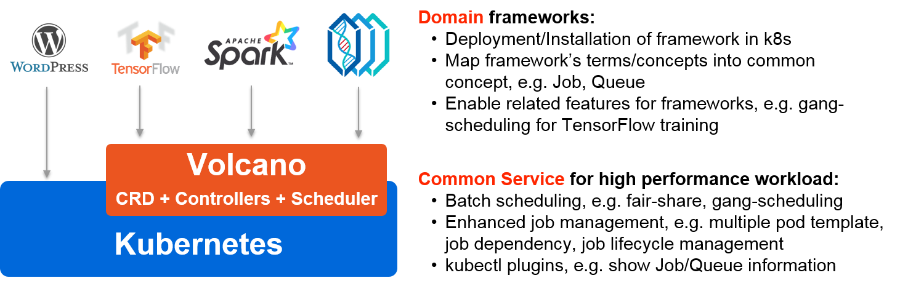

-------

[](https://travis-ci.org/volcano-sh/volcano)
[](https://goreportcard.com/report/github.com/volcano-sh/volcano)
[](https://github.com/volcano-sh/volcano)
[](https://github.com/volcano-sh/volcano/releases)
[](https://github.com/volcano-sh/volcano/blob/master/LICENSE)
[](https://bestpractices.coreinfrastructure.org/projects/3012)


Volcano is a batch system built on Kubernetes. It provides a suite of mechanisms that are commonly required by
many classes of batch & elastic workload including: machine learning/deep learning, bioinformatics/genomics and
other "big data" applications. These types of applications typically run on generalized domain frameworks like
TensorFlow, Spark, PyTorch, MPI, etc, which Volcano integrates with.

Volcano builds upon a decade and a half of experience running a wide
variety of high performance workloads at scale using several systems
and platforms, combined with best-of-breed ideas and practices from
the open source community.

**NOTE**: the scheduler is built based on [kube-batch](https://github.com/kubernetes-sigs/kube-batch);
refer to [#241](https://github.com/volcano-sh/volcano/issues/241) and [#288](https://github.com/volcano-sh/volcano/pull/288) for more detail.


Volcano is a sandbox project of the [Cloud Native Computing Foundation](https://cncf.io/) (CNCF). Please consider joining the CNCF if you are an organization that wants to take an active role in supporting the growth and evolution of the cloud native ecosystem. 

## Overall Architecture



## Talks

- [Intro: Kubernetes Batch Scheduling @ KubeCon 2019 EU](https://sched.co/MPi7)
- [Volcano 在 Kubernetes 中运行高性能作业实践 @ ArchSummit 2019](https://archsummit.infoq.cn/2019/shenzhen/presentation/1817)
- [Volcano：基于云原生的高密计算解决方案 @ Huawei Connection 2019](https://agenda.events.huawei.com/2019/cn/minisite/agenda.html#dayTab=day7&tagName=%7B%22language%22%3A%22Cn%22%7D&seminarId=1743)
- [Improving Performance of Deep Learning Workloads With Volcano @ KubeCon 2019 NA](https://sched.co/UaZi)
- [Batch Capability of Kubernetes Intro @ KubeCon 2019 NA](https://sched.co/Uajv)

## Ecosystem

- [Horovod/MPI](https://github.com/volcano-sh/volcano/tree/master/example/integrations/mpi)
- [kubeflow/tf-operator](https://www.kubeflow.org/docs/use-cases/job-scheduling/)
- [kubeflow/arena](https://github.com/kubeflow/arena/blob/master/docs/userguide/12-volcanojob.md)
- [paddlepaddle](https://github.com/volcano-sh/volcano/tree/master/example/integrations/paddlepaddle)
- [spark-operator](https://github.com/GoogleCloudPlatform/spark-on-k8s-operator/blob/master/docs/volcano-integration.md)
- [cromwell](https://github.com/broadinstitute/cromwell/blob/develop/docs/backends/Volcano.md)

## Quick Start Guide

### Prerequisites

- Kubernetes 1.12+ with CRD support


You can try volcano by one the following two ways.


### Install with YAML files

Install volcano on an existing Kubernetes cluster.

```
kubectl apply -f https://raw.githubusercontent.com/volcano-sh/volcano/master/installer/volcano-development.yaml
```

Enjoy! Volcano will create the following resources in `volcano-system` namespace.


```
NAME                                       READY   STATUS      RESTARTS   AGE
pod/volcano-admission-5bd5756f79-dnr4l     1/1     Running     0          96s
pod/volcano-admission-init-4hjpx           0/1     Completed   0          96s
pod/volcano-controllers-687948d9c8-nw4b4   1/1     Running     0          96s
pod/volcano-scheduler-94998fc64-4z8kh      1/1     Running     0          96s

NAME                                TYPE        CLUSTER-IP      EXTERNAL-IP   PORT(S)   AGE
service/volcano-admission-service   ClusterIP   10.98.152.108   <none>        443/TCP   96s

NAME                                  READY   UP-TO-DATE   AVAILABLE   AGE
deployment.apps/volcano-admission     1/1     1            1           96s
deployment.apps/volcano-controllers   1/1     1            1           96s
deployment.apps/volcano-scheduler     1/1     1            1           96s

NAME                                             DESIRED   CURRENT   READY   AGE
replicaset.apps/volcano-admission-5bd5756f79     1         1         1       96s
replicaset.apps/volcano-controllers-687948d9c8   1         1         1       96s
replicaset.apps/volcano-scheduler-94998fc64      1         1         1       96s

NAME                               COMPLETIONS   DURATION   AGE
job.batch/volcano-admission-init   1/1           48s        96s

```

### Install from code

If you don't have a kubernetes cluster, try one-click install from code base:

```bash
./hack/local-up-volcano.sh
```

## Meeting

Regular Community Meeting:

The Volcano team meets once per week on Friday, alternating between 10am Beijing Time ([Convert to your timezone.](https://www.thetimezoneconverter.com/?t=10%3A00&tz=GMT%2B8&)) and 3pm Beijing Time ([Convert to your timezone.](https://www.thetimezoneconverter.com/?t=15%3A00&tz=GMT%2B8&))

Resources:
- [Meeting notes and agenda](https://docs.google.com/document/d/1YLbF8zjZBiR9PbXQPB22iuc_L0Oui5A1lddVfRnZrqs/edit)
- [Meeting link](https://zoom.us/j/193601252)
- [Meeting Calendar](https://calendar.google.com/calendar/b/1/embed?src=volcano.sh.bot@gmail.com) | [Subscribe](https://calendar.google.com/calendar/b/1?cid=dm9sY2Fuby5zaC5ib3RAZ21haWwuY29t)

## Contact

If you have any question, feel free to reach out to us in the following ways:

[CNCF Slack Channel](https://cloud-native.slack.com/messages/volcano)

[Mailing List](https://groups.google.com/forum/#!forum/volcano-sh)
