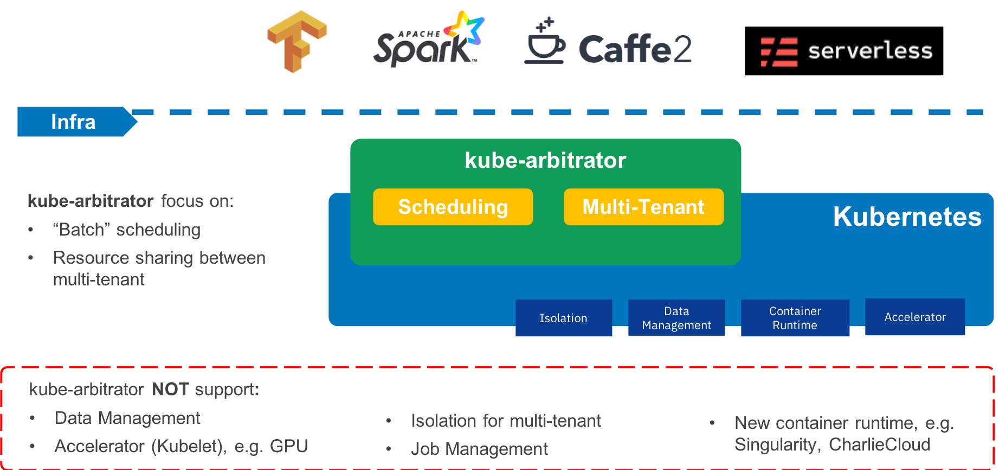

# kube-batch

`kube-batch` is a batch scheduler for Kubernetes, providing mechanisms for applications which would like to run batch jobs leveraging Kubernetes. 

`kube-batch` builds upon a decade and a half of experience on running batch workloads at scale using several systems, combined with best-of-breed ideas and practices from the open source community.

Refer to [tutorial](doc/usage/tutorial.md) on how to use `kube-batch` to run batch job in Kubernetes

## Overall Architecture

## Community, discussion, contribution, and support

Learn how to engage with the Kubernetes community on the [community page](http://kubernetes.io/community/).

You can reach the maintainers of this project at:

- Slack: #kubernetes-dev
- Mailing List: https://groups.google.com/forum/#!forum/kubernetes-dev

### Code of conduct

Participation in the Kubernetes community is governed by the [Kubernetes Code of Conduct](code-of-conduct.md).
