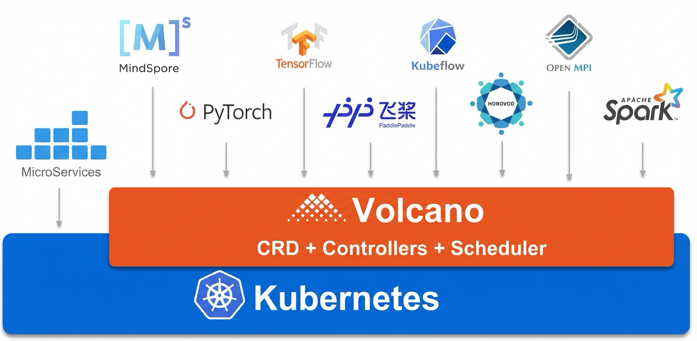

<a href="https://volcano.sh/">
    
</a>

-------

[](https://travis-ci.org/volcano-sh/volcano)
[](https://goreportcard.com/report/github.com/volcano-sh/volcano)
[](https://github.com/volcano-sh/volcano)
[](https://github.com/volcano-sh/volcano/releases)
[](https://github.com/volcano-sh/volcano/blob/master/LICENSE)
[](https://bestpractices.coreinfrastructure.org/projects/3012)
[](https://scorecard.dev/viewer/?uri=github.com/volcano-sh/volcano)
[](https://gurubase.io/g/volcano)


[Volcano](https://volcano.sh/) is a Kubernetes-native batch scheduling system, extending and enhancing the capabilities of the standard kube-scheduler. It provides a comprehensive set of features specifically designed to manage and optimize various batch and elastic workloads, including Artificial Intelligence (AI) / machine learning (ML) / deep learning (DL), bioinformatics / genomics, and other "Big Data" applications.

These workloads commonly leverage AI, Big Data, and HPC frameworks such as Spark, Flink, Ray, TensorFlow, PyTorch, Argo, MindSpore, PaddlePaddle, Kubeflow, MPI, Horovod, MXNet, KubeGene, and others, with which Volcano offers robust integration.

Volcano incorporates over fifteen years of collective experience in operating diverse high-performance workloads at scale across multiple systems and platforms. It combines proven best practices and innovative concepts from the open-source community to deliver a powerful and flexible scheduling solution.

As of 2025, Volcano has seen widespread adoption across numerous industries globally, including Internet/Cloud, Finance, Manufacturing, and Medical sectors. Many organizations and institutions are not only end-users but also active contributors to the project. Hundreds of contributors actively participate in code commits, pull request reviews, issue discussions, documentation updates, and design proposals. We encourage your participation in the ongoing development and growth of the Volcano project.


**NOTE**: the scheduler is built based on [kube-batch](https://github.com/kubernetes-sigs/kube-batch);
refer to [#241](https://github.com/volcano-sh/volcano/issues/241) and [#288](https://github.com/volcano-sh/volcano/pull/288) for more detail.


Volcano is an incubating project of the [Cloud Native Computing Foundation](https://cncf.io/) (CNCF). Please consider joining the CNCF if you are an organization that wants to take an active role in supporting the growth and evolution of the cloud native ecosystem. 

## Overall Architecture



## Talks

- [Intro: Kubernetes Batch Scheduling @ KubeCon 2019 EU](https://sched.co/MPi7)
- [Volcano 在 Kubernetes 中运行高性能作业实践 @ ArchSummit 2019](https://archsummit.infoq.cn/2019/shenzhen/presentation/1817)
- [Volcano：基于云原生的高密计算解决方案 @ Huawei Connection 2019](https://e.huawei.com/cn/material/event/HC/09099dce0070415e9f26ada51b2216d7)
- [Improving Performance of Deep Learning Workloads With Volcano @ KubeCon 2019 NA](https://sched.co/UaZi)
- [Batch Capability of Kubernetes Intro @ KubeCon 2019 NA](https://sched.co/Uajv)
- [Optimizing Knowledge Distillation Training With Volcano @ KubeCon 2021 EU](https://www.youtube.com/watch?v=cDPGmhVcj7Y&t=143s)
- [Exploration About Mixing Technology of Online Services and Offline Jobs Based On Volcano @ KubeCon 2021 China](https://www.youtube.com/watch?v=daqkUlT5ReY)
- [Volcano - Cloud Native Batch System for AI, Big Data and HPC @ KubeCon 2022 EU](https://www.youtube.com/watch?v=wjy35HfIP_k)
- [How to Leverage Volcano to Improve the Resource Utilization of AI Pharmaceuticals, Autonomous Driving, and Smart Buildings @ KubeCon 2023 EU](https://www.youtube.com/watch?v=ujHDV5xteqU)
- [Run Your AI Workloads and Microservices on Kubernetes More Easily and Efficiently @ KubeCon 2023 China](https://www.youtube.com/watch?v=OO7zpyf7fgs)
- [Optimize LLM Workflows with Smart Infrastructure Enhanced by Volcano @ KubeCon 2024 China](https://www.youtube.com/watch?v=77Qn1-I-muQ)
- [How Volcano Enable Next Wave of Intelligent Applications @ KubeCon 2024 China](https://www.youtube.com/watch?v=IzR7zJQ8vMw)
- [Leverage Topology Modeling and Topology-Aware Scheduling to Accelerate LLM Training @ KubeCon 2024 China](https://www.youtube.com/watch?v=IB54LHQQ8lI)


## Ecosystem

- [Spark Operator](https://www.kubeflow.org/docs/components/spark-operator/user-guide/volcano-integration/)
- [Native Spark](https://spark.apache.org/docs/3.5.0/running-on-kubernetes.html#using-volcano-as-customized-scheduler-for-spark-on-kubernetes)
- [Flink](https://github.com/GoogleCloudPlatform/flink-on-k8s-operator/blob/master/docs/volcano_integration.md)
- [KubeRay](https://docs.ray.io/en/master/cluster/kubernetes/k8s-ecosystem/volcano.html)
- [PyTorch](https://github.com/volcano-sh/volcano/blob/master/docs/user-guide/how_to_use_pytorch_plugin.md)
- [TensorFlow](https://github.com/volcano-sh/volcano/tree/master/example/integrations/tensorflow)
- [kubeflow/training-operator](https://www.kubeflow.org/docs/components/training/user-guides/job-scheduling/)
- [kubeflow/arena](https://github.com/kubeflow/arena/blob/master/docs/training/volcanojob/volcanojob.md)
- [MPI](https://github.com/volcano-sh/volcano/tree/master/example/integrations/mpi)
- [Horovod](https://github.com/volcano-sh/volcano/blob/master/example/kubecon-2019-china/horovod-sample/lm-horovod-tf-mnist-v0.5.yaml)
- [PaddlePaddle](https://github.com/volcano-sh/volcano/tree/master/example/integrations/paddlepaddle)
- [Cromwell](https://github.com/broadinstitute/cromwell/blob/develop/docs/backends/Volcano.md)
- [MindSpore](https://github.com/volcano-sh/volcano/tree/master/example/MindSpore-example)
- [MXNet](https://github.com/volcano-sh/volcano/tree/master/example/integrations/mxnet/train)
- [Argo](https://github.com/volcano-sh/volcano/tree/master/example/integrations/argo)
- [KubeGene](https://github.com/volcano-sh/kubegene)

## Use Cases
- [Why Spark chooses Volcano as built-in batch scheduler on Kubernetes?](https://www.cncf.io/blog/2022/06/30/why-spark-chooses-volcano-as-built-in-batch-scheduler-on-kubernetes/)
- [ING Bank: How Volcano empowers its big data analytics platform](https://www.cncf.io/blog/2023/02/21/ing-bank-how-volcano-empowers-its-big-data-analytics-platform/)
- [Using Volcano as a custom scheduler for Apache Spark on Amazon EMR on EKS](https://docs.aws.amazon.com/emr/latest/EMR-on-EKS-DevelopmentGuide/tutorial-volcano.html)
- [Deploy Azure Machine Learning extension on AKS or Arc Kubernetes cluster](https://learn.microsoft.com/en-us/azure/machine-learning/how-to-deploy-kubernetes-extension?view=azureml-api-2&tabs=deploy-extension-with-cli)
- [Practical Tips for Preventing GPU Fragmentation for Volcano Scheduler](https://developer.nvidia.com/blog/practical-tips-for-preventing-gpu-fragmentation-for-volcano-scheduler/)
- [Using Volcano in Large-Scale, Distributed Offline Computing](https://volcano.sh/en/blog/ruitian2-en/)
- [OpenI-Octopus: How to Avoid Resource Preemption in Kubernetes Clusters](https://volcano.sh/en/blog/pengcheng-en/)
- [How Does Volcano Empower a Content Recommendation Engine in Xiaohongshu](https://volcano.sh/en/blog/xiaohongshu-en/)
- [How Ruitian Used Volcano to Run Large-Scale Offline HPC Jobs](https://volcano.sh/en/blog/ruitian-en/)
- [Integrating Volcano into the Leinao Cloud OS](https://volcano.sh/en/blog/leinao-en/)
- [HPC on Volcano: How Containers Support HPC Applications in the Meteorological Industry](https://volcano.sh/en/blog/hpc-en/)
- [iQIYI:Volcano-based Cloud Native Migration Practices](https://volcano.sh/en/blog/aiqiyi-en/)
- [PaddlePaddle Distributed Training on Volcano](https://volcano.sh/en/blog/paddlepaddle-en/)

## Quick Start Guide

### Prerequisites

- Kubernetes 1.12+ with CRD support


You can try Volcano by one of the following two ways.

Note: 
* For Kubernetes v1.17+ use CRDs under config/crd/bases (recommended)
* For Kubernetes versions < v1.16 use CRDs under config/crd/v1beta1 (deprecated)

### Install with YAML files

Install Volcano on an existing Kubernetes cluster. This way is both available for x86_64 and arm64 architecture.

```
kubectl apply -f https://raw.githubusercontent.com/volcano-sh/volcano/master/installer/volcano-development.yaml
```

Enjoy! Volcano will create the following resources in `volcano-system` namespace.


```
NAME                                       READY   STATUS      RESTARTS   AGE
pod/volcano-admission-5bd5756f79-dnr4l     1/1     Running     0          96s
pod/volcano-controllers-687948d9c8-nw4b4   1/1     Running     0          96s
pod/volcano-scheduler-94998fc64-4z8kh      1/1     Running     0          96s

NAME                                TYPE        CLUSTER-IP      EXTERNAL-IP   PORT(S)   AGE
service/volcano-admission-service   ClusterIP   10.98.152.108   <none>        443/TCP   96s

NAME                                  READY   UP-TO-DATE   AVAILABLE   AGE
deployment.apps/volcano-admission     1/1     1            1           96s
deployment.apps/volcano-controllers   1/1     1            1           96s
deployment.apps/volcano-scheduler     1/1     1            1           96s

NAME                                             DESIRED   CURRENT   READY   AGE
replicaset.apps/volcano-admission-5bd5756f79     1         1         1       96s
replicaset.apps/volcano-controllers-687948d9c8   1         1         1       96s
replicaset.apps/volcano-scheduler-94998fc64      1         1         1       96s

NAME                               COMPLETIONS   DURATION   AGE
job.batch/volcano-admission-init   1/1           48s        96s

```

### Install via helm

To install official release, please visit [helm-charts](https://github.com/volcano-sh/helm-charts) for details.

```bash
helm repo add volcano-sh https://volcano-sh.github.io/helm-charts
helm install volcano volcano-sh/volcano -n volcano-system --create-namespace
```

Install from source code for developers:

```bash
helm install volcano installer/helm/chart/volcano --namespace volcano-system --create-namespace

# list helm release
helm list -n volcano-system
```

### Install from code

If you don't have a kubernetes cluster, try one-click install from code base:

```bash
./hack/local-up-volcano.sh
```

This way is only available for x86_64 temporarily.

### Install volcano agent

Please follow the guide [Volcano Agent](https://volcano.sh/en/docs/colocation) to install volcano agent.

### Install monitoring system

If you want to get prometheus and grafana volcano dashboard after volcano installed, try following commands:

```bash
make TAG=latest generate-yaml
kubectl create -f _output/release/volcano-monitoring-latest.yaml
```

### Install dashboard

Please follow the guide [Volcano Dashboard](https://github.com/volcano-sh/dashboard#volcano-dashboard) to install volcano dashboard.

## Kubernetes compatibility

|                       | Kubernetes 1.17 | Kubernetes 1.18 | Kubernetes 1.19 | Kubernetes 1.20 | Kubernetes 1.21 | Kubernetes 1.22 | Kubernetes 1.23 | Kubernetes 1.24 | Kubernetes 1.25 | Kubernetes 1.26 | Kubernetes 1.27 | Kubernetes 1.28 | Kubernetes 1.29 |Kubernetes 1.30 |Kubernetes 1.31 |Kubernetes 1.32 |
|-----------------------|-----------------|-----------------|-----------------|-----------------|-----------------|-----------------|-----------------|-----------------|-----------------|-----------------|-----------------|-----------------|-----------------|---------------|--------------|---------------|
| Volcano v1.6          | ✓               | ✓               | ✓               | ✓               | ✓               | ✓               | ✓               | -               | -               | -               | -               | -               | -               |-              |-             |-              |
| Volcano v1.7          | -               | -               | ✓               | ✓               | ✓               | ✓               | ✓               | ✓               | ✓               | ✓               | ✓               | ✓               | -               |_              |_             |-              |
| Volcano v1.8          | -               | -               | ✓               | ✓               | ✓               | ✓               | ✓               | ✓               | ✓               | ✓               | ✓               | ✓               | -               |-              |_             |-              |
| Volcano v1.9          | -               | -               | -               | -               | ✓               | ✓               | ✓               | ✓               | ✓               | ✓               | ✓               | ✓               | ✓               |-              |_             |-              |
| Volcano v1.10         | -               | -               | -               | -               | ✓               | ✓               | ✓               | ✓               | ✓               | ✓               | ✓               | ✓               | ✓               |✓              |_             |-              |
| Volcano v1.11         | -               | -               | -               | -               | ✓               | ✓               | ✓               | ✓               | ✓               | ✓               | ✓               | ✓               | ✓               |✓              |✓             |-              |
| Volcano HEAD (master) | -               | -               | -               | -               | -               | -               | ✓               | ✓               | ✓               | ✓               | ✓               | ✓               | ✓               |✓              |✓             |✓              |

Key:
* `✓` Volcano and the Kubernetes version are exactly compatible.
* `+` Volcano has features or API objects that may not be present in the Kubernetes version.
* `-` The Kubernetes version has features or API objects that Volcano can't use.


## Meeting

Community weekly meeting for Asia: 15:00 - 16:00 (UTC+8) Friday. ([Convert to your timezone.](https://www.thetimezoneconverter.com/?t=10%3A00&tz=GMT%2B8&))

Community biweekly meeting for America: 08:30 - 09:30 (UTC-8) Thursday. ([Convert to your timezone.](https://www.thetimezoneconverter.com/?t=10%3A00&tz=GMT%2B8&))

Community meeting for Europe is ongoing on demand now. If you have some ideas or topics to discuss, please leave message
in the [slack](https://cloud-native.slack.com/archives/C011GJDQS0N). Maintainers will contact with you and book an open meeting for that.

Resources:
- [Meeting notes and agenda](https://docs.google.com/document/d/1YLbF8zjZBiR9PbXQPB22iuc_L0Oui5A1lddVfRnZrqs/edit)
- [Meeting link](https://zoom.us/j/91804791393)
- [Meeting Calendar](https://calendar.google.com/calendar/b/1/embed?src=volcano.sh.bot@gmail.com) | [Subscribe](https://calendar.google.com/calendar/b/1?cid=dm9sY2Fuby5zaC5ib3RAZ21haWwuY29t)

## Contact

If you have any question, feel free to reach out to us in the following ways:

[Volcano Slack Channel](https://cloud-native.slack.com/archives/C011GJDQS0N) | [Join](https://slack.cncf.io/)

[Mailing List](https://groups.google.com/forum/#!forum/volcano-sh)

WeChat: Please add WeChat account `k8s2222` and request an invitation to the group chat.
