# Evaluating Volcano's Performance Based on KWOK

The Volcano community continuously optimizes the scheduler's performance to ensure that Volcano meets the performance
requirements of large-scale batch workloads. Therefore, the community has built useful performance benchmarking tools
that can be reused across different versions. This document introduces all these tools and provides the steps to run
them.

Please note that performance results can vary significantly depending on the underlying hardware. All results published
in this document are for reference only. We encourage everyone to run similar tests in their own environments to obtain
results based on their own hardware. This document is for demonstration purposes only.

## Test Environment

The information about the environment used for this test is as follows:

| 属性         | 值       |
|------------|---------|
| 操作系统       | Mac     |
| Arch       | Arm     |
| CPU核数      | 12      |
| 内存         | 32GB    |
| Volcano 版本 | v1.10.0 |

## Test Procedure

Before diving into details, here are the general steps we used in our tests:

Step 1: Set up a local cluster using kind.
Step 2: Install Volcano using Helm (either from the local chart at /installer/helm/chart/volcano or from the Helm
repository).
Step 3: Install kube-prometheus-stack using Helm in the Kubernetes cluster, which provides out-of-the-box monitoring
suites like Prometheus, Grafana, and kube-state-metrics for observing cluster status.
Step 4: Deploy 5000 Nginx pods for testing, and the API server will create them.
Step 5: Observe the metrics exposed in the Prometheus UI.

## Pre-deployment

### Performance Tuning

Before running the performance tests, we need to adjust some configurations to ensure good performance during testing.

#### Api-Server

In the Kubernetes API Server, we need to modify two parameters: max-mutating-requests-inflight and
max-requests-inflight. These parameters represent the API request bandwidth. Since we will generate a large number of
pod requests, we need to increase these values.

Modify the kind startup file: /benchmark/sh/kind/kind-config.yaml:

```text
--max-mutating-requests-inflight=3000
--max-requests-inflight=3000
```

#### Controller-Manager

In the Kubernetes Controller Manager, we need to increase the values of three parameters: node-cidr-mask-size,
kube-api-burst, and kube-api-qps. The kube-api-burst and kube-api-qps control the server-side request bandwidth.
node-cidr-mask-size represents the node CIDR. To scale to thousands of nodes, this value also needs to be increased.

Modify the kind startup file: /benchmark/sh/kind/kind-config.yaml:

```text
node-cidr-mask-size: "21" //log2(max number of pods in cluster)
kube-api-burst: "3000"
kube-api-qps: "3000"
```

#### Scheduler

Similar to the Kubernetes Controller Manager parameters, adjust the kube-api-burst and kube-api-qps:

```text
kube-api-burst: 10000
kube-api-qps: 10000
```

#### Volcano Scheduler & Controller-Manager

In the Volcano Scheduler, we also need to increase the values of kube-api-burst and kube-api-qps, keeping them
synchronized with the Kubernetes settings.

The same applies to the Volcano Controller-Manager.

These parameters are modified in `/installer/helm/chart/volcano/values.yaml`. The following parameters were used in this
experiment:

```yaml
custom:
  controller_kube_api_qps: 3000
  controller_kube_api_burst: 3000
  controller_worker_threads: 3
  controller_worker_threads_for_gc: 10
  controller_worker_threads_for_podgroup: 50
  scheduler_kube_api_qps: 10000
  scheduler_kube_api_burst: 10000
  scheduler_schedule_period: 100ms
  scheduler_node_worker_threads: 200
```

### One-Click Test Environment Setup

The community provides a script that sets up the benchmark environment with one click, including deploying a local
cluster based on kind, installing Volcano, deploying Prometheus, and deploying a large number of virtual nodes using
KWOK.

Run the following command:

```bash
cd benchmark/sh
./pre.sh --node_cnt=1000 --volcano_v=v1.10.0 --use_mini_volcano=false 
# node_cnt represents the creation of 1000 virtual nodes
# volcano_v represents the Volcano version
# use_mini_volcano indicates whether to use the minimal version of Volcano, where the scheduler only uses the allocate action and the predicate plugin; this will be explained later
```

## Test Cases

### Test Cases 1 Throughput

| Test Case | Deployments | Replicas Count | Total Pods |
|-----------|-------------|----------------|------------|
| 1         | 1           | 5000           | 5000       |
| 2         | 5           | 1000           | 5000       |
| 3         | 25          | 200            | 5000       |
| 4         | 100         | 50             | 5000       |
| 5         | 200         | 25             | 5000       |
| 6         | 500         | 2              | 5000       |

The community provides one-click testing, retrieving monitoring metrics, and visualizing results. Simply run the
following commands:

```bash
cd benchmark/sh
# The parameter after the script represents the corresponding test group
./benchmark.sh 1
./benchmark.sh 2
./benchmark.sh 3
./benchmark.sh 4
./benchmark.sh 5
./benchmark.sh 6
```

#### 测试结果：

Test results are output to benchmark/img/res/, with files like g1.png, g2.png, and g3.png.

| Group | Result                                 |
|-------|----------------------------------------|
| 1     | 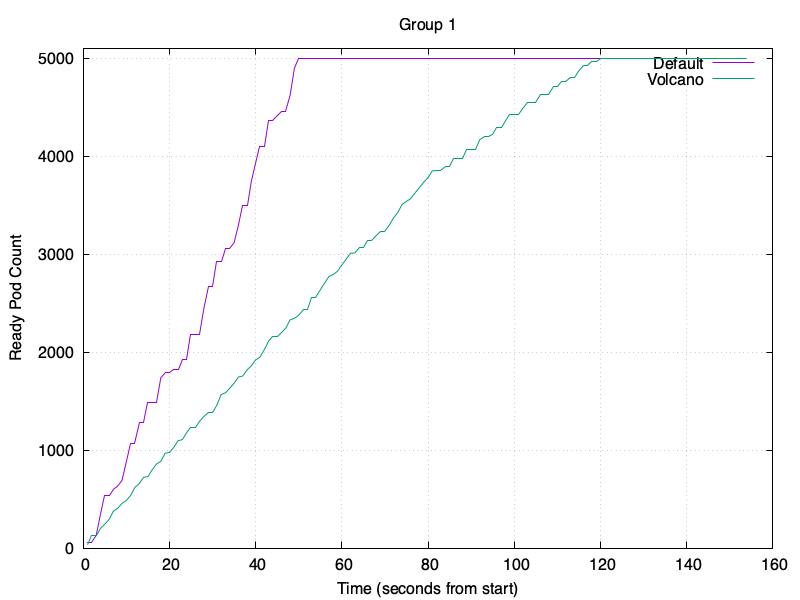 |
| 2     | 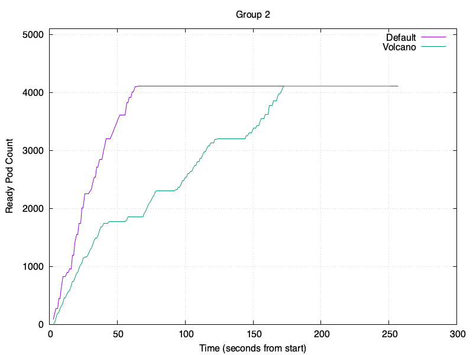 |
| 3     | 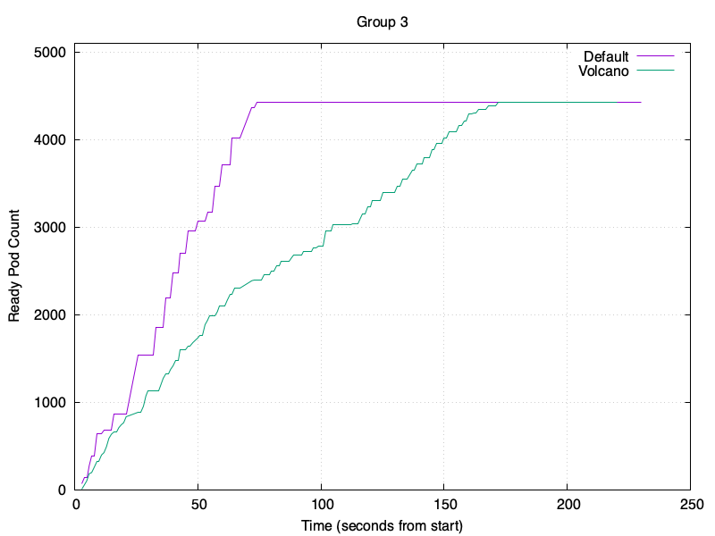 |
| 4     | 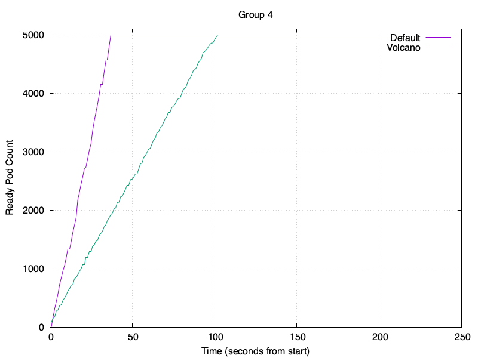 |
| 5     | 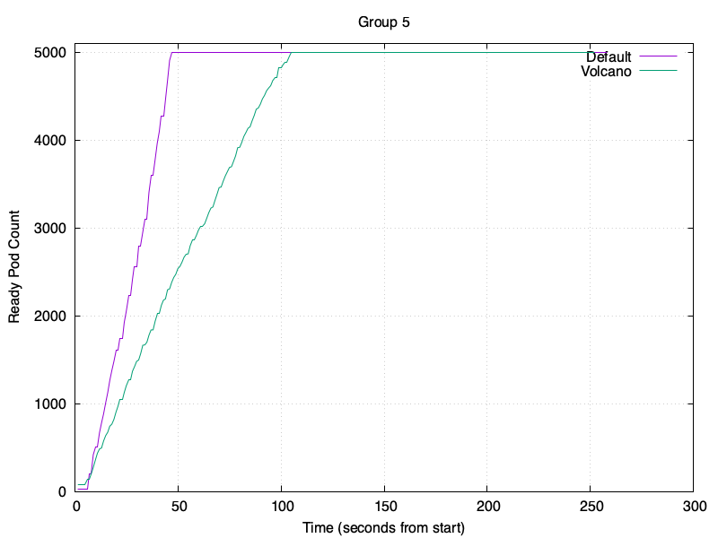 |
| 6     | 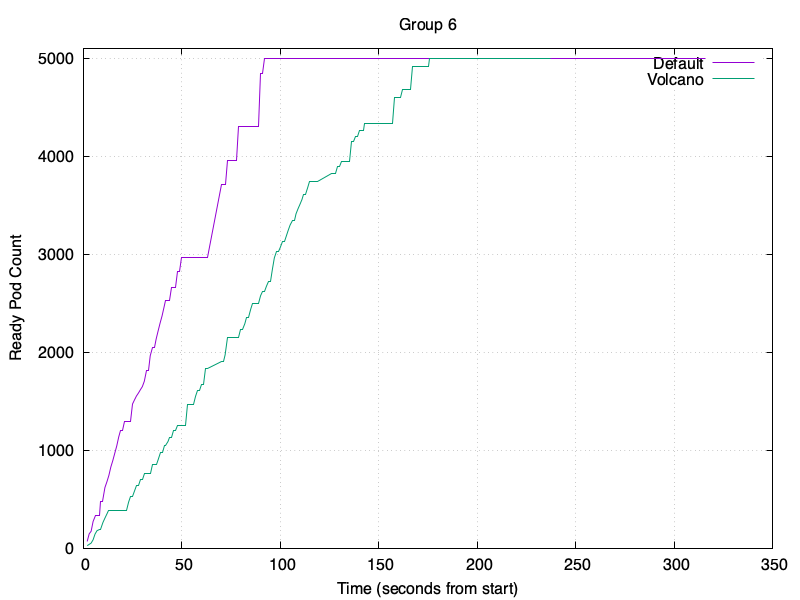 | 

#### 指标实时观测

Metrics can be monitored in real-time via Grafana. Run the following command to open Grafana in your local browser
at http://localhost:3000. The default username is `admin` and the password is `prom-operator`:

```bash
kubectl port-forward svc/kube-prometheus-stack-grafana 3000:80 -n monitoring
```

In Grafana, select the Kubernetes/ComputeResources/Pod dashboard:

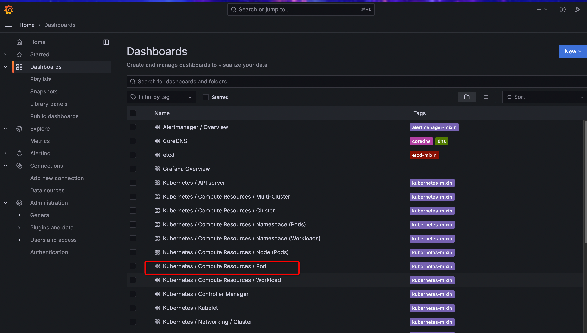

Select the kube-system namespace and the Pod name to view the CPU and memory usage of the kube-scheduler:

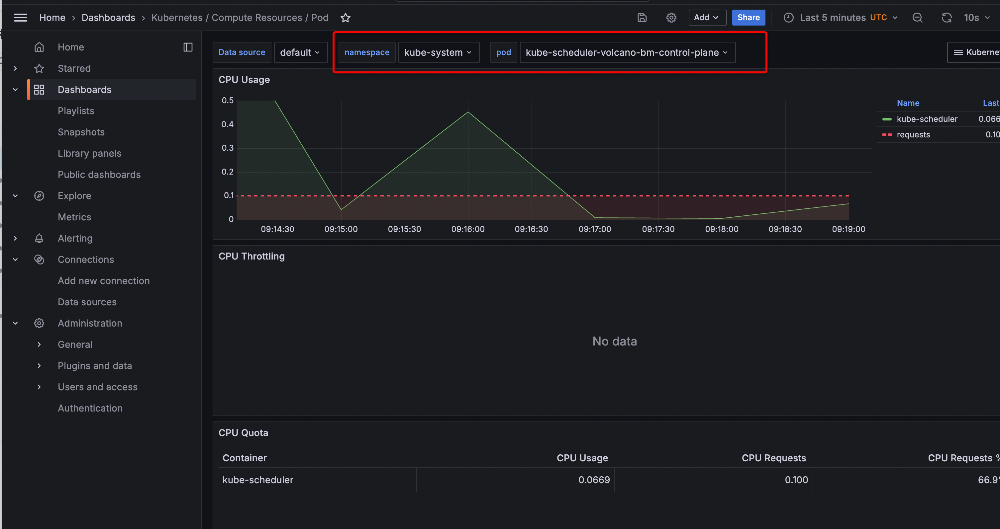

Select the volcano-system namespace and the Pod name to view the CPU and memory usage of the volcano-scheduler:

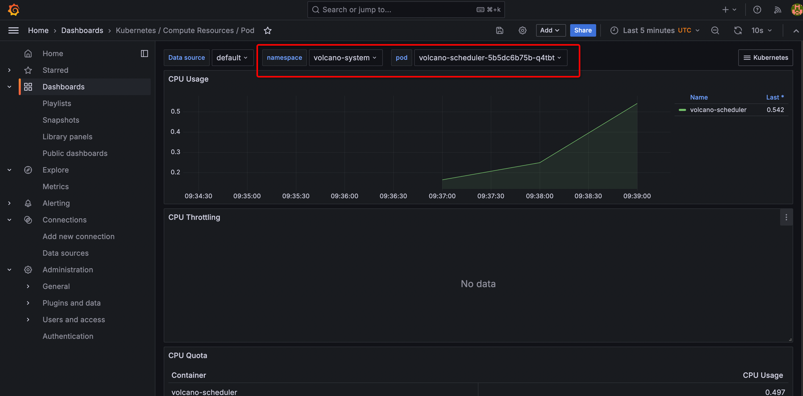

### Test Cases 2 Mini Volcano Throughput

Next, we configure a minimal version of Volcano where the actions only use allocate and the plugins only use predicate, reducing the impact of Volcano's algorithms and plugins on scheduling throughput.

This is configured in ./benchmark/sh/custom_scheduler_config.yaml, and you can customize the combination:

```yaml
actions: "allocate, backfill"
tiers:
  - plugins:
      - name: predicates
        arguments:
          predicate.CacheEnable: true
```

After modification, reinstall Volcano:

```bash
cd benchmark/sh
./clear.sh
./pre.sh --node_cnt=1000 --volcano_v=v1.10.0 --use_mini_volcano=true
```

Re-run the tests:

```bash
cd benchmark/sh
./benchmark.sh -m 1
./benchmark.sh -m 2
./benchmark.sh -m 3
````

Here are the results, showing slightly higher throughput compared to the default Volcano:

| Group | Result                                      |
|-------|---------------------------------------------|
| 1     | 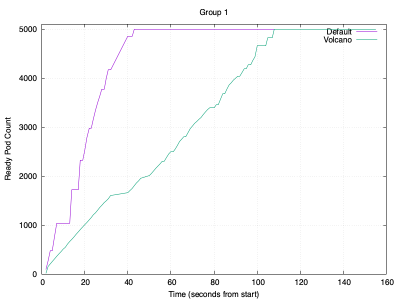 |
| 2     | 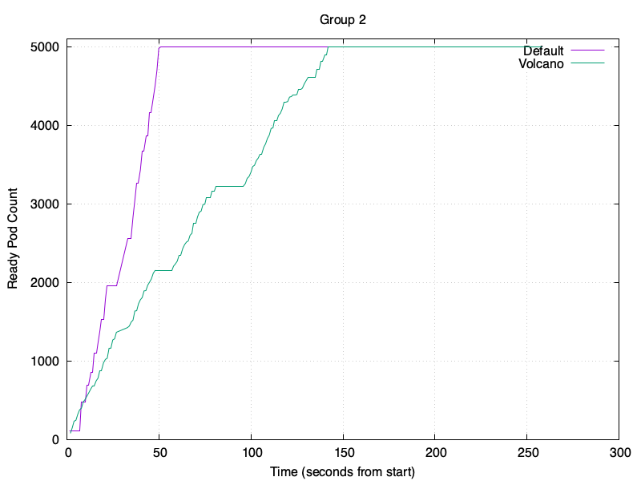 |      
| 3     | 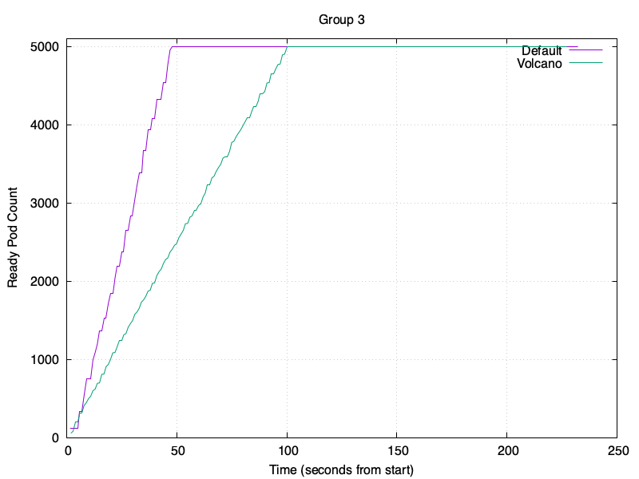 |

### Test Cases 3 Affinity & none-Affinity

Enable the predicate.CacheEnable in the Volcano predicates plugin to cache relevant information, which improves scheduling performance when dealing with pods that have affinity or anti-affinity constraints.

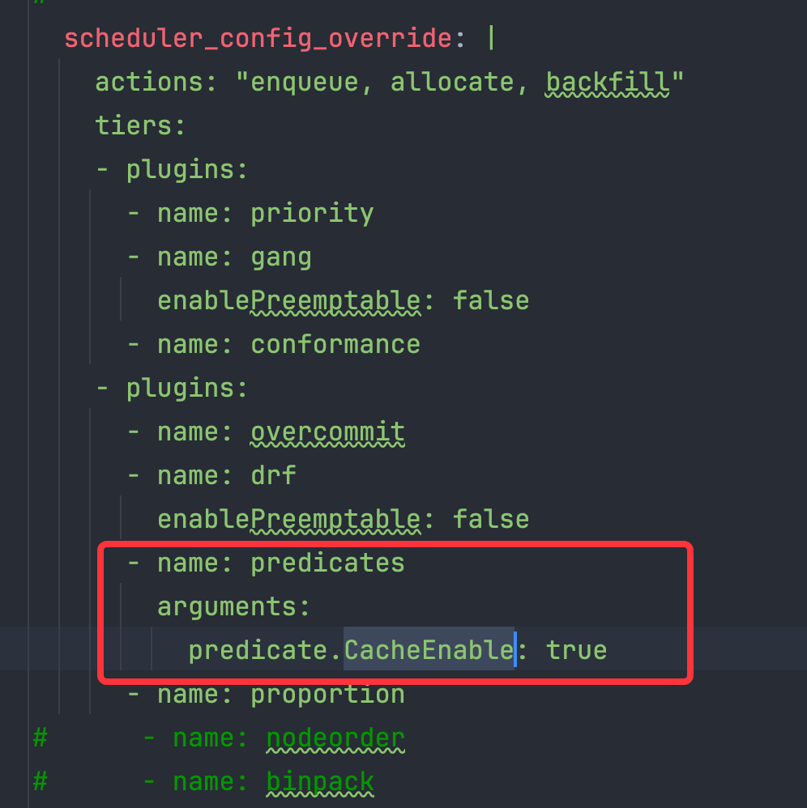

Set up affinity and anti-affinity groups as shown in the following table, and observe the Prometheus metrics:

| Types of Node affinity and anti-affinity | Operator | Numbers of Pods |
|------------------------------------------|----------|-----------------|
| Preferred                                | In       | 625             |
| Preferred                                | NotIn    | 625             |
| Required                                 | In       | 625             |
| Required                                 | NotIn    | 625             |

Set node affinity and anti-affinity:

```yaml
affinity:
  nodeAffinity:
    requiredDuringSchedulingIgnoredDuringExecution:
      nodeSelectorTerms:
        - matchExpressions:
            - key: kubernetes.io/hostname
              operator: $operator
              values:
                - kwok-node-$randHost
```

```yaml
affinity:
  nodeAffinity:
    preferredDuringSchedulingIgnoredDuringExecution:
      - weight: 100
        preference:
          matchExpressions:
            - key: kubernetes.io/hostname
              operator: $operator
              values:
                - kwok-node-$randHost
```

Run the following commands:

```bash
cd benchmark/sh
# -a represents testing affinity & anti-affinity
./benchmark.sh -a 1
./benchmark.sh -a 2
./benchmark.sh -a 3
```

Test results are output to benchmark/img/res/, with files like g1_aff.png, g2_aff.png, and g3_aff.png.

Results are as follows:

| Group | Result                                     |
|-------|--------------------------------------------|
| 1     | 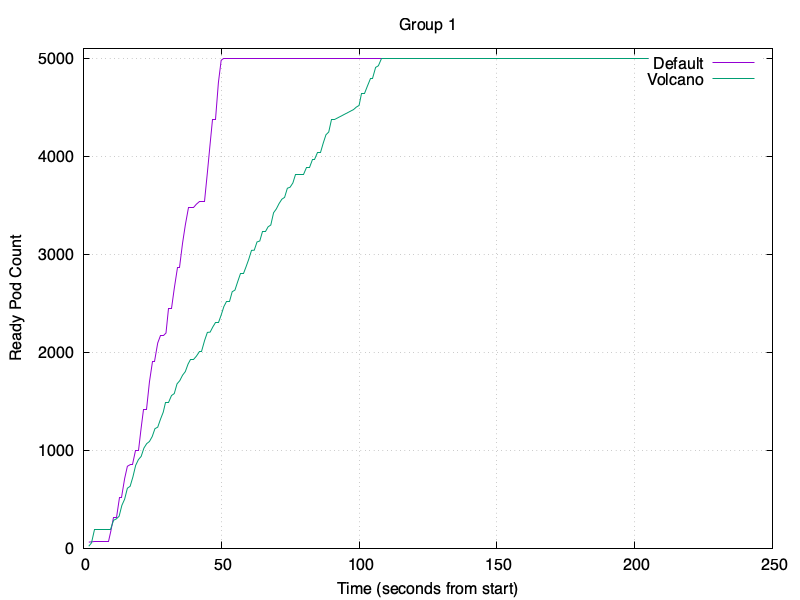 |
| 2     | 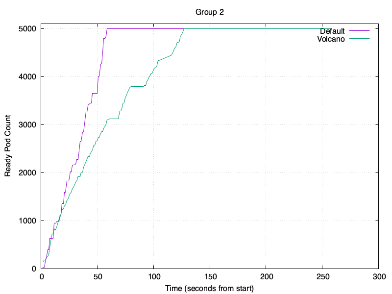 |      
| 3     | 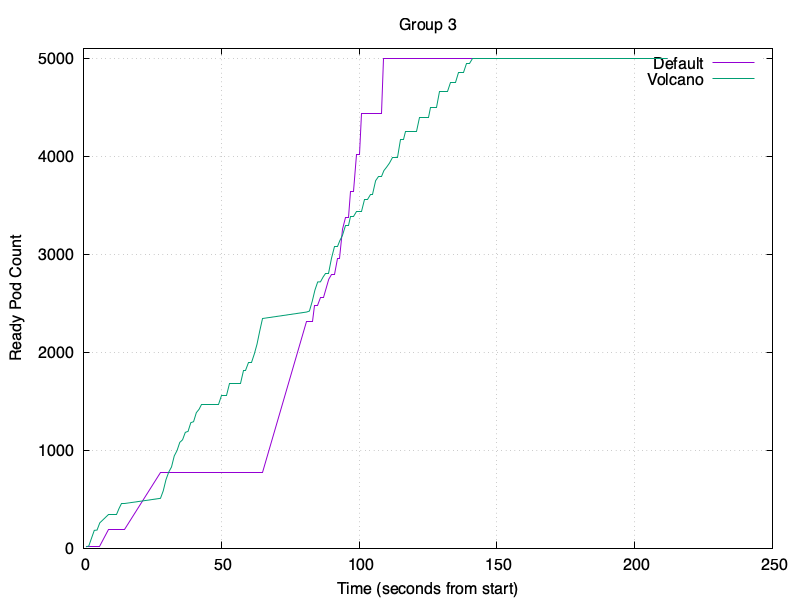 |

Results without the predicates cache are as follows:

| Group | Result                                             |
|-------|----------------------------------------------------|
| 1     | 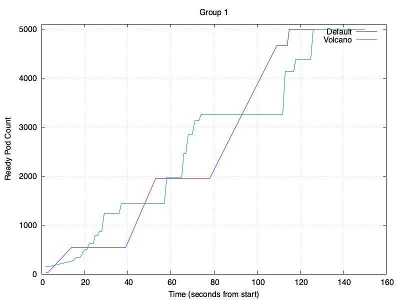 |
| 2     | 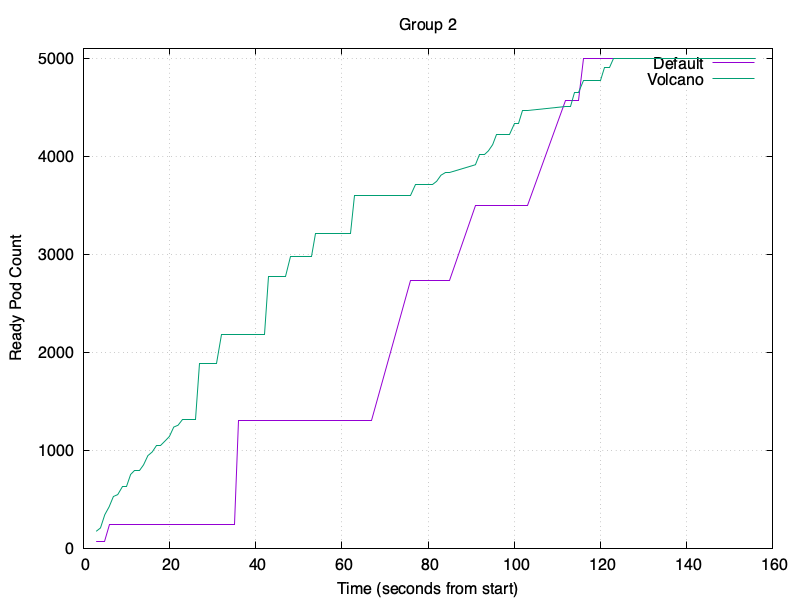 |      
| 3     | 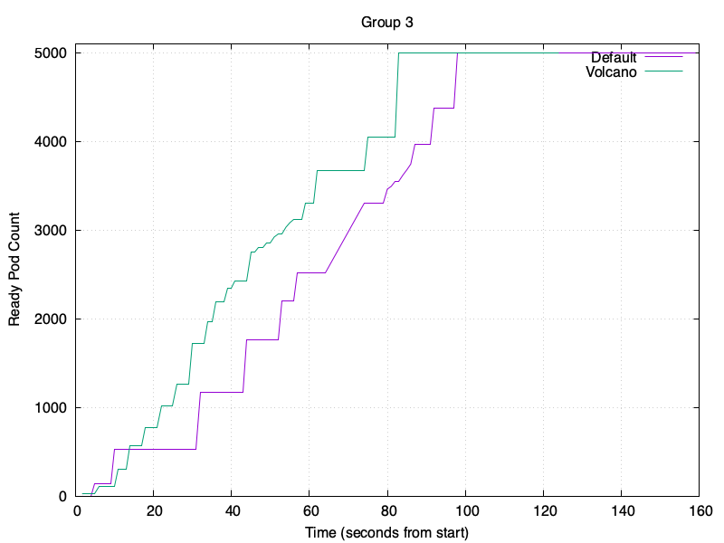 |

## Performance Optimization

Users can customize performance parameters based on their workload scenarios. These parameters can be modified in `/installer/helm/chart/volcano/values.yaml`:

```yaml
custom:
  # Volcano Controller performance parameters
  controller_kube_api_qps: 3000  # Limits the number of requests per second the client (scheduler) can send to the kube-api-server.
  controller_kube_api_burst: 3000  # The maximum number of requests the client (scheduler) can send in a short period, often used to handle bursts of requests.
  controller_worker_threads: 3  # The number of threads for synchronizing job operations. The larger the number, the faster the job updates, but the higher the CPU load.
  controller_worker_threads_for_gc: 10  # The number of threads for job garbage collection. The larger the number, the faster the job updates, but the higher the CPU load.
  controller_worker_threads_for_podgroup: 50  # The number of threads for synchronizing podgroup operations. The larger the number, the faster the job updates, but the higher the CPU load.

  # Volcano Scheduler performance parameters
  scheduler_kube_api_qps: 10000
  scheduler_kube_api_burst: 10000
  scheduler_schedule_period: 100ms  # The frequency of the scheduling cycle. Too low a frequency may lead to resource waste and scheduling delays, while too high may increase the scheduler's load.
  scheduler_node_worker_threads: 200  # The number of threads for synchronizing node operations. The larger the number, the faster the node updates, but the higher the CPU load.
```