# 基于KWOK评估Volcano的性能

Volcano 社区不断优化调度程序的性能，确保Volcano满足大规模批处理工作负载的性能要求。因此，社区构建了一些有用的性能基准测试工具，这些工具可以在各个版本之间重复使用。本文档介绍了所有这些工具以及运行它们的步骤。

请注意，性能结果会因底层硬件的不同而有很大差异。文档中发布的所有结果仅供参考。我们鼓励每个人在自己的环境中运行类似的测试，以便根据自己的硬件获得结果。本文档仅用于演示目的。

## 硬件

本次使用的机器配置如下：

| 属性    | 值    |
|-------|------|
| 操作系统  | Mac  |
| Arch  | Arm  |
| CPU核数 | 12   |
| 内存    | 32GB |

## 测试流程

在详细介绍之前，以下是我们测试中使用的一般步骤：

- 步骤 1：使用kind搭建本地集群。
- 步骤 2：使用helm安装Volcano（可使用/installer/helm/chart/volcano的本地chat安装或使用helm仓库）
- 步骤 3：在k8s集群中使用helm安装kube-prometheus-stack，可提供prometheus、Grafana、kube-state-metrics等开箱即用监控套件，方便观测集群状态。
- 步骤 4：部署 5000 个 Nginx pod 进行测试，API 服务器将创建它们。
- 步骤 5：观察 Prometheus UI 中公开的指标。

## 前置部署

### 性能调优

在性能测试之前，我们需要调整一些配置，以确保它在测试中表现良好。

#### Api-Server

在 Kubernetes API Server 中，我们需要修改两个参数：max-mutating-requests-inflight和max-requests-inflight。这两个参数代表
API 请求带宽。因为我们会产生大量的 pod 请求，所以我们需要增大这两个参数。

修改kind启动文件：/benchmark/sh/kind/kind-config.yaml：

```text
--max-mutating-requests-inflight=3000
--max-requests-inflight=3000
```

#### Controller-Manager

在 Kubernetes Controller
Manager中，我们需要增加三个参数的值：node-cidr-mask-size、kube-api-burst和kube-api-qps。kube-api-burst和kube-api-qps控制服务器端请求带宽。node-cidr-mask-size表示节点
CIDR。为了扩展到数千个节点，也需要增加它。

修改kind启动文件：/benchmark/sh/kind/kind-config.yaml:

```text
node-cidr-mask-size: "21" //log2(max number of pods in cluster)
kube-api-burst: "3000"
kube-api-qps: "3000"
```

#### Scheduler

与Kubernetes Controller Manager参数类似，同样调整kube-api-burst和kube-api-qps：

```text
kube-api-burst: 10000
kube-api-qps: 10000
```

#### Volcano Scheduler & Controller-Manager

在Volcano Scheduler中，我们也需要增加这两个参数的值：kube-api-burst和kube-api-qps。和k8s设置保持同步。

Volcano Controller-Manager也一样。

上述参数均在/installer/helm/chart/volcano/values.yaml中修改:

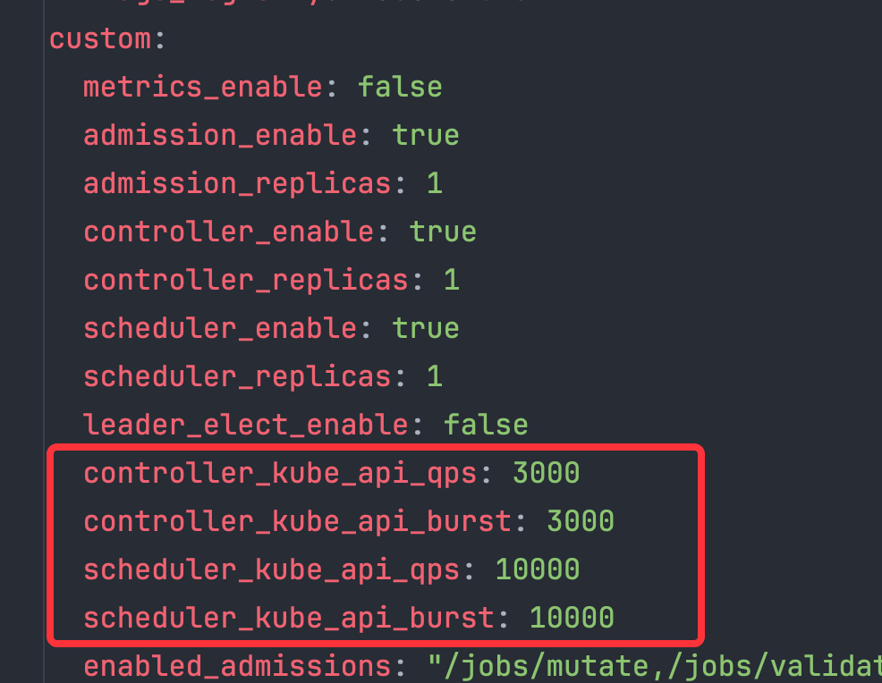

### 一键搭建测试环境

社区提供了一键部署benchmark所需环境的脚本，包括：基于Kind部署本地集群，安装Volcano，部署Prometheus，基于Kwok部署大量虚拟node。

运行如下命令：

```bash
cd benchmark/sh
./pre.sh 1000 # 1000代表创建1000个虚拟node
```

## Test Cases

### 吞吐量

| Test Case | Deployments | Replicas Count | Total Pods |
|-----------|-------------|----------------|------------|
| 1         | 1           | 5000           | 5000       |
| 2         | 5           | 1000           | 5000       |
| 3         | 25          | 200            | 5000       |

社区提供了一键测试、监控指标获取、结果可视化等操作，只需运行如下命令：

```bash
cd benchmark/sh
# 脚本后的参数代表对应测试组
./benchmark.sh 1
./benchmark.sh 2
./benchmark.sh 3
```

#### 测试结果：

测试结果输出到`benchmark/img/res/`下，g1.png、g2.png、g3.png

| Group | Result                                 |
|-------|----------------------------------------|
| 1     | 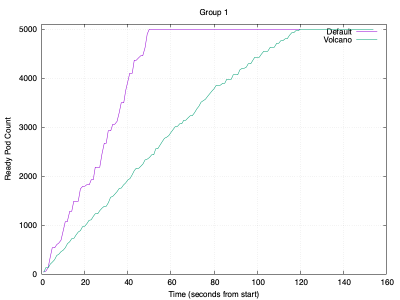 |
| 2     | 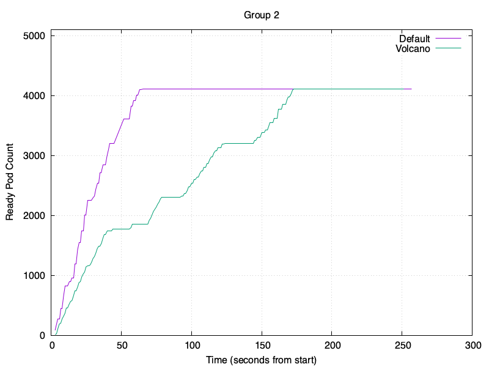 |      
| 3     | 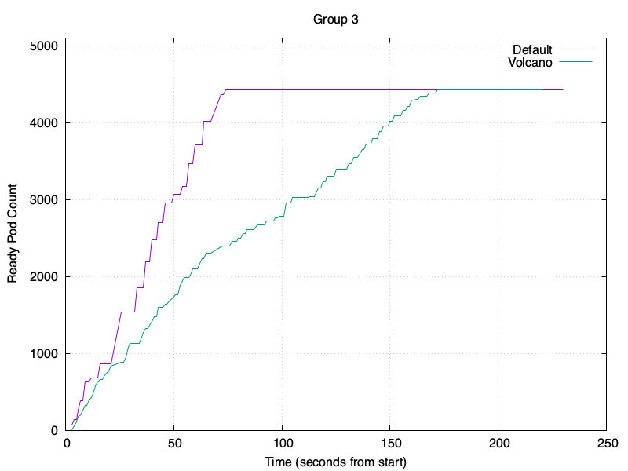 |

#### 去掉Volcano plugins

我们将Volcano的nodeorder、binpack插件去掉，减少节点优选对调度吞吐的影响：

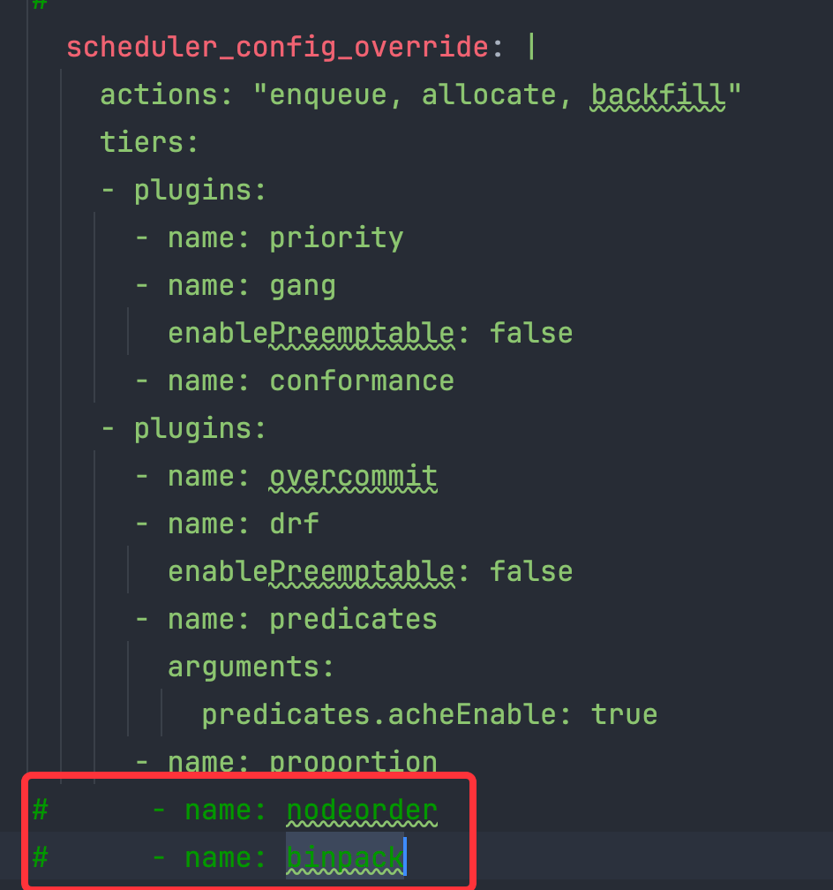

修改完重新安装Volcano:

```bash
cd benchmark/sh
./uninstall-volcano.sh
helm install volcano ../../installer/helm/chart/volcano -n volcano-system --create-namespace
```

结果如下，可以看到比带nodeorder和binpack插件的吞吐高一些：

| Group | Result                                                      |
|-------|-------------------------------------------------------------|
| 1     | 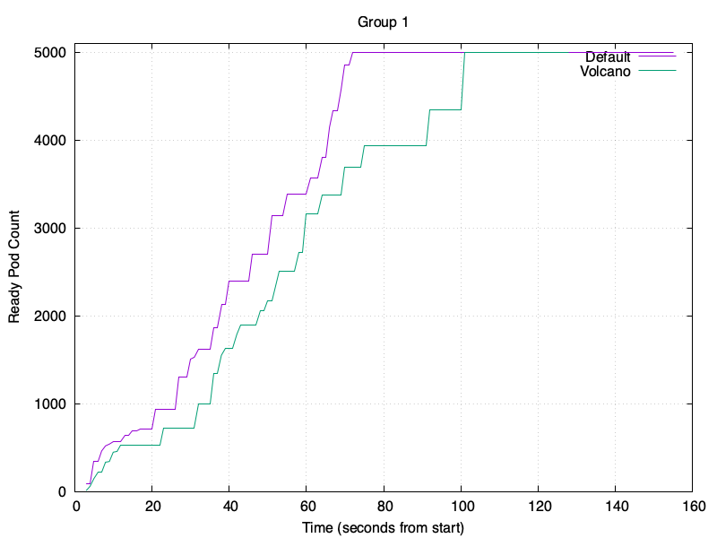 |
| 2     | 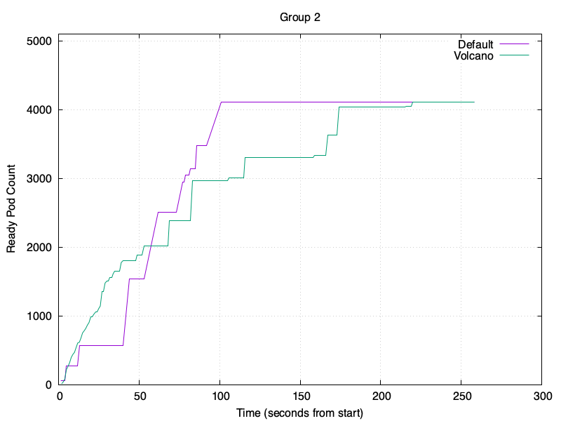 |      
| 3     | 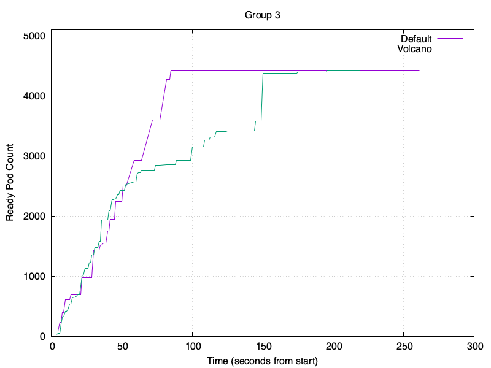 |

### 亲和&反亲和

开启Volcano的predicates插件的predicate.CacheEnable为true，predicate插件中增加缓存相关信息，亲和反亲和类pod调度时增加调度性能。

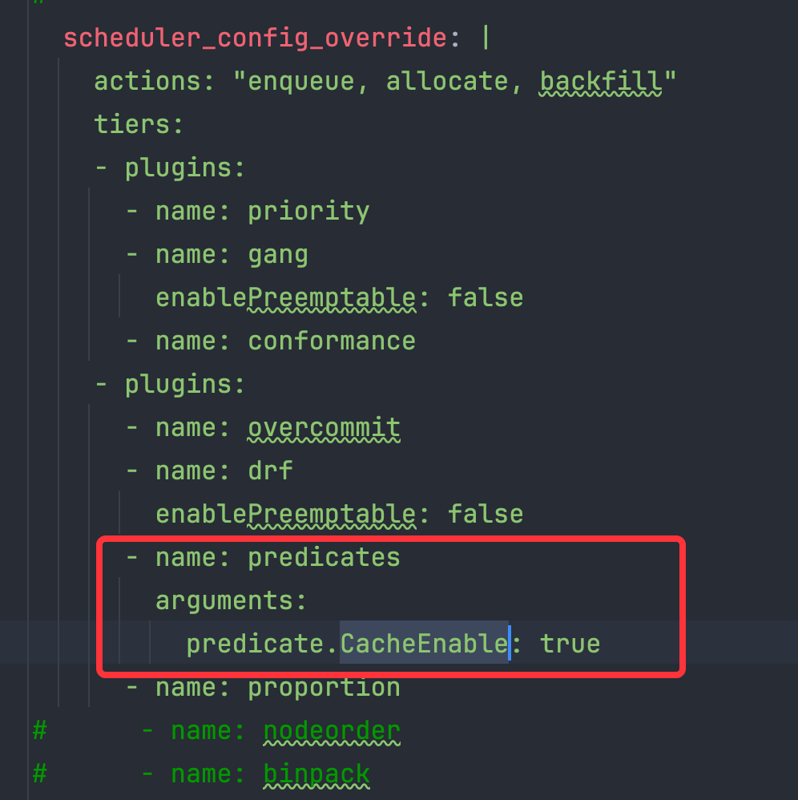

按照如下表格设置亲和性和反亲和性分组，并观察Prometheus指标：

| Types of Node affinity and anti-affinity | Operator | Numbers of Pods |
|------------------------------------------|----------|-----------------|
| Preferred                                | In       | 625             |
| Preferred                                | NotIn    | 625             |
| Required                                 | In       | 625             |
| Required                                 | NotIn    | 625             |

设置节点亲和性和反亲和性：

```yaml
affinity:
  nodeAffinity:
    requiredDuringSchedulingIgnoredDuringExecution:
      nodeSelectorTerms:
        - matchExpressions:
            - key: kubernetes.io/hostname
              operator: $operator
              values:
                - kwok-node-$randHost
```

```yaml
affinity:
  nodeAffinity:
    preferredDuringSchedulingIgnoredDuringExecution:
      - weight: 100
        preference:
          matchExpressions:
            - key: kubernetes.io/hostname
              operator: $operator
              values:
                - kwok-node-$randHost
```

运行如下命令：

```bash
cd benchmark/sh
# -a代表测试亲和性&反亲和性
./benchmark.sh -a 1
./benchmark.sh -a 2
./benchmark.sh -a 3
```

测试结果输出到`benchmark/img/res/`下，g1_aff.png、g2_aff.png、g3_aff.png

结果如下：

| Group | Result                                     |
|-------|--------------------------------------------|
| 1     | 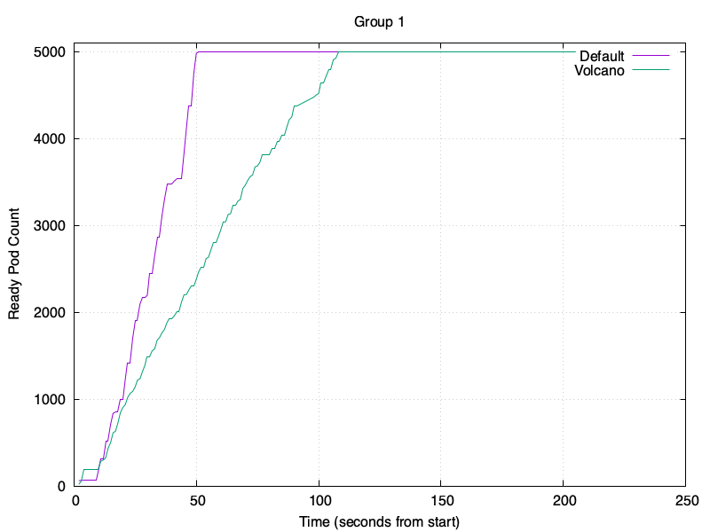 |
| 2     | 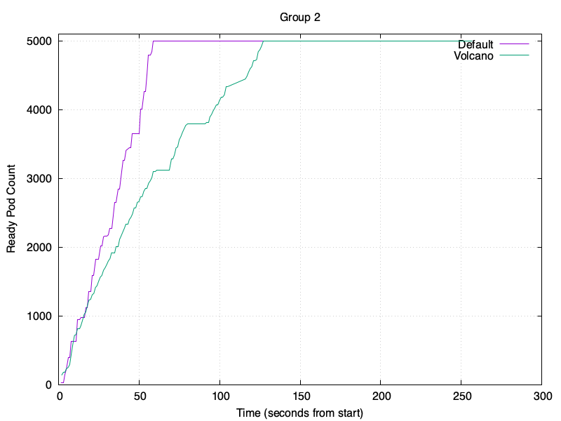 |      
| 3     | 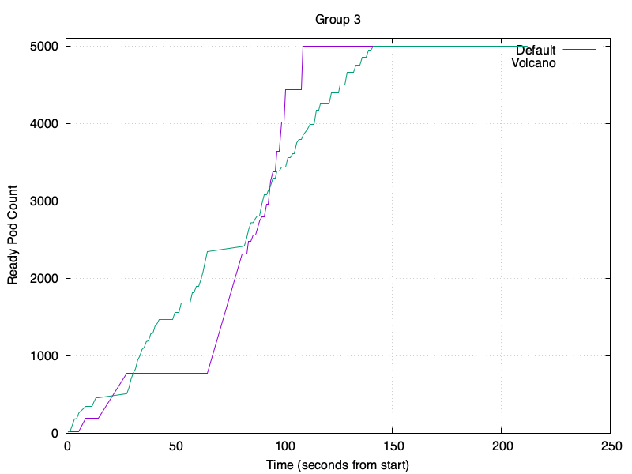 |

去掉predicates缓存的结果如下：

| Group | Result                                             |
|-------|----------------------------------------------------|
| 1     | 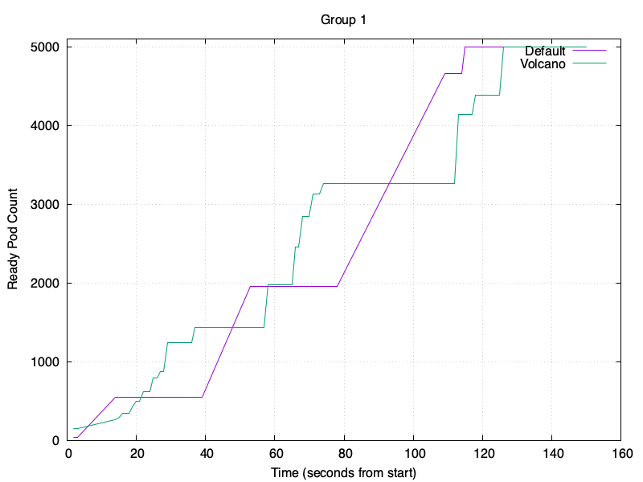 |
| 2     | 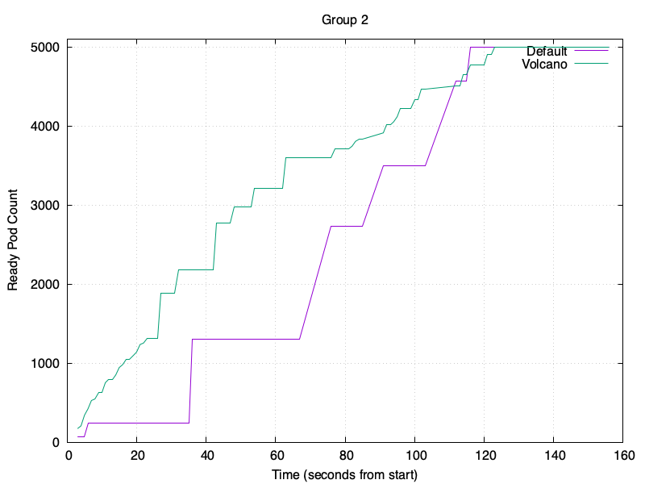 |      
| 3     | 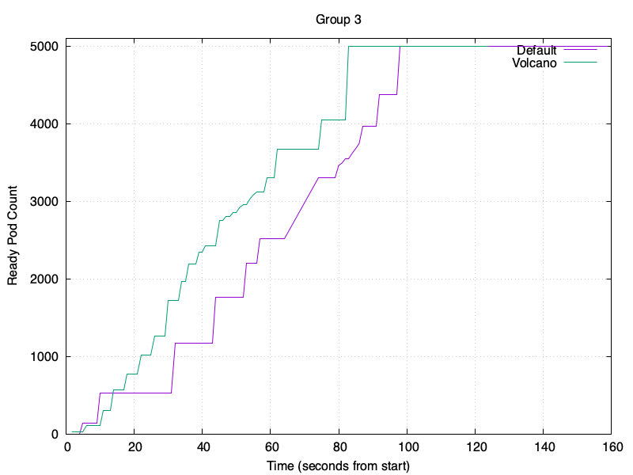 |