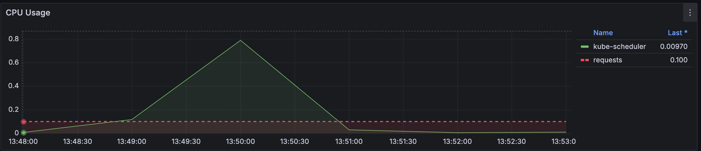
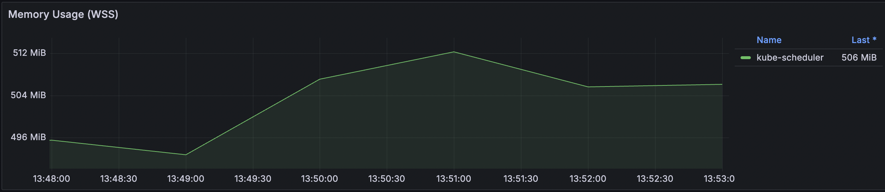
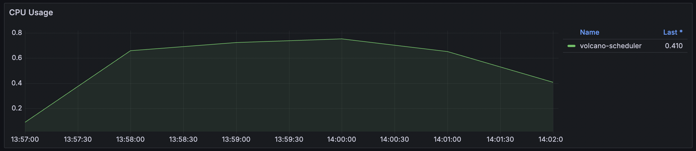
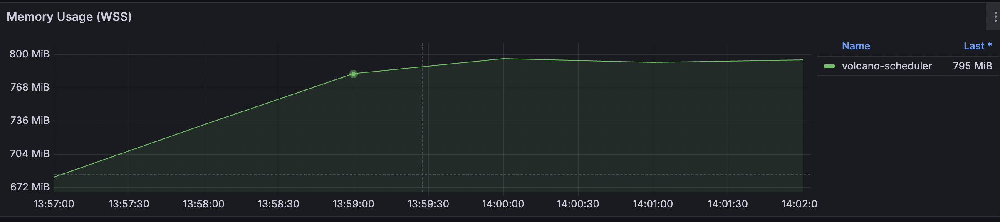

# 基于KWOK评估Volcano的性能

Volcano 社区不断优化调度程序的性能，确保Volcano满足大规模批处理工作负载的性能要求。因此，社区构建了一些有用的性能基准测试工具，这些工具可以在各个版本之间重复使用。本文档介绍了所有这些工具以及运行它们的步骤。

请注意，性能结果会因底层硬件的不同而有很大差异。文档中发布的所有结果仅供参考。我们鼓励每个人在自己的环境中运行类似的测试，以便根据自己的硬件获得结果。本文档仅用于演示目的。

## 测试环境

本次测试的环境信息如下：

| 属性         | 值       |
|------------|---------|
| 操作系统       | Mac     |
| Arch       | Arm     |
| CPU核数      | 12      |
| 内存         | 32GB    |
| Volcano 版本 | v1.10.0 |

## 测试流程

在详细介绍之前，以下是我们测试中使用的一般步骤：

- 步骤 1：使用kind搭建本地集群。
- 步骤 2：使用helm安装Volcano（可使用/installer/helm/chart/volcano的本地chat安装或使用helm仓库）
- 步骤 3：在k8s集群中使用helm安装kube-prometheus-stack，可提供prometheus、Grafana、kube-state-metrics等开箱即用监控套件，方便观测集群状态。
- 步骤 4：部署 5000 个 Nginx pod 进行测试，API 服务器将创建它们。
- 步骤 5：观察 Prometheus UI 中公开的指标。

## 前置部署

### 性能调优

在性能测试之前，我们需要调整一些配置，以确保它在测试中表现良好。

#### Api-Server

在 Kubernetes API Server 中，我们需要修改两个参数：max-mutating-requests-inflight和max-requests-inflight。这两个参数代表
API 请求带宽。因为我们会产生大量的 pod 请求，所以我们需要增大这两个参数。

修改kind启动文件：/benchmark/sh/kind/kind-config.yaml：

```text
--max-mutating-requests-inflight=3000
--max-requests-inflight=3000
```

#### Controller-Manager

在 Kubernetes Controller
Manager中，我们需要增加三个参数的值：node-cidr-mask-size、kube-api-burst和kube-api-qps。kube-api-burst和kube-api-qps控制服务器端请求带宽。node-cidr-mask-size表示节点
CIDR。为了扩展到数千个节点，也需要增加它。

修改kind启动文件：/benchmark/sh/kind/kind-config.yaml:

```text
node-cidr-mask-size: "21" //log2(max number of pods in cluster)
kube-api-burst: "3000"
kube-api-qps: "3000"
```

#### Scheduler

与Kubernetes Controller Manager参数类似，同样调整kube-api-burst和kube-api-qps：

```text
kube-api-burst: 10000
kube-api-qps: 10000
```

#### Volcano Scheduler & Controller-Manager

在Volcano Scheduler中，我们也需要增加这两个参数的值：kube-api-burst和kube-api-qps。和k8s设置保持同步。

Volcano Controller-Manager也一样。

上述参数均在`/installer/helm/chart/volcano/values.yaml`中修改，本次实验参数如下：

```yaml
custom:
  controller_kube_api_qps: 3000
  controller_kube_api_burst: 3000
  controller_worker_threads: 3
  controller_worker_threads_for_gc: 10
  controller_worker_threads_for_podgroup: 50
  scheduler_kube_api_qps: 10000
  scheduler_kube_api_burst: 10000
  scheduler_schedule_period: 100ms
  scheduler_node_worker_threads: 200
```

### 一键搭建测试环境

社区提供了一键部署benchmark所需环境的脚本，包括：基于Kind部署本地集群，安装Volcano，部署Prometheus，基于Kwok部署大量虚拟node。

运行如下命令：

```bash
cd benchmark/sh
./pre.sh --node_cnt=1000 --volcano_v=v1.10.0 --use_mini_volcano=false 
# node_cnt代表创建1000个虚拟node
# volcano_v代表volcano版本
# use_mini_volcano代表是否使用最简版Volcano，action仅用allocate&仅使用predicate插件，下文会介绍
```

## Test Cases

### Test Cases 1 吞吐量

| Test Case | Deployments | Replicas Count | Total Pods |
|-----------|-------------|----------------|------------|
| 1         | 1           | 5000           | 5000       |
| 2         | 5           | 1000           | 5000       |
| 3         | 25          | 200            | 5000       |
| 4         | 100         | 50             | 5000       |
| 5         | 200         | 25             | 5000       |
| 6         | 500         | 2              | 5000       |

社区提供了一键测试、监控指标获取、结果可视化等操作，只需运行如下命令：

```bash
cd benchmark/sh
# 脚本后的参数代表对应测试组
./benchmark.sh 1
./benchmark.sh 2
./benchmark.sh 3
./benchmark.sh 4
./benchmark.sh 5
./benchmark.sh 6
```

#### 测试结果：

测试结果输出到`benchmark/img/res/`下，g1.png、g2.png、g3.png

| Group | Result                                 | K8s Scheduler Workload                                                                | Scheduler Workload                                                                        |
|-------|----------------------------------------|---------------------------------------------------------------------------------------|-------------------------------------------------------------------------------------------|
| 1     |  |                                                                                       |                                                                                           |
| 2     |  |                                                                                       |                                                                                           |
| 3     |  |                                                                                       |                                                                                           |
| 4     |  |                                                                                       |                                                                                           |
| 5     |  |                                                                                       |                                                                                           |
| 6     |  |   |   |

#### 指标实时观测

可通过Grafana实时观测指标，运行如下命令，可以在本地浏览器打开`http://localhost:3000`访问Grafana。初始账号为`admin`
，密码为`prom-operator`：

```bash
kubectl port-forward svc/kube-prometheus-stack-grafana 3000:80 -n monitoring
```

在Dashboards中选择Kubernetes/ComputeResources/Pod面板：


选择Namesapce kube-system和Pod名称，即可查看kube-scheduler的CPU和内存：


选择Namesapce colcano-system和Pod名称，即可查看volcano-scheduler的CPU和内存：


### Test Cases 2 最简版Volcano 吞吐

接下来，我们配置最简版Volcano，actions仅用allocate，plugins仅使用predicate，减少Volcano算法和插件对调度吞吐的影响。

已配置在`./benchmark/sh/custom_scheduler_config.yaml`中，可自定义组合：

```yaml
actions: "allocate, backfill"
tiers:
  - plugins:
      - name: predicates
        arguments:
          predicate.CacheEnable: true
```

修改完重新安装Volcano:

```bash
cd benchmark/sh
./clear.sh
./pre.sh --node_cnt=1000 --volcano_v=v1.10.0 --use_mini_volcano=true
```

重新运行测试：

```bash
cd benchmark/sh
./benchmark.sh -m 1
./benchmark.sh -m 2
./benchmark.sh -m 3
````

结果如下，可以看到比默认的Volcano的吞吐高一些：

| Group | Result                                      |
|-------|---------------------------------------------|
| 1     |  |
| 2     |  |      
| 3     |  |

### Test Cases 3 亲和&反亲和

开启Volcano的predicates插件的predicate.CacheEnable为true，predicate插件中增加缓存相关信息，亲和反亲和类pod调度时增加调度性能。


按照如下表格设置亲和性和反亲和性分组，并观察Prometheus指标：

| Types of Node affinity and anti-affinity | Operator | Numbers of Pods |
|------------------------------------------|----------|-----------------|
| Preferred                                | In       | 625             |
| Preferred                                | NotIn    | 625             |
| Required                                 | In       | 625             |
| Required                                 | NotIn    | 625             |

设置节点亲和性和反亲和性：

```yaml
affinity:
  nodeAffinity:
    requiredDuringSchedulingIgnoredDuringExecution:
      nodeSelectorTerms:
        - matchExpressions:
            - key: kubernetes.io/hostname
              operator: $operator
              values:
                - kwok-node-$randHost
```

```yaml
affinity:
  nodeAffinity:
    preferredDuringSchedulingIgnoredDuringExecution:
      - weight: 100
        preference:
          matchExpressions:
            - key: kubernetes.io/hostname
              operator: $operator
              values:
                - kwok-node-$randHost
```

运行如下命令：

```bash
cd benchmark/sh
# -a代表测试亲和性&反亲和性
./benchmark.sh -a 1
./benchmark.sh -a 2
./benchmark.sh -a 3
```

测试结果输出到`benchmark/img/res/`下，g1_aff.png、g2_aff.png、g3_aff.png

结果如下：

| Group | Result                                     |
|-------|--------------------------------------------|
| 1     |  |
| 2     |  |      
| 3     |  |

去掉predicates缓存的结果如下：

| Group | Result                                             |
|-------|----------------------------------------------------|
| 1     |  |
| 2     |  |      
| 3     |  |

## 性能优化

用户可根据自己的作业场景，自定义性能参数，参数均在`/installer/helm/chart/volcano/values.yaml`中修改：

```yaml
custom:
  # Volcano Controller性能参数  
  controller_kube_api_qps: 3000 # 限制客户端（调度器）每秒可以向 kube-api-server 服务端发出的请求数量
  controller_kube_api_burst: 3000 # 客户端（调度器）可以在短时间内发出的最大请求数，通常用于处理短时间内突发的大量请求。
  controller_worker_threads: 3 # 同时同步作业操作的线程数。数字越大=作业更新速度越快，但 CPU 负载也越高
  controller_worker_threads_for_gc: 10 # 回收作业的线程数。数字越大=作业更新速度越快，但 CPU 负载也越高
  controller_worker_threads_for_podgroup: 50 # 同步 podgroup 操作的线程数。数字越大=作业更新速度越快，但 CPU 负载也越高

  # Volcano Controller性能参数  
  scheduler_kube_api_qps: 10000
  scheduler_kube_api_burst: 10000
  scheduler_schedule_period: 100ms # 调度周期的频率。调度频率过低可能导致资源浪费和调度延迟，频率过高可能增加调度器的负载。
  scheduler_node_worker_threads: 200 # 同步节点操作的线程数。数字越大=节点更新速度越快，但 CPU 负载也越高
```