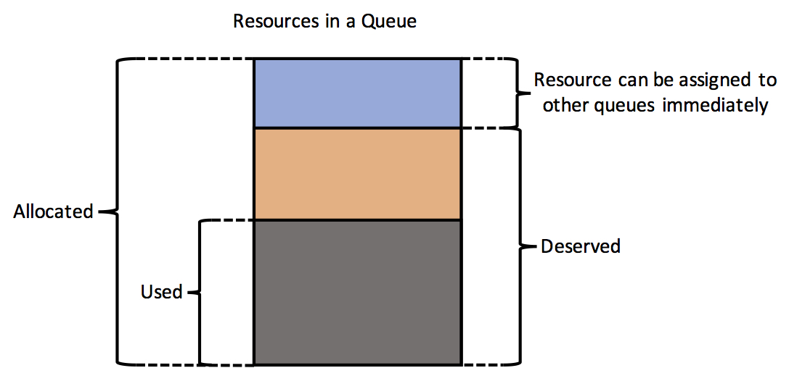
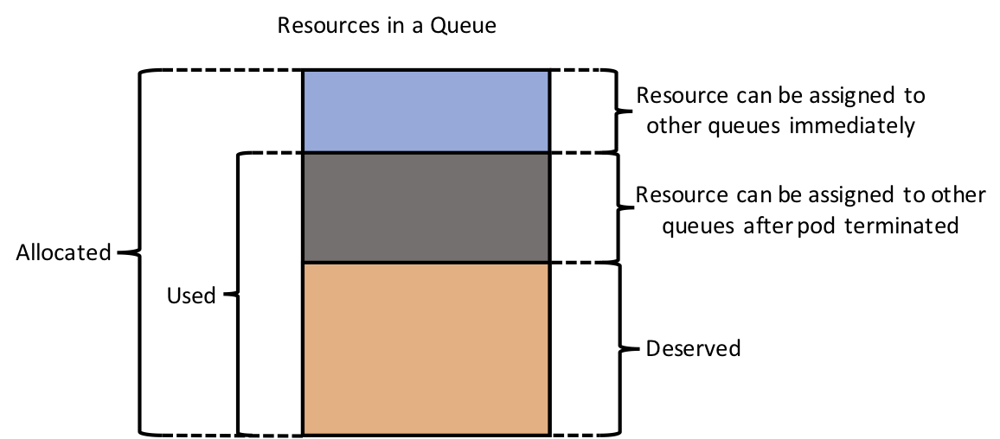

# Preemption design behaviour

@jinzhejz, 12/13/2017

## Overview
The document shows detail behaviour of preemption.

## API
```go
type Interface interface {
	Run(stopCh <-chan struct{})

	Preprocessing(queues map[string]*schedulercache.QueueInfo, pods []*schedulercache.PodInfo) (map[string]*schedulercache.QueueInfo, error)

	PreemptResources(queues map[string]*schedulercache.QueueInfo) error
}
```

A preemptor providers three interfaces, `Run()`,`Preprocessing()` and `PreemptResources()`

* `Run()` to start informer for preemption.
* `Preprocessing()` to preprocess queues, make sure `Allocated >= Used` in each queue.
* `PreemptResources()` to preempt resources between different queues.

### Preprocess stage
Currently, this stage terminates pods of the queue which `Allocated < Used` to avoid overuse(make queue `Allocated >= Used`), preemption will not be triggered between queues.

```
For examples:
--------------------------------------------------------------------------
| Queue-1                                                                |
|    Weight: 2                                                           |
|                                                                        |
|    Allocated:        Used:                Pods:                        |
|      cpu: 3            cpu: 5               pod-1: cpu=2 memory=1Gi    |
|      memory: 9Gi       memory: 3Gi          pod-2: cpu=2 memory=1Gi    |
|                                             pod-3: cpu=1 memory=1Gi    |
--------------------------------------------------------------------------

--------------------------------------------------------------------------
| Queue-2                                                                |
|    Weight: 4                                                           |
|                                                                        |
|    Allocated:        Used:                Pods:                        |
|      cpu: 6            cpu: 5               pod-1: cpu=2 memory=1Gi    |
|      memory: 18Gi      memory: 3Gi          pod-2: cpu=2 memory=1Gi    |
|                                             pod-3: cpu=1 memory=1Gi    |
--------------------------------------------------------------------------

There are 9 CPUs totally. 3 CPUs are allocated to Queue-1 and 6 CPUs are allocated to Queue-2.
However, Queue-1 is overused due to some race condition. So pod-1 will be chosen to terminate. The pod is randomly selected currently.
--------------------------------------------------------------------------
| Queue-1                                                                |
|    Weight: 2                                                           |
|                                                                        |
|    Allocated:        Used:                Pods:                        |
|      cpu: 3            cpu: 3               pod-2: cpu=2 memory=1Gi    |
|      memory: 9Gi       memory: 2Gi          pod-3: cpu=1 memory=1Gi    |
--------------------------------------------------------------------------
```

### Preemption stage
Preempt resources between queues. This stage will divide all queues into three categories:

* Case-01 : `Deserved < Allocated`
* Case-02 : `Deserved = Allocated`
* Case-03 : `Deserved > Allocated`

The queues in case-01 will be preempted resources to other queues. It contains two subcases:

* Case-01.1 : `Used <= Deserved`. The resources `Allocated - Deserved` are not used by pods, and it can be assigned to the queues in case-03 directly. No pods will be terminated and `Allocated` will be changed to `Deserved` for the queue directly.


* Case-01.2 : `Used > Deserved`. The resources `Allocated - Used` are not used by pods, and it can be assigned to the queues in case-03 directly. The resources `Used - Deserved` is used by running pods. This will trigger terminate pod to preempt resource. `Allocated` will be changed to `Deserved` directly for the queue first to avoid more pods coming and then some pods will be chosen randomly to kill to release resources `Used - Deserved` which is marked as Preempting Resources.


The queues in case-02 occupy the right resources, they are constant at this stage.

The queues in case-03 will preempt resources from queues in case-01. 

* The `Allocated - Deserved` resources in case-01.1 and `Allocated - Used` resources in case-01.2 will be assigned to these queues immediately. And its `Allocated` resources will be changed according to the increased resources.
* The `Used - Deserved` resources will also be assigned to these queues as `Preempting` resource, and `Allocated` resources will not be changed at this moment. After the pod termination in case-01.2 is done, the `Allocated` resources will be updated.

```
Preemption examples:

There are two queues and resources allocated as follow, Deserved is same as Allocated:
--------------------------------------------------------------------------
| Queue-1                                                                |
|    Weight: 2                                                           |
|                                                                        |
|    Allocated:        Used:                Pods:                        |
|      cpu: 3            cpu: 3               pod-2: cpu=2 memory=1Gi    |
|      memory: 9Gi       memory: 2Gi          pod-3: cpu=1 memory=1Gi    |
--------------------------------------------------------------------------
--------------------------------------------------------------------------
| Queue-2                                                                |
|    Weight: 4                                                           |
|                                                                        |
|    Allocated:        Used:                Pods:                        |
|      cpu: 6            cpu: 5               pod-1: cpu=2 memory=1Gi    |
|      memory: 18Gi      memory: 3Gi          pod-2: cpu=2 memory=1Gi    |
|                                             pod-3: cpu=1 memory=1Gi    |
--------------------------------------------------------------------------

There is new queue (Queue-3) coming
---------------
| Queue-3     |
|   Weight: 3 |
---------------

After proportion Policy
--------------------------------------------------------------------------
| Queue-1                                                                |
|    Weight: 2                                                           |
|                                                                        |
|    Deserved:                                                           |
|      cpu: 2                                                            |
|      memory: 6Gi                                                       |
|                                                                        |
|    Allocated:        Used:                Pods:                        |
|      cpu: 3            cpu: 3               pod-2: cpu=2 memory=1Gi    |
|      memory: 9Gi       memory: 2Gi          pod-3: cpu=1 memory=1Gi    |
--------------------------------------------------------------------------
--------------------------------------------------------------------------
| Queue-2                                                                |
|    Weight: 4                                                           |
|                                                                        |
|    Deserved:                                                           |
|      cpu: 4                                                            |
|      memory: 12Gi                                                      |
|                                                                        |
|    Allocated:        Used:                Pods:                        |
|      cpu: 6            cpu: 5               pod-1: cpu=2 memory=1Gi    |
|      memory: 18Gi      memory: 3Gi          pod-2: cpu=2 memory=1Gi    |
|                                             pod-3: cpu=1 memory=1Gi    |
--------------------------------------------------------------------------
--------------------------------------------------------------------------
| Queue-3                                                                |
|    Weight: 3                                                           |
|                                                                        |
|    Deserved:                                                           |
|      cpu: 3                                                            |
|      memory: 9Gi                                                       |
|                                                                        |
|    Allocated:        Used:                Pods:                        |
|      cpu: 0            cpu: 0               N/A                        |
|      memory: 0Gi       memory: 0Gi                                     |
--------------------------------------------------------------------------

Queue-1 overuse 1 CPU and Queue-2 overuse 1 CPU. Some pods in Queue-1/Queue-2 will be terminated to releasing these resources. Such as, pod-3 in Queue-1 and pod-3 in Queue-2 will be selected to kill.

And other resources will be assigned to Queue-03 immediately, now Queue status as follow
--------------------------------------------------------------------------------------
| Queue-1                                                                            |
|    Weight: 2                                                                       |
|                                                                                    |
|    Deserved:                                                                       |
|      cpu: 2                                                                        |
|      memory: 6Gi                                                                   |
|                                                                                    |
|    Allocated:        Used:                Pods:                                    |
|      cpu: 2            cpu: 3               pod-2: cpu=2 memory=1Gi                |
|      memory: 6Gi       memory: 2Gi          pod-3: cpu=1 memory=1Gi(Terminating)   |
--------------------------------------------------------------------------------------
--------------------------------------------------------------------------------------
| Queue-2                                                                            |
|    Weight: 4                                                                       |
|                                                                                    |
|    Deserved:                                                                       |
|      cpu: 4                                                                        |
|      memory: 12Gi                                                                  |
|                                                                                    |
|    Allocated:        Used:                Pods:                                    |
|      cpu: 4            cpu: 5               pod-1: cpu=2 memory=1Gi                |
|      memory: 12Gi      memory: 3Gi          pod-2: cpu=2 memory=1Gi                |
|                                             pod-3: cpu=1 memory=1Gi(Terminating)   |
--------------------------------------------------------------------------------------
--------------------------------------------------------------------------
| Queue-3                                                                |
|    Weight: 3                                                           |
|                                                                        |
|    Deserved:                                                           |
|      cpu: 3                                                            |
|      memory: 9Gi                                                       |
|                                                                        |
|    Allocated:        Used:                Pods:       Preempting:      |
|      cpu: 1            cpu: 0               N/A         cpu: 2         |
|      memory: 9Gi       memory: 0Gi                      memory: 0Gi    |
--------------------------------------------------------------------------

After pod-3 in Queue-1 and pod-3 in Queue-2 are terminated, Queue-3 resources will be updated
--------------------------------------------------------------------------
| Queue-1                                                                |
|    Weight: 2                                                           |
|                                                                        |
|    Deserved:                                                           |
|      cpu: 2                                                            |
|      memory: 6Gi                                                       |
|                                                                        |
|    Allocated:        Used:                Pods:                        |
|      cpu: 2            cpu: 2               pod-2: cpu=2 memory=1Gi    |
|      memory: 6Gi       memory: 1Gi                                     |
--------------------------------------------------------------------------
--------------------------------------------------------------------------
| Queue-2                                                                |
|    Weight: 4                                                           |
|                                                                        |
|    Deserved:                                                           |
|      cpu: 4                                                            |
|      memory: 12Gi                                                      |
|                                                                        |
|    Allocated:        Used:                Pods:                        |
|      cpu: 4            cpu: 4               pod-1: cpu=2 memory=1Gi    |
|      memory: 12Gi      memory: 2Gi          pod-2: cpu=2 memory=1Gi    |
--------------------------------------------------------------------------
--------------------------------------------------------------------------
| Queue-3                                                                |
|    Weight: 3                                                           |
|                                                                        |
|    Deserved:                                                           |
|      cpu: 3                                                            |
|      memory: 9Gi                                                       |
|                                                                        |
|    Allocated:        Used:                Pods:       Preempting:      |
|      cpu: 3            cpu: 0               N/A         cpu: 0         |
|      memory: 9Gi       memory: 0Gi                      memory: 0Gi    |
--------------------------------------------------------------------------

```

## Future work
* In preprogress and preemption stage, the pod will be chosen randomly to kill. This may cause some more important pods killed. To solve this case, the following strategy  can be used to choose pod
	* Priority. Each pod has a priority, the lower priority pod will be selected first.
	* Status. The pending pod will be selected first and then running pod will be selected.
	* Runningtime. The pod with short running time will be selected first.
* Only `Queue` level (or namespace level) preemption is supported. `QueueJob` level preemption is not, and its behaviour will be same as `Queue` level.
