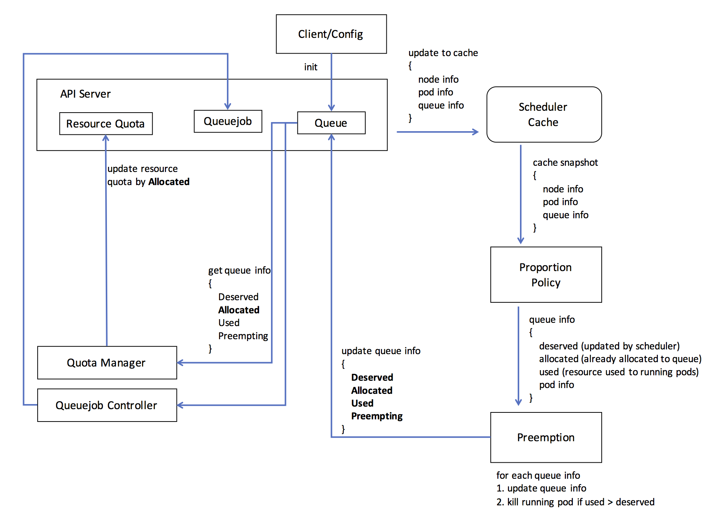

# Queue API

@jinzhejz, 10/18/2017

@k82cn, 9/16/2017

## Overview

[Resource sharing architecture for batch and serving workloads in Kubernetes](https://docs.google.com/document/d/1-H2hnZap7gQivcSU-9j4ZrJ8wE_WwcfOkTeAGjzUyLA/edit#) proposed
`QueueJob` feature to run batch job with services workload in Kubernetes. Considering the complexity, the 
whole batch job proposal was separated into two phase: `Queue` and `QueueJob`. This document 
presents the API definition of `Queue` for MVP.

### Scope

  * In MVP, the resource request of `QueueJob` are ignored
  * In MVP, the policy allocates resource based on `Queue`'s configuration
  * In MVP, `Queue` is namespace level

## Terminology

  * Deserved (Resource): The total number of resources that the batch allocated to the namespace
  * Overused: The namespace is overused if it used more resources than deserved resources
  * Underused: The namespace is underused if it used less resource than deserved resources

## API

```go
type Queue struct {
    metav1.TypeMeta   `json:",inline"`
    metav1.ObjectMeta `json:"metadata"`

    Spec QueueSpec
    Status QueueStatus
}

type QueueSpec struct {
    metav1.TypeMeta   `json:",inline"`
    metav1.ObjectMeta `json:"metadata"`

    // The weight of Queue, which is used by policy to allocate resource; the 
    // default value is 1. NOTE: it can not expect allocating more resouce with 
    // higher weight, it dependent on policy's reaction to the weight.
    Weight int
    
    // The resource request of Queue, which is used by policy to allocate resource.
    Request ResourceList
}

type QueueStatus struct {
    metav1.TypeMeta   `json:",inline"`
    metav1.ObjectMeta `json:"metadata"`

    // The deserved resource of Queue according to the policy
    Deserved    ResourceList
    // The resources that allocated to Queue, the allocated resource is less or 
    // equal to `Deserved`:
    //   * if some resource was preempting, the Allocated is less then Deserved
    //   * otherwise, Allocated equals to Deserved
    Allocated   ResourceList
    // The resource that used by Pod in namespace; if more resource was used than 
    // Deserved, the overused resource will be preempted.
    Used        ResourceList
    // The resources that are preempting for Queue
    Preempting  ResourceList
}
```

## Function Detail

### Workflow


### Admission Controller

### Quota Manager
Only Quota Manager can update Resource Quota. And it has two responsibility:

* Periodically query Queue status which contains allocated resources information from API server. Status struct is defined as `QueueStatus`
* Update `Allocated ` information in `QueueStatus` into Resource Quota

### Scheduler Cache

Scheduler Cache periodically fetches all Node/Pod/Queue information in the cluster from API server. That information will only be stored in memory and not persisted on disk.

It provides two interfaces `Run()` and `Dump()`

* `Run()` to trigger cache to periodically fetch Node/Pod/Queue information from API server
* `Dump()` create `Snapshot` for policy

```go
type Cache interface {
	// trigger cache to fetch Node/Pod/Queue 
	// information periodically from API server
	Run(stopCh <-chan struct{})

	// Dump deep copy overall Node/Pod/Queue information into Snapshot
	Dump() *Snapshot
}

type Snapshot struct {
	Pods       []*PodInfo
	Nodes      []*NodeInfo
	Queues     []*QueueInfo
	Queuejobs  []*QueuejobInfo
}
```

### Proportion Policy

The policy creates a summary of usable resources(CPU and memory) on all nodes and allocates them to each Queue by `Weight` and `Request` in `QueueSpec` according to max-min weighted fairness algorithm. `Pods` is not used in the policy, it is for preemption in next step.

```
Snapshot information:
------------------    ------------------ 
| Node-1         |    | Node-2         | 
|   cpu: 6       |    |   cpu: 3       | 
|   memory: 15Gi |    |   memory: 12Gi | 
------------------    ------------------ 
--------------------------    --------------------------
| Queue-1                |    | Queue-2                |
|   Weight: 2            |    |   Weight: 4            |
|   Request: cpu=5       |    |   Request: cpu=10      |
|            memory=10Gi |    |            memory=20Gi |
--------------------------    --------------------------

After policy scheduling:
---------------------------    ---------------------------
| Queue-1                 |    | Queue-2                 |
|    Weight: 2            |    |    Weight: 4            |
|    Request: cpu=5       |    |    Request: cpu=10      |
|             memory=10Gi |    |             memory=20Gi |
|                         |    |                         |
|    Deserved:            |    |    Deserved:            |
|      cpu: 3             |    |      cpu: 6             |
|      memory: 9Gi        |    |      memory: 18Gi       |
---------------------------    ---------------------------
```

Policy format scheduler results as `QueueInfo` and transfers to Preemption for next step.

```go
type QueueInfo struct {
   // The name of the queue
	name  string
	// Queue information contains Deserved/Allocated/Used/Preempting
	queue *Queue
	// Running pods under this queue
	pods  map[string]*Pod
}
```

### Preemption

Preemption is used to reclaim resource for overused(`Deserved` < `Allocated`) queue. The following status will be guaranteed after preemption done.

* The cluster won't be overused. 
* Each queue must meet `Deserved = Allocated`, it means the queue will get all resources allocated to it.
* Each queue must meet `Allocated >= Used`, it means the queue won't be overused.
* `Preempting` of each queue must be empty. If it is not empty, it means some pods are terminated to release resources to this queue, but it is not finished.

#### Brief workflow:

* Preprocess of `QueueInfo`. Currently, it terminates pods of overused(`Allocated < Used`) queue without preemption. Deserved/Allocated/Used/Preempting will not be adjusted in this stage.
* Adjust Deserved/Allocated/Used/Preempting of each Queue to trigger preemption, then update results to each Queue.
* Terminate running pods for each Queue which need preemption, and update Allocated of Queue after preempted pod is finished.

```go
type Interface interface {
	// Run start pod informer to handle terminating pods
	Run(stopCh <-chan struct{})

	// Preprocessing preprocess for each queue
	// Currently, it terminates pods of overused(Allocated < Used) queue without preemption
	// Deserved/Allocated/Used/Preempting will not be adjusted
	Preprocessing(queues map[string]*schedulercache.QueueInfo, pods []*schedulercache.PodInfo) (map[string]*schedulercache.QueueInfo, error)

	// PreemptResources preempt resources between queue
	// Deserved/Allocated/Used/Preempting will be adjusted
	PreemptResources(queues map[string]*schedulercache.QueueInfo) error
}
```

### Queuejob
The proportion policy just used Queue `weight` to allocate resources now,  it does not consider the queue job information, such as priority, resources requirement or some other factors. And we need provide some complex scheduling strategy to consider these queue job information.
