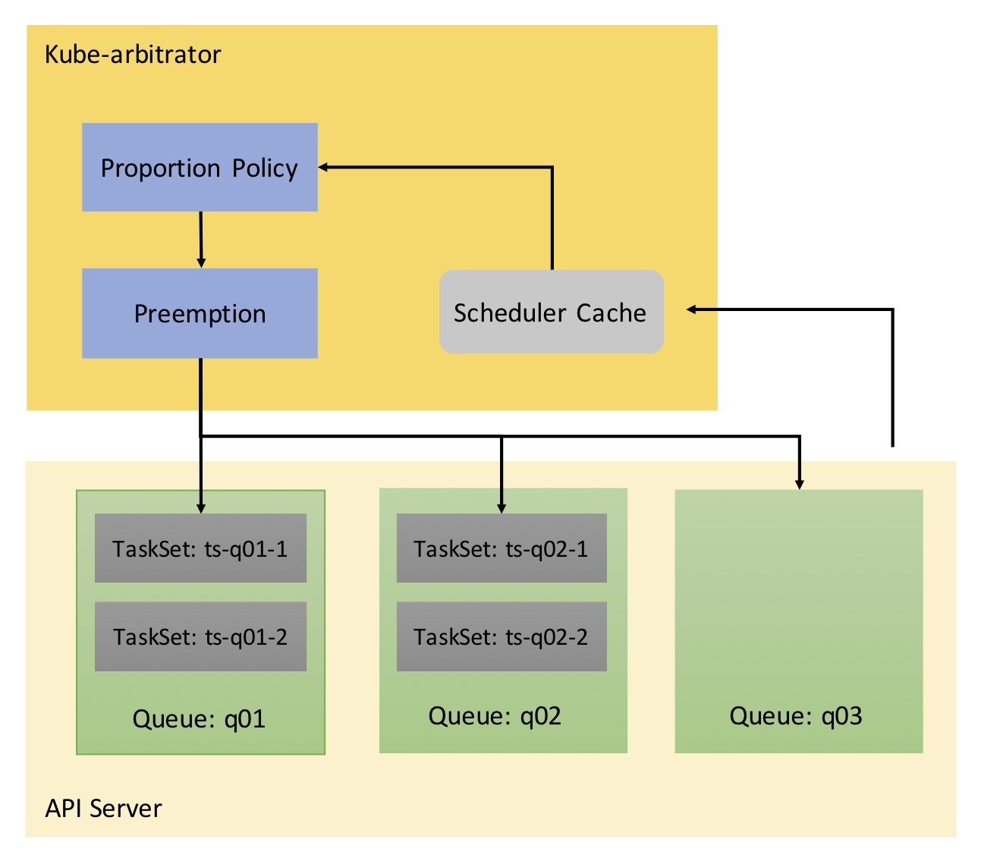

#Taskset(QueueJob) API

@jinzhejz, 12/13/2017

##Overview
[Resource sharing architecture for batch and serving workloads in Kubernetes](https://docs.google.com/document/d/1-H2hnZap7gQivcSU-9j4ZrJ8wE_WwcfOkTeAGjzUyLA/edit#) proposed
`QueueJob` feature to run batch job with services workload in Kuberentes. Considering the complexity, the whole batch job proposal was seperated into two phase: `Queue` and `QueueJob`. This document presents the API deinition of `QueueJob` and feature interaction with `Queue`.

There is already `QueueJob` in Kube-arbitrator for other feature, so use `TaskSet` instead of `QueueJob` in above.

##API
```go
// +k8s:deepcopy-gen:interfaces=k8s.io/apimachinery/pkg/runtime.Object
type TaskSet struct {
	metav1.TypeMeta   `json:",inline"`
	metav1.ObjectMeta `json:"metadata"`
	Spec              TaskSetSpec   `json:"spec"`
	Status            TaskSetStatus `json:"status,omitempty"`
}

type TaskSetSpec struct {
	// Priority of the TaskSet, higher priority TaskSet gets resources first
	Priority     int          `json:"priority"`
	// ResourceUnit * ResourceNo = total resource of TaskSet
	ResourceUnit ResourceList `json:"resourceunit"`
	ResourceNo   int          `json:"resourceno"`
	// The Queue which the TaskSet belongs to
	Queue        string       `json:"queue"`
}

type TaskSetStatus struct {
	// The resources allocated to the TaskSet
	Allocated ResourceList `json:"allocated"`
}

// +k8s:deepcopy-gen:interfaces=k8s.io/apimachinery/pkg/runtime.Object
type TaskSetList struct {
	metav1.TypeMeta `json:",inline"`
	metav1.ListMeta `json:"metadata"`
	Items           []TaskSet `json:"items"`
}
```

##Function details
###Workflow


It is basically the same as the workflow in Queue API document (`QuotaManager` is not included in above workflow). The difference is just including `TaskSet` in `Queue`.

A `Queue` can include 0 or more `TaskSet`. 

* If a Queue includes 0 TaskSet, its resource request is same as before. Such as `q03` in above.
* If a Queue includes 1 or more TaskSet, the resource request of the queue equals the sum of all TaskSet resource request. Such as `q01` and `q02` in above.

For Queue `q01` and `q02`, Kube-arbitrator will assign resources to their TaskSet directly.
For Queue `q03`, Kube-arbitrator will just assign resources to the Queue.

##Future work
* Now TaskSet is associated not with the real batch job, users who want to submit a batch job need to create their own TaskSet and watch the TaskSet, then submit their batch job after kube-arbitrator assign resources to TaskSet.