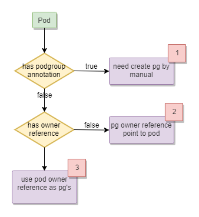

# Enhance Generate PodGroup OwnerReferences for Normal Pod

## Background
Volcano scheduler can schedule normal workload such as single Pod, Deployment, CronJob, Statefulset etc., and other CRD workflow. For these normal pod, volcano controller will create a podgroup for these workload. When it is a single Pod, controller will set podgroup `ownerReferences` points to this pod, otherwise controller will use pod`ownerReferences` as the podgroup's. 

For issue [2143](https://github.com/volcano-sh/volcano/issues/2143) when deployment update, it will create new replicaset and volcano controller will create new podgroup for replicaset. After several times update, the Deployment has many `Inqueue` podgroups. For example, it is not reasonable for one Deployment has four podgourps(three podgroups is in `Inqueue` and one in `Running` status) which consume resources in `overcommit` plugin.

<table>
	<tr>
	    <th>Deployment</th>
	    <th>ReplicaSet</th>
	    <th>PodGroup</th>  
	</tr>
	<tr>
	    <td rowspan="4">deploy-with-volcano</td>
	    <td>deploy-with-volcano-7bd985746b</td>
	    <td>podgroup-4f5210d9-3cba-4a59-b61c-1b243f464708</td>
	</tr>
	<tr>
	    <td>deploy-with-volcano-7f95dd7984</td>
	    <td>podgroup-17fec14a-232c-4e1c-942e-e4d1289fc60b</td>
	</tr>
	<tr>
	    <td>deploy-with-volcano-fd9dd69b6</td>
	    <td>podgroup-5edaeb31-f16e-49c4-ac81-4aa331ea8f19</td>
	</tr>
	<tr>
	    <td>deploy-with-volcano-995f85c44</td>
	    <td>podgroup-0296521d-9dad-4d68-8abf-2d4b32f3bfbc</td>
	</tr>
</table>

Let review volcano controller create podgroup process:

 

## Solution
Some workload control pod directly such as Job, SparkApplication etc. For these workload, we can use the pod's `ownerReferences` as podgroup's `ownerReferences`. Some workload will control pod by other resources such as Deployment controls pod by Replicaset or Workflow controls pod by other resources.

Volcano controller will introduce a configmap which stores (apiversion/kind/adjust-level) array. apiversion and kind can consist of GVK. adjust-level is integer which is used for workflow cases. 

```
apiVersion: v1
kind: ConfigMap
metadata:
  name: volcano-controller-configmap
  namespace: volcano-system
data:
  volcano-controller.conf: |
    podgroup-level-rules:
    - apiversion: apps/v1                    
      kind: deployment
      adjust-level: 0
    - apiversion: batch/v1                    
      kind: job
      adjust-level: 0
    - apiversion: argoproj.io/v1alpha1                   
      kind: workflow
      adjust-level: -1
```

In workflow case, one workflow consists of many different resources (job/application) and job/application consists of pods. So the podgroup should match with job/application level instead of workflow level. We can use workflow GVK and `adjust-level: -1` to achieve this purpose. "-1" means podgroup should just one level below this GVK.


When controller need create a podgroup, it will check the pod `ownerReferences` apiversion and kind if match one of the configmap rule. If yes, will use this `ownerReferences` as podgroup's `ownerReferences`; if not, controller will use `dynamicClient` to check parent resource `ownerReferences` recursively until get the one match the configmap rule or the root `ownerReferences`.
 
 

### DiscoveryClient & DynamicClient
From the `ownerReferences`, we can get or create a GVK and owner resource name. 
Discovery client is foucs on the k8s resources, it can get GVR from GVK. When get GVR and owner resource name, we can use Dynamic client to get the owner resource's `ownerReferences`.

### RBAC


## User Cases
Configmap:
```
apiVersion: v1
kind: ConfigMap
metadata:
  name: volcano-controller-configmap
  namespace: volcano-system
data:
  volcano-controller.conf: |
    podgroupLevel:
    - apiversion: apps/v1                    
      kind: deployment
      adjust-level: 0
    - apiversion: argoproj.io/v1alpha1                   
      kind: workflow
      adjust-level: -1
```
### 1. Single pod workload with scheduling.k8s.io/group-name annotation
Pod has scheduling.k8s.io/group-name annotation, controller will not create pg for it.

### 2. Single pod workload without scheduling.k8s.io/group-name annotation
Pod does not have owner reference, controller will create pg and set this pod as pg's owner reference.

### 3. Argo k8s job workflow
Consider argo workflow such as: 
```
apiVersion: argoproj.io/v1alpha1
kind: Workflow
metadata:
  generateName: k8s-jobs-
spec:
  entrypoint: pi-tmpl
  templates:
  - name: pi-tmpl
    resource:                  
      action: create           
      successCondition: status.succeeded > 0
      failureCondition: status.failed > 3
      manifest: |              
        apiVersion: batch/v1
        kind: Job
        metadata:
          generateName: pi-job-
        spec:
          template:
            metadata:
              name: pi
            spec:
              containers:
              - name: pi
                image: perl
                command: ["perl",  "-Mbignum=bpi", "-wle", "print bpi(2000)"]
              restartPolicy: Never
          backoffLimit: 4
```
Workflow create a Job and Pod's owner reference points to a Job. Because the configmap does not contain any information about workflow and job, finally controller will create a pg and use pod's owner reference (Job) information as pg's owner reference.

### 4. Deployment workload
Pod's owner reference points to a ReplicaSet and ReplicaSet's owner reference points to Deployment. Controller will search owner reference recursively, finally find the ReplicaSet's owner reference (Deployment) match one of the configmap rule. Controller will use this Deployment pg's owner reference.
