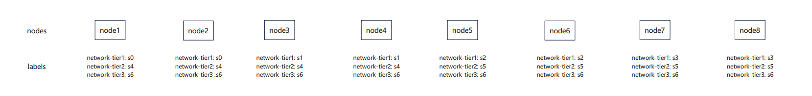
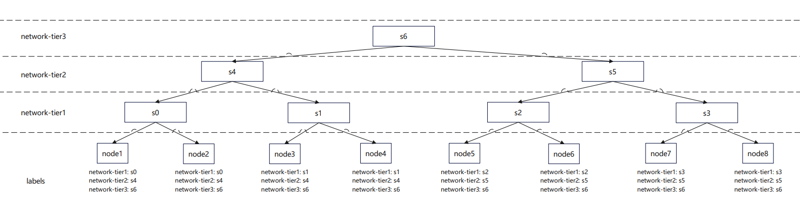

# Network topology Auto Discovery 

## Motivation 
This design proposes an automated solution for discovering network topologies from Kubernetes node labels and converting them into HyperNode resources. Currently, some users manage node network topologies using labels, which encapsulate the complete network topology for each node. To enable users to more conveniently utilize the `Network Topology Aware` feature, this design aims to automatically discovery network topologies from k8s node labels and convert into HyperNode resources.

For example, consider 8 nodes in k8s cluster with network topology keys `network-tier1`, `network-tier2`, `network-tier3`



From these node labels, We can derive a spine-leaf HyperNode topology three




## Goals
- **Configuration Loading**: Load the configuration containing key-value pairs for the node labels that should be recognized.

- **Automatic HyperNode Creation or Adjustment**: Automatically discover network topologies based on node labels and create, delete, or update HyperNodes as necessary to ensure compliance with the desired state.

## Implementation
- **Configuration**:
Configurations are stored in the ConfigMap named `volcano-networktopologyaware-configuration`, data structure:

```yaml
apiVersion: v1
kind: ConfigMap
metadata:
  name: volcano-networktopologyaware-configuration
  namespace: ${deploy_namespace}
data:
  node-label-based-topologies: |-
  topologies:
  - name: topology1
    topo-level-keys:
      - network-tier1  #lowest topology level
      - network-tier2
      - network-tier3  #highest topology level
```

- **Sync Controller**:
The workflow of Sync controller can be summarized in the following steps:

  - **Configuration Loading**
The controller loads the configuration from a specific ConfigMap named `volcano-networktopologyaware-configuration`, which includes the key-value pairs for the node labels to be recognized.

  - **Periodic Sync and HyperNode Resource Check**
At regular intervals（default: 1 second), the controller synchronizes and checks the current state of HyperNode resources to ensure they align with the expected configuration based on the node labels and the ConfigMap.

  - **Automatic HyperNode Creation or Adjustment**
If the controller finds that the HyperNodes do not match the expected configuration (e.g., a required HyperNode is missing or misconfigured), it automatically creates, deletes, or adjusts the HyperNode resources to bring them into compliance with the desired state.

## How to use

1. To configure the node label keys should be recognized, define them through the  `node_label_based_topologies_override` values in the `values.yaml` file of charts. The configuration must always follow a strict hierarchy, from the lowest layer to the highest layer.
For example:

```yaml
- name: topology1
  topo-level-keys:
    - network-tier1
    - network-tier2
    - network-tier3
```
This configuration instructs the controller to look for nodes with the label keys `network-tier1`，`network-tier2` and `network-tier3`

**_Warning: Ensure the order of the keys is correct. Incorrect ordering of the keys will generate a topology that does not match your expectations._** 

2. Assume you have k8s nodes with following labels:

```yaml
lables:
  network-tier1: s0
  network-tier2: s4
  network-tier3: s6
```

```yaml
lables:
  network-tier1: s1
  network-tier2: s4
  network-tier3: s6
```

```yaml
lables:
  network-tier1: s2
  network-tier2: s5
  network-tier3: s6
```

```yaml
lables:
  network-tier1: s3
  network-tier2: s5
  network-tier3: s6
```

3. Volcano will automatically create following HyperNode resources
`topology1-t1-s0-xxxx, topology1-t1-s1-xxxx, topology1-t1-s2-xxxx, topology1-t1-s3-xxxx, topology1-t2-s4-xxxx, topology1-t2-s5-xxxx, topology1-t3-s6-xxxx`

```yaml
apiVersion: topology.volcano.sh/v1alpha1
kind: HyperNode
metadata:
  name: topology1-t3-s6-xxxx
spec:
  members:
  - selector:
      exactMatch:
        name: topology1-t2-s4-xxxx
    type: HyperNode
  - selector:
      exactMatch:
        name: topology1-t2-s5-xxxx
    type: HyperNode
  tier: 3
```

```yaml
apiVersion: topology.volcano.sh/v1alpha1
kind: HyperNode
metadata:
  name: topology1-t2-s4-xxxx
spec:
  members:
  - selector:
      exactMatch:
        name: topology1-t1-s0-xxxx
    type: HyperNode
  - selector:
      exactMatch:
        name: topology1-t1-s1-xxxx
    type: HyperNode
  tier: 2
```
```yaml
apiVersion: topology.volcano.sh/v1alpha1
kind: HyperNode
metadata:
  name: topology1-t2-s5-xxxx
spec:
  members:
  - selector:
      exactMatch:
        name: topology1-t1-s2-xxxx
    type: HyperNode
  - selector:
      exactMatch:
        name: topology1-t1-s3-xxxx
    type: HyperNode
  tier: 2
```

```yaml
apiVersion: topology.volcano.sh/v1alpha1
kind: HyperNode
metadata:
  name: topology1-t1-s0-xxxx
spec:
  members:
  - selector:
      exactMatch:
        name: node1
    type: Node
  - selector:
      exactMatch:
        name: node2
    type: Node
  tier: 1
```

```yaml
apiVersion: topology.volcano.sh/v1alpha1
kind: HyperNode
metadata:
  name: topology1-t1-s1-xxxx
spec:
  members:
  - selector:
      exactMatch:
        name: node3
    type: Node
  - selector:
      exactMatch:
        name: node4
    type: Node
  tier: 1
```
```yaml
apiVersion: topology.volcano.sh/v1alpha1
kind: HyperNode
  name: topology1-t1-s2-xxxx
spec:
  members:
  - selector:
      exactMatch:
        name: node5
    type: Node
  - selector:
      exactMatch:
        name: node6
    type: Node
  tier: 1
```

```yaml
apiVersion: topology.volcano.sh/v1alpha1
kind: HyperNode
metadata:
  labels:
    volcano.io/label-based-topology-name: topology1
  name: topology1-t1-s3-xxxx
spec:
  members:
  - selector:
      exactMatch:
        name: node7
    type: Node
  - selector:
      exactMatch:
        name: node8
    type: Node
  tier: 1
```