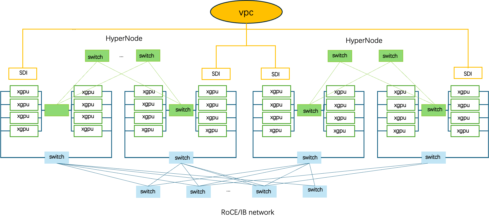
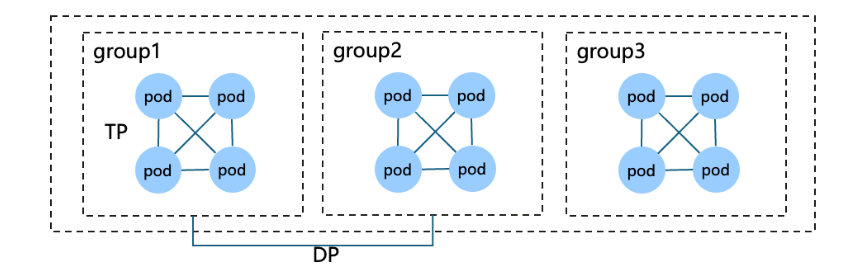
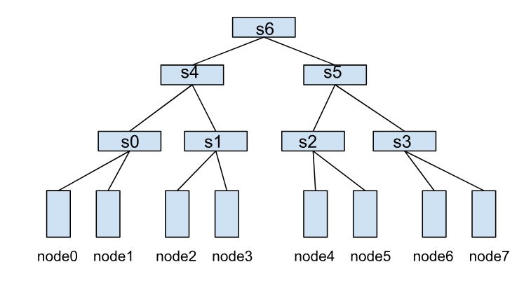
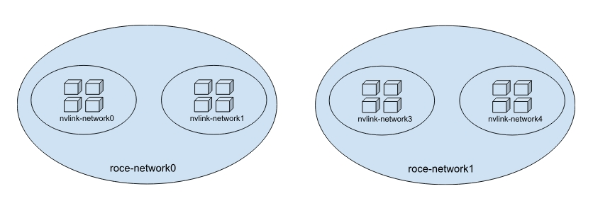
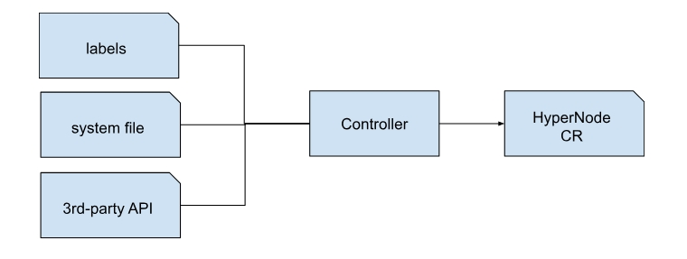
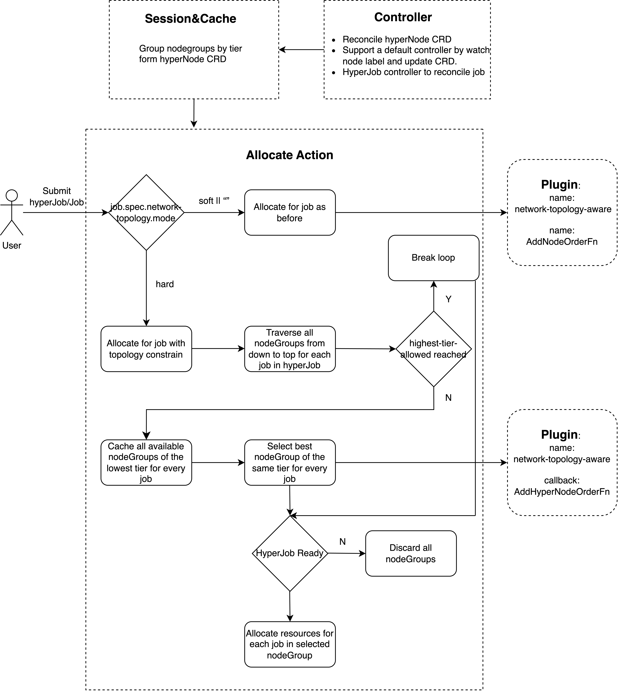

# Network Topology Aware Scheduling

Author: William Wang, Peng Gu, Kevin Wang, Klaus Ma, Xuzheng Chang

# Motivation

In the LLM training scenario, the model parallels have extremely high requirements for the network throughput to exchange data, making the networking to be a bottleneck. There are diverse network in the datacenter, e.g. IB, RoCE, Nvswitch and in each type of network, there might be multiple levels of switch having different throughput and latency. User requires that the workload can be scheduled to the best performance domain with highest throughput and lowest latency to accelerate data exchanging for training.

## Use Case 1

1. A training Job: 8 GPU per Pod \* \~3k (5k) Pods  
   eg,MPI, PyTorch …  
2. 1 BF3, 8 CX7, 8 H100


3. Schedule the job, prefer scheduling all pods to one tier1 topology zone, if not enough nodes, try to schedule all the pods to one tier2 topology zone.  
4. Gang scheduling is also needed in this case, to make sure all pods are able to proceed with their work. 

## Use Case 2

1. LLM training job:  16 NPU per pod, 3000 pods per job



2. There are 3 network control planes, which are VPC, Roce and HCCS.  
3. The pods in Job are expected to be grouped and the pods belonging to the same group have higher demand for the network bandwidth. The tensor parallels are performed on pods in the same group.  


4. The pods belonging to the same group are required to be scheduled to HCCS topology zone.  
5. Prefer to schedule the pod group to one HCCS topology zone, if not enough nodes, try to schedule to the RoCE topology zone and then the VPC topology zone.  
6. Gang scheduling is required in this case, to make sure all pods are able to proceed with their work.

# Scope:

In Scope:

* support clos network topology define and management  
* support network topology aware scheduling for Volcano job  
* support spine-leaf network

# Function Detail

### network topology management

Option 1: Describe network topology by labels, there's a proposal in upstream  
Cons: 
* complicated to construct tree for the topology information  

Option 2: Describe network topology by CRD, NetworkTopology in Volcano → plugin/scheduling

- label \-\> NetworkTopology   
- Rest API (NV, HW) \-\> NetworkTopology
- system file \-\> NetworkTopology

Pros: 
  * easier for debugging:  
  * engineers don’t need to construct the tree of topology info by themselves.   
  * the scheduler uses the same as engineers can see.

* Components besides scheduler are able to use the CR as well

#### network topology definition

`HyperNode` is a performance domain which consists of a group of nodes or sub-performance domains.The network bandwidth and latency is the same in one HyperNode. This CRD is used to describe the network topology in Kubernetes cluster.

`Tier` is a way to distinguish different performance domains. The bandwidth and latency are the same in one tier. The smaller the value of the tier, the higher the bandwidth. For example, compute-network and storage network can be in different tiers, or in the compute-network, there are several levels of spine, leaf switches, each level can be identified as a tier.

```go
type HyperNode struct {
  metav1.TypeMeta `json:”,inline”`
  metav1.ObjectMeta `json:”metadata, omitempty”`

  Spec HyperNodeSpec `json:”spec”`
  Status HyperNodeStatus `json:”status”`
}

type HyperNodeSpec struct {
  tier string	`json:"tier,omitempty"`
  members []MemberSpec	`json:"members,omitempty"`
}

type MemberSpec struct {
  name string	`json:"name,omitempty"`
  type string	`json:"type,omitempty"`
}

type HyperNodeStatus struct {
  ……
}

```

Here are two examples:

Example 1:  
Here is a spine-leaf tree, there are three levels of switches, connecting the 8 nodes.


```yaml
version: topology.volcano.sh/v1alpha1
kind: HyperNode
name: s0
spec:
  tier: 1
  members:
  - name: node0
    name: node1
---
version: topology.volcano.sh/v1alpha1
kind: HyperNode
name: s1
spec:
   tier: 1
   members:
    name: node2
    name: node3
---
version: topology.volcano.sh/v1alpha1
kind: HyperNode
name: s2
spec:
   tier: 1
   members:
    name: node4
    name: node5
---
version: topology.volcano.sh/v1alpha1
kind: HyperNode
name: s3
spec:
   tier: 1
   members:
    name: node6
    name: node7
---
version: topology.volcano.sh/v1alpha1
kind: HyperNode
name: s4
spec:
   tier: 2
   members:
    name: s0
    name: s1
version: topology.volcano.sh/v1alpha1
kind: HyperNode
name: s5
spec:
   tier: 2
   members:
    name: s2
    name: s3
---
version: topology.volcano.sh/v1alpha1
kind: HyperNode
name: s6
spec:
   tier: 3
   members:
    name: s4
    name: s5

```

Example 2:  
There are two roce networks in one Kubernetes cluster which are roce-network0 and roce-network1, and there are two nvlink-networks in each roce network. Each nvlink-network has 4 hosts. The CR is like this.


```yaml
version: topology.volcano.sh/v1alpha1
kind: HyperNode
name: roce-network0
spec:
tier: 2
  members:
  - name: nvlink-network0
    type: HyperNode
  - name: nvlink-network1
    type: HyperNode
---
version: topology.volcano.sh/v1alpha1
kind: HyperNode
name: roce-network1
spec:
  tier: 2
  members:
  - name: nvlink-network2
    type: HyperNode
  - name: nvlink-network3
    type: HyperNode
---
version: topology.volcano.sh/v1alpha1
kind: HyperNode
name: nvlink_network-0
spec:
  tier: 1
  members:
  - name: node1
    type: Node
    name: node2
    type: Node
---
version: topology.volcano.sh/v1alpha1
kind: HyperNode
name: nvlink_network-1
spec:
  tier: 1
  members:
  - name: node3
    type: Node
    name: node4
    type: Node
---
version: topology.volcano.sh/v1alpha1
kind: HyperNode
name: nvlink_network-2
spec:
  tier: 1
  members:
  - name: node5
    type: Node
    name: node6
    type: Node
---
version: topology.volcano.sh/v1alpha1
kind: HyperNode
name: nvlink_network-3
spec:
  tier: 1
  members:
  - name: node7
    type: Node
    name: node8
    type: Node
```

#### network topology generation and update

* **Network topology discovery/detection tool**: a tool to generate network topology CR by analyzing labels, system file or API of HW vendor. The community will offer a tool to generate CR by label.  
    

### Job management

HyperJob is an API for managing a group of replicated volcano jobs, which aligns with HyperNode/SuperPod for optimal LLM training. In the large model training scenario, users need to deploy a group of vcjobs, because some large model training requires a group of vcjobs to work together to complete. At the same time, when the training job is abnormal, users can restart only one of the vcjobs without restarting the entire training job. Different vcjobs are isolated from each other, which can improve training efficiency and availability. Each vcjob needs to occupy a hyperNode exclusively. Multiple vcjobs constitute a complete training job, and multiple vcjobs need to meet gang scheduling and topology constraint scheduling to meet the performance requirements of large model training.

```go
type HyperJob struct {  
	metav1.TypeMeta `json:",inline"\`

	// +optional  
	metav1.ObjectMeta `json:"metadata,omitempty" protobuf:"bytes,1,opt,name=metadata"\`

	// Specification of the desired behavior of the volcano Hyperjob, including the minAvailable  
	// +optional  
	Spec HyperJobSpec `json:"spec,omitempty" protobuf:"bytes,2,opt,name=spec"\`

	// Current status of the volcano HyperJob  
	// +optional  
	Status HyperJobStatus `json:"status,omitempty" protobuf:"bytes,3,opt,name=status"\`  
}

type HyperJobSpec struct {  
	// The minimal available Job to run for this HyperJob  
	// Defaults to the summary of jobs' replicas  
	// +optional  
	MinAvailable int32 `json:"minAvailable,omitempty" protobuf:"bytes,2,opt,name=minAvailable"\`

    // NetworkTopology defines the NetworkTopology config, this field works in conjunction with network topology feature and hyperNode CRD.
    // +optional
    NetworkTopology *NetworkTopologySpec `json:"networkTopology,omitempty"

    Jobs []JobSepc `json:"jobs,omitempty" protobuf:"bytes,4,opt,name=jobs"\`
  
    ...  
}
```

##### Volcano Job sample:

```yaml
apiVersion: topology.volcano.sh/v1alpha1
kind: Job  
metadata:  
  name: pytorch-job  
spec:  
  minAvailable: 1  
  schedulerName: volcano  
  // describes the network topology scheduling requirement of jobs  
  // example: hard, with highest-tier-allowed: 1, means for each job-foo, scheduler needs to find a tier1 to run all the job-foo pods.   
  networkTopology:  
  - mode: hard 
    highestTierAllowed: 1
  plugins:  
    pytorch: ["--master=master","--worker=worker","--port=23456"] # Pytorch plugin register  
  tasks:  
    - replicas: 1  
      name: master  
      policies:  
        - event: TaskCompleted  
          action: CompleteJob  
      template:  
        spec:  
          containers:  
            - image: gcr.io/kubeflow-ci/pytorch-dist-sendrecv-test:1.0  
              imagePullPolicy: IfNotPresent  
              name: master  
          restartPolicy: OnFailure  
    - replicas: 2  
      name: worker  
      template:  
        spec:  
          containers:  
            - image: gcr.io/kubeflow-ci/pytorch-dist-sendrecv-test:1.0  
              imagePullPolicy: IfNotPresent  
              name: worker  
              workingDir: /home  
          restartPolicy: OnFailure
```

##### HyperJob sample:

```yaml
apiVersion: topology.volcano.sh/v1alpha1 
kind: HyperJob  
metadata:  
    name: multi-volcano-job  
spec:  
    networkTopology: 
    - mode: hard** // we don’t really need to explicitly indicate the soft requirements, we can make it as a default algorithm behavior. And we need to describe the default behavior in the field comment  
      highestTierAllowed: 2**  
    replicatedJobs:  
    - replicas: 40  
      name: volcano-job  
      template:  
           // describes the network topology scheduling requirement of jobs  
           // example: hard, with highest-tier-allowed: 1, means for each job-foo, scheduler needs to find a tier1 to run all the job-foo pods.   
        networkTopology:
        - mode: hard
          highestTierAllowed: 1
         schedulerName: volcano  
         tasks:  
         - replicas: 32  
           name: “worker”  
           template:  
              spec:  
                  containers:  
                  - name: worker  
                    image: alpine  
                    command: [“/bin/sh”, “-c”, “sleep 3600”]  
                    imagePullPolicy: IfNotPresent  
                    resources:  
                       requests:  
                          gpu: 8  
                       limits:  
                          gpu: 8
```

## Implementation

### Overview

Phase 1 without hyperJob supported  


Phase 2 with hyperJob supported  
  
A naive way to build nodes by tier as an input of volcano scheduler, scheduler traverses sequentially from low to high tier, the selected nodeGroups of a hyperJob should be in one same tier because we start from the lowest tier, and will stop to search the upper tier when current tier can meet hyperJob/Job’s resources.  
For prioritization phase of hard limit topology, the nodeOrder and hyperNodeOrder scores would be summed as the final score of a hyperNode and select the highest score hyperNode, the fewer layers a candidate hyperNode spans, and the more pods of the same job are deployed on the hyperNode, the higher the score of the hyperNode.
.
eg:  
```shell
tier0: [][] *node{ {node0,node1}, {node2,node3},{node4,node5}, {node6,node7} }  
tier1: [][] *node{ {node0,node1,node2,node3}, {node4,node5,node6,node7} }  
tier2: [][] *node{ {node0,node1,node2,node3, node4,node5,node6,node7} }
```

### API

HyperNode:

```go
package v1alpha1

import (
	metav1 "k8s.io/apimachinery/pkg/apis/meta/v1"
)

// +genclient
// +k8s:deepcopy-gen:interfaces=k8s.io/apimachinery/pkg/runtime.Object
// +kubebuilder:object:root=true
// +genclient:nonNamespaced
// +kubebuilder:resource:path=hypernodes,shortName=hn,scope=Cluster
// +kubebuilder:subresource:status
// +kubebuilder:printcolumn:name="Tier",type=string,JSONPath=`.spec.tier`
// +kubebuilder:printcolumn:name="NodeCount",type=integer,JSONPath=`.status.nodeCount`
// +kubebuilder:printcolumn:name="Age",type=date,JSONPath=`.metadata.creationTimestamp`

// HyperNode represents a collection of nodes sharing similar network topology or performance characteristics.
type HyperNode struct {
   metav1.TypeMeta   `json:",inline"`
   metav1.ObjectMeta `json:"metadata,omitempty"`

   // Spec defines the desired configuration of the HyperNode.
   // +optional
   Spec HyperNodeSpec `json:"spec"`

   // Status provides the current state of the HyperNode.
   // +optional
   Status HyperNodeStatus `json:"status,omitempty"`
}

// MemberType represents the member type, valid values are "Node" and "HyperNode".
// +kubebuilder:validation:Enum=Node;HyperNode
type MemberType string

const (
   // MemberTypeNode means the member type is a node.
   MemberTypeNode MemberType = "Node"
   // MemberTypeHyperNode means the member type is a hyperNode.
   MemberTypeHyperNode MemberType = "HyperNode"
)

// HyperNodeSpec defines the desired state of a HyperNode.
type HyperNodeSpec struct {
   // Tier categorizes the performance level of the HyperNode.
   // +required
   Tier string `json:"tier,omitempty"`

   // Members defines a list of node groups or individual nodes included in the HyperNode.
   // +optional
   Members []MemberSpec `json:"members,omitempty"`
}

// MemberSpec represents a specific node or a hyperNodes in the hyperNode.
type MemberSpec struct {
   // Type specifies the member type.
   // +required
   Type MemberType `json:"type,omitempty"`

   // Selector defines the selection rules for this member.
   // +optional
   Selector MemberSelector `json:"selector,omitempty"`
}

// MemberSelector defines the criteria for selecting nodes.
//
// Example for Exact match:
//
//	members:
//	- selector:
//	    exactMatch:
//	      name: "node1"
//
// Example for Regex match:
//
//	members:
//	- selector:
//	    regexMatch:
//	      pattern: "^node-[0-9]+$"
//
// +kubebuilder:validation:XValidation:rule="self.exactMatch != null || self.regexMatch != null",message="Either ExactMatch or RegexMatch must be specified"
// +kubebuilder:validation:XValidation:rule="!(self.exactMatch != null && self.regexMatch != null)",message="ExactMatch and RegexMatch cannot be specified together"
type MemberSelector struct {
   // ExactMatch defines the exact match criteria (required when Type is "Exact").
   // +optional
   ExactMatch *ExactMatch `json:"exactMatch,omitempty"`

   // RegexMatch defines the regex match criteria (required when Type is "Regex").
   // +optional
   RegexMatch *RegexMatch `json:"regexMatch,omitempty"`
}

// ExactMatch represents the criteria for exact name matching.
type ExactMatch struct {
   // Name specifies the exact name of the node or hyperNode to match.
   // +optional
   Name string `json:"name"`
}

// RegexMatch represents the criteria for regex-based matching.
type RegexMatch struct {
   // Pattern defines the regex pattern to match node or hyperNode names.
   // +optional
   Pattern string `json:"pattern"`
}

// HyperNodeStatus represents the observed state of a HyperNode.
type HyperNodeStatus struct {
   // Conditions provide details about the current state of the HyperNode.
   Conditions []metav1.Condition `json:"conditions,omitempty"`

   // NodeCount is the total number of nodes currently in the HyperNode.
   // +kubebuilder:validation:Minimum=0
   NodeCount int64 `json:"nodeCount,omitempty"`
}

// +k8s:deepcopy-gen:interfaces=k8s.io/apimachinery/pkg/runtime.Object
// +kubebuilder:object:root=true

// HyperNodeList contains a list of HyperNode resources.
type HyperNodeList struct {
   metav1.TypeMeta `json:",inline"`
   metav1.ListMeta `json:"metadata,omitempty"`

   // Items is the list of HyperNodes.
   Items []HyperNode `json:"items"`
}

```

vcJob:

```go
type JobSpec struct {
	...
	
	// New added field.
	// NetworkTopology defines the NetworkTopology config, this field works in conjunction with network topology feature and hyperNode CRD.
    // +optional
    NetworkTopology *NetworkTopologySpec `json:"networkTopology,omitempty" protobuf:"bytes,13,opt,name=networkTopology"`
}

// NetworkTopologyMode represents the networkTopology mode, valid values are "hard" and "soft".
// +kubebuilder:validation:Enum=hard;soft
type NetworkTopologyMode string

const (
    // HardNetworkTopologyMode represents a strict network topology constraint that jobs must adhere to.
    HardNetworkTopologyMode NetworkTopologyMode = "hard"

    // SoftNetworkTopologyMode represents a flexible network topology constraint that allows jobs
    // to cross network boundaries under certain conditions.
    SoftNetworkTopologyMode NetworkTopologyMode = "soft"
)

type NetworkTopologySpec struct {
    // Mode specifies the mode of the network topology constrain.
    // +kubebuilder:default=hard
    // +optional
    Mode NetworkTopologyMode `json:"mode,omitempty" protobuf:"bytes,1,opt,name=mode"`

    // HighestTierAllowed specifies the highest tier that a job allowed to cross when scheduling.
    // +kubebuilder:default=1
    // +optional
    HighestTierAllowed *int `json:"highestTierAllowed,omitempty" protobuf:"bytes,2,opt,name=highestTierAllowed"`
}
```

auto generate code for job, hyperJob, hyperNode,  
refer the API repo [volcano-sh/apis: The API (CRD) of Volcano (github.com)](https://github.com/volcano-sh/apis) and add CRDs, generate codes and submit to the repo.

### Scheduler

**configuration:**

- allow users to configure the network topology policy in job  

- allow users to enable/disable the network-topology-aware plugin in scheduler configmap

**action:** allocate

Phase1:
Allocate resources for queue-\> Job \-\> Task.

Phase2:
Allocate resources for queue-\> hyperJob \-\> Job \-\> Task.

**plugin:** network-topology-aware

- AddJobGroupReadyFn: check whether hyperJob minAvailable is met.(phase 2)  

- AddHyperNodeOrderFn: score for hyperNodes.(take effect in hard limit, closest tiers have higher score)
1. If a Job is being scheduled for the very first time, candidate hypernodes that need to be scored will get a score of 0 and then return right away. The name of the HyperNode where the Job eventually gets scheduled successfully will be recorded in the Job's annotations under the key JobAllocatedHyperNode.
2. If it is not the first scheduling of a job, calculate the LCAHyperNode (Lowest Common Ancestor HyperNode) between candidate hypernodes(In the Allocate process, the system will calculate whether the LCAHyperNode tier of the hyperNode meets the Hard limit. If it doesn't, the hyperNode will be filtered out.) that need to be scored and the `JobAllocatedHyperNode` of the job. The lower the tier of the calculated LCAHyperNode, the higher the score. If there is only one highest score, return the scoring result.
3. If there is more than one HyperNode with the highest score in the scoring result of step 2, calculate the distribution of the tasks that have been successfully scheduled for the job among these HyperNodes. The greater the distribution quantity, the higher the score.
4. The HyperNode that is successfully scheduled in the end in steps 2 and 3 will also be recorded as the `JobAllocatedHyperNode` attribute of the job.

- AddNodeOrderFn: score for nodes.(take effect in soft limit, closest tiers have higher score)
1. To score all nodes, we need to first obtain the HyperNode to which the node belongs and the `JobAllocatedHyperNode` of the job to which the task belongs.
2. The subsequent scoring logic is the same as that in the Hard mode. The score of the HyperNode to which it belongs is calculated as the score of the node. 

### Webhook

Add admission for hyperNode for two aspects validation

- `ExactMatch` and `RegexMatch` in `HyperNode.Spec.Members.Selector` can not both empty and cannot be specified at the same time.

- `Pattern` in `HyperNode.Spec.Members.Selector.RegexMatch` should be a valid regex expression in go format.

### Controller

Phase1:  

- Nothing to do, users need create hyperNode CRs according to the cluster's network topology.

Phase2:  

- Support hyperJob, create jobs when hyperJob is created.

- Support update hyperNode.status, include node count, condition, etc.

### Effort and plan

Phase1:  
Volcano job Webhook & API: 0.25 man-month    
Controller: 0.5 man-month   
Scheduler: 0.75 man-month

Phase2:  
HyperJob API: 0.25 man-month  
Controller: 0.5 man-month  
Scheduler: 0.25 man-month

## Feature Interaction

### Performance

Build nodeGroups list from hyperNode CRD may increase the time complexity when there are too many nodes and switches, and we need to optimize performance.

### GUI/CLI

topology-generator : a new tool/controller to generate topology CR by labels, a new tool to display the hierarchical switches and nodes intuitively.

# References

meeting records:  
[https://docs.google.com/document/d/10r\_8iAayFMAnZXl5ImanKCpoNMlwz8pZ25nS2rQ7uyc/edit?tab=t.0](https://docs.google.com/document/d/10r_8iAayFMAnZXl5ImanKCpoNMlwz8pZ25nS2rQ7uyc/edit?tab=t.0) 
