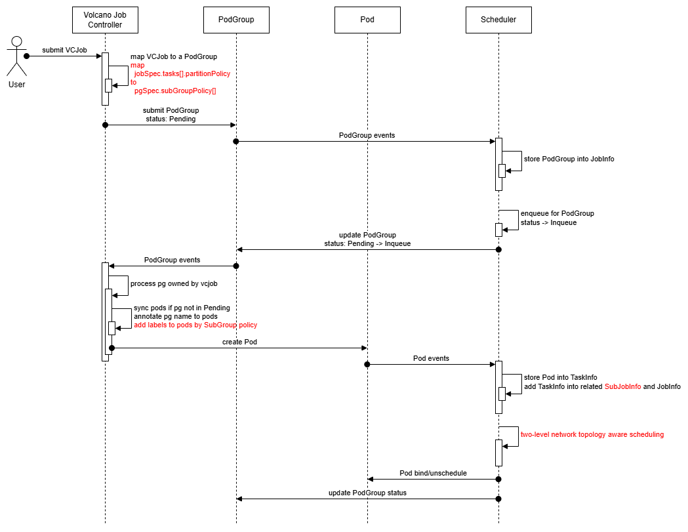
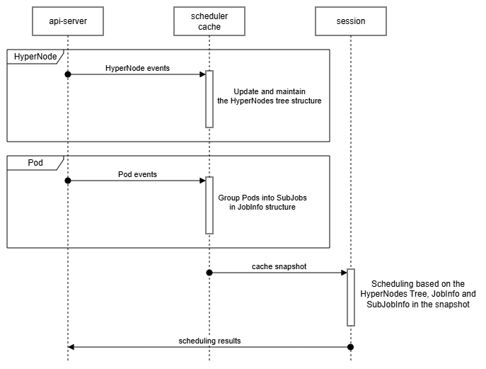
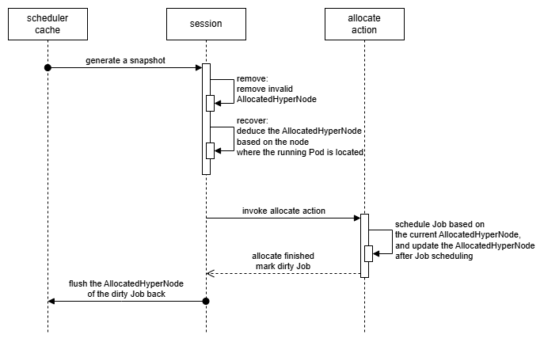
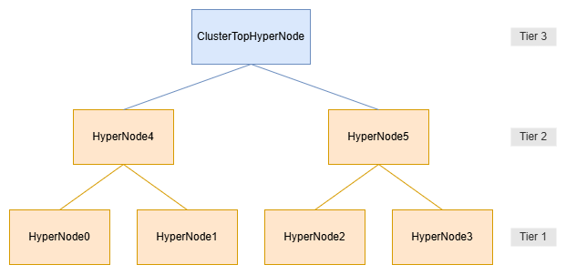
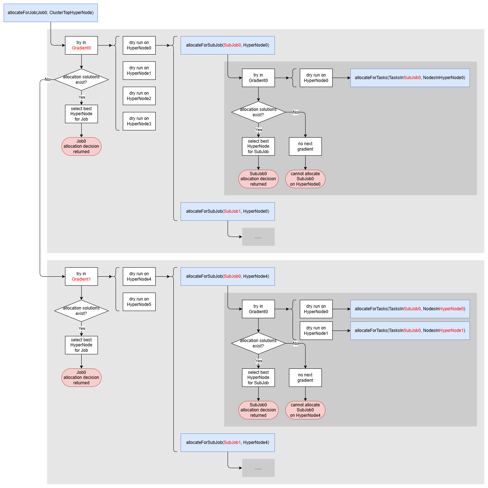

# Network Topology Aware Scheduling

Author: William Wang, Peng Gu, Kevin Wang, Klaus Ma, Xuzheng Chang, ouyangshengjia

# Motivation

In the LLM training scenario, the model parallels have extremely high requirements for the network throughput to exchange data, making the networking to be a bottleneck. There are diverse network in the datacenter, e.g. IB, RoCE, Nvswitch and in each type of network, there might be multiple levels of switch having different throughput and latency. User requires that the workload can be scheduled to the best performance domain with highest throughput and lowest latency to accelerate data exchanging for training.

## Use Case 1

1. A training Job: 8 GPU per Pod \* \~3k (5k) Pods  
   eg,MPI, PyTorch …
2. 1 BF3, 8 CX7, 8 H100

   

3. Schedule the job, prefer scheduling all pods to one tier1 topology zone, if not enough nodes, try to schedule all the pods to one tier2 topology zone.
4. Gang scheduling is also needed in this case, to make sure all pods are able to proceed with their work.

## Use Case 2

1. LLM training job: 16 NPU per pod, 3000 pods per job

   

2. There are 3 network control planes, which are VPC, Roce and HCCS.
3. The pods in Job are expected to be grouped and the pods belonging to the same group have higher demand for the network bandwidth. The tensor parallels are performed on pods in the same group.  
   

4. The pods belonging to the same group are required to be scheduled to HCCS topology zone.
5. Prefer to schedule the pod group to one HCCS topology zone, if not enough nodes, try to schedule to the RoCE topology zone and then the VPC topology zone.
6. Gang scheduling is required in this case, to make sure all pods are able to proceed with their work.

# Scope

In Scope:

- support clos network topology define and management
- support two-level network topology aware scheduling for Volcano Job
- support spine-leaf network

# Function Detail

## network topology management

Option 1: Describe network topology by labels, there's a proposal in upstream  
Cons:

- complicated to construct tree for the topology information

Option 2: Describe network topology by CRD, NetworkTopology in Volcano → plugin/scheduling

- label \-\> NetworkTopology
- Rest API (NV, HW) \-\> NetworkTopology
- system file \-\> NetworkTopology

Pros:

- easier for debugging:
- engineers don’t need to construct the tree of topology info by themselves.
- the scheduler uses the same as engineers can see.
- Components besides scheduler are able to use the CR as well

### network topology definition

`HyperNode` is a performance domain which consists of a group of nodes or sub-performance domains.The network bandwidth and latency is the same in one HyperNode. This CRD is used to describe the network topology in Kubernetes cluster.

`Tier` is a way to distinguish different performance domains. The bandwidth and latency are the same in one tier. The smaller the value of the tier, the higher the bandwidth. For example, compute-network and storage network can be in different tiers, or in the compute-network, there are several levels of spine, leaf switches, each level can be identified as a tier.

```go
type HyperNode struct {
  metav1.TypeMeta `json:”,inline”`
  metav1.ObjectMeta `json:”metadata, omitempty”`

  Spec HyperNodeSpec `json:”spec”`
  Status HyperNodeStatus `json:”status”`
}

type HyperNodeSpec struct {
  tier string	`json:"tier,omitempty"`
  members []MemberSpec	`json:"members,omitempty"`
}

type MemberSpec struct {
  name string	`json:"name,omitempty"`
  type string	`json:"type,omitempty"`
}

type HyperNodeStatus struct {
  ……
}

```

Here are two examples:

Example 1:  
Here is a spine-leaf tree, there are three levels of switches, connecting the 8 nodes.


```yaml
version: topology.volcano.sh/v1alpha1
kind: HyperNode
name: s0
spec:
  tier: 1
  members:
  - name: node0
    name: node1
---
version: topology.volcano.sh/v1alpha1
kind: HyperNode
name: s1
spec:
   tier: 1
   members:
    name: node2
    name: node3
---
version: topology.volcano.sh/v1alpha1
kind: HyperNode
name: s2
spec:
   tier: 1
   members:
    name: node4
    name: node5
---
version: topology.volcano.sh/v1alpha1
kind: HyperNode
name: s3
spec:
   tier: 1
   members:
    name: node6
    name: node7
---
version: topology.volcano.sh/v1alpha1
kind: HyperNode
name: s4
spec:
   tier: 2
   members:
    name: s0
    name: s1
version: topology.volcano.sh/v1alpha1
kind: HyperNode
name: s5
spec:
   tier: 2
   members:
    name: s2
    name: s3
---
version: topology.volcano.sh/v1alpha1
kind: HyperNode
name: s6
spec:
   tier: 3
   members:
    name: s4
    name: s5

```

Example 2:  
There are two roce networks in one Kubernetes cluster which are roce-network0 and roce-network1, and there are two nvlink-networks in each roce network. Each nvlink-network has 4 hosts. The CR is like this.


```yaml
version: topology.volcano.sh/v1alpha1
kind: HyperNode
name: roce-network0
spec:
tier: 2
  members:
  - name: nvlink-network0
    type: HyperNode
  - name: nvlink-network1
    type: HyperNode
---
version: topology.volcano.sh/v1alpha1
kind: HyperNode
name: roce-network1
spec:
  tier: 2
  members:
  - name: nvlink-network2
    type: HyperNode
  - name: nvlink-network3
    type: HyperNode
---
version: topology.volcano.sh/v1alpha1
kind: HyperNode
name: nvlink_network-0
spec:
  tier: 1
  members:
  - name: node1
    type: Node
    name: node2
    type: Node
---
version: topology.volcano.sh/v1alpha1
kind: HyperNode
name: nvlink_network-1
spec:
  tier: 1
  members:
  - name: node3
    type: Node
    name: node4
    type: Node
---
version: topology.volcano.sh/v1alpha1
kind: HyperNode
name: nvlink_network-2
spec:
  tier: 1
  members:
  - name: node5
    type: Node
    name: node6
    type: Node
---
version: topology.volcano.sh/v1alpha1
kind: HyperNode
name: nvlink_network-3
spec:
  tier: 1
  members:
  - name: node7
    type: Node
    name: node8
    type: Node
```

### network topology generation and update

- **Network topology discovery/detection tool**: a tool to generate network topology CR by analyzing labels, system file or API of HW vendor. The community will offer a tool to generate CR by label.  
  

## Job management

In large model training scenarios, the entire training task requires enormous resources, which typically cannot be deployed within a single network performance domain. It's necessary to split the training task into pipeline parallelism (PP) or data parallelism (DP), allowing parallel tasks to be deployed across network performance domains.

To address this, Volcano provides the SubGroup Affinity Policy. In a Volcano Job, the `partitionPolicy` field can be configured to partition Pods within a Job, and network topology constraints can be configured for each partition.

During scheduling, each partition will follow its own network topology constraints, thereby meeting the network communication performance requirements of each parallel task partition.

At the same time, when a partition is abnormal, users can restart this partition only instead of restarting the entire training job. Different partitions are isolated from each other, which can improve training efficiency and availability.

In addition, each partition must follow the Gang scheduling constraints. That is, a partition is allowed to be scheduled only when all pods within it meet the scheduling conditions.

For example, the following configuration indicates that the entire job is only allowed to be scheduled to HyperNodes at Tier 2 or below. And within the job, the 8 Pods are divided into 2 partitions, and each partition can only be scheduled to HyperNodes at Tier 1.

```yaml
apiVersion: batch.volcano.sh/v1alpha1
kind: Job
metadata:
  name: network-topology-job
  namespace: default
spec:
  schedulerName: volcano
  minAvailable: 4
  networkTopology:
    mode: hard
    highestTierAllowed: 2
  tasks:
    - name: t0
      replicas: 8
      partitionPolicy:
        totalPartitions: 2
        partitionSize: 4
        networkTopology:
          mode: hard
          highestTierAllowed: 1
      template:
        spec:
          containers:
            - name: c0
              image: nginx:latest
              resources:
                requests:
                  cpu: "4"
                limits:
                  cpu: "4"
```

# Implementation

## Overview

This chapter describes the architectural implementation of network topology aware scheduling across multiple Volcano components. The implementation spans four main areas:

1. **API & CRDs**: Introduces new Kubernetes Custom Resource Definitions (HyperNode) and extends existing Volcano Job/PodGroup APIs to support network topology constraints. The HyperNode CRD represents hierarchical performance domains in the cluster, while Job specification is extended with partition policies and network topology constraints.

2. **Admission Webhooks**: Provides validation for the new HyperNode CRD to ensure configuration correctness, including member selector validation and regex pattern verification.

3. **Job Controller**: Extends the Volcano Job Controller to map network topology constraints from Volcano Job specifications to PodGroup specifications. During this process, Pods are automatically labeled with subgroup identifiers based on partition policies, enabling fine-grained scheduling constraints.

4. **Scheduler**: Implements the core scheduling logic with the following key enhancements:
   - **Cache Layer**: Introduces HyperNodeInfo, SubJobInfo structures to represent network topology in the scheduler's object model
   - **Plugin Framework**: Extends the plugin system with new functions for HyperNode gradient organization, HyperNode ordering, SubJob readiness checks, and SubJob ordering
   - **Allocation Logic**: Implements a two-level scheduling strategy that respects both Job-level and SubJob-level network topology constraints, with intelligent HyperNode selection based on tier preferences and resource utilization. Besides, two-level gang scheduling is supported to ensure that both Jobs and SubJobs are scheduled atomically.

The interactions among Volcano components are shown as follow:



## API

HyperNode:

```go
package v1alpha1

import (
	metav1 "k8s.io/apimachinery/pkg/apis/meta/v1"
)

// +genclient
// +k8s:deepcopy-gen:interfaces=k8s.io/apimachinery/pkg/runtime.Object
// +kubebuilder:object:root=true
// +genclient:nonNamespaced
// +kubebuilder:resource:path=hypernodes,shortName=hn,scope=Cluster
// +kubebuilder:subresource:status
// +kubebuilder:printcolumn:name="Tier",type=string,JSONPath=`.spec.tier`
// +kubebuilder:printcolumn:name="TierName",type=string,JSONPath=`.spec.tierName`
// +kubebuilder:printcolumn:name="NodeCount",type=integer,JSONPath=`.status.nodeCount`
// +kubebuilder:printcolumn:name="Age",type=date,JSONPath=`.metadata.creationTimestamp`

// HyperNode represents a collection of nodes sharing similar network topology or performance characteristics.
type HyperNode struct {
	metav1.TypeMeta   `json:",inline"`
	metav1.ObjectMeta `json:"metadata,omitempty"`

	// Spec defines the desired configuration of the HyperNode.
	// +optional
	Spec HyperNodeSpec `json:"spec"`

	// Status provides the current state of the HyperNode.
	// +optional
	Status HyperNodeStatus `json:"status,omitempty"`
}

// MemberType represents the member type, valid values are "Node" and "HyperNode".
// +kubebuilder:validation:Enum=Node;HyperNode
type MemberType string

const (
	// MemberTypeNode means the member type is a node.
	MemberTypeNode MemberType = "Node"
	// MemberTypeHyperNode means the member type is a hyperNode.
	MemberTypeHyperNode MemberType = "HyperNode"
)

// HyperNodeSpec defines the desired state of a HyperNode.
type HyperNodeSpec struct {
	// Tier categorizes the performance level of the HyperNode.
	// +required
	Tier int `json:"tier,omitempty"`

	// TierName represents the level name of the HyperNode.
	// +optional
	TierName string `json:"tierName,omitempty"`

	// Members defines a list of node groups or individual nodes included in the HyperNode.
	// +optional
	Members []MemberSpec `json:"members,omitempty"`
}

// MemberSpec represents a specific node or a hyperNodes in the hyperNode.
type MemberSpec struct {
	// Type specifies the member type.
	// +required
	Type MemberType `json:"type,omitempty"`

	// Selector defines the selection rules for this member.
	// +optional
	Selector MemberSelector `json:"selector,omitempty"`
}

// MemberSelector defines the criteria for selecting nodes.
//
// Example for Exact match:
//
//		members:
//	 - type: Node
//		  selector:
//		    exactMatch:
//		      name: "node1"
//
// Example for Regex match:
//
//	 members:
//	 - type: Node
//	     selector:
//		   regexMatch:
//		     pattern: "^node-[0-9]+$"
//
// Example for Label match:
//
//	members:
//	- type: Node
//	  selector:
//	    labelMatch:
//	      matchLabels:
//	        topology-rack: rack1
//
// +kubebuilder:validation:XValidation:rule="has(self.exactMatch) || has(self.regexMatch) || has(self.labelMatch)",message="Either ExactMatch or RegexMatch or LabelMatch must be specified"
// +kubebuilder:validation:XValidation:rule="(has(self.exactMatch) ? 1 : 0) + (has(self.regexMatch) ? 1 : 0) + (has(self.labelMatch) ? 1 : 0) <= 1",message="Only one of ExactMatch, RegexMatch, or LabelMatch can be specified"
type MemberSelector struct {
	// ExactMatch defines the exact match criteria.
	// +optional
	ExactMatch *ExactMatch `json:"exactMatch,omitempty"`

	// RegexMatch defines the regex match criteria.
	// +optional
	RegexMatch *RegexMatch `json:"regexMatch,omitempty"`

	// LabelMatch defines the labels match criteria (only take effect when Member Type is "Node").
	// +optional
	LabelMatch *metav1.LabelSelector `json:"labelMatch,omitempty"`
}

// ExactMatch represents the criteria for exact name matching.
type ExactMatch struct {
	// Name specifies the exact name of the node to match.
	// +optional
	Name string `json:"name"`
}

// RegexMatch represents the criteria for regex-based matching.
type RegexMatch struct {
	// Pattern defines the regex pattern to match node names.
	// +optional
	Pattern string `json:"pattern"`
}

// HyperNodeStatus represents the observed state of a HyperNode.
type HyperNodeStatus struct {
	// Conditions provide details about the current state of the HyperNode.
	Conditions []metav1.Condition `json:"conditions,omitempty"`

	// NodeCount is the total number of nodes currently in the HyperNode.
	// +kubebuilder:validation:Minimum=0
	NodeCount int64 `json:"nodeCount,omitempty"`
}

// +k8s:deepcopy-gen:interfaces=k8s.io/apimachinery/pkg/runtime.Object
// +kubebuilder:object:root=true

// HyperNodeList contains a list of HyperNode resources.
type HyperNodeList struct {
	metav1.TypeMeta `json:",inline"`
	metav1.ListMeta `json:"metadata,omitempty"`

	// Items is the list of HyperNodes.
	Items []HyperNode `json:"items"`
}
```

Volcano Job:

```go
type JobSpec struct {
	...

	// New added field.
	// NetworkTopology defines the NetworkTopology config, this field works in conjunction with network topology feature and hyperNode CRD.
	// +optional
	NetworkTopology *NetworkTopologySpec `json:"networkTopology,omitempty" protobuf:"bytes,13,opt,name=networkTopology"`
}

// NetworkTopologyMode represents the networkTopology mode, valid values are "hard" and "soft".
// +kubebuilder:validation:Enum=hard;soft
type NetworkTopologyMode string

const (
	// HardNetworkTopologyMode represents a strict network topology constraint that jobs must adhere to.
	HardNetworkTopologyMode NetworkTopologyMode = "hard"

	// SoftNetworkTopologyMode represents a flexible network topology constraint that allows jobs
	// to cross network boundaries under certain conditions.
	SoftNetworkTopologyMode NetworkTopologyMode = "soft"
)

type NetworkTopologySpec struct {
	// Mode specifies the mode of the network topology constrain.
	// +kubebuilder:default=hard
	// +optional
	Mode NetworkTopologyMode `json:"mode,omitempty" protobuf:"bytes,1,opt,name=mode"`

	// HighestTierAllowed specifies the highest tier that a job allowed to cross when scheduling.
	// +optional
	HighestTierAllowed *int `json:"highestTierAllowed,omitempty" protobuf:"bytes,2,opt,name=highestTierAllowed"`

	// HighestTierName specifies the highest tier name that a job allowed to cross when scheduling.
	// HighestTierName and HighestTierAllowed cannot be set simultaneously.
	// +optional
	HighestTierName string `json:"highestTierName,omitempty" protobuf:"bytes,3,opt,name=highestTierName"`
}

type TaskSpec struct {
	...

	// New added field.
	// PartitionPolicy defines the partition policy of a task.
	// +optional
	PartitionPolicy *PartitionPolicySpec `json:"partitionPolicy,omitempty" protobuf:"bytes,9,opt,name=partitionPolicy"`
}

type PartitionPolicySpec struct {
	// TotalPartitions indicates how many groups a set of pods within a task is divided into.
	// The product of TotalPartitions and PartitionSize should be equal to Replicas.
	TotalPartitions int32 `json:"totalPartitions" protobuf:"bytes,1,opt,name=totalPartitions"`

	// PartitionSize is the number of pods included in each group.
	PartitionSize int32 `json:"partitionSize" protobuf:"bytes,2,opt,name=partitionSize"`

	// NetworkTopology defines the NetworkTopology config, this field works in conjunction with network topology feature and hyperNode CRD.
	// +optional
	NetworkTopology *NetworkTopologySpec `json:"networkTopology,omitempty" protobuf:"bytes,3,opt,name=networkTopology"`

	// MinPartitions defines the minimum number of sub-affinity groups required.
	// +kubebuilder:default:=0
	// +optional
	MinPartitions int32 `json:"minPartitions,omitempty" protobuf:"bytes,4,opt,name=minPartitions"`
}
```

auto generate code for job, hyperJob, hyperNode,  
refer the API repo [volcano-sh/apis: The API (CRD) of Volcano (github.com)](https://github.com/volcano-sh/apis) and add CRDs, generate codes and submit to the repo.

## Webhook

Add admission for hyperNode for two aspects validation

- `ExactMatch` and `RegexMatch` in `HyperNode.Spec.Members.Selector` can not both empty and cannot be specified at the same time.

- `Pattern` in `HyperNode.Spec.Members.Selector.RegexMatch` should be a valid regex expression in go format.

## Volcano Job Controller

1. During the PodGroup creation process, it is necessary to map newly added fields from the Volcano Job to the PodGroup.

   For example, for the following Volcano Job:

   ```yaml
   apiVersion: batch.volcano.sh/v1alpha1
   kind: Job
   metadata:
     name: network-topology-job
   spec:
     schedulerName: volcano
     minAvailable: 3
     networkTopology:
       mode: hard
       highestTierAllowed: 2
     tasks:
       - name: "task0"
         replicas: 6
         partitionPolicy:
           totalPartitions: 2
           partitionSize: 3
           networkTopology:
             mode: hard
             highestTierAllowed: 1
         template:
           # pod template
       - name: "task1"
         replicas: 8
         partitionPolicy:
           totalPartitions: 4
           partitionSize: 2
           networkTopology:
             mode: hard
             highestTierAllowed: 1
         template:
           # pod template
   ```

   The PodGroup that needs to be created is as follows:

   ```yaml
   apiVersion: scheduling.volcano.sh/v1beta1
   kind: PodGroup
   metadata:
     name: network-topology-job-<jobUID>
   spec:
     minMember: 3
     networkTopology:
       mode: hard
       highestTierAllowed: 2
     subGroupPolicy:
       - name: "task0" # Taken from jobSpec.tasks[].name
         subGroupSize: 3 # Taken from jobSpec.tasks[].partitionPolicy.partitionSize
         labelSelector: 
           matchLabels: 
             volcano.sh/task-spec: task0   # The label is automatically added to VCJob pods upon creation to indicate their task information.
         matchLabelKeys:
           - volcano.sh/partition-id
         networkTopology: # Taken from jobSpec.tasks[].partitionPolicy.networkTopology
           mode: hard
           highestTierAllowed: 1
       - name: "task1" # Taken from jobSpec.tasks[].name
         subGroupSize: 2 # Taken from jobSpec.tasks[].partitionPolicy.partitionSize
         labelSelector: 
           matchLabels: 
             volcano.sh/task-spec: task1   # The label is automatically added to VCJob pods upon creation to indicate their task information.
         matchLabelKeys:
           - volcano.sh/partition-id
         networkTopology: # Taken from jobSpec.tasks[].partitionPolicy.networkTopology
           mode: hard
           highestTierAllowed: 1
   ```

2. Pod synchronization process

   The controller assigns a corresponding subgroup label to the Pod based on its index within the task. For example:

   The labels for the Pods " network-topology-job-task0-<span style="color: red;">0</span>, network-topology-job-task0-<span style="color: red;">1</span>, network-topology-job-task0-<span style="color: red;"> 2</span> " are: **volcano.sh/partition-id = <span style="color: red;">0</span>**

   The labels for the Pods " network-topology-job-task0-<span style="color: red;">3</span>, network-topology-job-task0-<span style="color: red;">4</span>, network-topology-job-task0-<span style="color: red;"> 5</span> " are: **volcano.sh/partition-id = <span style="color: red;">1</span>**

## Scheduler

In the Volcano Scheduler source code, a PodGroup instance is represented by the `JobInfo` struct, and a Pod instance is represented by the `TaskInfo` struct. Therefore, in this section:

- The term **Job** refers to a **PodGroup** (not the Volcano Job CRD).
- The term **SubJob** refers to a **SubGroup**.
- The term **Task** refers to a **Pod**.

### Overall Workflow



### Object Adaptation in Scheduler Cache

#### HyperNodeInfo

The `HyperNodeInfo` struct is defined as follows:

```go
type HyperNodeInfo struct {
	Name      string
	HyperNode *topologyv1alpha1.HyperNode

	Parent   string
	Children sets.Set[string]

	tier       int
	isDeleting bool
}
```

During the session open phase, a virtual cluster-level top-tier HyperNode is created as a common root for all HyperNodes in the snapshot, simplifying subsequent scheduling logic.

- The name of this top-tier HyperNode is `<cluster-top-hypernode>`.
- Its Tier value is set to the maximum existing Tier + 1 among real HyperNodes. This is recalculated every time a session opens.
- **If no real HyperNodes exist in the cluster, this virtual top-tier HyperNode will still exist with Tier = 1 and will encompass all Nodes in the cluster.**

#### JobInfo

New fields added to `JobInfo`:

```go
type JobInfo struct {
	...
	AllocatedHyperNode string                   // Record the allocated HyperNode name for the job
	SubJobs            map[SubJobID]*SubJobInfo // Save all SubJobInfos within the Job
	TaskToSubJob       map[TaskID]SubJobID      // The mapping from TaskID to SubJobID
	...
}
```

- In `func (*JobInfo) AddTaskInfo(...)`, the corresponding `SubJobID` is generated based on specific rules. The Task is then added to its associated SubJob, and the mapping is updated in `TaskToSubJob`.
  - If the `SubJobID` does not yet exist, a new `SubJobInfo` instance is created based on the matched `subGroupPolicy`.
- In `func (*JobInfo) DeleteTaskInfo(...)`, the `SubJobID` is retrieved via `TaskToSubJob`, the Task is removed from the SubJob, and the mapping entry is deleted.

**Mapping Rule from Task to SubJobID**<a id="SubJobID"></a>

- If a Task does not match any `subGroupPolicy`, its `SubJobID` is the same as the `JobID`.
- If it matches a `subGroupPolicy`, the `SubJobID` format is: `<JobID>/<PolicyName>-<MatchValues>`

  - `PolicyName`: value of `subGroupPolicy.name`
  - `MatchValues`: concatenated label values corresponding to keys listed in `subGroupPolicy.matchLabelKeys`

  **Example：**  
  PodGroup's `subGroupPolicy`:

  ```yaml
  subGroupPolicy:
    - name: "task0"
      labelSelector: 
        matchLabels: 
          volcano.sh/task-spec: task0
      matchLabelKeys:
        - volcano.sh/partition-id
        - example.com/role
  ```

  Task's labels:

  ```yaml
  labels:
    volcano.sh/partition-id: "12"
    example.com/role: worker
  ```

  Resulting `SubJobID`: `<JobID>/task0-12-worker`

#### SubJobInfo<a id="SubJobInfo"></a>

New struct `SubJobInfo` stores scheduling-related info for a SubJob:

```go
type SubJobInfo struct {
	UID SubJobID
	Job JobID

	MinAvailable int32
	Priority     int32 // determined by the highest priority task in the subJob
	MatchIndex   int   // the first label value match to the pods in the subJob

	Tasks           map[TaskID]*TaskInfo
	TaskStatusIndex map[TaskStatus]TasksMap
	taskPriorities  map[int32]sets.Set[TaskID]

	AllocatedHyperNode string

	networkTopology *scheduling.NetworkTopologySpec
}
```

- `MinAvailable`: Used for gang scheduling at the SubJob level. Defaults to 1. Sourced from `subGroupPolicy[].subGroupSize`.
- `Priority`: Used for SubJob scheduling priority sorting. Taken from the highest-priority Task in the SubJob.
- `MatchIndex`: Used for SubJob scheduling priority sorting. Taken from the first matched label value. If not parseable as an integer, defaults to 0.
- `networkTopology`: Stores the network topology constraints for the SubJob. Sourced from `subGroupPolicy[].networkTopology`.

#### Maintenance of AllocatedHyperNode in JobInfo/SubJobInfo

Previously, the Job-level `AllocatedHyperNode` was stored in the PodGroup annotation `volcano.sh/job-allocated-hypernode`.

However, since a Job may contain many SubJobs, storing all allocation info in annotations could cause manifest bloat.

Therefore, this information is now maintained in-memory only. The relevant workflow is as follows:



**Maintenance involves two operations**:

- **Remove**: Clear `AllocatedHyperNode` when either:

  - The recorded `AllocatedHyperNode` no longer exists (deleted or due to a bug).
  - The Job/SubJob has no running Pods (e.g., fault-triggered rescheduling occurred).

- **Recover**: When `AllocatedHyperNode` is empty, attempt recovery:
  - Scan all running Pods in the Job/SubJob to collect their Nodes.
  - Among all HyperNodes that contain these Nodes, select the one with the **fewest total Nodes** as the new `AllocatedHyperNode`.

### Plugin Function

#### New Function "HyperNodeGradientFn"

```go
// HyperNodeGradientForJobFn group hyperNodes into several gradients,
// and discard hyperNodes that unmatched the job topology requirements.
type HyperNodeGradientForJobFn func(job *JobInfo, hyperNode *HyperNodeInfo) [][]*HyperNodeInfo

// HyperNodeGradientForSubJobFn group hyperNodes into several gradients,
// and discard hyperNodes that unmatched the subJob topology requirements.
type HyperNodeGradientForSubJobFn func(subJob *SubJobInfo, hyperNode *HyperNodeInfo) [][]*HyperNodeInfo
```

The function group candidate HyperNodes into gradients based on the Job/SubJob’s network topology constraints. If an allocation solution has already been found in the current gradient, the subsequent gradients are skipped.

**Implementation In Plugin "network-topology-aware"**

Two cases:

1. **Hard Network Topology Affinity Configured In Job/SubJob**:

   - Returned gradients align with HyperNode Tiers.
   - HyperNodes with Tier > `highestTierAllowed` are excluded.
   - HyperNodes will also be excluded if the Tier of its LCA(lowest common ancestor) with the `AllocatedHyperNode` is greater than `highestTierAllowed`.

2. **Soft Or No Network Topology Configured**:
   - Only the input HyperNode is returned.

Example:

Assume a cluster has the following topology:



A pending Job:


Then:

- `HyperNodeGradientForJobFn(Job0, ClusterTopHyperNode)` returns:
  ```go
  {
  	{HyperNode0, HyperNode1, HyperNode2, HyperNode3}, // Gradient0
  	{HyperNode4, HyperNode5},                         // Gradient1
  }
  ```
- `HyperNodeGradientForSubJobFn(SubJob0, ClusterTopHyperNode)` returns:
  ```go
  {
  	{HyperNode0, HyperNode1, HyperNode2, HyperNode3}, // Gradient0
  }
  ```
- `HyperNodeGradientForSubJobFn(SubJob0, HyperNode4)` returns:
  ```go
  {
  	{HyperNode0, HyperNode1}, // Gradient0
  }
  ```

**Implementation In Plugin "propose" -- _TODO_**

This plugin computes an optimal HyperNode recommendation for a Job/SubJob:

- The recommended result is placed in **Gradient 0**.
- Other gradients follow the same logic as in plugin `network-topology-aware`.
- If the recommendation is schedulable, the subsequent gradients are skipped -> improves performance.
- If not, falls back to the original multi-gradient search.

#### New Function "HyperNodeOrderFn"

Used to score and rank multiple candidate HyperNodes for a SubJob, aiding the scheduler in choosing the best placement.

**Implementation In Plugin "network-topology-aware"**

Computes a bin-packing score: the higher the HyperNode resource utilization, the higher the score.

#### New Implementation For "BatchNodeOrderFn"

Used to score and rank multiple candidate nodes for a task, aiding the scheduler in choosing the best placement.

**Implementation In Plugin "network-topology-aware"**

For tasks with network topology constraints, nodes belonging to the same hypernode at the lower tier get higher scores. The implementation details are as follows:

1. To score all nodes, we need to first obtain the HyperNode to which the node belongs and the `AllocatedHyperNode` of the SubJob to which the task belongs.
2. If a SubJob is being scheduled for the very first time, candidate hypernodes that need to be scored will get a score of 0 and then return right away. The name of the HyperNode where the SubJob eventually gets scheduled successfully will be recorded at the `AllocatedHyperNode` field in `TaskInfo`.
3. If it is not the first scheduling of a SubJob, calculate the LCAHyperNode (Lowest Common Ancestor HyperNode) between candidate hypernodes(In the Allocate process, the system will calculate whether the LCAHyperNode tier of the hyperNode meets the Hard limit. If it doesn't, the hyperNode will be filtered out.) that need to be scored and the `AllocatedHyperNode` of the SubJob. The lower the tier of the calculated LCAHyperNode, the higher the score. If there is only one highest score, return the scoring result.
4. If there is more than one HyperNode with the highest score in the scoring result of step 2, calculate the distribution of the tasks that have been successfully scheduled for the SubJob among these HyperNodes. The greater the distribution quantity, the higher the score.
5. The HyperNode that is successfully scheduled in the end in steps 3 and 4 will also be recorded as the `AllocatedHyperNode` attribute of the SubJob.

For tasks without network topology constraints, nodes belonging to hypernodes with the higher comprehensive resource utilization get higher scores. Here, only the resources both requested by the task and watched by the plugin are considered to calculate the score, with different weights specified by the plugin arguments. Moreover, the tiers of hypernodes are also taken into account and the tier weights can be controlled by the plugin arguments.

#### New Function "SubJobReadyFn" And "SubJobPipelinedFn"

Determines whether a SubJob meets scheduling readiness conditions.

**Implementation In Plugin "gang"**

A SubJob is **Ready** when Ready Tasks ≥ [MinAvailable](#SubJobInfo)
A SubJob is **Pipelined** when Ready / Pipelined Tasks ≥ [MinAvailable](#SubJobInfo)

#### New Function "SubJobOrderFn"

Determines the scheduling order of SubJobs within a Job. If no plugin defines an order, the default sort is:

1. By [MatchIndex](#SubJobInfo) field in `SubJobInfo` in ascending order.
2. By [UID](#SubJobID) field in `SubJobInfo` in lexicographic order.

**Implementation In Plugin "gang"**

Non-Ready SubJobs are scheduled before Ready ones.

**Implementation In Plugin "priority"**

Orders by [Priority](#SubJobInfo) field in `SubJobInfo` in descending order.

### Allocate Action

#### Pending Task Queue Structure

```go
type allocateContext struct {
	queues              *util.PriorityQueue                 // queue of *api.QueueInfo
	jobsByQueue         map[api.QueueID]*util.PriorityQueue // queue of *api.JobInfo
	jobWorksheet        map[api.JobID]*JobWorksheet
	tasksNoHardTopology map[api.JobID]*util.PriorityQueue // queue of *api.TaskInfo, job without any hard network topology policy use this queue
}

type JobWorksheet struct {
	subJobs          *util.PriorityQueue // queue of *api.SubJobInfo
	subJobWorksheets map[api.SubJobID]*SubJobWorksheet
}

type SubJobWorksheet struct {
	tasks *util.PriorityQueue // queue of *api.TaskInfo
}
```

In `allocateContext`:

- `queues`: Queue list sorted by `QueueOrderFn`
- `jobsByQueue`: Mapping from `QueueID` to Jobs in the Queue sorted by `JobOrderFn`
- `jobWorksheet`: Mapping from `JobID` to the pending task info of the Job
- `tasksNoHardTopology`: For Jobs without hard network topology constraints

#### Two-Level Network Topology Aware Scheduling

Assume a cluster has the following topology:


A pending Job:


Then the `allocate` action workflow is as follows:



**Key Function**:

```go
func (alloc *Action) allocateForJob(job *api.JobInfo, jobWorksheet *JobWorksheet, hyperNodeToAllocate *api.HyperNodeInfo) *framework.Statement
```

- Parameters:
  - `job`: Job to schedule
  - `jobWorksheet`: Pending tasks in the Job
  - `hyperNodeToAllocate`: Allowed HyperNode search space
- Returns: Non-nil if a valid schedule exists for the Job within the given HyperNode scope.
- Workflow:
  1. Use `HyperNodeGradientForJobFn` to group eligible HyperNodes into gradients.
  2. Iterate gradients from lowest to highest.
  3. For each gradient, dry run the following function on each HyperNode:
     - Schedule SubJobs in order defined by `SubJobOrderFn`.
     - Find SubJob allocation results by `allocateForSubJob`.
     - Merge SubJob-level allocation results as the Job-level allocation result.
  4. If multiple HyperNodes in the current gradient can schedule the Job(satisfies `JobReadyFn` / `JobPipelinedFn`), select the best by **Job-level HyperNode Selection Preference**. Otherwise, proceed to next gradient.

```go
func (alloc *Action) allocateForSubJob(subJob *api.SubJobInfo, subJobWorksheet *SubJobWorksheet, hyperNodeForJob *api.HyperNodeInfo) *framework.Statement
```

- Parameters:
  - `subJob`: SubJob to schedule
  - `subJobWorksheet`: Pending tasks in the SubJob
  - `hyperNodeForJob`: Allowed HyperNode search scope
- Returns: Non-nil if a valid schedule exists for the SubJob within the given HyperNode scope.
- Workflow:
  1. Use `HyperNodeGradientForSubJobFn` to group eligible HyperNodes into gradients.
  2. Iterate gradients from lowest to highest.
  3. For each gradient, dry run the `allocateForTasks` function on each HyperNode to find the allocation solutions for the SubJob.
  4. If multiple HyperNode in the current gradient can schedule the SubJob(satisfies `SubJobReadyFn` / `SubJobPipelinedFn`), select the best via **SubJob-level HyperNode Selection Preference**. Otherwise, proceed to next gradient.

#### HyperNode Selection Preference

**SubJob-level**: Pick HyperNode with the highest score by `HyperNodeOrderFn`.

**Job-level**: For each candidate HyperNode, sum the best scores of the SubJob-level HyperNodes and pick the HyperNode with the highest score.

# Feature Interaction

## Performance

Build nodeGroups list from hyperNode CRD may increase the time complexity when there are too many nodes and switches, and we need to optimize performance.

## GUI/CLI

topology-generator : a new tool/controller to generate topology CR by labels, a new tool to display the hierarchical switches and nodes intuitively.

# References

meeting records:  
[https://docs.google.com/document/d/10r_8iAayFMAnZXl5ImanKCpoNMlwz8pZ25nS2rQ7uyc/edit?tab=t.0](https://docs.google.com/document/d/10r_8iAayFMAnZXl5ImanKCpoNMlwz8pZ25nS2rQ7uyc/edit?tab=t.0)
