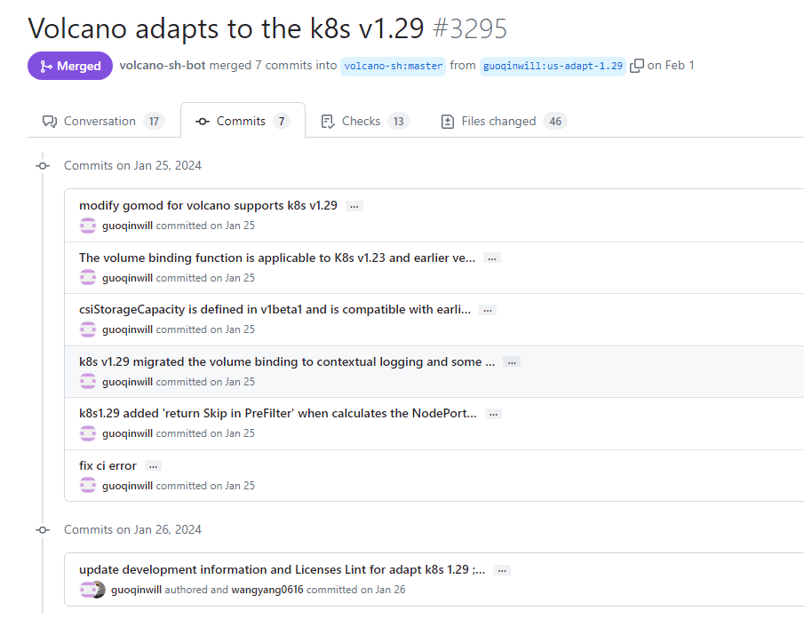

# Things to do when volcano adapts to k8s version upgrade

## Motivation

In order to ensure that volcano is compatible with the new version of kubernetes, the k8s version of volcano needs to be routinely upgraded.

## TODO things for upgrade

####  Upgrade volcano apis
First, we need to upgrade the k8s version of volcano apis, such as:https://github.com/volcano-sh/apis/pull/124. 
The main things that need to be done are as follows:
1. First **change the gomod file** to adapt to the k8s version.
2. **Upgrade the go version of go mod file and go build version in shell files** to keep consistent with k8s.
####  Upgrade volcano
Secondly upgrade the k8s version of volcano, the pr like this:https://github.com/volcano-sh/volcano/pull/3295. In order to facilitate viewing when submitting, the submitted content can be distinguished according to different commitids:

The main things that need to be done are as follows:
1. First **change gomod** to adapt to the k8s version (and **introduce the updated version of volcano apis**).
2. **Upgrade the go version of go mod file and KUBE_VERSION in Dockerfile** to keep consistent with k8s.
2. **Synchronize the changes in k8s regarding volumebinding**, because currently volcano maintains volumebinding separately in order to be compatible with lower version kubernete's access to the volumebinding api.
3. Other commits are to **solve compilation and other problems that arise after adaptation**, including API changes, scheduling policy updates, function name changes, etc. When solving, you can refer to the changelog released during the k8s upgrade.
4. **Run unit-test** and ensure it passes.
5. **Run e2e verification** on the specified version clusters and pass it (including the latest k8s version and historical versions).
6. Update the Kubernetes compatibility of **README file**.
7. Volcano should **support kube-scheduler's new beta features**, and these features are tracked **using separate issues and PRs**.

Commits for other issues that may arise:
1. After adapting to the new version of k8s, changes in crd may occur. Check whether excessive yaml will be caused when generating crd:https://github.com/volcano-sh/volcano/pull/3347
2. Try to update the versions of related tools such as kind and controller-gen to adapt to the new version of k8s to ensure that the generation of crd and the verification cluster of ci runtime are correct:https://github.com/volcano-sh/volcano/pull/3404

