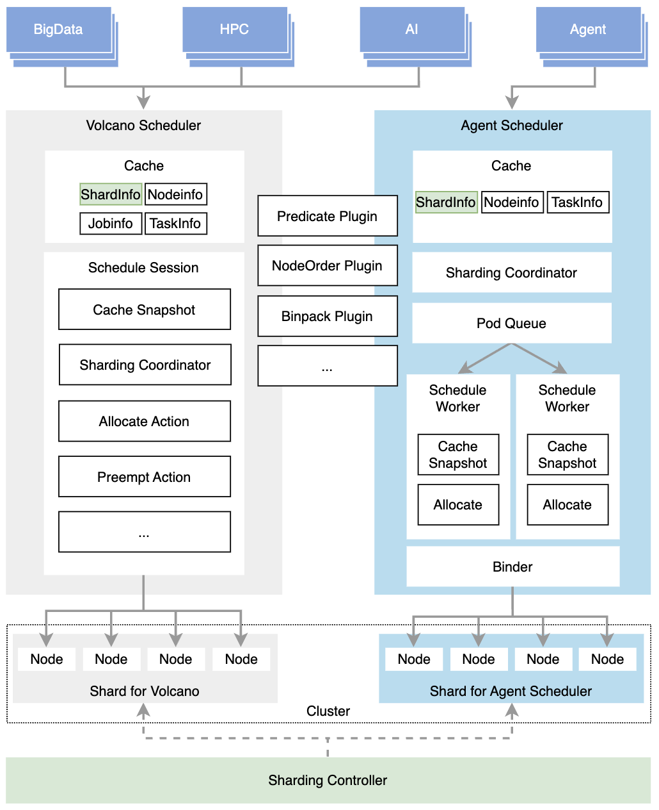
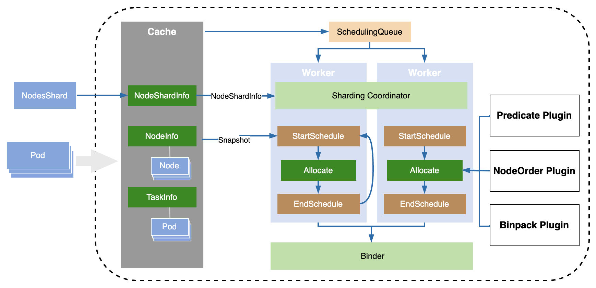
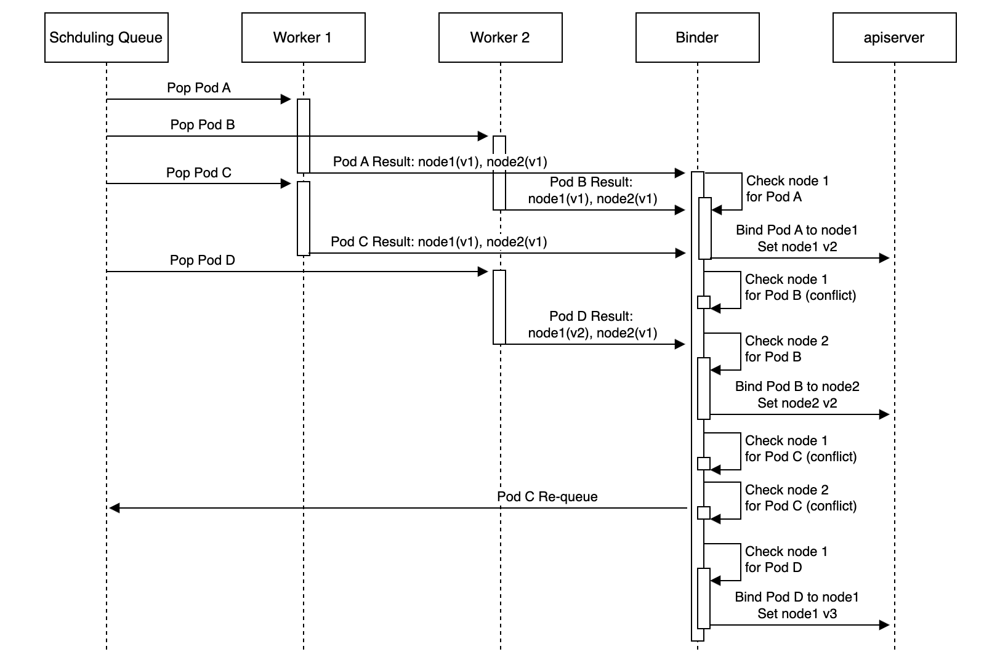
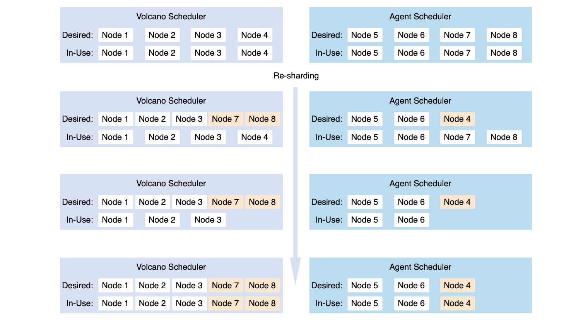

# Agent Scheduler

## Design Overview

### Problem
The Volcano Scheduler is designed and optimized for various batch and elastic workloads for Big Data, HPC, ML, and AI frameworks, providing high-performance scheduling and advanced scheduling strategies and algorithms. But not all workloads require batch-scheduling characteristics. Instead, these workloads have scheduling requirements in other aspects which cannot be satisfied in the Volcano scheduler. Take AI Agent workloads as example:
1. Agent workloads are latency-sensitive and involve frequent task creation. The scheduler must handle a large volume of tasks with ultra-fast scheduling, ensuring high throughput while keeping per-task scheduling latency low. When Agent workloads are deployed alongside other workloads in the same cluster, the latency also needs to be guaranteed. However, workloads in the Volcano scheduler are processed in batch mode at fixed intervals within each scheduling session. The Pod is not be able to scheduled immediately. When other workloads are present, workloads have to be scheduled in order, so scheduling latency cannot be guaranteed.
2. The scheduling strategy for an Agent might be different from other workloads. Agent workloads may not require topology spread or pod affinity. Instead, they can be scheduled onto nodes with smaller or fragmented resources to better utilize resource fragments and improve overall cluster efficiency. This requires different scheduling strategies configured for different workloads.


### Design Goal

1. A scheduler capable of rapidly scheduling a large number of Pods.  
Improve scheduling efficiency through workflow optimization and strategy simplification.

2. A scheduler that can collaborate with the Volcano scheduler to handle different types of workloads.  
Enable collaboration and resource management between schedulers through shard-based parallel scheduling.

### Architecture Overview
An independent Agent scheduler is introduced to identify and make fast scheduling for Agent workloads. The scheduler improves the scheduling rate of individual Pods through optimized scheduling strategies and in-time Pod scheduling. It further increases overall scheduling throughput by leveraging parallel scheduling with multiple workers.

When Agent workloads coexist with other workloads, the sharding controller dynamically divides nodes into shards based on defined policies like resource threshold, node type, etc. Each scheduler obtains schedulable nodes through shard synchronization and selects or prioritizes the corresponding nodes for scheduling. This enables multiple schedulers to perform parallel scheduling of different workloads based on different shards. Refer to the [sharding controller design and shard strategy](shard-controller.md) for details.   


**Sharding Controller:** Dynamically assigns cluster nodes to different shards based on cluster nodes resource status and sharding strategy.

**Agent Fast-Path Scheduler:** Agent scheduler performs fast scheduling for Pods within the corresponding shard ( or with prioritization). It uses concurrent scheduling(multi workers) to increase task throughput and optimizes scheduling flow and strategy to improve scheduling efficiency.

**Volcano Scheduler:** Supports collaborative scheduling with the Agent scheduler for different types of workloads. Sharding coordinator is introduced to synchronize nodes from NodeShard. Once scheduling with shard is enabled, Volcano Scheduler schedule Pods within the corresponding shard ( or with prioritization).


## Schedule framework
Design of the scheduling workflow, scheduling queue, Plugin and Action mechanism.

### Scheduler architecture


### Component Relationship and Initialization

The system architecture relies on a strict hierarchy and initialization sequence

#### Hierarchy
- **Scheduler**: The top-level component that manages the lifecycle of the entire scheduling system. It owns the Cache, Configurations, and the Worker Pool.
- **Worker**: A concurrent scheduling unit. Each worker is independent and contains its own Framework instance. 
Multiple workers will simultaneously retrieve pods from the central scheduling queue for scheduling, employing optimistic parallel scheduling.
- **Framework**: The runtime environment for plugins within a worker. It holds a registry of plugins and actions, and crucially, maintains a **Snapshot** of the cluster state specific to that worker's current scheduling cycle.
- **Snapshot**: A point-in-time view of the cluster state (Nodes, Pods, etc.) derived from the global Cache. Each worker updates its snapshot at the beginning of a scheduling cycle to ensure consistency.
- **Action**: Defines the high-level scheduling logic (e.g., Allocate). Actions orchestrate the execution of multiple Plugins in a defined sequence.
- **Plugin**: Implements specific scheduling algorithms (e.g., Predicates, NodeOrder). Plugins are registered within the Framework and invoked by Actions.

#### Initialization Sequence

The initialization process begins with the **Scheduler**, which first establishes the global **Cache** to synchronize with the Kubernetes API server. 
It then loads the scheduling configuration to determine the active Actions and Plugins. Following this, the Scheduler initializes the **Worker Pool**. 
For each **Worker** spawned, a distinct **Framework** instance is created. At runtime, when a worker begins a scheduling cycle, 
it first updates its Framework's **Snapshot** from the global cache, providing a consistent view for the subsequent Action and Plugin execution.

### Scheduling Queue

#### Acknowledgments
The design of the scheduling queue is heavily inspired by and directly references the mature queue architecture of [kube-scheduler](https://github.com/kubernetes/kubernetes/tree/release-1.34/pkg/scheduler/backend/queue). We extend our sincere gratitude to the kube-scheduler contributors for their excellent work. As the design goals of the Volcano fast-path scheduler align closely with the principles behind kube-scheduler's queue management, we have chosen to build upon this proven architecture to rapidly establish a robust and efficient scheduling framework for agent workloads.

#### Queue Architecture
The scheduling queue manages the execution order of pods and consists of three components: **activeQ**, **backoffQ**, and **unschedulable pods pool**.

- **ActiveQ**: Stores pods that are ready for immediate scheduling.
- **BackoffQ**: Stores pods that have failed scheduling but are waiting for a backoff period to expire.
- **Unschedulable Pods Pool**: Stores pods that have failed scheduling and are determined to be unschedulable under current cluster conditions.

A key enhancement over the standard queue logic is the **Urgent Retry Mechanism** for binding conflicts. 
When the Conflict-Aware Binder detects a conflict (i.e., multiple workers trying to bind to the same node), 
it pushes the pod back to the **ActiveQ** with an elevated internal priority (e.g., `SchedulingPriorityUrgent`). 
This ensures that the conflicting pod is prioritized over other pending pods for immediate rescheduling, 
minimizing the latency impact of optimistic concurrency collisions.

The workflow is as follows:

1. When new unscheduled pending pods are watched, they are added to the **activeQ**, the pods will be popped from the **activeQ** and tried to be scheduled.
2. If scheduling fails for the pod, it will be added to the **unschedulable pods pool**.
3. When cluster events occur (such as node updates, pod deletions, etc.), the scheduler checks pods in the **unschedulable pods pool**, if the event makes a pod potentially schedulable, the pod is moved to either **backoffQ** or **activeQ**, depending on whether it is still within its backoff period.
4. **On Binding Conflict**: The pod is annotated with a high-priority tag and immediately re-added to the **activeQ**'s head, 
bypassing the backoff cycle to quickly retry scheduling.


## Snapshot maintenance
Design of snapshot fast update mechanism and why. 
TBD

## Multi-Worker scheduling
Single scheduling process has performance bottleneck when a large number of Pods need to be scheduled. To improve throughput of scheduling, multiple worker can be enabled to perform parallel scheduling. Worker count can be configured via startup parameter `agent_scheduler_worker_count=x`.
Parallel scheduling may bring scheduling conflict when cluster lack of resource. So Binder component is involved to resolve the conflict before executing real binding.


Workers pops Pods from the scheduling queue and perform scheduling. After predicates and node ordering, multiple candidate nodes (configurable in number) is stored in scheduling result for allocating. The scheduling results are then passed to the Binder for final binding. The Binder processes allocation results from multiple workers, using optimistic concurrency control to resolve scheduling conflict, executing Bind for non-conflicting results.



1. Each scheduling result records more than one allocatable nodes (number is configurable), with binding version recorded in each node at the time of allocation.

2. The Binder checks the node in the scheduling result sequentially. If the binding version in node has not been used in  previous Bind on that node, the Binder executes Pod (e.g. Pod A) Bind on that node and update binding version of this node. 

3. If a bind version has already been used in a previous Bind for same node, the Binder checks the next available node in the allocation result. If there is no conflict, executes Pod Bind on that node and update binding version of this node. E.g. node1 (v1) is allocated to Pod A in last binding. Pod A is not taken into account when node1 allocated to Pod B in Worker 2, so there might be conflict if Pod B still bind to node1. Then binder choose node2 for Pod B.

4. If none of the nodes in the result are available, the Pod is push back to the scheduling queue in high priority for re-scheduling. E.g. both nodes allocated for Pod C are based on v1 that is used in previous bind, so both node are rejected by binder and binder push Pod C back to queue.

5. In new allocation based on node with updated binding version, binder will treat the allocation is based on new resource view of node and then allow binding. E.g. node1 (v2) is allocated for Pod D based previous bound Pod information in node, so it is not treated as a conflict.


## Sharding synchronization
Nodes within a shard is saved in NodeShard CR and it may be changed dynamically, so the scheduler needs to be aware of these changes to determine which nodes can be used for scheduling. Scheduler also needs to coordinate with other schedulers to ensure that the same node does not appear simultaneously in the scheduling caches of different schedulers, because nodes being used in scheduler cache and Shard definition may be different.


NodeShard example:
```yaml
apiVersion: shard.volcano.sh/v1alpha1
kind: NodeShard
metadata:
  name: volcano 
spec:
  nodesDesired: #Nodes should be used within this shard.
  - node1
  - node2
  - node3
status
  lastUpdateTime: "2025-12-08T06:00:00Z"
  nodesInUse: #Node being used by scheduler.
  - node0
  - node1
  - node2
  nodesToRemove:  #Node should be remove from scheduler. (nodes is being used by scheduler, so they cannot be removed from InUse list immediately)
  - node0
  nodesToAdd: #Node should be added to scheduler. (nodes is being used by other schedulers, so they cannot be add into InUse list immediately)
  - node3
---
apiVersion: shard.volcano.sh/v1alpha1
kind: NodeShard
metadata:
  name: agent-scheduler 
spec:
  nodesDesired: #Nodes should be used within this shard.
  - node0
  - node4
  - node5
status
  lastUpdateTime: "2025-12-08T06:00:00Z"
  nodesInUse: #Node being used by scheduler.
  - node4
  - node5
  nodesToAdd:  #Node should be added to scheduler. (nodes is being used by other schedulers, so they cannot be add into InUse list immediately)
  - node0
```


### Scheduler Configuration
Sharding mode can be configured via startup parameter `--scheduler-sharding-mode=xxx`,  available value are  `none`, `soft`, or `hard`. Scheduling behavior is different based on this setting. 

- **none:** (Default) No sharding is applied. The scheduler can schedule across the entire cluster.

- **soft:** Soft isolation. The scheduler is aware of all nodes in the cluster but preferentially schedules Pods onto nodes within its own shard to avoid conflicts. Only if no nodes in the shard meet the Pod requirements will nodes from other shards be considered, in which case scheduling conflicts are handled by the kubelet. Since nodes are prioritized within the shard, the global optimality of scheduling may be slightly degraded.

- **hard:** Hard isolation. The scheduler can only schedule Pods onto nodes within its shard, preventing conflicts with other schedulers. However, due to the restricted scheduling scope, the global optimality of scheduling may be further reduced.

By default, scheduler will read shard information from NodeShard with same name as scheduler name. The shard name can also be specified in scheduler startup parameter `--agent_scheduler_sharding_name=xxx`, then scheduler will read shard information from NodeShard with the specified name.

### Scheduling
#### Agent Scheduler
Before scheduling, workers obtain the nodes available for the current scheduling cycle from the sharding coordinator. Sharding coordinator will keep synchronized with NodeShards and figure out which nodes can be used for current Scheduler.

#### Volcano Scheduler
After Session open, scheduler obtain the nodes available for the current session from the snapshot.  Sharding coordinator will keep synchronized with NodeShards and figure out which nodes can be used for current Scheduler. The available nodes will be cached in scheduler Cache and pass to session through snapshot.


### Coordinate
In each scheduler, a coordinator is needed for detecting changes in NodeShards and calculating the nodes that can be used in the next scheduling cycle. Based on the in-use status of nodes in different shards and the nodes assigned to this scheduler's shard, the coordinator computes which nodes this scheduler can use in its next scheduling and update NodeShard to tell other schedulers which nodes are being used.

#### Shard Coordinator in Agent Scheduler
Sharding coordinator watch NodeShard changes and caculate available nodes for scheduler.  After all scheduler workers synchronized the available nodes, the coordinator updates NodesInUse/NodesToRemove/NodesToAdd fields of the NodeShard:
- If the NodeShard changes while no workers are actively scheduling, the coordinator calculates the schedulable nodes and updates NodesInUse/NodesToRemove/NodesToAdd field with the new list.
- If the NodeShard changes while workers are actively scheduling, the coordinator cannot immediately update NodesInUse/NodesToRemove/NodesToAdd field, because the nodes currently used by workers may include other nodes. Once a worker completes a scheduling cycle, and if no other workers are scheduling or all workers have started using the nodes calculated by the coordinator after change, the coordinator updates NodesInUse/NodesToRemove/NodesToAdd field with the newly computed available nodes.

#### Shard Coordinator in Volcano Scheduler
Sharding coordinator watch NodeShard changes and calculate available nodes for scheduler. Coordinator updates the NodesInUse/NodesToRemove/NodesToAdd fields of the NodeShard immediately if no session is running. If there is session running, coordinator will update these fields after session closed.


## Agent Scheduler Configuration
Configuration details
TBD


