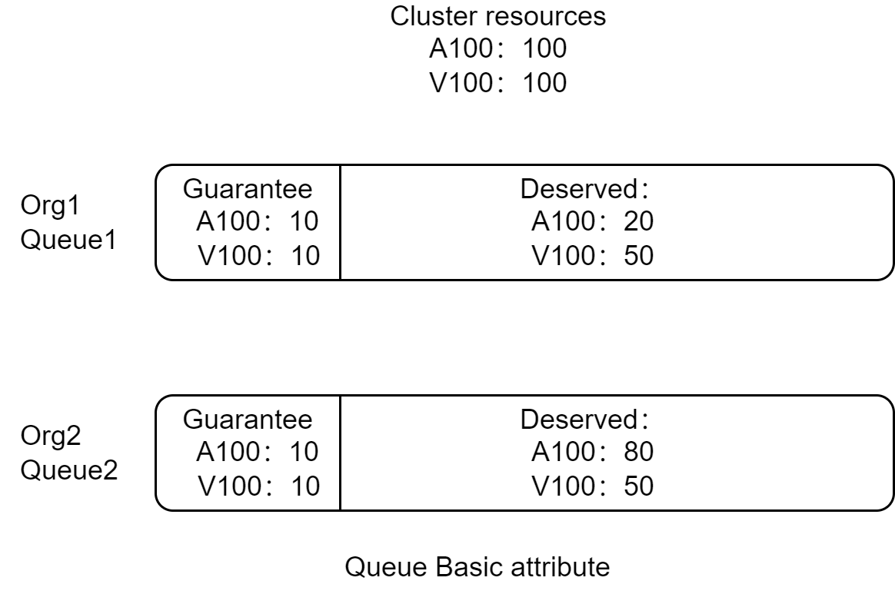
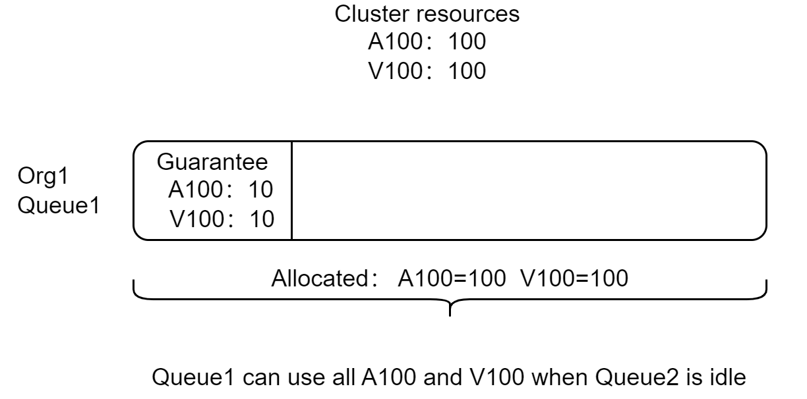
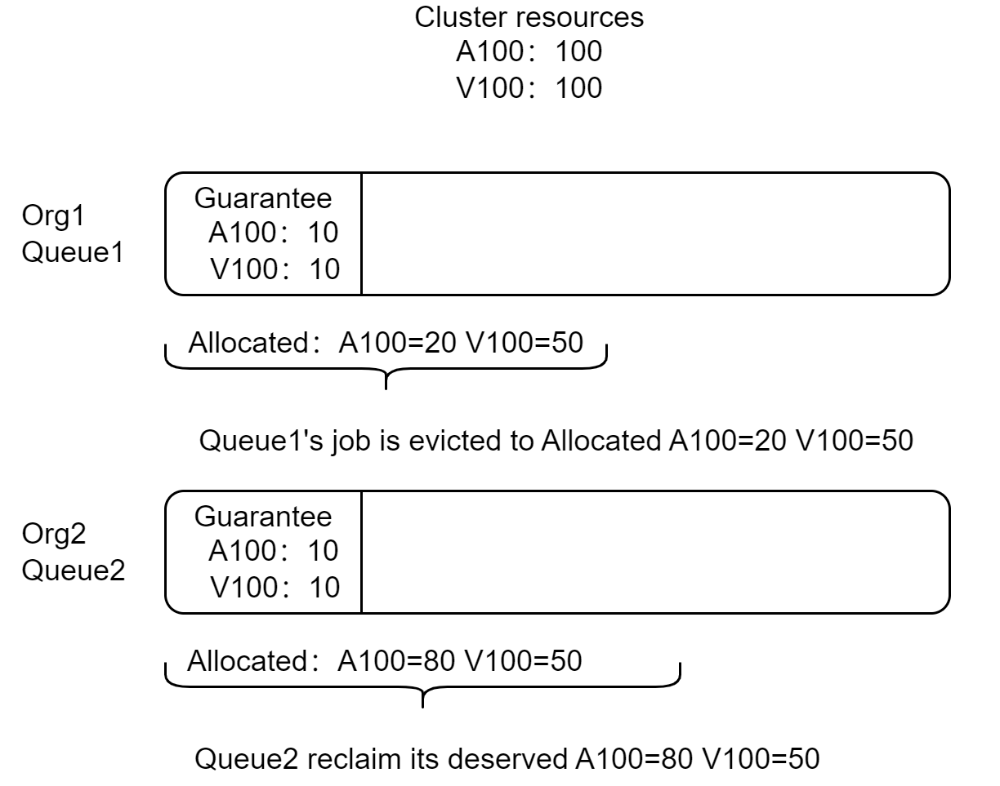
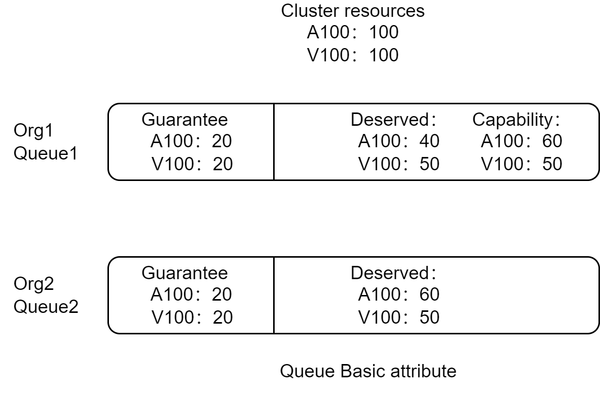
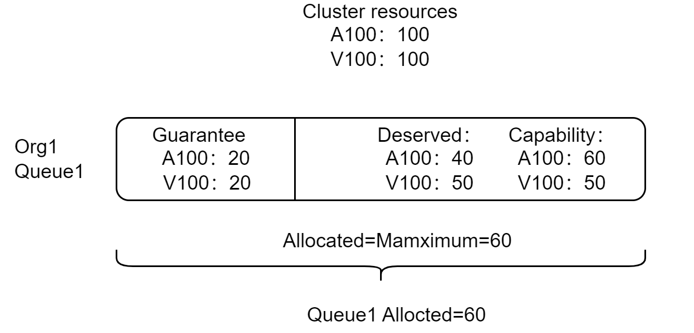
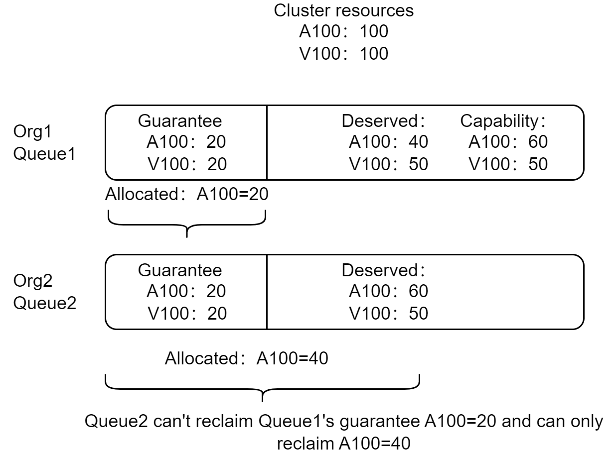

# Capacity scheduling Design

@william-wang  @Monokaix  @Frank Gu

## Motivation

Volcano Proportion plugin provides capacity scheduling and fair scheduling between multiple queues by weight, and the Queue minimal resource (guaranteed resource) and maximal resource (capacity) is supported as well. Users run heterogeneous clusters with varying resource types (i.e. different types of GPU cards and network interfaces, and require  fine-grained resource sharing and preemption between queues. For example it is expected that the share ratio of A100 GPU between ORG1 and ORG2 is 1:3, however, the share ratio of V100 GPU between ORG1 and ORG2 is 1:1. And it is expected to configure the `deserved resource` using resource type scalar rather than `weight` (a simple percentage of cluster resource) for each queue. 

## In Scope

- Allow users to specify `deserved resource` in each queue for resource reclaiming between queues.
- Allow users to configure multiple dimensional resources in ` deserved resource ` .
- Support elastic resource management in queue.

## Out of Scope

- Hierarchical elastic resource management

## Proposal

We proposed decouple the capacity scheduling from proportion plugin and support min capacity, max capacity, deserved capacity capability in capacity plugin for elastic resource management and resource preemption in multi-tenancy scenario.

Three fields of the queue are respected by the capacity plugin.
`Capability`: the upper quota limit by resource type. Under no circumstance can the total resource for any resource type in a queue exceed this limit. 
`Guarantee`: the lower quota limit by resource type. This part of resources are reserved and not lent to other queue even though there is no job in queue.
`Deserved`: the deserved quota by resource type. This part of resources is allowed to be shared to other queues and can be reclaimed back.

## User Stories

### Story 1

Administrator can create a queue with Maximum capacity configured and the resource amount of jobs in queue cannot exceed maximum capacity.

### Story 2

Administrator can create two queues with deserved capacity configured and the deserved resource can be lent to jobs in another queue.

### Story 3

Administrator can create two queues with guarantee and deserved resources configured and the deserved resource can be reclaim back. And different resource type can hold diffferent guarantee and deserved quantity. For example, we consume there are 2 orgs Org1 and Org2, and use Queue1 and Queue2 respectively, Queue1's guarantee resources are A100 GPU card number=10, V100 GPU card number=10, and deserved resources are A100 GPU card number=20, V00 GPU card number=50, for Queue2, its guarantee resources are A100 GPU card number=10,V100 GPU card number=10, and deserved resources are A100 GPU card number=80, V100 GPU card number=50. 

<div align="center"></div>

Queue1 can use cluster's total resoures when Queue2 is idle.

<div align="center"></div>

Queue2 can reclaim its deserved resources when job is submitted to Queue2.

<div align="center"></div>

### Story 4

Org2 can reclaim its deserved resources from Org1 but except Org’s guarantee resources.

<div align="center"></div>

Queue1 can use queue's capability A100=60 when queue2 is idle.

<div align="center"></div>

Queue2 can reclaim from Queue1 when job is submitted but exclude Queue1's guarantee resources A100=20, and can only reclaim A100=40 from Queue1.

<div align="center"></div>

## Design detail

### API design

Add a new field `Deserved` of queue spec to indicate the deserved resources of current queue.

```go
type QueueSpec struct {
    Capability v1.ResourceList
    // Reclaimable indicate whether the queue can be reclaimed by other queue
    Reclaimable *bool
    // Guarantee indicate configuration about resource reservation
    Guarantee Guarantee `json:"guarantee,omitempty" protobuf:"bytes,4,opt,name=guarantee"`
    // Deserved is the deserved resource.
    Deserved v1.ResourceList
}
```

### Main process

Key function needed to add:

- Action Update
  - **Reclaim:**  Add `ssn.Preemptive` function to check whether queue can  reclaim resources by preempt other queue's resources.

- New Plugin capacity

  - **AddAllocatableFn:**  Check that queue's total allocated resources can not exceed its limit, which is Queue.Allocated + task.Request should <= Queue.capability.
  - **AddReclaimableFn:** Choose victim whose queue.Allocated > Queue. Deserved, stop choose victim to preempt when Queue.Allocated = Queue.Guarantee.

  - **AddPreemptiveFn:** Check whether queue can reclaim by preempt other queue's resources, when  Queue.Allocated >= Queue.Deserved, reclaim should not happen.
  - **AddQueueOrderFn:**  Compute and sort queue by share value, share value=Queue.Allocated/Queue.Deserved.
  - **AddJobEnqueueableFn:** Check whether a job can enqueue.

### Notes

Capacity plugin provides the preemption/reclaim based on `deserved resource ` configured by the user. The Proportion plugin provides fair scheduling based on the weight of the queue. They are different policies for different scenarios. It is not supported to enable them both.