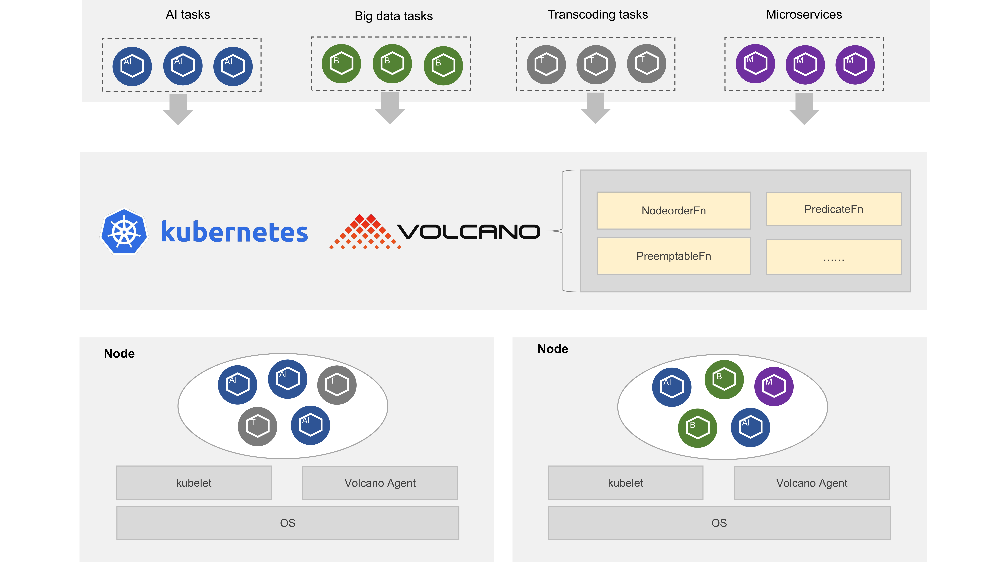
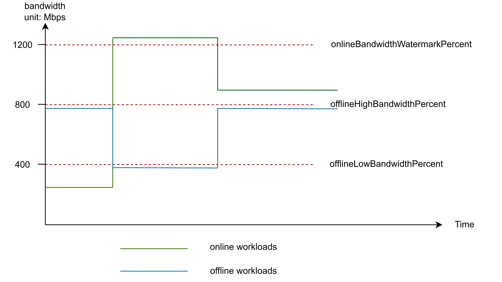

## Motivation

Volcano now supports unified scheduling of microservices and batch workloads, it's compatible with the default scheduling algorithms of kubernetes, and provides rich scheduling policies for microservices and batch jobs, so it is suitable for unified scheduling of different types of jobs in colocation scenarios, and improves resource utilization simultaneously.

## Architecture

Volcano agent supports cloud-native online and offline workloads colocation. It runs as a daemonset in the kubernetes cluster, and is committed to improving the resource utilization of the kubernetes cluster and meanwhile ensures the Qos of online workloads through CPU/Memory/Network resource isolation and suppression.



### Qos Model

|              Qos              |                 Typical  Usage Scenario                  |
| :---------------------------: | :------------------------------------------------------: |
|     LC(Latency Critical)      | Exclusive CPU for latency critical core online workloads |
| HLS(Highly Latency Sensitive) |       Extremely latency sensitive online workloads       |
|     LS(Latency Sensitive)     |      Latency sensitive approximate online workloads      |
|        BE(Best Effort)        |    Offline AI/Big Data workloads, tolerable evictions    |

You can set different qos levels to identify workloads of different priorities, and there is no seperate `priorityClass` definition to be consistent with k8s.

### Features

- Unified scheduling for all kinds of workloads including microservices and batch jobs.
- Qos based resource model for online and offline workloads.
- CPU burst: Allow containers to temporarily exceed the CPU limit to avoid throttling at critical moments.
- Dynamic resource oversubscription: Dynamically calculate the resources that can be oversold based on the real-time CPU/Memory utilization of the node, and oversold resources can be used by offline workloads.
- Network bandwidth isolation：Supports ingress network bandwidth limitation of the entire machine to ensure network usage for online workloads.

## Quick start

### Prepare

Follow the [installation guide](https://github.com/volcano-sh/volcano?tab=readme-ov-file#quick-start-guide) to install volcano first, and then install volcano agent via kubectl, this way is both available for x86_64 and arm64 architecture. 

```shell
kubectl apply -f https://raw.githubusercontent.com/volcano-sh/volcano/master/installer/volcano-agent-development.yaml
```

Check volcano components including agent runs successfully.

```shell
$ kubectl get po -n volcano-system
NAME                                   READY   STATUS      RESTARTS   AGE
volcano-admission-76bd985b56-fnpjg     1/1     Running     0          3d
volcano-admission-init-wmxc7           0/1     Completed   0          3d
volcano-agent-q85jn                    1/1     Running     0          3d
volcano-controllers-7655bb499f-gpg9l   1/1     Running     0          3d
volcano-scheduler-6bf4759c45-c666z     1/1     Running     0          3d
```

Enable node level colocation by setting label volcano.sh/oversubscription=true and volcano.sh/colocation=true.

```
$ kubectl label node $node volcano.sh/oversubscription=true # replace $node with real node name in your kubernetes cluster.

$ kubectl label node $node volcano.sh/colocation=true # replace $node with real node name in your kubernetes cluster.
```

### CPU burst tutorial

This example will demonstrate how to use CPU burst and what benefit it can bring.

#### Enable cpu burst by set pod annotation

Run a nginx deployment with cluster ip service exposed, pod with annotations `volcano.sh/enable-quota-burst: "true"` indicates pod cpu

burst is enabled.

```yaml
apiVersion: apps/v1
kind: Deployment
metadata:
  name: nginx
  namespace: default
spec:
  replicas: 1
  selector:
    matchLabels:
      app: nginx
  template:
    metadata:
      labels:
        app: nginx
      annotations: 
        volcano.sh/enable-quota-burst: "true" # pod enabled cpu burst 
    spec:
      containers:
      - name: container-1
        image: nginx:latest
        resources:
          limits:
            cpu: "2"
          requests:
            cpu: "1"
---
apiVersion: v1
kind: Service
metadata:
  name: nginx
  namespace: default
  labels:
    app: nginx
spec:
  selector:
    app: nginx
  ports:
    - name: http
      targetPort: 80
      port: 80
      protocol: TCP
  type: ClusterIP
```

#### Perform stress

Perform stress with `wrk` to nginx app.

```shell
wrk -H "Accept-Encoding: deflate, gzip" -t 2 -c 8 -d 120  --latency --timeout 2s http://$(kubectl get svc nginx -o jsonpath='{.spec.clusterIP}')
```

#### Check cpu burst

Check container's cpu throttle state of pod, we can see that `nr_bursts` and `burst_time` is not 0, `nr_throttled` and `throttled_time` is a small value, which indicates pod has used burst cpu quota.

```shell
$ cat /sys/fs/cgroup/cpu/kubepods/burstable/podd2988e14-83bc-4d3d-931a-59f8a3174396/cpu.stat # replace nginx pod uid in your kubernetes cluster.
nr_periods 1210
nr_throttled 9
throttled_time 193613865
nr_bursts 448
burst_time 6543701690
```

If we set pod's annotations `volcano.sh/enable-quota-burst=false`(disable pod cpu burst) and perform another stress, `nr_throttled` and `throttled_time` will be a relatively large value, which indicates pod cpu is throttled strictly, `nr_bursts` and `burst_time` is 0, indicates that pod cpu burst not happened.

```shell
$ cat /sys/fs/cgroup/cpu/kubepods/burstable/podeeb542c6-b667-4da4-9ac9-86ced4e93fbb/cpu.stat #replace nginx pod uid in your kubernetes cluster.
nr_periods 1210
nr_throttled 488
throttled_time 10125826283
nr_bursts 0
burst_time 0
```

#### Limitation

CPU burst relies on capabilities provided by the linux kernel, this feature only works with host upstream linux kernel >=5.14 and some Linux Distribution like OpenEuler 22.03 SP2 or higher version.

### Dynamic resource oversubscription tutorial

This example will demonstrate the resource oversubscription capability on node, and shows the suppression and eviction mechanism when node is suffering from pressure. The node flavor is 8 core cpu and 16GB memory.

#### Check node oversubscription resources

Node oversubscription resources are calculated by node allocatable resources sub actual resource usage, oversubscription resources include cpu and memory and is represented by `kubernetes.io/batch-cpu` and `kubernetes.io/batch-memory` respectively, and reported as extended resources to node.Allocatable filed. Online workloads use normal resources and offline workloads use oversubscription resources so we can improve pod deployment density and resource utilization. 

```shell
$ kubectl describe node $node # replace $node with real node name in your kubernetes cluster.
Allocatable:
  cpu:                         8
  ephemeral-storage:           33042054704
  hugepages-1Gi:               0
  hugepages-2Mi:               0
  kubernetes.io/batch-cpu:     7937 # oversubscription resource cpu, unit is milli cpu
  kubernetes.io/batch-memory:  14327175770 # oversubscription resource memory, utit is byte
  memory:                      15754924Ki
  pods:                        110
```

#### Deploy online and offline workloads

Online workloads are identified by setting annotation `volcano.sh/qos-level: "LC" or` `volcano.sh/qos-level: "HLS"` or `volcano.sh/qos-level: "LS"`.Offline workloads are identified by setting annotation `volcano.sh/qos-level: "BE"`, it can only use oversubscrption resources(kubernetes.io/batch-cpu and kubernetes.io/batch-memory). We use an image with stress tool of online workload to simulate online workloads business pressure rises, if you can not access the image, you can also replace it with other image that has stress tool.

```yaml
# online workload
apiVersion: apps/v1
kind: Deployment
metadata:
  name: online-demo
  namespace: default
spec:
  replicas: 1
  selector:
    matchLabels:
      app: online-demo
  template:
    metadata:
      labels:
        app: online-demo
      annotations:
        volcano.sh/qos-level: "HLS" # identify online workloads
    spec:
      containers:
      - name: container-1
        image: polinux/stress
        imagePullPolicy: IfNotPresent
        command: ["stress", "--cpu", "7"] # perform cpu stress 
        resources:
          requests:
            cpu: 2
---
# offline workload
apiVersion: apps/v1
kind: Deployment
metadata:
  name: offline-demo
  namespace: default
spec:
  replicas: 1
  selector:
    matchLabels:
      app: offline-demo
  template:
    metadata:
      labels:
        app: offline-demo
      annotations: 
        volcano.sh/qos-level: "BE" # identify offline workloads
    spec:
      containers:
      - name: container-1
        image: nginx:latest
        resources:
          requests:
            kubernetes.io/batch-cpu: 4000 # 4 core cpu
            kubernetes.io/batch-memory: 10737418240 # 10Gi memory
```

Make sure online and offline workloads are running.

```shell
$ kubectl get po
NAME                          READY   STATUS    RESTARTS   AGE
offline-demo-f59758bb-vlbp7   1/1     Running   0          6s
online-demo-9f9bbdb58-fljzs   1/1     Running   0          6s
```

#### Eviction happens when node has pressure

Online workloads Qos is guaranteed by volcano agent and host OS, volcano agent detects node resource utilization in real time, and will evict offline workloads when node resource utilization exceeds the threshold, for CPU resource, it's 80% by default, we perform 7 core cpu stress to online workload, we can check event and it showed that offilne worload is evicted after about 1 minutes later.

```shell
$ kubectl get event | grep Evicted
69s         Warning   Evicted                   pod/offline-demo-785cff7f58-gwqwc    Evict offline pod due to cpu resource pressure
```

We can also find that oversubscription reduced when node has pressure.

```shell
$ kubectl describe node $node # replace $node with real node name in your kubernetes cluster.
Allocatable:
  cpu:                         8
  ephemeral-storage:           33042054704
  hugepages-1Gi:               0
  hugepages-2Mi:               0
  kubernetes.io/batch-cpu:     978 # oversubscription resource of cpu reduced.
  kubernetes.io/batch-memory:  14310391443
  memory:                      15754924Ki
  pods:                        110
```

Volcano agent will also add eviction taint to current node when eviction happened to avoid new workloads continuously scheduled to the node and put additional pressure on current node. We can find that new created offline pod is pening because of eviction taint.

```shell
$ kubectl get po
NAME                          READY   STATUS    RESTARTS   AGE
offline-demo-f59758bb-kwb54   0/1     Pending   0          58s
online-demo-9f9bbdb58-54fnx   1/1     Running   0          2m1s

$ kubectl describe po offline-demo-f59758bb-kwb54
Events:
  Type     Reason            Age   From               Message
  ----     ------            ----  ----               -------
  Warning  FailedScheduling  69s   default-scheduler  0/1 nodes are available: 1 node(s) had taint {volcano.sh/offline-job-evicting: }, that the pod didn't tolerate.
```

And if we stop online workload to release pressure then the eviction taint will be removed and pod can be scheduled normally.

#### Limitation

Volcano agent defines a Qos resource model for online and offline workloads, and provides application level guarantee(eviction when node has pressure) for online workloads Qos guarantee. The OS level cpu and memory isolation and suppress are guaranteed by host kernal, and currently volcano agent only adapted to openEuler 22.03 SP2 and higher version, please make sure that you are using the correct OS type and version.

### Network bandwidth isolation tutorial

The bandwidth usage of offline workloads will be limited when online workloads require more bandwidth. There are three watermarks parameters of network bandwidth isolation.

|             Watermark             |                         Description                          | Default Value |
| :-------------------------------: | :----------------------------------------------------------: | :-----------: |
| `onlineBandwidthWatermarkPercent` | The ratio of online bandwidth watermark value to the base bandwidth of node:<br/>onlineBandwidthWatermark value = node base bandwidth * `onlineBandwidthWatermarkPercent`/100 |      80       |
|   `offlineHighBandwidthPercent`   | The ratio of offline high bandwidth watermark value to the base bandwidth of node:<br/>offlineHighBandwidth value = node base bandwidth * `offlineHighBandwidthPercent`/100<br/>It represents the upper limit of bandwidth that can be used by offline workloads when the online workloads use bandwidth ratio less than `onlineBandwidthWatermarkPercent`，eg: node bandwidth=100Mbps, `onlineBandwidthWatermarkPercent` =80 and `offlineHighBandwidthPercent`=40, when online workloads use bandwidth less than 100Mbps\*0.8=80Mbps, then the offline workloads can use at most 100Mbps\*40=40Mbps bandwidth. |      40       |
|   `offlineLowBandwidthPercent`    | The ratio of offline low bandwidth watermark value to the base bandwidth of node:<br/>offlineLowBandwidth value = node base bandwidth * `offlineLowBandwidthPercent`/100<br/>It represents the upper limit of bandwidth that can be used by offline workloads when the online workloads use bandwidth ratio more than `onlineBandwidthWatermarkPercent`，eg: node bandwidth=100Mbps, `onlineBandwidthWatermarkPercent` =80 and `offlineLowBandwidthPercent`=10, when online workloads use bandwidth more than 100Mbps\*0.8=80Mbps, then the offline workloads can use at most 100Mbps\*10=10Mbps bandwidth. |      10       |

This picture below shows the bandwidth that online and offline workloads actually can use when they compete for bandwidth resources on one node.



#### Set network bandwidth 

This example will demonstrate the suppression of the entire network bandwidth of an offline workload by online workload, and we use`iperf` tool to simulate network ingress bandwidth traffic of both online and offline workloads.

Add an annotation `volcano.sh/network-bandwidth-rate` on all nodes to specify the network bandwidth rate, the value in the example is 1000Mbps, please set an actual value according to your environment, and please replace `$node` with actual node name in your environment.

```shell
$ kubectl annotate node $node_name volcano.sh/network-bandwidth-rate=1000
```

#### Run online and offline workloads

Run an online deployment with below container command. Please replace the `$node_ip` with a node ip that pod can access in your environment and also make sure iperf tool is installed in container image. And please also start iperf server on `$node_ip` with command `iperf -s` to make sure pod can access the iperf server. 

```shell
- command
  - /bin/sh
  - c
  - iperf -c $node_ip -i 1 -t 30 -f mb; echo finished...; sleep 1000000 
```

And set the following annotation to identity the online workload.

```yaml
  annotations: 
    volcano.sh/qos-level: "HLS" # identify online workloads
```

Run an offline deployment with podTemplate specified with the following annotation

```yaml
  annotations: 
    volcano.sh/qos-level: "BE" # identify offline workloads
```

and also specify the container command like online deployment.

```shell
- command
  - /bin/sh
  - c 
  - iperf -c $node_ip -i 1 -t 30 -f mb; echo finished...; sleep 1000000 
```

#### Check logs

Check online and offine pod logs

online pod log:

```shell
Connecting to host 192.168.2.30, port 5201
[  5] local 192.168.2.115 port 58492 connected to 192.168.2.30 port 5201
[ ID] Interval           Transfer     Bandwidth         
[  5]   0.00-1.00   sec   118 MBytes  990 Mbits/sec 
[  5]   1.00-2.00   sec   106 MBytes  889 Mbits/sec 
[  5]   2.00-3.00   sec   107 MBytes  897 Mbits/sec 
[  5]   3.00-4.00   sec   107 MBytes  903 Mbits/sec 
[  5]   4.00-5.00   sec   107 MBytes  899 Mbits/sec
[  5]   5.00-6.00   sec   107 MBytes  902 Mbits/sec
[  5]   6.00-7.00   sec   705 MBytes  884 Mbits/sec
...
```

offline pod log:

```shell
Connecting to host 192.168.2.30, port 5201
[  5] local 192.168.2.115 port 44362 connected to 192.168.2.30 port 5201
[ ID] Interval           Transfer     Bandwidth         
[  5]   0.00-1.00   sec   8 MBytes  70 Mbits/sec 
[  5]   1.00-2.00   sec   12 MBytes  102 Mbits/sec 
[  5]   2.00-3.00   sec   11 MBytes  98 Mbits/sec 
[  5]   3.00-4.00   sec   11 MBytes  99 Mbits/sec 
[  5]   4.00-5.00   sec   11 MBytes  99 Mbits/sec
[  5]   5.00-6.00   sec   11 MBytes  97 Mbits/sec
[  5]   6.00-7.00   sec   11 MBytes  98 Mbits/sec
...
```

You can see that offline pod can use almost 10% bandwidth when online pod use more bandwidth resources than `onlineBandwidthWatermarkPercent` of the whole node.

## Advanced settings

### Feature switch

Colocation feature has a unified switch on node, node has label volcano.sh/oversubscription=true or volcano.sh/colocation=true indicates that coloation is enabled. You can remove the two labels to disable all colocation features. And all colocation features take effect when node has these lables.

- If you only want to use online and offline workloads colocation but not resource oversubscription, you just need to set the node label volcano.sh/colocation="true".
- If you want to use colocation and resource oversubscription, you should set node label volcano.sh/oversubscription=true.

The configMap `volcano-agent-configuration` of namespace  `volcano-system` by default holds all the configurations of volcano agent.

Every colocation feature CPU burst/Dynamic resource oversubscription/Network bandwidth isolation has a separate switch, you can enable/disable each of them by modify configMap `volcano-agent-configuration` of namespace,

enable filed value true means enable CPU burst, false means disable it.

```json
"cpuBurstConfig":{
   "enable": true 
}
```

enable filed value true means enable dynamic resource oversubscription, false means disable it.

```json
"overSubscriptionConfig":{
   "enable": true,
}
```

enable filed value true means enable network bandwidth isolation, false means disable it.

```json
"networkQosConfig":{
   "enable": true,
}
```

### CPU burst

Container in a pod enabled cpu burst can burst cpu quota at most equal to container's cpu limit, if many pods are using burst cpu at the same time, CPU contention will occur and affect cpu cfs scheduling. You can set pod annotation `volcano.sh/quota-burst-time` to specify custom burst quota, for example, if a container's cpu limit is 4 core, and volcano agent will set container's cgroup `cpu.cfs_quota_us` value to 400000(the basic cfs period is 100000, so 4 core cpu will be 4*100000=400000), which means container can use at most an extra 4 core cpu in a moment, if you set volcano.sh/quota-burst-time=200000, it means container can only use at most an extra 2 core cpu in a moment.

```yaml
annotations: 
  volcano.sh/quota-burst-time: "200000"
```

### Dynamic resource oversubscription

The oversubscription resources computation and offline workloads eviction only take pod's resource usage into consideration by default, if you want to consider the resource utilization of the node itself, you should set flag`--include-system-usage=true` of volcano agent.

To avoid excessive pressure on nodes, volcano agent set an oversubscription ratio to determine the ratio of idle resource oversubscription, you can change the parameters by set flag `--oversubscription-ratio`, default value is 60, which means 60% of idle resources will be oversold, if you set `--oversubscription-ratio=100`, it means all idle resources will be oversold.

Volcano agent will evict offline workloads when nodes have pressure, and the eviction threshold can be configured by configMap volcano-agent-configuration, `"evictingCPUHighWatermark":80` means eviction will happed when node's cpu utilization is beyond 80% in a period of time, and current node can not schedule new pods when eviction is happening, and `"evictingCPULowWatermark":30` means node will recover schedule when node's cpu utilization is below 30%, `evictingMemoryHighWatermark` and `evictingMemoryLowWatermark` has the same meaning but for memory resource.

```json
"evictingConfig":{
  "evictingCPUHighWatermark": 80,
  "evictingMemoryHighWatermark": 60,
  "evictingCPULowWatermark": 30,
  "evictingMemoryLowWatermark": 30
}
```

### Network bandwidth isolation

You can adjust the online and offline bandwidth watermark by modifying configMap `volcano-agent-configuration`, and `qosCheckInterval` represents the interval for monitoring bandwidth watermark by the volcano agent, please be careful to modify it.

```json
 "networkQosConfig":{  
   "enable": true,  
   "onlineBandwidthWatermarkPercent": 80,  
   "offlineHighBandwidthPercent":40,  
   "offlineLowBandwidthPercent": 10,
   "qosCheckInterval": 10000000
 }
```
