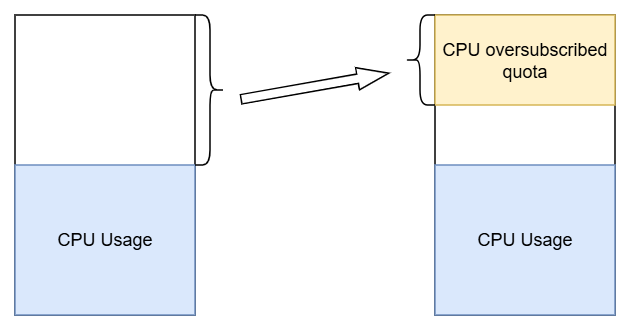
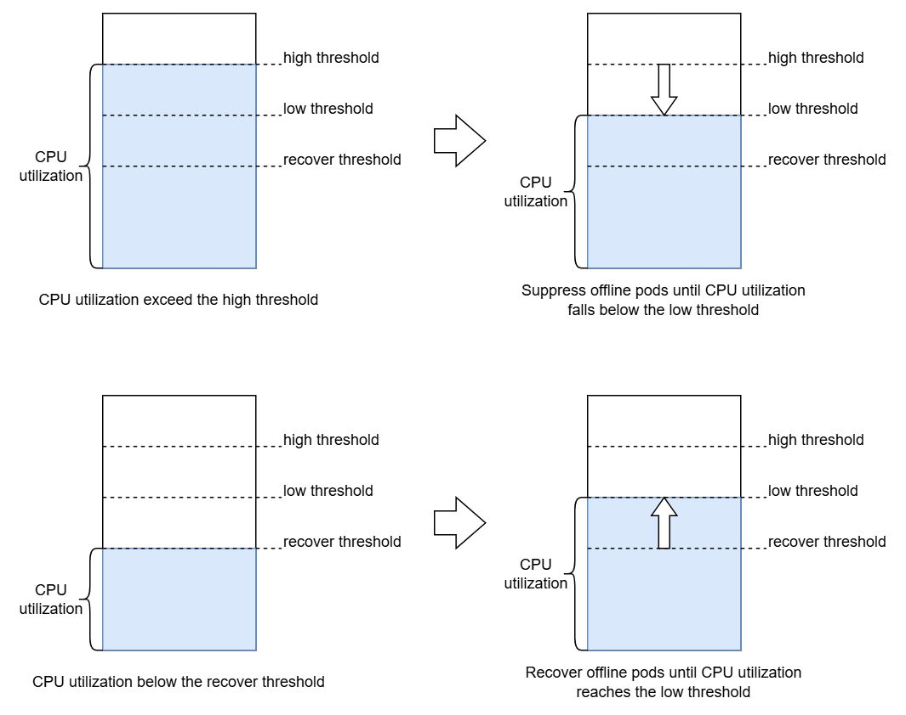

# CPU Suppression Design

## Overview

CPU suppression is a mechanism designed to manage resource contention in colocated environments where high-priority (online) and low-priority (offline) workloads share the same physical nodes. The primary goal is to maximize node utilization by allowing offline workloads to consume spare CPU cycles while ensuring that online workloads maintain their performance targets. When online workloads experience increased demand, the system dynamically suppresses the CPU resources allocated to offline workloads to prevent interference and maintain Quality of Service (QoS).

## Design

Option 1 is preferred.

### Option 1 – Leverage Kubernetes Native Pod QoS Classes

**New Configuration Parameters**

```yaml
cpuSuppression:
  adjustStep: 0.1 # Proportion of the node’s total allocatable CPU to adjust per cycle
```

**Constraints**

- The Dynamic Resource Oversubscription feature should be enabled.
- Offline Pods are required to use oversubscribed resources ( `kubernetes.io/batch-cpu` and `kubernetes.io/batch-memory` ) instead of standard `cpu` and `memory`.

**Implementation**

Leverage Kubernetes’ native Pod QoS Classes to manage CPU quotas for offline workloads uniformly:

- When oversubscription is enabled, offline Pods are required to use `kubernetes.io/batch-cpu` and `kubernetes.io/batch-memory` instead of standard `cpu` and `memory`. As a result, these Pods are classified as **BestEffort** (`pod.status.qosClass=BestEffort`).
- The Cgroup folder for each BestEffort Pod is located in the directory: `/sys/fs/cgroup/kubepods.slice/kubepods-besteffort.slice/` (example for Cgroup V2). Thus, **global CPU limits** can be applied by adjusting Cgroup parameters for this slice. Therefore, by editing the Cgroup interface files in this directory, it is possible to uniformly adjust the CPU share for all offline Pods (and native BestEffort Pods).

CPU adjustment workflow:



- When oversubscription is enabled, the system periodically calculates the available oversubscribed CPU resources and publishes the result as an internal **Event**.
- The CPU suppression module triggers CPU quota adjustments by subscribing to this `Event`.
- The total CPU quota for all offline (BestEffort) Pods is set directly to the **current oversubscribed CPU amount** by configuring the file `kubepods-besteffort.slice/cpu.max`.
- To suppress gently, each adjustment changes `cpu.max` by no more than `adjustStep * node.allocatable[cpu]`.

### Option 2 – Dynamically Adjust Offline Workload CPU Quota Based on Node CPU Utilization

**New Configuration Parameters**

```yaml
cpuSuppression:
  enabled: true
  highThreshold: 0.8 # Node CPU utilization threshold to trigger CPU suppression task for offline workloads
  lowThreshold: 0.6 # Node CPU utilization threshold to terminate CPU suppression task and begin recovery
  recoverThreshold: 0.4 # Node CPU utilization threshold to trigger CPU recovery task for offline workloads
  adjustQuotaStep: 0.1 # Proportion of the original CPU limit to adjust per cycle during suppression/recovery task
  adjustPodNum: 5 # Number of offline Pods to adjust per cycle during suppression/recovery task
```

**Implementation**



Periodically monitor node CPU utilization:

- When node CPU utilization exceeds `highThreshold`, trigger the **CPU suppression task** for offline workloads:

  - The suppression task runs periodically.
  - In each adjustment cycle, all offline Pods on the node are sorted in **descending order of suppression priority**. The top `adjustPodNum` Pods are selected for CPU suppression. For each selected Pod, its CPU quota is reduced by `adjustQuotaStep * resources.limits[cpu]`.
  - CPU quota will not be suppressed below 10% of the original limit.
  - When node CPU utilization drops below `lowThreshold` or there are no adjustable Pods, the suppression task stops.

- When node CPU utilization falls below `recoverThreshold`, trigger the **CPU recovery task** for offline workloads:
  - The recovery task runs periodically.
  - In each adjustment cycle, all offline Pods on the node are sorted in **ascending order of suppression priority** (i.e., those most suppressed are recovered first). The top `adjustPodNum` Pods are selected for CPU recovery. For each selected Pod, its CPU quota is increased by `adjustQuotaStep * resources.limits[cpu]`.
  - CPU quota will not be restored beyond the original limit.
  - When node CPU utilization rises above `lowThreshold` or there are no adjustable Pods, the suppression task stops.

Suppression Priority Rules:

- Higher **un-suppressed CPU ratio** (`cpu.max / resources.limits[cpu]`) → higher priority for suppression.
- Higher `resources.limits[cpu]` → higher priority for suppression.

CPU Quota Adjustment Mechanism:

- **Cgroup v1**: Modify `cpu.cfs_quota_us`
- **Cgroup v2**: Modify `cpu.max`

### Comparison

Option 1 offers the following advantages:

- Simpler adjustment mechanism: No need to adjust each Pod individually. Newly created offline Pods automatically inherit the node’s current CPU suppression state.
- Precise control over the total CPU quota allocated to all offline Pods.

However, it also has drawbacks:

- Requires the Dynamic Resource Oversubscription feature.
- Offline workloads must use oversubscribed resources.
