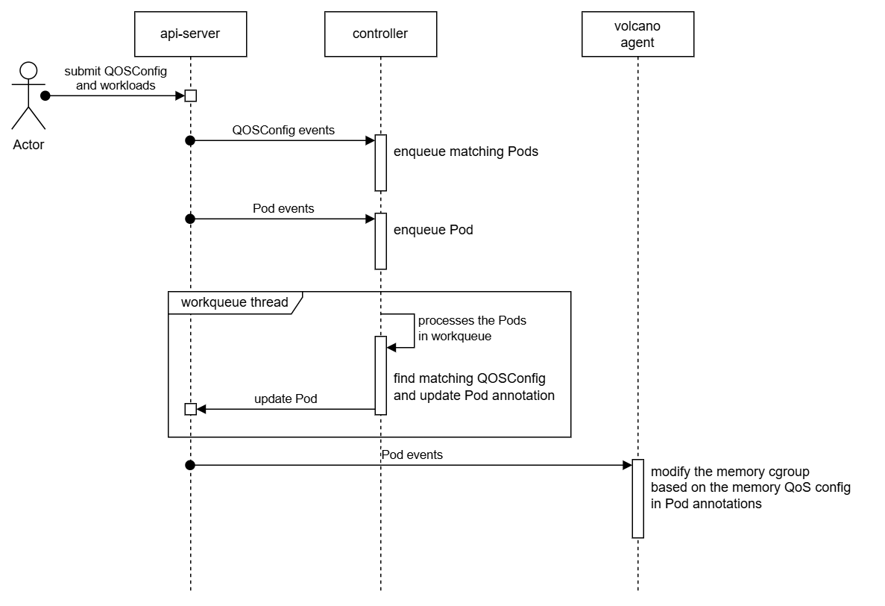

# Memory QoS Design

## Overview

In a colocation environment, high-priority (online) and low-priority (offline) workloads are deployed on the same node to improve resource utilization. However, offline workloads can sometimes interfere with online workloads by consuming excessive memory, leading to performance degradation or OOM kills of critical services.

This design introduces a Memory Quality of Service (QoS) mechanism based on Cgroup V2 to provide memory isolation and protection. By leveraging `memory.high`, `memory.low`, and `memory.min` interfaces, we can ensure that high-priority workloads have guaranteed memory access while limiting the memory usage of low-priority tasks.

## Constraints

- Only Cgroup V2 is supported.

## Design

### CRD Definition

```yaml
apiVersion: config.volcano.sh/v1alpha1
kind: ColocationConfiguration
metadata:
  name: colo-config1
spec:
  selector:
    matchLabels:
      app: offline-test
  memoryQos:
    highRatio: 100 # Memory throttling ratio; default=100, range: 0~100
    lowRatio: 0 # Memory priority protection ratio; default=0, range: 0~100
    minRatio: 0 # Absolute memory protection ratio; default=0, range: 0~100
```

### Implementation



- The controller will update the Pod annotation `volcano.sh/colocation-config` based on the memory QoS configuration. The value is of JSON type and follows the same format as `ColocationConfiguration.spec`.
- When the `spec.selector` field of a `ColocationConfiguration` instance is updated, the controller must enqueue all Pods matched before and after the update.
- During processing in the controller’s work queue, if a Pod has the annotation `volcano.sh/colocation-config` but no matching `ColocationConfiguration` is found, the annotation value should be cleared (without removing the annotation key). Keep the key to indicate that the pod was once managed by colocation config and need to reset the cgroup settings.
- When handling a Pod, volcano-agent modifies the Pod's cgroup interface files according to the configuration in the Pod annotation `volcano.sh/colocation-config`:
  ```
  memory.high = resources.limits[memory] * highRatio %
  memory.low = resources.requests[memory] * lowRatio %
  memory.min = resources.requests[memory] * minRatio %
  ```
  > Note: For the details of `memory.high`, `memory.low`, and `memory.min` explanation, please refer to: [Memory Interface Files - Control Group v2](https://docs.kernel.org/admin-guide/cgroup-v2.html#memory-interface-files)
- If the Pod has the annotation `volcano.sh/colocation-config` with an empty value, volcano-agent resets the memcg settings for the Pod as follows:
  ```
  memory.high = "max"
  memory.low = 0
  memory.min = 0
  ```
  If the Kubernetes feature gate `MemoryQoS` is enabled, the reset values should be calculated according to: [Quality-of-Service for Memory Resources](https://kubernetes.io/blog/2023/05/05/qos-memory-resources/)
