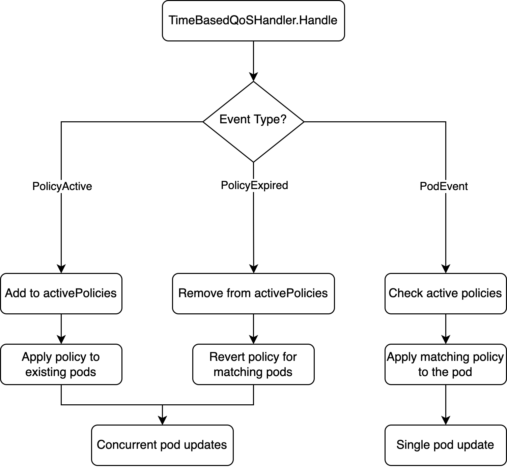

# Time Based QoS Policy

## Motivation

In modern Kubernetes clusters, enterprises often deploy both online services and offline batch workloads simultaneously to maximize resource utilization, 
which is also called colocation. Colocation scenarios often have peaks and troughs, during the day, online services require guaranteed resources and high priority to ensure service quality and user experience. 
However, during off-peak hours (typically at night), batch processing jobs need higher resource allocation to complete data processing, machine learning training, or other long tasks.

The time-based QoS policy feature provides automated QoS level adjustment based on predefined schedules without manual intervention.
According to the pre-defined time based colocation policy, the pods matched by the strategy will be adjusted to the target QoS level of the strategy during the effective period. 
When the resource usage of the cluster exceeds a certain threshold, the pods with a low QoS level will be suppressed.
This is helpful for colocation scenarios with peak and trough characteristics. Offline services are not always at a low QoS level. 
Instead, in a specified time period, the QoS level of the pods can be adjusted according to the configured policy.

### Goals

- Enable automatic QoS level adjustment for co-located workloads based on time schedules

### Non-Goals

- Non-QoS new colocation strategy, currently only based on QoS Level for adjustments

## Proposals

### User Stories

#### Story 1: Automatic QoS Level Adjustment for Co-located Workloads

As a cluster administrator, my cluster has colocation of online workloads and offline workloads. I want to automatically adjust QoS levels based on time schedules 
so that online services can utilize more resources during the day while offline workloads can utilize more resources during off-peak hours.
Two automatic time based colocation policies need to be configured: one for online workloads at night, and one for offline workloads during the day. 
Then, at night, online workloads can automatically adjust to a low QoS level and automatically recover during the day. 
Meanwhile, during the day, offline workloads can automatically adjust to a low QoS level and automatically recover at night.

## Design Details

### Data Structures

#### TimeBasedQoSPolicy

`TimeBasedQoSPolicy` contains the core time based colocation policy configuration. After policy is enabled, 
pods matched by the selector will be set to `targetQoSLevel` from `startTime` to `endTime` (format is HH:MM, time zone can be set, and it can span days).
To avoid repeatedly checking if pods have already been set to the `targetQoSLevel`, a policy check interval can be configured, with the default being a check every 15 seconds.

```go
type TimeBasedQoSPolicy struct {
    // Enable indicates whether this TimeBasedQoSPolicy is enabled.
    Enable *bool `json:"enable,omitempty"`
    
    // Name is the name of the TimeBasedQoSPolicy.
    Name string `json:"name,omitempty"`
    
    // StartTime is the start time of the policy, format: "HH:MM", e.g., "08:00".
    StartTime *string `json:"startTime,omitempty"`
    
    // EndTime is the end time of the policy, format: "HH:MM", e.g., "18:00".
    EndTime *string `json:"endTime,omitempty"`
    
    // TimeZone specifies the timezone for the policy, e.g., "UTC", "Asia/Shanghai".
    TimeZone *string `json:"timeZone,omitempty"`
    
    // Selector is used to select pods that this policy applies to.
    Selector *metav1.LabelSelector `json:"selector,omitempty"`
    
    // TargetQoSLevel defines the target QoS level to be applied during the specified time period.
    TargetQoSLevel *int `json:"targetQoSLevel,omitempty"`
    
    // CheckInterval specifies how often to check if the policy should be applied.
    CheckInterval *time.Duration `json:"checkInterval,omitempty"`
}
```

`TimeBasedQoSPolicies` is a new field in `ColocationConfig` that holds a list of time based QoS policies. 
```go
type ColocationConfig struct {
	... // Other fields omitted for brevity
	
	// TimeBasedQoSPolicies is a list of time based QoS policies.
	TimeBasedQoSPolicies []*TimeBasedQoSPolicy `json:"timeBasedQoSPolicies,omitempty" configKey:"TimeBasedQoSPolicies"`
}
```

#### Policy Events

Volcano agent needs to add two new components, `TimeBasedQoSProbe` and `TimeBasedQoSHandler`. `TimeBasedQoSProbe` acts as a producer to monitor whether new time based qos policies are added 
and whether existing policies are within the valid time period. It produces `TimeBasedQoSPolicyEvent` for `TimeBasedQoSHandler` to consume. 
`TimeBasedQoSPolicyEvent` has two event types, one is `Active` and the other is `Expired`. When the policy is within the effective time period, `Active` event is triggered. 
When the policy expires, `Expired` event is triggered.

```go
type TimeBasedQoSPolicyAction string

const (
    TimeBasedQoSPolicyActive  TimeBasedQoSPolicyAction = "Active"
    TimeBasedQoSPolicyExpired TimeBasedQoSPolicyAction = "Expired"
)

type TimeBasedQoSPolicyEvent struct {
    Policy *api.TimeBasedQoSPolicy
    Action TimeBasedQoSPolicyAction
}
```

### Architecture Components

#### TimeBasedQoSProbe

`TimeBasedQoSProbe` is responsible for managing policy worker lifecycle and policies updates:

- **Policies Management**: `TimeBasedQoSProbe` will track all active policies and create a worker for each policy. 
If a time based qos policy changes, the worker for that policy will also be rebuilt. 
- **Worker Lifecycle Management**: The policy worker runs in a separate goroutine and tracks whether each policy is within the effective time period. 
If the policy is within the effective time period, it will send an `Active` type `TimeBasedQoSPolicyEvent` to the `TimeBasedQoSHandler`. 
If it is not within the effective time period, it will send an `Expired` type event.

#### TimeBasedQoSHandler

`TimeBasedQoSHandler` is responsible for processing policy events and applying QoS changes, two types of events will be handled:

- `TimeBasedQoSPolicyEvent`: `TimeBasedQoSHandler` has an `activePolicies` map that is responsible for tracking the policy in effect. 
When it receives an `Active` type of `TimeBasedQoSPolicyEvent`, it updates the pods that match the policy to the `targetQoSLevel` and adds the policy to the `activePolicies` map. 
If the policy expires, it will be removed from the `activePolicies` map. When updating the matching pods to the `targetQoSLevel`, 
the original qos level will be recorded in the pod's annotation. This persistence ensures that even if the Volcano agent crashes, the pod's original QoS level can still be read. 
When the policy expires, the pod's qos will be restored to the original qos level.
- `PodEvent`: When a new pod is created or a pod on the node is updated, a PodEvent is triggered. 
`TimeBasedQoSHandler` determines whether there is a matching policy based on the existing `activePolicies`. 
If a match is successful, the pod's QoS level will be updated to the policy's `targetQoSLevel`. 
> Note: If multiple policies match the pod at the same time, only the first matching policy will be applied.

### System Flow Diagrams

#### Policy Activation/Expiration Flow


The above is the main logic of policy worker run. Policy worker will periodically check whether the policy is within the effective time range according to the `checkInterval` configured by the admin. 
If it is within the effective time range, it will regularly send `Active` event to the `TimeBasedQoSHandler`. 
If the policy is no longer within the effective time, it will send `Expired` event.

#### Event Handling Flow



The above is the main logic of `TimeBasedQoSHandler.Handle`. `TimeBasedQoSHandler` receives the `TimeBasedQoSPolicyEvent` event generated by `TimeBasedQoSProbe`. 
If it is an `Active` event, it will append the policy to the currently tracked `activePolicies` and determine whether there are matching pods that need to be updated to the `targetQoSLevel`. 
If it is an `Expired` event, it will remove the policy from the `activePolicies` and revert the matching pods to the original QoS level.
`TimeBasedQoSHandle` is also responsible for processing `PodEvent` events generated by `PodProbe`. When a new pod is created on the node or the pod on the node is updated,
`TimeBasedQoSHandle` traverses `activePolicies` to see if there is a matching policy. If there is a matching policy, the pod is updated to the `targetQoSLevel`.


### Sequence Diagrams

#### Policy Lifecycle Sequence


The above sequence diagram illustrates the lifecycle of a time based QoS policy. When a new policy is added or an existing policy is modified, 
`TimeBasedQoSProbe` creates or updates a worker for that policy. The worker periodically checks if the current time falls within the policy's active period, 
and sends appropriate events to the `TimeBasedQoSHandler`. Then `TimeBasedQoSHandler` processes these events to apply or revert QoS changes on matching pods.

### Pod Annotation Management

The system uses pod annotations to track QoS state changes:

- `volcano.sh/qos-level`: Current QoS level assigned to the pod
- `volcano.sh/original-qos-level`: This is a new annotation that needs to be added. It is used to persist the original qos level of the pod. 
If the policy expires, the Handler will restore the pod's qos based on the original qos level when policy expires

### Configuration Validation

The system validates all policy configuration fields during configuration updates:

- **Time Format Validation**: `StartTime` and `EndTime` must follow "HH:MM" format
- **Time Zone Validation**: `TimeZone` must be a valid timezone identifier
- **Selector Validation**: Label selectors must be valid Kubernetes label selectors
- **Required Field Validation**: Critical fields(`TargetQoSLevel`, `StartTime`, `EndTime`, `Selector`) must be present and non-empty

## Example

### Configuration Example

```yaml
apiVersion: v1
kind: ConfigMap
metadata:
  name: volcano-agent-config
  namespace: volcano-system
data:
  config.yaml: |
    globalConfig:
      timeBasedQoSPolicies:
        - name: "online-qos-at-night"
          enable: true
          startTime: "22:00"
          endTime: "08:00"
          timeZone: "Asia/Shanghai"
          selector:
            matchLabels:
              workload-type: "online"
          targetQoSLevel: -1
          checkInterval: "30s"
        - name: "offline-qos-during-day"
          enable: true
          startTime: "08:00"
          endTime: "22:00"
          timeZone: "Asia/Shanghai"
          selector:
            matchLabels:
              workload-type: "offline"
          targetQoSLevel: -1
          checkInterval: "30s"
```
The above shows an example configuration of time based qos policies, other fields are omitted here. 
Two policies are configured: one sets online workloads to a low qos level at night, and the other sets offline workloads to a low qos level during the day. 
This ensures that when resources are not enough, online workloads can get more resources during the day, while offline workloads can get more resources at night.