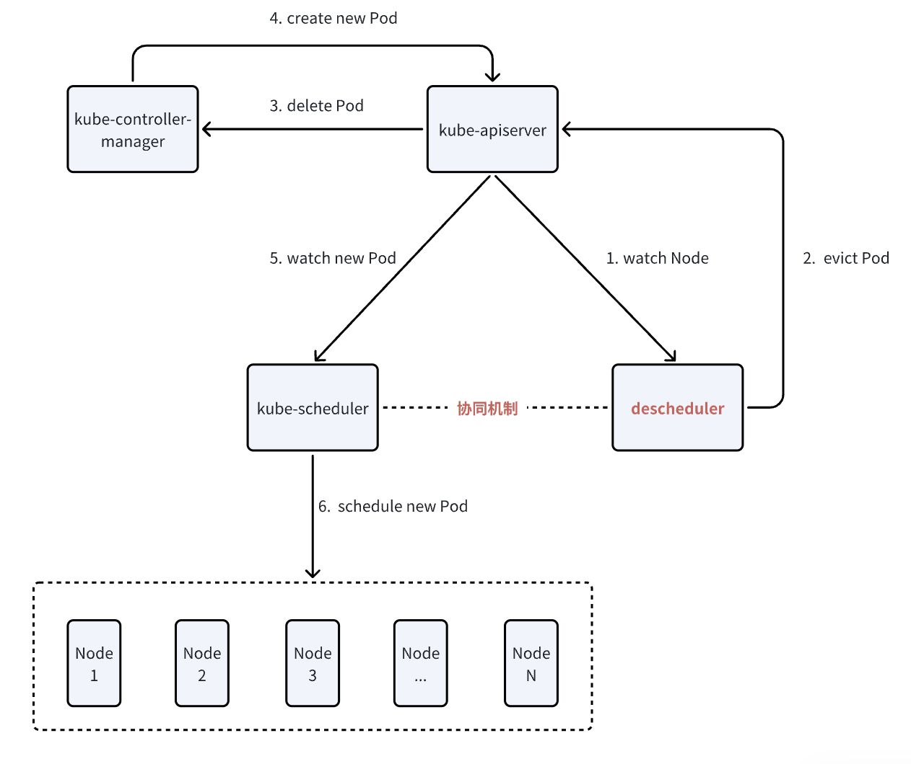
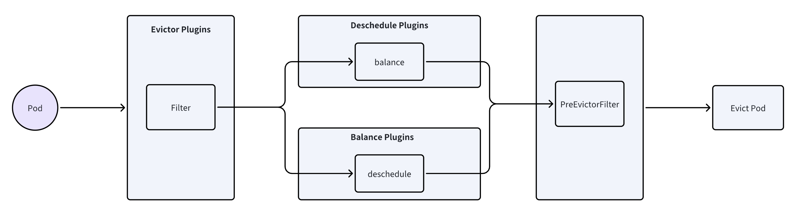
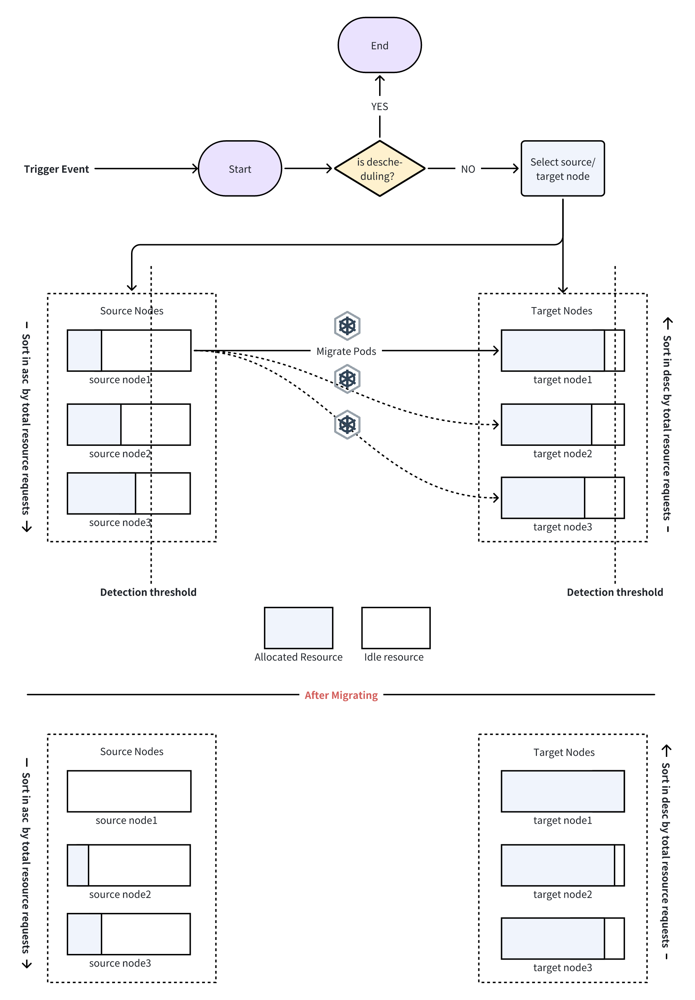
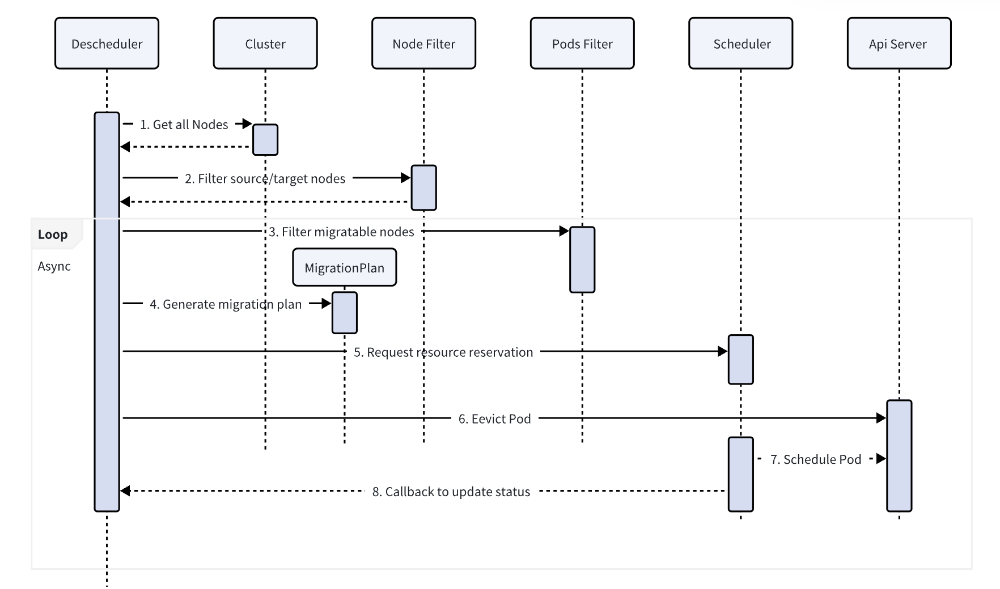
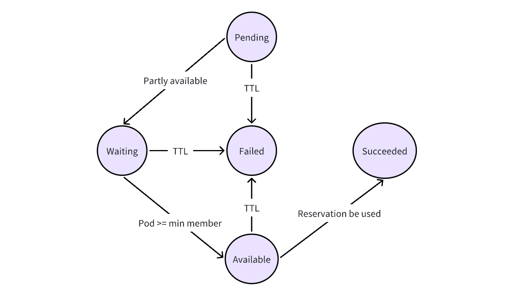

# Coordinate descheduler and Volcano to support resource defragmentation

## Background
Volcano, as a batch job scheduling engine for Kubernetes, provides core value by optimizing resource utilization for large-scale computing tasks. The existing Volcano descheduler supports load-aware rescheduling (migrating Pods based on actual node loads), but it lacks the capability to proactively consolidate resource fragmentation.
Resource fragmentation refers to the presence of numerous small, scattered free resources in the cluster, which are insufficient to meet the resource demands of larger Pods. This results in low overall resource utilization.

Resource utilization and load balancing are key concerns for users, both of which heavily depend on the scheduler's capabilities. While Volcano currently offers stable scheduling, its scheduling process is typically static, whereas node resources change dynamically. Therefore, rescheduling is necessary, and the scheduler must collaborate effectively to optimize resource usage and meet users' expectations for resource efficiency and load balancing.

### 1.1 Current Deficiencies
* Lack of Fragmentation Detection: The existing descheduler cannot identify resource wastage caused by fragmentation, nor does it include an algorithm for detecting fragmented resources.
* Decoupled Eviction and Scheduling: The descheduler evicts Pods without coordinating with the scheduler, potentially leading to inconsistencies in scheduling policies, which may prevent evicted Pods from being rescheduled successfully.

## Solution


### 2.0 Prerequisite
The workflow of the Descheduler component is as follows:


The K8S Deschedule mechanism is implemented through plugins, which are divided into three categories:
```go
// pkg/descheduler/framework/types.go
type Plugin interface {
    Name() string
}

type DeschedulePlugin interface {
    Plugin
    Deschedule(ctx context.Context, nodes []*corev1.Node) *Status
}

type BalancePlugin interface {
    Plugin
    Balance(ctx context.Context, nodes []*corev1.Node) *Status
}
```
* Deschedule Plugins: Deschedule plugins check each Pod to determine whether it meets the current scheduling constraints and evict them one by one if necessary. For example, they sequentially evict Pods that no longer satisfy node affinity or anti-affinity rules.
* Balance Plugins: Balance plugins optimize the overall distribution of all Pods or a specific group of Pods within the cluster. They process all Pods and PodGroups, determining which Pods need to be evicted based on the expected spread of the group. Resource defragmentation plugins belong to this category.
* Evictor Plugins: The core methods include Filter and PreEvictionFilter, which are responsible for filtering out Pods that do not meet the eviction criteria before executing the Balance and Deschedule plugins.



### 2.1 Overall Architecture


**Defragmentation Plugin**

**Strategy**: Bin-packing Based

* Prioritize migrating Pods from nodes with a lower total requested resource sum to free up more resources for future or pending tasks.

* Prioritize migrating Pods to nodes with a higher total requested resource sum to maximize utilization (without overloading).

**Configuration**: Extended from the upstream community's [highnodeutilization](https://github.com/kubernetes-sigs/descheduler/tree/master?tab=readme-ov-file#highnodeutilization).

```go
type DefragmentationArgs struct {
        metav1.TypeMeta `json:",inline"`
        
        ResourceType            v1.ResourceName        `json:"ResourceType"`
        ProtectionThresholds    api.ResourceThresholds `json:"protectionThresholds"`
        DefragmentThresholds    api.ResourceThresholds `json:"defragmentThresholds"`
        LowThresholds           api.ResourceThresholds `json:"lowThresholds"`
        NumberOfNodes int                    `json:"numberOfNodes,omitempty"`

        // Naming this one differently since namespaces are still
        // considered while considering resources used by pods
        // but then filtered out before eviction
        EvictableNamespaces *api.Namespaces `json:"evictableNamespaces,omitempty"`
        CoolDownTime  int  `json:"coolDownTime,omitempty"`
}
```
| Configuration Name      | Description                                                                                   | Recommended/Optional Values |
|------------------------|-----------------------------------------------------------------------------------------------|------------------------|
| **ResourceType**       | Type of resource fragmentation                                                                | `cpu`, `memory`, `nvidia.com/gpu` |
| **ProtectionThresholds** | High protection threshold. Nodes with resource utilization exceeding this threshold cannot be selected as migration targets to ensure the stability of existing Pods. | `90-95`                |
| **FragmentThresholds** | Resource fragmentation detection threshold. Nodes with resource utilization in the range `[FragmentThresholds, protectionThresholds]` are prioritized as target nodes for migration. | `70-80`                |
| **LowThresholds**      | Nodes with resource utilization below this threshold are prioritized as source nodes for migration. | `20-40`                |
| **EvictableNamespaces** | Namespace restrictions for evicting Pods (`exclude`/`include`).                               | `/`                    |
| **CoolDownTime**       | Nodes undergoing resource defragmentation cannot be rebalanced within the cooldown period.    | `/`                    |

**Trigger Event**:

1. Configurable time interval (existed)
2. Configurable Cron expression (existed)
3. Manually triggered via API

> The Defragmentation plugin and the Loadware plugin are inherently mutually exclusive—one favors Bin-packing, while the other prioritizes Balance. This raises the question of whether they should be allowed to run simultaneously. Possible solutions include: 1. Restricting the Defragmentation plugin to only be triggered manually via API 2. Introducing a cooldown period for nodes that have undergone defragmentation, during which they cannot be rebalanced by the Loadware plugin.

### 2.2 Fragmentation Detection
**Algorithm Description**:
The Descheduler needs to introduce a new strategy based on node fragmentation management. Nodes are categorized into target nodes and source nodes:

* Target Nodes: Nodes that will receive migrated Pods, where resource usage falls within the range:
`defragmentThresholds < usage < protectionThresholds`

* Source Nodes: Nodes from which Pods will be evicted, where resource usage is below:
`usage < lowThresholds`

**Resource Utilization Calculation**:
The utilization of a specific resource (CPU, GPU, or memory) is calculated as:
`Utilization = Sum(Requests) / Allocatable`

> Evaluating node utilization using Requests instead of actual workload metrics is mainly due to the fact that the scheduler makes scheduling decisions based on Pod Requests.

```go
// Node resource utilization formula (CPU as an example)
func calculateUtilization(node *v1.Node, pods []*v1.Pod) float64 {
    allocatable := node.Status.Allocatable[v1.ResourceCPU]
    requested := 0.0
    for _, pod := range pods {
        requested += pod.Spec.Containers[0].Resources.Requests.Cpu().AsApproximateFloat64()
    }
    return requested / allocatable.AsApproximateFloat64() * 100
}
```

### 2.3 Migration Plan
The Descheduler is responsible for selecting the source node, target node, and the pod to be migrated according to predefined rules, forming a triplet `<SourceNode, TargetNode, PodName>`, which represents a single migration plan for a pod. The decision-making process follows this order: selecting the source node, filtering the pods to be migrated from the source node, and selecting an appropriate target node.



#### 2.3.1 Source Node Selection
**Selection Criteria**:

* **Resource Utilization**: The node's utilization of specified resources is below `lowThresholds`.

* **Stability Requirement**: The node is not a system-critical node (does not have the `critical=true` label).

* **Migration Cooldown**: The node has not undergone a recent migration (to avoid frequent disruptions).

* **Priority Sorting**: Nodes are sorted in ascending order of utilization (prioritizing the least utilized nodes) to free up as much space as possible.
```go
// samples：filter source nodes
func filterSourceNodes(nodes []*v1.Node, res v1.ResourceName, lowThreshold float64) []*v1.Node {
    var sources []*v1.Node
    for _, node := range nodes {
        utilization := calculateNodeUtilization(node, res)
        if utilization < lowThreshold &&
           !hasCriticalLabel(node) &&
           !isInCooldown(node) {
            sources = append(sources, node)
        }
    }
    // Sort in ascending order of utilization (prioritizing the least utilized nodes).
    sort.Slice(sources, func(i, j int) bool {
        return getUtil(sources[i]) < getUtil(sources[j])
    })
    return sources
}
```


#### 2.3.2 Pod Selection
**Selection Criteria**:

* **Migratability**: Pods are filtered for migratability through PodFilter, consistent with the Volcano Scheduler.
  - ConfigMap：support filtering pods by `LabelSelector`

* **Priority Sorting**: Pods with larger requests are prioritized for migration to optimize fragmentation distribution.

#### 2.3.3 Target Node Selection
**Selection Criteria**:

* **Resource Utilization**: Within the defragmentation threshold range (`defragmentThresholds < usage < protectionThresholds`).

* **Resource Capacity**: Sufficient capacity to meet the resource request of the pod to be migrated.

* **Scheduling Constraints**: Complies with the pod's affinity/anti-affinity rules.

* **Priority Sorting**: Sorted in descending order of utilization (prioritizing migration to nodes with higher utilization, Bin-packing) to minimize resource fragmentation.

A resource snapshot of the target node is cached to avoid checking available resources each time.

```go
type NodeSnapshot struct {
    Name            string
    Allocatable     v1.ResourceList // total allocatable resources
    Allocated       v1.ResourceList // allocated resources
    Utilization     map[v1.ResourceName]float64
    LastDefragTime  time.Time
}
```

### 2.4 Scheduling Coordination Mechanism
The resource reorganization strategy needs to closely collaborate with the Volcano scheduler to ensure that evicted pods can be successfully rescheduled to suitable nodes. Specifically:

* The Volcano Scheduler implements a **resource reservation mechanism**.

* The Descheduler generates a migration plan, including the source node, target node, and pods to be migrated.

* The Descheduler creates a resource reservation, and after the reservation is successful, it evicts the pods.

* The Volcano Scheduler's scheduling logic is adjusted to specially handle and apply resource reservation scheduling logic for pods migrated due to fragmentation.

#### 2.4.1 Resource Reservation
The `Reservation` structure is integrated into the `PodGroup` to support Volcano's upcoming resource reservation capabilities based on `PodGroup`. Resource reservations will follow the standard scheduling logic through `OpenSession`.

1. **Reservation CRD & apis**

```go
type Reservation struct {
    metav1.TypeMeta `json:",inline"`

    // +optional
    metav1.ObjectMeta `json:"metadata,omitempty" protobuf:"bytes,1,opt,name=metadata"`

    // Specification of the desired behavior of the reservation.
    // +optional
    Spec ReservationSpec `json:"spec,omitempty" protobuf:"bytes,2,opt,name=spec"`

    // Current status of the reservation.
    // +optional
    Status ReservationStatus `json:"status,omitempty" protobuf:"bytes,3,opt,name=status"`
}

// ReservationSpec describes the desired behavior of the reservation.
type ReservationSpec struct {
    // SchedulerName is the default value of `tasks.template.spec.schedulerName`.
    // +optional
    SchedulerName string `json:"schedulerName,omitempty" protobuf:"bytes,1,opt,name=schedulerName"`

    // The minimal available pods to run for this Reservation
    // Defaults to the summary of tasks' replicas
    // +optional
    MinAvailable int32 `json:"minAvailable,omitempty" protobuf:"bytes,2,opt,name=minAvailable"`

    // Tasks specifies the task specification of Reservation
    // +optional
    Tasks []TaskSpec `json:"tasks,omitempty" protobuf:"bytes,3,opt,name=tasks"`

    //Specifies the queue that will be used in the scheduler, "default" queue is used this leaves empty.
    // +optional
    Queue string `json:"queue,omitempty" protobuf:"bytes,4,opt,name=queue"`

    // Owners specify the entities that can allocate the reserved resources.
    // Multiple owner selectors are ORed.
    Owners []ReservationOwner `json:"owners,omitempty" protobuf:"bytes,5,rep,name=owners"`

    // Time-to-Live period for the reservation.
    // `expires` and `ttl` are mutually exclusive.
    // +optional
    TTL *metav1.Duration `json:"ttl,omitempty" protobuf:"bytes,6,opt,name=ttl"`

    // Expired timestamp when the reservation is expected to expire.
    // If both `expires` and `ttl` are set, `expires` is checked first.
    // `expires` and `ttl` are mutually exclusive. Defaults to being set dynamically at runtime based on the `ttl`.
    // +optional
    Expires *metav1.Time `json:"expires,omitempty" protobuf:"bytes,7,opt,name=expires"`
}
type ReservationStatus struct {
    // Current state of Reservation.
    // +optional
    State ReservationState `json:"state,omitempty" protobuf:"bytes,1,opt,name=state"`

    // The minimal available pods to run for this Reservation
    // +optional
    MinAvailable int32 `json:"minAvailable,omitempty" protobuf:"bytes,2,opt,name=minAvailable"`

    // The status of pods for each task
    // +optional
    TaskStatusCount map[string]TaskState `json:"taskStatusCount,omitempty" protobuf:"bytes,3,opt,name=taskStatusCount"`

    // The number of pending reservation pods.
    // +optional
    Pending int32 `json:"pending,omitempty" protobuf:"bytes,4,opt,name=pending"`

    // The number of available reservation pods.
    // +optional
    Available int32 `json:"available,omitempty" protobuf:"bytes,5,opt,name=available"`

    // The number of reservation pods which reached phase Succeeded.
    // +optional
    Succeeded int32 `json:"succeeded,omitempty" protobuf:"bytes,6,opt,name=succeeded"`

    // The number of reservation pods which reached phase Failed.
    // +optional
    Failed int32 `json:"failed,omitempty" protobuf:"bytes,7,opt,name=failed"`

    // Which conditions caused the current Reservation state.
    // +optional
    // +patchMergeKey=status
    // +patchStrategy=merge
    Conditions []ReservationCondition `json:"conditions,omitempty" protobuf:"bytes,8,rep,name=conditions"`

    // Owner who is currently using this reservation.
    // +optional
    CurrentOwner v1.ObjectReference `json:"currentOwner,omitempty" protobuf:"bytes,9,opt,name=currentOwner"`

    // Total allocatable resources for this reservation.
    // +optional
    Allocatable v1.ResourceList `json:"allocatable,omitempty" protobuf:"bytes,10,rep,name=allocatable"`

    // Total resources currently allocated to the owner.
    // +optional
    Allocated v1.ResourceList `json:"allocated,omitempty" protobuf:"bytes,11,rep,name=allocated"`
}

type ReservationState struct {
    // The phase of Reservation.
    // +optional
    Phase ReservationPhase `json:"phase,omitempty" protobuf:"bytes,1,opt,name=phase"`

    // Unique, one-word, CamelCase reason for the phase's last transition.
    // +optional
    Reason string `json:"reason,omitempty" protobuf:"bytes,2,opt,name=reason"`

    // Human-readable message indicating details about last transition.
    // +optional
    Message string `json:"message,omitempty" protobuf:"bytes,3,opt,name=message"`

    // Last time the condition transit from one phase to another.
    // +optional
    LastTransitionTime metav1.Time `json:"lastTransitionTime,omitempty" protobuf:"bytes,4,opt,name=lastTransitionTime"`
}

type ReservationCondition struct {
    // Status is the new phase of reservation after performing the state's action.
    Status ReservationPhase `json:"status" protobuf:"bytes,1,opt,name=status,casttype=ReservationPhase"`
    // Last time the condition transitioned from one phase to another.
    // +optional
    LastTransitionTime *metav1.Time `json:"lastTransitionTime,omitempty" protobuf:"bytes,2,opt,name=lastTransitionTime"`
}

// ReservationPhase defines the phase of the reservation.
type ReservationPhase string

const (
    // ReservationPending is the phase that reservation is pending in the queue, waiting for scheduling decision
    ReservationPending ReservationPhase = "Pending"
    // ReservationAvailable indicates the Reservation is both scheduled and available for allocation.
    ReservationAvailable ReservationPhase = "Available"
    // ReservationSucceeded indicates the Reservation is scheduled and allocated for a owner, but not allocatable anymore.
    ReservationSucceeded ReservationPhase = "Succeeded"
    // ReservationWaiting indicates the Reservation is scheduled, but the resources to reserve are not ready for
    // allocation (e.g. in pre-allocation for running pods).
    ReservationWaiting ReservationPhase = "Waiting"
    // ReservationFailed indicates the Reservation is failed to reserve resources, due to expiration or marked as
    // unavailable, which the object is not available to allocate and will get cleaned in the future.
    ReservationFailed ReservationPhase = "Failed"
)

// ReservationOwner indicates the owner specification which can allocate reserved resources.
type ReservationOwner struct {
    // Multiple field selectors are ORed.
    // +optional
    Object *v1.ObjectReference `json:"object,omitempty" protobuf:"bytes,1,opt,name=object"`
    // +optional
    LabelSelector *metav1.LabelSelector `json:"labelSelector,omitempty" protobuf:"bytes,2,opt,name=labelSelector"`
}

// ReservationList defines the list of reservations.
type ReservationList struct {
    metav1.TypeMeta `json:",inline"`
    metav1.ListMeta `json:"metadata,omitempty" protobuf:"bytes,1,opt,name=metadata"`

    Items []Reservation `json:"items" protobuf:"bytes,2,rep,name=items"`
}
```

**Reservation Status Flow**

A resource reservation example: reserving two tasks.
```yaml
apiVersion: batch.volcano.sh/v1alpha1
kind: Reservation
metadata:
  name: complex-reservation
  namespace: default
spec:
  schedulerName: volcano
  queue: default
  minAvailable: 3  # 2 nginx + 1 busybox
  ttl: 600s
  owners:
    - labelSelector:
        matchLabels:
          volcano.sh/reservation-job: job-multi
  tasks:
    - name: nginx
      replicas: 2
      template:
        spec:
          containers:
            - name: nginx
              image: nginx:latest
              command: ["sleep", "300"]
              resources:
                requests:
                  cpu: "500m"
                  memory: "500Mi"
          restartPolicy: Never
    - name: busybox
      replicas: 1
      template:
        spec:
          containers:
            - name: busybox
              image: busybox:latest
              command: ["sleep", "300"]
              resources:
                requests:
                  cpu: "250m"
                  memory: "256Mi"
          restartPolicy: Never
```

Cache: New Reservation Handler for Cache to Process Add, Update, and Delete Events
* AddReservation: Creates `JobInfo` and `TaskInfo` (to be used for the actual scheduling).
* UpdateReservation: Currently not supported, but can be implemented in the future.
* DeleteReservation: Deletes the JobInfo and TaskInfo, and removes the corresponding record from the ReservationCache.

Reservation Cache：to store the reservation information in the cluster and manage the reservation status.(`cache.go`)
```go
type ReservationCache struct {
    sync.RWMutex
    vcClient        vcclientset.Interface
    reservations    map[types.UID]*schedulerapi.ReservationInfo
    nameToUID       map[string]types.UID
    nodesToTaskInfo map[string]*schedulerapi.TaskInfo
}

type ReservationInfo struct {
    JobID       JobID
    JobInfo     *JobInfo
    Reservation *batch.Reservation
}

```

**Overall Workflow**


1. Submit a Reservation CR
2. `Volcano Cache` watches for new reservations and create a related PodGroup(Only in cache).
3. `Volcano Cache`create a JobInfo and the corresponding TaskInfos in the Cache based on the ReservationSpec information from the Reservation CR.
```go
// AddReservationV1beta1 add reservation to scheduler cache
// AddReservationV1beta1 add reservation to scheduler cache
func (sc *SchedulerCache) AddReservationV1beta1(obj interface{}) {
	ss, ok := obj.(*schedulingv1beta1.Reservation)
	if !ok {
		klog.Errorf("Cannot convert to *schedulingv1beta1.Reservation: %v", obj)
		return
	}

	reservation := &scheduling.Reservation{}
	if err := scheme.Scheme.Convert(ss, reservation, nil); err != nil {
		klog.Errorf("Failed to convert reservation from %T to %T", ss, reservation)
		return
	}

	sc.Mutex.Lock()
	defer sc.Mutex.Unlock()
	klog.V(3).Infof("Add Reservation <%s/%s> into cache", ss.Namespace, ss.Name)
	sc.addReservation(reservation)
}

// UpdateReservationV1beta1 update reservation to scheduler cache
func (sc *SchedulerCache) UpdateReservationV1beta1(oldObj, newObj interface{}) {
	// TODO
	klog.V(3).Infof("Update Reservation, ignore. Not support now.")
	return
}

// DeleteReservationV1beta1 delete reservation from the scheduler cache
func (sc *SchedulerCache) DeleteReservationV1beta1(obj interface{}) {
	var ss *schedulingv1beta1.Reservation
	switch t := obj.(type) {
	case *schedulingv1beta1.Reservation:
		ss = t
	case cache.DeletedFinalStateUnknown:
		var ok bool
		ss, ok = t.Obj.(*schedulingv1beta1.Reservation)
		if !ok {
			klog.Errorf("Cannot convert to *schedulingv1beta1.Reservation: %v", t.Obj)
			return
		}
	default:
		klog.Errorf("Cannot convert to Numatopo: %v", t)
		return
	}

	reservation := &scheduling.Reservation{}
	if err := scheme.Scheme.Convert(ss, reservation, nil); err != nil {
		klog.Errorf("Failed to convert reservation from %T to %T", ss, reservation)
		return
	}

	sc.Mutex.Lock()
	defer sc.Mutex.Unlock()

	sc.deleteReservation(reservation)
	klog.V(3).Infof("Delete Reservation <%s/%s> from cache", ss.Namespace, ss.Name)
}

func (sc *SchedulerCache) addReservation(reservation *scheduling.Reservation) {
	_, err := sc.getQueueByName(reservation.Spec.Queue)
	if err != nil {
		klog.Errorf(err.Error())
		return
	}

	if isInitiated(reservation) {
		klog.V(3).Infof("Reservation <%s/%s> is already initiated", reservation.Namespace, reservation.Name)
		return
	}

	if _, err := sc.initiateReservation(reservation); err != nil {
		klog.Errorf(err.Error())
		return
	}

	// Create fake JobInfo and TaskInfos for Reservation
	jobId := getJobIDByReservation(reservation)
	if _, found := sc.Jobs[jobId]; !found {
		sc.Jobs[jobId] = schedulingapi.NewJobInfo(jobId)
	}
	job := sc.Jobs[jobId]
	for _, ts := range reservation.Spec.Tasks {
		ts.Template.Name = ts.Name
		tc := ts.Template.DeepCopy()

		for i := 0; i < int(ts.Replicas); i++ {
			newPod := createReservationPod(reservation, tc, i)
			pi, err := sc.NewTaskInfo(newPod)
			pi.ReservationNodeNames = ts.ReservationNodeNames
			pi.Status = schedulingapi.Pending
			klog.V(5).Infof("Created TaskInfo: %+v", pi)
			if err != nil {
				klog.Errorf("Failed to create task in cache for reservation pod<%s/%s>: %v",
					newPod.Namespace, newPod.Name, err)
				return
			}
			err = sc.addTask(pi)
			if err != nil {
				klog.Errorf("Failed to add taskInfo for pod <%s/%s> into cache: %v",
					newPod.Namespace, newPod.Name, err)
				return
			}
			klog.V(4).Infof("Added TaskInfo:%v for pod %s/%s to scheduler cache", pi, newPod.Namespace, newPod.Name)
		}
	}
	klog.V(5).Infof("Job Tasks: %v", job.Tasks)

	// Create ReservationInfo
	reservationInfo := schedulingapi.NewReservationInfo(jobId, job, reservation)

	// Add ReservationInfo into Reservation Cache
	sc.ReservationCache.AddReservation(reservationInfo)
	klog.V(4).Infof("Added ReservationInfo %s/%s to ReservationCache, UID: %s", reservation.Namespace, reservation.Name, reservationInfo.Reservation.UID)
}

func (sc *SchedulerCache) deleteReservation(ss *scheduling.Reservation) {
	reservationInfo, ok := sc.ReservationCache.GetReservationById(ss.UID)
	if !ok {
		return
	}
	job := reservationInfo.JobInfo
	if reservationInfo.Reservation.Status.State.Phase == scheduling.ReservationFailed {
		klog.V(4).Infof("Reservation %s/%s already gc'ed, skip clean", ss.Namespace, ss.Name)
		sc.ReservationCache.DeleteReservation(ss.UID)
		return
	}

	// clean related tasks from reservation
	tasks := job.Tasks
	for _, task := range tasks {
		if err := sc.deleteTask(task); err != nil {
			klog.Errorf("Failed to delete task <%s/%s> for reservation <%s/%s> from cache: %v",
				task.Namespace, task.Name, reservationInfo.Reservation.Namespace, reservationInfo.Reservation.Name, err)
		} else {
			klog.V(4).Infof("Delete task <%s/%s> for reservation <%s/%s> from cache",
				task.Namespace, task.Name, reservationInfo.Reservation.Namespace, reservationInfo.Reservation.Name)
		}
	}
	sc.ReservationCache.DeleteReservation(ss.UID)

	// clean related podgroup from cache
	if err := sc.deletePodGroup(job.UID); err != nil {
		klog.Errorf("Failed to delete podgroup %s for reservation from cache: %v", ss.Name, err)
		return
	}
}
```
4. Execute Volcano's regular scheduling cycle:
```
Scheduler.Schedule()
 └── OpenSession()
     └── Framework Plugins
     └── Iterate Queued Jobs
         └── Iterate Tasks in Job
             └── Schedule Each Task
 └── CloseSession()

```
5. For pods reserved by a reservation, modify the bind logic to only record the reservation info in the reservation cache and update the status of the Reservation CR, without performing an actual bind.
```go
// pkg/scheduler/plugins/reservation/reservation.go
// set `skip bind` flag for reservation tasks to skip actual bind
func (rp *reservationPlugin) PreBind(ctx context.Context, bindCtx *cache.BindContext) error {
	taskInfo := bindCtx.TaskInfo

	if !taskInfo.IsReservationTask() {
		return nil
	}

	job, task, err := rp.session.Cache().FindJobAndTask(taskInfo)
	if err != nil {
		return err
	}
	// reservation task need skipping bind action.
	if err := job.UpdateTaskStatus(task, api.Bound); err != nil {
		return err
	}
	bindCtx.SkipBind = true
	rp.session.Cache().GetReservationCache().SyncReservation(task, job)
	return nil
}

------------

// cache.go
func (sc *SchedulerCache) BindTask() {
	klog.V(5).Infof("batch bind task count %d", sc.batchNum)
		defer cancel()

		successfulPreBindContexts := sc.executePreBinds(cancelCtx, bindContexts)
		sc.Bind(ctx, successfulPreBindContexts)
		needBindContexts := sc.filterNeedSkipBindContexts(successfulPreBindContexts)
		sc.Bind(ctx, needBindContexts)
	}(tmpBindCache)

	// The slice here needs to point to a new underlying array, otherwise bindCache may not be able to trigger garbage collection immediately
	// if it is not expanded, causing memory leaks.
	sc.bindCache = make([]*BindContext, 0)
}


func (sc *SchedulerCache) filterNeedSkipBindContexts(contexts []*BindContext) []*BindContext {
	contextsToBind := make([]*BindContext, 0, len(contexts))

	for _, bindCtx := range contexts {
		if !bindCtx.SkipBind {
			contextsToBind = append(contextsToBind, bindCtx)
		} else {
			klog.V(4).Infof("Task %s: %s skip bind", bindCtx.TaskInfo.Namespace, bindCtx.TaskInfo.Name)
		}
	}

	return contextsToBind
}
```

6. The `Reservation Cache` directly uses the API client to update the status of the ```Reservation CR.
```go
// pkg/scheduler/plugins/reservation/reservation.go
// Register PostBind action to sync reservation task status into `ReservationCache`
func (rp *reservationPlugin) PostBind(ctx context.Context, bindCtx *cache.BindContext) error {
	task := bindCtx.TaskInfo

	if !task.IsUseReservationTask() {
		return nil
	}

	if err := rp.session.Cache().SyncBindToReservationTask(task); err != nil {
		klog.Errorf("Failed to sync task %s to reservation task, err: %v", task.Name, err)
	}

	return nil
}

-----

// ReservationCache.go
func (rc *ReservationCache) SyncReservation(task *schedulerapi.TaskInfo, job *schedulerapi.JobInfo) {
	rc.Lock()
	defer rc.Unlock()

	reservation, ok := rc.getReservationByTask(task)
	if !ok {
		klog.Warningf("cannot find reservation from task <%s/%s>, skip sync", task.Namespace, task.Name)
		return
	}

	rc.reservationSyncQueue.Add(&ReservationSyncRequest{
		Reservation: reservation,
		Job:         job,
	})
	klog.V(4).Infof("Enqueued reservation <%s> for sync", reservation.Reservation.Name)
}

func (rc *ReservationCache) processSyncReservation() {
	request, shutdown := rc.reservationSyncQueue.Get()
	if shutdown {
		return
	}
	defer rc.reservationSyncQueue.Done(request)

	reservation := request.Reservation
	job := request.Job
	if err := rc.syncReservation(reservation, job); err != nil {
		klog.Errorf("Failed to update status of Reservation %v: %v", reservation.Reservation.UID, err)
		rc.reservationSyncQueue.AddRateLimited(request)
	} else {
		rc.reservationSyncQueue.Forget(request)
	}
}

// Sync the status of Reservation CR according to the status of the tasks in job.
func (rc *ReservationCache) syncReservation(reservation *schedulerapi.ReservationInfo, job *schedulerapi.JobInfo) error {
    rsve, err := rc.vcClient.BatchV1alpha1().Reservations(reservation.Reservation.Namespace).Get(context.TODO(), reservation.Reservation.Name, metav1.GetOptions{})
    if err != nil {
       klog.Errorf("Failed to get Reservation %s/%s: %v", reservation.Reservation.Namespace, reservation.Reservation.Name, err)
       return err
    }
    oldStatus := reservation.Reservation.Status.DeepCopy()
    taskStatusCount := make(map[string]v1alpha1.TaskState)
    var pending, available, succeeded, failed int32
    calculateTasksStatus(job, &taskStatusCount, &pending, &available, &succeeded, &failed)
    newStatus := v1alpha1.ReservationStatus{
       State:           oldStatus.State,
       MinAvailable:    oldStatus.MinAvailable,
       TaskStatusCount: taskStatusCount,
       Pending:         pending,
       Available:       available,
       Succeeded:       succeeded,
       Failed:          failed,
       CurrentOwner:    oldStatus.CurrentOwner,
       Allocatable:     oldStatus.Allocatable,
       Allocated:       job.Allocated.ConvertResourceToResourceList(),
    }
    rsve.Status = newStatus
    rsve.Status.State = calculateReservationState(pending, available, succeeded, failed)
    reservationCondition := newCondition(rsve.Status.State.Phase, &rsve.Status.State.LastTransitionTime)
    rsve.Status.Conditions = append(rsve.Status.Conditions, reservationCondition)
    // call api server to sync
    newReservation, err := rc.vcClient.BatchV1alpha1().Reservations(rsve.Namespace).UpdateStatus(context.TODO(), rsve, metav1.UpdateOptions{})
    if err != nil {
       klog.Errorf("Failed to update status of Reservation %v/%v: %v",
          rsve.Namespace, rsve.Name, err)
       return err
    }
    // sync cache
    reservation.Reservation = newReservation
    return nil
}
```

**Expiration and Recycling**

When a reservation exceeds its TTL, the Volcano scheduler updates its status to Expired. For expired resource reservations, the scheduler will clean them up and release the remaining resources according to a custom garbage collection cycle. However, resources that have been allocated to the associated pods will not be reclaimed.

```go
func (sc *SchedulerCache) gcReservation(reservation *schedulingapi.ReservationInfo) error {
	job := reservation.JobInfo
	// clean related tasks from reservation
	tasks := job.Tasks
	for _, task := range tasks {
		if err := sc.deleteTask(task); err != nil {
			klog.Errorf("Failed to delete task <%s/%s> for reservation <%s/%s> from cache: %v",
				task.Namespace, task.Name, reservation.Reservation.Namespace, reservation.Reservation.Name, err)
		} else {
			klog.V(4).Infof("Delete task <%s/%s> for reservation <%s/%s> from cache",
				task.Namespace, task.Name, reservation.Reservation.Namespace, reservation.Reservation.Name)
		}
	}
	// clean related podgroup from cache
	if err := sc.deletePodGroup(job.UID); err != nil {
		klog.Errorf("Failed to delete podgroup %s for reservation from cache: %v", reservation.Reservation.Name, err)
		return err
	}

	// gc reservation from cache
	return sc.ReservationCache.GcExpiredReservation(reservation)
}

// Reservation cache
func (rc *ReservationCache) ScanExpiredReservations(now time.Time, onExpired func(*schedulerapi.ReservationInfo)) {
	rc.RLock()
	defer rc.RUnlock()

	for _, reservation := range rc.reservations {
		if isReservationNeedExpiration(reservation, now) {
			onExpired(reservation)
		}
	}
}

func (rc *ReservationCache) GcExpiredReservation(reservation *schedulerapi.ReservationInfo) error {
	rc.Lock()
	defer rc.Unlock()

	// Remove reservation from cache
	delete(rc.reservations, reservation.Reservation.UID)
	delete(rc.nameToUID, reservation.Reservation.Name)

	// Sync status to API server
	rsveV1beta1, err := rc.vcClient.SchedulingV1beta1().Reservations(reservation.Reservation.Namespace).Get(context.TODO(), reservation.Reservation.Name, metav1.GetOptions{})
	if err != nil {
		if apierrors.IsNotFound(err) {
			klog.V(3).Infof("Reservation %s/%s not found in API server, maybe it's already deleted.",
				reservation.Reservation.Namespace, reservation.Reservation.Name)
			return nil
		}
		klog.Errorf("Failed to get Reservation %s/%s for GC: %v",
			reservation.Reservation.Namespace, reservation.Reservation.Name, err)
		return err
	}

	rsve, err := ConvertToInternalReservation(rsveV1beta1)
	if err != nil {
		klog.Errorf("Failed to convert reservation from %T to %T", rsveV1beta1, rsve)
		return err
	}

	now := metav1.Now()
	rsve.Status.State.Phase = scheduling.ReservationFailed
	rsve.Status.State.Reason = "Expired"
	rsve.Status.State.Message = "Reservation expired and was cleaned up by the scheduler"
	rsve.Status.State.LastTransitionTime = now
	reservationCondition := newCondition(rsve.Status.State.Phase, &rsve.Status.State.LastTransitionTime)
	rsve.Status.Conditions = append(rsve.Status.Conditions, reservationCondition)

	newReservationV1, err := ConvertToV1beta1Reservation(rsve)
	if err != nil {
		klog.Errorf("Failed to convert reservation from %T to %T", rsve, newReservationV1)
		return err
	}
	_, err = rc.vcClient.SchedulingV1beta1().Reservations(rsve.Namespace).UpdateStatus(context.TODO(), newReservationV1, metav1.UpdateOptions{})
	if err != nil {
		klog.Errorf("Failed to update status of Reservation %v/%v: %v",
			rsve.Namespace, rsve.Name, err)
		return err
	}
	return nil
}

func isReservationNeedExpiration(reservation *schedulerapi.ReservationInfo, now time.Time) bool {
	// 1. Skip failed or succeeded reservations
	rs := reservation.Reservation
	if rs.Status.State.Phase == scheduling.ReservationFailed || rs.Status.State.Phase == scheduling.ReservationSucceeded {
		return false
	}

	// 2. Skip if TTL is set to 0
	if rs.Spec.TTL != nil && rs.Spec.TTL.Duration == 0 {
		return false
	}

	// 3. Check expiration via Expires field (preferred)
	if rs.Spec.Expires != nil {
		expireAt := rs.Spec.Expires.Time.UTC()
		if now.UTC().After(expireAt) {
			return true
		}
	}

	// 4. Fallback to TTL-based expiration
	if rs.Spec.TTL != nil {
		createAt := rs.CreationTimestamp.Time.UTC()
		ttlExpireAt := createAt.Add(rs.Spec.TTL.Duration)
		if now.UTC().After(ttlExpireAt) {
			return true
		}
	}

	return false
}
```
#### 2.4.2 Reservation Scheduling
**Resource Reservation Matching Mechanism**

1. Owners Matching
* By `ObjectReference`
* By `LabelSelector`


2. Task Template Matching

Requires matching the reserved Pod’s template with the Pod template defined in the corresponding Reservation.
```go

func IsPodSpecMatch(taskPodSpec, resvPodSpec *v1.PodSpec) bool {
    if taskPodSpec.SchedulerName != resvPodSpec.SchedulerName {
       return false
    }
    if !apiequality.Semantic.DeepEqual(taskPodSpec.NodeSelector, resvPodSpec.NodeSelector) {
       return false
    }
    if !apiequality.Semantic.DeepEqual(taskPodSpec.Affinity, resvPodSpec.Affinity) {
       return false
    }
    if !apiequality.Semantic.DeepEqual(taskPodSpec.Tolerations, resvPodSpec.Tolerations) {
       return false
    }
    if taskPodSpec.PriorityClassName != resvPodSpec.PriorityClassName {
       return false
    }
    if !isContainerListEqual(taskPodSpec.Containers, resvPodSpec.Containers) {
       return false
    }
    if !isContainerListEqual(taskPodSpec.InitContainers, resvPodSpec.InitContainers) {
       return false
    }

    return true
}
```

By introducing a new **Reservation plugin**, support is added for scheduling Pods onto reserved resources.

**Reservation Plugin**:
A scheduling plugin used to handle both resource reservation and reservation-based scheduling. It mainly provides the following functionalities:

* Handle **predicate** logic: During the calculation of node available resources, it deducts the portion of resources reserved on the node.

* Handle node-level resource reservation: When a Reservation specifies the node where resources should be reserved, it modifies the NodeOrder.

* Handle Pods scheduled with reservations: It checks for available Reservation instances and modifies the NodeOrder accordingly.

| Volcano Actions | Volcano Fn                     | Description                          |
|-----------------|--------------------------------|--------------------------------------|
| Enqueue         | validJobFn                     | Validate reservation availability.   |
| Allocate        | bestNodeFn                     | Reserve resources on specific nodes. |

```go
const (
  // PluginName indicates name of volcano scheduler plugin.
  PluginName = "reservation"
)

type reservationPlugin struct {
  // Arguments given for the plugin
}

// New function returns prioritizePlugin object
func New(aruguments framework.Arguments) framework.Plugin {
  return &reservationPlugin{}
}

func (rp *reservationPlugin) Name() string {
  return PluginName
}

func (rp *reservationPlugin) OnSessionOpen(ssn *framework.Session) {
  klog.V(5).Infof("Enter reservation plugin ...")
  defer func() {
    klog.V(5).Infof("Leaving reservation plugin...")
  }()
  validJobFn := func(obj interface{}) *api.ValidateResult {
    job, ok := obj.(*api.JobInfo)
    if !ok {
      return &api.ValidateResult{
        Pass:    false,
        Message: fmt.Sprintf("Failed to convert <%v> to *JobInfo", obj),
      }
    }
    ssn.MatchReservationForPod(job)

    // 1. Check the reservation if available
    if valid := ssn.CheckReservationAvailable(job); !valid {
      return &api.ValidateResult{
        Pass:    false,
        Reason:  v1beta1.InvalidReservationReason,
        Message: fmt.Sprintf("Reservation specified by job <%s/%s> is not Available", job.Namespace, job.Name),
      }
    }

    // 2. Check reservation owner whether matched.
    if ownerMatched := ssn.CheckReservationOwners(job); !ownerMatched {
      return &api.ValidateResult{
        Pass:   false,
        Reason: v1beta1.ReservationOwnerNotMatchReason,
        Message: fmt.Sprintf(
          "Reservation specified by job <%s/%s> is not owned by the job (ownership mismatch by ownerObject  or label selectors)",
          job.Namespace, job.Name,
        ),
      }
    }

    // 3. Check tasks whether matched
    if specMatched := ssn.CheckReservationMatch(job); !specMatched {
      return &api.ValidateResult{
        Pass:   false,
        Reason: v1beta1.ReservationSpecNotMatchReason,
        Message: fmt.Sprintf(
          "Reservation specified by job <%s/%s> does not match job task spec: task count or PodSpec does not match",
          job.Namespace, job.Name,
        ),
      }
    }
    return nil
  }

  ssn.AddJobValidFn(rp.Name(), validJobFn)

  bestNodeFn := func(task *api.TaskInfo, scores map[float64][]*api.NodeInfo) *api.NodeInfo {
    klog.V(5).Infof("[debug]: enter reservation best node function for task %s/%s", task.Namespace, task.Name)
    if !task.IsReservationTask() {
      return nil
    }

    reservationNodeName := task.ReservationNodeName
    if reservationNodeName == "" {
      return nil
    }
    for _, nodeList := range scores {
      for _, node := range nodeList {
        if node.Name == reservationNodeName {
          klog.V(5).Infof("[debug]: Found reservation node %s", node.Name)
          return node
        }
      }
    }
    return nil
  }
  ssn.AddBestNodeFn(rp.Name(), bestNodeFn)
}

func (rp *reservationPlugin) OnSessionClose(ssn *framework.Session) {}
```

**Reserve Resource Mechanism**

(1) **Constructing the Reservation CR**

  * In the scheduler, a Reservation is similar to a vcjob; it creates a JobInfo and corresponding TaskInfos in the cache, effectively behaving like a real vcjob for scheduling purposes.

  * The scheduler performs scheduling for each fake Pod (i.e., TaskInfo in Volcano) defined in the Reservation.

(2) **Occupying Resources Internally in the Scheduler**

* After participating in scheduling through the scheduler, the Reservation modifies the bind behavior via the Reservation Plugin. It does not actually create Pods, but instead locks specified resources on the node in the scheduler’s internal cache (`Reservation Cache` in `cache.go`).

* This is similar to a pod being successfully scheduled but not yet running.

(3) **Modify Pod Scheduling Logic**

* During the PreFilter phase, the scheduler checks whether a matching Reserve PodGroup (Reservation) is available.

* If a matching Reservation is found:

  * The Pod/Task is directly bound to the node reserved by the Reservation, skipping the Filter and Score phases.

  * The Reservation and the Reservation Cache are updated accordingly.

* If no matching Reservation is found:

  * The Pod/Task follows the normal scheduling logic.


For jobs that need to use reservations, we have added a new `Reserve` action. This action is placed before the `allocate` action to handle the `resource transfer` for the job/task, moving resources from the reservation to those jobs/tasks which will use the reserved resources.

```
package reserve

import (
	"time"

	"k8s.io/klog/v2"

	"volcano.sh/volcano/pkg/scheduler/api"
	"volcano.sh/volcano/pkg/scheduler/framework"
	"volcano.sh/volcano/pkg/scheduler/metrics"
	"volcano.sh/volcano/pkg/scheduler/util"
)

type Action struct{}

func New() *Action {
	return &Action{}
}

func (reserve *Action) Name() string {
	return "reserve"
}

func (reserve *Action) Initialize() {}

func (reserve *Action) Execute(ssn *framework.Session) {
	klog.V(5).Infof("Enter Reserve ...")
	defer klog.V(5).Infof("Leaving Reserve ...")

	for _, job := range ssn.Jobs {
		if !job.IsUseReservation() {
			continue
		}

		if vr := ssn.JobValid(job); vr != nil && !vr.Pass {
			klog.V(4).Infof("Job <%s/%s> Queue <%s> skip allocate, reason: %v, message %v", job.Namespace, job.Name, job.Queue, vr.Reason, vr.Message)
			continue
		}

		jobs := util.NewPriorityQueue(ssn.JobOrderFn)
		jobs.Push(job)

		klog.V(3).Infof("Attempting to swap reservation for actual tasks in job <%s/%s>", job.Namespace, job.Name)
		stmt := framework.NewStatement(ssn)

		pendingTasks := util.NewPriorityQueue(ssn.TaskOrderFn)
		for _, task := range job.TaskStatusIndex[api.Pending] {
			pendingTasks.Push(task)
		}

		for !pendingTasks.Empty() {
			actualTask := pendingTasks.Pop().(*api.TaskInfo)

			if job.TaskHasFitErrors(actualTask) {
				klog.V(5).Infof("Task %s with role spec %s has already predicated failed, skip", actualTask.Name, actualTask.TaskRole)
				continue
			}

			if err := ssn.PrePredicateFn(actualTask); err != nil {
				klog.V(3).Infof("PrePredicate for task %s/%s failed for: %v", actualTask.Namespace, actualTask.Name, err)
				fitErrors := api.NewFitErrors()
				for _, ni := range ssn.NodeList {
					fitErrors.SetNodeError(ni.Name, err)
				}
				job.NodesFitErrors[actualTask.UID] = fitErrors
				break
			}

			reservationTask := actualTask.ReservationTaskInfo
			if reservationTask == nil {
				klog.Warningf("Task <%s/%s> wants to use reservation but has no ReservationTaskInfo", actualTask.Namespace, actualTask.Name)
				continue
			}
			reservedNodeName := reservationTask.NodeName

			if reservedNodeName == "" {
				klog.Warningf("Reservation info for task <%s/%s> does not specify a node", actualTask.Namespace, actualTask.Name)
				continue
			}

			reservedNode, found := ssn.Nodes[reservedNodeName]
			if !found {
				klog.Warningf("Reserved node '%s' for task <%s/%s> not found in current session", reservedNodeName, actualTask.Namespace, actualTask.Name)
				continue
			}

			if err := stmt.UnAllocate(reservationTask); err != nil {
				klog.Errorf("Failed to unAllocate reservation task %v from node %v, err: %v", reservationTask.UID, reservedNode.Name, err)
				continue
			}

			if err := stmt.Allocate(actualTask, reservedNode); err != nil {
				klog.Errorf("Failed to allocate actual task %v to its reserved node %v, err: %v", actualTask.UID, reservedNode.Name, err)
			} else {
				klog.V(4).Infof("Allocated actual task <%s/%s> to node <%s>, effectively replacing the reservation.", actualTask.Namespace, actualTask.Name, reservedNode.Name)
				metrics.UpdateE2eSchedulingDurationByJob(job.Name, string(job.Queue), job.Namespace, metrics.Duration(job.CreationTimestamp.Time))
				metrics.UpdateE2eSchedulingLastTimeByJob(job.Name, string(job.Queue), job.Namespace, time.Now())
			}

			if ssn.JobReady(job) && !pendingTasks.Empty() {
				jobs.Push(job)
				klog.V(3).Infof("Job <%s/%s> is ready, but still has pending tasks. Pipelining.", job.Namespace, job.Name)
				break
			}
		}

		if ssn.JobReady(job) {
			stmt.Commit()
		} else {
			if !ssn.JobPipelined(job) {
				stmt.Discard()
			} else {
				stmt.Commit()
			}
		}
	}
}

func (reserve *Action) UnInitialize() {}
```


**Rescheduling Scenario**

Before a Pod is rescheduled, the descheduler creates a `Reservation` for the candidate.
This Reservation contains only one Pod (i.e., a Task with replica = 1), and sets the corresponding template and owners.
Once the Reservation.Status becomes Available, the descheduler evicts the old Pod.
The new Pod can then be successfully scheduled onto the reserved resources via the Reservation.
This solves the problem where a rescheduled Pod is evicted from the old node but cannot be guaranteed to land on a new node.


#### 2.4.3 Migration
After the resource reservation is successfully established, the `Volcano Descheduler` evicts the Pod from the node. The Pod is then recreated by its controller. Upon detecting the corresponding reservation, the `Volcano Scheduler` will bind the Pod to the reserved node.

```go
for _, sourceNode := range sourceNodes {
    
    nonRemovablePods, removablePods := classifyPods(sourceNode.allPods, d.podFilter)    
    pods := sorted(removablePods, d.args.ResourceType)

    for _, pod := range pods {
       d.migratePod(pod, sourceNode, targetNodes, migrateTimeout)
    }
}

func (d *Defragmentation) migratePod(pod *v1.Pod, sourceNode *NodeInfo, targetNodes []*NodeInfo, migrateTimeout time.Duration) {
    var targetNode *NodeInfo
    for _, node := range targetNodes {
       klog.V(4).Infof("Considering target node %s for Pod %s/%s", node.node.Name, pod.Namespace, pod.Name)
       // 1. check taints
       if !checkTaints(pod, *node) {
          klog.V(3).Infof("Pod %s/%s is not tolerating taints on node %s", pod.Namespace, pod.Name, node.node.Name)
          continue
       }

       // 2. check resource availability
       if !checkResourceAvailability(pod, *node) {
          klog.V(3).Infof("Insufficient resources on node %s for Pod %s/%s", node.node.Name, pod.Namespace, pod.Name)
          continue
       }

       targetNode = node
       break
    }

    if targetNode == nil {
       klog.Warningf("No suitable target node found for migrating Pod %s/%s from soruce node %s", pod.Namespace, pod.Name, sourceNode.node.Name)
       return
    }

    go d.doMigratePod(pod, sourceNode, targetNode, migrateTimeout)
}

func (d *Defragmentation) doMigratePod(pod *v1.Pod, sourceNode, targetNode *NodeInfo, migrateTimeout time.Duration) {
    podKey := generateKeyFromPod(pod)
    if _, exists := d.migratingPods.LoadOrStore(podKey, struct{}{}); exists {
       klog.Infof("Pod %s is already migrating, skip", podKey)
       return
    }
    defer d.migratingPods.Delete(podKey)

    klog.Infof("Starting migration of Pod %s/%s from %s to %s",
       pod.Namespace, pod.Name, sourceNode.node.Name, targetNode.node.Name)

    if !checkResourceAvailability(pod, *targetNode) {
       klog.Warningf("Insufficient resources on target node %s for Pod %s/%s", targetNode.node.Name, pod.Namespace, pod.Name)
       return
    }
    podRequests := getPodAllResourceRequest(pod)
    allocateResourceToNode(targetNode, podRequests)

    reservation := generateReservation(pod, targetNode)
    createdReservation, err := d.vcClient.BatchV1alpha1().Reservations(pod.Namespace).Create(context.TODO(), reservation, metav1.CreateOptions{})
    if err != nil {
       klog.Warningf("Failed to create reservation for Pod %s/%s: %v", pod.Namespace, pod.Name, err)
       releaseResourceFromNode(targetNode, podRequests)
       return
    }

    klog.V(4).Infof("Reservation %s created for Pod %s/%s and wait for available...", createdReservation.Name, pod.Namespace, pod.Name)

    if !d.waitForReservationAvailable(createdReservation, migrateTimeout) {
       klog.Warningf("Reservation %s for Pod %s/%s timed out", createdReservation.Name, pod.Namespace, pod.Name)
       _ = d.vcClient.BatchV1alpha1().Reservations(pod.Namespace).Delete(context.TODO(), createdReservation.Name, metav1.DeleteOptions{})
       releaseResourceFromNode(targetNode, podRequests)
       return
    }
    
    evictOptions := evictions.EvictOptions{
       Reason: fmt.Sprintf("Migrating Pod %s/%s from node %s to node %s", pod.Namespace, pod.Name, sourceNode.node.Name, targetNode.node.Name),
    }

    if !d.handle.Evictor().Evict(context.TODO(), pod, evictOptions) {
       klog.Errorf("Failed to evict Pod %s/%s from source node", pod.Namespace, pod.Name)
       _ = d.vcClient.BatchV1alpha1().Reservations(pod.Namespace).Delete(context.TODO(), createdReservation.Name, metav1.DeleteOptions{})
       releaseResourceFromNode(targetNode, podRequests)
       return
    }

    klog.Infof("Successfully evicted Pod %s/%s", pod.Namespace, pod.Name)
}

func (d *Defragmentation) waitForReservationAvailable(reservation *batch.Reservation, timeout time.Duration) bool {
    deadline := time.After(timeout)
    ticker := time.NewTicker(2 * time.Second)
    defer ticker.Stop()

    for {
       select {
       case <-deadline:
          return false
       case <-ticker.C:
          updated, err := d.vcClient.BatchV1alpha1().Reservations(reservation.Namespace).Get(context.TODO(), reservation.Name, metav1.GetOptions{})
          if err != nil {
             klog.Errorf("Error fetching reservation %s: %v", reservation.Name, err)
             continue
          }
          if updated.Status.State.Phase == batch.ReservationAvailable {
             klog.Infof("Reservation %s is now available", reservation.Name)
             return true
          }
       }
    }
}
```
