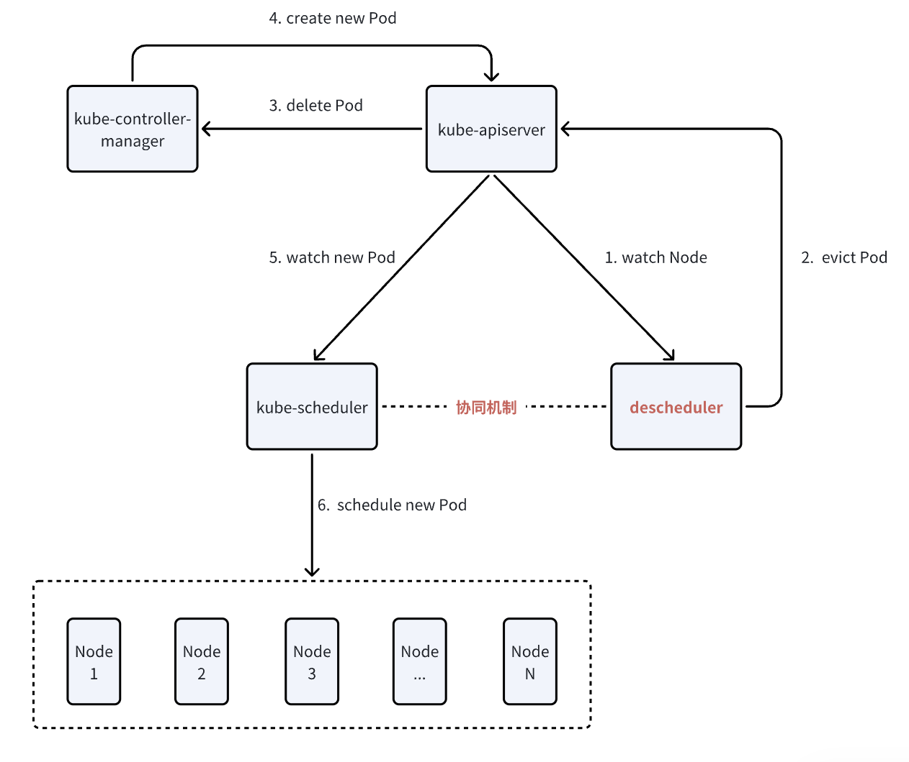
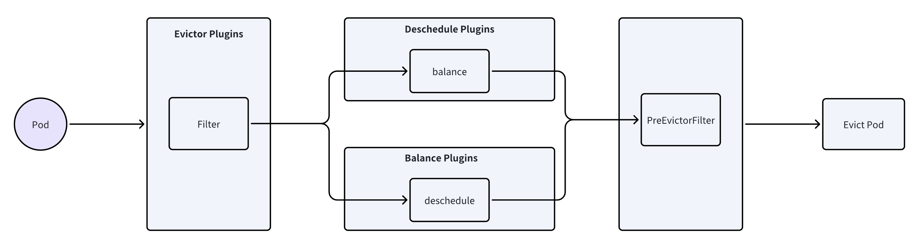
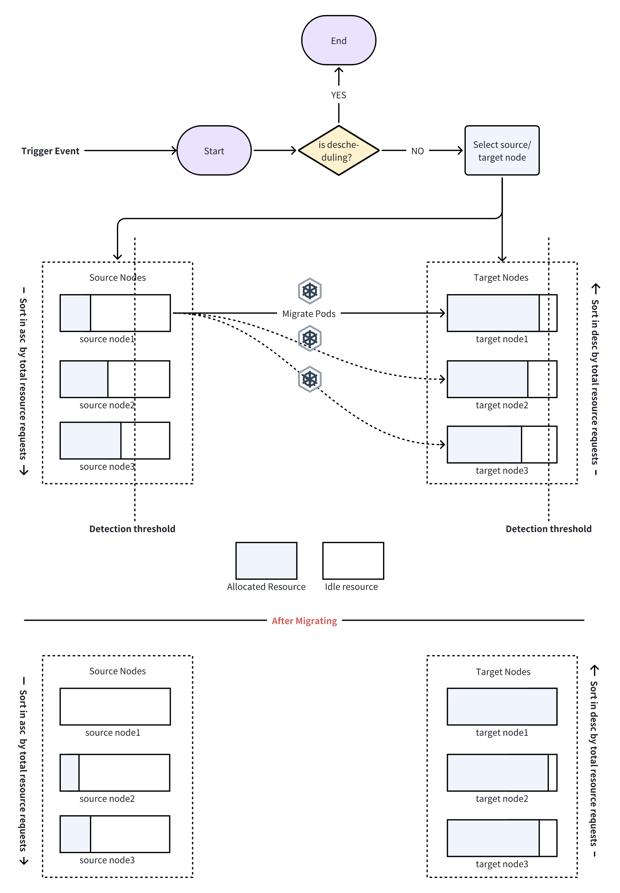
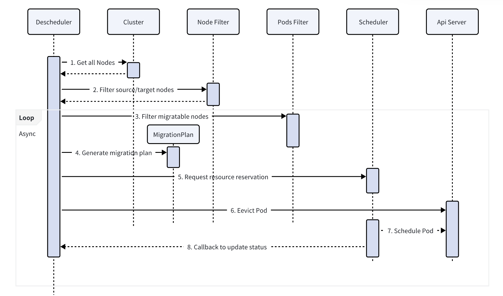

# Coordinate descheduler and Volcano to support resource defragmentation

## Background
Volcano, as a batch job scheduling engine for Kubernetes, provides core value by optimizing resource utilization for large-scale computing tasks. The existing Volcano descheduler supports load-aware rescheduling (migrating Pods based on actual node loads), but it lacks the capability to proactively consolidate resource fragmentation.
Resource fragmentation refers to the presence of numerous small, scattered free resources in the cluster, which are insufficient to meet the resource demands of larger Pods. This results in low overall resource utilization.

Resource utilization and load balancing are key concerns for users, both of which heavily depend on the scheduler's capabilities. While Volcano currently offers stable scheduling, its scheduling process is typically static, whereas node resources change dynamically. Therefore, rescheduling is necessary, and the scheduler must collaborate effectively to optimize resource usage and meet users' expectations for resource efficiency and load balancing.

### 1.1 Current Deficiencies
* Lack of Fragmentation Detection: The existing descheduler cannot identify resource wastage caused by fragmentation, nor does it include an algorithm for detecting fragmented resources.
* Decoupled Eviction and Scheduling: The descheduler evicts Pods without coordinating with the scheduler, potentially leading to inconsistencies in scheduling policies, which may prevent evicted Pods from being rescheduled successfully.

## Solution


### 2.0 Prerequisite
The workflow of the Descheduler component is as follows:


The K8S Deschedule mechanism is implemented through plugins, which are divided into three categories:
```go
// pkg/descheduler/framework/types.go
type Plugin interface {
    Name() string
}

type DeschedulePlugin interface {
    Plugin
    Deschedule(ctx context.Context, nodes []*corev1.Node) *Status
}

type BalancePlugin interface {
    Plugin
    Balance(ctx context.Context, nodes []*corev1.Node) *Status
}
```
* Deschedule Plugins: Deschedule plugins check each Pod to determine whether it meets the current scheduling constraints and evict them one by one if necessary. For example, they sequentially evict Pods that no longer satisfy node affinity or anti-affinity rules.
* Balance Plugins: Balance plugins optimize the overall distribution of all Pods or a specific group of Pods within the cluster. They process all Pods and PodGroups, determining which Pods need to be evicted based on the expected spread of the group. Resource defragmentation plugins belong to this category.
* Evictor Plugins: The core methods include Filter and PreEvictionFilter, which are responsible for filtering out Pods that do not meet the eviction criteria before executing the Balance and Deschedule plugins.



### 2.1 Overall Architecture


**Defragmentation Plugin**

**Strategy**: Bin-packing Based

* Prioritize migrating Pods from nodes with a lower total requested resource sum to free up more resources for future or pending tasks.

* Prioritize migrating Pods to nodes with a higher total requested resource sum to maximize utilization (without overloading).

**Configuration**: Extended from the upstream community's [highnodeutilization](https://github.com/kubernetes-sigs/descheduler/tree/master?tab=readme-ov-file#highnodeutilization).

```go
type DefragmentationArgs struct {
        metav1.TypeMeta `json:",inline"`
        
        ResourceType            v1.ResourceName        `json:"ResourceType"`
        ProtectionThresholds    api.ResourceThresholds `json:"protectionThresholds"`
        DefragmentThresholds    api.ResourceThresholds `json:"defragmentThresholds"`
        LowThresholds           api.ResourceThresholds `json:"lowThresholds"`
        NumberOfNodes int                    `json:"numberOfNodes,omitempty"`

        // Naming this one differently since namespaces are still
        // considered while considering resources used by pods
        // but then filtered out before eviction
        EvictableNamespaces *api.Namespaces `json:"evictableNamespaces,omitempty"`
        CoolDownTime  int  `json:"coolDownTime,omitempty"`
}
```
| Configuration Name      | Description                                                                                   | Recommended/Optional Values |
|------------------------|-----------------------------------------------------------------------------------------------|------------------------|
| **ResourceType**       | Type of resource fragmentation                                                                | `cpu`, `memory`, `nvidia.com/gpu` |
| **ProtectionThresholds** | High protection threshold. Nodes with resource utilization exceeding this threshold cannot be selected as migration targets to ensure the stability of existing Pods. | `90-95`                |
| **FragmentThresholds** | Resource fragmentation detection threshold. Nodes with resource utilization in the range `[FragmentThresholds, protectionThresholds]` are prioritized as target nodes for migration. | `70-80`                |
| **LowThresholds**      | Nodes with resource utilization below this threshold are prioritized as source nodes for migration. | `20-40`                |
| **EvictableNamespaces** | Namespace restrictions for evicting Pods (`exclude`/`include`).                               | `/`                    |
| **CoolDownTime**       | Nodes undergoing resource defragmentation cannot be rebalanced within the cooldown period.    | `/`                    |

**Trigger Event**:

1. Configurable time interval (existed)
2. Configurable Cron expression (existed)
3. Manually triggered via API

> The Defragmentation plugin and the Loadware plugin are inherently mutually exclusive—one favors Bin-packing, while the other prioritizes Balance. This raises the question of whether they should be allowed to run simultaneously. Possible solutions include: 1. Restricting the Defragmentation plugin to only be triggered manually via API 2. Introducing a cooldown period for nodes that have undergone defragmentation, during which they cannot be rebalanced by the Loadware plugin.

### 2.2 Fragmentation Detection
**Algorithm Description**:
The Descheduler needs to introduce a new strategy based on node fragmentation management. Nodes are categorized into target nodes and source nodes:

* Target Nodes: Nodes that will receive migrated Pods, where resource usage falls within the range:
`defragmentThresholds < usage < protectionThresholds`

* Source Nodes: Nodes from which Pods will be evicted, where resource usage is below:
`usage < lowThresholds`

**Resource Utilization Calculation**:
The utilization of a specific resource (CPU, GPU, or memory) is calculated as:
`Utilization = Sum(Requests) / Allocatable`

> Evaluating node utilization using Requests instead of actual workload metrics is mainly due to the fact that the scheduler makes scheduling decisions based on Pod Requests.

```go
// Node resource utilization formula (CPU as an example)
func calculateUtilization(node *v1.Node, pods []*v1.Pod) float64 {
    allocatable := node.Status.Allocatable[v1.ResourceCPU]
    requested := 0.0
    for _, pod := range pods {
        requested += pod.Spec.Containers[0].Resources.Requests.Cpu().AsApproximateFloat64()
    }
    return requested / allocatable.AsApproximateFloat64() * 100
}
```

### 2.3 Migration Plan
The Descheduler is responsible for selecting the source node, target node, and the pod to be migrated according to predefined rules, forming a triplet `<SourceNode, TargetNode, PodName>`, which represents a single migration plan for a pod. The decision-making process follows this order: selecting the source node, filtering the pods to be migrated from the source node, and selecting an appropriate target node.



#### 2.3.1 Source Node Selection
**Selection Criteria**:

* **Resource Utilization**: The node's utilization of specified resources is below `lowThresholds`.

* **Stability Requirement**: The node is not a system-critical node (does not have the `critical=true` label).

* **Migration Cooldown**: The node has not undergone a recent migration (to avoid frequent disruptions).

* **Priority Sorting**: Nodes are sorted in ascending order of utilization (prioritizing the least utilized nodes) to free up as much space as possible.
```go
// samples：filter source nodes
func filterSourceNodes(nodes []*v1.Node, res v1.ResourceName, lowThreshold float64) []*v1.Node {
    var sources []*v1.Node
    for _, node := range nodes {
        utilization := calculateNodeUtilization(node, res)
        if utilization < lowThreshold &&
           !hasCriticalLabel(node) &&
           !isInCooldown(node) {
            sources = append(sources, node)
        }
    }
    // Sort in ascending order of utilization (prioritizing the least utilized nodes).
    sort.Slice(sources, func(i, j int) bool {
        return getUtil(sources[i]) < getUtil(sources[j])
    })
    return sources
}
```


#### 2.3.2 Pod Selection
**Selection Criteria**:

* **Migratability**: Pods are filtered for migratability through PodFilter, consistent with the Volcano Scheduler.
  - ConfigMap：support filtering pods by `LabelSelector`

* **Priority Sorting**: Pods with larger requests are prioritized for migration to optimize fragmentation distribution.

#### 2.3.3 Target Node Selection
**Selection Criteria**:

* **Resource Utilization**: Within the defragmentation threshold range (`defragmentThresholds < usage < protectionThresholds`).

* **Resource Capacity**: Sufficient capacity to meet the resource request of the pod to be migrated.

* **Scheduling Constraints**: Complies with the pod's affinity/anti-affinity rules.

* **Priority Sorting**: Sorted in descending order of utilization (prioritizing migration to nodes with higher utilization, Bin-packing) to minimize resource fragmentation.

A resource snapshot of the target node is cached to avoid checking available resources each time.

```go
type NodeSnapshot struct {
    Name            string
    Allocatable     v1.ResourceList // total allocatable resources
    Allocated       v1.ResourceList // allocated resources
    Utilization     map[v1.ResourceName]float64
    LastDefragTime  time.Time
}
```

### 2.4 Scheduling Coordination Mechanism
The resource reorganization strategy needs to closely collaborate with the Volcano scheduler to ensure that evicted pods can be successfully rescheduled to suitable nodes. Specifically:

* The Volcano Scheduler implements a **resource reservation mechanism**.

* The Descheduler generates a migration plan, including the source node, target node, and pods to be migrated.

* The Descheduler creates a resource reservation, and after the reservation is successful, it evicts the pods.

* The Volcano Scheduler's scheduling logic is adjusted to specially handle and apply resource reservation scheduling logic for pods migrated due to fragmentation.

#### 2.4.1 Resource Reservation
The `Reservation` structure is integrated into the `PodGroup` to support Volcano's upcoming resource reservation capabilities based on `PodGroup`. Resource reservations will follow the standard scheduling logic through `OpenSession`.

`pkg/scheduler/api`

```go
type PodGroupSpec struct {
    MinMember         int32
    MinTaskMember     map[string]int32
    Queue             string
    PriorityClassName string
    MinResources      *v1.ResourceList
    
    // The Spec for reservation
    ReservationTemplate *ReservationSpec
}

type ReservationSpec struct {
    // Templates defines the scheduling requirements (resources, affinities, images, ...) processed by the scheduler just like normal pods.
    // If the `template.spec.nodeName` is specified, the scheduler will not choose another node but reserve resources on the specified node.
    Templates []*corev1.PodTemplateSpec   `json:"template,omitempty"`
    // Specify the owners who can allocate the reserved resources.
    Owners    []ReservationOwner `json:"owners"`
    // Time-to-Live period for the reservation.
    TTL *metav1.Duration `json:"ttl,omitempty"`
}

type ReservationOwner struct {
    // Multiple field selectors are ANDed.
    Object        *corev1.ObjectReference         `json:"object,omitempty"`
    LabelSelector *metav1.LabelSelector           `json:"labelSelector,omitempty"`
}

type PodGroupStatus struct {
    Phase       PodGroupPhase
    Conditions  []PodGroupCondition
    Running     int32
    Succeeded   int32
    Failed      int32
    
    // Record the reservation status for every pod in pod group
    Reservations map[string]ReservationStatus
}


type ReservationStatus struct {
    // The `phase` indicates whether is reservation is waiting for process (`Pending`), available to allocate
    // (`Available`) or timeout/expired to get cleanup (Failed).
    Phase ReservationPhase `json:"phase,omitempty"`
    // The `conditions` indicate the messages of reason why the reservation is still pending.
    Conditions []ReservationCondition `json:"conditions,omitempty"`
    // // Current resource owners which allocated the reservation resources.
    CurrentOwners []corev1.ObjectReference `json:"currentOwners,omitempty"`
    // Name of node the reservation is scheduled on.
    NodeName NodeName string `json:"nodeName,omitempty"`
    // Resource reserved and allocatable for owners.
    Allocatable corev1.ResourceList `json:"allocatable,omitempty"`
    // Resource allocated by current owners.
    Allocated corev1.ResourceList `json:"allocated,omitempty"`
}
```

A resource reservation example: reserving two Pods.
```yaml
apiVersion: scheduling.volcano.sh/v1beta1
kind: PodGroup
metadata:
  name: reserved-pg-demo
  namespace: default
spec:
  minMember: 0
  queue: default
  reservationTemplate:
    templates:
      - metadata:
          labels:
            app: reserved
            pod: pod-a
        spec:
          containers:
            - name: reserved-container-a
              image: busybox
              imagePullPolicy: Always
              command: ["sleep", "3600"]
              resources:
                requests:
                  cpu: "4"
                  memory: "4Gi"

      - metadata:
          labels:
            app: reserved
            pod: pod-b
        spec:
          containers:
            - name: reserved-container-b
              image: polinux/stress
              imagePullPolicy: Always
              command: ["sleep", "3600"]
              resources:
                requests:
                  cpu: "1"
                  memory: "256Mi"

    owners:
      - labelSelector:
          matchLabels:
            app: reserved
      - object: # owner pods whose name is `default/pod-demo-1`
          name: pod-demo-1
          namespace: default
    ttl: 10m
```

A Pod using reservations example:
```yaml
apiVersion: v1
kind: Pod
metadata:
  name: reserved-user-pod-a 
  namespace: default
  annotations:
    scheduling.volcano.sh/use-reservation: "true" # need to use reservation resource
    scheduling.valcano.sh/target-reservation: "reserved-pg-demo" # Specify the name of the resource reservation to be used. If not specified, check all available reservations.
  labels:
    app: reserved # match the owner spec of `reserved-pg-demo`
spec:
  schedulerName: volcano
  containers:
    - name: user-container-a
      image: busybox
      command: ["sleep", "3600"]
      resources:
        requests:
          cpu: "500m"
          memory: "128Mi"
        limits:
          cpu: "500m"
          memory: "128Mi"

```

Reservation Store：to store the reservation information in the cluster and the reservation info of each node.(`cache.go`)
```go
type ReservationStore interface {
    DeleteReservation(r *schedulingv1alpha1.Reservation) *frameworkext.ReservationInfo
    GetReservationInfoByObject(object *corev1.ObjectReference, nodeName string) *frameworkext.ReservationInfo
}

type reservationStore struct {
    reservationLister  schedulinglister.ReservationLister
    lock               sync.RWMutex
    reservationInfos   map[types.UID]*frameworkext.ReservationInfo
    reservationsOnNode map[string]map[types.UID]struct{}
}
```


**Overall Workflow**
1. Submit a PodGroup (pseudo Job) for resource reservation
2. In `event_handlers.go`, within func `AddPodGroupV1beta1`, create corresponding TaskInfos based on the PodGroup’s ReservationTemplate, and add it to the cache:
```go
func (sc *SchedulerCache) AddPodGroupV1beta1(obj interface{}) {
    ss, ok := obj.(*schedulingv1beta1.PodGroup)

    // Previous logic remains unchanged
    ...

    // Check if this is a resource reservation PodGroup
    if ss.Spec.ReservationTemplate != nil {
        for i, template := range ss.Spec.ReservationTemplate.Templates {
            // Create a virtual Pod object
            pod := &corev1.Pod{
                ObjectMeta: metav1.ObjectMeta{
                    Name:      fmt.Sprintf("%s-reserve-template-%d", ss.Name, i),
                    Namespace: ss.Namespace,
                    Labels:    template.ObjectMeta.Labels,
                    Annotations: map[string]string{
                        "volcano.sh/only-for-reservation": "true",
                        "scheduling.k8s.io/group-name": podgroup.Name,
                    },
                },
                Spec: template.Spec,
            }

            // Create TaskInfo
            ti := schedulingapi.NewTaskInfo(pod)
            ti.PodGroup = pg
            ti.InitResreq()

            // Add Task to cache (bind to pseudo job)
            jobID := schedulingapi.JobID(fmt.Sprintf("%s/%s", ss.Namespace, ss.Name))
            if _, found := sc.Jobs[jobID]; !found {
                sc.Jobs[jobID] = schedulingapi.NewJobInfo(jobID)
            }

            sc.Jobs[jobID].AddTaskInfo(ti)
            klog.V(4).Infof("Added reservation task template as TaskInfo: %s", ti.Name)
        }
    }
}
```
3. Execute Volcano's regular scheduling cycle:
```
Scheduler.Schedule()
 └── OpenSession()
     └── Framework Plugins
     └── Iterate Queued Jobs
         └── Iterate Tasks in Job
             └── Schedule Each Task
 └── CloseSession()

```
4. For reservation-only pods, modify the **bind** logic to only record the reservation in the reservation cache and update the PodGroup’s status without actual bind:
```go
// cache.go
func (sc *SchedulerCache) Bind(tasks []*schedulingapi.TaskInfo) {
    tmp := time.Now()

    // Filter out normal tasks; skip binding for reservation-only pods
    var bindTasks []*schedulingapi.TaskInfo
    for _, task := range tasks {
        if task.Pod.Annotations["volcano.sh/only-for-reservation"] == "true" {
            // This is a reservation pod: only record reservation, don't bind
            klog.V(3).Infof("Skip actual bind for reservation-only pod %s/%s", task.Namespace, task.Name)

            // Record reservation
            if err := sc.ReservationCache.RecordReservation(task); err != nil {
                klog.Errorf("Failed to record reservation for pod %s/%s: %v", task.Namespace, task.Name, err)
                continue
            }

            // Update PodGroup status
            if task.PodGroup != nil {
                task.PodGroup.Status.Reserved++
            }

            // Record event
            sc.Recorder.Eventf(task.Pod, v1.EventTypeNormal, "Reserved", "Successfully reserved resources on node %v", task.NodeName)
        } else {
            bindTasks = append(bindTasks, task)
        }
    }

    // Execute the original logic for non-reservation-only tasks
    ...
}

```

**Expiration and Recycling**

When a reservation exceeds its TTL, the Volcano scheduler updates its status to Expired. For expired resource reservations, the scheduler will clean them up and release the remaining resources according to a custom garbage collection cycle. However, resources that have been allocated to the associated pods will not be reclaimed.

```go
// garbagecollector.go
func (c *Controller) recycleReservations() {
    reservations, err := c.reservationLister.List()
    
    for _, reservation := range reservations {
        if isReservationNeedCleanup(reservation) {
            // Update Reservation Cache
            sc.reservationCache.delete(reservation)
            }
        }
}
```
#### 2.4.2 Reservation Scheduling
By introducing a new **Reservation plugin**, support is added for scheduling Pods onto reserved resources.

**Reservation Plugin**:
A scheduling plugin used to handle both resource reservation and reservation-based scheduling. It mainly provides the following functionalities:

* Handle **predicate** logic: During the calculation of node available resources, it deducts the portion of resources reserved on the node.

* Handle node-level resource reservation: When a Reservation specifies the node where resources should be reserved, it modifies the NodeOrder.

* Handle Pods scheduled with reservations: It checks for available Reservation instances and modifies the NodeOrder accordingly.

Map the extension points to Volcano's `Actions` and `Functions`.

| Native Scheduler Extension Point | Volcano Plugin(Action & Fn)                                                                                                 | Description                                                                |
|----------------------------------|-----------------------------------------------------------------------------------------------------------------------------|----------------------------------------------------------------------------|
| Filter                           | predicateFn, prePredicateFn                                                                                                 | Deducting reserved resources when calculating the resources available to a node |
| Score                            | nodeOrderFn、batchNodeOrderFn、bestNodeFn                                                                                     | Processing Node Priority                    |

```go
const PluginName = "reservation"

type reservationPlugin struct {
    // Arguments given for the plugin
    pluginArguments framework.Arguments
}

func (rp *reservationPlugin) OnSessionOpen(ssn *framework.Session) {

    ssn.AddPredicateFn(PluginName, func(task *api.TaskInfo, node *api.NodeInfo) error {

        reservedOnNode := ssn.ReservationCache.getReservationInfoByNode(node.Name)
        // Node.Available = Node.Allocatable - Node.Allocated - (Node.Reserved.Allocatable - Node.Reserved.Allocated = Node.Reserved.Unused)
        idle := node.Allocatable.Clone()
        idle.Sub(node.Used)
        idle.Sub(reservedOnNode.Allocatable)
        idle.Add(reservedOnNode.Allocated)


        // if there is no enough resources in this node, return err
        if !idle.LessEqual(task.Resreq) {
            return fmt.Errorf("node %s does not have enough resources for task %s/%s after reserving: %v left vs %v needed",
                node.Name, task.Namespace, task.Name, idle, task.Resreq)
        }

        return nil
    })
    
    ssn.AddNodeOrderFn(PluginName, func(task *api.TaskInfo, node *api.NodeInfo) int {
        
    })
    
    ssn.AddBestNodeFn(gp.Name(), func(task *api.TaskInfo, nodeScores map[float64][]*api.NodeInfo) *api.NodeInfo {
    })
    
    
    ssn.AddBatchNodeOrderFn(gp.Name(), func(task *api.TaskInfo, nodes []*api.NodeInfo) (map[string]float64, error) {
    
    })
}
```

**Reserve Resource Mechanism**

(1) **Treat Reservation as a Pseudo PodGroup**

  * In the scheduler, each Reservation is treated as a "Reserve PodGroup," effectively acting like a real PodGroup for scheduling purposes.

  * The scheduler schedules each pod within the Reserve PodGroup just like regular pods.

(2) **Occupy Resources Internally in the Scheduler**

* After participating in scheduling, the Reserve PodGroup uses the Reservation Plugin to modify the Bind behavior. It does not actually create pods, but instead locks the specified resources on the node within the scheduler's internal cache (Reservation Store in `cache.go`).

* This is similar to a pod being successfully scheduled but not yet running.

(3) **Modify Pod Scheduling Logic**

* During the PreFilter phase, the scheduler checks whether a matching Reserve PodGroup (Reservation) is available.

* If a matching Reservation is found:

  * The pod is directly bound to the node reserved by the Reservation, skipping the Filter and Score phases.

  * The Reserve PodGroup's resource allocation information is updated.

* If no matching Reservation is found:

  * The pod follows the regular scheduling process.


**Rescheduling Scenario**

Before a Pod is rescheduled, the volcano-descheduler creates a reservation PodGroup for the candidate, which contains only one Pod. It sets the corresponding template and owners. Once the reservation becomes **available**, the descheduler evicts the old Pod. The new Pod can then be successfully scheduled onto the reserved resources. This addresses the issue where a rescheduled Pod is stopped on the old node but cannot be guaranteed to be scheduled onto a new node.


#### 2.4.3 Migration Plan
Once resource reservation is successfully completed, Volcano Descheduler writes the generated migration plan `<SourceNode, TargetNode, PodName>` into the `PodGroupSpec` of the `PodGroup` to which the migrating pod belongs. It then updates the `PodGroupStatus` to `migrating`.

When the `PodGroupController` detects the change in `PodGroupStatus`, it triggers the scheduling logic to attempt scheduling the pod onto the corresponding reserved resource instance. Once scheduling is successful, `PodGroupStatus` is updated to indicate that the migration is complete.

```go
// PodGroupSpec
type PodGroupSpec struct {
    MinMember         int32
    MinTaskMember     map[string]int32
    Queue             string
    PriorityClassName string
    MinResources      *v1.ResourceList
}

type PodGroupStatus struct {
    Phase       PodGroupPhase
    Conditions  []PodGroupCondition
    Running     int32
    Succeeded   int32
    Failed      int32
    
    // the number of pods in migrating
    Migrating   int32
    // the status of pods in migrating
    Migrations     []*MigrationStatus `json:"migrationInfo,omitempty"`
}

// Migration status
type MigrationStatus struct {
    // Phase represents the Phase of Migration
    // e.g. Pending/Running/Failed
    Phase      MigrationPhase `json:"phase,omitempty"`
    // Conditions records the stats of migration
    Conditions []PodMigrationCondition `json:"conditions,omitempty"`
    // Pod to be migrated
    PodRef *corev1.ObjectReference  `json:"pod,omitempty"`
    // Source node
    SourceNode string `json:"sourceNode,omitempty"`
    // Target node
    TargetNode string `json:"targetNode,omitempty"`
    // Reservation instance
    ReservationRef *corev1.ObjectReference  `json:"reservation,omitempty"`
}

type MigrationPhase string

const (
        MigrationPending   MigrationPhase = "Pending"
        MigrationRunning   MigrationPhase = "Running"
        MigrationSucceeded MigrationPhase = "Succeeded"
        MigrationFailed    MigrationPhase = "Failed"
)
```

**PodGroupController**：It is necessary to add a listener for PodGroupStatus to trigger pod migration.
```go
func (pg *pgcontroller) updatePodGroup(oldObj, newObj interface{}) {
    oldPG, ok := oldObj.(*scheduling.PodGroup)
    if !ok {
        klog.Errorf("Failed to convert oldObj to PodGroup")
        return
    }

    newPG, ok := newObj.(*scheduling.PodGroup)
    if !ok {
        klog.Errorf("Failed to convert newObj to PodGroup")
        return
    }

    // Check if the PodGroup status has changed to migrating
    if oldPG.Status.Phase != newPG.Status.Phase {
        klog.Infof("PodGroup %s/%s status changed: %s -> %s",
            newPG.Namespace, newPG.Name, oldPG.Status.Phase, newPG.Status.Phase)

        // Trigger the scheduling logic for the pod migration
        pg.handlePodGroupStatusChange(newPG)
    }
}
```

**Pod Migration**
```go
for sourceNode := range sourceNodes {
    // Filter migratable pods
    nonRemovablePods, removablePods := classifyPods(sourceNode.allPods, podFilter)
    
    // Sort pods in descending order based on resource requests
    pods := sorted(removablePods)
    
    for pod := range pods {
        migratePod(pod, sourceNode, targetNodes...)
    }
}

func migratePod(pod, sourceNode, targetNodes) {
    var targetNode *NodeInfo
    for _, _targetNode := range targetNodes {
        // 1. Check taints
        if !checkTaints(pod, _targetNode) {
            continue
        }
        
        // 2. Check resource availability
        if !checkResourceAvailability(_targetNode, pod) {
            continue
        }
        
        // Found a suitable target node, exit loop
        targetNode = _targetNode
        break
    }
    
    if targetNode != nil {
        go doMigratePod(pod, sourceNode, targetNode)
    } else {
        // No available target node found (log this)
    }
}

func doMigratePod(pod, sourceNode, targetNode) {
    // 0. Double-check & deduct resources in targetNode's cache
    
    // 1. Resource reservation
        // 1.1 Failure — return resources in the cache — exit
        // 1.2 Success — proceed with the next steps
    
    // 2. Rescheduling — create migrationPlan
        // 2.1 Evict from source node
        // 2.2 Bind to the reserved target node
    
    // 3. Callback to update resource info & migration status, etc.
}

```