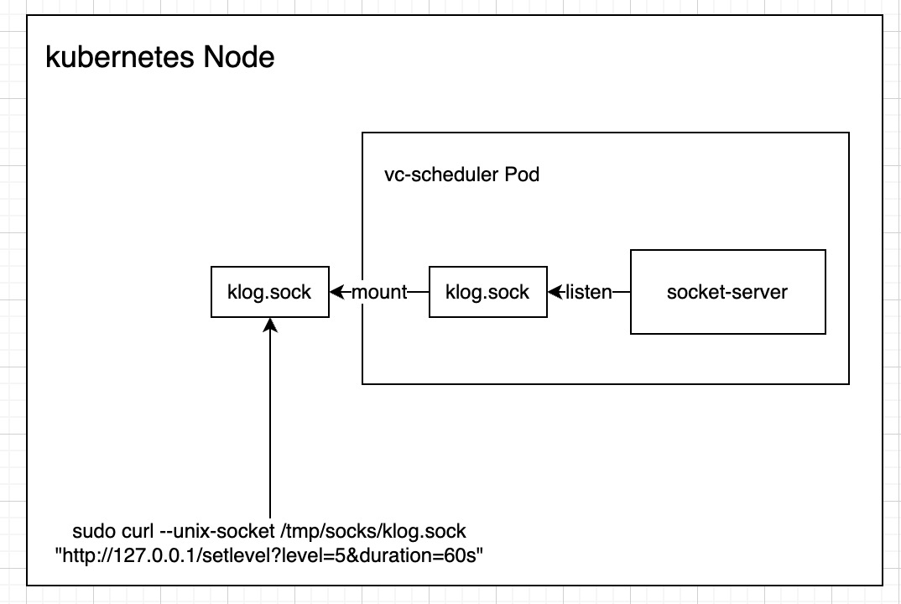

## 1 Introduction

### 1.1 Project Background

​	Volcano consists of three components: Scheduler, Webhook, and Controller. The Scheduler component schedules jobs by performing a series of actions and plugins to find the most suitable node for them. The Controller Manager manages the lifecycle of CRD (Custom Resource Definition) resources and is mainly composed of Queue ControllerManager, PodGroupControllerManager, and VCJob ControllerManager. The Admission component is responsible for validating CRD API resources.
​	Currently, the startup configuration information for Volcano components is static and cannot be updated at runtime. When  locate a problem of volcano, usually the existing log level is not enough and the problem cannot be located, however, after restart volcano-scheduler and increasing the log level, the problem context is lost, making it impossible to continue locating. Therefore, it is convenient to update the log level without restarting volcano to identify the problem.

### 1.2 dynamic configuration candidates

​	The startup configuration information for Volcano components is currently static, and we need to select appropriate configurations and make them dynamic. I will identify all the static parameters used when launching Volcano and choose the configurations that are necessary to be dynamically adjustable under specific scenarios.

```
-v, --v: The level of verbosity for log levels.
```

#### Possible actual use scenarios

1. `-v `The inability to update the log level of Volcano's Scheduler at runtime poses a significant burden on administrators during operation and maintenance. It is crucial to add the capability of dynamic configuration hot updates to enhance the efficiency of problem identification in production environments.

### 1.3 Project scope

​	Only focus on the static parameters that start the Schedule component

## 2 Implementation Plan

​	The vc-scheduler pod has an internal socket service to monitor changes in the klog.scok file. Because the socket service in the pod cannot be directly accessed in the k8s Node, the klog.sock file needs to be mounted from the pod to the cluster. Use The curl command modifies the klog.sock file.



example curl command example

```
sudo curl --unix-socket /tmp/socks/klog.sock "http://localhost/setlevel?level=5&duration=60s"
```

## 3、Why not change klog level throuth change configmap
1、Modifying configmap may affect other plugins.If  Volcano deployed in a customer cluster,  the configmap cannot be modified easily.
2、It'll be confusing that both options and configmap has same parameters,but have different value.

In deployment.yaml and configmap have different klog level.

deployment.yaml

```
        - name: volcano-scheduler
          image: volcanosh/vc-scheduler:latest
          args:
            - -v=3
```

configmap

```
  volcano-scheduler.conf: |
    actions: "enqueue, allocate, backfill"
    configurations:
    - name: dynamicConf
      arguments:
        klogLevel: "5"
```