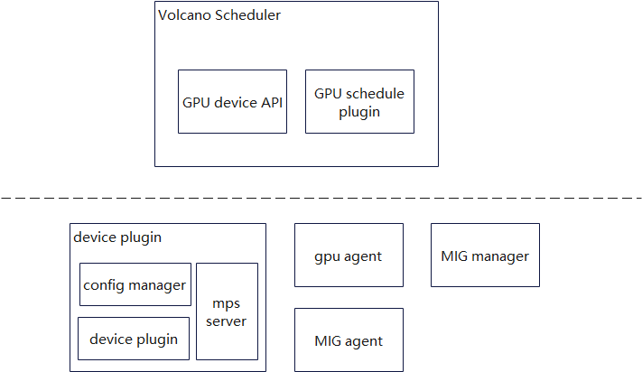
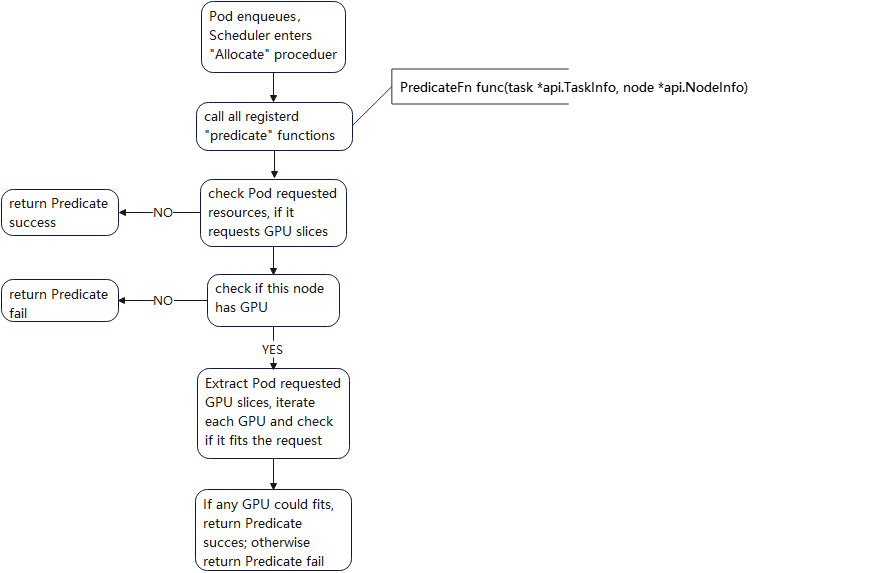
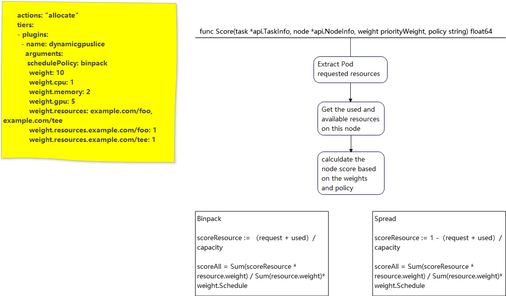
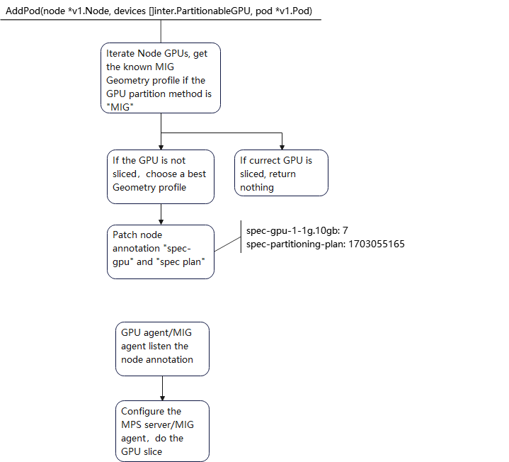

# NVIDIA GPU MPS and MIG dynamic slice plugin

## Introduction

The NVIDIA GPU build-in sharing method includes: time-slice, MPS and MIG. The context switch for time slice sharing would waste some time, so we chose the MPS and MIG. The GPU MIG profile is variable, the user could acquire the MIG device in the profile definition, but current implementation only defines the dedicated profile before the user requirement. That limits the usage of MIG. We want to develop an automatic slice plugin and create the slice when the user require it. And we also add the MPS support.
For the scheduling method, node-level binpack and spread will be supported. Referring to the binpack plugin, we consider the CPU, Mem, GPU memory and other user-defined resource.

## Targets

- CPU, Mem, and GPU combined schedule
- GPU dynamic slice: includes MPS and MIG
- Support node-level binpack and spread by GPU memory, CPU and Mem

## Limitations

- X86 structure
- Kubernetes 1.26 or higher

## Structure



### Config maps
- volcano-scheduler-configmap
This configmap defines the plugin configurations including policy, weight, and MIG geometries.

```yaml
apiVersion: v1
data:
  volcano-scheduler.conf: |
    actions: "enqueue, allocate, backfill"
    tiers:
    - plugins:
      - name: dynamicgpuslice
        arguments:
          dynamicgpuslice.schedulePolicy: spread
          dynamicgpuslice.scheduleWeight: 10
          dynamicgpuslice.weight.cpu: 1
          dynamicgpuslice.weight.memory: 2
          dynamicgpuslice.weight.gpu: 5
          dynamicgpuslice.DevicePluginCMName: mps-configmap
          dynamicgpuslice.DevicePluginCMNamespace: default
          dynamicgpuslice.KnowGeometries:
            - models: ["NVIDIA-A100-SXM4-80GB", "NVIDIA-A100-80GB-PCIe"]
              allowedGeometries:
                - 1g.10gb: 7
                - 2g.20gb: 3
                - 3g.40gb: 2
                - 4g.40gb: 1
                - 7g.80gb: 1
```

- mps-configmap
Define the MPS configuration

```yaml
apiVersion: v1
data:
  default: |
    version: v1
    flags:
      migStrategy: none
    sharing:
      mps:
        failRequestsGreaterThanOne: true
        resources:
        - devices:
          - "0"
          memoryGB: 4
          name: nvidia.com/gpu
          rename: gpu-4gb
          replicas: 2
        - devices:
          - "0"
          memoryGB: 2
          name: nvidia.com/gpu
          rename: gpu-2gb
          replicas: 2
kind: ConfigMap
metadata:
  name: mps-configmap
```
### Node labels and annotations

Labels:
- gpu.partitioning: control the partition method like MIG, MPS or default that no partition

Annotations:
- spec-gpu-: when in MIG status, define the GPU partition expected status
- spec-partitioning-plan: current partition plan ID
- status-gpu-: GPU partition status; reported by agent.
- status-partitioning-plan: applied plan ID

The annotations would be in one annotation entry and is as JSON format:
```
dynamicgpuslice: '{"spec-gpu-0-2gb": 2, "spec-partitioning-plan": 123456, "status-gpu-0-2gb-used": 1, "status-partitioning-plan": 123456}'
```
We use the plan ID for synchronization. When the scheduler plugin plans the GPU partition, it applies the configuration to configmap or spec-gpu annotation, and set s the plan ID. If the plan is not finished and another adding pod requirement comes, the adding process will return directly and wait for the plan finishment.

### Modules
- GPU device API： GPU probe and store into Node info structure; Get GPU info from Node info structure and do GPU partition plan when adding pod. When the slice type is MPS, it will write the MPS config
- GPU schedule plugin： read scheduler plugin configuration including weights and MIG geometry configurations; at the allocate stage, do GPU predicate action; at the Best node stage, score the nodes by weight configurations and current resource usage.
- Device plugin: inherit from NVIDIA official device plugin; add MPS device support in the device plugin and other two containers.
  * Config manager： read the config map mps-configmap, translate it into a config file, and share with the device plugin; kill the device plugin process and read the node annotation "status-gpu", write the annotation "status-plan" after the spec equals the status
  * Device plugin： fake the MPS device by the config and interact with kubelet
  * MPS server：NVIDIA official MPS server daemon
- GPU agent： read the GPU usage by kubelet API and update the node annoatation "status-gpu"
- MIG agent： call the nvml library to set MIG devices by the node annotation "spec-gpu" and set the "status-plan"; get the MIG devices usage and update the node annotation "status-gpu"
- MIG manager： MIG enable and disable; for MIG enable/disable configuration has some limitations, all MIG related Pods need to be stopped and the official MIG manager has those functions, so we reuse it but change the main process: just enable&disable MIG

### Proceduers

#### scheduler plugin initialization

In the initialization, the plugin reads the volcano-scheduler-configmap, stores the weights, policy, and the supported MIG geometries; it also registers two functions to action "allocate": Predicate and NodeOrderFn.


#### allocate and add pod





#### GPU partition plan and status

The best geometry profile is to fit more slice count, so we select the most slice profile.



## Usage
Create Volcano Queue and Pod Group. Skip them if you don't want to add the pod into any group.(remove the item "queue" in pod yaml if you don't specify the queue)

```yaml
apiVersion: scheduling.volcano.sh/v1beta1
kind: Queue
metadata:
  name: default
spec:
  reclaimable: true
  weight: 1
  capability:
    cpu: "32"
    memory: "8196Mi"
status:
  state: Open
---
apiVersion: scheduling.volcano.sh/v1beta1
kind: PodGroup
metadata:
  name: test
  namespace: default
spec:
  minMember: 1
  minResources:
    cpu: "24"
    memory: "4096Mi"
  priorityClassName: high-prority
  queue: default
```
### dynamic MPS
```yaml
apiVersion: batch.volcano.sh/v1alpha1
kind: Job
metadata:
  name: mpstest
spec:
  minAvailable: 3
  schedulerName: volcano
  queue: default
  policies:
    - event: PodEvicted
      action: RestartJob
  tasks:
    - replicas: 3
      name: cudatest
      policies:
      - event: TaskCompleted
        action: CompleteJob
      template:
        spec:
          hostIPC: true   # the MPS server and client use IPC for communication
          securityContext:
            runAsUser: 1000   # the user ID that specified by MPS server
          containers:
          - name: cuda-vector-add
            image: nvcr.io/nvidia/k8s/cuda-sample:vectoradd-cuda11.7.1-ubuntu20.04
            resources:
              limits:
                nvidia.com/gpu-2gb: "1"   # 2gb is the GPU memory count, now we only support the gb unit
          runtimeClassName: nvidia   # use this to mount NVIDIA tool-chain automatically
```

### dynamic MIG
```yaml
apiVersion: batch.volcano.sh/v1alpha1
kind: Job
metadata:
  name: migtest
spec:
  minAvailable: 2
  schedulerName: volcano
  queue: default
  policies:
    - event: PodEvicted
      action: RestartJob
  tasks:
    - replicas: 2
      name: cudatest
      policies:
      - event: TaskCompleted
        action: CompleteJob
      template:
        spec:
          containers:
          - name: cuda-vector-add
            image: nvcr.io/nvidia/k8s/cuda-sample:vectoradd-cuda11.7.1-ubuntu20.04
            resources:
              limits:
                nvidia.com/mig-2g.20gb: "3"   # 2g.20gb is a valid NVIDIA MIG profile
          runtimeClassName: nvidia
```
