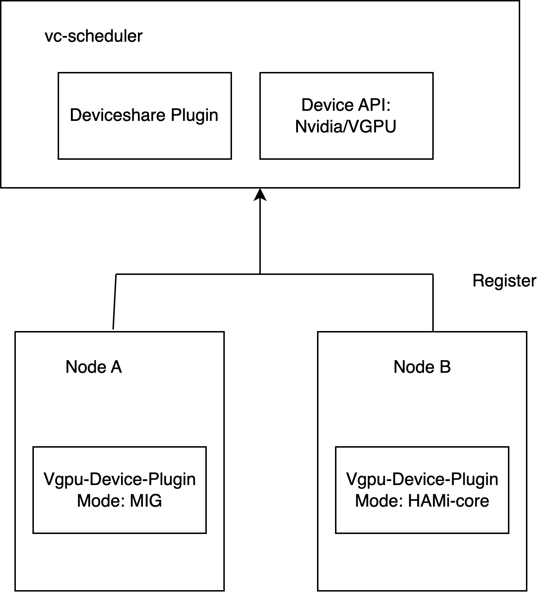
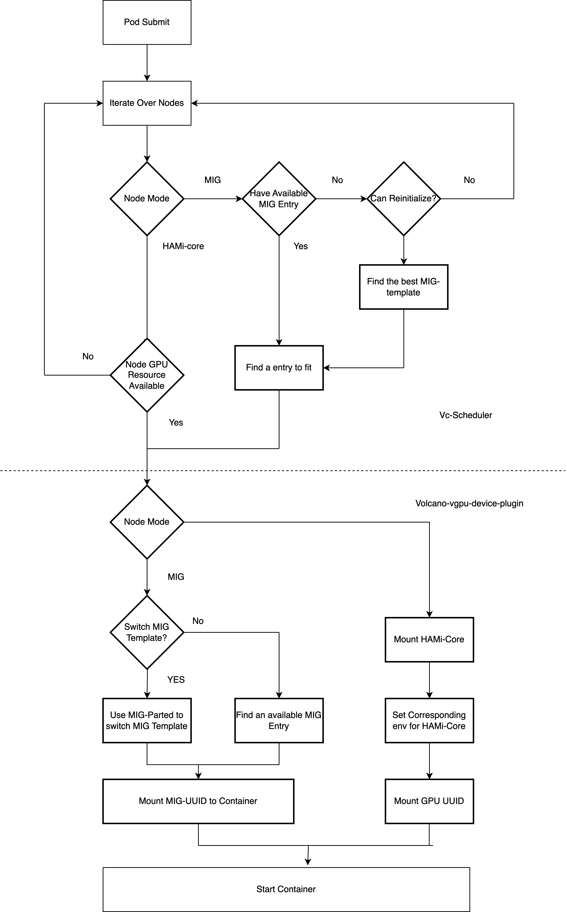
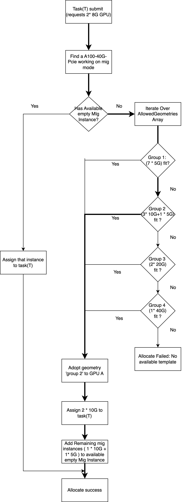

# NVIDIA GPU MPS and MIG dynamic slice plugin

## Special Thanks

This feature will not be implemented without the help of @sailorvii.

## Introduction

The NVIDIA GPU build-in sharing method includes: time-slice, MPS and MIG. The context switch for time slice sharing would waste some time, so we chose the MPS and MIG. The GPU MIG profile is variable, the user could acquire the MIG device in the profile definition, but current implementation only defines the dedicated profile before the user requirement. That limits the usage of MIG. We want to develop an automatic slice plugin and create the slice when the user require it.
For the scheduling method, node-level binpack and spread will be supported. Referring to the binpack plugin, we consider the CPU, Mem, GPU memory and other user-defined resource.
Volcano already have a [vgpu feature](https://github.com/Project-HAMi/volcano-vgpu-device-plugin) for NVIDIA devices after v1.9, it is done by using [hami-core](https://github.com/Project-HAMi/HAMi-core), which is a cuda-hacking library. But mig is also widely used across the world. A unified API for dynamic-mig and volcano-vgpu is needed.

## Targets

- CPU, Mem, and GPU combined schedule
- GPU dynamic slice: Hami-core and MIG
- Support node-level binpack and spread by GPU memory, CPU and Mem
- A unified vGPU Pool different virtualization technics
- Tasks can choose to use MIG, use HAMi-core, or use both.

### Config maps
- volcano-device-configMap
This configmap defines the plugin configurations including resourceName, and MIG geometries, and node-level configurations.

```yaml
apiVersion: v1
data:
  volcano-device-share.conf: |
    nvidia:
      resourceCountName: volcano.sh/vgpu-number
      resourceMemoryName: volcano.sh/vgpu-memory
      resourceCoreName: volcano.sh/vgpu-cores
      knownMigGeometries:
      - models: [ "A30" ]
        allowedGeometries:
          - group: group1 
            geometries: 
            - name: 1g.6gb
              memory: 6144
              count: 4
          - group: group2
            geometries:
            - name: 2g.12gb
              memory: 12288
              count: 2
          - group: group3
            geometries:
            - name: 4g.24gb
              memory: 24576
              count: 1
      - models: [ "A100-SXM4-40GB", "A100-40GB-PCIe", "A100-PCIE-40GB", "A100-SXM4-40GB" ]
        allowedGeometries:
          - group: group1
            geometries:
            - name: 1g.5gb
              memory: 5120
              count: 7
          - group: group2
            geometries:
            - name: 2g.10gb
              memory: 10240
              count: 3
            - name: 1g.5gb
              memory: 5120
              count: 1
          - group: group3
            geometries:
            - name: 3g.20gb
              memory: 20480
              count: 2
          - group: group4
            geometries:
            - name: 7g.40gb
              memory: 40960
              count: 1
      - models: [ "A100-SXM4-80GB", "A100-80GB-PCIe", "A100-PCIE-80GB"]
        allowedGeometries:
          - group: group1
            geometries:
            - name: 1g.10gb
              memory: 10240
              count: 7
          - group: group2
            geometries:
            - name: 2g.20gb
              memory: 20480
              count: 3
            - name: 1g.10gb
              memory: 10240
              count: 1
          - group: group3
            geometries:
            - name: 3g.40gb
              memory: 40960
              count: 2
          - group: group4
            geometries:
            - name: 7g.79gb
              memory: 80896
              count: 1
```

## Structure

 

## Examples

Dynamic mig is compatable with volcano-vgpu tasks, as the example below: 
Just Setting `volcano.sh/vgpu-number` and `volcano.sh/vgpu-memory`.

```yaml
apiVersion: v1
kind: Pod
metadata:
  name: gpu-pod1
spec:
  containers:
    - name: ubuntu-container1
      image: ubuntu:20.04
      command: ["bash", "-c", "sleep 86400"]
      resources:
        limits:
          volcano.sh/vgpu-number: 2 # requesting 2 vGPUs
          volcano.sh/vgpu-memory: 8000 # Each vGPU contains 8000m device memory （Optional,Integer
```

A task can decide only to use `mig` or `hami-core` by setting `annotations.volcano.sh/vgpu-mode` to corresponding value, as the example below shows:

```yaml
apiVersion: v1
kind: Pod
metadata:
  name: gpu-pod1
  annotations:
    volcano.sh/vgpu-mode: "mig"
spec:
  containers:
    - name: ubuntu-container1
      image: ubuntu:20.04
      command: ["bash", "-c", "sleep 86400"]
      resources:
        limits:
          volcano.sh/vgpu-number: 2 # requesting 2 vGPUs
          volcano.sh/vgpu-memory: 8000 # Each vGPU contains 8000m device memory （Optional,Integer）
```

## Procedures

The Procedure of a vGPU task which uses dynamic-mig is shown below:

 

Note that after submited a task, deviceshare plugin will iterate over templates defined in configMap `volcano-device-share`, and find the first available template to fit. You can always change the content of that configMap, and restart vc-scheduler to customize.

If you submit the example above(a pod requests 2 * 8G GPUs) to a cluster, which has an empty A100-PCIE-40GB node, then it will follow the procedure below:

 

As the figure shows, after the procedure, it will adopt geometry 'group2' to that GPU with the definiation below:

```yaml
group2:
  2g.10gb : 3
  1g.5gb : 1
```

There are four mig instances in total, vc-scheduler will return 2 '2g.10gb' instances to the task, and add the remaining instances (1 '2g.10gb' + 1 '1g.5gb' ) to the available empty mig instances, for future usage.

In the end, start the container with 2g.10gb instances * 2

