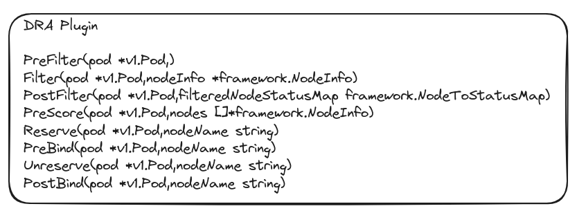

# Dynamic Resources Allocation

## Summary

DRA(Dynamic resource allocation) is the new way of requesting access to resources available in Kubernetes 1.26+.

## Motivation

DRA allows one to move away from the limited  "countable" API  provided by device plugins today. Volcano's implementation of device plugins is present in `https://github.com/volcano-sh/devices`.

The KEP for k8s DRA implementation: https://github.com/kubernetes/enhancements/blob/master/keps/sig-node/3063-dynamic-resource-allocation/README.md

## Goals

1. DRA should support resource allocation between multiple containers or pods.
2. Users can attach arbitrary constraints to a resource request to get the exact resource
   they are looking for.

## Out of Scope

1. Writing drivers. Support for new hardware will be provided by hardware vendor add-ons. The resources(resource driver) being mentioned in this context will be owned by these add-ons.
2. Replace support for device plugin.

## Implementation Details

The DRA will be available as a separate plugin in Volcano. 
The functions associated with the Implementation are listed above which are used in kube-schedulers DRA implementation.

The two allocation modes supported by DRA are:
1. immediate
2. delayed(aka. WaitForFirstConsumer)

In immediate allocation the allocation on nodes starts as soon as the `ResourceClaim` gets created whereas in delayed mode allocation is delayed until a Pod gets scheduled that needs the `ResourceClaim`.

For the delayed allocation mode,PodSchedulingcontext is used. In this allocation mode a node is selected tentatively by the scheduler in an iterative process where the scheduler suggests some potential nodes that fit the other resource requirements of a Pod and resource drivers respond with PodSchedulingcontext information about whether they can allocate claims for those nodes.

In the `OnSessionOpen` function of the plugin the logic related to publish is written. The `publish` will be used in updating existing podSchedulingContext's state with any changes in the scheduling state. If there's no existing PodSchedulingContext, it creates a new one.

The information related to resources involved can be accesed using  `k8s.io/client-go/informers/resources/v1alpha2` and `k8s.io/client-go/listers/resources/v1alpha2`

For DRA to work :
1. `DynamicResourceAllocation` feature gate needs to be enabled.
2. `resource.k8s.io/v1alpha2` apigroup needs to be enabled.

These are set using --feature-gates and --runtime-config flags of K8s API server

Testing strategy: use k8's existing [test driver](https://github.com/kubernetes/kubernetes/tree/v1.30.1/test/e2e/dra/test-driver).

Future work:
1. [structured parameters](https://github.com/kubernetes/enhancements/issues/4381): support claim allocation through scheduler without relying on third-party driver.
KEP for reference: https://github.com/kubernetes/enhancements/blob/master/keps/sig-node/4381-dra-structured-parameters/README.md

