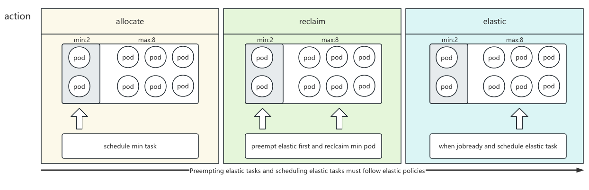

# Elastic scheduling based on AI scenarios

[@hansongChina](hhttps://github.com/hansongChina)

## Motivation

The elastic resources provided by capacity/reclaim, users cannot determine whether their tasks will be reclaimed, and it does not support reclaiming resources on a job basis. 
In the usage scenario of AI training, user groups can specify a [min, max] task mode when resources are fixed, min ensures that the resources are guaranteed. 
When the cluster has idle resources, this training task can expand or shrink according to the specified scaling mode [exponent of 2, specified multiple].
Of course, if the elastic cooling time is met, the cluster will schedule expansion when there are idle resources. When other tasks need resource scheduling, they will preempt the elastic task resources to meet the scheduling. This improves cluster utilization and makes task reclaim controllable.
## In Scope

- Allow users to set job as an elastic job, and specify the elastic strategy and scaling cooldown time for the task.

- Allow administrators to enable reclaim mode or elastic mode.

- Reclaim support resource preemption and reclaim at the job level.

- Add elastic action to schedule and manage elastic job scheduling.

- vcjob controller creates pod with labels to distinguish between normal and elastic jobs.

## Out of Scope

- Hierarchical elastic resource management

## Proposal

The scheduling mode of elastic tasks supports the capacity plugin, but does not support proportion. Based on the AI elastic scenario, scheduling can be used together with reclaim mode, meaning normal tasks with min may also be reclaimed.

Additionally, the capacity plugin supports configuration to enable the elastic mode. In this mode, normal tasks will not exceed `Deserved`, and there is a guarantee for min normal tasks. When resources are insufficient, only elastic resources will be preempted.

To meet the user-specified policies for elastic pod scheduling, a new elastic action is added. This action is executed last in the action configuration. Normal tasks are still handled by the allocate action.

In the reclaim action's preemption logic, a scoring and sorting mechanism based on job dimensions is added. Preemption will first prioritize elastic tasks. After enabling reclaim mode, normal tasks will be reclaimed.

If the preempted tasks cannot meet the scheduling requirements for all tasks to be killed, preemption and reclaim will not be performed, to prevent elastic resources from being killed and still not having any tasks that can be scheduled successfully, 
thus causing resource waste and frequent killing of elastic tasks.

## User Stories

### Story 1

The queue resource of the user group is relatively limited, and they want to use the cluster's idle resources without affecting the normal scheduling of others.

### Story 2

Users often hope to set expansion or reduction of resources in a 2's power mode during AI training, rather than expanding resources whenever they are available.

### Story 3

Users expect to perceive which tasks can be preempted and which tasks can be guaranteed resources to continue training uninterrupted.

## Design detail

###  Elastic task scheduling architecture diagram
<div align="center"></div>


### API design

Adding annotation tags on vcjob is an elastic task

```yaml
  apiVersion: batch.volcano.sh/v1alpha1
  kind: Job
  metadata:
    annotations:
      volcano.sh/cooldown-time: 5s
      # How long can a flexible task be killed
      volcano.sh/elastic-cooldown-time: 10m0s
      # The time interval between each scaling operation.
      volcano.sh/elastic-train: "true"
      # This task is an elastic task.
      volcano.sh/elastic-train-power-of-two: "true"
      # Elastic strategy, is it a power of 2
      volcano.sh/elastic-train-factor: "2"
      # Elastic strategy, with the expansion capacity specified as a multiple of the value given by elastic-train-factor. 1 means expanding when there are resources available.
```

### Main process

KKey function needed to add:

- Action Update
  - **Allocate:**
    - update `pickUpQueuesAndJobs`function Add to check if this job has a judgment for allocate processing scheduling
    - update `allocateResources` function Add task.ElasticTrain judgment, if it is an elastic task scheduling, then hand it over to elasitc's action to handle
  - **Reclaim:**
    - add Add elastic task preemption logic, score and preempt based on job dimension, and the number of preempted tasks should meet the scaling down strategy
    - update The original reclaim logic has been enhanced to include scoring and preemption based on job dimension, supporting gang preemption.
- New Action elastic
  - Support scheduling of elastic tasks.
  - Elastic task scheduling follows the scaling strategy.

- Plugin capacity update
  - **arg**
    - Add capacity.reclaim.mode:reclaim/elastic reclaim mode parameter
      - reclaim mode is consistent with the existing elastic scenarios. And it supports elastic mode.
      - Elastic mode only supports preemption of elastic tasks. Normal tasks will not exceed the queue's `Deserved` value, so they will not be reclaimed.
  - **AddAllocatableFn:**
    - Increase resource judgment for elastic tasks
    - Elastic tasks are limited by the queue's `capacity`. To use all available cluster resources, do not set a capacity.

### Notes
Elastic action is executed at the end of configuration, can configure `capacity` as elastic mode, for preempted tasks display controllable,
Also can configure reclaim mode, which meets the elastic task preemption and normal task exceeding `Deserved` recovery mechanism.