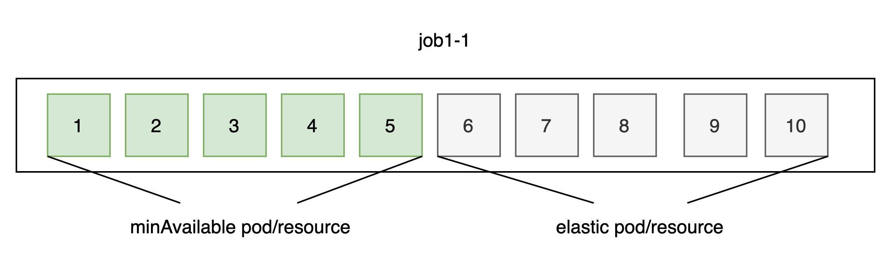
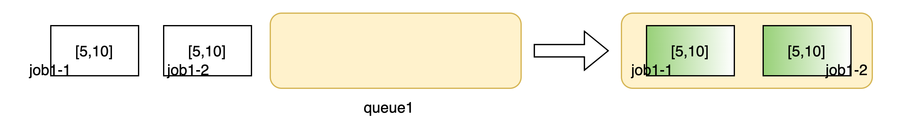
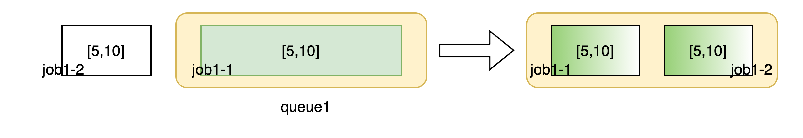
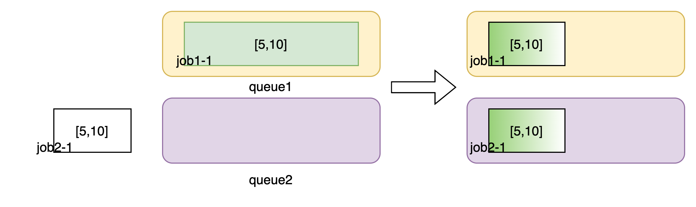

## Introduction

This feature allows Volcano to schedule workloads based on the `[min,max]` config to improve resource utilization rate and shorten the execution time of training job.

For example, K8s cluster has 10 GPUs, and I want to use Volcano to schedule training jobs(tfjob/pytorchjob/vcjob) in two queues: queue1 and queue2

||weight|  reclaimable| deserved GPUs|
|---|---|---|---|
|queue1|  1|   false|    5|
|queue2|  1|   false|    5|



If there is a job1-1 running in queue1, we set pod6 to pod10 as elastic pods/resources which can be preempted when queue1's resource is shortage. The elastic pods have the lowest priority. Specifically,**these pods will be created last and be preempted first**.
1. elastic pods can be created only when there are free resources.
2. elastic pods will be preempted if there are not enough resources for running minAvailable pods.

```yaml
apiVersion: batch.volcano.sh/v1alpha1
kind: Job
metadata:
  name: job1-1
spec:
  minAvailable: 5     #min
  queue: queue1
  tasks:
    - replicas: 10    #max
      name: job1-1
      template:
        metadata:
          name: job1-1
        spec:
          containers:
            - image: train_script
              name: xx
              resources:
                limits:
                  cpu: 1
                  nvidia.com/gpu: 1
```

In detail, there are some principles for elastic schedule
1. if job1-1 and job1-2 are submited at the same time, `job1.minAvailable` pods and `job2.minAvailable` pods will be created first. And then `job1/job2.elastic` pods will be created if there are extra resource.
   
2. if submit job1-1 and then submit job1-2 in queue1, elastic pods in job1-1 will be preempted
   
3. if submit job1-1 and then submit job2-1 in queue2, elastic pods in job1-1 will be preempted
   

## Design

1. Enqueue action
- Modify the logic of job enqueue process. For elastic pods can be preempted at any time, elastic resources are free resources in a queue. So we will fix `jobEnqueueableFns` in `overcommit` and `proportion` plugin. it should be noticed that if total elastic resources can not meet new-job's minRequest and the new-job should also be pending.
  

2. Allocate action(already implemented)
- All pods will be created initially(by controller/operator), but minAvailable pods will be scheduled first and then schedule elastic pods if there are free resources.

3. Preempt action in queue scope
- Preempt elastic pods if there are starving job in the same queue(already implemented).
- It is not necessary to preempt elastic pods if total elastic resources can not meet the starving job's minRequest.

4. Reclaim action in cluster scope
- If a queue is overused, reclaim its elastic resources whether this queue's `reclaimable` filed is true or false.
