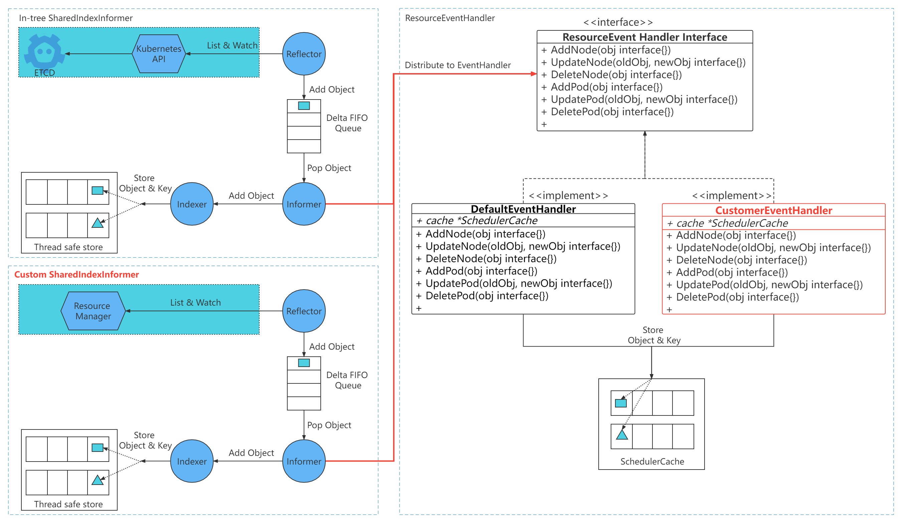

EventHandler Framework

[@sivanzcw](https://github.com/sivanzcw); Dec 1, 2021

## Table of Contents

## Summary

As a monolithic scheduler, the volcano use a single, centralized scheduling algorithm for all jobs. It schedules 
jobs based on resources managed by kubernetes. When there is a need for scheduling for resources managed outsider
of kubernetes, there is no mechanism to do it today.

The proposal is to make volcano extensible by adding the capability to replace the resource manager to help achieve this 
functionality.

## Motivation

There are two ways to add new scheduling rules to volcano:
- Update existing or add new scheduler plugins and recompiling, whether to use the plugin is determined by the 
configuration file
- Secondary development based on the volcano, implementing a new scheduler framework that encapsulate the volcano

This document describes the second approach. If you want to expand the ability of volcano add new policies and 
specialized implementations, and have certain R & D capabilities, then this approach is likely the better choice.

The rise of secure containers makes it possible to deploy both containerized applications and virtual machine applications 
on physical machines. In the scene of a hybrid deployment of containerized applications and virtual machine applications, 
scheduling jobs based on resources managed by kubernetes alone will lead to resource conflicts. In such scenario, the 
organizations will want to run multiple frameworks in the same cluster and a central resource manager above frameworks 
is needed to coordinate and allocate resources uniformly. This two-level scheduling approach is used by a number of systems.

In two-level scheduler, like `Mesos`, a centralized resource allocator dynamically partitions a cluster, allocating 
resources to different scheduler frameworks. Resources distributed to the frameworks contain only `avaliable` resources, 
ones that are currently unused. Because only one framework is examining a resource at a time, resource conflicts is avoided.

To access volcano as one framework to a two-level scheduler, the volcano needs to provide access for external modifications 
to its cached resource objects.

## Goals

- volcano provides an entrance for external modification of its cached resource objects

## Design Details

 

### In-tree SharedIndexInformer

As the native implementation of kubernetes, the In-tree SharedIndexInformer provides eventually consistent linkage of 
volcano to the authoritative state of a given collection of objects from kubernetes cluster. It watches specified 
resources and causes all changes to be reflected in the given store, also trigger event handler to handle the object.

### Custom SharedIndexInformer

The Custom SharedIndexInformer provides eventually consistent linkage of volcano to the authoritative state of a given 
collection of objects from non-kubernetes cluster. Different from the original sharedIndexInformer, custom 
sharedIndexInformer does not get resource objects from kubernetes cluster, but an external resource manager service. 
The Custom sharedIndexInformer uses the same local data caching and event distribution mechanism as the native informer.

### Resource EventHandler Framework

Both the native and the custom informers use the same resource event handler framework. The framework provides a set of 
event handler interfaces, including the processing of `ADD`, `MODIFIED`, `DELETED` events of objects involved. Volcano 
provides a default event handling suite. The developers can customize the event handling processing to replace the 
default implementation. 

### Custom SharedIndexInformer implementation

Add a customInformers array to the `SchedulerCache` struct as the entry to the custom SharedIndexInformer implementation.

```go
// SchedulerCache cache for the kube batch
type SchedulerCache struct {
   ......
   CustomInformers     []cache.SharedIndexInformer
   ......
}
```

Start the custom informer when `SchedulerCache` starts

```go
// Run  starts the schedulerCache
func (sc *SchedulerCache) Run(stopCh <-chan struct{}) {
   go sc.podInformer.Informer().Run(stopCh)
   ......
   for _, i := range sc.CustomInformers {
      go i.Run(stopCh)
   }
   ......
}
```

Wait the custom informer to synced before the starting of scheduling loop

```go
// WaitForCacheSync sync the cache with the api server
func (sc *SchedulerCache) WaitForCacheSync(stopCh <-chan struct{}) bool {
   return cache.WaitForCacheSync(stopCh,
      func() []cache.InformerSynced {
         informerSynced := []cache.InformerSynced{
            sc.podInformer.Informer().HasSynced,
            ......
         }
         ......
      }()...,
   ) && func() bool {
         for _, i := range sc.CustomInformers {
            if !i.HasSynced() {
               return false
            }
         }
         
         return true
   }
}
```

### EventHandler Factory

- define an interface, including object event processing function set
- provide a factory to realize the object event processing function
- provide a factory registration mechanism

```go
// Interface containers all involved object event processing interfaces.
type Interface interface {
   AddPod(obj interface{})
   // other object event processing interfaces.
}

type Factory func(cache *SchedulerCache, config io.Reader, restConfig *rest.Config) (Interface, error)

var eventHandlers = make(map[string]Factory)
var eventHandlerMutex sync.Mutex

func RegisterEventHandler(name string, eventHandler Factory) {
   eventHandlerMutex.Lock()
   defer eventHandlerMutex.Unlock()
   if _, found := eventHandlers[name]; found {
      klog.Fatalf("EventHandler %q was registered twice.", name)
   }
   klog.V(1).Infof("Registered eventHandler %q.", name)
   eventHandlers[name] = eventHandler
}

func GetEventHandler(name, configFilePath string, cache *SchedulerCache, restConfig *rest.Config) (Interface, error) {
   eventHandlerMutex.Lock()
   defer eventHandlerMutex.Unlock()
   f, found := eventHandlers[name]
   if !found {
      return nil, nil
   }
   
   var config *os.File
   if len(configFilePath) != 0 {
      config, err = os.Open(configFilePath) 
   }
   return f(cache, config, restConfig), nil
}
```

#### Implement the default eventHandler

```go
type defaultEventHandler struct{
   cache *SchedulerCache
}

func init() {
   RegisterEventHandler("default", func(cache *SchedulerCache, config io.Reader, restConfig *rest.Config) (i Interface, err error) {
      return &defaultEventHandler{cache:cache}, nil
   })
}

func (eh *defaultEventHandler) AddPod(obj interface{}) {
   pod, ok := obj.(*v1.Pod)
   if !ok {
      klog.Errorf("Cannot convert to *v1.Pod: %v", obj)
      return
   }

   sc := eh.cache

   sc.Mutex.Lock()
   defer sc.Mutex.Unlock()

   err := sc.addPod(pod)
   if err != nil {
      klog.Errorf("Failed to add pod <%s/%s> into cache: %v",
         pod.Namespace, pod.Name, err)
      return
   }
   klog.V(3).Infof("Added pod <%s/%v> into cache.", pod.Namespace, pod.Name)
}
```

#### Dynamically obtain eventHandler processing object

- Add `--event-handler` command to declare the eventHandler processing object
- Add `--config-path` command to declare the configuration path of eventHandler

```go
eventHadler := GetEventHandler(eventHandlerName, configFilePath, sc, config)
sc.nodeInformer.Informer().AddEventHandlerWithResyncPeriod(
   cache.FilteringResourceEventHandler{
      FilterFunc: func(obj interface{}) bool {
         switch v := obj.(type) {
         case *v1.Node:
            return responsibleForNode(v.Name, mySchedulerPodName, c)
         default:
            return false
         }
      },
      Handler: cache.ResourceEventHandlerFuncs{
         AddFunc:    eventHadler.AddNode,
         UpdateFunc: eventHadler.UpdateNode,
         DeleteFunc: eventHadler.DeleteNode,
      },
   },
   0,
)
```