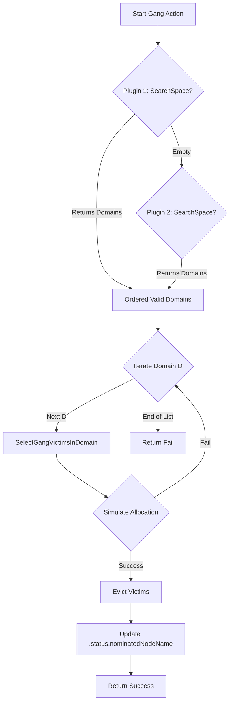
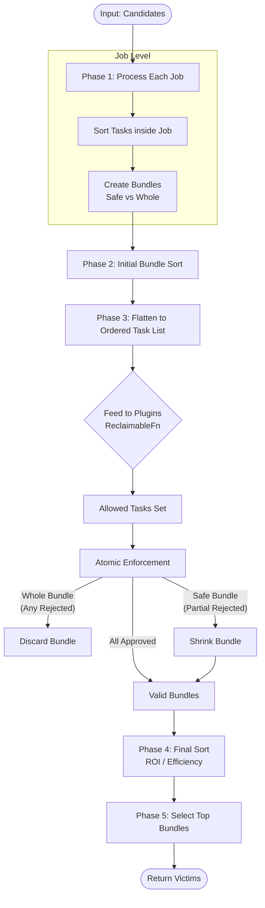

# Gang-Aware Preemption & Reclaim Design Document

[@vzhou-p](https://github.com/vzhou-p); Dec 3, 2025

## 1. Problem Statement

### 1.1 Current Limitation
The Volcano scheduler's existing actions (`allocate`, `preempt`, `reclaim`) suffer from architectural coupling and "Task-Centric" decision making.

1.  **Gang Blindness (Preempt/Reclaim)**: 
    - Victims are selected greedily (Task-by-Task).
    - Evicting 1 task from 5 different gangs might be chosen over evicting 1 whole gang, causing 5 cascading failures instead of 1.
    - Global cost (total resources of the broken gang) is ignored.

2.  **Topology Coupling (Allocate)**:
    - The `allocate` action contains **hardcoded logic** for "HyperNode Tiers" and "LCA Checks".
    - This violates the plugin architecture; `allocate.go` should not know about network topology details.
    - This makes it impossible to reuse the topology logic in `preempt` or `reclaim` without duplicating code.

3.  **Topology Blindness (Preempt/Reclaim)**:
    - Because the topology logic is trapped in `allocate.go`, the `preempt` and `reclaim` actions simply ignore it.
    - They might evict tasks on nodes that are technically valid for the pod but invalid for the Job's Hard Topology constraints.

### 1.2 Optimization Goal
1.  **Decouple Topology Logic**: Move strict topology constraints out of `allocate.go` and into the plugin layer.
2.  **Gang-Aware Eviction**: Implement a "Holistic" victim selection strategy that considers the Gang as the atomic unit of eviction.
3.  **Unified Search Constraint**: Create a mechanism where `allocate`, `preempt`, and `reclaim` all respect the same set of hard constraints via a composable search space reduction.

---

## 2. Architectural Change: The Gang-Level Pipeline

To resolve these issues, we introduce two new extension points that allow plugins to control the "Where", and "Who" of Gang Scheduling.

### 2.1 New Plugin Extension Points

```go
// pkg/scheduler/api/interface.go

// 1. The "Where" (Constraint)
// GangSearchSpaceFn returns a list of "Feasible Domains"
// The Gang must be scheduled entirely within ONE of these sets.
// IMPORTANT: Domains must be returned in preference order (Best to Worst).
// - Purpose: Allows the plugin to optimize sorting/pruning for the specific action.
//   - Allocate: Plugin should return ALL valid domains (or a wide set). The 'allocate' action
//     will simulate ALL of them, accumulate scores, and pick the global best.
//   - Preempt/Reclaim: Plugin MUST return a TRUNCATED list (Top-K) sorted by feasibility.
//     The action will greedily try them in order and stop at the first success to avoid
//     performance explosion (exhaustively simulating preemption on all domains is too expensive).
type GangSearchSpaceFn func(job *JobInfo, clusterSnapshot *ClusterSnapshot, purpose SearchPurpose) ([][]*NodeInfo, error)

type SearchPurpose int
const (
    PurposeAllocate SearchPurpose = iota
    PurposeEvict
)

// 2. The "Who" (Policy)
// GangVictimSelectorFn selects specific victim gangs to satisfy a resource requirement.
// Returns: A map with JobID as key and a list of taskIDs as value
// Used to override default "Least Global Waste" logic.
type GangVictimSelectorFn func(preemptor *JobInfo, neededResources *Resource, candidates []*JobInfo) (map[JobId][]TaskID, error)
```

> **Note**: The purpose parameter of GangSearchSpaceFn decides different results for different actions.
>    *   **Allocate**: Plugin returns **ALL** feasible domains. The `allocate` action performs an exhaustive simulation + scoring to find the optimal placement.
>    *   **Evict**: Plugin returns **Top-K** domains sorted by feasibility (Cost to Enter). The `reclaim`/`preempt` action uses a greedy "First Fit" approach to minimize scheduler latency.

### 2.2 Execution Pipeline (Composable Search)

The Session executes a 2-stage pipeline for Gang operations:

#### Phase 1: Search Space Reduction (GangSearchSpace)
*   Call `GangSearchSpaceFn(job)` on plugins ordered by Priority (Config order).
*   **Logic (Primary Driver)**: The **First Plugin** that returns a non-empty result defines the Search Space. Subsequent plugins are ignored for domain generation.
*   **Reasoning**: This "Winner-Takes-All" approach avoids complex intersection logic and ordering conflicts. The highest-priority plugin (e.g., `network-topology-aware`) drives the structural constraint.
*   **Result**: A list of `OrderedValidDomains` (`[][]*NodeInfo`).

#### Phase 2: Assignment or Eviction

The execution logic diverges based on the action type:

*   **Allocate Action (Exhaustive Search)**:
    *   Iterate through **ALL** `OrderedValidDomains`.
    *   Simulate allocation on each domain to calculate a score.
    *   Select the **Global Best** domain, Commit, and Return.
*   **Preempt/Reclaim Action (Greedy First-Fit)**:
    *   Iterate through `OrderedValidDomains` (D1, D2, ...) in the returned order.
    *   **Try D1**: Search victims in D1. If valid victims found & simulation passes, **Evict & Return Immediately**.
    *   If D1 fails, try D2.



---

## 3. Proposed Solution: Enhanced Preempt & Reclaim Actions

Instead of creating new actions (`gang-preempt`, `gang-reclaim`), we will enhance the existing `preempt` and `reclaim` actions to support Gang-Aware logic via configuration flags. This ensures backward compatibility and simplifies user configuration.

### 3.1 Configuration

Both actions will support a new argument: `gangAwareEnable`.

```yaml
actions: "allocate, backfill, preempt, reclaim"
tiers:
  - plugins:
    - name: gang
    - name: priority
    - name: drf
    - name: predicates
    - name: nodeorder
    - name: binpack
    arguments:
      preempt.gangAwareEnable: true
      reclaim.gangAwareEnable: true
```

### 3.2 Logic Flow (Branching)

The `Execute` method in both actions will detect the flag and branch into the Gang-Aware pipeline if enabled.

The gang-aware logic is a completely independent execution path. If `gangAwareEnable` is true, the action does **NOT** execute any of the legacy task-centric logic (e.g. `nornalPreempt` or `normalReclaim`). It calls `executeGangPath` and returns immediately. This prevents any interference or complexity from mixing the two models.

```go
func (a *Action) Execute(ssn *framework.Session) {
    // 1. Check Configuration
    if a.gangAwareEnable {
        // 2. Branch to Unified Gang-Aware Pipeline
        // This function handles the entire lifecycle (Search -> Select -> Evict -> Nominate)
        // independently from the legacy code below.
        a.executeGangPath(ssn)
        return
    }
    
    // 3. Fallback to Legacy (Task-Centric) Logic
    // ... existing logic ...
}
```

### 3.3 Gang-Aware Eviction Alogorithm (Shared by reclaim and preempt)


1.  **Identify Need**: Preemptor Job P needs resources.
2.  **Determine Search Space**:
    - Call `ssn.GetGangValidDomains(P)` (Phase 1 above).
    - We receive `[PreferredDomain, SecondaryDomain, ...]`.
3.  **Process Domains (Greedy)**:
    - **For each Domain** (set of nodes):
        - **Select Victims (Domain-Wide)**: Call `SelectGangVictimsInDomain(Preemptor, Domain)`.
            - This differs from legacy preemption by considering the *entire footprint* of victim gangs within the domain, rather than iterating node-by-node for each task of the gang.
        - **Simulate & Execute**:
            - Run the **Task-to-Node Nomination** logic (see Section 3.3.2) on the domain assuming victims are evicted.
            - **If Simulation Succeeds**:
                - **Evict**: Evict the selected victims.
                - **Nominate**: Apply the results of the simulation (update `.status.nominatedNodeName`).
                - **Return Success**.
            - **If Simulation Fails**:
                - Continue to next domain.

#### 3.3.1 Why NominatedNodeName is Critical (Gang vs. Task)
Unlike the legacy `reclaim` action, `gang-reclaim` **MUST** set the `.status.nominatedNodeName` (via `Pipeline`).

*   **The Risk**: If we only evict victims without reserving the nodes, the resources become "Free" in the next scheduling cycle. A smaller job (or a higher-priority single-task job) could "steal" one of the freed nodes.
*   **The Gang Consequence**: For a single task, losing a node is an inconvenience. For a Gang requiring 5 specific nodes (topology domain), losing **one** node means the **entire Gang fails** to start. The eviction of the other 4 nodes becomes "wasted waste." By setting `nominatedNodeName`, the `allocate` action in the next cycle will prioritize these specific nodes for the Gang's tasks, guaranteeing the "Domain" remains intact.

### 3.3.2 Task-to-Node Nomination Strategy
A critical challenge in `gang-reclaim` is determining **which task** in the gang should be nominated to **which node** in the cleared domain.

**Strategy: Reuse Allocate Logic (Dry-Run)**

Instead of inventing a new matching algorithm, we reuse the existing `allocate` action logic to determine the best placement. This ensures consistency between the *Nomination* (in `gang-reclaim`) and the eventual *Binding* (in `allocate`).

1.  **Snapshot & Filter**:
    *   Create a temporary `Session` snapshot.
    *   Restrict the available nodes to **only** the nodes in the Cleared Domain

2.  **Simulate Allocation**:
    *   Call the standard `allocate.allocateResourcesForTasks()` function.
    *   This function already handles:
        *   Iterating tasks.
        *   Running Predicates (Fit Check).
        *   Running Priorities (Scoring).
        *   Topology constraints are already respected by `GangSearchSpaceFn`

3.  **Apply Nomination**:
    *   The simulation returns a `Statement` containing `Allocate` operations.
    *   Convert these `Allocate` operations into `Pipeline` operations.
    *   Execute `stmt.Pipeline(Task, Node)` to update the `.status.nominatedNodeName`.

> **Note**: While the standard `reclaim` action in Volcano does *not* use nomination, the `preempt` action *does*. For `gang-reclaim`, we align with the `preempt` pattern because locking the specific topology domain is essential for the Gang's atomicity. A Gang cannot rely on general queue priority to secure a specific set of nodes.

### 3.4 Victim Selection (Bundles)

When selecting victims within a Domain, we categorize the "footprint" of each candidate gang into "Bundles":

1.  **Safe Bundle**:
    - **Surplus**: Tasks above `MinAvailable` (Ready > Min).
    - **Broken**: Tasks from a gang that is *already* broken (Ready < Min) or *will be* broken in this cycle.
    - **Cost**: Zero (Free to evict).

2.  **Whole Bundle**:
    - **Core**: Tasks required to maintain `MinAvailable`.
    - **Cost**: High (Requires restarting the whole gang).
    
**Sorting Logic (The "Sound" Strategy)**:
We sort bundles to minimize disruption:
1.  **Gang State**: Always take **Safe/Broken** bundles first (Priority 0).
2.  **Queue Policy**: Respect `VictimQueueOrderFn` (e.g., reclaim from over-quota queues).
3.  **Global Efficiency** (For Whole Bundles):
    - `Efficiency = (Resources Freed in Domain) / (Total Global Resources of Gang)`
    - Break gangs that are primarily located *inside* the target domain. Avoid destroying a large distributed job to free a small local resource.
4.  **Job Priority**: Respect `JobOrderFn` (Priority, DRF, etc.).

#### Example 1: Safe vs Whole Bundles (Standard Gang)

Consider a Gang **Job-A**:
*   **Replicas**: 5
*   **MinAvailable**: 3
*   **Current Running**: 5 (Full Health)

If we need to reclaim resources from **Job-A**, we split it into two bundles:

1.  **Safe Bundle**:
    *   **Contains**: 2 Tasks (Task4, Task5)
    *   **Logic**: `Running (5) - MinAvailable (3) = 2 Surplus`
    *   **Impact**: Evicting these tasks does **NOT** break the gang. Job-A continues running with 3 tasks.
    *   **Cost**: Low (Preemption allowed).

2.  **Whole Bundle**:
    *   **Contains**: 3 Tasks (Task1, Task2, Task3)
    *   **Logic**: These are the core tasks required for the gang to function.
    *   **Impact**: Evicting *any one* of these tasks forces the **entire gang** to restart.
    *   **Cost**: High (Avoid unless necessary).

#### Example 2: Safe vs Whole Bundles (With Roles)

Consider a Gang **Job-B**
*   **Roles**:
    *   `driver`: 1 Replicas, Min 1.
    *   `worker`: 4 Replicas, Min 3.
*   **Global MinAvailable**: 4
*   **Current Running**: 5 (1 driver, 4 workers) - Full Health.

We analyze the surplus for each role to split bundles:

1.  **Safe Bundle**:
    *   **Contains**: 1 Task (`worker-3`)
    *   **Logic**:
        *   `driver`: 1 Running - 1 Min = 0 Surplus.
        *   `worker`: 4 Running - 3 Min = 1 Surplus.
    *   **Impact**: Evicting `worker-3` leaves the job with 1 driver + 3 workers (Total 4), which satisfies `MinAvailable`.
    *   **Cost**: Low.

2.  **Whole Bundle**:
    *   **Contains**: 4 Tasks (`driver-0`, `worker-0`, `worker-1`, `worker-2`)
    *   **Logic**:
        *   `driver-0`: Critical (Count drops to 0 < 1).
        *   `worker-{0,1,2}`: Core (Count drops to 2 < 3).
    *   **Impact**: Evicting *any* of these violates the job's strict constraints, forcing a full restart.
    *   **Cost**: High.


### 3.4.1 Victim Selection Algorithm Pseudo-Code



```python
# ALGORITHM: SelectGangVictimsInDomain

# INPUT:
# - Preemptor: The job needing resources
# - Domain: The specific set of nodes we are clearing
# - Candidates: Jobs with tasks on these nodes
# - Session: Scheduler session (plugins)

Bundles = List()

# --- PHASE 1: Split & Bundle ---
# Try to split tasks of each job to 2 bundles. One is Safe, and the other is Core.
FOR EACH Job IN Candidates:
    # 1. Identify tasks IN THE DOMAIN
    LocalTasks = Job.Tasks.Where(task => Domain.Contains(task.Node))
    IF LocalTasks Is Empty: CONTINUE

    # 2. Sort LocalTasks (Evict low priority tasks within job first)
    # We define a custom 'VictimOrder' for Gang Preemption
    # Priority 1: Coverage (Maximize Utility)
    #   - Score = Min(Task.Res, Needed) / Needed
    #   - We prefer tasks that satisfy a larger chunk of the requirement.
    # Priority 2: Task Priority (Lowest First)
    # Priority 3: Least Waste (Best Fit)
    #   - If Coverage is equal (e.g., both tasks > needed), prefer the smaller task.
    #   - Break ties between a 4-core victim and 64-core victim (pick 4-core).
    # Priority 4: Creation Time (Youngest First)
    LocalTasks.Sort(CustomGangVictimComparator)

    # 3. Calculate Surplus Budgets (Global & Role-Aware)
    # Job might be "Broken" if it's already failing/starting
    Ready = Job.ReadyTasks
    GlobalMin = Job.MinAvailable
    GlobalSurplus = Ready - GlobalMin

    # Handle Elastic Jobs (MinAvailable < Sum(RoleMin))
    # If job is elastic, we ignore specific role constraints for safety checks.
    EnforceRoles = (GlobalMin >= Job.TaskMinAvailableTotal)

    RoleSurplus = Map()
    IF EnforceRoles:
        FOR Role IN Job.Roles:
             RoleSurplus[Role] = Job.RoleReady(Role) - Job.RoleMinAvailable(Role)

    # 4. Create Bundles
    IF GlobalSurplus < 0:
        # CASE A: Already Broken (Cheapest)
        # Treat as SAFE. Global Cost = 0.
        Bundles.Add(NewBundle(Type: SAFE, Tasks: LocalTasks, Job: Job))

    ELSE:
        # CASE B: Healthy
        # Identify SAFE tasks (must satisfy BOTH Global AND Role constraints)
        SafeTasks = List()
        CoreTasks = List()

        FOR task IN LocalTasks:
            Role = task.Role
            
            # Check if evicting this task violates either Global or Role constraints
            IsRoleSafe = !EnforceRoles OR (RoleSurplus[Role] > 0)

            IF GlobalSurplus > 0 AND IsRoleSafe:
                SafeTasks.Add(task)
                GlobalSurplus--      # Decrement available budget
                IF EnforceRoles: RoleSurplus[Role]--  # Decrement role budget
            ELSE:
                CoreTasks.Add(task)

        IF SafeTasks Is Not Empty:
            Bundles.Add(NewBundle(Type: SAFE, Tasks: SafeTasks, Job: Job))

        IF CoreTasks Is Not Empty:
            Bundles.Add(NewBundle(Type: WHOLE, Tasks: CoreTasks, Job: Job))


# --- PHASE 2: Initial Sort (Fed to plugins) ---
# Goal: Present "Cheapest" and "Most Fair" victims to the stateful plugins first.
# This ensures that limited quotas (e.g. Queue Deserved) are consumed by the preferred victims.
Sort Bundles using Comparator(Bundle A, Bundle B):

    # 1. GANG STATE (Absolute Rule)
    # Safe/Broken bundles are "Free". Whole bundles are "Expensive".
    IF A.Type != B.Type:
        RETURN A.Type < B.Type # Safe (0) < Whole (1)

    # 2. QUEUE HIERARCHY (Plugin: VictimQueueOrderFn)
    # e.g., Reclaim from over-quota queues first.
    Result = Session.VictimQueueOrderFn(A.Job.Queue, B.Job.Queue, Preemptor.Queue)
    IF Result != EQUAL:
        RETURN Result

    # 3. GLOBAL EFFICIENCY (Topology Rule - Only for WHOLE bundles)
    # If both are expensive, pick the one with lower Global Cost per Local Gain.
    # We use a weighted ROI (Return on Investment) metric.
    # ROI = LocalGainScore / GlobalCostScore
    
    ROI_A = CalculateROI(A, Preemptor.Request, Cluster.Capacity)
    ROI_B = CalculateROI(B, Preemptor.Request, Cluster.Capacity)
    
    # Threshold check prevents overriding User Priority for negligible efficiency gains.
    # Recommended Value: 0.05 (5% difference required to ignore priority)
    IF Abs(ROI_A - ROI_B) > Threshold:
        RETURN ROI_A > ROI_B

    # 4. JOB PRIORITY / POLICIES (Plugin: JobOrderFn)
    # Standard plugin logic (Priority, DRF, etc.)
    Result = Session.JobOrderFn(A.Job, B.Job)
    IF Result != EQUAL:
        RETURN Result

    # 5. TIE-BREAKER
    RETURN A.Job.CreationTime < B.Job.CreationTime


# --- PHASE 3: Global Plugin Validation (Stateful Check) ---
# CRITICAL: We must validate ALL sorted candidates in one batch.
# Plugins like 'capacity' track cumulative queue usage (allocations) during the check.
# If we checked job-by-job, the plugin would reset its state, causing "Double Counting" 
# where multiple jobs from the same queue are all approved for eviction, 
# violating the queue's minimum 'Deserved' guarantee.

# 1. Flatten Sorted Bundles to Ordered Task List
OrderedCandidates = Bundles.SelectMany(b => b.Tasks)

# 2. Call ReclaimableFn ONCE
# The plugin will approve tasks in order until constraints (like Queue Deserved) are met.
# It acts as a "Cut-Off" filter on our priority list.
AllowedTasksSet = Session.Reclaimable(Preemptor.AnyTask, OrderedCandidates).ToSet()

# 3. Prune & Shrink Bundles
ValidBundles = List()
FOR EACH Bundle IN Bundles:
    IF Bundle.Tasks.All(t => AllowedTasksSet.Contains(t)):
        # All tasks in bundle are reclaimable -> Keep Bundle
        ValidBundles.Add(Bundle)
    ELSE IF Bundle.Type == SAFE:
        # For SAFE (surplus) bundles, partial eviction is allowed.
        # We take whatever the plugin allows.
        AllowedPart = Bundle.Tasks.Where(t => AllowedTasksSet.Contains(t))
        IF AllowedPart Is Not Empty:
            Bundle.Tasks = AllowedPart
            ValidBundles.Add(Bundle)
    # ELSE: Reject WHOLE bundle if any part is rejected by plugin.


# --- PHASE 4: Final Sort (Selection Optimization) ---
# Goal: Re-rank valid bundles based on final resource values.
# Since "Safe" bundles may have shrunk in Phase 3, their ROI/Coverage metrics changed.
Sort ValidBundles using Comparator(Bundle A, Bundle B):
    # Repeat the same sorting in Phase 2

# --- PHASE 5: Selection ---
Victims = List()
ResourcesFreed = 0

FOR EACH Bundle IN ValidBundles:
    # Logic note: Because "Safe" bundles always sort before "Whole" bundles 
    # for the same job, we don't need complex state tracking here.
    
    Victims.Add(Bundle.Tasks)
    ResourcesFreed += Bundle.LocalResources

    IF ResourcesFreed >= NeededResources:
        BREAK

RETURN Victims
```

#### 3.4.2 Plugin Compatibility (Adapter Layer)
To support existing plugins (which operate on `TaskInfo`), the new gang-aware logic should perform the following steps:
1.  **Flattening**: When calling `ReclaimableFn` or `PreemptableFn`, the framework presents the constituent tasks of a Bundle.
2.  **Atomic Enforcement**: 
    -   If a plugin rejects *any* task in a **Whole Bundle**, the framework rejects the **entire bundle**.
    -   If a plugin rejects tasks in a **Safe Bundle**, the framework accepts the partial result (evicting only the approved tasks).
This ensures legacy plugins control *policy* (quotas, priorities) while the framework enforces *mechanism* (gang integrity).

### 3.4.3 Bundle Scoring (ROI)

To handle heterogeneous resources (CPU, Memory, GPU), we define **Local Gain** and **Global Cost** using a weighted normalization strategy.

1.  **Local Gain Score** (Preemptor-Centric):
    *   Measures utility to the preemptor.
    *   Normalize `Bundle.LocalResources` against `Preemptor.NeededResources`.
    *   *Formula*: `Sum(Min(Local[i], Needed[i]) / Needed[i])` for each resource dimension `i` where `Needed[i] > 0`.
    *   *Why*: If preemptor needs GPU, a victim freeing CPU has 0 utility.

2.  **Global Cost Score** (Preemptor-Centric):
    *   Measures total disruption relative to the need.
    *   Normalize `Bundle.GlobalResources` against `Preemptor.NeededResources`.
    *   *Formula*: `Sum(Global[i] / Needed[i])` for each resource dimension `i` where `Needed[i] > 0`.
    *   *Why*: We calculate the "Opportunity Cost" strictly in terms of the resources we are trying to obtain. If I need CPU, the "cost" of a victim is defined by how many CPUs I am destroying globally. This ensures apples-to-apples comparison between Local Gain and Global Cost.

3.  **Efficiency (ROI)**:
    *   `Efficiency = LocalGainScore / GlobalCostScore`
    *   We prioritize victims that solve the local bottleneck with the least global cluster disruption.

4.  **Unrequested resource**
    * Skip unrequested resources in the score calculation. For example, if the preemptor doesn't need GPU, but one of the victim has GPU. The score of the GPU won't be counted.
    * Consider adding some penalty to the efficiency if a victim of unrequested resource is evicted.

#### Example 1: Local vs Global Footprint (The "Distributed Job" Case)

**Preemptor needs: `2 GPU`**

| Victim | Local Resources | Global Resources | Local Score | Global Score | Efficiency | Winner |
| :--- | :--- | :--- | :--- | :--- | :--- | :--- |
| **A** | 2 GPU | 4 GPU | `Min(2,2)/2` = **1.0** | `4/2` = **2.0** | `1.0/2.0` = **0.5** | No |
| **B** | 2 GPU | 2 GPU | `Min(2,2)/2` = **1.0** | `2/2` = **1.0** | `1.0/1.0` = **1.0** | **Yes** |

#### Example 2: Partial Fit (Incremental Eviction)

**Preemptor needs: `10 CPU`**

| Victim | Local Resources | Global Resources | Local Score | Global Score | Efficiency | Winner |
| :--- | :--- | :--- | :--- | :--- | :--- | :--- |
| **C** | 10 CPU | 20 CPU | `Min(10,10)/10` = **1.0** | `20/10` = **2.0** | `1.0/2.0` = **0.5** | No |
| **D** | 2 CPU | 2 CPU | `Min(2,10)/10` = **0.2** | `2/10` = **0.2** | `0.2/0.2` = **1.0** | **Yes** |


#### Example 3: Multi-Resource Saturation

**Preemptor needs: `4 CPU, 16GB Mem`**

| Victim | Local Resources | Global Resources | Local Score | Global Score | Efficiency | Winner |
| :--- | :--- | :--- | :--- | :--- | :--- | :--- |
| **E** | 4 CPU, 4GB | 4 CPU, 4GB | `Min(4,4)/4 + Min(4,16)/16` = **1.25** | `4/4 + 4/16` = **1.25** | `1.25/1.25` = **1.0** | Tie |
| **F** | 2 CPU, 8GB | 2 CPU, 8GB | `Min(2,4)/4 + Min(8,16)/16` = **1.0** | `2/4 + 8/16` = **1.0** | `1.0/1.0` = **1.0** | Tie |

#### Example 4: Resource Mismatch (The "GPU for CPU" Anti-Pattern)

**Preemptor needs: `4 CPU` (No GPU needed)**

| Victim | Local Resources | Global Resources | Local Score | Global Score | Efficiency | Winner |
| :--- | :--- | :--- | :--- | :--- | :--- | :--- |
| **G** | 4 CPU | 4 CPU | `Min(4,4)/4` = **1.0** | `4/4` = **1.0** | `1.0/1.0` = **1.0** | **Yes** |
| **H** | 4 CPU, 1 GPU | 4 CPU, 1 GPU | `Min(4,4)/4` = **1.0** | `4/4 + 1/0(Ignore)` = **1.0** * | `1.0/1.0` = **1.0** | Tie* |


### 3.5 Difference between Preempt and Reclaim Logic

#### 3.5.1 Shared Utility (Mechanism)
Both actions utilize the same underlying mechanisms provided by the `Session` or helper packages:
1.  **Search Space**: `ssn.GetGangValidDomains(job)`
2.  **Bundle Logic**: `util.CreateBundles(candidates)` (Categorizes tasks into Safe/Whole bundles)
3.  **Efficiency Check**: `util.CalculateROI(bundle, needed)`

#### 3.5.2 Preempt (Priority-Driven)
*   **Goal**: Satisfy high-priority jobs by evicting low-priority ones with minimal disruption.
*   **Candidates**: Jobs in the **Same Queue**.
*   **Filter**: Strictly `Preemptor.Priority > Victim.Priority`.
*   **Ordering**:
    1.  **Gang State**: Prefer `Safe` bundles over `Whole` bundles.
    2.  **Job Priority**: Prefer evicting lower priority victims first.
    3.  **Efficiency**: Break ties with ROI (Global Cost).

#### 3.5.3 Reclaim (Fairness-Driven)
*   **Goal**: Recover resources from over-quota queues for under-quota queues.
*   **Candidates**: Jobs in **Other Queues** that are `Overused`.
*   **Filter**: Respect `Queue.Reclaimable()` and `Queue.Overused()`.
*   **Ordering**:
    1.  **Gang State**: Prefer `Safe` bundles over `Whole` bundles.
    2.  **Queue Fairness**: Prefer evicting from queues that are most over-quota (`ssn.VictimQueueOrderFn`).
    3.  **Efficiency**: Break ties with ROI.
    4.  **Job Priority**: Only used as a final tie-breaker.

This separation ensures that Preemption never violates priority for efficiency, while Reclaim always respects queue fairness guarantees.

---

## 4. Long-Term Vision & Migration Strategy

With the new interfaces, we could aims to evolve the Volcano scheduler from a "Task-Centric" model to a "Gang-Native" model.

### 4.1 The North Star: Unified Eviction Pipeline

Currently, Volcano maintains separate code paths for `allocate`, `preempt`, and `reclaim`.
*   **Allocate** understands Topology but is complex and rigid.
*   **Preempt/Reclaim** understand Priority/Fairness but are blind to Topology and Gang atomic units.

The **Unified Pipeline** envisions a single, generalized logic path where:
1.  **Every Job is a Gang**: Standard jobs are treated as "Gangs of Size 1".
2.  **Domain-Scoped Scheduling**: Instead of searching the entire cluster, we allocate and evict resources within specific "Topology Domains" (defined by plugins), ensuring structural constraints are respected at the root of the decision process.
3.  **Every Eviction is a Bundle**: We never evict a "Task"; we evict a "Bundle" (which might be 1 task or 100 tasks).

**Benefits**:
*   **Code Deduplication**: One robust engine for all eviction scenarios.
*   **Consistent Behavior**: Allocations and Evictions respect the domain constraint.

### 4.2 The Challenge: Barriers to Immediate Unification

Migrating to the Unified Pipeline immediately is risky due to:
*   **Performance**: Simulating the eviction of massive gangs (1000+ tasks) in a "Dry Run" loop is significantly more expensive than the current lightweight checks.
*   **Plugin Ecosystem**: The current ecosystem of 20+ plugins expects `TaskInfo`. A full rewrite would break compatibility.
*   **Fairness Guarantees**: The legacy `reclaim` action has highly tuned logic for Queue Fairness that is difficult to replicate perfectly in a generic pipeline without regressions.

### 4.3 Step 1: Retrofitting Legacy Actions (Intermediate Solution)

Instead of a "Big Bang" rewrite, we can **retrofit** the existing legacy actions (`preempt` and `reclaim`) with the new Gang Capabilities. This allows us to fix critical bugs (like Topology Blindness) immediately while keeping the stable core loop.

#### 4.3.1 The "Plugin Injection" Strategy
We inject the new `GangSearchSpace` interface into the legacy control loop to act as a **Smart Filter**.

*   **Before**: The legacy loop iterates over *all* nodes to find victims. It asks: *"Does the victim fit on this node?"*
*   **After**: The legacy loop first asks the new plugin: *"Which nodes are topologically valid for this Gang?"*. It then restricts the victim search *only* to those nodes.

#### 4.3.2 Solving "Split Domains" (The Sticky Domain Fix)
A major flaw in the legacy "Task-by-Task" loop is that different tasks of the same Gang might be scheduled on incompatible domains (e.g., Task A on Rack 1, Task B on Rack 2).

To fix this **without** a rewrite, we introduce **Job-Level State** (`Sticky Domain`):
1.  **Lazy Pinning**: The first task of a job that needs preemption triggers a topology search (`GetGangValidDomains`). The scheduler selects the best domain and **pins** it for the job.
2.  **Strict Enforcement**: All subsequent tasks of that job are forced to search *only* within the pinned domain.
3.  **Fail-Fast Safety**: If a subsequent task cannot find space in the pinned domain, the job **fails** for the current cycle. This prevents the "Split Gang" corruption, prioritizing correctness over partial progress.
4. **Soft Topology Constraint**: For soft topology constraint, we'll keep the current behavior to return all nodes in the cluster for victim searching.
4   **Running Gangs**: If a Gang is already partially running, the plugin detects this and restricts the "Valid Domain" to match the running tasks (e.g., "Must be on Rack 1"). The legacy action naturally obeys this constraint by only looking for victims and trying to allocate in this domain.

#### 4.3.4 Limitations of the Retrofit Approach
While the Retrofit solves the critical "Topology Blindness" issue, it still has some limitations.

1.  **Sub-Optimal Domain Selection (Greedy Commit)**: The "Sticky Domain" logic commits to a domain based on the *first* task processed. If `Rack A` (chosen for Task 1) runs out of capacity later, the entire job fails for this cycle, even if `Rack B` had enough capacity for the whole gang. The legacy loop cannot "look ahead" to see which domain is globally best for the *entire* gang.
2.  **Task-Centric Cost**: The legacy actions still view victims as individual tasks. They cannot calculate the "Global Cost" of breaking a gang (e.g., evicting 1 task might kill a 100-task job). The "Bundle" and "ROI" logic from the Unified Design is **not** applied here.
3.  **No "Nomination" in Reclaim**: Legacy Reclaim does not use `.status.nominatedNodeName`. This means there is still a race condition where a small job might "steal" the resources freed by a Gang Reclaim before the Gang can bind to them. May need to fix this before the implementation of this design.

---

## 5. High-level Implementation Plan

This section outlines the step-by-step plan to implement the Gang-Aware Eviction logic and refactor the legacy actions.

### 5.1 Part 1: Implementation of New Gang-Aware Logic

This phase introduces the new execution path and necessary plugin interfaces.

1.  **Core API & Framework**:
    *   **Interface Definition**: Add `GangSearchSpaceFn` and `GangVictimSelectorFn` to `pkg/scheduler/api/interface.go`.
    *   **Session Support**: Update `Session` struct to manage these new function maps. Add helper method `GetGangValidDomains`.
    *   **Bundle Utilities**: Create `pkg/scheduler/util/gang_utils.go` to implement:
        *   `CreateBundles(candidates)`: Logic to split tasks into Safe/Whole bundles.
        *   `CalculateROI(bundle)`: Logic for scoring bundles.

2.  **Plugin Updates**:
    *   **`network-topology-aware` Plugin**:
        *   Implement `GangSearchSpaceFn`.
        *   **Logic**: Calculate valid HyperNodes based on the job's topology constraints. Return `[][]*NodeInfo` representing valid domains (e.g., nodes in a specific Rack or Switch).
    *   **`gang` Plugin**:
        *   **Relax Constraints**: Update `ReclaimableFn` and `PreemptableFn` logic. Currently, it strictly blocks eviction if `Ready < MinAvailable`. For the new Gang-Aware path (handling "Whole Bundles"), this check needs to be context-aware or bypassed, as the framework intentionally manages gang breakage based on Global Cost.
        *   **Selector**: Add `GangVictimSelectorFn` to implement the viction selection logic.

3.  **Action Updates (New Path)**:
    *   **`preempt` & `reclaim` Actions**:
        *   Add configuration flag parsing for `gangAwareEnable`.
        *   Implement `executeGangPath` method in both actions.
        *   **Workflow**:
            1.  Trigger `GetGangValidDomains` (driven by `network-topology-aware`).
            2.  Call `SelectGangVictimsInDomain` (driven by `gang` utilities).
            3.  Simulate eviction and allocation.
            4.  Execute eviction and nomination.

### 5.2 Part 2: Refactoring Legacy Actions (Retrofitting)

This phase improves the existing "Task-Centric" logic by injecting Topology Awareness via the new interfaces.

1.  **Refactor Legacy Preempt/Reclaim Loops**:
    *   **Injection Point**: Before iterating over nodes or victims, call `ssn.GetGangValidDomains(job)` to get nodes for victim searching.
    *   **Filtering**:
        *   Restrict victim search *strictly* to these valid domains.
        *   Implement the sticky domain logic to ensure domain constraint is honored when iterating through tasks
        *   This fixes the "Topology Blindness" where legacy actions would evict tasks on nodes that the job cannot actually use due to topology constraints.