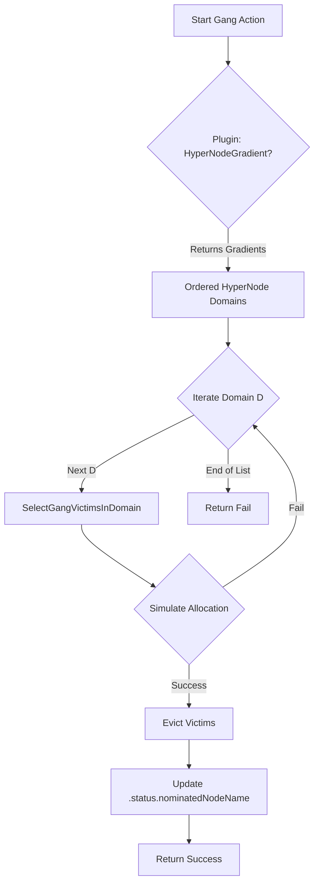
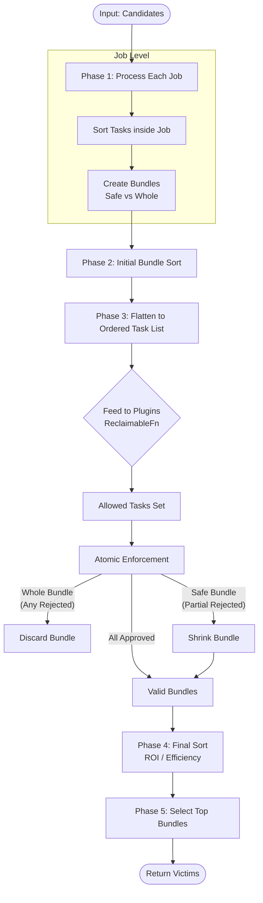

# Gang-Aware Preemption & Reclaim Design Document

[@vzhou-p](https://github.com/vzhou-p); Dec 3, 2025

> **Update (Mar 2026)**: Since this doc was written, Volcano gained an explicit topology-domain abstraction based on **HyperNodes** and a plugin-driven
> **winner-takes-all** domain generator via `Session.HyperNodeGradientForJobFn/SubJobFn`. This revision updates the design to build on those
> existing mechanisms (instead of introducing a parallel `GangSearchSpaceFn` API), corrects reclaim nomination behavior, and documents the current
> limitation that `preempt` skips NetworkTopology jobs today.

## 1. Problem Statement

### 1.1 Current Limitation
The Volcano scheduler's existing actions (`allocate`, `preempt`, `reclaim`) suffer from architectural coupling and "Task-Centric" decision making.

1.  **Gang Blindness (Preempt/Reclaim)**: 
    - Victims are selected greedily (Task-by-Task).
    - Evicting 1 task from 5 different gangs might be chosen over evicting 1 whole gang, causing 5 cascading failures instead of 1.
    - Global cost (total resources of the broken gang) is ignored.

2.  **Topology Coupling (Allocate)**:
    - Volcano now has a topology-domain abstraction (**HyperNodes**) and an in-tree plugin (`network-topology-aware`) that computes ordered
      HyperNode gradients for allocate.
    - The domain generator is reusable, but the **eviction actions do not yet consume it**, so topology-aware eviction remains incomplete.

3.  **Topology Blindness (Preempt/Reclaim)**:
    - `preempt` currently **skips** jobs that contain `NetworkTopology` entirely (explicit guard).
    - `reclaim` does not explicitly scope its search to a topology domain; it searches per-node candidates that pass predicates.
    - Result: topology-constrained jobs cannot rely on preempt, and reclaim may “spray” victims across domains instead of clearing a coherent domain
      for a gang.

### 1.2 Optimization Goal
1.  **Decouple Topology Logic**: Move strict topology constraints out of `allocate.go` and into the plugin layer.
2.  **Gang-Aware Eviction**: Implement a "Holistic" victim selection strategy that considers the Gang as the atomic unit of eviction.
3.  **Unified Search Constraint**: Create a mechanism where `allocate`, `preempt`, and `reclaim` all respect the same set of hard constraints via a composable search space reduction.

---

## 2. Architectural Change: The Gang-Level Pipeline

To resolve these issues, we introduce a gang-level pipeline that is **domain-scoped** and **bundle-aware**.

**Key change vs the original doc**: Volcano already has an explicit “Where” extension point implemented around **HyperNodes**.
We should reuse it (and extend it if needed) rather than creating a new parallel `GangSearchSpaceFn` API.

### 2.1 Extension Points (Updated: HyperNode Domains)

#### 2.1.1 The “Where” (Constraint): HyperNode Gradients (Existing, Extended with SearchPurpose)
Volcano already exposes a plugin-driven domain generator. **For this design, we will extend that existing API with an explicit `SearchPurpose`** so plugins can:
- return broader gradients for allocation, and
- return a truncated Top-K set for eviction (to cap latency).

> Decision:
> The `SearchPurpose` API shown below is **not present in the codebase today**. Implementing this design requires updating:
> - `pkg/scheduler/api/types.go`: define `SearchPurpose` + extend the gradient function type signatures.
> - `pkg/scheduler/framework/session.go` / `pkg/scheduler/framework/session_plugins.go`: store and invoke the updated signatures.
> - Call sites: `pkg/scheduler/actions/allocate/allocate.go` (allocation uses `PurposeAllocate`) and the gang-aware paths in `pkg/scheduler/actions/preempt/preempt.go` + `pkg/scheduler/actions/reclaim/reclaim.go` (eviction uses `PurposeEvict`).
> - Plugins that register gradients (e.g. `pkg/scheduler/plugins/network-topology-aware/network_topology_aware.go`).

```go
// pkg/scheduler/api/types.go

type SearchPurpose int

const (
    // PurposeAllocate indicates the caller is performing placement/allocation search.
    // Plugins may return a wider (potentially exhaustive) set of domains/gradients.
    PurposeAllocate SearchPurpose = iota

    // PurposeEvict indicates the caller is performing eviction search (preempt/reclaim).
    // Plugins SHOULD return a truncated Top-K set of domains/gradients ordered by feasibility
    // to cap scheduler latency.
    PurposeEvict
)

// HyperNodeGradientForJobFn groups HyperNodes into ordered gradients and discards HyperNodes
// that violate the job's topology requirements. The first enabled plugin that registers this
// function determines the result (winner-takes-all).
type HyperNodeGradientForJobFn func(job *JobInfo, hyperNode *HyperNodeInfo, purpose SearchPurpose) [][]*HyperNodeInfo

// HyperNodeGradientForSubJobFn is the same but evaluated against a SubJob (subGroupPolicy).
type HyperNodeGradientForSubJobFn func(subJob *SubJobInfo, hyperNode *HyperNodeInfo, purpose SearchPurpose) [][]*HyperNodeInfo
```

**Interpretation for this design**:
- A **Domain** is a **HyperNode** (a topology subtree).
- The node set in a domain is `ssn.RealNodesList[hyperNode.Name]`.
- Gradients are **preference order**; the scheduler should try earlier gradients first.

This maps directly to the original “GangSearchSpace” concept and already implements the doc’s “winner-takes-all” plugin semantics.

#### 2.1.2 The “Who” (Policy): Gang-Aware Victim Selection (New, Optional)
We still need a hook/strategy to select victims **as bundles/gangs**. This can be implemented:
- **In the action layer** (recommended initially for less API churn), or
- As a new plugin extension point if we need out-of-tree policies.

If/when we formalize it, the selector should operate on **Jobs** and **Bundles**, not raw tasks, but must still be able to consult existing
task-oriented policy plugins via an adapter (see Section 3.4.2).

### 2.2 Execution Pipeline (Composable Search)

The Session executes a 2-stage pipeline for Gang operations:

#### Phase 1: Search Space Reduction (HyperNodeGradient)
*   Call `ssn.HyperNodeGradientForJobFn(job, rootHyperNode, purpose)` (or the SubJob version).
*   **Logic (Primary Driver)**: The **first enabled plugin** that registered the gradient function defines the search space.
*   **Result**: An ordered list of gradients `[][]*HyperNodeInfo`. Each HyperNode is a domain; its nodes are `ssn.RealNodesList[hyperNode]`.

#### Phase 2: Assignment or Eviction

The execution logic diverges based on the action type:

*   **Allocate Action (Gradient-First Exhaustive Within Gradient)**:
    * Use `purpose = PurposeAllocate`.
    * Iterate through gradients in order (G1, G2, ...).
    * For a given gradient, simulate allocation in **all HyperNodes** inside the gradient, pick the best solution within that gradient.
    * **Stop at the first gradient that yields any solution**, commit that solution, and return.
    * Rationale: this matches current `allocate` behavior and keeps latency predictable while still exploring multiple domains.
*   **Preempt/Reclaim Action (Greedy First-Fit)**:
    * Use `purpose = PurposeEvict`.
    * Plugins SHOULD return a truncated (Top-K) ordered set of HyperNodes/gradients for eviction.
    *   **Try domain D**: select victims considering the *domain-wide footprint* of gangs inside D; simulate; if success, **evict + pipeline** and return.
    *   If D fails, try next domain.


```mermaid
graph TD
    Start[Start Gang Action] --> P1{Plugin: HyperNodeGradient?}
    P1 -- Returns Gradients --> Domains[Ordered HyperNode Domains]
    
    Domains --> Loop{Iterate Domain D}
    Loop -- Next D --> Select[SelectGangVictimsInDomain]
    Select --> Sim{Simulate Allocation}
    
    Sim -- Success --> Evict[Evict Victims]
    Evict --> Nominate[Update .status.nominatedNodeName]
    Nominate --> Return[Return Success]
    
    Sim -- Fail --> Loop
    Loop -- End of List --> Fail[Return Fail]
```

---

## 3. Proposed Solution: Enhanced Preempt & Reclaim Actions

Instead of creating new actions (`gang-preempt`, `gang-reclaim`), we will enhance the existing `preempt` and `reclaim` actions to support Gang-Aware logic via configuration flags. This ensures backward compatibility and simplifies user configuration.

### 3.1 Configuration

Both actions will support a new argument: `gangAwareEnable` (new; not present today).

**Note on current code**:
- `preempt` currently has `enableTopologyAwarePreemption` (kube-style dry-run selection), but it still **skips** NetworkTopology jobs entirely.
- `reclaim` already pipelines tasks (sets nomination) when it succeeds.

```yaml
actions: "allocate, backfill, preempt, reclaim"
tiers:
  - plugins:
    - name: gang
    - name: priority
    - name: drf
    - name: predicates
    - name: nodeorder
    - name: binpack
    arguments:
      preempt.gangAwareEnable: true
      reclaim.gangAwareEnable: true
```

### 3.2 Logic Flow (Branching)

The `Execute` method in both actions will detect the flag and branch into the Gang-Aware pipeline if enabled.

The gang-aware logic is a completely independent execution path. If `gangAwareEnable` is true, the action does **NOT** execute any of the legacy task-centric logic (e.g. `normalPreempt` or `normalReclaim`). It calls `executeGangPath` and returns immediately. This prevents any interference or complexity from mixing the two models.

```go
func (a *Action) Execute(ssn *framework.Session) {
    // 1. Check Configuration
    if a.gangAwareEnable {
        // 2. Branch to Unified Gang-Aware Pipeline
        // This function handles the entire lifecycle (Search -> Select -> Evict -> Nominate)
        // independently from the legacy code below.
        a.executeGangPath(ssn)
        return
    }
    
    // 3. Fallback to Legacy (Task-Centric) Logic
    // ... existing logic ...
}
```

### 3.3 Gang-Aware Eviction Algorithm (Shared by reclaim and preempt)


1.  **Identify Need**: Preemptor Job P needs resources.
2.  **Determine Search Space**:
    - Call `ssn.HyperNodeGradientForJobFn(P, <cluster-top-hypernode>, PurposeEvict)` (Phase 1 above).
    - Flatten gradients into an ordered list of HyperNode domains: `[PreferredHyperNode, SecondaryHyperNode, ...]`.
    - The plugin SHOULD already have truncated to **Top-K** HyperNodes for eviction to cap worst-case latency.
3.  **Process Domains (Greedy)**:
    - **For each Domain** (a HyperNode; set of real nodes under it):
        - **Select Victims (Domain-Wide)**: Call `SelectGangVictimsInDomain(Preemptor, Domain)`.
            - This differs from legacy preemption by considering the *entire footprint* of victim gangs within the domain, rather than iterating node-by-node for each task of the gang.
        - **Simulate & Execute**:
            - Run the **Task-to-Node Nomination** logic (see Section 3.3.2) on the domain assuming victims are evicted.
            - **If Simulation Succeeds**:
                - **Evict**: Evict the selected victims.
                - **Nominate**: Apply the results of the simulation (update `.status.nominatedNodeName`).
                - **Return Success**.
            - **If Simulation Fails**:
                - Continue to next domain.

#### 3.3.1 Why NominatedNodeName is Critical (Gang vs. Task)
Gang-aware reclaim/preempt **MUST** pipeline (set `.status.nominatedNodeName`) for the tasks it is trying to unblock.

*   **The Risk**: If we only evict victims without reserving the nodes, the resources become "Free" in the next scheduling cycle. A smaller job (or a higher-priority single-task job) could "steal" one of the freed nodes.
*   **The Gang Consequence**: For a single task, losing a node is an inconvenience. For a Gang requiring 5 specific nodes (topology domain), losing **one** node means the **entire Gang fails** to start. The eviction of the other 4 nodes becomes "wasted waste." By setting `nominatedNodeName`, the `allocate` action in the next cycle will prioritize these specific nodes for the Gang's tasks, guaranteeing the "Domain" remains intact.

> **Reality check (current Volcano)**:
> - `reclaim` already calls `stmt.Pipeline(task, node, evictionOccurred)` and commits when the job becomes pipelined.
> - `allocate` already tries `NominatedNodeName` first.
> This design keeps that behavior and extends it to topology-domain gang eviction.

### 3.3.2 Task-to-Node Nomination Strategy
A critical challenge in the gang-aware reclaim path is determining **which task** in the gang should be nominated to **which node** in the cleared domain.

**Strategy: Reuse Allocate Logic (Dry-Run)**

Instead of inventing a new matching algorithm, we reuse the existing `allocate` action logic to determine the best placement. This ensures consistency between the *Nomination* (in gang-aware reclaim) and the eventual *Binding* (in `allocate`).

> **Decision (reuse the existing allocate code path for now)**:
> The initial implementation will reuse the **existing `allocate` code path** (predicates + scoring + HyperNode gradients + worksheet mechanics) for dry-run simulation inside a domain, even though it introduces some coupling between actions.
>
> In the future, we may extract a shared “placement simulator” helper to reduce coupling and improve performance, but that is explicitly out of scope for the first rollout.

1.  **Domain Filter (HyperNode)**:
    * Restrict the candidate nodes to `ssn.RealNodesList[hyperNode]`.
    * For NetworkTopology jobs, keep `AllocatedHyperNode` consistent during simulation (same concept as allocate).

2.  **Dry-Run Placement (Reuse Allocate Mechanics)**:
    * Reuse the same predicate + node scoring logic that allocate uses, but restricted to the domain nodes.
    * Goal: produce a deterministic Task→Node nomination plan that allocate will likely bind in the next cycle.

3.  **Apply Nomination via Statement**:
    * Record evictions with `stmt.Evict(...)`.
    * Nominate chosen placements with `stmt.Pipeline(task, node, evictionOccurred)`.

> **Note**: In current Volcano, both `preempt` and `reclaim` already pipeline tasks on success; this design reuses that behavior but makes it
> **domain-scoped** and **gang-consistent**.

### 3.4 Victim Selection (Bundles)

When selecting victims within a Domain, we categorize the "footprint" of each candidate **Job** into "Bundles".

> **Decision (Job-level bundles)**:
> Eviction bundling is defined at the **Job** level (not `SubJobInfo`) in this design.
>
> - **Why**: existing eviction policy plugins operate on `TaskInfo` and (when they reason about gang constraints) typically reason about the Job via `task.Job`/`JobInfo` (e.g. `MinAvailable`, queue membership, priority/fairness).
> - **Topology/subGroupPolicy implication**: Job-level bundling means we may evict tasks from multiple subgroups of the same Job when clearing a domain. This is intentional: the unit of disruption accounting is the Job. The **domain-scoped simulation** (Section 3.3.2) is responsible for ensuring the *preemptor* Job can be (re-)placed coherently in one domain after eviction.

1.  **Safe Bundle**:
    - **Surplus**: Tasks above `MinAvailable` (Ready > Min).
    - **Broken**: Tasks from a gang that is *already* broken (Ready < Min) or *will be* broken in this cycle.
    - **Cost**: Zero (Free to evict).

2.  **Whole Bundle**:
    - **Core**: Tasks required to maintain `MinAvailable`.
    - **Cost**: High (Requires restarting the whole gang).
    
**Sorting Logic (The "Sound" Strategy)**:
We sort bundles to minimize disruption:
1.  **Gang State**: Always take **Safe/Broken** bundles first (Priority 0).
2.  **Queue Policy**: Respect `VictimQueueOrderFn` (e.g., reclaim from over-quota queues).
3.  **Global Efficiency** (For Whole Bundles):
    - `Efficiency = (Resources Freed in Domain) / (Total Global Resources of Gang)`
    - Break gangs that are primarily located *inside* the target domain. Avoid destroying a large distributed job to free a small local resource.
4.  **Job Priority**: Respect `JobOrderFn` (Priority, DRF, etc.).

#### Example 1: Safe vs Whole Bundles (Standard Gang)

Consider a Gang **Job-A**:
*   **Replicas**: 5
*   **MinAvailable**: 3
*   **Current Running**: 5 (Full Health)

If we need to reclaim resources from **Job-A**, we split it into two bundles:

1.  **Safe Bundle**:
    *   **Contains**: 2 Tasks (Task4, Task5)
    *   **Logic**: `Running (5) - MinAvailable (3) = 2 Surplus`
    *   **Impact**: Evicting these tasks does **NOT** break the gang. Job-A continues running with 3 tasks.
    *   **Cost**: Low (Preemption allowed).

2.  **Whole Bundle**:
    *   **Contains**: 3 Tasks (Task1, Task2, Task3)
    *   **Logic**: These are the core tasks required for the gang to function.
    *   **Impact**: Evicting *any one* of these tasks forces the **entire gang** to restart.
    *   **Cost**: High (Avoid unless necessary).

#### Example 2: Safe vs Whole Bundles (With Roles)

Consider a Gang **Job-B**
*   **Roles**:
    *   `driver`: 1 Replicas, Min 1.
    *   `worker`: 4 Replicas, Min 3.
*   **Global MinAvailable**: 4
*   **Current Running**: 5 (1 driver, 4 workers) - Full Health.

We analyze the surplus for each role to split bundles:

1.  **Safe Bundle**:
    *   **Contains**: 1 Task (`worker-3`)
    *   **Logic**:
        *   `driver`: 1 Running - 1 Min = 0 Surplus.
        *   `worker`: 4 Running - 3 Min = 1 Surplus.
    *   **Impact**: Evicting `worker-3` leaves the job with 1 driver + 3 workers (Total 4), which satisfies `MinAvailable`.
    *   **Cost**: Low.

2.  **Whole Bundle**:
    *   **Contains**: 4 Tasks (`driver-0`, `worker-0`, `worker-1`, `worker-2`)
    *   **Logic**:
        *   `driver-0`: Critical (Count drops to 0 < 1).
        *   `worker-{0,1,2}`: Core (Count drops to 2 < 3).
    *   **Impact**: Evicting *any* of these violates the job's strict constraints, forcing a full restart.
    *   **Cost**: High.


### 3.4.1 Victim Selection Algorithm Pseudo-Code


```mermaid
flowchart TB
    Start([Input: Candidates]) --> JobLoop[Phase 1: Process Each Job]
    
    subgraph JobProcessing [Job Level]
        JobLoop --> SortTasks[Sort Tasks inside Job]
        SortTasks --> CreateBundles[Create Bundles<br/>Safe vs Whole]
    end
    
    CreateBundles --> InitialSort[Phase 2: Initial Bundle Sort]
    InitialSort --> Flatten[Phase 3: Flatten to Ordered Task List]
    Flatten --> Plugins{Feed to Plugins<br/>ReclaimableFn}
    
    Plugins --> Allowed[Allowed Tasks Set]
    Allowed --> Atomic[Atomic Enforcement]
    
    Atomic -- "Whole Bundle<br/>(Any Rejected)" --> Discard[Discard Bundle]
    Atomic -- "Safe Bundle<br/>(Partial Rejected)" --> Shrink[Shrink Bundle]
    Atomic -- "All Approved" --> Valid[Valid Bundles]
    
    Shrink --> Valid
    
    Valid --> FinalSort[Phase 4: Final Sort<br/>ROI / Efficiency]
    FinalSort --> Select[Phase 5: Select Top Bundles]
    Select --> End([Return Victims])
```

```python
# ALGORITHM: SelectGangVictimsInDomain

# INPUT:
# - Preemptor: The job needing resources
# - Domain: The specific set of nodes we are clearing
# - Candidates: Jobs with tasks on these nodes
# - Session: Scheduler session (plugins)

Bundles = List()

# --- PHASE 1: Split & Bundle ---
# Try to split tasks of each job to 2 bundles. One is Safe, and the other is Core.
FOR EACH Job IN Candidates:
    # 1. Identify tasks IN THE DOMAIN
    LocalTasks = Job.Tasks.Where(task => Domain.Contains(task.Node))
    IF LocalTasks Is Empty: CONTINUE

    # 2. Sort LocalTasks (Evict low priority tasks within job first)
    # We define a custom 'VictimOrder' for Gang Preemption
    # Priority 1: Coverage (Maximize Utility)
    #   - Score = Min(Task.Res, Needed) / Needed
    #   - We prefer tasks that satisfy a larger chunk of the requirement.
    # Priority 2: Task Priority (Lowest First)
    # Priority 3: Least Waste (Best Fit)
    #   - If Coverage is equal (e.g., both tasks > needed), prefer the smaller task.
    #   - Break ties between a 4-core victim and 64-core victim (pick 4-core).
    # Priority 4: Creation Time (Youngest First)
    LocalTasks.Sort(CustomGangVictimComparator)

    # 3. Calculate Surplus Budgets (Global & Role-Aware)
    # Job might be "Broken" if it's already failing/starting
    Ready = Job.ReadyTasks
    GlobalMin = Job.MinAvailable
    GlobalSurplus = Ready - GlobalMin

    # Handle Elastic Jobs (MinAvailable < Sum(RoleMin))
    # If job is elastic, we ignore specific role constraints for safety checks.
    EnforceRoles = (GlobalMin >= Job.TaskMinAvailableTotal)

    RoleSurplus = Map()
    IF EnforceRoles:
        FOR Role IN Job.Roles:
             RoleSurplus[Role] = Job.RoleReady(Role) - Job.RoleMinAvailable(Role)

    # 4. Create Bundles
    IF GlobalSurplus < 0:
        # CASE A: Already Broken (Cheapest)
        # Treat as SAFE. Global Cost = 0.
        Bundles.Add(NewBundle(Type: SAFE, Tasks: LocalTasks, Job: Job))

    ELSE:
        # CASE B: Healthy
        # Identify SAFE tasks (must satisfy BOTH Global AND Role constraints)
        SafeTasks = List()
        CoreTasks = List()

        FOR task IN LocalTasks:
            Role = task.Role
            
            # Check if evicting this task violates either Global or Role constraints
            IsRoleSafe = !EnforceRoles OR (RoleSurplus[Role] > 0)

            IF GlobalSurplus > 0 AND IsRoleSafe:
                SafeTasks.Add(task)
                GlobalSurplus--      # Decrement available budget
                IF EnforceRoles: RoleSurplus[Role]--  # Decrement role budget
            ELSE:
                CoreTasks.Add(task)

        IF SafeTasks Is Not Empty:
            Bundles.Add(NewBundle(Type: SAFE, Tasks: SafeTasks, Job: Job))

        IF CoreTasks Is Not Empty:
            Bundles.Add(NewBundle(Type: WHOLE, Tasks: CoreTasks, Job: Job))


# --- PHASE 2: Initial Sort (Fed to plugins) ---
# Goal: Present "Cheapest" and "Most Fair" victims to the stateful plugins first.
# This ensures that limited quotas (e.g. Queue Deserved) are consumed by the preferred victims.
Sort Bundles using Comparator(Bundle A, Bundle B):

    # 1. GANG STATE (Absolute Rule)
    # Safe/Broken bundles are "Free". Whole bundles are "Expensive".
    IF A.Type != B.Type:
        RETURN A.Type < B.Type # Safe (0) < Whole (1)

    # 2. QUEUE HIERARCHY (Plugin: VictimQueueOrderFn)
    # e.g., Reclaim from over-quota queues first.
    Result = Session.VictimQueueOrderFn(A.Job.Queue, B.Job.Queue, Preemptor.Queue)
    IF Result != EQUAL:
        RETURN Result

    # 3. GLOBAL EFFICIENCY (Topology Rule - Only for WHOLE bundles)
    # If both are expensive, pick the one with lower Global Cost per Local Gain.
    # We use a weighted ROI (Return on Investment) metric.
    # ROI = LocalGainScore / GlobalCostScore
    
    ROI_A = CalculateROI(A, Preemptor.Request, Cluster.Capacity)
    ROI_B = CalculateROI(B, Preemptor.Request, Cluster.Capacity)
    
    # Threshold check prevents overriding User Priority for negligible efficiency gains.
    # Recommended Value: 0.05 (5% difference required to ignore priority)
    IF Abs(ROI_A - ROI_B) > Threshold:
        RETURN ROI_A > ROI_B

    # 4. JOB PRIORITY / POLICIES (Plugin: JobOrderFn)
    # Standard plugin logic (Priority, DRF, etc.)
    Result = Session.JobOrderFn(A.Job, B.Job)
    IF Result != EQUAL:
        RETURN Result

    # 5. TIE-BREAKER
    RETURN A.Job.CreationTime < B.Job.CreationTime


# --- PHASE 3: Global Plugin Validation (Stateful Check) ---
# CRITICAL: We must validate ALL sorted candidates in one batch.
# Plugins like 'capacity' track cumulative queue usage (allocations) during the check.
# If we checked job-by-job, the plugin would reset its state, causing "Double Counting" 
# where multiple jobs from the same queue are all approved for eviction, 
# violating the queue's minimum 'Deserved' guarantee.

# 1. Flatten Sorted Bundles to Ordered Task List
OrderedCandidates = Bundles.SelectMany(b => b.Tasks)

# 2. Call ReclaimableFn ONCE
# The plugin will approve tasks in order until constraints (like Queue Deserved) are met.
# It acts as a "Cut-Off" filter on our priority list.
AllowedTasksSet = Session.Reclaimable(Preemptor.AnyTask, OrderedCandidates).ToSet()

# 3. Prune & Shrink Bundles
ValidBundles = List()
FOR EACH Bundle IN Bundles:
    IF Bundle.Tasks.All(t => AllowedTasksSet.Contains(t)):
        # All tasks in bundle are reclaimable -> Keep Bundle
        ValidBundles.Add(Bundle)
    ELSE IF Bundle.Type == SAFE:
        # For SAFE (surplus) bundles, partial eviction is allowed.
        # We take whatever the plugin allows.
        AllowedPart = Bundle.Tasks.Where(t => AllowedTasksSet.Contains(t))
        IF AllowedPart Is Not Empty:
            Bundle.Tasks = AllowedPart
            ValidBundles.Add(Bundle)
    # ELSE: Reject WHOLE bundle if any part is rejected by plugin.


# --- PHASE 4: Final Sort (Selection Optimization) ---
# Goal: Re-rank valid bundles based on final resource values.
# Since "Safe" bundles may have shrunk in Phase 3, their ROI/Coverage metrics changed.
Sort ValidBundles using Comparator(Bundle A, Bundle B):
    # Repeat the same sorting in Phase 2

# --- PHASE 5: Selection ---
Victims = List()
ResourcesFreed = 0

FOR EACH Bundle IN ValidBundles:
    # Logic note: Because "Safe" bundles always sort before "Whole" bundles 
    # for the same job, we don't need complex state tracking here.
    
    Victims.Add(Bundle.Tasks)
    ResourcesFreed += Bundle.LocalResources

    IF ResourcesFreed >= NeededResources:
        BREAK

RETURN Victims
```

#### 3.4.2 Plugin Compatibility (Adapter Layer)
To support existing plugins (which operate on `TaskInfo`), the new gang-aware logic must adapt to **how Volcano eviction plugins actually work today**:

**Current Volcano framework**:
- Plugins register `EvictableFn` for both reclaim and preempt:
  - `ReclaimableFn`: `func(reclaimer *TaskInfo, reclaimees []*TaskInfo) ([]*TaskInfo, int)`
  - `PreemptableFn`: `func(preemptor *TaskInfo, preemptees []*TaskInfo) ([]*TaskInfo, int)`
- The returned `int` is treated as **abstain vs participate**:
  - `0` means **abstain** (framework ignores this plugin for this call).
  - non-zero means **participate** (framework uses the returned candidate list).
- The framework combines multiple plugins using **tier short-circuit + intersection**:
  - Within a tier, participating plugins' returned candidate sets are **intersected**.
  - If any participating plugin returns an **empty** list, that tier is effectively a **veto** (victims become nil for that tier).
  - The **first tier** that yields a non-nil victim set determines the result (later tiers are not consulted).

**Adapter Strategy (Bundle->Task, Policy->Mechanism split)**:
1. **Flattening (Bundle -> ordered `[]*TaskInfo`)**:
   - After we produce an ordered list of Bundles (Safe before Whole; then queue/job ordering), we flatten to a single `OrderedCandidates [](*TaskInfo)`.
   - **Important**: we pass tasks in this exact order into `ssn.Reclaimable(...)` / `ssn.Preemptable(...)`. Some in-tree plugins (e.g. `capacity`) are stateful during a single call and make decisions while iterating the provided slice; preserving a deterministic order is part of correctness.
   - We call `Reclaimable/Preemptable` **once per domain** with the full ordered list, not job-by-job and not node-by-node. This preserves plugin state within the call and avoids resetting a plugin's internal accounting multiple times.

2. **Policy Gate (framework plugins decide the allowed task set)**:
   - Let `AllowedTasks = ssn.Reclaimable(reclaimer, OrderedCandidates)` (or `Preemptable` for preemption).
   - Interpret `AllowedTasks` as the **policy-approved** subset of tasks that are eligible to be evicted under current tier/plugin constraints (queue deserved/guarantee, job minAvailable, etc.).

3. **Atomic Enforcement (Mechanism: bundle integrity on top of policy)**:
   - For each Bundle `B` produced in Section 3.4.1:
     - **Whole Bundle**: keep `B` only if **all** tasks in `B` are present in `AllowedTasks`. Otherwise discard the entire Whole bundle.
     - **Safe Bundle**: shrink `B.Tasks` to tasks also present in `AllowedTasks`. If empty after shrinking, discard the Safe bundle.
   - This ensures legacy plugins control **policy**, while the gang-aware pipeline enforces **job-level disruption accounting** and avoids "break 5 gangs by 1 task each" patterns.

4. **Selection remains action-owned**:
   - As in current Volcano, plugins return **eligible victims**, but the action remains responsible for selecting how many victims to evict to satisfy the preemptor's needs (and for dry-run simulation and nomination).
   - The gang-aware path in `preempt`/`reclaim` selects **Bundles** (not raw tasks) after the adapter step above.

### 3.4.3 Bundle Scoring (ROI)

To handle heterogeneous resources (CPU, Memory, GPU), we define **Local Gain** and **Global Cost** using a weighted normalization strategy.

1.  **Local Gain Score** (Preemptor-Centric):
    *   Measures utility to the preemptor.
    *   Normalize `Bundle.LocalResources` against `Preemptor.NeededResources`.
    *   *Formula*: `Sum(Min(Local[i], Needed[i]) / Needed[i])` for each resource dimension `i` where `Needed[i] > 0`.
    *   *Why*: If preemptor needs GPU, a victim freeing CPU has 0 utility.

2.  **Global Cost Score** (Preemptor-Centric):
    *   Measures total disruption relative to the need.
    *   Normalize `Bundle.GlobalResources` against `Preemptor.NeededResources`.
    *   *Formula*: `Sum(Global[i] / Needed[i])` for each resource dimension `i` where `Needed[i] > 0`.
    *   *Why*: We calculate the "Opportunity Cost" strictly in terms of the resources we are trying to obtain. If I need CPU, the "cost" of a victim is defined by how many CPUs I am destroying globally. This ensures apples-to-apples comparison between Local Gain and Global Cost.

3.  **Efficiency (ROI)**:
    *   `Efficiency = LocalGainScore / GlobalCostScore`
    *   We prioritize victims that solve the local bottleneck with the least global cluster disruption.

4.  **Unrequested resource**
    * Skip unrequested resources in the score calculation. For example, if the preemptor doesn't need GPU, but one of the victim has GPU. The score of the GPU won't be counted.
    * Consider adding some penalty to the efficiency if a victim of unrequested resource is evicted.

#### Example 1: Local vs Global Footprint (The "Distributed Job" Case)

**Preemptor needs: `2 GPU`**

| Victim | Local Resources | Global Resources | Local Score | Global Score | Efficiency | Winner |
| :--- | :--- | :--- | :--- | :--- | :--- | :--- |
| **A** | 2 GPU | 4 GPU | `Min(2,2)/2` = **1.0** | `4/2` = **2.0** | `1.0/2.0` = **0.5** | No |
| **B** | 2 GPU | 2 GPU | `Min(2,2)/2` = **1.0** | `2/2` = **1.0** | `1.0/1.0` = **1.0** | **Yes** |

#### Example 2: Partial Fit (Incremental Eviction)

**Preemptor needs: `10 CPU`**

| Victim | Local Resources | Global Resources | Local Score | Global Score | Efficiency | Winner |
| :--- | :--- | :--- | :--- | :--- | :--- | :--- |
| **C** | 10 CPU | 20 CPU | `Min(10,10)/10` = **1.0** | `20/10` = **2.0** | `1.0/2.0` = **0.5** | No |
| **D** | 2 CPU | 2 CPU | `Min(2,10)/10` = **0.2** | `2/10` = **0.2** | `0.2/0.2` = **1.0** | **Yes** |


#### Example 3: Multi-Resource Saturation

**Preemptor needs: `4 CPU, 16GB Mem`**

| Victim | Local Resources | Global Resources | Local Score | Global Score | Efficiency | Winner |
| :--- | :--- | :--- | :--- | :--- | :--- | :--- |
| **E** | 4 CPU, 4GB | 4 CPU, 4GB | `Min(4,4)/4 + Min(4,16)/16` = **1.25** | `4/4 + 4/16` = **1.25** | `1.25/1.25` = **1.0** | Tie |
| **F** | 2 CPU, 8GB | 2 CPU, 8GB | `Min(2,4)/4 + Min(8,16)/16` = **1.0** | `2/4 + 8/16` = **1.0** | `1.0/1.0` = **1.0** | Tie |

#### Example 4: Resource Mismatch (The "GPU for CPU" Anti-Pattern)

**Preemptor needs: `4 CPU` (No GPU needed)**

| Victim | Local Resources | Global Resources | Local Score | Global Score | Efficiency | Winner |
| :--- | :--- | :--- | :--- | :--- | :--- | :--- |
| **G** | 4 CPU | 4 CPU | `Min(4,4)/4` = **1.0** | `4/4` = **1.0** | `1.0/1.0` = **1.0** | **Yes** |
| **H** | 4 CPU, 1 GPU | 4 CPU, 1 GPU | `Min(4,4)/4` = **1.0** | `4/4 + 1/0(Ignore)` = **1.0** * | `1.0/1.0` = **1.0** | Tie* |


### 3.5 Difference between Preempt and Reclaim Logic

#### 3.5.1 Shared Utility (Mechanism)
Both actions utilize the same underlying mechanisms provided by the `Session` or helper packages:
1.  **Search Space**: `ssn.HyperNodeGradientForJobFn/SubJobFn` (domain generator) + `ssn.RealNodesList` (nodes in domain)
2.  **Bundle Logic**: `util.CreateBundles(candidates)` (Categorizes tasks into Safe/Whole bundles)
3.  **Efficiency Check**: `util.CalculateROI(bundle, needed)`

#### 3.5.2 Preempt (Priority-Driven)
*   **Goal**: Satisfy high-priority jobs by evicting low-priority ones with minimal disruption.
*   **Candidates**: Jobs in the **Same Queue**.
*   **Filter**: Strictly `Preemptor.Priority > Victim.Priority`.
*   **Ordering**:
    1.  **Gang State**: Prefer `Safe` bundles over `Whole` bundles.
    2.  **Job Priority**: Prefer evicting lower priority victims first.
    3.  **Efficiency**: Break ties with ROI (Global Cost).

#### 3.5.3 Reclaim (Fairness-Driven)
*   **Goal**: Recover resources from over-quota queues for under-quota queues.
*   **Candidates**: Jobs in **Other Queues** that are `Overused`.
*   **Filter**: Respect `Queue.Reclaimable()` and `Queue.Overused()`.
*   **Ordering**:
    1.  **Gang State**: Prefer `Safe` bundles over `Whole` bundles.
    2.  **Queue Fairness**: Prefer evicting from queues that are most over-quota (`ssn.VictimQueueOrderFn`).
    3.  **Efficiency**: Break ties with ROI.
    4.  **Job Priority**: Only used as a final tie-breaker.

This separation ensures that Preemption never violates priority for efficiency, while Reclaim always respects queue fairness guarantees.

---

## 4. Long-Term Vision & Migration Strategy

With the new interfaces, we could aims to evolve the Volcano scheduler from a "Task-Centric" model to a "Gang-Native" model.

### 4.1 The North Star: Unified Eviction Pipeline

Currently, Volcano maintains separate code paths for `allocate`, `preempt`, and `reclaim`.
*   **Allocate** understands Topology but is complex and rigid.
*   **Preempt/Reclaim** understand Priority/Fairness but are blind to Topology and Gang atomic units.

The **Unified Pipeline** envisions a single, generalized logic path where:
1.  **Every Job is a Gang**: Standard jobs are treated as "Gangs of Size 1".
2.  **Domain-Scoped Scheduling**: Instead of searching the entire cluster, we allocate and evict resources within specific "Topology Domains" (defined by plugins), ensuring structural constraints are respected at the root of the decision process.
3.  **Every Eviction is a Bundle**: We never evict a "Task"; we evict a "Bundle" (which might be 1 task or 100 tasks).

**Benefits**:
*   **Code Deduplication**: One robust engine for all eviction scenarios.
*   **Consistent Behavior**: Allocations and Evictions respect the domain constraint.

### 4.2 The Challenge: Barriers to Immediate Unification

Migrating to the Unified Pipeline immediately is risky due to:
*   **Performance**: Simulating the eviction of massive gangs (1000+ tasks) in a "Dry Run" loop is significantly more expensive than the current lightweight checks.
*   **Plugin Ecosystem**: The current ecosystem of 20+ plugins expects `TaskInfo`. A full rewrite would break compatibility.
*   **Fairness Guarantees**: The legacy `reclaim` action has highly tuned logic for Queue Fairness that is difficult to replicate perfectly in a generic pipeline without regressions.

### 4.3 Step 1: Retrofitting Legacy Actions (Intermediate Solution)

Instead of a "Big Bang" rewrite, we can **retrofit** the existing legacy actions (`preempt` and `reclaim`) with the new Gang Capabilities. This allows us to fix critical bugs (like Topology Blindness) immediately while keeping the stable core loop.

#### 4.3.1 The "Plugin Injection" Strategy
We inject the existing **HyperNodeGradient** domain generator into the legacy control loop to act as a **Smart Filter**.

*   **Before**: The legacy loop iterates over *all* nodes to find victims. It asks: *"Does the victim fit on this node?"*
*   **After**: The legacy loop first asks: *"Which HyperNodes/domains are valid for this job?"*, then restricts victim search *only* to nodes
    inside the chosen HyperNode domain.

#### 4.3.2 Solving "Split Domains" (The Sticky Domain Fix)
A major flaw in the legacy "Task-by-Task" loop is that different tasks of the same Gang might be scheduled on incompatible domains (e.g., Task A on Rack 1, Task B on Rack 2).

To fix this **without** a rewrite, we introduce **Job-Level State** (`Sticky Domain`):
1.  **Lazy Pinning**: The first task of a job that needs eviction triggers a HyperNode gradient query. The scheduler selects the best HyperNode and **pins** it for the job (for this scheduling cycle).
2.  **Strict Enforcement**: All subsequent tasks of that job are forced to search *only* within the pinned domain.
3.  **Fail-Fast Safety**: If a subsequent task cannot find space in the pinned domain, the job **fails** for the current cycle. This prevents the "Split Gang" corruption, prioritizing correctness over partial progress.
4. **Soft Topology Constraint**: For soft topology constraint, we'll keep the current behavior to return all nodes in the cluster for victim searching.
4   **Running Gangs**: If a Gang is already partially running, the plugin detects this and restricts the "Valid Domain" to match the running tasks (e.g., "Must be on Rack 1"). The legacy action naturally obeys this constraint by only looking for victims and trying to allocate in this domain.

#### 4.3.4 Limitations of the Retrofit Approach
While the Retrofit solves the critical "Topology Blindness" issue, it still has some limitations.

1.  **Sub-Optimal Domain Selection (Greedy Commit)**: The "Sticky Domain" logic commits to a domain based on the *first* task processed. If `Rack A` (chosen for Task 1) runs out of capacity later, the entire job fails for this cycle, even if `Rack B` had enough capacity for the whole gang. The legacy loop cannot "look ahead" to see which domain is globally best for the *entire* gang.
2.  **Task-Centric Cost**: The legacy actions still view victims as individual tasks. They cannot calculate the "Global Cost" of breaking a gang (e.g., evicting 1 task might kill a 100-task job). The "Bundle" and "ROI" logic from the Unified Design is **not** applied here.
3.  **Domain Consistency vs Global Optimality**: Pinning to the first feasible HyperNode can still be sub-optimal if another HyperNode could fit the whole gang with fewer evictions. This is a deliberate tradeoff for correctness + bounded latency.

---

## 5. High-level Implementation Plan

This section outlines the step-by-step plan to implement the Gang-Aware Eviction logic and refactor the legacy actions.

### 5.1 Part 1: Implementation of New Gang-Aware Logic

This phase introduces the new execution path and necessary plugin interfaces.

1.  **Core API & Framework**:
    *   **Search Space**: Reuse `HyperNodeGradientForJobFn/SubJobFn` as the domain generator for allocate *and* eviction actions, and extend it with `SearchPurpose`.
    *   **Action Helper**: Add a helper to flatten gradients into an ordered HyperNode list and optionally truncate to Top-K for eviction actions.
    *   **Bundle Utilities**: Create `pkg/scheduler/util/gang_utils.go` to implement:
        *   `CreateBundles(candidates)`: Logic to split tasks into Safe/Whole bundles.
        *   `CalculateROI(bundle)`: Logic for scoring bundles.

2.  **Plugin Updates**:
    *   **`network-topology-aware` Plugin**:
        *   Provide/maintain `HyperNodeGradientForJobFn/SubJobFn`.
        *   **Logic**: Calculate valid HyperNodes based on the job's topology constraints and return ordered gradients.
        *   **Purpose behavior**:
            - `PurposeAllocate`: return a wider (potentially exhaustive) set of feasible HyperNodes/gradients.
            - `PurposeEvict`: return a truncated Top-K list ordered by feasibility (cost-to-enter) to bound eviction latency.
    *   **`gang` Plugin**:
        *   **Compatibility Note**: Current `gang` plugin `Preemptable/Reclaimable` forbids evicting below `MinAvailable` (surplus-only).
        *   For Whole-bundle eviction, the gang-aware path must either:
            - bypass the gang plugin’s eviction filter (while still respecting fairness/priority plugins), or
            - add a mode/flag so the gang plugin can participate without blocking intended whole-bundle behavior.

3.  **Action Updates (New Path)**:
    *   **`preempt` & `reclaim` Actions**:
        *   Add configuration flag parsing for `gangAwareEnable`.
        *   Implement `executeGangPath` method in both actions.
        *   **Workflow**:
            1.  Trigger HyperNode gradients and select an ordered list of candidate HyperNode domains.
            2.  Call `SelectGangVictimsInDomain` (driven by `gang` utilities).
            3.  Simulate eviction and allocation.
            4.  Execute eviction and nomination.

### 5.2 Part 2: Refactoring Legacy Actions (Retrofitting)

This phase improves the existing "Task-Centric" logic by injecting Topology Awareness via the new interfaces.

1.  **Refactor Legacy Preempt/Reclaim Loops**:
    *   **Injection Point**: Before iterating over nodes or victims, use HyperNode gradients to select a domain and restrict victim search to its nodes.
    *   **Filtering**:
        *   Restrict victim search *strictly* to these valid domains.
        *   Implement the sticky domain logic to ensure domain constraint is honored when iterating through tasks
        *   This fixes the "Topology Blindness" where legacy actions would evict tasks on nodes that the job cannot actually use due to topology constraints.