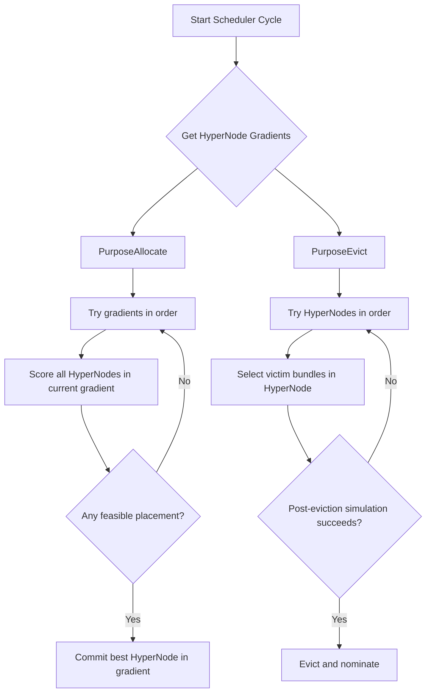
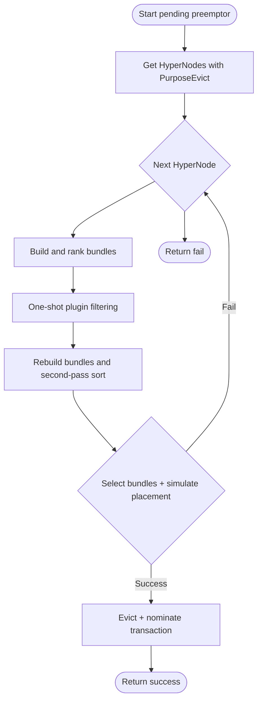

# Gang-Aware Eviction Design

[@vzhou-p](https://github.com/vzhou-p); Mar 18, 2026

## Summary

The design introduces a HyperNode-first search pipeline, a bundle-based victim model, and an adapter that reuses existing task-oriented eviction plugins without breaking current plugin contracts.

## Motivation

The current scheduling actions are strong in isolation but inconsistent together. `allocate` is topology-aware through HyperNodes, while `preempt` and `reclaim` still decide victims mostly task by task. As a result, a scheduler cycle can evict one task from many different gangs, creating wide disruption without guaranteeing that the target gang can be placed afterward.

There is also a topology gap. For jobs with network-topology constraints, current eviction paths can still pick victims across nodes without first committing to a coherent HyperNode. This makes eviction expensive and unpredictable for gang-style jobs that need coordinated placement.

The proposal therefore treats the question in two parts. First, where should the scheduler search for allocation and eviction? Second, who should it evict? The answer to the first question comes from HyperNode gradients, and the answer to the second comes from gang-aware bundles.

## Goals and Non-Goals

The primary goal is to make eviction decisions topology-aware and gang-aware at the same time, while preserving existing plugin compatibility and keeping scheduler latency bounded. The design should let `allocate`, `preempt`, and `reclaim` share the same HyperNode constraint model, even if their optimization targets remain different.

A second goal is incremental adoption. Existing clusters should continue to run legacy behavior unless the new path is enabled explicitly by configuration.

This design does not attempt a full rewrite of all plugins into job-level interfaces. It also does not aim to fully merge and unify the legacy `preempt` and `reclaim` actions with the new design.

## Design Overview

The execution model is a two-stage pipeline.

In Stage 1, the scheduler asks topology plugins for ordered HyperNode gradients and uses them to reduce the search space. Each HyperNode is one search unit, and all allocation or eviction decisions for a job are evaluated within a single HyperNode at a time. Each HyperNode maps to concrete nodes through `ssn.RealNodesList`.

In Stage 2, the scheduler runs action-specific logic inside those HyperNodes. For allocation, the scheduler iterates HyperNode gradients in preferred order. Within each gradient, it evaluates all HyperNodes and picks the best HyperNode in that gradient; if no feasible allocation is found, it continues to the next gradient. For eviction (`preempt` and `reclaim`), it tries HyperNodes in order and stops when one HyperNode yields a valid victim set plus a feasible post-eviction placement.

This preserves existing behavior where possible, but turns topology from a late check into an upfront constraint.


```mermaid
graph TD
    Start[Start Scheduler Cycle] --> G{Get HyperNode Gradients}
    G --> A[PurposeAllocate]
    G --> E[PurposeEvict]
    A --> AG[Try gradients in order]
    AG --> AH[Score all HyperNodes in current gradient]
    AH --> AC{Any feasible placement?}
    AC -- Yes --> AS[Commit best HyperNode in gradient]
    AC -- No --> AG
    E --> EL[Try HyperNodes in order]
    EL --> ES[Select victim bundles in HyperNode]
    ES --> EP{Post-eviction simulation succeeds?}
    EP -- Yes --> EC[Evict and nominate]
    EP -- No --> EL
```

## API and Framework Change

To let the same topology API serve both allocation and eviction, the gradient callbacks are extended with an explicit search purpose:

```go
// pkg/scheduler/api/types.go
type SearchPurpose int

const (
	PurposeAllocate SearchPurpose = iota
	PurposeEvict
)

type HyperNodeGradientForJobFn func(job *JobInfo, hyperNode *HyperNodeInfo, purpose SearchPurpose) [][]*HyperNodeInfo

type HyperNodeGradientForSubJobFn func(subJob *SubJobInfo, hyperNode *HyperNodeInfo, purpose SearchPurpose) [][]*HyperNodeInfo
```

With this contract, plugins can return broader gradients for `PurposeAllocate` and a bounded Top-K set for `PurposeEvict`. The first enabled plugin that registers the function still defines the gradient result, and plugins in lower tiers that also register the function will be ignored.

For both `HyperNodeGradientForJobFn` and `HyperNodeGradientForSubJobFn`, the return type `[][]*HyperNodeInfo` has a two-level ordering contract. The outer slice is an ordered list of gradients, and each inner slice contains HyperNodes at the same preference level.

For `PurposeAllocate`, gradients are formed by HyperNode tier and sorted in ascending tier order. This means tighter topology scopes are tried first, while broader scopes are used as fallback. Inside a gradient, allocation evaluates all HyperNodes and selects the best one by scoring rather than by list position.

For `PurposeEvict`, ordering should favor feasibility and latency. Gradients are still tier-based, but traversed in descending tier order so broader HyperNodes are considered earlier for victim search when needed. HyperNodes within each gradient should also be sorted by feasibility score, for example by available resources in the target HyperNode.

## Dedicated Actions: gangPreempt and gangReclaim

Instead of extending the current actions, this design introduces two dedicated actions: `gangPreempt` and `gangReclaim`. The existing `preempt` and `reclaim` actions remain unchanged, while gang-aware behavior is isolated in the new actions for cleaner rollout and lower regression risk.

```yaml
actions: "allocate, backfill, gangPreempt, gangReclaim"
tiers:
  - plugins:
      - name: gang
      - name: priority
      - name: drf
      - name: predicates
      - name: nodeorder
      - name: binpack
```

With this model, gang-aware execution does not share control flow with task-centric legacy loops in the same cycle. Users opt in by selecting `gangPreempt` and `gangReclaim` in the action chain. The new actions must not be configured together with legacy `preempt` and `reclaim` in the same scheduler action list.

## HyperNode-Scoped Eviction Flow

For each pending preemptor gang, the action starts by fetching ordered topology HyperNodes with `PurposeEvict`. The plugin can already cap this set to control latency. HyperNodes are then processed greedily in order.

Inside each HyperNode, victim selection is based on the HyperNode-wide footprint of candidate jobs. Candidate tasks are grouped into bundles per job:

A bundle is the smallest eviction selection unit in this action: once selected, its tasks are evicted together as one decision, and its disruption cost is evaluated at bundle scope rather than task scope.

- A safe bundle contains surplus tasks, or tasks from gangs already below their effective availability target.
- A whole bundle contains core tasks whose eviction implies breaking the gang.

Note that a task in a candidate job is either in its safe bundle or its whole bundle. This split gives the action an explicit disruption model. Safe bundles are low-cost opportunities. Whole bundles are high-cost decisions that are considered only when safe opportunities are insufficient.

Bundle ordering is performed in two passes for each HyperNode.

In the first pass, the scheduler sorts all raw bundles and then flattens them into an ordered task slice for plugin filtering. It calls `Reclaimable` or `Preemptable` exactly once per HyperNode with that ordered slice. This one-shot call is important for stateful plugins such as the `capacity` plugin; repeated per-job calls would reset internal accounting and can violate queue deserved guarantees.

After plugins return allowed tasks, the action rebuilds valid bundles with integrity rules: a whole bundle is kept only if all of its tasks remain allowed, while a safe bundle can be shrunk to its allowed subset.

In the second pass, the scheduler re-sorts the rebuilt bundle list before final selection. This second sort is required because plugin filtering can remove or shrink bundles, which changes their effective value and relative priority.

After second-pass sorting, victim bundles are selected incrementally in order. The action adds bundles one by one and tracks cumulative resources to be released. When `(HyperNode currently available resources + cumulative released resources)` is enough to cover the preemptor job's total resource request, the action runs placement simulation with the current victim set.

If simulation succeeds, the action determines placement nodes for the preemptor tasks in that HyperNode, then executes eviction and nomination in one transaction and returns success. If simulation fails, the action keeps selecting the next bundle and retries. If all bundles are exhausted without a successful simulation, the current HyperNode is considered invalid for eviction and the action moves to the next HyperNode.

For faster iteration in the first rollout, victim selection can run in Job-level mode, where each candidate job is treated as a single whole bundle and the same two-pass sorting, plugin filtering, simulation, and nomination flow is reused without the safe/whole split step. This reduces implementation complexity and rollout risk while keeping behavior deterministic. A per-job configuration can also be provided to opt out of bundle splitting so the selected job is always treated as one whole bundle. A later phase can enable full bundle splitting by default to improve disruption efficiency once the core path is stable.


```mermaid
flowchart TB
    S([Start pending preemptor]) --> H[Get HyperNodes with PurposeEvict]
    H --> L{Next HyperNode}
    L --> B[Build and rank bundles]
    B --> F[One-shot plugin filtering]
    F --> R[Rebuild bundles and second-pass sort]
    R --> P{Select bundles + simulate placement}
    P -- Success --> C[Evict + nominate transaction]
    C --> OK([Return success])
    P -- Fail --> L
    L --> X([Return fail])
```

## Why Nomination Matters

Gang-aware eviction must reserve outcome, not just free capacity. If the action evicts victims but does not pipeline target tasks onto the intended nodes, later cycles can consume those nodes with unrelated tasks and leave the gang still blocked.

The design therefore treats nomination (`.status.nominatedNodeName`) as part of correctness. Eviction and nomination are committed together so the next allocation cycle can honor the intended placement and preserve HyperNode coherence.

## Scoring and Ordering Strategy

Both sorting passes use the same comparator family, but on different inputs. The first pass ranks raw bundles before plugin filtering. The second pass ranks plugin-validated bundles after whole-bundle drops and safe-bundle shrinking. Using the same ordering logic in both passes keeps behavior predictable while still adapting to post-filter changes.

The comparator applies a fixed order. It prefers safe bundles over whole bundles, then applies queue-level fairness or priority depending on action type. For remaining ties, it applies an efficiency metric that compares local gain in the chosen HyperNode against global disruption of the victim job.

A practical way to read the efficiency metric is "how much local relief do we get per unit of global disruption."

For each resource dimension the preemptor actually requests (for example CPU, memory, or GPU), the scheduler compares two quantities from the candidate bundle. `Local` is what the bundle frees inside the current HyperNode, which is the immediate gain for this eviction attempt. `Global` is the total disruption cost of selecting that bundle at cluster scope. For a safe bundle, `Global` is usually the sum of the resources of the evicted tasks. For a whole bundle, `Global` includes the full gang-level disruption implied by breaking that victim job.

The score is then computed in three steps:

- `localGain`: add up `min(Local_i, Need_i) / Need_i` across requested dimensions.
- `globalCost`: add up `Global_i / Need_i` across the same requested dimensions.
- `Efficiency = localGain / globalCost`.

Dimensions not requested by the preemptor are skipped in the base score, which keeps the metric preemptor-centric and avoids divide-by-zero cases.

Future work includes two follow-ups. First, in addition to skipping unrequested dimensions in the base score, a later extension can add explicit penalties for evicting bundles that destroy large amounts of unrequested resources. Second, bundle ordering can be extracted as a plugin callback so users can configure comparator precedence, such as whether efficiency is applied before or after priority.

```python
# Pseudo code: SelectGangVictimsInHyperNode
def select_gang_victims_in_hypernode(preemptor, hypernode, candidates, ssn):
    bundles = []

    # Phase 1: build raw bundles for each candidate job.
    for job in candidates:
        local_tasks = tasks_in_hypernode(job, hypernode)
        if not local_tasks:
            continue
        safe_bundle, whole_bundle = split_safe_and_whole(job, local_tasks)
        if safe_bundle:
            bundles.append(safe_bundle)
        if whole_bundle:
            bundles.append(whole_bundle)

    # Phase 2: first-pass sort and one-shot plugin filtering.
    bundles = sort_bundles(bundles, preemptor)  # safe before whole, then policy order
    ordered_tasks = flatten_tasks(bundles)
    allowed = set(filter_eligible_tasks(ssn, preemptor.any_task(), ordered_tasks))

    # Rebuild bundles with integrity rules.
    valid = []
    for b in bundles:
        if b.is_whole():
            if all(t in allowed for t in b.tasks):
                valid.append(b)
        else:
            kept = [t for t in b.tasks if t in allowed]
            if kept:
                b.tasks = kept
                valid.append(b)

    # Phase 3: second-pass sort, then incremental select + simulate.
    valid = sort_bundles(valid, preemptor)
    chosen = []
    released = zero_resource()
    for b in valid:
        chosen.append(b)
        released = add_resource(released, b.local_resource())
        if enough(add_resource(current_free(hypernode), released), preemptor.total_request()):
            if simulate_place(preemptor, hypernode, chosen):
                return chosen, True

    return None, False
```

## `gangPreempt` vs `gangReclaim` Behavior

The two new actions share the same core mechanism but use different comparator orders for bundle sorting.

`gangPreempt` is priority-driven. It chooses lower-priority victims in the relevant queue context and uses efficiency as a secondary optimizer rather than a rule that can override priority.

`gangReclaim` is fairness-driven. It recovers resources from overused queues for under-served queues, with `VictimQueueOrderFn` and reclaimability checks taking precedence. Efficiency and job-level ordering are used only after fairness constraints are satisfied.

This separation keeps existing scheduling semantics clear while letting both actions benefit from the same HyperNode and bundle mechanics.

## Implementation Plan

Phase 1 implements the core gang-aware eviction path end to end.

- Update `HyperNodeGradientForJobFn` and `HyperNodeGradientForSubJobFn` to include `SearchPurpose`, then update framework/session wiring and call sites so purpose is propagated consistently.
- Update `network-topology-aware` to honor purpose-specific ordering: keep allocation-oriented behavior for `PurposeAllocate`, and use eviction-oriented ordering for `PurposeEvict`.
- Add dedicated `gangPreempt` and `gangReclaim` actions, and wire them into action configuration and execution.
- Extract reusable placement logic from `allocate` so post-eviction simulation in gang-aware actions uses the same placement semantics.
- Add bundle utilities for splitting, first-pass sorting, flattening for plugin calls, shrinking/rebuilding after plugin filtering, second-pass sorting, and final selection bookkeeping, and update `gang` plugin `PreemptableFn` and `ReclaimableFn` so whole-bundle eviction can intentionally break a gang when required.

## Future Work

Future work focuses on optimization and flexibility after the core path is stable. The initial rollout can keep Job-level victim selection (one job as one whole bundle) by default or via per-job opt-out from bundle splitting, then move to full safe/whole splitting as the default for better disruption efficiency. The scoring model can be extended with penalties for destroying large amounts of unrequested resources. Bundle comparator precedence can also be extracted into a plugin callback so users can configure whether efficiency is applied before or after priority/fairness keys.
