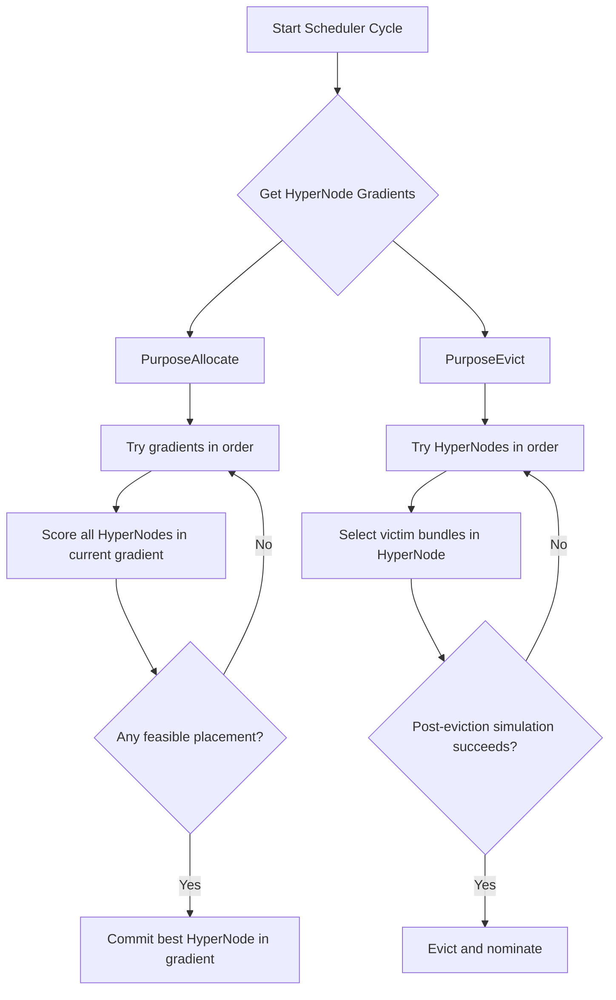
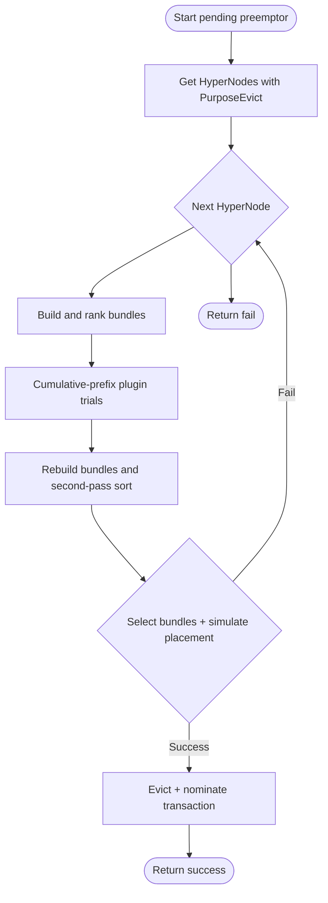

# Gang-Aware Eviction Design

[@vzhou-p](https://github.com/vzhou-p); Mar 18, 2026

## Summary

The design introduces a HyperNode-first search pipeline, a bundle-based victim model, and an adapter that reuses existing task-oriented eviction plugins without breaking current plugin contracts.

## Motivation

The current scheduling actions are strong in isolation but inconsistent together. `allocate` is topology-aware through HyperNodes, while `preempt` and `reclaim` still decide victims mostly task by task. As a result, a scheduler cycle can evict one task from many different gangs, creating wide disruption without guaranteeing that the target gang can be placed afterward.

There is also a topology gap. For jobs with network-topology constraints, current eviction paths can still pick victims across nodes without first committing to a coherent HyperNode. This makes eviction expensive and unpredictable for gang-style jobs that need coordinated placement.

The proposal therefore treats the question in two parts. First, where should the scheduler search for allocation and eviction? Second, who should it evict? The answer to the first question comes from HyperNode gradients, and the answer to the second comes from gang-aware bundles.

## Goals and Non-Goals

The primary goal is to make eviction decisions topology-aware and gang-aware at the same time, while preserving existing plugin compatibility and keeping scheduler latency bounded. The design should let `allocate`, `preempt`, and `reclaim` share the same HyperNode constraint model, even if their optimization targets remain different.

A second goal is incremental adoption. Existing clusters should continue to run legacy behavior unless the new path is enabled explicitly by configuration.

This design does not attempt a full rewrite of all plugins into job-level interfaces. It also does not aim to fully merge and unify the legacy `preempt` and `reclaim` actions with the new design.

## Design Overview

The execution model is a two-stage pipeline.

In Stage 1, the scheduler asks topology plugins for ordered HyperNode gradients and uses them to reduce the search space. Each HyperNode is one search unit, and all allocation or eviction decisions for a job are evaluated within a single HyperNode at a time. Each HyperNode maps to concrete nodes through `ssn.RealNodesList`.

In Stage 2, the scheduler runs action-specific logic inside those HyperNodes. For allocation, the scheduler iterates HyperNode gradients in preferred order. Within each gradient, it evaluates all HyperNodes and picks the best HyperNode in that gradient; if no feasible allocation is found, it continues to the next gradient. For eviction (`preempt` and `reclaim`), it tries HyperNodes in order and stops when one HyperNode yields a valid victim set plus a feasible post-eviction placement.

This preserves existing behavior where possible, but turns topology from a late check into an upfront constraint.


```mermaid
graph TD
    Start[Start Scheduler Cycle] --> G{Get HyperNode Gradients}
    G --> A[PurposeAllocate]
    G --> E[PurposeEvict]
    A --> AG[Try gradients in order]
    AG --> AH[Score all HyperNodes in current gradient]
    AH --> AC{Any feasible placement?}
    AC -- Yes --> AS[Commit best HyperNode in gradient]
    AC -- No --> AG
    E --> EL[Try HyperNodes in order]
    EL --> ES[Select victim bundles in HyperNode]
    ES --> EP{Post-eviction simulation succeeds?}
    EP -- Yes --> EC[Evict and nominate]
    EP -- No --> EL
```

## API and Framework Change

To let the same topology API serve both allocation and eviction, the gradient callbacks are extended with an explicit search purpose:

```go
// pkg/scheduler/api/types.go
type SearchPurpose int

const (
	PurposeAllocate SearchPurpose = iota
	PurposeEvict
)

type HyperNodeGradientForJobFn func(job *JobInfo, hyperNode *HyperNodeInfo, purpose SearchPurpose) [][]*HyperNodeInfo

type HyperNodeGradientForSubJobFn func(subJob *SubJobInfo, hyperNode *HyperNodeInfo, purpose SearchPurpose) [][]*HyperNodeInfo
```

With this contract, plugins can return broader gradients for `PurposeAllocate` and a bounded Top-K set for `PurposeEvict`. The first enabled plugin that registers the function still defines the gradient result, and plugins in lower tiers that also register the function will be ignored.

For both `HyperNodeGradientForJobFn` and `HyperNodeGradientForSubJobFn`, the return type `[][]*HyperNodeInfo` has a two-level ordering contract. The outer slice is an ordered list of gradients, and each inner slice contains HyperNodes at the same preference level.

For `PurposeAllocate`, gradients are formed by HyperNode tier and sorted in ascending tier order. This means tighter topology scopes are tried first, while broader scopes are used as fallback. Inside a gradient, allocation evaluates all HyperNodes and selects the best one by scoring rather than by list position.

For `PurposeEvict`, ordering should favor feasibility and latency. Gradients are still tier-based, but traversed in descending tier order so broader HyperNodes are considered earlier for victim search when needed. HyperNodes within each gradient should also be sorted by feasibility score, for example by available resources in the target HyperNode.

## Dedicated Actions: gangPreempt and gangReclaim

Instead of extending the current actions, this design introduces two dedicated actions: `gangPreempt` and `gangReclaim`. The existing `preempt` and `reclaim` actions remain unchanged, while gang-aware behavior is isolated in the new actions for cleaner rollout and lower regression risk.

```yaml
actions: "allocate, backfill, gangreclaim, gangpreempt"
configurations:
  - name: gangpreempt
    arguments:
      victimOrderPolicy: priority-first
  - name: gangreclaim
    arguments:
      victimOrderPolicy: priority-first
tiers:
  - plugins:
      - name: gang
      - name: priority
      - name: drf
      - name: predicates
      - name: nodeorder
      - name: binpack
```

With this model, gang-aware execution does not share control flow with task-centric legacy loops in the same cycle. Users opt in by selecting `gangPreempt` and `gangReclaim` in the action chain. The new actions must not be configured together with legacy `preempt` and `reclaim` in the same scheduler action list.

## HyperNode-Scoped Eviction Flow

For each pending preemptor gang, the action starts by fetching ordered topology HyperNodes with `PurposeEvict`. The plugin can already cap this set to control latency. HyperNodes are then processed greedily in order.

Inside each HyperNode, victim selection is based on the HyperNode-wide footprint of candidate jobs. Candidate tasks are grouped into bundles per job:

Safe bundles are split into single-task selection units after filtering; Whole bundles remain atomic decisions. "Whole" refers to the candidate core tasks in this HyperNode, not necessarily every pod of the job across the cluster.

- A safe bundle contains surplus tasks, or tasks from gangs already below their effective availability target.
- A whole bundle contains core tasks whose eviction implies breaking the gang.

Each candidate task belongs to either Safe or Whole. Their relative order is controlled by the queue-local policy below; Whole is not a cluster-wide fallback after all Safe tasks.

Bundle ordering is performed in two passes for each HyperNode.

In the first pass, the scheduler sorts raw bundles, skips Whole when disabled, and evaluates candidates through `UnifiedEvictable`. Every trial contains the already accepted prefix plus one Safe task or an entire Whole bundle. A trial is accepted only if all its tasks remain eligible. Rejected trials do not enter the next prefix, so partially approved Whole bundles cannot consume later Safe candidates' allowance.

Each filter invocation evaluates an unchanged session snapshot. Replaying the prefix preserves cumulative quota checks across jobs and queues without persisting rejected trials. The capacity plugin shares its leaf and configured ancestor reclaim checks with legacy reclaim, while preserving gang actions' input order. This prioritizes correctness: replay can evaluate a quadratic number of candidate entries; plugins must not mutate session state during filtering.

In the second pass, the scheduler re-sorts the rebuilt bundle list before final selection. This second sort is required because plugin filtering can remove or shrink bundles, which changes their effective value and relative priority.

Before selecting victims, the action tries a zero-victim placement if current resources can cover the target. Otherwise, after second-pass sorting, it adds one Safe task or one atomic Whole bundle at a time and simulates placement whenever cumulative available resources cover the target.

If simulation succeeds, the action determines placement nodes for the preemptor tasks in that HyperNode, then executes eviction and nomination in one transaction and returns success. If simulation fails, the action keeps selecting the next bundle and retries. If all bundles are exhausted without a successful simulation, the current HyperNode is considered invalid for eviction and the action moves to the next HyperNode.

The target is computed once and reused for queue entitlement checks, resource demand, plugin context (`EvictionContext.TargetTasks`), and simulation. For startup it is the first worksheet prefix that satisfies `JobPipelined` on a private job clone; ordinary jobs can stop within a sub-job, while explicit sub-job policies retain sub-job atomicity. For an already-ready job it is the first worksheet sub-job's pending tasks. Later optional pending tasks do not enlarge the plan. This is an ordered target, not a search over every feasible task subset.

The ordering guarantee is **within each candidate HyperNode**. The first feasible domain and victim prefix win; the scheduler does not globally minimize evictions or compare Whole in one domain against Safe in every other domain.


```mermaid
flowchart TB
    S([Start pending preemptor]) --> H[Get HyperNodes with PurposeEvict]
    H --> L{Next HyperNode}
    L --> B[Build and rank bundles]
    B --> F[Cumulative-prefix plugin trials]
    F --> R[Rebuild bundles and second-pass sort]
    R --> P{Select bundles + simulate placement}
    P -- Success --> C[Evict + nominate transaction]
    C --> OK([Return success])
    P -- Fail --> L
    L --> X([Return fail])
```

## Why Nomination Matters

Gang-aware eviction must reserve outcome, not just free capacity. If the action evicts victims but does not pipeline target tasks onto the intended nodes, later cycles can consume those nodes with unrelated tasks and leave the gang still blocked.

The design therefore treats nomination (`.status.nominatedNodeName`) as part of correctness. Eviction and nomination are committed together so the next allocation cycle can honor the intended placement and preserve HyperNode coherence.

## Scoring and Ordering Strategy

Both sorting passes use the same comparator family, but on different inputs. The first pass ranks raw bundles before plugin filtering. The second pass ranks plugin-validated bundles after whole-bundle drops and safe-bundle shrinking. Using the same ordering logic in both passes keeps behavior predictable while still adapting to post-filter changes.

The `victimOrderPolicy` action argument controls the ordering of workloads and bundle types. It accepts two values:

- `safe-first` is the default. Within a victim queue, it considers Safe bundles before Whole bundles, then prefers lower `JobInfo.Priority`. It prioritizes gang integrity within that queue.
- `priority-first` prefers lower-priority workloads before higher-priority workloads. This allows a lower-priority workload's whole bundle to be used before a higher-priority workload's safe bundle. Within the same priority level, safe bundles remain ahead of whole bundles to avoid unnecessary gang disruption.

The argument is configured independently on `gangpreempt` and `gangreclaim`. An invalid value emits a warning and falls back to `safe-first`.

Both policies put victim queue ordering outermost for `gangreclaim`, grouping tied queues by UID before applying the queue-local policy. `gangpreempt` only considers its own queue. After the policy keys, preemption uses its existing victim job comparator; both actions then use ROI and deterministic identifiers. Equal-priority workloads prefer Safe before Whole across that priority level, rather than exhausting each individual workload.

This changes the previous gang-aware default comparator: reclamation now compares queues before bundle types, and both actions explicitly compare numeric workload priority within each bundle type under `safe-first`. It does not change the legacy task-level `preempt` and `reclaim` actions.

Queue selection and workload selection are separate priority scopes rather than values combined into one global score. `gangreclaim` first uses `QueueOrderFn` to choose which underused queue gets an opportunity to reclaim. With the capacity plugin, a higher `Queue.spec.priority` is scheduled first; queues at the same priority are ordered by their allocated-to-deserved share, with the more underused queue first.

The action then uses `VictimQueueOrderFn` to choose where resources are reclaimed from. In flat capacity mode this falls back to the reverse of `QueueOrderFn`, so a lower-priority victim queue is considered before a higher-priority victim queue and, at equal queue priority, a more overused queue is considered first. Hierarchical capacity may first prefer victim queues according to their relationship to the reclaimer in the queue tree, then uses the same fallback ordering when that relationship ties.

Under either policy, a queue preferred by the victim queue comparator can offer an executable Whole bundle that precedes a more protected queue's Safe bundle. Workload priority and bundle type cannot override victim queue ordering. Both policies remain subject to the existing eligibility and resource checks.

The reclamation ordering model is:

```text
reclaimer QueueOrderFn
-> victim VictimQueueOrderFn
-> queue-local policy:
     safe-first:     Safe/Whole -> workload priority
     priority-first: workload priority -> Safe/Whole
-> ROI
-> deterministic tie-break
```

Resource entitlement and action order are separate from victim ordering. To attempt recovery of deserved resources before replacing lower-priority workloads in the requesting queue, configure `gangreclaim` before `gangpreempt`, as in the example above. Reclamation still requires the existing `PreemptiveFn` resource checks; ordering cannot grant an overused queue additional entitlement. Multi-resource and hierarchical eligibility remain plugin-defined. The actions do not construct a joint plan combining cross-queue reclamation and same-queue preemption.

`allowWholeBundle` remains the separate permission to select Whole bundles. Disabled Whole bundles never enter filtering; rejected Whole trials leave no allowance consumed. Selection stops once resources and placement simulation satisfy the target; neither policy requires clearing a workload or a queue.

A practical way to read the efficiency metric is "how much local relief do we get per unit of global disruption."

For each resource dimension the target requests (for example CPU, memory, or GPU), `Local` measures resources released in the current HyperNode. Whole bundles use the victim job's total resource requests as `Global`, a proxy for the disruption from breaking that job. Safe bundles have no gang-break cost: a zero global cost gives infinite ROI, leaving subsequent tie-breaks to order them.

The score is then computed in three steps:

- `localGain`: add up `min(Local_i, Need_i) / Need_i` across requested dimensions.
- `globalCost`: add up `Global_i / Need_i` across the same requested dimensions.
- `Efficiency = localGain / globalCost`.

Dimensions not requested by the preemptor are skipped in the base score, which keeps the metric preemptor-centric and avoids divide-by-zero cases.

Future work includes two follow-ups. First, in addition to skipping unrequested dimensions in the base score, a later extension can add explicit penalties for evicting bundles that destroy large amounts of unrequested resources. Second, bundle ordering can be extracted as a plugin callback so users can configure comparator precedence, such as whether efficiency is applied before or after priority.

```python
# Pseudo code: SelectGangVictimsInHyperNode
def select_gang_victims_in_hypernode(preemptor, hypernode, candidates, ssn):
    bundles = []

    # Phase 1: build raw bundles for each candidate job.
    for job in candidates:
        local_tasks = tasks_in_hypernode(job, hypernode)
        if not local_tasks:
            continue
        safe_bundle, whole_bundle = split_safe_and_whole(job, local_tasks)
        if safe_bundle:
            bundles.append(safe_bundle)
        if whole_bundle:
            bundles.append(whole_bundle)

    # Phase 2: first-pass sort and cumulative-prefix filtering.
    bundles = sort_bundles(bundles, preemptor, victim_order_policy)
    accepted = []
    valid = []
    for b in bundles:
        if b.is_whole() and not allow_whole_bundle:
            continue
        for unit in ([b] if b.is_whole() else single_task_units(b)):
            trial = accepted + unit.tasks
            allowed = unified_evictable(context_with_target, trial)
            if all(t in allowed for t in trial):
                accepted = trial
                valid.append(unit)

    # Phase 3: second-pass sort, then incremental select + simulate.
    valid = sort_bundles(valid, preemptor, victim_order_policy)
    if enough(current_free(hypernode), target.request()):
        if simulate_place(target, hypernode, []):
            return [], True
    chosen = []
    released = zero_resource()
    for b in valid:
        chosen.append(b)
        released = add_resource(released, b.local_resource())
        if enough(add_resource(current_free(hypernode), released), target.request()):
            if simulate_place(target, hypernode, chosen):
                return chosen, True

    return None, False
```

## `gangPreempt` vs `gangReclaim` Behavior

The two new actions share the same core mechanism but use different comparator orders for bundle sorting.

`gangPreempt` chooses victims in the relevant queue context. With `safe-first`, disruption class precedes numeric workload priority. With `priority-first`, numeric workload priority precedes disruption class. The existing victim job comparator and efficiency cannot override either key.

`gangReclaim` recovers resources from overused queues for under-served queues. Reclaimability checks apply to both policies. Victim queue ordering precedes both workload priority and bundle type; the policy only swaps those two keys within each victim queue.

This separation keeps existing scheduling semantics clear while letting both actions benefit from the same HyperNode and bundle mechanics.

## Implementation Plan

Phase 1 implements the core gang-aware eviction path end to end.

- Update `HyperNodeGradientForJobFn` and `HyperNodeGradientForSubJobFn` to include `SearchPurpose`, then update framework/session wiring and call sites so purpose is propagated consistently.
- Update `network-topology-aware` to honor purpose-specific ordering: keep allocation-oriented behavior for `PurposeAllocate`, and use eviction-oriented ordering for `PurposeEvict`.
- Add dedicated `gangPreempt` and `gangReclaim` actions, and wire them into action configuration and execution.
- Extract reusable placement logic from `allocate` so post-eviction simulation in gang-aware actions uses the same placement semantics.
- Add bundle splitting, queue-local policy sorting, cumulative-prefix filtering, and incremental selection. Gang actions use `UnifiedEvictableFn`; legacy task-level eviction retains its existing hooks.

## Future Work

Future work can reduce cumulative-prefix replay costs, compare plans across domains, or search alternative feasible gang targets. The scoring model can add penalties for unrequested resources, and comparator policy can be extracted into an extension hook. These are separate from the current queue-local ordering contract.
