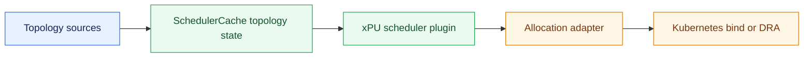
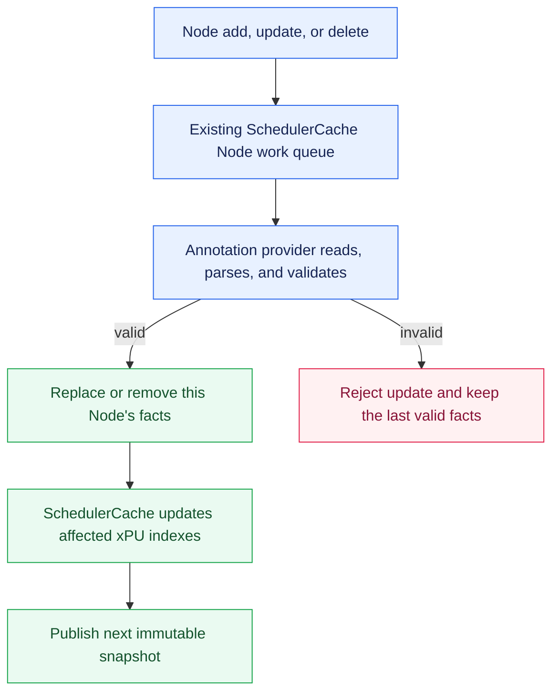
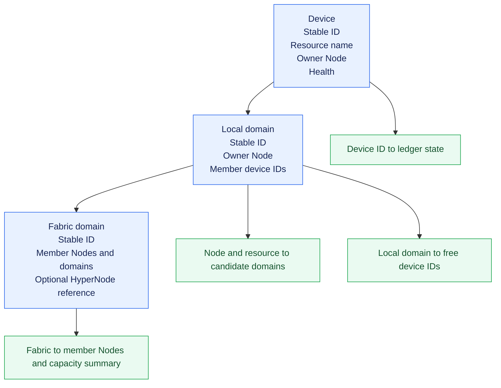
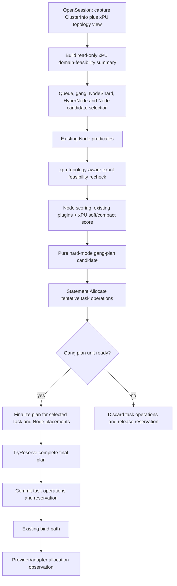
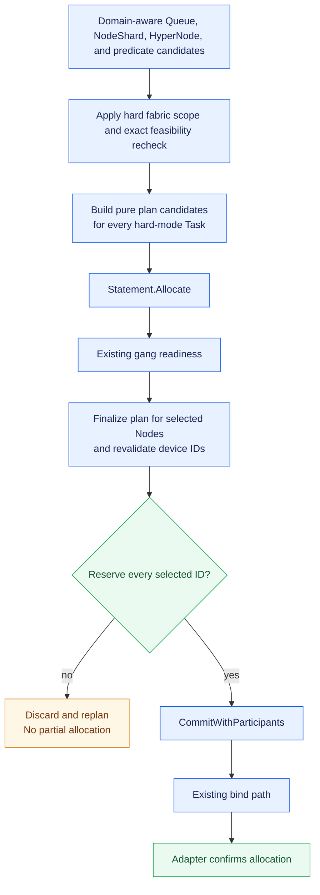
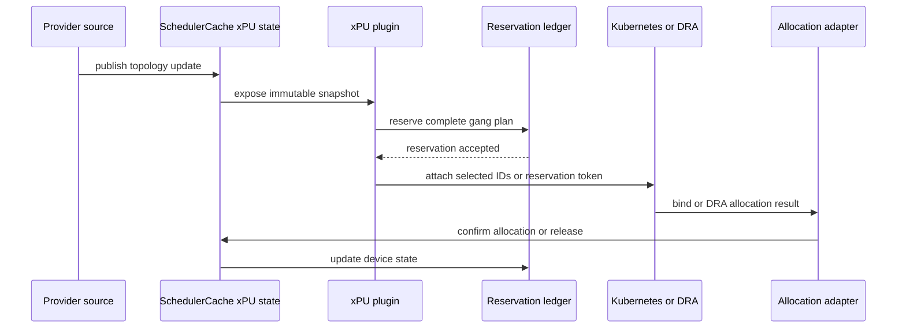

# Generic xPU Topology-Aware Scheduling

**Status:** Proposal

**Author:** Talha Amjad ([@miantalha45](https://github.com/miantalha45))

## Table of Contents

- [Abstract](#abstract)
- [Problem](#problem)
- [Goals](#goals)
- [Non-goals](#non-goals)
- [Architecture](#architecture)
  - [Existing Volcano Building Blocks](#existing-volcano-building-blocks)
  - [Proposed Architecture](#proposed-architecture)
- [Design Details](#design-details)
  - [Provider and Topology Ingestion](#provider-and-topology-ingestion)
    - [Provider Lifecycle and Source Boundary](#provider-lifecycle-and-source-boundary)
      - [Provider Readiness Contract](#provider-readiness-contract)
      - [Initial Node Annotation Contract](#initial-node-annotation-contract)
      - [Annotation Writer Authorization and Validation](#annotation-writer-authorization-and-validation)
    - [Canonical Topology Model](#canonical-topology-model)
    - [Scheduler Cache Topology State and Session Snapshot](#scheduler-cache-topology-state-and-session-snapshot)
    - [Availability and Aggregate Resource Safety](#availability-and-aggregate-resource-safety)
  - [Workload Policy](#workload-policy)
    - [Proposed API Types and Semantics](#proposed-api-types-and-semantics)
    - [Admission Webhook Validation](#admission-webhook-validation)
  - [Providers and Allocation Adapters](#providers-and-allocation-adapters)
    - [Allocation Adapter Contract](#allocation-adapter-contract)
    - [Resource Ownership and DeviceShare Coexistence](#resource-ownership-and-deviceshare-coexistence)
  - [Scheduling and Gang Reservation](#scheduling-and-gang-reservation)
    - [Per-Task Filter and Score](#per-task-filter-and-score)
    - [Plugin Responsibilities and Boundaries](#plugin-responsibilities-and-boundaries)
    - [Scheduling Pipeline and Existing Component Integration](#scheduling-pipeline-and-existing-component-integration)
    - [Proposed Plugin and GangPlan Contracts](#proposed-plugin-and-gangplan-contracts)
    - [Gang Planning Flow](#gang-planning-flow)
    - [Transaction Participant Contract](#transaction-participant-contract)
  - [Topology Cases](#topology-cases)
  - [Lifecycle and Recovery](#lifecycle-and-recovery)
    - [Failure and Retry Semantics](#failure-and-retry-semantics)
      - [PodGroup Failure Reporting](#podgroup-failure-reporting)
  - [Performance and Observability](#performance-and-observability)
  - [Compatibility and Security](#compatibility-and-security)
- [Delivery and Review](#delivery-and-review)
  - [Implementation Map](#implementation-map)
    - [Alpha Scope Boundary](#alpha-scope-boundary)
  - [Rollout and Implementation Phases](#rollout-and-implementation-phases)
  - [Validation Plan](#validation-plan)
  - [Open Questions for Review](#open-questions-for-review)
  - [References](#references)

## Abstract

Volcano currently schedules accelerators primarily as aggregate Node resources. That works only when all free devices on a Node are interchangeable. Communication-heavy AI workloads instead depend on the physical interconnect between devices: eight free devices may be unusable for an eight-device Pod when they are split across two independent device domains.

This proposal adds an optional, vendor-neutral xPU topology layer to Volcano. It separates topology discovery, scheduling policy, and runtime allocation enforcement:



The initial implementation is deliberately narrow: full devices, Node-local domains, an annotation or mock provider, and feature-gated behavior. The same model can later support topology CRDs, Device Plugin companions, DRA `ResourceSlice`s, and declared cross-Node fabrics without changing the workload API or scheduling policy.

## Problem

Aggregate accelerator counts do not describe communication topology. Consider a 16-NPU Node with two independent eight-NPU HCCS domains:

```text
Node A
├── domain A0: 6 free NPUs
└── domain A1: 2 free NPUs

aggregate free NPUs: 8
largest connected free domain: 6
```

An eight-NPU Pod that requires one connected domain cannot run on this Node, despite the aggregate resource check succeeding. The same issue occurs with separate NVLink-connected GPU groups, NVSwitch domains, MetaXLink domains, and similar xPU interconnects.

Volcano must also distinguish ordinary multi-Node clusters from rack-scale fabrics:

```text
Ordinary multi-Node cluster              Declared rack-scale xPU fabric
---------------------------              ------------------------------
Node A: local domain                     Node A ─┐
Node B: local domain                             ├─ one physical fabric
Node C: local domain                     Node C ─┘

Network links connect Nodes.             The provider declares a real xPU fabric.
Local domains stay independent.          Pods may share one fabric across Nodes.
```

Free devices on ordinary Nodes must not be treated as one shared xPU domain. A Device Plugin's kubelet-side `GetPreferredAllocation` is insufficient because it runs after Node selection and cannot reject fragmented Nodes, coordinate a PodGroup, or reserve IDs across concurrent scheduling attempts.

## Goals

1. Make physical device domains and availability visible before binding.
2. Support hard and soft local-domain and fabric affinity.
3. Prefer compact allocations that avoid avoidable device fragmentation.
4. Plan and reserve all devices for a gang unit before any Pod in that plan binds.
5. Keep provider parsing independent from scheduling policy and enforcement.
6. Reconcile device health, allocation, reservation, release, and restart state.
7. Preserve existing scheduling behavior when the feature is disabled.
8. Keep the scheduling path indexed and bounded, do not scan all cluster devices for every scheduling attempt.

## Non-goals

The first milestone does not implement vendor discovery, device configuration, NCCL ring construction, MIG/vGPU/fractional-device allocation, topology-aware victim selection, or SubGroup-level xPU policies. It does not replace DRA, Device Plugins, `deviceshare`, HyperNodes, or aggregate Kubernetes resource accounting. It also does not infer topology from device indices, PCI addresses, or aggregate capacity: providers must publish explicit topology facts.

Existing `preempt` and `gangpreempt` actions remain supported and may evict Pods holding xPU devices. The alpha only defers using xPU topology to choose victims or to change existing preemption policy. Eviction, like completion and deletion, must be observed by the topology allocation lifecycle so that it cannot leak a device reservation or allocation.

Kubernetes binds Pods independently and provides no operation that binds or unbinds a whole gang atomically. The proposed transaction boundary is therefore before bind dispatch: it either reserves every selected xPU ID and prepares and accepts every gang member's bind context, or rolls back all tentative Task, Node, and reservation changes without dispatching any context. After dispatch, one Pod can bind successfully while another fails. Kubernetes cannot automatically unbind the successful Pod, so the adapter reconciles every individual bind result and retains uncertain device IDs as unavailable until it confirms allocation or release.

## Architecture

### Existing Volcano Building Blocks

| Component | Existing responsibility | Role in this design |
| --- | --- | --- |
| `HyperNode` and `network-topology-aware` | Network hierarchy, gradients, and placement scoring. | Provides network locality, does not store per-device state. |
| `NodeInfo.Others` and `SharedDevicePool` | Implementation-specific per-Node device state. | Existing device-share implementations remain independent unless adapted safely. |
| `deviceshare` | Device filtering, scoring, allocation, and release for supported pools. | Is not replaced or double-accounted by the new plugin. |
| `predicates` and upstream DRA plugin | DRA filter, score, reserve, and prebind integration. | Remains the owner of DRA lifecycle and cycle state. |
| `allocate` and `Statement` | Tentative Node/task allocations, gang readiness, commit, and discard. | Hosts the proposed coordinated gang-plan and reservation lifecycle. |

The design builds on `SchedulerCache.Snapshot()`, `Session.AddPredicateFn`, `Session.AddNodeOrderFn`/`AddBatchNodeOrderFn`, the existing `allocate` action, and `Statement` rollback. It does not create a parallel scheduler path.

Existing HAMi Ascend910 selection uses vendor-specific `CustomInfo["NetworkID"]` to group candidate devices and take devices from the largest available local network group first. Its `FilterNode`, score, and allocation paths each run that vendor selection independently. This is a best-effort, Node-local heuristic: it can fall back across groups and does not carry a scheduler-selected plan into allocation. It does not provide a vendor-neutral domain model, a `hard` same-domain guarantee, cross-Node fabric support, exact-ID reservation, or gang-wide planning. The proposed xPU topology feature generalizes that scheduling intent without changing existing HAMi behavior in its alpha scope.

### Proposed Architecture

```mermaid
flowchart LR
    Sources[Trusted topology sources] --> Provider[Provider]
    Provider --> Snapshot[Canonical topology snapshot]
    Snapshot --> Plugin[xPU topology plugin]
    Plugin --> Decisions[Filter, score, and gang plan]
    Decisions --> Ledger[Reservation ledger]
    Ledger --> Adapter[Allocation adapter]
    Adapter --> Runtime[Kubernetes bind or DRA]
    Runtime --> Observe[Allocation and release observation]
    Observe --> Ledger

    classDef source fill:#e8f1ff,stroke:#2563eb,color:#172554
    classDef scheduler fill:#eafaf1,stroke:#16a34a,color:#14532d
    classDef runtime fill:#fff7e6,stroke:#d97706,color:#78350f
    class Sources,Provider source
    class Snapshot,Plugin,Decisions,Ledger scheduler
    class Adapter,Runtime,Observe runtime
```



The architecture separates source normalization, scheduler-owned state, scheduling policy, and runtime enforcement. Providers publish facts, `SchedulerCache` owns immutable xPU views and reservations, the plugin makes placement decisions, and the adapter enforces selected IDs. The remaining sections define those contracts in detail.

## Design Details

### Provider and Topology Ingestion

#### Provider Lifecycle and Source Boundary

Providers are responsible only for consuming topology facts. They do not discover hardware, configure devices, or invent a topology from aggregate Node capacity. The component that owns the hardware inventory (an administrator, vendor operator, Device Plugin companion, or DRA driver) publishes facts, the provider validates and forwards them.

The allocation backend is not required to expose topology itself. If a backend has no per-device domain model, another trusted source may publish the domain facts, provided the resulting device identities can be mapped unambiguously to the devices understood by the allocation adapter.

The alpha implementation has two providers:

| Provider | Purpose | Data path |
| --- | --- | --- |
| Node annotation provider | Production-shaped initial integration. | Kubernetes Node informer -> annotation parser -> validated provider update. |
| Mock provider | Unit, integration, and KWOK topology scenarios. | Test fixture -> validated provider update. |

Topology CRD, Device Plugin companion, vendor API, and DRA `ResourceSlice` providers are explicitly deferred. They must implement the same provider contract, not add source-specific branches to the scheduler plugin.

The annotation provider reuses the scheduler cache's existing Node informer. It does not create a second Node watch. A Node add, update, or delete is already queued by `SchedulerCache`, while the cache synchronizes that Node, the provider reads the configured annotation, parses it, and submits a replace-or-delete update for that Node. Parsing and validation run in the cache work path before taking the `SchedulerCache` mutex so a large or invalid annotation cannot delay event delivery or hold the scheduler cache lock. Per-provider, per-Node UID work is serialized so only a validated final result reaches `SchedulerCache`.

Every provider also has a liveness-refresh obligation. It must submit a current update for a published fact set before its `effectiveFreshUntil`, even when topology content did not change. For the annotation provider, the trusted publisher renews `observedAt` and optional `freshUntil` by patching the inventory annotation, which produces an ordinary Node update. The recommended refresh interval is no greater than half of `providerMaxAge`. A missed refresh makes the facts stale for `hard` placement, while `soft` placement simply loses its topology bonus.

Provider readiness is separate from ordinary Node readiness. `SchedulerCache` starts xPU topology state from an empty, explicitly not-ready source state, accepts only a fully validated initial provider sync, and then publishes topology revisions. A `hard` request must remain pending with `XPUTopologyDataNotReady` until its configured provider has completed initial sync for the relevant Node or fabric. It must never be admitted merely because the Kubernetes Node object arrived before the provider or its configuration was ready. Provider initialization must not depend on legacy DeviceShare feature flags or the order in which `NodeInfo` happened to be constructed.

##### Provider Readiness Contract

`SchedulerCache` tracks provider readiness separately for every configured provider and Node UID:

```text
provider ID + Node UID -> Pending | Synced
```

`Pending` is the default state when the cache first learns about a Node UID. A Node name is lookup and display data, not the canonical lifecycle identity. If a Node with the same name has a different UID, the cache removes the old UID's facts and readiness before that new Node can enter candidate indexes, then starts the new UID at `Pending`. The annotation provider must emit one initial result after it has examined that Node's configured annotation:

| Initial result | Cache action | Readiness result |
| --- | --- | --- |
| Valid `ReplaceFacts` | Atomically replace the provider's complete facts for that Node. | `Synced` |
| Valid `ClearFacts` | Atomically remove that provider's facts for the Node because no annotation is configured. | `Synced` |
| Invalid payload or source error | Keep the last accepted facts, record the structured error, and do not mark an initially pending Node as synced. | `Pending` |

`ClearFacts` is important because it proves the provider examined the Node and found no topology inventory. A `hard` workload on that Node can then receive an ordinary no-matching-topology fit result rather than waiting forever for data that does not exist.

Every provider update carries the provider ID, Node name and UID, the Kubernetes Node `resourceVersion` observed by the provider, observation time, operation, and the complete Node fact set for `ReplaceFacts`. `ReplaceFacts` also carries a source generation. `NodeUID` distinguishes deletion and recreation of a Node with the same name. `NodeResourceVersion` is present even for `ClearFacts`, where no annotation generation exists.

For one provider and Node UID, `SourceGeneration` is a strictly increasing unsigned integer for **topology content**. The provider increments it when device identity, ownership, resource name, local-domain membership, fabric membership, or health changes. `ObservedAt`, `FreshUntil`, and Kubernetes `resourceVersion` are liveness or delivery metadata, not topology content. The cache accepts a repeated generation only when the normalized topology content is identical, allowing only those metadata fields to advance. Any other change with a repeated generation reports `GenerationReuseWithDifferentFacts`. A recreated Node starts a new generation sequence because its UID differs. Provider clocks and `ObservedAt` are not used to order topology updates.

A metadata-only heartbeat publishes a new immutable snapshot with its new effective freshness deadline, but it does not rerun adapter topology validation or rebuild unchanged device and domain indexes. This preserves the distinction between a liveness refresh and a hardware-topology change.

The cache serializes work per provider and Node. It records the newest Node UID and `resourceVersion` seen from the informer, and accepts an update only when those values still match the latest observed Node. It never compares Kubernetes resource-version strings numerically because they are opaque. This prevents a delayed `ClearFacts` result from deleting a newer annotation result. Within the same Node object, the provider's source generation rejects stale or contradictory source data.

Initial readiness is cache-owned rather than provider-owned. When the provider returns one valid, current update for a `Pending` provider and Node pair, the cache applies the update and then atomically transitions that pair to `Synced`. A later valid update keeps an already synced pair in `Synced`. A provider error cannot complete initial sync.

```go
type ProviderNodeUpdate struct {
	ProviderID          string
	NodeName            string
	NodeUID             types.UID
	NodeResourceVersion string
	SourceGeneration    uint64 // topology-content generation per provider and Node UID, zero for ClearFacts
	ObservedAt          time.Time
	FreshUntil          time.Time // optional source freshness deadline
	Operation           ProviderUpdateOperation // ReplaceFacts or ClearFacts
	Facts               *NodeTopologyFacts      // complete source-owned facts for ReplaceFacts
}
```

The following simplified annotation provider shows how the cache obtains one valid initial result for a Node. It is illustrative, not the final production interface for every possible provider source:

```go
// NodeTopologyProvider converts one Node's source-specific topology data into
// a validated provider update for SchedulerCache topology state.
type NodeTopologyProvider interface {
	// ID identifies the configured provider implementation.
	ID() string
	// SyncNode examines one Node and returns its complete current result.
	SyncNode(ctx context.Context, node *corev1.Node) (ProviderNodeUpdate, error)
}

// AnnotationProvider reads the trusted xPU inventory annotation from Nodes.
type AnnotationProvider struct{}

func (p *AnnotationProvider) ID() string {
	return "annotation"
}

func (p *AnnotationProvider) SyncNode(_ context.Context, node *corev1.Node) (ProviderNodeUpdate, error) {
	rawInventory := node.Annotations["topology.volcano.sh/xpu-inventory"]
	if rawInventory == "" {
		// The provider checked this Node successfully but found no inventory.
		return ProviderNodeUpdate{
			ProviderID:          p.ID(),
			NodeName:            node.Name,
			NodeUID:             node.UID,
			NodeResourceVersion: node.ResourceVersion,
			ObservedAt:          time.Now(),
			Operation:           ClearFacts,
		}, nil
	}

	// Parsing also validates ownership, IDs, domains, and source generation.
	facts, sourceGeneration, observedAt, err := parseAndValidateNodeFacts(rawInventory, node.Name)
	if err != nil {
		// No update is returned, so an initially pending Node stays pending.
		return ProviderNodeUpdate{}, err
	}

	// The cache coordinator marks a current Pending Node as initially synced.
	return ProviderNodeUpdate{
		ProviderID:          p.ID(),
		NodeName:            node.Name,
		NodeUID:             node.UID,
		NodeResourceVersion: node.ResourceVersion,
		SourceGeneration:    sourceGeneration,
		ObservedAt:          observedAt,
		Operation:           ReplaceFacts,
		Facts:               facts,
	}, nil
}
```

An invalid annotation returns a typed provider error instead of an update, so the caller records the provider ID, Node UID, observed resource version, source generation when available, and a reason code such as `MalformedPayload` or `StaleGeneration`. An initially pending Node remains unsynced. A later valid update for an already synced Node keeps that pair in `Synced`. A valid annotation heartbeat keeps the same source generation when its topology content is unchanged and advances only the liveness metadata.

When it applies a valid update, the cache stamps the immutable `NodeTopologyFacts` metadata from `ProviderNodeUpdate`: provider ID, Node identity, source generation, observation time, and freshness deadline. It rejects a provider payload that attempts to supply conflicting metadata inside `Facts`.

After the first successful sync, a later invalid update retains the last valid facts and leaves the Node in `Synced` state, while provider age and error metrics expose the problem. Normal freshness rules still make stale data unavailable for `hard` policies. When a Kubernetes Node is deleted or leaves this scheduler's NodeShard or selector scope, the cache removes it from topology candidate indexes and invalidates every fabric containing it. Facts for live allocations remain as unavailable tombstones until authoritative reconciliation confirms release.

For a `hard` local-domain request, the plugin checks the configured provider's `Synced` state for the candidate Node from the session snapshot. For a declared cross-Node fabric, it also requires synced state for every member Node and a valid assembled fabric. Otherwise, it returns `XPUTopologyDataNotReady`. The provider does not change Kubernetes `Node.Status`; this is scheduler-internal readiness only.



The annotation schema is versioned and source-owned. The initial schema contains a source generation and timestamp, device records, local-domain membership, optional fabric membership, and health. Every device record identifies its resource name, stable provider device value, and local-domain source value. The surrounding Kubernetes Node supplies ownership; the annotation cannot claim another Node. A local-domain source value is stable only within that Node. The cache constructs its canonical local-domain identity from the configured provider ID, identity namespace, surrounding Node UID, and source value. A fabric source value is unique within the provider identity namespace and names its member Nodes and their local-domain source values. The provider rejects duplicate IDs, a device owned by the wrong Node, unknown domain members, or a device/domain that moves without an explicit source generation change.

For example, a source-specific NVIDIA annotation and an HCCS annotation may use different field names, but both must yield the same provider update: devices with an owner Node and resource name, plus a local domain containing those device IDs. Terms such as `NVLink` and `HCCS` are optional attributes for observability, they are not scheduler control flow.

##### Initial Node Annotation Contract

The annotation provider is the only production-shaped source in the alpha scope. The annotation is an inventory contract for a trusted cluster component, workload users must not be allowed to write it. A representative payload is:

```yaml
metadata:
  annotations:
    topology.volcano.sh/xpu-inventory: |
      {
        "apiVersion": "topology.volcano.sh/v1alpha1",
        "generation": 42,
        "observedAt": "2026-08-04T12:00:00Z",
        "devices": [
          {
            "id": "nvidia://GPU-4c2e",
            "resourceName": "nvidia.com/gpu",
            "localDomain": "nvlink-0",
            "health": "Healthy"
          }
        ],
        "localDomains": [
          {
            "id": "nvlink-0",
            "devices": ["nvidia://GPU-4c2e"]
          }
        ],
        "fabrics": []
      }
```

For a declared cross-Node fabric, one Node is the authoritative fabric owner. The provider includes the owner Node, participating Nodes, and their local domains. For example, the annotation source for `node-a` can publish a fabric whose member facts include `node-b`:

```json
"fabrics": [
  {
    "id": "rack-1/nvlink-fabric-0",
    "ownerNode": "node-a",
    "members": [
      {"node": "node-a", "localDomains": ["nvlink-0"]},
      {"node": "node-b", "localDomains": ["nvlink-0"]}
    ],
    "interconnect": "NVLink"
  }
]
```

The source payload uses Node names only to look up fabric members and local-domain source values only within each named member. When it accepts the owner update, the cache resolves every member to its current Node UID and source generation, then builds each canonical `DeviceDomainID` with that member UID. The resulting canonical fabric stores the resolved membership, not name-derived domain IDs. A fabric ID has exactly one owner for one provider. The cache stamps `FabricDomain.OwnerProviderID`, `OwnerNodeUID`, and `SourceGeneration` from the validated owner update rather than trusting duplicated payload fields. Only an update from that owner can replace or remove the fabric. A member Node publishes its local domains, but must not publish a second declaration of the same fabric ID. Conflicting declarations, an owner outside the member set, or a declaration that changes ownership without an explicit replacement generation are rejected.

The cache accepts the fabric only when every referenced Node and local domain is present in current, synced provider facts. A member Node becoming stale, leaving this scheduler's scope, being deleted, changing UID, or publishing a different source generation makes the fabric unavailable immediately. It must not automatically remap the old fabric declaration to replacement member facts. The owner must publish a newer fabric generation that resolves every member again. A clear or deletion of the owner Node removes the fabric declaration. A normal multi-Node cluster must not publish a fabric merely because its Nodes communicate over Ethernet, InfiniBand, or RoCE.

In the common multi-Node case, each Node publishes only its own local device domains and leaves `fabrics` empty. The Nodes may still be network-connected through an existing HyperNode/rack definition, but that network relationship is not an accelerator fabric:

```text
HyperNode rack-1 (existing network topology)
├── node-a: local domain value nvlink-0 (canonical ID includes node-a UID)
├── node-b: local domain value nvlink-0 (canonical ID includes node-b UID)
└── network: RoCE or InfiniBand

xPU topology facts
├── node-a annotation: fabrics: []
└── node-b annotation: fabrics: []
```

For example, a four-GPU Pod can receive a valid local NVLink group on `node-a` and another Pod can receive a valid local group on `node-b`. The scheduler must not treat those eight GPUs as one same-domain or same-fabric allocation merely because the Nodes can communicate through RoCE or InfiniBand. Network-topology-aware scheduling can still choose an appropriate rack or HyperNode for the PodGroup.

The surrounding Node object supplies the owner Node name and UID, so a device cannot claim a different Node. In an annotation payload, `devices[].id` is only the source-owned device value. The cache constructs its canonical `DeviceID` with the configured provider ID and identity namespace, neither of which is workload- or annotation-controlled. It constructs `DeviceDomainID` with the same provider and namespace plus the surrounding Node UID, so replacement Nodes with the same name cannot collide with an old domain or its allocation tombstone. The provider treats one accepted annotation as the complete topology fact set for that Node and source generation. Removing the annotation removes that source's Node facts, it does not immediately free an allocated device until the availability ledger reconciles an authoritative release.

The provider reports structured errors for malformed JSON, an unsupported schema version, duplicate identities, unknown domain membership, stale generation, or a payload larger than the configured limit. It must never partially apply an invalid Node update.

##### Annotation Writer Authorization and Validation

The Node annotation is a topology assertion, not proof of physical hardware. The alpha deployment must use a dedicated topology publisher identity, such as `system:serviceaccount:volcano-system:xpu-topology-publisher`, backed by a platform-managed controller or vendor integration. The scheduler only reads the annotation. Workload users, ordinary application ServiceAccounts, and the scheduler ServiceAccount must not receive Node write permissions.

The publisher receives only the Node permissions needed to discover and patch topology inventory:

```yaml
rules:
- apiGroups: [""]
  resources: ["nodes"]
  verbs: ["get", "list", "watch", "patch"]
```

Nodes are cluster-scoped, and `patch` permission cannot be limited by RBAC to one annotation key. Therefore, each annotation-provider deployment must also install a fail-closed `ValidatingAdmissionPolicy` or validating webhook that:

1. permits changes to `topology.volcano.sh/xpu-inventory` only from the configured publisher identity;
2. rejects creation, modification, or removal of that key from every other identity, including workload ServiceAccounts; and
3. records denied attempts through Kubernetes audit logging and provider error metrics.

Node authorizer and `NodeRestriction` settings are not a substitute for this application-specific protection. The deployment must not rely on a kubelet's ability to modify its own Node object as authorization to publish xPU topology.

The provider verifies schema and internal consistency, including ownership, stable IDs, domain membership, generation, and matching aggregate Node allocatable capacity. It cannot prove that an arbitrary annotation describes physical hardware. The publisher must obtain facts from an authoritative inventory source, and a `hard` placement still needs a compatible allocation adapter to confirm that the chosen device IDs were actually assigned.

#### Canonical Topology Model

The scheduler stores source-normalized facts separately from scheduling state:

```text
Topology facts:       device IDs, Node ownership, local domains, fabrics, provider-reported health
Availability ledger:  observed allocation, reservation, release, unavailable/tombstone state
Session view:         immutable indexed snapshot at one topology revision
```

The core objects are:



```go
type DeviceID struct {
	ProviderID string
	Namespace  string
	Value      string
}

// DeviceDomainID identifies a Node-local xPU domain. NodeUID prevents a
// replacement Node with the same name from colliding with an old domain.
type DeviceDomainID struct {
	ProviderID string
	Namespace  string
	NodeUID    types.UID
	Value      string
}

// FabricDomainID identifies one provider-owned cross-Node fabric.
type FabricDomainID struct {
	ProviderID string
	Namespace  string
	Value      string
}

type NodeTopologyFacts struct {
	ProviderID          string
    NodeName            string
    NodeUID             types.UID
    NodeResourceVersion string
	SourceGeneration    uint64
	ObservedAt          time.Time
	FreshUntil          time.Time
    Devices             []TopologyDevice
    LocalDomains        []DeviceDomain
    Fabrics             []FabricDomain
}

type TopologyDevice struct {
    ID            DeviceID
    ResourceName  corev1.ResourceName
    NodeName      string
	NodeUID       types.UID
    LocalDomainID DeviceDomainID
    FabricIDs     []FabricDomainID
    Health        DeviceHealth
}

type DeviceDomain struct {
    ID           DeviceDomainID
    NodeName     string
	NodeUID      types.UID
    ResourceName corev1.ResourceName
    DeviceIDs    []DeviceID
}

type FabricMember struct {
    NodeName         string
    NodeUID          types.UID
    SourceGeneration uint64
    LocalDomainIDs   []DeviceDomainID
}

type FabricDomain struct {
    ID                 FabricDomainID
	OwnerProviderID    string
	OwnerNodeUID       types.UID
	SourceGeneration   uint64
    Members            []FabricMember
    HyperNodeReference string // optional network-topology anchor
}
```

Device, domain, and fabric IDs must be stable across provider updates and scheduler restarts. A device ID must not be a transient list index. Its canonical identity is the tuple `{provider ID, identity namespace, device value}`, not a bare vendor string. A local-domain identity is `{provider ID, identity namespace, Node UID, domain value}`; Node name is retained only for lookup and display. A fabric identity is `{provider ID, identity namespace, fabric value}` and its authoritative owner UID is stored separately. `ObservedAt` and `FreshUntil` are retained in each immutable snapshot so `hard` filtering can evaluate freshness from the same view used for planning. The cache calculates `effectiveFreshUntil` as the earlier of `ObservedAt + providerMaxAge` and a non-zero source `FreshUntil`. It rejects a source timestamp that is too far in the future, an expiry before observation, or an invalid timestamp. Fabric provenance and resolved member UID and generation are retained in the canonical object so a snapshot can verify both its single authoritative owner and current member identities without consulting mutable provider state. Contradictory updates, for example one ID assigned to two Nodes, are rejected rather than merged.

The cache maintains indexes for `resource + Node -> local domains`, `resource + domain -> free device IDs`, `fabric -> member Nodes and capacity summary`, and `device ID -> ledger state`. Detailed devices remain outside the `HyperNode` CRD, fabrics may reference a HyperNode only for candidate intersection and observability.

#### Scheduler Cache Topology State and Session Snapshot

xPU topology is scheduler-owned, session-independent state inside the existing `SchedulerCache`. It has two layers:

```text
provider facts                    scheduler-owned availability ledger
--------------                    -----------------------------------
device/domain/fabric identity     observed allocation
source generation and age         active reservation
Node ownership and membership     releasing/unavailable/tombstone state
provider-reported health          reconciliation generation
```

Provider updates replace only the facts owned by that source and affected Node or fabric. They cannot overwrite allocations or reservations. Parsing and source validation occur before taking `SchedulerCache.Mutex`. The cache then verifies the current Node UID and `resourceVersion`, merges the accepted update and ledger state under that same mutex, updates only affected indexes, and publishes a new immutable `TopologySnapshot`. A provider-reported health change is a topology-fact update, and the availability ledger mirrors it by treating the device as unavailable. A snapshot already visible to a scheduling session is never mutated.

An accepted generation may change device membership only when the affected device is free. For a device in `Held`, `Binding`, `Allocated`, or `Unreconciled` state, the cache pins its accepted Node, resource, local-domain, and fabric membership as an allocation tombstone. It applies health changes immediately, but stores a source update that moves, removes, renames, or reassigns that live device as pending and does not expose the new identity through candidate indexes. After authoritative release of the last live reference, the cache applies the newest pending valid generation. This prevents a valid hardware reconfiguration from invalidating an existing reservation or silently reusing the same ID in a different domain.

`SchedulerCache.Snapshot()` captures Nodes, Jobs, Queues, HyperNodes, and the immutable xPU topology view under the existing scheduler-cache mutex. The proposed `ClusterInfo` field holds an immutable snapshot reference, so no device or domain indexes are rebuilt while the lock is held:

```go
type ClusterInfo struct {
    // Existing cluster snapshot fields.
    Nodes      map[string]*NodeInfo
    HyperNodes HyperNodeInfoMap

    // XPUTopology is the immutable xPU facts and availability-index view
    // captured with the rest of this ClusterInfo snapshot.
    XPUTopology *TopologySnapshot
}

type Session struct {
    // Existing session fields copied from ClusterInfo.
    Nodes      map[string]*NodeInfo
    HyperNodes HyperNodeInfoMap

    // XPUTopology is copied from the one ClusterInfo snapshot during session
    // creation and remains immutable for the scheduling session.
    XPUTopology *TopologySnapshot
}
```

`framework.openSession` keeps its existing `cache.Snapshot()` path. It initializes the Session from that one `ClusterInfo` snapshot and copies `ClusterInfo.XPUTopology` to `Session.XPUTopology` with the other snapshot fields. The xPU plugin reads that session field. There is no second topology snapshot, second cache lock, cross-snapshot Node UID/resource-version comparison, or capture retry. Provider updates still validate the current Node UID and `resourceVersion` before publication. A hard request returns `XPUTopologyDataNotReady` when its provider readiness, freshness, health, or enforcement data in this snapshot is unavailable. A soft request continues without an xPU preference. Predicate and score callbacks use this one accepted topology revision for their entire scheduling session, while reservation operations revalidate selected IDs against the live ledger under `SchedulerCache.Mutex` before succeeding.

The scheduler cache exposes operations conceptually equivalent to:

```go
// Snapshot returns ClusterInfo with Nodes, Jobs, HyperNodes, and the current
// immutable xPU topology facts and availability indexes captured together.
Snapshot() *api.ClusterInfo

// ApplyProviderNodeUpdate validates and applies one provider's current facts
// for a Node, then publishes a new topology revision when needed.
ApplyProviderNodeUpdate(update ProviderNodeUpdate) error

// ProviderNodeReadiness returns whether a provider has completed a valid sync
// for one exact Node UID.
ProviderNodeReadiness(providerID string, nodeUID types.UID) ProviderNodeSyncState

// TryReserve atomically verifies that every device in plan is current and free,
// then holds all IDs or none of them.
TryReserve(plan TopologyPlacementPlan) (TopologyReservation, error)

// CommitReservation moves a successfully handed-off reservation into its
// binding lifecycle state.
CommitReservation(reservationID TopologyReservationID) error

// ReleaseReservation removes an unneeded reservation and returns its device
// IDs to the free ledger state when safe.
ReleaseReservation(reservationID TopologyReservationID)

// ReconcileAllocation applies an authoritative backend observation, such as
// device allocation, release, or recovery after a scheduler restart.
ReconcileAllocation(observation AllocationObservation) error
```

These are cache-internal interfaces, not a new user-facing API. `TryReserve` checks that all IDs are healthy, free, current, and part of the planned domain/fabric, it either reserves the entire plan or changes nothing.

#### Availability and Aggregate Resource Safety

For strict full-device scheduling, available device capacity is:

```text
healthy published capacity
  - observed allocations
  - active reservations
  - releasing devices
  - unknown or unhealthy devices
```

`Releasing` devices are not free in the first implementation. If a device disappears while allocated, it remains an unavailable tombstone until authoritative reconciliation confirms release.

Topology augments, but never replaces, normal resource accounting:

```text
eligible task-node pair = normal Kubernetes/Volcano resource fit
                          AND topology-domain/device fit
```

`Statement.Allocate` remains responsible for normal `NodeInfo` resource accounting. The topology ledger reserves device identity only, it must not subtract the same extended resource from `NodeInfo` a second time. For extended-resource providers, published whole-device capacity may not exceed matching Node allocatable capacity. DRA providers perform the equivalent consistency check using ResourceSlice/claim semantics. A disagreement blocks hard scheduling and removes topology preference for soft scheduling until reconciliation succeeds.

Normal Volcano resource fit continues to use the Kubernetes-compatible effective Pod request. The exact xPU alpha deliberately has a narrower input shape so the selected-ID handoff is unambiguous: each planned Pod must request the selected extended resource as an integral whole-device quantity from exactly one regular container. The alpha rejects the resource in init containers, restartable init sidecars, or multiple regular containers. It also rejects a PodGroup whose planned Tasks do not all satisfy this shape for every declared xPU resource. This avoids silently assigning or reusing IDs across container lifecycle phases. A later API may add explicit per-task and per-container targeting once its allocation and lifecycle semantics are designed.

Provider fields describing shared memory, cores, virtual-device count, MIG, or other vendor geometry must not be silently converted into a whole-device record.

### Workload Policy

xPU topology scheduling applies only to Pods whose `spec.schedulerName` is `volcano`. It cannot influence Pods scheduled by Kubernetes `kube-scheduler`. The scheduler reads one canonical `PodGroup.spec.xpuTopology` policy, regardless of the workload controller that created the Pods:

1. A Volcano Job uses typed `spec.xpuTopology`, which the Job controller copies to its generated `PodGroup.spec.xpuTopology`.
2. A user who creates a PodGroup directly sets the same typed `spec.xpuTopology` field.
3. A normal Volcano-scheduled Pod uses the documented `volcano.sh/xpu-topology` annotation. The PodGroup controller parses it as an `XPUTopologySpec` and writes the normalized result to the automatically generated PodGroup.

This lets Deployments, StatefulSets, and other controllers use xPU topology scheduling by setting `schedulerName: volcano` and the xPU annotation in their Pod template. `volcano.sh/group-min-member` defines the gang size when such a workload needs gang-wide xPU planning. A workload without that annotation still receives the existing Volcano scheduling behavior.

The alpha policy applies uniformly to the PodGroup scheduling unit. Every Task admitted under the policy must resolve every declared extended-resource requirement to exactly one regular container with an integral whole-device request. A Task that does not request that resource is not silently skipped, it makes the PodGroup ineligible with `XPUTopologyUnsupportedPodRequest`. Different task-group policies, heterogeneous accelerator Task templates, init-container accelerator requests, and per-container policy targeting are deferred because they require explicit inheritance and allocation-lifecycle semantics. Exact API names and versions require API review, the following Job YAML is illustrative:

```yaml
apiVersion: batch.volcano.sh/v1alpha1
kind: Job
metadata:
  name: local-domain-training
spec:
  schedulerName: volcano
  xpuTopology:
    resources:
    - resource:
        extendedResourceName: nvidia.com/gpu
      mode: hard
      allocationStrategy: Compact
  minAvailable: 1
  tasks:
  - name: worker
    replicas: 1
    template:
      spec:
        containers:
        - name: trainer
          image: example/trainer:latest
          resources:
            requests:
              nvidia.com/gpu: 8
```

The corresponding PodGroup policy applies to the generated worker Pod. It is eligible only if one local domain has eight healthy, free, enforceable devices.

For example, a Deployment can request the same policy for every Pod in its template:

```yaml
apiVersion: apps/v1
kind: Deployment
metadata:
  name: local-domain-training
spec:
  replicas: 8
  template:
    metadata:
      annotations:
        volcano.sh/group-min-member: "8"
        volcano.sh/xpu-topology: >-
          {"resources":[{"resource":{"extendedResourceName":"nvidia.com/gpu"},"mode":"hard","allocationStrategy":"Compact"}]}
    spec:
      schedulerName: volcano
      containers:
      - name: trainer
        image: example/trainer:latest
        resources:
          requests:
            nvidia.com/gpu: 1
```

The annotation value is a serialized `XPUTopologySpec`. The PodGroup controller validates and normalizes it before writing the generated PodGroup field. Every Pod that resolves to the same generated PodGroup must have the same normalized policy. A malformed or conflicting annotation must fail closed rather than producing an incomplete gang policy.

`claimName` is reserved for a future DRA-backed version of this API. It will identify the matching entry in each Pod's `spec.resourceClaims` once Volcano has a compatible ResourceSlice provider and DRA allocation adapter:

```yaml
spec:
  xpuTopology:
    resources:
    - resource:
        claimName: accelerator
      mode: soft
    fabric:
      mode: soft
```

The alpha webhook rejects `claimName` requirements. This avoids accepting an API shape that cannot yet map a DRA claim to stable, enforceable device identities. The future DRA version will require every Pod in the scheduling unit to contain the declared claim alias and will report `XPUClaimNotFound` when it is absent.

> **Alpha limitation:** The DRA example above describes the proposed future API only. It is rejected by the initial implementation.

Defaults are conservative: omitted local-domain affinity means no same-domain constraint, omitted fabric means no fabric constraint, and an omitted `allocationStrategy` adds no xPU-specific packing preference. Hard constraints still apply when configured; the scheduler otherwise uses normal Node ordering and a deterministic topology tie-break. Workloads never name device, domain, fabric, or vendor identifiers.

The webhook validates feature-gate use, one resource selector per requirement, and recognized values. It cannot prove that a runtime adapter can enforce selected IDs, the scheduler rejects a hard request with an explicit reason when no compatible adapter is active.

#### Proposed API Types and Semantics

`xpuTopology` is one optional typed field on `JobSpec` and `PodGroupSpec`. For normal Volcano-scheduled Pods, `volcano.sh/xpu-topology` is the documented serialized form of the same type and is converted to the generated `PodGroupSpec` field by the PodGroup controller. The scheduler reads only the typed PodGroup form. It does not replace existing `networkTopology`, `subGroupPolicy`, Pod `affinity`, or Pod `topologySpreadConstraints`. Those fields continue to express network placement, group membership, and ordinary Kubernetes Pod placement. `xpuTopology` expresses only accelerator-domain intent. Its nested `mode` fields use the same `hard` and `soft` vocabulary as `networkTopology.mode`.

The names and annotation serialization below are proposed for API review. They make the ownership and validation surface concrete. The normal-Pod annotation is an explicit, documented compatibility API, not an additional policy model.

```go
type XPUTopologySpec struct {
    Resources []XPUResourceTopologyRequirement `json:"resources,omitempty"`
    Fabric    *XPUFabricAffinity               `json:"fabric,omitempty"`
}

type XPUResourceTopologyRequirement struct {
    Resource           XPUResourceSelector   `json:"resource"`
    Mode               XPUTopologyMode       `json:"mode,omitempty"`
    AllocationStrategy XPUAllocationStrategy `json:"allocationStrategy,omitempty"`
}

type XPUResourceSelector struct {
    ExtendedResourceName corev1.ResourceName `json:"extendedResourceName,omitempty"`
    ClaimName            string              `json:"claimName,omitempty"`
}

type XPUFabricAffinity struct {
    Mode XPUTopologyMode `json:"mode,omitempty"`
}

// XPUAllocationStrategy is an optional placement preference. It never changes
// hard eligibility or bypasses normal Volcano scoring.
type XPUAllocationStrategy string

const (
    // XPUAllocationStrategyCompact prefers packing placements into the
    // smallest fitting domains to preserve other domains.
    XPUAllocationStrategyCompact XPUAllocationStrategy = "Compact"
)
```

For one requirement, exactly one selector is set:

- `extendedResourceName` identifies a full-device Kubernetes extended resource, such as `nvidia.com/gpu`.
- `claimName` identifies the Pod `resourceClaims` alias for a future DRA-backed workload. It is not accepted in alpha.

The resource and fabric `mode` fields accept `hard` or `soft`. `hard` is a filter and requires an allocation adapter that can enforce the selected device IDs: no matching healthy, enforceable topology means no placement. `soft` is a score only: a normal placement remains valid if no matching domain or exact-ID enforcement is available. `AllocationStrategy` accepts `Compact` or an omitted value. Compact is a preference, never a hard constraint. Omission adds no xPU-specific packing score.

Fabric affinity is deliberately narrow in alpha. A policy that sets `fabric` must contain exactly one resource requirement. That requirement identifies the accelerator resource whose device domains must belong to one fabric selected for the entire gang plan. With `hard` mode, every placement in that plan must use a member Node and local domain of that same fabric. A later API may add an explicit fabric resource selector for multi-resource policies, but the alpha must reject that ambiguous case.

All requirements on a Task are ANDed. For example, a Task requiring a same-domain GPU group and a hard fabric must satisfy both rules. A PodGroup with no `xpuTopology` field receives no topology-specific filter, score, plan, or reservation and follows the existing scheduler behavior.

#### Admission Webhook Validation

The webhook makes invalid intent fail at admission instead of becoming an ambiguous runtime placement failure:

1. Reject a non-empty `xpuTopology` policy unless `XPUTopologyAwareScheduling` is enabled.
2. Require at least one resource requirement and exactly one of `extendedResourceName` or `claimName` in each requirement.
3. Require a valid extended resource name. Reject CPU and memory because the first scope is full accelerator devices, not CPU/NUMA topology.
4. Accept only `hard` or `soft` mode and `Compact` as the initial allocation strategy.
5. Reject duplicate requirements targeting the same resource selector in one policy.
6. Reject `claimName` in alpha. A later DRA-capable version will validate the alias at admission and resolve it against each Task Pod at runtime.
7. Reject a policy that sets `fabric` with anything other than one resource requirement in alpha.
8. Treat `xpuTopology` as create-only in alpha on both the Job and its scheduler-canonical PodGroup. Users create a new Job or controller rollout to change topology intent.
9. Reject a non-empty `volcano.sh/xpu-topology` annotation unless the Pod uses `schedulerName: volcano`. Validate that the annotation decodes to the same schema as `XPUTopologySpec` and that every Pod in an automatically generated PodGroup resolves to the same normalized policy. The PodGroup controller must reject conflicting updates rather than overwriting an existing policy.

The alpha makes this policy create-only because it is an input to filtering, scoring, gang planning, device reservation, and the selected-ID bind handoff. A Job, direct PodGroup, or a set of normal Pods can all produce the same canonical PodGroup policy. Ordinary Kubernetes object updates are not coordinated transactionally with an in-memory scheduling session or a live adapter reservation. For example, changing a hard fabric rule or resource selector after a session created its plan could make its reserved IDs and handoff inconsistent with the persisted policy, or leave one gang with mixed intent. A future mutable-policy API would need a versioned canonical policy, atomic propagation across workload sources, final reservation preflight against that version, and defined release/replan behavior. It is deliberately deferred rather than silently accepting unsafe updates.

The scheduler configuration adds a fail-closed activation check. Startup fails when the feature gate is enabled but `xpu-topology-aware` is absent from the configured tiers, when the plugin is configured while the gate is disabled, or when scheduler replicas have conflicting xPU feature configuration. The admission webhook receives the same feature configuration as the scheduler deployment. If that configuration cannot be read or does not declare the plugin active, it rejects a non-empty policy rather than allowing it to be ignored by a scheduler with no xPU plugin.

The webhook does not validate live topology, device availability, source freshness, or adapter enforcement. Those facts are dynamic and remain scheduler responsibilities.

### Providers and Allocation Adapters

Providers normalize data, adapters determine what the scheduler can safely promise. They are intentionally separate.

| Integration | Provider responsibility | Adapter responsibility |
| --- | --- | --- |
| Node annotation / mock | Publish local devices, domains, fabric membership, and health. | Mock adapter: exact. Annotation alone: observation only. |
| Topology CRD | Publish cluster-managed topology facts. | Depends on its paired adapter. |
| Device Plugin companion | Publish stable inventory, health, and allocation records. | Exact only when the companion accepts a trusted scheduler selection, otherwise soft mode only. |
| DRA `ResourceSlice` | Map driver-published device attributes/capacity to canonical domains. | Exact only if the DRA driver exposes a documented way to honor the selection. |
| Vendor API | Publish vendor-management topology. | Depends on a separate compatible allocation adapter. |

An accepted `ReplaceFacts` update includes a source generation, timestamp, stable objects, and optional freshness deadline. An accepted `ClearFacts` update instead relies on its Node UID and `resourceVersion`. The provider validates schema size, Node ownership, unique IDs, domain membership, fabric references, and source generation. The cache does not merge contradictory device facts from multiple authorities. Stale data makes devices unavailable for hard requests and removes the topology bonus for soft requests.

Plain Device Plugins and kubelet `GetPreferredAllocation` are not a reservation or exact-enforcement interface. Likewise, the xPU plugin must not instantiate a second upstream `DynamicResources` plugin: predicates remains responsible for DRA prefilter, filter, score, reserve, and prebind behavior.

An aggregate-only backend that reports only a quantity such as `node-a has 8 GPUs` is not an exact allocation adapter. Even when an annotation provider publishes stable device IDs and domains, the scheduler cannot prove that the backend recognizes those IDs or will assign the selected set to the Pod. Such a backend is observation-only: it may support soft topology scoring, but a hard topology request must be rejected with `XPUAssignmentNotEnforceable`. Only an adapter that validates stable IDs against the real allocator, reserves them atomically, and confirms the final assignment can enable hard topology.

#### Allocation Adapter Contract

An allocation adapter is the boundary between a scheduler placement plan and the component that actually assigns devices to a container. It must declare whether it supports exact enforcement, pre-bind reservation, and authoritative allocation and release observation. It also declares the one provider ID, resource name, and device-identity namespace that it understands. The plugin enables a hard topology rule only when an adapter reports the capabilities needed to enforce that rule.

```go
// AllocationAdapter bridges a scheduler-selected topology plan to the backend
// that reserves and assigns the actual devices.
type AllocationAdapter interface {
	// Capabilities reports the guarantees the adapter can provide, such as exact
	// selected-ID enforcement and authoritative allocation observation.
	Capabilities() AdapterCapabilities

	// IdentityContract identifies the provider, resource, and device-ID scheme
	// that this adapter can safely enforce.
	IdentityContract() DeviceIdentityContract

	// ValidateTopology confirms that facts use device IDs and topology semantics
	// understood by the allocation backend.
	ValidateTopology(ctx context.Context, facts NodeTopologyFacts) error

	// Reserve atomically holds every selected device in plan or returns an error
	// without partially reserving any device.
	Reserve(ctx context.Context, plan TopologyPlacementPlan) (AdapterReservation, error)

	// PrepareBind creates an immutable, Pod-specific handoff for a previously
	// reserved placement.
	PrepareBind(ctx context.Context, reservation AdapterReservation, placement TopologyTaskPlacement) (AllocationHandoff, error)

	// Confirm returns the backend's authoritative allocation or release result
	// after the bind path has acted on a reservation.
	Confirm(ctx context.Context, reservation AdapterReservation) (AllocationObservation, error)

	// Release removes a backend reservation that will not be used or is no
	// longer needed after a failed scheduling path.
	Release(ctx context.Context, reservation AdapterReservation) error

	// Recover returns active backend reservations and allocations after scheduler
	// startup or leader promotion so the topology ledger can be rebuilt safely.
	Recover(ctx context.Context) ([]AdapterReservationState, error)
}

// DeviceIdentityContract identifies the exact device-ID scheme shared by one
// topology provider and one allocation adapter.
type DeviceIdentityContract struct {
	ProviderID   string              // Configured provider that publishes topology facts.
	ResourceName corev1.ResourceName // Kubernetes resource enforced by this adapter.
	Namespace    string              // Configured device-ID scheme, not a Kubernetes namespace.
}

// AdapterReservation is the backend's durable handle for one accepted plan.
type AdapterReservation struct {
	Token      string // Opaque backend reservation identity.
	PlanDigest string // Immutable digest of the accepted placement plan.
}

// AllocationHandoff carries one reservation's immutable selected-ID context to
// the bind or DRA path for a specific Pod and Node.
type AllocationHandoff struct {
	ReservationToken string    // Backend reservation identity to validate.
	PlanDigest       string    // Digest proving which plan the handoff represents.
	PodUID           types.UID // Exact Pod that may consume this handoff.
	NodeName         string    // Exact Node selected for that Pod.
}

// AdapterReservationState describes a backend reservation or allocation
// recovered after a scheduler restart or leader promotion.
type AdapterReservationState struct {
	Reservation AdapterReservation                // Backend reservation identity and plan digest.
	Plan        TopologyPlacementPlan              // Immutable selected devices and placements.
	State       AdapterReservationLifecycleState   // Current backend reservation lifecycle state.
	ExpiresAt   time.Time                          // Deadline after which an unconfirmed hold expires.
}

// AllocationObservation is the backend's authoritative report that a
// reservation was allocated to, or released from, a particular Pod.
type AllocationObservation struct {
	ReservationToken string                     // Backend reservation identity being reported.
	PlanDigest       string                     // Digest proving which plan the report represents.
	PodUID           types.UID                  // Pod whose allocation state changed.
	State            AllocationObservationState // Allocated or Released.
	ObservedAt       time.Time                  // Time at which the backend observed the change.
}
```

For every proposed placement, the adapter receives the Task or Pod identity, selected Node, local-domain ID, fabric ID when applicable, and concrete device IDs. Its contract is:

1. **Validate and reserve:** accept every selected ID for the plan or reject the request without partially reserving it. Reservations must prevent a concurrent allocation from receiving the same ID and must survive a scheduler restart until they expire or are reconciled.
2. **Prepare an immutable handoff:** create one `AllocationHandoff` for each selected Pod. It binds the reservation token and plan digest to that Pod UID and Node. Repeated preparation for the same reservation and Pod must return the same handoff.
3. **Confirm enforcement:** after the normal bind path, report whether the real allocator assigned the selected IDs to the intended Pod. A successful Node bind alone is not proof of exact device assignment.
4. **Release, recover, and reconcile:** release unconfirmed reservations after discard, bind, prebind, or enforcement failure. `Recover` returns every active backend reservation and confirmed allocation after scheduler startup so `SchedulerCache` can reconstruct safe ledger state. Publish authoritative allocation, release, and health changes so its xPU topology state can converge.
5. **Report a structured failure:** distinguish unsupported exact selection, contention, stale inventory, and allocator failure so the scheduler can retry or expose a useful unschedulable reason.

The scheduler adds a new scheduler-owned `XPUTopologyHandoff` field to the proposed `BindContext` and attaches the `AllocationHandoff` returned for that Pod before the bind batch is accepted. The adapter's pre-bind or DRA integration consumes this opaque handoff and validates its token, plan digest, Pod UID, Node, and container assignments before the runtime receives the request. A workload-writable Pod annotation is not a valid handoff carrier. If an adapter must persist backend-specific information on the Pod, its pre-bind path writes it with scheduler credentials and validates the immutable handoff first.

A filter or scoring calculation may discover candidate IDs, but exact allocation must consume the IDs recorded in the accepted plan or reservation token. It must not rerun a vendor chooser and silently select a different set during `Allocate`. Existing DeviceShare implementations demonstrate annotation carry through the predicate allocation event, but those annotations are not by themselves a generic transactional enforcement protocol.

For hard mode, the adapter must validate and enforce the exact selected IDs. If no such adapter is active, the scheduler rejects the placement rather than presenting a best-effort result as a guarantee. For soft mode, the plugin may use an observation-only adapter: it can score a topology-valid Node or domain, but it must not claim that the final allocator will choose the planned IDs.

#### Resource Ownership and DeviceShare Coexistence

Each accelerator resource must have exactly one exact-allocation owner for a scheduling cycle. The xPU plugin and an existing `deviceshare` backend must not independently reserve, release, or subtract the same physical device IDs, because either path could select a device that the other path has already committed.

| Workload and integration | xPU behavior | Allocation owner |
| --- | --- | --- |
| No `xpuTopology` policy | Does not filter, score, plan, or reserve topology IDs. | Existing `deviceshare`, DRA, or Kubernetes allocation path. |
| `soft` policy with legacy `deviceshare` only | May use current topology facts for a score but creates no exact-ID reservation and makes no exact-ID guarantee. | Existing `deviceshare` backend. |
| `hard` policy with legacy `deviceshare` only | Rejects the placement with `XPUAssignmentNotEnforceable`. | None, a best-effort result must not be presented as hard. |
| `hard` policy with a compatible adapter | Plans and reserves exact IDs, attaches an immutable bind handoff, then requires adapter confirmation. | The configured xPU allocation adapter. |

At plugin initialization, the scheduler validates a single resource-ownership map from resource name to the configured exact-allocation owner. The map also binds that resource to exactly one `DeviceIdentityContract`. A hard xPU request is enabled only when the configured provider ID and identity namespace match the adapter contract, and the adapter has successfully run `ValidateTopology` for every current provider fact set for that resource. The same validation runs before a changed provider fact set becomes enforceable for hard placement. Validation runs outside `SchedulerCache.Mutex`, then `SchedulerCache` rechecks the source generation before publishing the result. A validation failure retains the facts for observation but marks the affected resource unavailable for hard placement. This prevents a provider ID such as `GPU-0` from being mistaken for an unrelated allocator's `GPU-0`.

The topology ledger is not a second allocation owner. It is the scheduler-side concurrency guard, while the adapter remains the only component that can reserve and assign devices in the real backend. An adapter may consume an existing `SharedDevicePool` or backend as an implementation detail only after proving that it shares the same reservation lifecycle and cannot double-account resources.

The first alpha implementation does not make legacy `deviceshare` backends implicit xPU adapters. A future HAMi, NVIDIA, or other DeviceShare adapter must explicitly accept the scheduler-selected IDs or reservation token, prevent the backend from independently choosing conflicting IDs, and reconcile allocation and release through the same ownership path.

### Scheduling and Gang Reservation

#### Per-Task Filter and Score

At session open, the plugin reads the immutable xPU topology view included in `ClusterInfo`. It uses existing session extension points and one proposed candidate-preparation integration as follows:

| Phase | Integration | Effect |
| --- | --- | --- |
| Candidate preparation | Proposed reviewed framework integration | After Queue, gang, and NodeShard scope is known, exposes a read-only domain-feasibility summary to existing HyperNode and Node selection. For hard mode, it removes only Nodes proven to have no fitting domain. For soft mode, it removes no Nodes. |
| Filter | `Session.AddPredicateFn` | Rejects a Node when hard local-domain/fabric, freshness, health, or enforcement conditions fail. |
| Score | `Session.AddNodeOrderFn` or `AddBatchNodeOrderFn` | Adds soft-mode affinity and compact-placement scores after normal eligibility. |
| Gang plan | New framework-owned `GangPlan` hook in `allocate`. | Produces a side-effect-free plan candidate for all Tasks in the unit. |
| Commit/Discard | Proposed `Statement` transaction participant. | Keeps or rolls back topology reservations with the existing tentative allocation. |

For `Compact`, the plugin prefers an exact domain fit, then the smallest domain that fits, before applying existing Node and HyperNode scores. An omitted strategy adds no xPU-specific packing preference. Compact is never a hard constraint by itself.

#### Plugin Responsibilities and Boundaries

`xpu-topology-aware` is an optional scheduler plugin. It adds topology eligibility, topology preference, and coordinated reservations. It does not replace normal Kubernetes resource fit or device allocation systems.

| Scheduler stage | Plugin responsibility | Existing owner that remains authoritative |
| --- | --- | --- |
| Request preparation | Resolve the PodGroup policy and its Pod resource or claim selector. | Webhook validates the policy, predicates resolves standard Pod feasibility. |
| Candidate preparation | After Queue, gang, and NodeShard scope is known, publish a read-only domain-feasibility summary to existing HyperNode and Node selection. The summary contains no reservation or final device assignment. For hard mode, it removes only Nodes proven to have no fitting domain. For soft mode, it removes no Nodes. | HyperNode and Node selection retain ownership of network candidate construction. The integration method requires framework review. |
| Predicate | Check that a candidate Node has a current, healthy, enforceable local domain and, when required, belongs to the selected fabric. | `predicates` and normal Node resource accounting. |
| Node ordering | Prefer matching fabric/locality and compact, less-fragmented domains. | Existing nodeorder and network-topology-aware scores continue to participate. |
| Gang planning | Select all Nodes, local domains, and device IDs for the plan unit. | `allocate` continues to control task allocation order and gang readiness. |
| Reservation | Atomically reserve topology IDs and attach the reservation to the current transaction. | `Statement` remains the owner of normal task/Node mutation. |
| Reconciliation | Observe authoritative allocation/release/health updates and update the ledger. | Provider/adapter source remains authoritative for device state. |

The plugin uses `Session.AddPredicateFn` for final hard eligibility and `Session.AddNodeOrderFn` or `AddBatchNodeOrderFn` for preferences. After Queue, gang, and NodeShard establish the workload scope, the proposed integration exposes domain-related feasibility from the immutable topology snapshot and session ledger view to the existing HyperNode and Node candidate-selection path. For hard mode, that path removes a Node only when the summary proves it has no fitting, healthy, enforceable domain or required fabric membership. For soft mode, it removes no Node and provides score input only. If the summary is unavailable or stale, early candidate selection makes no xPU pruning decision. The later xPU predicate returns `XPUTopologyDataNotReady` for hard mode and removes the topology bonus for soft mode. The exact framework method that carries this summary requires maintainer review, but these ordering and failure semantics are part of the proposed contract. A topology score cannot turn a Node that failed normal predicates into an eligible Node, and a topology plan cannot bypass Queue, DRF, capacity, gang, priority, preemption, NodeShard, or network constraints.

The plugin remains independent of `deviceshare` unless a compatible adapter proves stable device identity and single-owner accounting. See [Resource Ownership and DeviceShare Coexistence](#resource-ownership-and-deviceshare-coexistence) for the enforcement requirements.

#### Scheduling Pipeline and Existing Component Integration

The plugin participates in Volcano's existing scheduling path. It does not build a second scheduler loop. The logical order below describes responsibility, not a new global plugin ordering guarantee:

```text
OpenSession
  -> capture ClusterInfo with immutable xPU topology view
  -> build read-only xPU domain-feasibility summary
  -> existing Queue, gang, and NodeShard establish workload candidate scope
  -> existing HyperNode and Node selection build an initial candidate set using the summary
  -> normal predicates check Node-level Kubernetes feasibility
  -> xpu-topology-aware predicate rechecks topology-domain feasibility against live state
  -> Nodes that pass both predicate checks form the final eligible candidate set
  -> existing Node order plugins and xpu topology preferences score candidates
  -> xPU gang planner produces a side-effect-free candidate plan for hard mode
  -> Statement tentatively allocates Tasks and reaches the gang plan unit
  -> final xPU plan is constrained to those Task/Node placements and revalidated
  -> SchedulerCache topology ledger atomically reserves the final selected IDs
  -> proposed CommitWithParticipants keeps task changes and reservations. Discard rolls both back
  -> bind path and authoritative allocation observation reconcile the ledger
```



Normal resource fit and topology fit are both required:

```text
eligible Task/Node = existing Volcano/Kubernetes predicates
                     AND xPU domain/fabric/health/enforcement predicate
```

`network-topology-aware` remains optional and separate. For a workload with both a network topology policy and a hard xPU fabric policy, the proposed xPU domain-feasibility summary is available before HyperNode and Node selection. The selected network path can use the summary to exclude Nodes without a fitting domain, then the xPU predicate rechecks fabric membership and exact feasibility against live state. HyperNode contributes network locality only. It must never synthesize device domains or own device IDs.

Current `HyperNodeGradientForJobFn` and `HyperNodeGradientForSubJobFn` use the first enabled gradient callback rather than intersecting results from multiple plugins. Therefore the xPU plugin must not register a competing HyperNode-gradient callback and assume intersection exists. The proposed contract instead exposes one read-only domain-feasibility summary to the existing HyperNode and Node candidate-selection path after Queue, gang, and NodeShard scope is established. For hard mode, an empty fitting-domain result removes only the affected Node. Missing, stale, or failed summary capture removes no Node early and the later xPU predicate reports `XPUTopologyDataNotReady`. For soft mode, no summary result removes no Node and only suppresses the xPU score. The framework API that carries this summary still requires maintainer review, but the xPU plugin does not claim early candidate pruning until that API exists.

Group topology affinity is a proposed HyperNode-level capability and is not implemented yet. If introduced, it must use an explicit framework-defined composition of HyperNode candidate scopes. It can consume the same read-only xPU domain-feasibility summary, rather than requiring xPU to register a competing gradient callback.

Hard xPU requirements are evaluated before topology preference. A hard local-domain or fabric failure produces a structured xPU fit error and is not converted to a low score. Soft local-domain/fabric and Compact rules contribute scores only after normal eligibility. The first alpha implementation should use the existing predicate and Node-order callback mechanisms, any new gang-planning callback requires explicit framework review rather than hidden logic in a single plugin.

#### Proposed Plugin and GangPlan Contracts

The following Go-like contracts are illustrative. They make the proposed ownership explicit. Final names and signatures require framework API review.

```go
// GangPlanContext contains the immutable scheduling inputs used to build one
// side-effect-free topology plan for the current gang admission unit.
type GangPlanContext struct {
    // Job owns the gang policy and current scheduler-visible task state.
    Job *api.JobInfo
    // PlanTasks are exactly the pending Tasks the existing gang logic is
    // considering for this admission attempt.
    PlanTasks []*api.TaskInfo
    // CandidateNodes contains only Nodes that passed existing scope and normal
    // predicate checks for each Task.
    CandidateNodes map[api.TaskID][]*api.NodeInfo
    // NodeResourceState holds plan-owned NodeInfo clones. The planner applies
    // tentative normal resource usage here without mutating the live session.
    NodeResourceState map[string]*api.NodeInfo
    // AssignedNodes is populated only during finalization after allocate has
    // chosen Task/Node placements. A final plan must use these exact Nodes.
    AssignedNodes map[api.TaskID]*api.NodeInfo
}

// GangPlan exposes the selected topology placement for every Task in the
// admission unit. It carries no reservation or backend allocation state.
type GangPlan interface {
    // TaskPlacements returns the selected Node, domain, and device IDs for
    // every Task covered by this complete plan.
    TaskPlacements() []TopologyTaskPlacement
}

// GangPlanFn computes a complete topology plan without reserving devices or
// calling an allocation adapter. When AssignedNodes is set, every returned
// placement must use that exact Node.
type GangPlanFn func(*GangPlanContext) (GangPlan, error)

// TopologyReservationCoordinator turns an accepted final plan into a
// transaction participant that Statement commits or rolls back with its normal
// task and Node allocation changes.
type TopologyReservationCoordinator interface {
    // ReservePlan atomically holds every selected device in plan and returns a
    // participant that releases the complete hold if the Statement fails.
    ReservePlan(ctx context.Context, plan TopologyPlacementPlan) (TransactionParticipant, error)
}
```

The gang plan unit is the exact set of pending Tasks that the existing gang logic is about to admit in one `Statement`. It is not automatically every Job replica. For example, when a Job has ten replicas and `minAvailable: 4`, the first unit contains the four Tasks needed for the current gang admission. Later pending Tasks receive a new plan unit when the normal allocate and gang logic selects them. A plan must cover every Task in its unit or allocate none of them.

`CandidateNodes` contains only Nodes that already passed normal scheduler predicates and any applicable Queue, NodeShard, and HyperNode/network scope. When the reviewed early integration is available, this candidate selection also consumes the read-only xPU domain-feasibility summary. A gang plan therefore cannot expand the candidate set or bypass existing scheduling policy.

`NodeResourceState` contains plan-owned clones of the session Nodes. As the planner assigns each Task, it applies the same normal `NodeInfo.AddTask` resource accounting to the clone before accepting that placement. This prevents a plan from placing two Tasks on a Node that each fit individually but do not fit together. The final `Statement` preflight repeats the check against current session state before reservation commit. If that preflight fails because state changed, the planner retries a bounded alternative plan rather than repeatedly reserving the same invalid placement.

The xPU implementation returns selected `TopologyTaskPlacement` values only when it can plan every Task in the unit. A provisional plan may be evaluated during normal or HyperNode trial placement, but it contains no reservation, adapter token, or mutable transaction participant.

The plugin continues to use existing callbacks for per-Task work and registers the proposed planning callback at session open:

```go
func (p *xpuTopologyPlugin) OnSessionOpen(ssn *framework.Session) {
    ssn.AddPredicateFn(p.Name(), p.filter)
    ssn.AddNodeOrderFn(p.Name(), p.score)
    ssn.AddGangPlanFn(p.Name(), p.planGang) // proposed framework API
}
```

`allocate` invokes `GangPlanFn` only for an applicable hard-mode xPU PodGroup after normal candidate preparation. It first uses only pure plan candidates while normal allocation and any HyperNode trial Statements choose a gang-ready Task/Node set. After the winning trial Statement has been recovered, or after a non-trial Statement has tentatively allocated its gang plan unit, `allocate` invokes `GangPlanFn` again with `AssignedNodes` fixed to those selected placements. It then calls `TopologyReservationCoordinator.ReservePlan` for that final plan and registers the returned participant on the final Statement.

Before recovering or creating a final Statement, `allocate` creates an allocation-attempt checkpoint. It owns cloned `JobWorksheet` and `SubJobWorksheet` queues, `NodesFitErrors`, SubJob allocation and nomination fields, and recorder decision state. The final attempt consumes only those clones. `Statement.Discard` still reverses session Task and Node operations, while the checkpoint restores every non-Statement mutation if final planning, reservation, preflight, batch preparation, or commit fails. Only a successful `CommitWithParticipants` adopts the cloned worksheets and recorder decision into the live allocation context. This prevents a failed first reservation attempt from silently dropping Tasks, retaining a stale HyperNode decision, or skipping a candidate during bounded replan.

`SaveOperations` and `RecoverOperations` transfer only normal task operations, never an adapter reservation, handoff, transaction participant, or allocation-attempt checkpoint. Before any bind context is handed to the bind cache, the transaction preflights every planned Task and Node placement against the current session and revalidates all reserved IDs against the live ledger. A failed plan, reservation, or preflight creates no partial task allocation and leaves gang readiness to the existing gang plugin.

#### Gang Planning Flow

Per-Pod filtering cannot safely coordinate a gang: allocating the first Pod greedily may consume a domain needed by a later Pod. A hard xPU policy therefore triggers one bounded plan for the current PodGroup gang unit:



The planner orders tasks by fewest candidate domains, then largest device request, then existing task order. For a hard fabric policy, it chooses one common Fabric ID before assigning any Task and evaluates only that fabric's member Nodes and domains for the whole unit. `Compact` tries exact and smaller fitting domains first; omission uses deterministic ID order. It uses backtracking only when this greedy placement cannot complete the unit, and every expanded placement state consumes the configured `maxSearchStates` budget. It also enforces `maxCandidateDomainsPerTask`, `maxPlanningAttempts`, and a planning deadline. Budget exhaustion returns `XPUTopologyPlanningBudgetExceeded`, creates no reservation, and is retryable planning pressure rather than a false `NotEnoughResources` result. The planner never bypasses queue, gang, priority, preemption, NodeShard, or network-topology checks.

`TryReserve(plan)` is the topology ledger's internal all-or-nothing hold. It validates every selected ID against the current ledger and either creates every scheduler-side hold or creates none. Locks use canonical fabric/domain/device order to avoid deadlock.

`TopologyReservationCoordinator.ReservePlan` is the only path that combines the ledger and the allocation backend. It first creates the ledger hold, then calls `AllocationAdapter.Reserve` with the immutable plan. Only when both succeed does it return a transaction participant containing the linked scheduler reservation and adapter token. If adapter reservation fails, it releases the ledger hold. If a later compensating adapter or ledger release fails, it marks the IDs `Unreconciled` and blocks new hard placements until authoritative reconciliation. The adapter must never choose IDs outside the immutable plan, and the ledger must never claim to have assigned a device in the backend.

Reservations have an explicit lifecycle:

| State | Meaning | Release rule |
| --- | --- | --- |
| `Held` | The plan has reserved IDs but no bind context was handed off. | A bounded TTL, `Statement.Discard`, or preflight failure releases the complete reservation. |
| `Binding` | The completed statement handed the selected-ID token to the bind path. | Never release merely because the `Held` TTL elapsed. |
| `Allocated` | The adapter observed the authoritative device assignment. | Release only after the authoritative release observation. |
| `Unreconciled` | Binding or confirmation exceeded the configured deadline, or the scheduler restarted before confirmation. | IDs remain unavailable until reconciliation proves allocation or release. |

After `Statement.CommitWithParticipants`, reservations move to `Binding` and remain held until an authoritative allocation is observed or rollback is confirmed. A confirmation deadline moves a `Binding` reservation to `Unreconciled` and emits an operator-visible event and metric. This avoids freeing a device that a runtime may already have assigned. Adapter/prebind failure before handoff releases the complete reservation. A later bind failure releases only IDs not already bound and reconciles any bound allocation normally.

If a later individual Kubernetes bind fails after another Pod has bound, Volcano cannot atomically unbind the successful Pod. It releases the failed reservation and reconciles the bound allocation normally. The atomic guarantee stops at plan and reservation creation.

#### Transaction Participant Contract

`CommitWithParticipants` is a proposed framework extension, not an existing `Statement` method. Existing `Statement.Commit()` applies normal task and Node allocation changes. The proposed method coordinates those changes with registered transaction participants, such as an xPU reservation, so that they are committed together or rolled back together if any step fails.

The gang plan is represented independently from mutable task state so it can be validated before `Statement.Allocate` changes the session:

```go
// TopologyTaskPlacement records the exact Node, local domain, and container
// device assignments selected for one Task in a complete gang plan.
type TopologyTaskPlacement struct {
    // TaskID identifies the scheduler Task represented by this placement.
    TaskID api.TaskID
    // PodUID prevents a placement from being reused for a recreated Pod with
    // the same name.
    PodUID types.UID
    // NodeName is the exact Node that must receive this Task during binding.
    NodeName string
    // LocalDomainID identifies the selected Node-local xPU domain.
    LocalDomainID DeviceDomainID
    // Assignments maps the Task's resource requests to concrete device IDs.
    Assignments []TopologyContainerAssignment
}

// TopologyContainerAssignment records the selected device IDs for one
// container resource request in a Task placement.
type TopologyContainerAssignment struct {
    // ContainerName identifies the regular container receiving devices. Alpha
    // permits exactly one such container for each selected resource.
    ContainerName string
    // ResourceName identifies the Kubernetes extended resource, such as
    // nvidia.com/gpu. It is set for the alpha extended-resource path.
    ResourceName corev1.ResourceName
    // ClaimName is reserved for a future DRA resource-claim alias and is empty
    // in alpha.
    ClaimName string
    // DeviceIDs are the exact canonical devices selected for this request.
    DeviceIDs []DeviceID
}

// TopologyPlacementPlan is the immutable complete placement selected for one
// gang plan unit at a specific topology revision.
type TopologyPlacementPlan struct {
    // JobID identifies the Job that owns the gang plan unit.
    JobID JobID
    // Revision identifies the immutable topology snapshot used to make the
    // plan and is revalidated before reservation.
    Revision TopologyRevision
    // FabricID identifies the one selected fabric. It is empty when fabric
    // affinity is not used.
    FabricID FabricDomainID
    // Placements covers every Task in the gang plan unit or the plan is
    // rejected as incomplete.
    Placements []TopologyTaskPlacement
}
```

Every container assignment sets exactly one of `ResourceName` or `ClaimName`. `PodUID`, `ContainerName`, and the selected resource or claim make the selected-ID handoff unambiguous across bind retries. `TopologyPlacementPlan.FabricID` records the one fabric that passed the alpha policy's single-resource fabric rule, and every placement must belong to it. The adapter rejects a plan whose Pod identity, resource or claim, container assignment, Node, domain, fabric, or device IDs no longer match the runtime request.

`allocate` asks the plugin for one plan for the applicable PodGroup gang unit. After `ReservePlan` accepts the plan, the returned participant is attached to the same `Statement` that records task allocations. This requires a framework transaction change. The current `Statement.Commit` logs individual allocation errors and has no error result, so it cannot provide the required all-or-nothing pre-bind outcome. The proposed framework participant contract is deliberately small:

```go
// TransactionParticipant coordinates an external reservation with one
// Statement. It either commits after normal task changes succeed or releases
// its external state when any part of the transaction fails.
type TransactionParticipant interface {
    // Commit makes the participant's prepared external state durable.
    Commit() error
    // Rollback releases prepared external state. It must be safe to call after
    // a partial failure and must not leave selected IDs reserved.
    Rollback()
}

// PlannedStatement is the proposed extension to framework.Statement for plans
// that require external participants. Ordinary Statement callers continue to
// use the existing Commit and Discard lifecycle.
type PlannedStatement interface {
    // AddTransactionParticipant registers an external participant to commit or
    // roll back with this Statement.
    AddTransactionParticipant(participant TransactionParticipant)
    // CommitWithParticipants preflights and commits normal task operations and
    // registered participants together, returning an error on any failure.
    CommitWithParticipants() error
}

// BatchPreBinder prepares every context before any member can reach the
// Kubernetes bind worker. Its returned rollback function undoes all external
// preparation for the batch when a later preparation or submission fails.
type BatchPreBinder interface {
    // PrepareBindBatch validates and prepares every bind context as one batch.
    // It returns a rollback function for already prepared external state.
    PrepareBindBatch(ctx context.Context, contexts []*cache.BindContext) (rollback func(context.Context), err error)
}

// BindBatchSubmitter accepts a complete prepared bind batch. It prevents one
// gang member from reaching the bind worker before every context is accepted.
type BindBatchSubmitter interface {
    // AddBindBatch validates and enqueues all contexts as one bind unit.
    AddBindBatch(contexts []*cache.BindContext) error
}
```

The existing `Statement.Commit()` remains unchanged for non-xPU actions. `CommitWithParticipants()` is used only for a plan that attached a transaction participant. It first preflights every planned allocation without creating a bind context. It then applies all in-memory task and Node mutations. If any mutation fails, it reverses every earlier mutation, invokes participants' `Rollback` methods in reverse registration order, creates no bind context, and returns an error.

After in-memory mutations succeed, `CommitWithParticipants()` obtains and validates one immutable `XPUTopologyHandoff` for every planned bind context. It then runs `BatchPreBinder.PrepareBindBatch` across the complete batch before a context is accepted by the bind cache. If any member preparation fails, it invokes every successful preparation rollback in reverse order, rolls back the transaction participant and allocation-attempt checkpoint, and submits no bind context. A hard xPU batch must not fall back to the existing independent per-context prebind loop. A non-transactional prebind integration is therefore incompatible with this alpha batch path until it implements the batch contract.

Only after all batch preparations succeed does `CommitWithParticipants()` call participant `Commit` and submit one `BindBatch`. `AddBindBatch` validates every context, including the handoff's Pod UID and Node, applies the corresponding scheduler-cache task and Node mutations under one cache lock, and enqueues the complete batch as one unit. If participant commit or batch submission fails, it invokes batch-preparation rollbacks, then follows the same transaction rollback path. The bind worker must not dispatch an individual context from a batch before the batch is fully accepted, and it must not run the ordinary per-context prebind loop a second time for a prepared xPU batch. This new path avoids changing every existing `Statement.Commit()` caller.

After the batch is accepted, Kubernetes binding remains non-atomic. A later individual bind failure may coexist with another successfully bound Pod, which is handled through the `Binding` and `Unreconciled` lifecycle above. The exact ordering with existing `Statement` operations and bind-cache handoff must be covered by failure-injection tests.

The first implementation only uses this participant for topology reservations. It is framework-generic so a future coordinated resource feature can use the same all-or-nothing lifecycle without embedding topology state in `allocate`.

### Topology Cases

| Case | Hard-mode behavior |
| --- | --- |
| Two local domains on one Node | Six plus two free devices do not satisfy an eight-device hard same-domain request, emit `XPUDeviceDomainFragmented`. |
| Ordinary multi-Node gang | Each Pod receives its own valid local domain. A HyperNode policy may choose a rack, but local domains on different Nodes never become one device domain. |
| Declared cross-Node fabric | A hard fabric gang selects one declared fabric and uses only its member Nodes and local domains. Every Pod still receives a valid local device group. |

For a fabric plus a hard network policy, the candidate set is the intersection of normal predicate candidates, NodeShard candidates, HyperNode scope, fabric members, and local-domain feasibility. An NVL72-like fabric is included in mock/KWOK tests. Real NVL72 hardware is not required for the first milestone.

### Lifecycle and Recovery



- A health update removes the device from future plans immediately but preserves any live allocation until release.
- A source conflict or stale source yields a structured reason instead of guessing.
- Pod completion, deletion, and preemption enter the same release path. The scheduler-cache deallocation or eviction event marks the affected IDs `Releasing` immediately, so they cannot be selected by a new hard plan. The adapter's authoritative source must then confirm release before the ledger makes them free. A missed confirmation leaves the IDs `Unreconciled` and unavailable until reconciliation resolves them, rather than leaking capacity until scheduler restart.
- Exact hard scheduling depends on Volcano leader election. Followers may warm read-only informer and provider state, but they must never call `TryReserve`, commit a topology participant, or hand a topology batch to the bind cache. A promoted leader completes current provider sync and adapter recovery before it becomes ready to open scheduling sessions. A deployment that enables hard xPU policy while leader election is disabled is rejected.
- The scheduler-side reservation ledger is process-local and is not restored blindly after scheduler restart or leader promotion. An exact adapter reservation must therefore be a backend-durable lease until the adapter expires, releases, or confirms it. Before `SchedulerCache` marks an exact-allocation resource ready, the active leader reloads provider facts and calls `Recover` on its adapter. Recovery rebuilds ledger entries for active reservations and confirmed allocations from the returned immutable plans. Any active reservation that cannot be matched safely, and every device owned by an adapter whose recovery failed or timed out, is marked unavailable for hard placement. `SchedulerCache` enables hard scheduling for that resource only after recovery succeeds.

Recommended fit reasons include `XPUTopologyDataNotReady`, `XPUDeviceDomainFragmented`, `XPUFabricDomainUnavailable`, `XPUDeviceUnhealthy`, `XPUTopologyStale`, `XPUAssignmentNotEnforceable`, `XPUTopologyUnsupportedPodRequest`, `XPUClaimNotFound`, and `XPUReservationConflict`.

#### Failure and Retry Semantics

| Failure point | Scheduler behavior | Reservation result |
| --- | --- | --- |
| No provider data, stale data, or unhealthy device for a hard request | Task remains pending with the corresponding xPU fit reason. | No reservation is created. |
| Hard domain is fragmented | Reject the candidate Node with `XPUDeviceDomainFragmented`. Try another normal candidate. | No reservation is created. |
| Soft topology cannot be found | Continue with normal eligible Nodes without the preference score. | No reservation is created. |
| Complete gang plan cannot be found | Keep the gang pending. Do not allocate a partial topology plan. | No reservation is created. |
| Concurrent plan reserves a selected ID first | Rebuild or retry the plan against the current ledger. | `TryReserve` changes nothing on failure. |
| Adapter rejects the immutable plan reservation | Report the structured adapter failure. Retry a different topology plan only when the error is retryable, otherwise keep the gang pending with the explicit xPU reason. | Release the complete ledger hold. Mark IDs `Unreconciled` if compensation fails. |
| A transaction, handoff, or batch pre-bind preparation fails | Roll back every prepared member, tentative task and Node mutation, and allocation-attempt checkpoint before the bind cache sees a context. | Release the complete `Held` reservation. |
| An individual Kubernetes bind or adapter enforcement fails after a prepared batch is dispatched | Kubernetes binding is non-atomic, so reconcile any member that already bound and retry the unbound work through normal scheduling. | Release unconfirmed reservations and reconcile every bound allocation. |
| A confirmation deadline expires after bind handoff | Report the missing confirmation and stop new hard plans from using those IDs. | Mark IDs `Unreconciled` until authoritative reconciliation. |
| Scheduler restarts with exact adapter reservations | Reload provider facts, recover active adapter reservations and allocations, then reconstruct safe ledger state before enabling hard placement. | Block the adapter-owned resource when recovery fails or leaves an unknown reservation. |
| A Pod is already bound when another gang member fails | Kubernetes cannot unbind it atomically. | Reconcile the bound allocation. Release only unconfirmed IDs. |

An xPU topology failure is distinct from a normal Node predicate failure. The former means the topology snapshot cannot satisfy the declared device-domain rule, the latter means an otherwise topology-valid Node failed a standard check such as CPU, taints, volumes, ports, or DRA predicate behavior. Events and metrics should preserve that distinction for users and operators.

##### PodGroup Failure Reporting

When a hard xPU policy is the final reason that a gang remains pending, the scheduler updates the existing `PodGroup.status.conditions` entry with `type: Unschedulable` and `status: "True"`. It does not add a new condition type. The condition's `Reason` is the final structured xPU fit reason and its `Message` is a concise, aggregated explanation suitable for `kubectl describe podgroup`; it includes the requested resource, policy scope, and affected Task count, but never device IDs, provider payloads, or credentials.

```yaml
status:
  conditions:
  - type: Unschedulable
    status: "True"
    reason: XPUDeviceDomainFragmented
    message: "4 pending Tasks require 2 nvidia.com/gpu devices in one healthy local domain; no candidate Node has a fitting domain."
```

The scheduler writes this condition only after the final gang attempt determines that the xPU rule blocked the unit. It must not replace a normal CPU, taint, volume, port, DRA, Queue, or gang failure with an xPU reason merely because the PodGroup declares xPU policy. Existing condition update behavior replaces the current `Unschedulable` condition by type, so a later final failure replaces the previous reason rather than accumulating stale conditions.

For the same final result, Volcano records a PodGroup warning Event whose reason is the xPU fit reason and increments a bounded-cardinality metric such as `volcano_xpu_topology_unschedulable_total{reason="XPUDeviceDomainFragmented"}`. The allowed metric and Event reasons are the documented fit-reason enum. A later successful gang admission follows the existing `Scheduled` condition path. This gives users one visible reason in `kubectl describe podgroup`, while Events and metrics retain the same diagnosis for operators.

### Performance and Observability

The hot path uses prebuilt indexes, not cluster-wide scans. With `D` candidate local domains, `K` selected device IDs, bounded replan attempts `B`, and a hard cap of `S` expanded search states, normal task selection is `O(D + K log K)` and gang planning is bounded by `O(B * S * (D + K log K))`. Provider updates modify only affected devices/domains and their fabric summaries.

Plugin arguments bound candidate fabrics, domains per task, expanded search states, planning attempts, and planning time. Budget exhaustion is retryable planning pressure, not a false `NotEnoughResources` result.

Metrics should cover provider age/errors, device/domain counts by health, plan duration/result, expanded search states and budget exhaustion, reservation state/rollbacks/unreconciled time, adapter recovery duration/result, topology snapshot publication, and structured unschedulable reasons. Events and metrics must not expose vendor credentials or raw provider payloads.

Benchmarks compare plugin-disabled scheduling with enabled no-policy, soft, and hard workloads. They measure throughput, p50/p95/p99 latency, cache publication latency, memory per topology object, and concurrent reservation conflicts. The initial target is no measurable behavior change when disabled and a reviewable enabled no-policy latency budget (initially no more than 5% p99 regression at documented KWOK scale).

### Compatibility and Security

- Existing HyperNode CRDs and network-topology-aware scoring remain unchanged. A fabric may reference a HyperNode but does not store devices in it.
- Existing DRA behavior remains in predicates. The adapter bridges only compatible topology and enforcement data.
- Existing `deviceshare` keeps its own ledger until a compatible adapter proves that it can avoid double accounting.
- Queue capability, deserved resources, DRF, reclaim, and aggregate extended-resource accounting remain authoritative outside this plugin.
- Only the admission-authorized topology publisher may modify the Node inventory annotation. The provider verifies its schema and consistency, while the allocation adapter confirms exact device assignment when required. Workload users may request a policy but cannot select IDs or forge adapter-owned annotations.

## Delivery and Review

### Implementation Map

The following package layout keeps source parsing, reusable scheduler API types, live cache state, and scheduling policy separate. File names are proposed and may be adjusted to match Volcano conventions during review.

| Area | Proposed files | Responsibility |
| --- | --- | --- |
| Canonical types | `pkg/scheduler/api/topology.go`, `topology_plan.go` | IDs, facts, snapshots, plans, and structured fit reasons. |
| Provider contract | `pkg/scheduler/topology/provider/provider.go` | Provider update contract, Node UID/resource-version ordering, per-Node UID initial-sync state, topology-content generation, liveness heartbeat and effective freshness deadline, structured validation result, and lifecycle. |
| Initial source | `pkg/scheduler/topology/provider/annotations/node_annotations.go` | Parse and validate the Node annotation. Emit replace/delete updates. |
| Test source | `pkg/scheduler/topology/provider/mock/` | Deterministic topology updates for unit and KWOK tests. |
| Live state | `pkg/scheduler/cache/topology_cache.go`, `pkg/scheduler/cache/cache.go` | Keep provider facts, indexes, availability ledger, immutable topology-view publication, reservation states, and adapter recovery under `SchedulerCache.Mutex`. |
| Cache integration | `pkg/scheduler/cache/cache.go`, `event_handlers.go`, `cache_mock.go`, `pkg/scheduler/api/cluster_info.go` | Initialize SchedulerCache topology state, serialize provider work per Node UID, enforce provider initial-sync readiness, process liveness heartbeats, defer live-device identity changes until release, attach the immutable xPU view to `ClusterInfo.Snapshot()`, and initialize test caches. |
| Session integration | `pkg/scheduler/framework/session.go`, `framework.go` | Keep the ordinary `SchedulerCache.Snapshot()` path, copy `ClusterInfo.XPUTopology` to `Session.XPUTopology`, and expose it to the xPU plugin before plugin initialization. |
| Transaction integration | `pkg/scheduler/framework/statement.go`, proposed `topology_transaction.go`, `pkg/scheduler/cache/cache.go` | Keep gang-plan trials side-effect free, checkpoint allocation worksheets and recorder state, finalize and reserve only after the final Statement is recovered, add `CommitWithParticipants`, reservation participants, immutable `XPUTopologyHandoff` attachment, reversible batch prebind, rollback of every tentative mutation, and atomic bind-context batch handoff without changing existing `Statement.Commit()` callers. |
| Plugin | `pkg/scheduler/plugins/xputopology/` | Policy resolution, domain-feasibility summary, predicate, score, gang planner, reservation participant, and tests. |
| Allocation integration | `pkg/scheduler/actions/allocate/allocate.go` | Request one complete plan before tentative allocation of the applicable gang unit. |
| Configuration | `pkg/scheduler/conf/volcano_features.go`, scheduler config/Helm values | Feature gate, plugin arguments, leader-election requirement for exact mode, replica consistency, hot-reload validation, and safe feature-drain validation. |
| Annotation security | Helm manifests and admission-policy or webhook configuration | Dedicated publisher ServiceAccount, least-privilege Node RBAC, annotation-key write protection, and audit configuration. |
| API, webhook, and PodGroup controller | scheduling API types, generated code, Job and PodGroup validation, `pkg/controllers/podgroup/pg_controller_handler.go` | Add typed `PodGroup.xpuTopology`, copy typed Job policy, parse and normalize normal-Pod xPU annotations into generated PodGroups, and reject malformed or conflicting policy updates. |

The annotation-only milestone does **not** change the HyperNode CRD/controller, DRA cache setup, Device Plugin implementation, or existing device-specific APIs. It consumes existing Node events, and it may reference HyperNodes only through the existing scheduler session/cache view. A later topology-CRD provider would require new staged API types, generated clients/informers/deep-copies, manifests, and webhook validation, that work is intentionally not hidden in the alpha milestone.

#### Alpha Scope Boundary

| Area | Alpha delivery | Deferred work |
| --- | --- | --- |
| Topology ingestion | Node annotation provider and mock provider. | CRD, Device Plugin companion, vendor API, and DRA `ResourceSlice` providers. |
| Device type | Healthy full devices represented as integral Kubernetes extended-resource requests from one regular container per planned Pod. | DRA claim selectors, init-container or multi-container xPU requests, MIG, vGPU, fractional allocation, vendor-specific memory/core geometry, and device configuration. |
| Locality | Hard/soft Node-local device domains and Compact preference. | Vendor-specific link bandwidth models and runtime/NCCL ring construction. |
| Cross-Node | Mock/KWOK fabric domains with optional HyperNode intersection. | Real NVL72 validation and automatically inferred cross-Node fabrics. |
| Enforcement | Mock/compatible exact adapter contract, otherwise soft-mode-only observation. | A production Device Plugin companion or DRA driver enforcement adapter. |
| Transactions | Gang-plan reservation, error-returning `CommitWithParticipants` rollback integration, and batched bind-context handoff. | Atomic multi-Pod Kubernetes binding and topology-aware victim selection. |

This boundary prevents the alpha feature from claiming exact accelerator assignment when the active provider or runtime cannot enforce selected IDs.

### Rollout and Implementation Phases

The feature is enabled only when both the feature gate and plugin are configured. Scheduler startup validates this combination on every replica and fails rather than running with an enabled gate but no plugin. Exact hard mode also requires Volcano leader election. The admission webhook is deployed with the same feature configuration and rejects a non-empty policy when the configuration is absent or inconsistent:

```yaml
--feature-gates=XPUTopologyAwareScheduling=true

tiers:
- plugins:
  - name: xpu-topology-aware
    arguments:
      xpu-topology.provider: annotation
      xpu-topology.provider-max-age: 2m
      xpu-topology.max-candidate-domains-per-task: 8
      xpu-topology.max-search-states: 256
      xpu-topology.max-planning-attempts: 3
      xpu-topology.planning-deadline: 100ms
```

The following planner budgets are proposed initial defaults. They bound the work performed for one hard gang plan and must be benchmarked before the alpha defaults are finalized. Every value must be positive, and an invalid value fails scheduler configuration validation rather than disabling the limit.

| Argument | Proposed default | Purpose |
| --- | --- | --- |
| `xpu-topology.max-candidate-domains-per-task` | `8` | Maximum feasible local domains considered for one Task. |
| `xpu-topology.max-search-states` | `256` | Maximum placement states explored by backtracking for one plan. |
| `xpu-topology.max-planning-attempts` | `3` | Maximum complete plan attempts after a retryable conflict or preflight failure. |
| `xpu-topology.planning-deadline` | `100ms` | Maximum wall-clock time spent planning one gang plan unit. |

Budget exhaustion returns `XPUTopologyPlanningBudgetExceeded`, creates no reservation, and leaves the workload pending for a later scheduling cycle. The limits are scheduler safety controls, not claims that the cluster lacks resources.

A watched scheduler configuration reload is staged. The scheduler validates the complete candidate configuration, including feature gate, plugin, provider, adapter identity contract, and leader-election requirements, before replacing the active configuration. Removing the xPU plugin, disabling the gate, changing the exact-allocation owner, or changing the provider or identity namespace is a drain operation. If any nonterminal xPU PodGroup, active allocation, reservation, or recovery entry remains, the reload is rejected and the scheduler keeps its last accepted configuration. A session always completes with the configuration and immutable xPU view captured in its `ClusterInfo` snapshot.

Disabling is a drain operation, not a normal configuration toggle. Before removing the plugin or disabling the gate, operators must run every scheduler replica with the feature still enabled until there are no nonterminal PodGroups with `xpuTopology`, no active xPU allocation, and no adapter reservation awaiting recovery. The scheduler's configuration validator checks this condition while the feature is enabled. Afterward, a gate-disabled scheduler performs a lightweight typed PodGroup scan before becoming ready. If it finds a nonterminal xPU policy, it remains not ready and reports that the feature must be re-enabled to drain or delete the workload. It must never schedule that persisted policy through the normal non-xPU path.

Only when that check succeeds do gate-disabled replicas create no provider watches or SchedulerCache xPU topology state, and existing workloads retain current scheduling behavior. A newly submitted non-empty xPU policy is rejected rather than silently ignored. The plugin must not be enabled on only some scheduler replicas.

The implementation is phased as follows:

| Phase | Deliverable |
| --- | --- |
| 1 | Typed Job and PodGroup policy API, normal-Pod annotation parsing and generated-PodGroup conversion, fail-closed policy validation, canonical types/cache, feature-gate and plugin configuration validation including leader-election and safe feature-drain validation, Node-inventory annotation/mock provider, ordered Node UID updates, liveness refresh, explicit fabric ownership and member identity, immutable indexes, and unit tests. |
| 2 | One `SchedulerCache` snapshot carrying Node, HyperNode, and immutable xPU topology views; reviewed domain-summary integration for HyperNode and Node selection; hard/soft local-domain filtering; compact scoring; fit reasons; immutable policy validation; and disabled-feature regressions. |
| 3 | Gang-plan units, allocation-attempt checkpoints, linked ledger and adapter reservations, reservation lifecycle, `CommitWithParticipants`, reversible batch prebind and bind-context batch handoff, failure injection, leader-handoff recovery, and concurrency tests. |
| 4 | Mock/KWOK cross-Node fabric and HyperNode intersection, E2E scenarios, benchmarks, operational metrics, and user documentation. |

Production DRA and Device Plugin companion adapters are follow-up work. The initial implementation delivers their interfaces and mock coverage so future integrations do not redesign the policy, cache, or transaction model.

### Validation Plan

Unit tests cover schema validation, source-generation ordering and reuse, effective freshness deadlines and invalid timestamps, stable identity, stale/conflicting updates, delayed `ClearFacts` after a newer replace, Node deletion and removal from scheduler scope, fabric ownership conflicts, live-device topology changes deferred until release, allocation/release/health reconciliation, preemption-driven release and missing-release reconciliation, adapter recovery after restart, one `SchedulerCache.Snapshot()` carrying consistent Node, HyperNode, and xPU topology views, typed Job and direct PodGroup policy propagation, normal-Pod annotation parsing and generated-PodGroup conversion, rejection of a policy annotation on a non-Volcano Pod, conflicting annotations in one generated PodGroup, omitted and compact strategy ordering, immutable policy rejection, fail-closed gate and plugin configuration validation including disabled-feature refusal with persisted policies, alpha fabric single-resource validation, one-common-fabric gang plans, alpha unsupported Pod request rejection, DRA-selector rejection, selected-ID handoff identity and rollback, adapter-provider identity contract validation, `minAvailable` gang-plan units with later allocation waves, normal-resource shadow planning, dry-run plan finalization without reservations, search-state budget exhaustion, adapter-reservation compensation, gang rollback, bind-context batch failure, reservation confirmation timeout, and reservation conflicts.

Additional regression tests prove that metadata-only provider heartbeats renew freshness without accepting changed topology content, a Node replacement with the same name starts `Pending`, and a fabric cannot revive until its owner republishes membership for replacement Node UIDs or generations. They also prove that a failed final reservation restores every worksheet, fit-error, nomination, and recorder decision before the next plan attempt, a batch prebind failure dispatches no member, a leader promotion completes recovery before hard scheduling, and an unsafe watched configuration reload keeps the prior configuration active.

KWOK E2E tests cover:

1. fragmented versus fitting local domains
2. independent multi-Node domains versus declared fabrics
3. fabric plus HyperNode constraints
4. health changes and topology updates during planning
5. failure rollback without leaked reservation, and
6. disabled-plugin regression behavior, and
7. annotation writes accepted only from the configured publisher identity, and
8. a member Node leaving the scheduler scope or an owner Node deletion makes the affected fabric unavailable, and
9. a `minAvailable` gang unit reserves only its admitted Tasks, while later Tasks receive a separate plan, and
10. a Deployment or StatefulSet Pod template with `schedulerName: volcano`, `volcano.sh/group-min-member`, and `volcano.sh/xpu-topology` produces an equivalent PodGroup policy and gang plan.

Scale benchmarks simulate dense devices, fragmented capacity, large fabric sets, concurrent gangs, and high provider-update rates. User documentation will describe feature configuration, provider schema, enforcement guarantees, failure reasons, and troubleshooting. Once the API is accepted, the user-facing documentation will also be published through the `volcano-sh/website` repository.

### References

- [Volcano network topology-aware scheduling user guide](../user-guide/how_to_use_network_topology_aware_scheduling.md)
- [Volcano network topology-aware scheduling design](Network%20Topology%20Aware%20Scheduling.md)
- [Volcano device-sharing design](device-sharing.md)
- [Volcano gang-aware eviction design](gang-aware-eviction-design.md)
- [Kubernetes Dynamic Resource Allocation](https://kubernetes.io/docs/concepts/scheduling-eviction/dynamic-resource-allocation/)
- [Kubernetes Device Plugins](https://kubernetes.io/docs/concepts/extend-kubernetes/compute-storage-net/device-plugins/)
- [Kubernetes ResourceSlice API](https://kubernetes.io/docs/reference/kubernetes-api/resource/resource-slice-v1/)
- [Kubernetes Node authorization](https://kubernetes.io/docs/reference/access-authn-authz/node/)
- [Kubernetes Validating Admission Policy](https://kubernetes.io/docs/concepts/policy/)
- [NVIDIA NVLink and NVLink Switch overview](https://www.nvidia.com/en-us/data-center/nvlink/)
