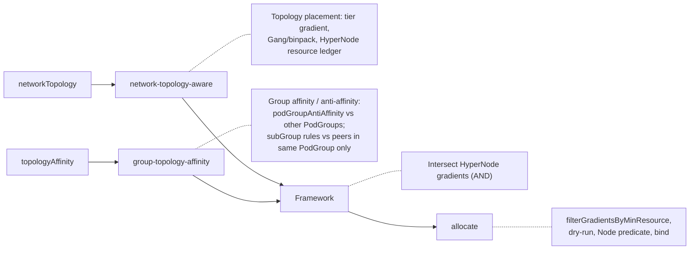
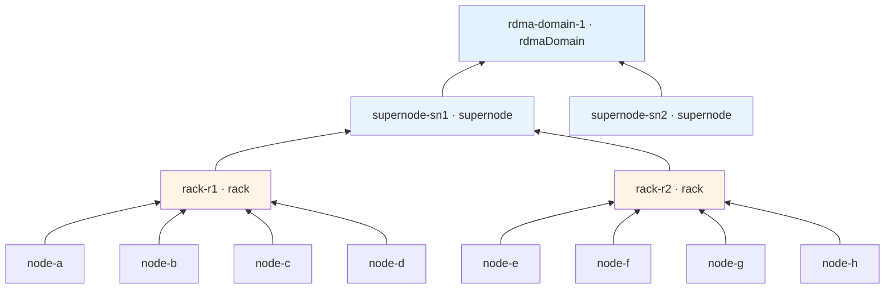
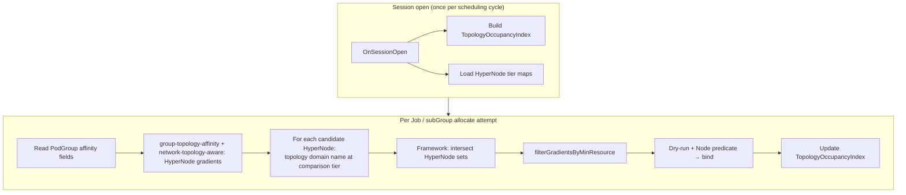
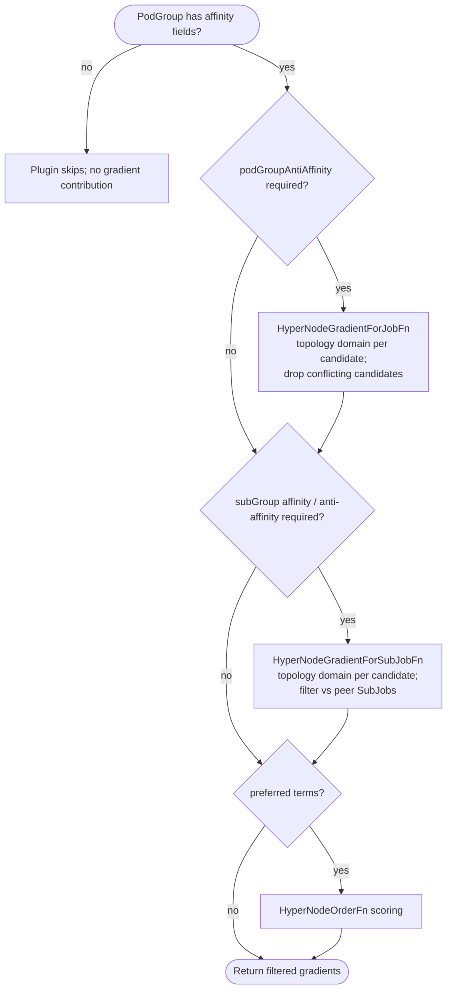
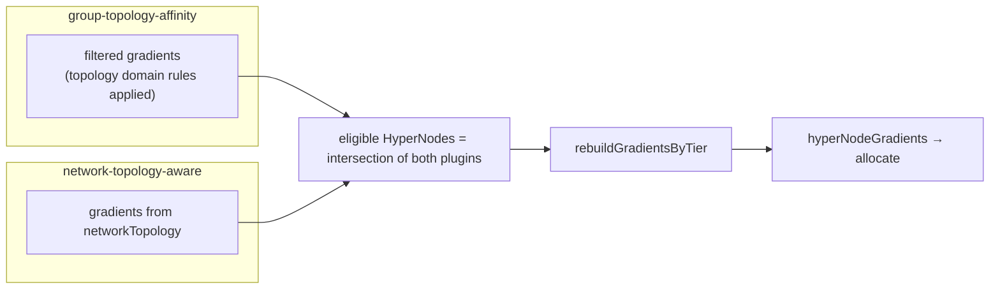
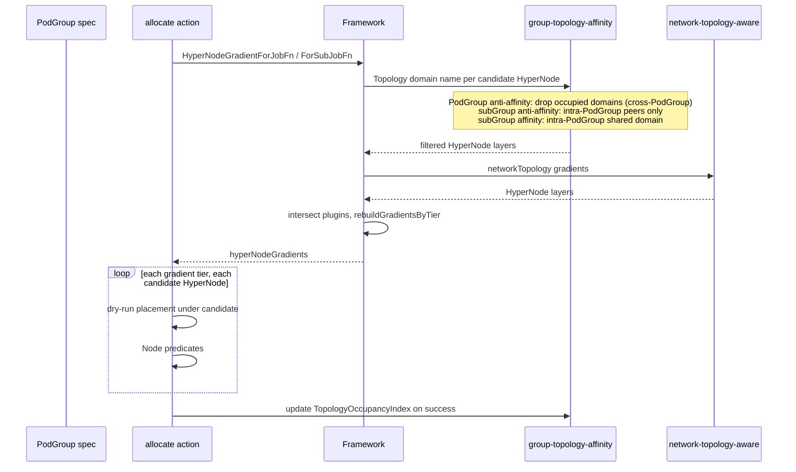
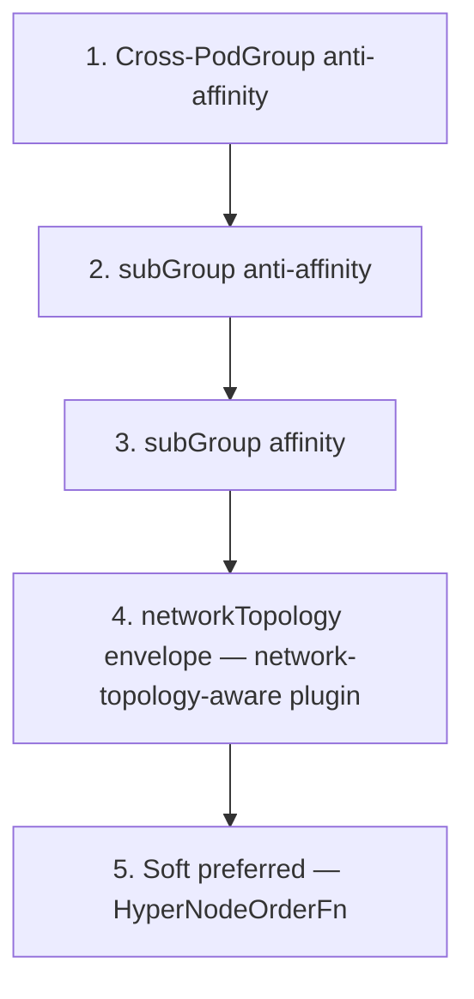
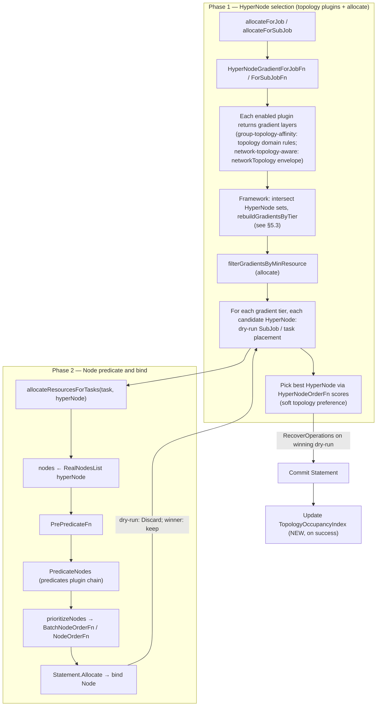

# Group Topology Affinity Design

Author: wangyang0616 · 2026-05-28

---

## 1. Summary

Volcano already schedules workloads on the HyperNode tree through **`networkTopology`**, which defines where a PodGroup or subGroup should **aggregate** (for example, Gang within one rack, or an entire instance under one supernode). This design adds PodGroup fields for **group-level topology affinity and anti-affinity** ([volcano-sh/volcano#5347](https://github.com/volcano-sh/volcano/issues/5347)) — rules about **how groups relate to each other** on that same tree, not how Pods spread inside a single subGroup.

Users can declare, for example:

- **Across PodGroups:** keep multiple instances apart at a chosen tier (e.g., each inference instance on a different supernode for fault isolation).
- **Within one PodGroup, across subGroups:** combine shard spread, role co-location, or cross-role separation (e.g., Prefill–Decode: shards per rack, whole instance on one supernode).

These capabilities sit alongside existing `networkTopology` configuration; they do not replace Pod template **`podAffinity`** / **`podAntiAffinity`** for rules inside a single subGroup.

## 2. Motivation

[Network Topology Aware Scheduling](./Network%20Topology%20Aware%20Scheduling.md) already lets users gang-schedule Pods and subGroups inside a HyperNode domain via `networkTopology` — for example, keeping Prefill and Decode subGroups under one supernode. That solves **where a group should aggregate** on the network tree.

Inference serving also needs rules about **how multiple groups relate to each other** — at **PodGroup** granularity (including vs other PodGroups), or **within one PodGroup** at **subGroup** granularity — something Pod-level `podAffinity` does not express well.

A common case is **multi-instance inference**: several PodGroups serve the same model. Operators want each instance on a **different supernode** so one hardware failure does not take down every replica. Today there is no declarative PodGroup API to require that separation; instances can land on the same supernode unless enforced outside the scheduler.

Another case is **Prefill–Decode inside one PodGroup**: shards should spread across **racks**, while the **whole instance** stays on one supernode. Without **`topologyAffinity`**, teams split work into multiple PodGroups or stack fragile Pod template rules that do not align with HyperNode whole-group scheduling.

On a **serving workload** (many inference instances of the same model), operators often need **both** cross-instance isolation and per-instance Prefill–Decode layout. Those rules are usually mixed into ops conventions or duplicated across PodGroup templates. That is hard to validate and does not sit on the same configuration surface as existing topology scheduling.

This design adds PodGroup **`topologyAffinity`** for those affinity and anti-affinity relationships. It builds on the existing HyperNode stack; it does **not** replace `networkTopology` or per-Pod **`podAffinity`** / **`podAntiAffinity`** on Pod templates.

## 3. Goals

1. **Declarable group affinity/anti-affinity** on PodGroup: cross-PodGroup anti-affinity + same-PodGroup subGroup affinity/anti-affinity.
2. **Clear API layering:** aggregation/envelope → `networkTopology`; inter-group affinity/anti-affinity → single **`topologyAffinity`** (`podGroupAntiAffinity`, `subGroupAffinity`, `subGroupAntiAffinity`).
3. **Hard / soft:** `required` for mandatory rules; `preferred` with optional **`weight`** (1–100) on each term for preferences. `networkTopology` keeps its own `mode` and is separate from this API.
4. **Two plugins, one path:** `network-topology-aware` (topology-aware placement) + `group-topology-affinity` (affinity/anti-affinity); Framework gradient **intersection**; **allocate** **`filterGradientsByMinResource`** then dry-run and Node bind.
5. **Validatable API:** Admission Webhook; tier fields aligned with HyperNode `spec.tierName` / `spec.tier`.

## 4. Non-Goals


| Item                                                     | Handled by                                                                              |
| -------------------------------------------------------- | --------------------------------------------------------------------------------------- |
| Topology aggregation / Gang envelope (`networkTopology`) | Existing `networkTopology` fields + `network-topology-aware`                            |
| Per-Pod affinity inside one subGroup                     | Pod template `podAffinity` / `podAntiAffinity`                                          |
| **`subGroupAffinity`** / **`subGroupAntiAffinity`** across PodGroups or namespaces | Not supported. Peer SubJobs are always from the **same PodGroup** (same UID).           |
| Cross-PodGroup **`podGroupAffinity`** (co-location)    | Not supported. Co-location within one PodGroup: `networkTopology` or **`subGroupAffinity`** |
| Cross-PodGroup **`podGroupAntiAffinity`**              | Supported via **`topologyAffinity.podGroupAntiAffinity`** + `podGroupSelector`          |
| Preempt / backfill vs occupancy index                    | [Future considerations](#future-considerations)                                         |
| `TopologyUnsatisfiable` PodGroup condition               | [Future considerations](#future-considerations)                                         |
| Batch Job / `PartitionPolicy` sync                       | [Future considerations](#future-considerations)                                         |


## 5. Proposal

### 5.1 Capability model

Users express intent on the same HyperNode tree at multiple tiers. How **topology domain names** are derived is defined in [§6](#domain_t-semantics).

**What users declare on PodGroup**

- **`networkTopology`** — aggregation or envelope: where Pods or subGroups under one policy should gang or stay within a tier (for example, all shards in one rack, or an entire inference instance under one supernode).
- **`topologyAffinity.subGroupAffinity`** / **`subGroupAntiAffinity`** — affinity or anti-affinity **within one PodGroup**, between `subGroupPolicy` entries (shard spread, Prefill and Decode on the same supernode, and similar patterns).
- **`topologyAffinity.podGroupAntiAffinity`** — anti-affinity **across PodGroups**, matched by `podGroupSelector` (for example, each inference instance on a different supernode).

**How the scheduler enforces it**

Two plugins run on the same HyperNode scheduling path. Each plugin reads the PodGroup fields it owns and produces **topology-only** HyperNode gradients; the framework intersects them; **allocate** applies **`filterGradientsByMinResource`** on the survivors, then dry-runs and binds Nodes. HyperNode aggregate resource accounting remains in **`network-topology-aware`**; capacity filtering is centralized in allocate so every post-intersection candidate is checked before dry-run.




When both plugins are enabled and a PodGroup uses both kinds of fields, only plugins whose API is present contribute; an empty intersection leaves the PodGroup unschedulable with a clear fit error.

### 5.2 PodGroup API

<a id="new-fields-this-delivery"></a>

#### New fields

This design adds one optional field on **`PodGroupSpec`**: **`topologyAffinity`** (`TopologyAffinitySpec`). Existing **`networkTopology`**, **`subGroupPolicy`**, and Pod **`podAffinity`** / **`podAntiAffinity`** are unchanged. Cross-PodGroup **`podGroupAffinity`** and cross-PodGroup **`subGroupAffinity`** / **`subGroupAntiAffinity`** are out of scope; **`subGroups`** in a term name only policies on **this** PodGroup's `subGroupPolicy`.

**`topologyAffinity`** holds up to three blocks. Each block has **`required`** (hard) and/or **`preferred`** (soft; term **`weight`** 1–100):

- **`podGroupAntiAffinity`** — this PodGroup vs **other** PodGroups. Term: **`PodGroupAffinityTerm`** — `podGroupSelector` (required), optional `namespaceSelector`, `topologyTierName` / `topologyTier`. The scheduler excludes the current PodGroup by UID.
- **`subGroupAffinity`** — **within this PodGroup only:** listed **`subGroups`** (names from `subGroupPolicy[].name` on this PodGroup) must share **one** topology domain. Term: **`SubGroupAffinityTerm`** — `subGroups`, `topologyTierName` / `topologyTier`.
- **`subGroupAntiAffinity`** — **within this PodGroup only:** SubJob spread or separation among SubJobs of this PodGroup. Same **`SubGroupAffinityTerm`** shape as affinity.

Every term sets **`topologyTierName`** or **`topologyTier`** on the term ([§6](#domain_t-semantics)). **`subGroupPolicy`** (`matchLabelKeys`, `minSubGroups`, per-policy **`networkTopology`**) is often configured alongside these fields.

<a id="semantics"></a>

#### Semantics

**Two levels (do not mix them in rules):**

| Level | What it is | Where it appears |
| ----- | ---------- | ---------------- |
| **Policy name** | `subGroupPolicy[].name` (for example `prefill`, `decode`) | `SubGroupAffinityTerm.subGroups` in YAML |
| **SubJob** | One schedulable unit from a policy (for example one shard after `matchLabelKeys`) | Scheduler evaluation only — not a field on `topologyAffinity` |

Users list **policy names** in each term's **`subGroups`**. The scheduler always applies **`subGroupAffinity`** / **`subGroupAntiAffinity`** by comparing **SubJobs** (domains of SubJobs under those policies).

**Scope:** **`subGroupAffinity`** and **`subGroupAntiAffinity`** apply **only within one PodGroup**. Peers are SubJobs of that PodGroup only. Cross-PodGroup rules use **`podGroupAntiAffinity`** (`podGroupSelector`). Below, **intra-policy** = among SubJobs of one policy; **cross-policy** = between SubJobs of different policies **in the same PodGroup** (not between PodGroups).

**`subGroupAffinity`** — in one term, every SubJob whose policy is listed in **`subGroups`** must end up in the **same** topology domain at the term's tier.

**`subGroupAntiAffinity`** — in one term, which SubJobs are peers depends on how many policy names **`subGroups`** contains:

- **One policy name** (e.g. `subGroups: [prefill]`) — **intra-policy:** each SubJob of `prefill` must use a **different** domain from every other SubJob of `prefill`; other policies are unaffected.
- **Two or more policy names** (e.g. `subGroups: [prefill, decode]`) — **cross-policy:** a SubJob must not share a domain with any SubJob of a **different** listed policy; two SubJobs of the **same** listed policy may still share a domain. For intra-policy spread as well, add a separate term with a single policy name (e.g. `subGroups: [prefill]`).

Multiple **`required`** terms are **AND**ed. For a candidate HyperNode, drop it if the domain at the term tier matches a peer SubJob that the term constrains (same-policy peers for a one-name term; different-policy peers for a multi-name term).

**Layering with existing fields:** **`networkTopology`** defines aggregation envelopes (PodGroup-wide or per `subGroupPolicy`); **`topologyAffinity`** defines how SubJobs relate by domain vs peers. If the same **policy name** appears in both hard **`subGroupAffinity`** and hard **`subGroupAntiAffinity`**, the affinity tier must be **≥** the anti-affinity tier (admission webhook). **`topologyTier`** maps to HyperNode `spec.tier`: larger integer = coarser domain (closer to tree root); for example supernode ≥ rack in [§6](#reference-topology).

Go types: [§6 API types](#api-types). YAML: [§5.4](#54-representative-scenarios).

### 5.3 Scheduling (high level)

`network-topology-aware` handles **`networkTopology`** (topology-only gradients and HyperNode resource ledger); `group-topology-affinity` handles **`topologyAffinity`** and **`TopologyOccupancyIndex`**. The framework intersects plugin gradients; **allocate** runs **`filterGradientsByMinResource`**, then dry-runs HyperNode candidates and binds Nodes. Details: [Scheduling pipeline](#scheduling-pipeline). Framework gradient **intersection** across all enabled topology plugins is part of this implementation delivery (current code uses the first registered plugin only).

<a id="54-representative-scenarios"></a>

### 5.4 Representative scenarios

In YAML below, `# NEW` marks fields introduced by this design ([field list](#new-fields-this-delivery)).

<a id="example-1--multi-instance-fault-isolation"></a>

**Example 1 — multi-instance fault isolation**

Minimal PodGroup showing cross-PodGroup anti-affinity only; `minMember` is illustrative and not tied to a specific workload shape.

```yaml
apiVersion: scheduling.volcano.sh/v1beta1
kind: PodGroup
metadata:
  name: llama-70b-instance-0
  namespace: default
  labels:
    topology.volcano.sh/group: llama-70b-prod
spec:
  minMember: 8
  queue: default
  topologyAffinity:                      # NEW — root container for inter-group topology rules
    podGroupAntiAffinity:                # NEW — vs other PodGroups matched by podGroupSelector
      required:                          # NEW — hard (mandatory) terms
      - podGroupSelector:                # NEW — label selector for peer PodGroups
          matchLabels:
            topology.volcano.sh/group: llama-70b-prod
        topologyTierName: supernode      # NEW — each peer instance on a distinct supernode domain
```

<a id="example-2--prefilldecode-shards-per-rack"></a>

**Example 2 — Prefill–Decode: shards per rack, roles on one supernode**

This PodGroup has 4 prefill + 2 decode SubJobs (`matchLabelKeys` → one SubJob per shard). Per-policy **`networkTopology`** @ **rack** gangs each shard. All prefill and decode SubJobs must sit under **one supernode**. Supernode co-location is declared in **exactly one** of two equivalent forms (mutually exclusive):

- **Option A (existing):** **`spec.networkTopology`** with `highestTierName: supernode` — PodGroup-wide aggregation envelope, enforced by **`network-topology-aware`**. Shard spread within each role via **`topologyAffinity.subGroupAntiAffinity`** with single-name `[prefill]` and `[decode]` terms @ rack.
- **Option B (NEW):** **`topologyAffinity.subGroupAffinity`** with `subGroups: [prefill, decode]` @ `topologyTierName: supernode` — explicit inter-subGroup co-location, enforced by **`group-topology-affinity`**. Same **`subGroupAntiAffinity`** rack terms as Option A.

Option A applies when the PodGroup already declares PodGroup-wide **`networkTopology`**. Option B applies when only listed subGroups must co-locate or the tier differs from the PodGroup envelope. Both options require **`network-topology-aware`** (per-policy and/or PodGroup **`networkTopology`**) and **`group-topology-affinity`** (**`topologyAffinity`**) — [Scheduler configuration](#scheduler-configuration). Combined **`subGroupAntiAffinity`** term patterns: [Example 2b](#example-2b--cross-policy-anti-affinity-only)–[2d](#example-2d--combined-intra-and-cross-policy-terms). All three **`topologyAffinity`** sub-blocks: [Example 4](#example-4--combined-podgroup-and-subgroup-topology).

**Option A — PodGroup `networkTopology` @ supernode**

```yaml
apiVersion: scheduling.volcano.sh/v1beta1
kind: PodGroup
metadata:
  name: llama-70b-prefill-decode-nt
  namespace: default
spec:
  minMember: 44
  queue: default
  networkTopology:
    mode: hard
    highestTierName: supernode
  subGroupPolicy:
  - name: prefill
    labelSelector:
      matchLabels:
        volcano.sh/role: prefill
    matchLabelKeys:
    - volcano.sh/shard-id
    subGroupSize: 8
    minSubGroups: 4
    networkTopology:
      mode: hard
      highestTierName: rack
  - name: decode
    labelSelector:
      matchLabels:
        volcano.sh/role: decode
    matchLabelKeys:
    - volcano.sh/shard-id
    subGroupSize: 6
    minSubGroups: 2
    networkTopology:
      mode: hard
      highestTierName: rack
  topologyAffinity:                      # NEW
    subGroupAntiAffinity:                # NEW — subGroup spread / separation within PodGroup
      required:                          # NEW — hard (mandatory) terms
      - subGroups:                       # NEW — intra-policy: each prefill SubJob on distinct rack
        - prefill
        topologyTierName: rack           # NEW — compare topology domain names at rack tier
      - subGroups:                       # NEW — intra-policy: each decode SubJob on distinct rack
        - decode
        topologyTierName: rack           # NEW — compare topology domain names at rack tier
```

<a id="example-2-option-b"></a>

**Option B — `subGroupAffinity` @ supernode**

Same **`subGroupPolicy`** as Option A; supernode co-location via **`subGroupAffinity`** instead of PodGroup **`networkTopology`**.

```yaml
apiVersion: scheduling.volcano.sh/v1beta1
kind: PodGroup
metadata:
  name: llama-70b-prefill-decode-affinity
  namespace: default
spec:
  minMember: 44
  queue: default
  subGroupPolicy:
  - name: prefill
    labelSelector:
      matchLabels:
        volcano.sh/role: prefill
    matchLabelKeys:
    - volcano.sh/shard-id
    subGroupSize: 8
    minSubGroups: 4
    networkTopology:
      mode: hard
      highestTierName: rack
  - name: decode
    labelSelector:
      matchLabels:
        volcano.sh/role: decode
    matchLabelKeys:
    - volcano.sh/shard-id
    subGroupSize: 6
    minSubGroups: 2
    networkTopology:
      mode: hard
      highestTierName: rack
  topologyAffinity:                      # NEW — root container for inter-group topology rules
    subGroupAffinity:                    # NEW — listed subGroups share one topology domain
      required:                          # NEW — hard (mandatory) terms
      - subGroups:                       # NEW — prefill and decode co-locate at supernode
        - prefill
        - decode
        topologyTierName: supernode      # NEW — compare topology domain names at supernode tier
    subGroupAntiAffinity:                # NEW — subGroup spread / separation within PodGroup
      required:                          # NEW — hard (mandatory) terms
      - subGroups:                       # NEW — intra-policy: each prefill SubJob on distinct rack
        - prefill
        topologyTierName: rack           # NEW — compare topology domain names at rack tier
      - subGroups:                       # NEW — intra-policy: each decode SubJob on distinct rack
        - decode
        topologyTierName: rack           # NEW — compare topology domain names at rack tier
```

Separate single-name terms spread SubJobs **within** each policy. SubJobs from different policies may still share a domain unless a multi-name term is added ([Example 2b](#example-2b--cross-policy-anti-affinity-only)–[2d](#example-2d--combined-intra-and-cross-policy-terms)).

<a id="example-2b--cross-policy-anti-affinity-only"></a>

**Example 2b — cross-policy anti-affinity only**

Single multi-name **`subGroupAntiAffinity`** term. PodGroup with two policies **role A** (`role-a`, 4 SubJobs) and **role B** (`role-b`, 2 SubJobs), each split by **`matchLabelKeys`**. Cross-policy separation @ **`rack`**: no **role A** SubJob may share a domain with any **role B** SubJob; multiple SubJobs of the **same** role **may** share a domain.

```yaml
apiVersion: scheduling.volcano.sh/v1beta1
kind: PodGroup
metadata:
  name: demo-cross-policy-only
  namespace: default
spec:
  minMember: 28
  queue: default
  subGroupPolicy:
  - name: role-a
    labelSelector:
      matchLabels:
        volcano.sh/subgroup: role-a
    matchLabelKeys:
    - volcano.sh/partition-id
    subGroupSize: 4
    minSubGroups: 4
  - name: role-b
    labelSelector:
      matchLabels:
        volcano.sh/subgroup: role-b
    matchLabelKeys:
    - volcano.sh/partition-id
    subGroupSize: 6
    minSubGroups: 2
  topologyAffinity:                      # NEW — root container for inter-group topology rules
    subGroupAntiAffinity:                # NEW — subGroup spread / separation within PodGroup
      required:                          # NEW — hard (mandatory) terms
      - subGroups:                       # NEW — cross-policy: role A vs role B must not share domain
        - role-a
        - role-b
        topologyTierName: rack           # NEW — compare topology domain names at rack tier
```

<a id="example-2c--intra-policy-plus-cross-policy-anti-affinity"></a>

**Example 2c — intra-policy spread plus cross-policy anti-affinity**

Two **`required`** terms @ **`rack`**, **AND**ed: **`[role-a]`** (each **role A** SubJob on a distinct domain) and **`[role-a, role-b]`** (no **role A** SubJob shares a domain with any **role B** SubJob). Intra-**role B** spread requires an additional **`[role-b]`** term ([Example 2d](#example-2d--combined-intra-and-cross-policy-terms)).

```yaml
apiVersion: scheduling.volcano.sh/v1beta1
kind: PodGroup
metadata:
  name: demo-intra-plus-cross
  namespace: default
spec:
  minMember: 28
  queue: default
  subGroupPolicy:
  - name: role-a
    labelSelector:
      matchLabels:
        volcano.sh/subgroup: role-a
    matchLabelKeys:
    - volcano.sh/partition-id
    subGroupSize: 4
    minSubGroups: 4
  - name: role-b
    labelSelector:
      matchLabels:
        volcano.sh/subgroup: role-b
    matchLabelKeys:
    - volcano.sh/partition-id
    subGroupSize: 6
    minSubGroups: 2
  topologyAffinity:                      # NEW — root container for inter-group topology rules
    subGroupAntiAffinity:                # NEW — subGroup spread / separation within PodGroup
      required:                          # NEW — hard (mandatory) terms; multiple terms are AND-ed
      - subGroups: [role-a]              # NEW — intra-policy: each role A SubJob on distinct domain
        topologyTierName: rack           # NEW — compare topology domain names at rack tier
      - subGroups:                       # NEW — cross-policy: role A vs role B must not share domain
        - role-a
        - role-b
        topologyTierName: rack           # NEW — compare topology domain names at rack tier
```

<a id="example-2d--combined-intra-and-cross-policy-terms"></a>

**Example 2d — combined intra- and cross-policy terms**

Three **`required`** terms @ **`rack`**: **`[role-a]`**, **`[role-b]`**, and **`[role-a, role-b]`**. All six SubJobs occupy distinct domains, with no **role A** / **role B** overlap.

```yaml
apiVersion: scheduling.volcano.sh/v1beta1
kind: PodGroup
metadata:
  name: demo-full-spread
  namespace: default
spec:
  minMember: 28
  queue: default
  subGroupPolicy:
  - name: role-a
    labelSelector:
      matchLabels:
        volcano.sh/subgroup: role-a
    matchLabelKeys:
    - volcano.sh/partition-id
    subGroupSize: 4
    minSubGroups: 4
  - name: role-b
    labelSelector:
      matchLabels:
        volcano.sh/subgroup: role-b
    matchLabelKeys:
    - volcano.sh/partition-id
    subGroupSize: 6
    minSubGroups: 2
  topologyAffinity:                      # NEW — root container for inter-group topology rules
    subGroupAntiAffinity:                # NEW — subGroup spread / separation within PodGroup
      required:                          # NEW — hard (mandatory) terms; multiple terms are AND-ed
      - subGroups: [role-a]              # NEW — intra-policy: each role A SubJob on distinct domain
        topologyTierName: rack           # NEW — compare topology domain names at rack tier
      - subGroups: [role-b]              # NEW — intra-policy: each role B SubJob on distinct domain
        topologyTierName: rack           # NEW — compare topology domain names at rack tier
      - subGroups:                       # NEW — cross-policy: role A vs role B must not share domain
        - role-a
        - role-b
        topologyTierName: rack           # NEW — compare topology domain names at rack tier
```

<a id="example-3--soft-shard-spread"></a>

**Example 3 — soft shard spread**

Same Prefill–Decode SubJob layout as [Example 2](#example-2--prefilldecode-shards-per-rack), but shard spread uses **`preferred`** terms only. PodGroup **`networkTopology`** @ **supernode** keeps the instance envelope; per-policy hard **`networkTopology`** @ **rack** is omitted so rack spread is expressed solely through soft **`subGroupAntiAffinity`**.

```yaml
apiVersion: scheduling.volcano.sh/v1beta1
kind: PodGroup
metadata:
  name: llama-70b-soft-shard
  namespace: default
spec:
  minMember: 44
  queue: default
  networkTopology:
    mode: hard
    highestTierName: supernode
  subGroupPolicy:
  - name: prefill
    labelSelector:
      matchLabels:
        volcano.sh/role: prefill
    matchLabelKeys:
    - volcano.sh/shard-id
    subGroupSize: 8
    minSubGroups: 4
  - name: decode
    labelSelector:
      matchLabels:
        volcano.sh/role: decode
    matchLabelKeys:
    - volcano.sh/shard-id
    subGroupSize: 6
    minSubGroups: 2
  topologyAffinity:                      # NEW — root container for inter-group topology rules
    subGroupAntiAffinity:                # NEW — subGroup spread / separation within PodGroup
      preferred:                         # NEW — soft (optional) terms scored by weight
      - subGroups:                       # NEW — intra-policy: prefer distinct rack per prefill SubJob
        - prefill
        weight: 100                      # NEW — preferred-term priority (1-100)
        topologyTierName: rack           # NEW — compare topology domain names at rack tier
      - subGroups:                       # NEW — intra-policy: prefer distinct rack per decode SubJob
        - decode
        weight: 100                      # NEW — preferred-term priority (1-100)
        topologyTierName: rack           # NEW — compare topology domain names at rack tier
```

<a id="example-4--combined-podgroup-and-subgroup-topology"></a>

**Example 4 — combined PodGroup and subGroup topology**

One PodGroup declaring all three **`topologyAffinity`** sub-blocks for multi-instance disaggregated inference — **`podGroupAntiAffinity`** ([Example 1](#example-1--multi-instance-fault-isolation)), **`subGroupAffinity`**, and intra **`subGroupAntiAffinity`** ([Example 2 Option B](#example-2-option-b)):

- **`podGroupAntiAffinity`** @ **supernode** — peer instances (same label group) each on a **distinct** supernode.
- **`subGroupAffinity`** @ **supernode** — prefill and decode SubJobs of **this** instance share **one** supernode.
- **`subGroupAntiAffinity`** @ **rack** — each prefill / decode shard on a **distinct** rack (intra-policy).

Hard **`subGroupAffinity`** @ **supernode** and hard **`subGroupAntiAffinity`** @ **rack** satisfy the tier rule in [§5.2 Semantics](#semantics) (supernode is coarser than rack).

```yaml
apiVersion: scheduling.volcano.sh/v1beta1
kind: PodGroup
metadata:
  name: llama-70b-instance-0
  namespace: default
  labels:
    topology.volcano.sh/group: llama-70b-prod
spec:
  minMember: 44
  queue: default
  subGroupPolicy:
  - name: prefill
    labelSelector:
      matchLabels:
        volcano.sh/role: prefill
    matchLabelKeys:
    - volcano.sh/shard-id
    subGroupSize: 8
    minSubGroups: 4
    networkTopology:
      mode: hard
      highestTierName: rack
  - name: decode
    labelSelector:
      matchLabels:
        volcano.sh/role: decode
    matchLabelKeys:
    - volcano.sh/shard-id
    subGroupSize: 6
    minSubGroups: 2
    networkTopology:
      mode: hard
      highestTierName: rack
  topologyAffinity:                      # NEW — root container for inter-group topology rules
    podGroupAntiAffinity:                # NEW — vs other PodGroups matched by podGroupSelector
      required:                          # NEW — hard (mandatory) terms
      - podGroupSelector:                # NEW — label selector for peer PodGroups
          matchLabels:
            topology.volcano.sh/group: llama-70b-prod
        topologyTierName: supernode      # NEW — each peer instance on a distinct supernode domain
    subGroupAffinity:                    # NEW — listed subGroups share one topology domain
      required:                          # NEW — hard (mandatory) terms
      - subGroups:                       # NEW — prefill and decode co-locate at supernode
        - prefill
        - decode
        topologyTierName: supernode      # NEW — compare topology domain names at supernode tier
    subGroupAntiAffinity:                # NEW — subGroup spread / separation within PodGroup
      required:                          # NEW — hard (mandatory) terms
      - subGroups:                       # NEW — intra-policy: each prefill SubJob on distinct rack
        - prefill
        topologyTierName: rack           # NEW — compare topology domain names at rack tier
      - subGroups:                       # NEW — intra-policy: each decode SubJob on distinct rack
        - decode
        topologyTierName: rack           # NEW — compare topology domain names at rack tier
```

Tier names must match HyperNode CR `spec.tierName` values in the cluster.

## 6. Design Details

**Deliverables:** PodGroup CRD, `group-topology-affinity` plugin, framework gradient intersection, **`filterGradientsByMinResource`** in allocate (refactor resource pre-filter out of `network-topology-aware` gradient BFS), admission webhook, e2e.

<a id="api-types"></a>

### API types

Target: `staging/src/volcano.sh/apis/pkg/apis/scheduling/v1beta1/types.go`.

```go
// PodGroupSpec — only the field marked NEW is added by this design.
type PodGroupSpec struct {
    // ... minMember, queue, priorityClassName, minResources,
    //     networkTopology, subGroupPolicy (existing) ...

    // NEW — inter-group topology affinity / anti-affinity
    TopologyAffinity *TopologyAffinitySpec `json:"topologyAffinity,omitempty"`
}

// NEW types (all fields in this block are new)
type TopologyAffinitySpec struct {
    PodGroupAntiAffinity *PodGroupAntiAffinity `json:"podGroupAntiAffinity,omitempty"`
    SubGroupAffinity     *SubGroupAffinity     `json:"subGroupAffinity,omitempty"`
    SubGroupAntiAffinity *SubGroupAntiAffinity `json:"subGroupAntiAffinity,omitempty"`
}

type PodGroupAntiAffinity struct {
    Required  []PodGroupAffinityTerm `json:"required,omitempty"`
    Preferred []PodGroupAffinityTerm `json:"preferred,omitempty"`
}

type PodGroupAffinityTerm struct {
    Weight            int32                 `json:"weight,omitempty"` // preferred only, 1-100
    PodGroupSelector  *metav1.LabelSelector `json:"podGroupSelector"`
    NamespaceSelector *metav1.LabelSelector `json:"namespaceSelector,omitempty"`
    TopologyTierName  string                `json:"topologyTierName,omitempty"`
    TopologyTier      *int32                `json:"topologyTier,omitempty"`
}

type SubGroupAffinity struct {
    Required  []SubGroupAffinityTerm `json:"required,omitempty"`
    Preferred []SubGroupAffinityTerm `json:"preferred,omitempty"`
}

type SubGroupAntiAffinity struct {
    Required  []SubGroupAffinityTerm `json:"required,omitempty"`
    Preferred []SubGroupAffinityTerm `json:"preferred,omitempty"`
}

type SubGroupAffinityTerm struct {
    // SubGroups names subGroupPolicy entries. For subGroupAntiAffinity:
    //   one name  → intra-policy (all SubJobs of that policy pairwise distinct domains)
    //   two+ names → cross-policy only (SubJobs from different listed policies must not share a domain; same policy may share)
    SubGroups          []string `json:"subGroups"`
    Weight             int32    `json:"weight,omitempty"` // preferred only, 1-100
    TopologyTierName   string   `json:"topologyTierName,omitempty"`
    TopologyTier       *int32   `json:"topologyTier,omitempty"`
}
```

**Alignment with `networkTopology` tiers**


| Purpose                                    | String             | Integer              |
| ------------------------------------------ | ------------------ | -------------------- |
| Aggregation / envelope (`networkTopology`) | `highestTierName`  | `highestTierAllowed` |
| Affinity / anti-affinity (each term)       | `topologyTierName` | `topologyTier`       |


Scheduler Session: shared `HyperNodeTierNameMap`, `HyperNodeTierSet`.

<a id="domain_t-semantics"></a>

### Topology domain semantics

Rules compare **topology domain names** (ancestor HyperNode names at a tier), not Kubernetes Node hostnames. For each **candidate HyperNode** in a gradient layer and each term’s **comparison tier** (`topologyTierName` / `topologyTier`), walk up the tree to the first ancestor at that tier; its name is the domain label (implementation: **`Domain_T`**). See [scheduling pipeline](#scheduling-pipeline) for where this runs; [§5.4](#54-representative-scenarios) for YAML.

<a id="reference-topology"></a>

#### Reference topology
**node → rack → supernode → RDMA connectivity domain** (`rdmaDomain`). **`rdma-domain-1`** parents **`supernode-sn1`** (eight nodes, two racks shown) and **`supernode-sn2`** (omitted). Child-to-parent arrows.




<a id="scheduling-pipeline"></a>

### Scheduling pipeline

One allocate cycle: **`group-topology-affinity`** filters gradients by topology domain (**`TopologyOccupancyIndex`** for cross-PodGroup **`podGroupAntiAffinity`**; intra-PodGroup **`subGroupAffinity`** / **`subGroupAntiAffinity`** compare peer SubJobs in the same PodGroup only); **`network-topology-aware`** applies **`networkTopology`**; the framework **intersects** HyperNode sets and **`rebuildGradientsByTier`**; **allocate** runs **`filterGradientsByMinResource`**, then dry-runs each survivor and binds Nodes. Hard rules use gradient hooks; soft rules use **`HyperNodeOrderFn`**. [HyperNode selection and Node predicates](#hypernode-selection-and-predicates) defines the path from gradient survivors through resource pre-filter, Node predicate, and bind.

#### End-to-end flow




#### group-topology-affinity plugin




**PodGroup anti-affinity** ([Example 1](#example-1--multi-instance-fault-isolation), [Example 4](#example-4--combined-podgroup-and-subgroup-topology), **`HyperNodeGradientForJobFn`** step): PodGroup A occupies domain **`supernode-sn1`** → index records it. PodGroup B’s gradient drops every candidate in that domain; **`supernode-sn2`** remains.

**subGroup rules** (**`HyperNodeGradientForSubJobFn`**, **intra-PodGroup only**): **single-name** terms → intra-policy spread; **multi-name** terms → cross-**policy** anti-affinity only ([Example 2](#example-2--prefilldecode-shards-per-rack), [Example 2b](#example-2b--cross-policy-anti-affinity-only)–[2d](#example-2d--combined-intra-and-cross-policy-terms), [Example 4](#example-4--combined-podgroup-and-subgroup-topology)); **`subGroupAffinity`** terms → shared domain among SubJobs in the same PodGroup.

<a id="framework-intersect-plugin-gradients"></a>

#### Framework: intersect plugin gradients




Intersect by **HyperNode set**, not by layer index. Empty intersection → Pending (topology fit error).

#### allocate: gradient to bind




#### Hard constraint order

When multiple hard rules apply, cross-plugin constraints are enforced by **HyperNode gradient intersection** (AND), not by sequential short-circuit in allocate. The following order documents constraint **precedence** for implementation and debugging:




<a id="hypernode-selection-and-predicates"></a>

### HyperNode selection and Node predicates

After PodGroup- and subGroup-level topology rules are applied (**`podGroupAntiAffinity`** at Job scope; **`subGroupAffinity`** / **`subGroupAntiAffinity`** evaluated per SubJob), scheduling continues through the **allocate** action described in [Network Topology Aware Scheduling](./Network%20Topology%20Aware%20Scheduling.md) until Pods bind to Nodes. **Node-level scheduling is unchanged:** the **`predicates`** plugin, **`PrePredicateFn`**, **`PredicateNodes`**, queue overuse checks, and **`BatchNodeOrderFn`** / default node scoring are not modified. **This delivery extends HyperNode candidate selection only** — **`group-topology-affinity`** gradients, framework **intersection** with **`network-topology-aware`**, and **`TopologyOccupancyIndex`** updates on successful bind.

#### Two-level model

Volcano HyperNode scheduling is **HyperNode first, Node second**:

1. **HyperNode level** — decide *which performance domain* (subtree of the HyperNode tree) may host the Job / SubJob. Inputs: `networkTopology`, `topologyAffinity`, already-allocated HyperNodes; **`filterGradientsByMinResource`** uses HyperNode aggregate idle / futureIdle from **`network-topology-aware`**. Output: ordered **gradient layers**, each a list of candidate HyperNodes that pass topology intersection **and** minimum capacity.
2. **Node level** — inside one candidate HyperNode, decide *which Kubernetes Node* hosts each Pod. Inputs: **`RealNodesList[hyperNode]`** (member Nodes under that HyperNode), task resource request, and all **predicate** / **node order** plugins. Output: one bound Node per task (via **`Statement`**).

Topology **affinity / anti-affinity** and **`networkTopology`** envelopes are enforced at **HyperNode level** (step 1). **Taints, resources, ports, volumes, DRA**, and other fit errors are enforced at **Node level** (step 2). A HyperNode can pass all topology rules and still fail if no member Node satisfies predicates — allocate then tries the next HyperNode or the next gradient.

#### End-to-end path




**Job level (`allocateForJob`).** Called with a search root HyperNode (typically cluster top). **`HyperNodeGradientForJobFn`** returns tier-ordered candidate HyperNodes for the whole PodGroup (e.g. Job-level `networkTopology`, **`podGroupAntiAffinity`**). **`filterGradientsByMinResource(job.GetMinResources())`** drops HyperNodes whose aggregate idle / futureIdle cannot satisfy the Job minimum before any dry-run. For each remaining gradient, allocate **dry-runs** scheduling all pending SubJobs under each candidate HyperNode by calling **`allocateForSubJob`**. Dry-run statements are **discarded**; the HyperNode with the best combined **`HyperNodeOrderFn`** score whose dry-run satisfies **`JobReadyFn`** / **`JobPipelinedFn`** wins; its statement is **recovered** and returned. See **`allocateForJob`** in [Network Topology Aware Scheduling](./Network%20Topology%20Aware%20Scheduling.md#allocate-action).

**SubJob level (`allocateForSubJob`).** Same pattern with **`HyperNodeGradientForSubJobFn`** (SubJob `networkTopology`, **`subGroupAffinity`**, **`subGroupAntiAffinity`**), then **`filterGradientsByMinResource(subJob.GetMinResources())`**, then dry-run **`allocateResourcesForTasks`** for all pending tasks in the SubJob. Best SubJob-level HyperNode is chosen, then execution continues at Job level or commits task bindings.

**Node level (`allocateResourcesForTasks`).** For the HyperNode under evaluation:

- Load **`nodes := ssn.RealNodesList[hyperNode]`**. Empty list → this HyperNode dry-run fails (no predicate call).
- For each pending task (queue order, gang rules): **`PrePredicateFn`** → **`PredicateNodes`** over **`nodes`** only (not the whole cluster).
- If no Node passes → record **`FitErrors`** (optionally tagged with HyperNode); may continue or break per gang / **`NeedContinueAllocating`**.
- If candidates exist → **`prioritizeNodes`** (includes **network-topology-aware** **`BatchNodeOrderFn`** when topology is enabled) → **`Statement.Allocate`** on the best Node.
- Update **`AllocatedHyperNode`** / LCA tracking for subsequent tasks in the same SubJob (**network-topology-aware** soft/hard envelope continuity).

Predicates operate on the Node list scoped to the candidate HyperNode subtree; they do not evaluate HyperNodes directly.

<a id="hypernode-resource-pre-filter"></a>

#### HyperNode resource pre-filter

Gradient callbacks answer **where topology allows** placement; **`filterGradientsByMinResource`** answers **where aggregate HyperNode capacity allows** the pending Job / SubJob minimum **before** dry-run simulation.

**Why after gradient intersection**

Today **`network-topology-aware`** applies resource checks inside **`hyperNodeGradientFn`** via **`isEligibleHyperNode`** during BFS. That works when a single plugin owns the gradient, but breaks down when:

- **`group-topology-affinity`** contributes candidates filtered only by topology domain (no resource ledger).
- Framework **intersection** and **`rebuildGradientsByTier`** produce survivors that never passed a unified capacity check.
- A PodGroup uses only **`topologyAffinity`** (e.g. [Example 1](#example-1--multi-instance-fault-isolation)): **`network-topology-aware`** returns a passthrough gradient without BFS resource filtering, so insufficient HyperNodes would enter dry-run.

**Call site and inputs**

```text
allocateForJob / allocateForSubJob
  → HyperNodeGradientForJobFn / ForSubJobFn   // topology-only; framework intersects plugins
  → filterGradientsByMinResource(minResource) // allocate-local; before dry-run loop
  → dry-run / allocateResourcesForTasks → Node predicates
```

| Input | Source |
|-------|--------|
| `minResource` | **`job.GetMinResources()`** (Job level) or **`subJob.GetMinResources()`** (SubJob level; sum of pending tasks in the SubJob) |
| HyperNode idle / futureIdle | Session-level **HyperNode resource status** maintained by **`network-topology-aware`** (`OnSessionOpen` aggregation + allocate/deallocate event updates) |

**Filter rule** (same semantics as today's **`isEligibleHyperNode`** resource branch):

- Skip filtering when **`AllocatedHyperNode`** is set (partially running Job / SubJob — existing behavior).
- Otherwise drop HyperNode **H** when **`minResource`** is not less than or equal to both **`H.idle`** and **`H.futureIdle`** (HyperNode subtree cannot fit the pending minimum).
- If resource status for **H** is missing, keep **H** (conservative pass-through, same as today).

**Refactor of `network-topology-aware`**

- **`hyperNodeGradientFn`** / **`isEligibleHyperNode`**: remove **`minResource`** parameter and the idle / futureIdle branch; retain tier cap, LCA / partial-run skip, and BFS grouping only.
- **`hyperNodeResourceCache`**: publish read-only HyperNode resource status on **Session** (still owned and updated by **`network-topology-aware`**); **`filterGradientsByMinResource`** reads it from allocate.

Node-level fit (`PredicateNodes`, task `InitResreq` vs `node.FutureIdle()`) is unchanged and runs inside dry-run after this HyperNode-level pre-filter.

#### How the plugins cooperate

- **`network-topology-aware`** — builds **topology-only** gradients from **`networkTopology`** (`hyperNodeGradientFn`: tier cap, LCA with **`AllocatedHyperNode`**). Maintains HyperNode aggregate **idle / futureIdle** on Session. Scores HyperNodes (**`HyperNodeOrderFn`**) and Nodes (**`BatchNodeOrderFn`**) for bin-packing / tier locality.
- **`group-topology-affinity`** (NEW) — builds **topology-only** gradients from **`topologyAffinity`**: drop HyperNodes whose topology **domain name** at the term tier conflicts with **`TopologyOccupancyIndex`** (cross-PodGroup **`podGroupAntiAffinity`**) or **peer SubJobs in the same PodGroup** (**`subGroupAffinity`** / **`subGroupAntiAffinity`**). Soft terms use **`HyperNodeOrderFn`** only (same hook as **network-topology-aware**; framework merges scores).
- **`allocate`** (this delivery) — **`filterGradientsByMinResource`** after framework gradient intersection; then existing dry-run / bind loop.
- **`predicates`** — phase 2 only; filters Nodes under the selected HyperNode subtree (unchanged).
- **Framework (this delivery) — collects gradients from every enabled topology plugin and **intersects** eligible HyperNode sets before allocate iterates them ([Framework: intersect plugin gradients](#framework-intersect-plugin-gradients)). Empty intersection leaves the PodGroup or SubJob Pending with a topology fit error; predicates are not invoked.

#### Failure and retry behavior

- **Topology failure** — no HyperNode in any gradient survives intersection, **`filterGradientsByMinResource`**, or every dry-run fails gang / topology checks → Job or SubJob remains unschedulable at the HyperNode phase; no Node bind.
- **Resource pre-filter failure** — all survivors fail **`filterGradientsByMinResource`** → skip dry-run for that gradient tier; try next gradient (same as today when BFS resource filter removes all candidates).
- **Predicate failure under a valid HyperNode** — dry-run fails for that HyperNode; allocate tries the next HyperNode in the gradient, then the next gradient. Recorded per-task **`NodesFitErrors`** explain Node-level unfit (resource, taint, etc.).
- **Partial success** — dry-run may pipeline SubJobs (**`SubJobPipelinedFn`**) even when not all tasks bind; winning HyperNode is still chosen from successful dry-runs.

#### Scope


| Area                                                                               | In scope for this delivery                     |
| ---------------------------------------------------------------------------------- | ---------------------------------------------- |
| HyperNode gradient from **`topologyAffinity`** | **Yes** — new `group-topology-affinity` plugin |
| Framework multi-plugin gradient **intersection** | **Yes** |
| **`filterGradientsByMinResource`** in allocate (after gradient intersection, before dry-run) | **Yes** — refactor out of **`network-topology-aware`** `isEligibleHyperNode` |
| HyperNode resource ledger (idle / futureIdle on Session) | No — **`network-topology-aware`** maintains; allocate reads |
| **`TopologyOccupancyIndex`** on successful bind | **Yes** |
| **`allocateForJob`** / `allocateForSubJob` dry-run loop | No — existing behavior (called after pre-filter) |
| **`allocateResourcesForTasks`** → PrePredicate → Predicate → bind | No |
| **`predicates`** and other Node order plugins | No |


Implementation references: `pkg/scheduler/actions/allocate/allocate.go`, `pkg/scheduler/framework/session_plugins.go` (`HyperNodeGradientForJobFn`), [Network Topology Aware Scheduling — allocate action](./Network%20Topology%20Aware%20Scheduling.md#allocate-action).

### Admission webhook

1. Each term: exactly one of `topologyTierName` / `topologyTier`; value must exist on cluster HyperNodes.
2. Every name in `subGroups` must appear in `spec.subGroupPolicy[].name` and be distinct within the term.
3. **`subGroupAffinity`**: ≥ 2 distinct `subGroups` per required/preferred term.
4. **`subGroupAntiAffinity`**: ≥ 1 `subGroup` in the term. **Single-name** term: that policy must declare `matchLabelKeys` or `minSubGroups ≥ 2` (intra-policy spread needs multiple SubJobs). **Multi-name** term: ≥ 2 **distinct** policy names (cross-policy anti-affinity).
5. **`podGroupSelector`** required on `podGroupAntiAffinity` terms; scheduler excludes self PodGroup by UID.
6. Reject `weight` under `required` (warn + ignore).
7. If the same `subGroup` appears in hard **`subGroupAffinity`** and hard **`subGroupAntiAffinity`**, affinity comparison tier must be **≥** anti-affinity comparison tier (resolved **`topologyTier`**).

<a id="scheduler-configuration"></a>

### Scheduler configuration

Enable both plugins when using HyperNode scheduling (`enabledHyperNodeGradient`, `enabledHyperNodeOrder`):

```yaml
tiers:
- plugins:
  - name: gang
  - name: predicates
  - name: group-topology-affinity        # NEW — enforces topologyAffinity and occupancy index
    arguments:
      weight: 10                         # NEW — HyperNodeOrderFn weight for preferred terms
  - name: network-topology-aware
    arguments:
      weight: 10
```

### Code map


| Area                               | Path                                                                |
| ---------------------------------- | ------------------------------------------------------------------- |
| API types                          | `staging/.../scheduling/v1beta1/types.go`                           |
| Occupancy / constraints            | `pkg/scheduler/api/topology_occupancy.go`, `topology_constraint.go` |
| Plugin                             | `pkg/scheduler/plugins/group-topology-affinity/`                    |
| Framework aggregation | `pkg/scheduler/framework/session_plugins.go` |
| HyperNode resource pre-filter | `pkg/scheduler/actions/allocate/allocate.go` (`filterGradientsByMinResource`) |
| HyperNode resource ledger | `pkg/scheduler/plugins/network-topology-aware/network_topology_aware.go` |
| Allocate dry-run / bind (existing) | `pkg/scheduler/actions/allocate/allocate.go` |
| Webhook                            | `pkg/webhooks/.../validate_podgroup.go`                             |


Representative YAML: [§5.4](#54-representative-scenarios). User guide: deferred to a follow-up under `docs/user-guide/`.

<a id="future-considerations"></a>

### Future considerations

Not in the current delivery. Items below may be considered later without changing the API and behavior defined above.


| Topic                   | Notes                                                                                                                                   |
| ----------------------- | --------------------------------------------------------------------------------------------------------------------------------------- |
| Preempt / backfill      | Keep **`TopologyOccupancyIndex`** consistent; align with [Preempt Action Support Topology](./preempt-action-support-topology.md)        |
| Enqueue pre-check       | Optional check for global domain exhaustion before allocate                                                                             |
| Observability           | subGroup annotation with allocated **topology domain name**; optional PodGroup condition **`TopologyUnsatisfiable`**                    |
| Cross-PodGroup affinity | **`podGroupAffinity`** for co-location across PodGroups (not in scope; within one PodGroup use `networkTopology` or **`subGroupAffinity`**) |
| Cross-PodGroup subGroup rules | **`subGroupAffinity`** / **`subGroupAntiAffinity`** across PodGroups or namespaces (not in scope; subGroup rules are intra-PodGroup only) |
| Training workloads      | Batch Job / **`PartitionPolicy`** alignment                                                                                             |
| Documentation           | User guide under `docs/user-guide/` after implementation                                                                                |


---

# References

- [Network Topology Aware Scheduling](./Network%20Topology%20Aware%20Scheduling.md)
- [Preempt Action Support Topology](./preempt-action-support-topology.md)
