# Group Topology Affinity Design Proposal

| Item | Content |
|------|---------|
| Authors | wangyang0616 |
| Related Issue | [volcano-sh/volcano#5347](https://github.com/volcano-sh/volcano/issues/5347) |
| Plugins | `group-topology-affinity` (inter-group) + `network-topology-aware` (intra-group) |
| Related Designs | [Network Topology Aware Scheduling](./Network%20Topology%20Aware%20Scheduling.md), [Preempt Action Support Topology](./preempt-action-support-topology.md) |

This document is a **Volcano community design proposal**: it describes the API and scheduling implementation for **PodGroup / SubJob-level inter-group topology** on top of the existing intra-group network topology scheduling.

## Table of Contents

| Section | Content |
|---------|---------|
| [Overview](#overview) | Background, community status, goals, scope |
| [User Stories](#user-stories) | Typical requirements (examples 1–7); [Design Decisions at a Glance](#design-decisions-at-a-glance) |
| [User Scenarios and Capability Mapping](#user-scenarios-and-capability-mapping) | Examples 1–7 with full YAML |
| [API Design](#api-design) | Types, capability boundaries, HyperNode, appendix |
| [Design Decisions](#design-decisions) | Design decisions 1–7 |
| [Scheduling Implementation](#scheduling-implementation) | Plugins, Framework, allocate |
| [Architecture and Sequence Diagrams](#architecture-and-sequence-diagrams) | Overview diagrams and allocate path |
| [Validation Rules](#validation-rules-webhook), [Delivery Phases](#delivery-phases), [Status](#status-optional), [References](#references) | Webhook, Phase, Condition |

> Use **full names** for objects and plugins (PodGroup, SubGroup, `network-topology-aware`, `group-topology-affinity`, etc.); **do not** use abbreviations such as NTA, GTA, or PG. Design decisions are numbered "Design Decision-1" through "Design Decision-7". External scheduling comparisons **only** reference **kube-scheduler** Pod-level `affinity` / `topologySpreadConstraints`.

# Overview

## Background and Problem

Volcano already provides, in [Network Topology Aware Scheduling](./Network%20Topology%20Aware%20Scheduling.md):

- Multi-level network topology based on the **HyperNode tree**;
- **PodGroup / SubGroup** Gang with `subGroupPolicy`, `matchLabelKeys` for SubJob splitting;
- **`networkTopology`**: aggregate within the **lowest** domain of a SubJob / communication subgroup, and constrain the entire workload at **higher** topology tiers on PodGroup / Job (not crossing the tier defined by `highestTierAllowed`).

These capabilities already cover: **communication-intensive** Pods co-located within a subgroup domain, entire workloads constrained within a higher topology domain, coordinated with **multi-dimensional Gang** scheduling. In production, another class of requirements is common: **between multiple groups**, workloads need to be "as close as possible" or "deliberately spread apart" — and the grouping unit is **PodGroup (multi-replica instance)** or **different SubGroups within the same PodGroup** (e.g., prefill / decode, multi-shard), not single-Pod `podAffinity`.

| Current Gap | Typical Consequence |
|-------------|---------------------|
| No declarative **cross-PodGroup** topology **anti-affinity** (mutual exclusion) | Multiple inference instances land on the same supernode; a single point of failure takes down all online replicas |
| No declarative **cross-SubGroup topology within the same PodGroup** | Prefill-Decode shards cannot achieve "shards per cabinet, entire instance on one supernode"; must split into multiple PodGroups or hard-code rules outside PodGroup |
| **Intra-group and inter-group not layered** | Inter-group requirements mixed with `networkTopology` or rely on ops conventions; not on the same configuration surface as HyperNode intra-group scheduling, hard to validate |

This design **does not replace** the existing `network-topology-aware` plugin; it adds **inter-group** topology scheduling:

- **Cross PodGroup**: only **`topologyAffinity.podGroupAntiAffinity`** (examples 2/5); **no** `podGroupAffinity` (see [Design Decision-2](#ad-2-phase-1-no-podgroupaffinity-in-crd)).
- **Cross SubGroup within the same PodGroup**: `subGroupTopologyAffinity` (examples 4/6/7).

Configuration examples → [#user-scenarios-and-capability-mapping](#user-scenarios-and-capability-mapping); implementation → [#scheduling-implementation](#scheduling-implementation); overview diagram → [#architecture-and-sequence-diagrams](#architecture-and-sequence-diagrams).

## Community Status and What This Proposal Adds

### What Volcano Already Has (Intra-Group)

| Capability | Configuration / Component |
|------------|---------------------------|
| Multi-level network topology | HyperNode CRD |
| Gang / SubJob splitting | PodGroup, `subGroupPolicy`, `matchLabelKeys` |
| **Intra-group** topology aggregation + Gang | `networkTopology` + `network-topology-aware`, with `minMember` / `subGroupPolicy` / `subGroupSize`, etc. |

**Already covered (intra-group):** For **training, inference**, and other communication-intensive workloads — at **SubJob (or communication subgroup)** granularity, aggregate a batch of Pods **within the same lowest topology domain** (e.g., high-bandwidth domain within a cabinet); at **PodGroup / Job** granularity, **constrain the entire workload within a higher topology domain** (e.g., supernode envelope defined by `highestTierAllowed`, entire machine not crossing domains); coordinated with **multi-dimensional Gang** (PodGroup `minMember`, `subGroupPolicy` + `subGroupSize` / `minSubGroups`, `matchLabelKeys` for SubJob splitting, etc.) to **bind after group resource and topology requirements are satisfied**. See [Network Topology Aware Scheduling](./Network%20Topology%20Aware%20Scheduling.md).

### What Volcano Lacks (Inter-Group)

| Gap | Typical Scenario (Examples in This Doc) | User Impact |
|-----|---------------------------------------|-------------|
| **Cross-PodGroup topology anti-affinity** | [Example 2](#example-2-multi-inference-instance-fault-isolation), [5](#example-5-multi-instance-pd-combination) | Multiple inference **instances** may land on the same supernode; single point of failure has large blast radius |
| **Cross-SubJob topology edges within the same PodGroup** | [Example 4](#example-4-distributed-prefill-decode-inference-recommended), [6](#example-6-optional-prefill-decode-cross-role-cabinet-split), [7](#example-7-subgroup-soft-anti-affinity-optional) | Multi-shard Prefill-Decode cannot declare "shards per cabinet, entire instance on one supernode" combinations |
| **Unified intra-group + inter-group scheduling chain** | Combinations above | Must split into multiple PodGroups or rely on Pod template external rules; disconnected from HyperNode **whole-group simulation**, hard to debug Pending |

> Per-Pod spread **within** a SubJob can still use spread on Pod templates (see [Scope · Per-Pod spread within SubJob](#out-of-scope)); **this design does not replace** that capability — it only adds topology relationships **between PodGroups / SubJobs**.

### What This Proposal Delivers

| Deliverable | Purpose |
|-------------|---------|
| **`topologyAffinity.podGroupAntiAffinity`** | Cross PodGroup: **mutual exclusion** of **whole groups** at a specified tier (e.g., supernode) |
| **`subGroupTopologyAffinity`** | Same PodGroup: **affinity / anti-affinity** across SubJobs split by `subGroupPolicy` |
| **Plugin `group-topology-affinity`** | Inter-group hard gradient + soft order; **Framework intersection** with `network-topology-aware` |
| **allocate resource pre-filter + Webhook** | Same path as existing topology scheduling; configuration is validatable |
| **Phased P1 → P2** | P1 main-path scheduling; P2 preempt/backfill consistent with occupancy (see [Delivery Phases](#delivery-phases)) |

### Goal Illustration (Volcano Perspective)

**Three layers of capability (intra-group + inter-group):**

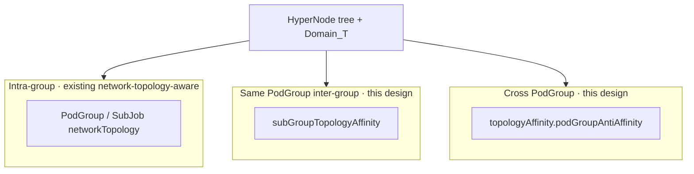

**Diagram · Multiple instances each on one supernode (Example 2):**

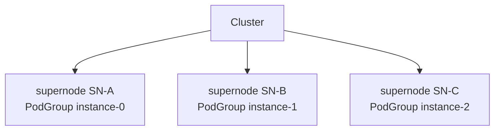

**Diagram · Multiple shards within one instance (Example 4):** Shards **split across cabinets**, entire instance **shares one supernode**.

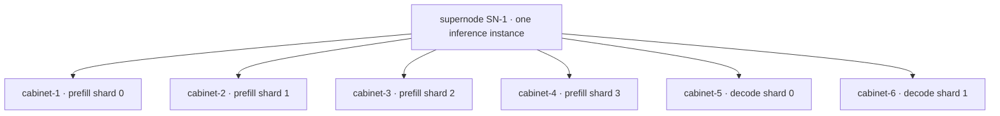

**Diagram · Intra-group + inter-group on the same scheduling chain:**

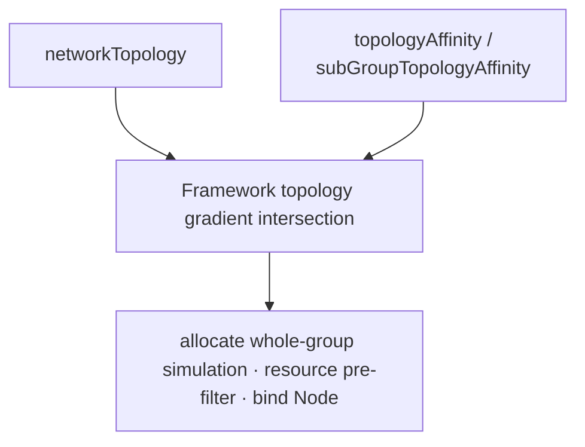

---
## Design Goals

| Goal | Description |
|------|-------------|
| **Declarable inter-group constraints** | **Cross-PodGroup anti-affinity** (`topologyAffinity.podGroupAntiAffinity`) + **cross-SubGroup affinity/anti-affinity within the same PodGroup** (`subGroupTopologyAffinity`); topology comparison tier supports `topologyTierName` / `topologyTier` (within `topologyDomain`), same as intra-group `networkTopology` |
| **Clear scope** | Cross-PodGroup and cross-SubGroup use separate fields; intra-group still uses `networkTopology`, not mixed with inter-group |
| **Hard / Soft distinguishable** | Inter-group hard/soft expressed via `required` / `preferred` lists; `networkTopology` uses `mode` separately |
| **Composable with network-topology-aware** | New plugin `group-topology-affinity` handles inter-group; hard topology gradient **multi-plugin intersection** then unified tier layering; capacity pre-filtered in allocate **resource pre-filter** |
| **Verifiable and evolvable** | Admission Webhook validation; API extended via optional additive fields; Phase 1 delivers main path (see [Delivery Phases](#delivery-phases)) |

Capability layering illustration: [Goal Illustration (Volcano Perspective)](#goal-illustration-volcano-perspective).

## Scope

### In Scope

- **PodGroup API** (scope separation):
  - `topologyAffinity.podGroupAntiAffinity`: **cross-PodGroup anti-affinity** (`podGroupSelector`, standard `metav1.LabelSelector`)
  - `subGroupTopologyAffinity`: **affinity and anti-affinity across `subGroupPolicy` (SubJob) within the same PodGroup**; **does not** cross PodGroups
- **Plugins**: `group-topology-affinity` (inter-group hard gradient + soft order) + existing `network-topology-aware` (intra-group Gang / binpack)
- **Framework**: topology-class `HyperNodeGradient` **set intersection + re-layer by tier** across plugins (no resource judgment)
- **allocate**: `filterGradientsByMinResource` (decoupled from `HyperNodeGradientFor*Fn`)
- **Admission Webhook** validation
- **Phase 1**: hard (`required` → gradient pruning) + soft (`preferred` + `weight` → order scoring)

### Out of Scope

| Item | Description |
|------|-------------|
| Intra-group Gang / no cross-tier | Continues to be handled by `PodGroupSpec.networkTopology`, `subGroupPolicy[].networkTopology` + network-topology-aware |
| Per-Pod spread within SubJob | Use intra-group `networkTopology` or `topologySpreadConstraints` / `podAffinity` on Pod templates (kube-scheduler); not extended in this design |
| Cross-Namespace SubGroup peer matching | Not supported |
| `preempt` / `backfill` topology consistency | Phase 2+ |
| Batch Job API and `PartitionPolicy` sync | Phase 2+, can be integrated on the same path later |
| PodGroup `TopologyUnsatisfiable` Condition | Phase 2 (optional, see [Status (Optional)](#status-optional)) |
| **Cross-PodGroup affinity** `topologyAffinity.podGroupAffinity` | **Not implemented** (see [Design Decision-2](#ad-2-phase-1-no-podgroupaffinity-in-crd)) |

Design decisions: [#design-decisions](#design-decisions); delivery milestones: [#delivery-phases](#delivery-phases).

---

# User Stories

The stories below correspond one-to-one with examples in [#user-scenarios-and-capability-mapping](#user-scenarios-and-capability-mapping).

1. **Training / Single-Group Gang (Examples 1, 3)**  
   As a platform user, I want all Workers in a Job to be gang-scheduled within a cabinet or supernode so that communication-intensive training gets stable bandwidth; intra-group capability is satisfied by existing `networkTopology` — **this proposal does not re-implement it**.

2. **Multi inference instance fault isolation (Examples 2, 5)**  
   As an inference service operator, I want multiple PodGroups (instances) to **each occupy a different supernode**, avoiding a single point of failure taking down all online replicas; requires **PodGroup-level** `podGroupSelector` anti-affinity, not stacking rules on Pod templates.

3. **Prefill–Decode multi-shard (Examples 4, 6, 7)**  
   As a Prefill-Decode inference user, I want within one instance: shards **split across cabinets**, entire instance **shares one supernode**, intra-shard Gang preserved; optionally "prefill and decode forced to separate cabinets" or "prefer separate cabinets, degrade when resources are tight"; requires **`subGroupTopologyAffinity`** coordinated with `matchLabelKeys`.

---

## Design Decisions at a Glance

| Design Decision | Topic | Conclusion |
|-----------------|-------|------------|
| [Decision-1](#ad-1-cross-podgroup-anti-affinity-only) | Cross PodGroup | **Only** `podGroupAntiAffinity` |
| [Decision-2](#ad-2-phase-1-no-podgroupaffinity-in-crd) | `podGroupAffinity` | Phase 1 **not declared in CRD** |
| [Decision-3](#ad-3-subgroup-anti-affinity-dual-selector) | SubGroup anti-affinity term | **Dual selector** |
| [Decision-4](#ad-4-subgrouptopologyaffinity-at-podgroup-top-level) | Where to place inter-group edges | **PodGroup top level** |
| [Decision-5](#ad-5-inter-group-hard-soft) | Inter-group hard/soft | **`required` / `preferred`**, terms forbid `mode` |
| [Decision-6](#ad-6-tiername-or-tier-int-mutually-exclusive) | Topology comparison tier | **`topologyTierName` and `topologyTier` mutually exclusive** |
| [Decision-7](#ad-7-inter-group-tier-naming-and-kubernetes-topologykey) | Field naming | **`topologyTierName` / `topologyTier`** (not `topologyKey`); terms nest **`topologyDomain`** |

Rationale: [#design-decisions](#design-decisions).

---

# User Scenarios and Capability Mapping

Organized as **scenario → business value → configuration capability → HyperNode scheduling result**. Diagrams use the same **multi-level HyperNode tree** (consistent with cluster CRs; example tier names are `supernode` / `cabinet`).

## Three Capability Types and Scope

| Capability | Configuration Location | Scope | Problem Solved |
|------------|------------------------|-------|----------------|
| Job / PodGroup-level domain aggregation | `PodGroupSpec.networkTopology` | **Entire PodGroup (Job)** | Entire Job does not cross a tier (e.g., shares **one supernode**) |
| Intra-SubJob Gang | `subGroupPolicy[].networkTopology` | Pods within the same SubJob | A group of Pods **aggregated within** a topology domain (e.g., single cabinet) |
| Inter-group mutual exclusion / co-domain (same PodGroup) | `subGroupTopologyAffinity` | Between SubJobs split by different `subGroupPolicy` | Shard **mutual exclusion**, role **co-domain** (see Example 4) |
| Cross PodGroup | `topologyAffinity.podGroupAntiAffinity` | Different PodGroups (multi instance) | Multi-replica service **fault domain** isolation |

> **Topology comparison tier:** Example YAML mostly uses `topologyTierName`; equivalent `topologyTier` integer see [Design Decision-6](#ad-6-tiername-or-tier-int-mutually-exclusive) and [HyperNode Tiers](#hypernode-tiers-and-topologytier-topologytiername).

## How to Read Scheduling Result Diagrams

In diagrams, **boxes = HyperNode** (layered by `tierName`), **bottom layer = Node / Pod**; **dashed boxes = same `Domain_T`** (treated as the same scheduling domain at that tier). Mermaid **node IDs** use semantic snake_case (e.g., `cluster_root`, `supernode_instance_0`, `cabinet_prefill_shard_0`), matching displayed meaning.

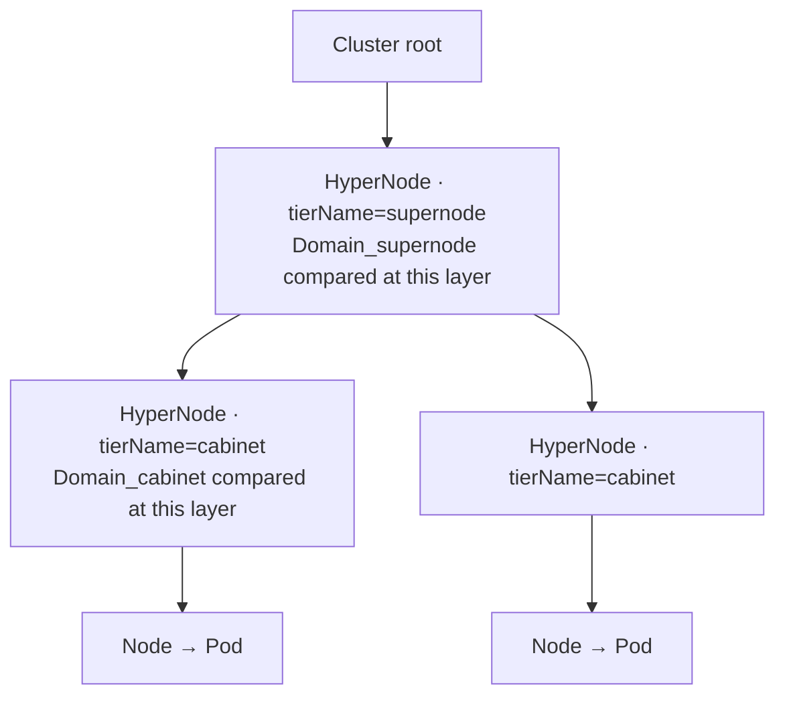

**Legend:**

| Symbol | Meaning |
|--------|---------|
| Multiple Pods under same-color cabinet | Intra-group Gang (`networkTopology`) |
| Multiple cabinets under one supernode | See [Example 4](#example-4-distributed-prefill-decode-inference-recommended) (Approach 1 or 2) |
| Different cabinets under same supernode | `subGroupAntiAffinity` @ cabinet (intra-policy shard mutual exclusion) |
| Two supernodes each hosting one PodGroup | `podGroupAntiAffinity` @ supernode (cross instance) |

## Scenario Overview

| # | Scenario | Business Value | Capability Used | Default Recommendation |
|---|----------|----------------|-----------------|------------------------|
| [Example 1](#example-1-training-job-intra-group-gang) | Training / synchronous training Worker Gang | Intra-machine/cabinet NVLink or high-bandwidth domain training | `networkTopology` only | Training default |
| [Example 2](#example-2-multi-inference-instance-fault-isolation) | Multiple inference instances in parallel | Single supernode failure does not take down all online replicas | `podGroupAntiAffinity` | Multi-replica serving |
| [Example 3](#example-3-single-template-online-inference) | No Prefill-Decode split | Simple configuration, whole-group Gang | `networkTopology` only | Small model inference |
| [Example 4](#example-4-distributed-prefill-decode-inference-recommended) | 4×prefill + 2×decode shards | Shard fault isolation + Prefill-Decode low latency (shared supernode) | `subGroupPolicy` + `matchLabelKeys` + shard anti-affinity; shared supernode choose one (see Example 4) | **Prefill-Decode production default** |
| [Example 5](#example-5-multi-instance-pd-combination) | Example 4 + multi instance | Capacity scaling + dual-layer fault domain | `podGroupAntiAffinity` + Example 4 | Full production stack |
| [Example 6](#example-6-optional-prefill-decode-cross-role-cabinet-split) | prefill and decode forced separate cabinets | Role-level resource/fault hard isolation (sacrifices locality) | Cross-policy `subGroupAntiAffinity` | **Special requirements only** |
| [Example 7](#example-7-subgroup-soft-anti-affinity-optional) | Prefill-Decode shards **prefer** separate cabinets | Still schedulable when resources are tight | `subGroupAntiAffinity.preferred` + `weight` | Non-critical SLO |

**Not recommended as Prefill-Decode default:** prefill and decode **cross-role cabinet split** (Example 6) — usually opposite to "shared supernode, lower Prefill-Decode communication cost"; **recommended** is intra-policy prefill↔prefill, decode↔decode cabinet split (Example 4).

---

## Scenario Examples

> Each example includes: **scenario and value** → **configuration highlights** → **scheduling result (HyperNode tree)** → **differences from other examples**.  
> **Dual tier notation (example cluster):** `supernode` ↔ `spec.tier: 2`, `cabinet` ↔ `spec.tier: 1`. YAML below annotates equivalent **`highestTierAllowed` / `topologyTier` integers** beside `highestTierName` / `topologyTierName` (choose one, do not enable both).

### Example 1: Training Job — Intra-Group Gang

**Scenario:** Single PodGroup, multiple Workers (e.g., 4 groups × 8 GPU) gang-scheduled within one training Job.  
**Business value:** Pods within the same SubJob land in **the same cabinet (or lower tier)**, improving intra-machine/cabinet communication bandwidth for AllReduce and other collective communication.  
**Capability:** `networkTopology` (**does not** use `topologyAffinity` / `subGroupTopologyAffinity`).

| Configuration Choice | Applicable When |
|------------------------|-----------------|
| `subGroupPolicy[].networkTopology` @ cabinet | Multiple SubJobs / partitions, 8 Pods per zone aggregated in cabinet |
| `PodGroupSpec.networkTopology` @ supernode | Entire Job shares supernode (when no shard mutual exclusion) |

```yaml
spec:
  minMember: 32
  # Optional: entire Job does not cross supernode
  # networkTopology: { mode: hard, highestTierName: supernode }
  # or: networkTopology: { mode: hard, highestTierAllowed: 2 }
  subGroupPolicy:
    - name: workers
      subGroupSize: 8
      networkTopology:
        mode: hard
        highestTierName: cabinet
        # highestTierAllowed: 1   # mutually exclusive with highestTierName: cabinet
```

**Scheduling result (HyperNode tree):** Each SubJob (8 Pods) occupies **one** cabinet; intra-group Pods do not cross cabinets.

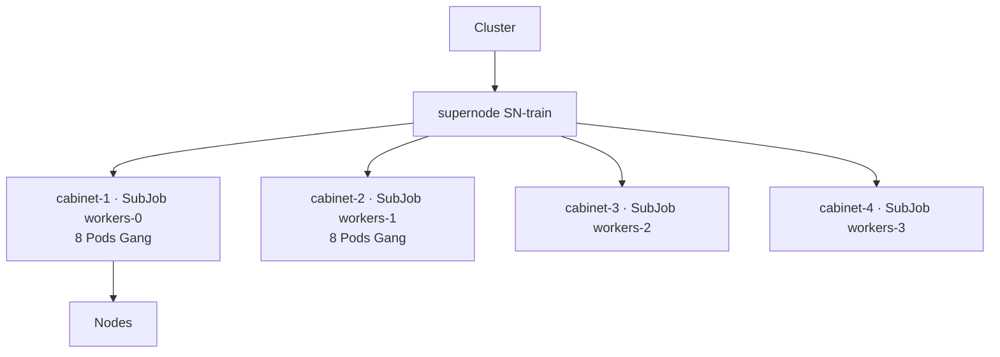

**Difference:** No inter-group topology API; for multi-Job mutual exclusion, see Example 2.

---

### Example 2: Multi inference instance — Fault Isolation

**Scenario:** Same model `llama-70b`, 3 PodGroups (instance-0/1/2) serving concurrently.  
**Business value:** Any **single supernode failure** affects only one instance; remaining instances continue serving.  
**Capability:** `topologyAffinity.podGroupAntiAffinity` @ `supernode` + `podGroupSelector` (matches `metadata.labels` on other PodGroups).

`metadata.labels` and keys/values in `podGroupSelector` must **match**; typically **one** label suffices to define the peer set (add more `matchLabels` or use `matchExpressions` only when AND/OR combinations are needed).

```yaml
metadata:
  labels:
    # [User-set] Volcano does not auto-generate; written by platform/business when creating PodGroup.
    # [Assignment principle] PodGroups that should be "in different domains" at the same topology layer
    #   (tier specified by topologyDomain) use the same value for this key;
    #   llama-70b-prod = multi-instance pool for the same production model service (instance-0/1/2 mutually
    #   exclusive on different supernodes).
    #   Different environments/traffic pools use different values (e.g., llama-70b-staging); unrelated to
    #   instance name or Pod template labels.
    topology.volcano.sh/spread-group: llama-70b-prod
spec:
  topologyAffinity:
    podGroupAntiAffinity:
      requiredDuringSchedulingIgnoredDuringExecution:
        - podGroupSelector:
            matchLabels:
              topology.volcano.sh/spread-group: llama-70b-prod
          topologyTierName: supernode
          # topologyTier: 2   # mutually exclusive with topologyTierName: supernode
```

**Scheduling result (HyperNode tree):** Comparison at **PodGroup-level** `Domain_supernode`; three instances land on **three different** supernodes.

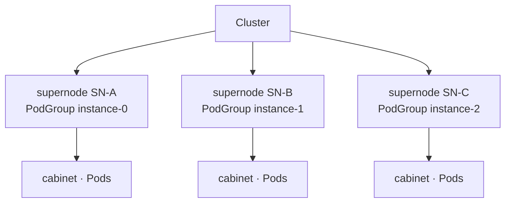

**Difference:** Constraint is **between PodGroups**; intra-instance Prefill-Decode topology see Example 4.

---

### Example 3: Single-Template Online Inference

**Scenario:** One Pod template, no prefill/decode split, whole-group replica Gang.  
**Business value:** Lowest configuration cost; suitable for online inference without PD or sharding.  
**Capability:** `PodGroupSpec.networkTopology` and/or `subGroupPolicy[].networkTopology` (choose one or combine).

```yaml
spec:
  minMember: 8
  networkTopology:
    mode: hard
    highestTierName: cabinet
    # highestTierAllowed: 1   # mutually exclusive with highestTierName: cabinet
  # or subGroupPolicy:
  #   - name: infer
  #     subGroupSize: 8
  #     networkTopology: { mode: hard, highestTierName: cabinet }
  #     # networkTopology: { mode: hard, highestTierAllowed: 1 }
```

**Scheduling result (HyperNode tree):**

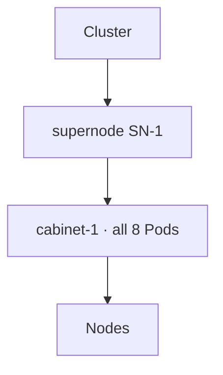

**Difference:** With only 1 policy and no inter-group requirements, **do not** configure `subGroupTopologyAffinity`.

---

### Example 4: Distributed Prefill-Decode Inference (Recommended)

**Scenario:** One inference instance: 4 prefill shards (8 Pods each) + 2 decode shards (6 Pods each); use **two `subGroupPolicy` entries `prefill` / `decode`** + **`matchLabelKeys`** to express shards — **do not** create separate policy names per shard (no `prefill-0`, etc.).

**Business goals (both approaches equivalent):**

| Constraint | Business Meaning |
|------------|------------------|
| Same-role shards **on different cabinets** | Single cabinet failure does not take down all prefill or all decode |
| prefill + decode **on the same supernode** | Prefill-Decode cross-stage traffic stays within supernode when possible, lowering latency |
| prefill and decode **not forced to separate cabinets** | Allows a decode shard to share cabinet with a prefill shard; more scheduling flexibility |
| Pods within each shard **cabinet Gang** | 8/6 Pods per shard still in high-speed domain |

**Shared configuration (both approaches):** `subGroupPolicy` (with `matchLabelKeys`, intra-group `networkTopology` @ cabinet) + **`subGroupAntiAffinity`** (prefill↔prefill, decode↔decode separate cabinets).  
**Only "shared supernode" differs** (see below).

---

#### Approach 1: Declare "entire inference instance shares supernode" on PodGroup

Suitable when managing resource domains by **instance / PodGroup**; top-level YAML clearly shows "this replica does not cross supernode".

```yaml
spec:
  minMember: 44
  networkTopology:
    mode: hard
    highestTierName: supernode
    # highestTierAllowed: 2   # mutually exclusive with highestTierName: supernode
  subGroupPolicy:
    - name: prefill
      labelSelector:
        matchLabels: { volcano.sh/role: prefill }
      matchLabelKeys: [volcano.sh/shard-id]
      subGroupSize: 8
      minSubGroups: 4
      networkTopology: { mode: hard, highestTierName: cabinet }
      # networkTopology: { mode: hard, highestTierAllowed: 1 }
    - name: decode
      labelSelector:
        matchLabels: { volcano.sh/role: decode }
      matchLabelKeys: [volcano.sh/shard-id]
      subGroupSize: 6
      minSubGroups: 2
      networkTopology: { mode: hard, highestTierName: cabinet }
      # networkTopology: { mode: hard, highestTierAllowed: 1 }
  subGroupTopologyAffinity:
    subGroupAntiAffinity:
      requiredDuringSchedulingIgnoredDuringExecution:
        - subGroupSelector:
            matchSubGroupPolicyNames: [prefill]
          antiSubGroupSelector:
            matchSubGroupPolicyNames: [prefill]
          topologyTierName: cabinet
          # topologyTier: 1
        - subGroupSelector:
            matchSubGroupPolicyNames: [decode]
          antiSubGroupSelector:
            matchSubGroupPolicyNames: [decode]
          topologyTierName: cabinet
          # topologyTier: 1
```

---

#### Approach 2: Declare "prefill and decode share supernode" in inter-group topology

Suitable when preferring to centralize Prefill-Decode **inter-role relationships** in **`subGroupTopologyAffinity`** (shard mutual exclusion + shared supernode in one section).

```yaml
spec:
  minMember: 44
  subGroupPolicy:
    - name: prefill
      labelSelector:
        matchLabels: { volcano.sh/role: prefill }
      matchLabelKeys: [volcano.sh/shard-id]
      subGroupSize: 8
      minSubGroups: 4
      networkTopology: { mode: hard, highestTierName: cabinet }
      # networkTopology: { mode: hard, highestTierAllowed: 1 }
    - name: decode
      labelSelector:
        matchLabels: { volcano.sh/role: decode }
      matchLabelKeys: [volcano.sh/shard-id]
      subGroupSize: 6
      minSubGroups: 2
      networkTopology: { mode: hard, highestTierName: cabinet }
      # networkTopology: { mode: hard, highestTierAllowed: 1 }
  subGroupTopologyAffinity:
    subGroupAffinity:
      requiredDuringSchedulingIgnoredDuringExecution:
        - matchSubGroupPolicyNames: [prefill, decode]
          topologyTierName: supernode
          # topologyTier: 2
    subGroupAntiAffinity:
      requiredDuringSchedulingIgnoredDuringExecution:
        - subGroupSelector:
            matchSubGroupPolicyNames: [prefill]
          antiSubGroupSelector:
            matchSubGroupPolicyNames: [prefill]
          topologyTierName: cabinet
          # topologyTier: 1
        - subGroupSelector:
            matchSubGroupPolicyNames: [decode]
          antiSubGroupSelector:
            matchSubGroupPolicyNames: [decode]
          topologyTierName: cabinet
          # topologyTier: 1
```

---

#### Both Approaches: Business Similarities and Differences

| | Description |
|---|-------------|
| **Similarities** | Target topology is the same: 6 shards occupy 6 cabinets, and **all belong to one supernode**; intra-shard Gang, inter-shard mutual exclusion, prefill/decode not forced to separate cabinets; **shard mutual exclusion and intra-group same-cabinet YAML are identical**, independent of shared-supernode approach (see diagram below). |
| **Difference · Configuration intent** | **Approach 1**: entire PodGroup (inference instance) does not cross supernode. **Approach 2**: only policies named in `matchSubGroupPolicyNames` (here prefill + decode) share supernode. |
| **Difference · Scope** | **Approach 1** constrains **all workload within this PodGroup** (if other `subGroupPolicy` entries are added later, they default to "entire instance does not cross supernode"). **Approach 2** only constrains policies named in affinity terms (here `[prefill, decode]`); other policies **not in the term are not constrained** by this shared-supernode rule. |
| **Difference · Configuration style** | **Approach 1** writes shared supernode at top-level `spec`, consistent with Example 3 "whole-group Gang" style. **Approach 2** puts shared supernode alongside shard mutual exclusion in `subGroupTopologyAffinity`, convenient for maintaining one "inter-group rules" block. |
| **Selection guidance** | When only prefill/decode exist and **entire instance boundary** should be expressed, **Approach 1 is recommended**; if team convention requires all inter-group topology in `subGroupTopologyAffinity`, use **Approach 2**, but **do not duplicate** the same supernode constraint with Approach 1. |

**Expected deployment shape (both approaches identical):**

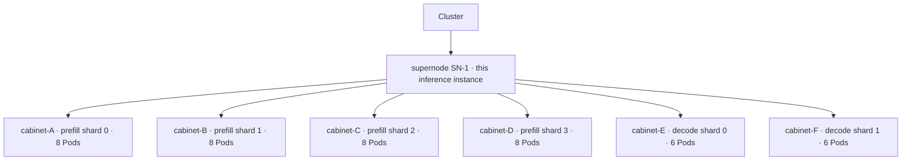

| What You See in Cluster | Configuration Meaning |
|-------------------------|----------------------|
| 8 or 6 Pods within each cabinet | Each `subGroupPolicy.networkTopology` @ cabinet (intra-shard Gang) |
| 4 prefill cabinets all different | `subGroupAntiAffinity`: both sides `[prefill]` |
| 2 decode cabinets all different | `subGroupAntiAffinity`: both sides `[decode]` |
| All under SN-1 | Approach 1: `PodGroup.networkTopology`; Approach 2: `subGroupAffinity` `[prefill, decode]` @ supernode |
| decode may share cabinet with a prefill | **Not configured** cross-role cabinet split rule between prefill and decode |

**Fill-in reminder:** `matchSubGroupPolicyNames` only lists policy names **`prefill` / `decode`**, not shard suffixes like `prefill-0`.

---

### Example 5: Multi instance + Prefill-Decode Combination

**Scenario:** Example 4 × N PodGroups.  
**Business value:** Outer supernode fault isolation + inner shard cabinet isolation and shared-supernode PD.  
**Capability:** `topologyAffinity.podGroupAntiAffinity` + all Example 4 configuration.

```yaml
metadata:
  labels:
    topology.volcano.sh/spread-group: llama-70b-prod   # same as Example 2: user-set, multiple instances share same value
spec:
  topologyAffinity:
    podGroupAntiAffinity:
      requiredDuringSchedulingIgnoredDuringExecution:
        - podGroupSelector:
            matchLabels:
              topology.volcano.sh/spread-group: llama-70b-prod
          topologyTierName: supernode
          # topologyTier: 2
  # subGroupPolicy + shared supernode + subGroupAntiAffinity: same as Example 4 (Approach 1 recommended)
  # intra/inter-group tier integer comments see Example 4
```

**Scheduling result (HyperNode tree):**

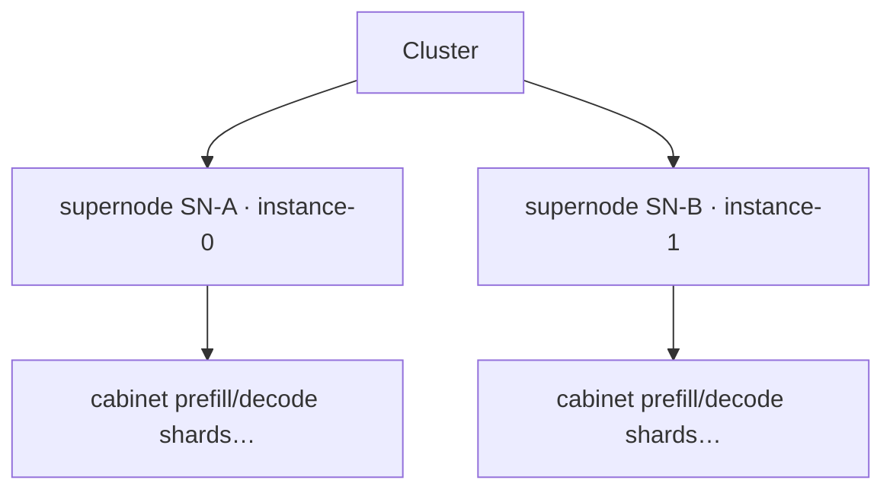

**Difference:** `podGroupAntiAffinity` ensures SN-A ≠ SN-B; **within each supernode** replicates Example 4 six-cabinet structure.

---

### Example 6 (Optional): prefill and decode **Cross-Role** Cabinet Split

**Scenario:** Beyond Example 4, force prefill cabinet group and decode cabinet group to be **disjoint**.  
**Business value:** Role-level GPU/TOR hard isolation, compliance domain separation; **cost** is cross-role communication more likely crosses cabinets.  
**When to use:** Explicit ops requirement; **not Prefill-Decode default** (often conflicts with lowering Prefill-Decode latency).  
**Capability:** Shared supernode config same as [Example 4](#example-4-distributed-prefill-decode-inference-recommended); additionally cross-role `subGroupAntiAffinity` (prefill vs decode separate cabinets).

```yaml
spec:
  networkTopology:
    mode: hard
    highestTierName: supernode
    # highestTierAllowed: 2
  subGroupTopologyAffinity:
    subGroupAntiAffinity:
      requiredDuringSchedulingIgnoredDuringExecution:
        - subGroupSelector:
            matchSubGroupPolicyNames: [prefill]
          antiSubGroupSelector:
            matchSubGroupPolicyNames: [decode]
          topologyTierName: cabinet
          # topologyTier: 1
  # shard mutual exclusion, intra-group @ cabinet same as Example 4, omitted
```

**Scheduling result comparison (HyperNode tree):**

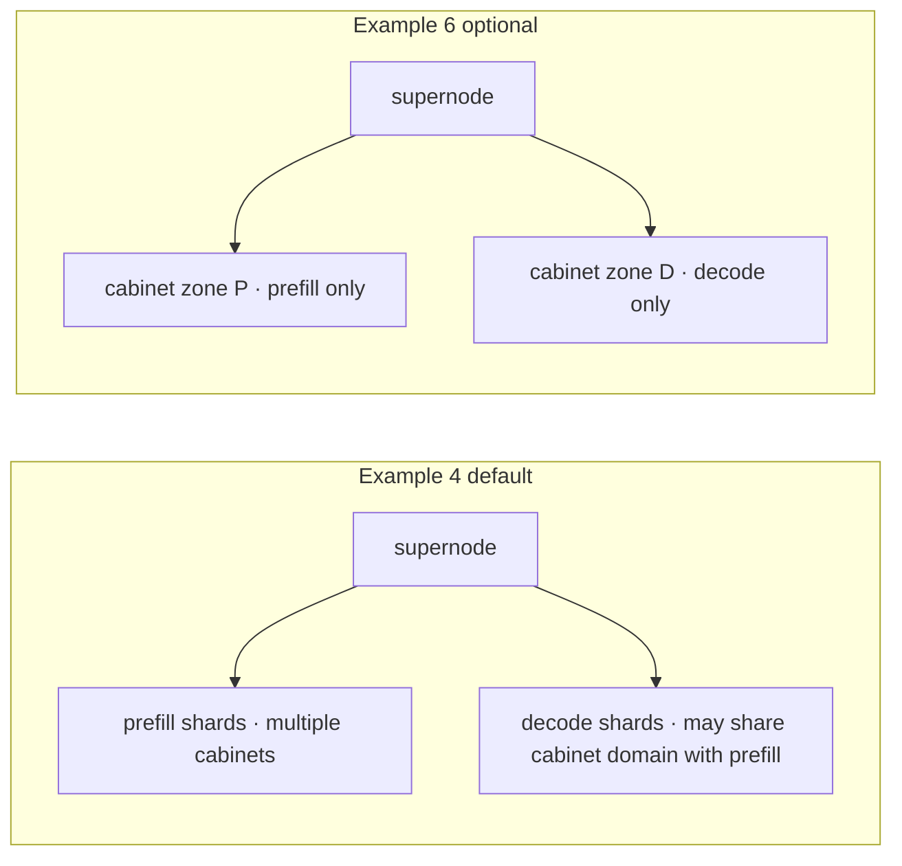

**Difference:** Example 6 **layers on** Example 4; most deployments only need intra-policy `[prefill]` / `[decode]` mutual exclusion.

---

### Example 7: SubGroup Soft Anti-Affinity (Optional)

**Scenario:** Same 4 Prefill shards + 2 Decode shards Prefill-Decode layout as [Example 4](#example-4-distributed-prefill-decode-inference-recommended), but cabinet resources are tight: prefer prefill / decode **each shard on a different cabinet**, **but do not block scheduling if impossible**.  
**Business value:** Trade-off between fault isolation and availability — still spread shards when cabinets available; allow temporary same-cabinet when not, avoiding long Pending PodGroup.

#### Comparison with Example 4 (`required` anti-affinity)

| | Example 4 (`requiredDuringSchedulingIgnoredDuringExecution`) | Example 7 (`preferredDuringSchedulingIgnoredDuringExecution` + `weight`) |
|---|-------------------------------------|--------------------------------------|
| **Business semantics** | Shards **must** be on separate cabinets, otherwise unsatisfied | Shards **prefer** separate cabinets; scheduling still succeeds if not |
| **Applicable when** | Production default, SLO requires shard-level fault domain | Canary, scale-out, insufficient cabinet headroom, non-critical batch inference |
| **Shared supernode** | Still recommend Approach 1 `PodGroup.networkTopology` @ supernode (same as Example 4) | Same |

#### Configuration Example

Based on Example 4 **Approach 1**, change `subGroupAntiAffinity` `required` to `preferred`, and set `weight` on terms (higher = stronger preference to avoid same cabinet):

```yaml
spec:
  minMember: 44
  networkTopology:
    mode: hard
    highestTierName: supernode
    # highestTierAllowed: 2
  subGroupPolicy:
    - name: prefill
      labelSelector:
        matchLabels: { volcano.sh/role: prefill }
      matchLabelKeys: [volcano.sh/shard-id]
      subGroupSize: 8
      minSubGroups: 4
      networkTopology: { mode: hard, highestTierName: cabinet }
      # networkTopology: { mode: hard, highestTierAllowed: 1 }
    - name: decode
      labelSelector:
        matchLabels: { volcano.sh/role: decode }
      matchLabelKeys: [volcano.sh/shard-id]
      subGroupSize: 6
      minSubGroups: 2
      networkTopology: { mode: hard, highestTierName: cabinet }
      # networkTopology: { mode: hard, highestTierAllowed: 1 }
  subGroupTopologyAffinity:
    subGroupAntiAffinity:
      preferredDuringSchedulingIgnoredDuringExecution:
        - weight: 100
          term:
            subGroupSelector:
              matchSubGroupPolicyNames: [prefill]
            antiSubGroupSelector:
              matchSubGroupPolicyNames: [prefill]
            topologyTierName: cabinet
            # topologyTier: 1
        - weight: 100
          term:
            subGroupSelector:
              matchSubGroupPolicyNames: [decode]
            antiSubGroupSelector:
              matchSubGroupPolicyNames: [decode]
            topologyTierName: cabinet
            # topologyTier: 1
```

> **Note:** Soft anti-affinity is expressed **only** via `preferredDuringSchedulingIgnoredDuringExecution` + `weight`; **do not** also write `mode: soft` on the term (duplicates `required`/`preferred`). Within `term`, only `subGroupSelector`, `antiSubGroupSelector`, `topologyTierName` (or `topologyTier`) are needed.

#### Expected Behavior (Business Perspective)

| Cluster Condition | Typical Result |
|-------------------|----------------|
| **≥6 available cabinets** within supernode | Similar to Example 4: 6 shards each on one cabinet (scheduler prefers candidates "different cabinet from already placed shards") |
| **Fewer than 6 available cabinets** | Scheduling may still succeed: some shards **same cabinet**, overall score lower; does not trigger hard failure |
| Shared supernode only | Guaranteed by `networkTopology` @ supernode; soft anti-affinity **does not replace** shared-supernode hard constraint |

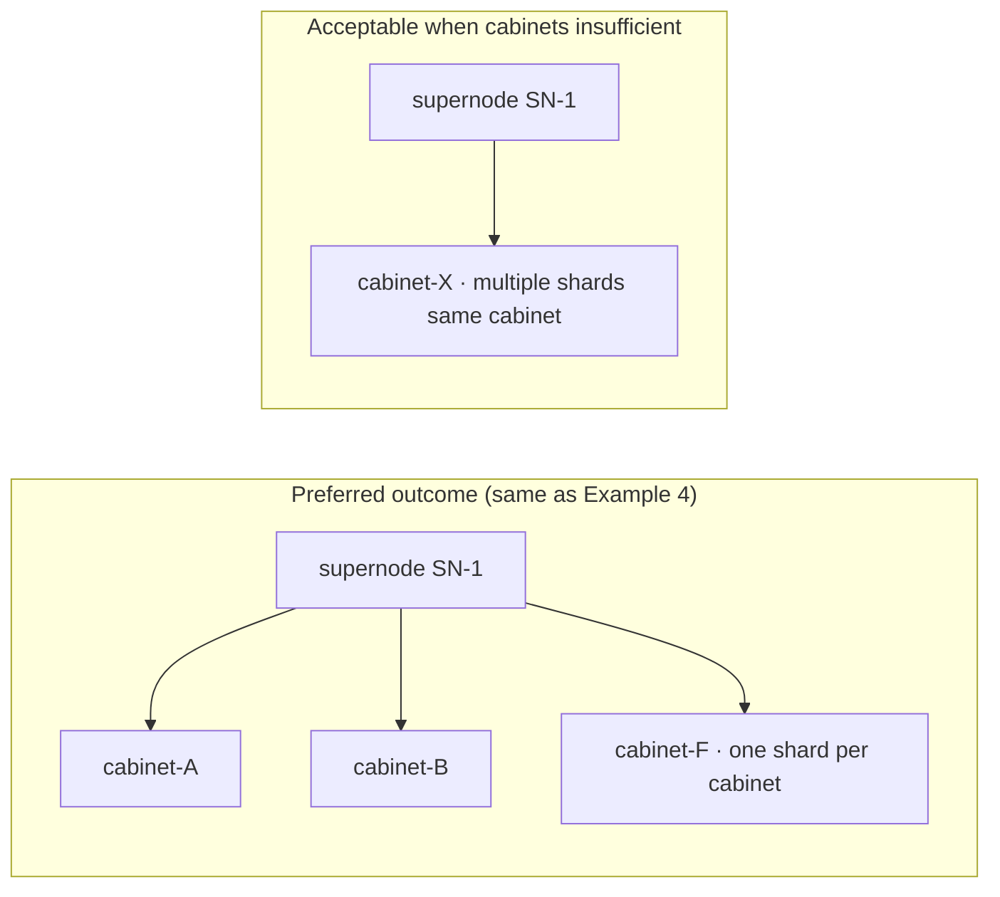

**Fill-in reminders:**

- Intra-policy mutual exclusion: both selectors still use **same** `[prefill]` or `[decode]` (same as Example 4), **not** prefill vs decode.
- **Do not** make shared supernode soft: Prefill-Decode low-latency path usually still uses **hard** `networkTopology` @ supernode (or Example 4 Approach 2 hard `subGroupAffinity`).
- Can **mix** with required constraints (e.g., supernode `required` hard, cabinet split only `preferred` soft); Webhook tier relationship validation uses **required** terms.

**Cross-PodGroup soft anti-affinity** (multiple instances prefer separate supernodes but do not hard-fail) can analogously use `topologyAffinity.podGroupAntiAffinity.preferred`, same idea as table above; scenario see [Example 2](#example-2-multi-inference-instance-fault-isolation).

---

# API Design

PodGroup fields, Go types, and capability boundaries. Configuration examples: [#user-scenarios-and-capability-mapping](#user-scenarios-and-capability-mapping); tier fill-in: [#hypernode-tiers-and-topologytier-topologytiername](#hypernode-tiers-and-topologytier-topologytiername); API trade-offs: **Appendix**.

## PodGroupSpec New Fields

```go
type PodGroupSpec struct {
    // ... existing fields ...

    // TopologyAffinity: cross-PodGroup topology vs OTHER PodGroups (podGroupSelector).
    // Phase 1 CRD exposes only podGroupAntiAffinity under this object; podGroupAffinity is not declared (see design doc).
    // Intra-PodGroup SubJob relationships: use SubGroupTopologyAffinity.
    // Evaluated at Job scope (HyperNodeGradientForJobFn).
    // +optional
    TopologyAffinity *PodGroupTopologyAffinitySpec `json:"topologyAffinity,omitempty"`

    // SubGroupTopologyAffinity expresses topology affinity/anti-affinity between SubGroupPolicies
    // defined in THIS PodGroup's subGroupPolicy list only. Evaluated per SubJob at
    // HyperNodeGradientForSubJob scope; peers are other SubJobs of the same JobInfo (same PodGroup UID).
    // Cannot reference PodGroups in other namespaces; peers matched via podGroupSelector on PodGroup labels.
    // Requires subGroupPolicy; ignored (webhook reject) if subGroupPolicy is empty.
    // +optional
    SubGroupTopologyAffinity *SubGroupTopologyAffinitySpec `json:"subGroupTopologyAffinity,omitempty"`
}
```

> **`podGroupAffinity`:** Phase 1 does not declare this field in CRD; rationale see [Design Decision-2](#ad-2-phase-1-no-podgroupaffinity-in-crd). In implementation, reference design decision-2 in `PodGroupTopologyAffinitySpec` godoc.

## Core Types

```go
// TopologyDomainSpec selects the HyperNode tier at which Domain_T is computed for cross-group comparison.
// Semantics align with choosing a "topology dimension" (cf. PodTopologySpread topologyKey), but values come
// from HyperNode.spec.tierName / spec.tier — NOT from Node label keys. See design decision-7.
type TopologyDomainSpec struct {
    // TopologyTier: compare scheduling domains at HyperNode.spec.tier (integer).
    // Must match the numeric tier of a HyperNode layer in this cluster. Mutually exclusive with TopologyTierName.
    // +kubebuilder:validation:Minimum=0
    // +optional
    TopologyTier *int `json:"topologyTier,omitempty"`

    // TopologyTierName: compare scheduling domains at HyperNode.spec.tierName (string).
    // The value MUST be identical to tierName configured on HyperNode CRs in the cluster (case-sensitive).
    // Scheduler resolves it via Session HyperNodeTierNameMap (same source as networkTopology.highestTierName).
    // Example: if cabinet HyperNodes use spec.tierName: cabinet, set topologyTierName: cabinet here.
    // Mutually exclusive with TopologyTier.
    // +optional
    TopologyTierName string `json:"topologyTierName,omitempty"`
    // Note: hard vs soft for topologyAffinity / subGroupTopologyAffinity is NOT expressed here.
    // Use requiredDuringSchedulingIgnoredDuringExecution (hard) vs
    // preferredDuringSchedulingIgnoredDuringExecution (soft), aligned with Kubernetes PodAffinity.
}

// NetworkTopologySpec (PodGroup / SubGroupPolicy): domain aggregation with explicit mode.
// +kubebuilder:validation:Enum=hard;soft
type NetworkTopologySpec struct {
    Mode               NetworkTopologyMode `json:"mode,omitempty"`
    HighestTierName    string              `json:"highestTierName,omitempty"`
    HighestTierAllowed *int                `json:"highestTierAllowed,omitempty"`
}
```

> Correspondence between `TopologyDomainSpec` tier fields and HyperNode CR, fill-in steps, and comparison with Kubernetes `topologyKey`: [#hypernode-tiers-and-topologytier-topologytiername](#hypernode-tiers-and-topologytier-topologytiername) and [Design Decision-7](#ad-7-inter-group-tier-naming-and-kubernetes-topologykey).

### Alignment with `networkTopology` tier / tierName

Intra-group `NetworkTopologySpec` and inter-group `TopologyDomainSpec` use **the same HyperNode tier source**, with different semantics (intra-group "do not cross" vs inter-group "compare Domain same/different at this layer"):

| Purpose | String (`spec.tierName`) | Integer (`spec.tier`) | Mutually Exclusive |
|---------|--------------------------|----------------------|-------------------|
| **Intra-group** Gang / envelope | `networkTopology.highestTierName` | `networkTopology.highestTierAllowed` | Yes |
| **Inter-group** affinity / antiAffinity term | `topologyDomain.topologyTierName` | `topologyDomain.topologyTier` | Yes |

The scheduler maintains **`HyperNodeTierNameMap`** (`tierName → tier`) and **`HyperNodeTierSet`** (set of `spec.tier` values seen in cluster) in Session; `network-topology-aware` and `group-topology-affinity` **share** the above mapping to resolve tiers, ensuring `highestTierName: supernode` and `topologyTierName: supernode` (or `highestTierAllowed: 2` and `topologyTier: 2`) on the same Job point to **the same physical layer**.

### Semantic Comparison with Kubernetes `topologyKey` (Quick Reference)

| | Kubernetes (Pod topology spread / affinity) | Volcano inter-group topology term |
|---|---------------------------------------------|-----------------------------------|
| **Field** | `topologySpreadConstraints[].topologyKey`, etc. | `topologyDomain.topologyTierName` (or `topologyTier`) |
| **What user fills** | Node **label key** (e.g., `topology.kubernetes.io/zone`, `kubernetes.io/hostname`) | HyperNode **`spec.tierName`** (e.g., `supernode`, `cabinet`), **not** Node label |
| **How domains are divided** | Nodes with same label **key+value** form one domain | Walk HyperNode parent chain, first ancestor `metadata.name` matching `tierName`/`tier` is `Domain_T` |
| **Why not called `topologyKey`** | — | Same name as existing **`podAffinity.topologyKey` (Node label key)** in Job/Pod templates but different meaning; easy to mistakenly fill zone/hostname; see [Decision-7](#ad-7-inter-group-tier-naming-and-kubernetes-topologykey) |

**Recommendation:** Consistent with existing [Network Topology Aware Scheduling](./Network%20Topology%20Aware%20Scheduling.md) design doc, ops side prefers **`tierName`** (cross-cluster lookup table friendly); automation/template generation can use **`tier` integer** (one-to-one with `spec.tier` in CR, no string naming dependency).

### `required` / `preferred` vs `mode` (No Duplication)

| API | How to express hard / soft | Write `mode` on term? |
|-----|---------------------------|----------------------|
| `topologyAffinity` / `subGroupTopologyAffinity` | **`requiredDuringSchedulingIgnoredDuringExecution`** = must satisfy (hard); **`preferredDuringSchedulingIgnoredDuringExecution`** = prefer satisfy (soft, higher `weight` = stronger preference) | **No** (consistent with Kubernetes `PodAffinity` / `PodAntiAffinity`) |
| `PodGroupSpec.networkTopology`, `subGroupPolicy[].networkTopology` | Field **`mode: hard \| soft`** (no required/preferred lists) | **Yes** (only these two configuration types use `mode`) |

**Why not keep `mode` on terms:** Writing `mode: soft` inside `preferred` list, or `mode: hard` inside `required`, duplicates list semantics and may produce contradictions like `required` + `mode: soft`. Webhook **rejects or ignores** `mode` inside `topologyDomain` for inter-group topology terms.

**Implementation convention:** `ContainsHardCrossSubGroupTopology` / `ContainsHardCrossPodGroupTopology` only check for **non-empty `required`** lists; `preferred` entries only register `HyperNodeOrderFn`.

### YAML Writing Conventions

- **Inter-group terms** (`topologyAffinity` / `subGroupTopologyAffinity`): examples below often write `topologyTierName` or `topologyTier` **at term top level** for readability; equivalent to nested object `topologyDomain: { ... }` in Go types, and **`topologyTierName` and `topologyTier` are mutually exclusive** (same as `TopologyDomainSpec`).
- **Intra-group** (`networkTopology`): `mode: hard | soft` + `highestTierName` **or** `highestTierAllowed` (mutually exclusive), **no** `required` / `preferred` lists.

**Inter-group term: name vs integer (equivalent examples, assuming supernode=`tier: 2`, cabinet=`tier: 1`)**

```yaml
# Cross PodGroup: Approach A (tierName) and Approach B (tier integer) choose one, do not write both
topologyAffinity:
  podGroupAntiAffinity:
    requiredDuringSchedulingIgnoredDuringExecution:
      - podGroupSelector:
            matchLabels:
              topology.volcano.sh/spread-group: llama-70b-prod
        topologyTierName: supernode   # A
        # topologyTier: 2             # B (equivalent to A when supernode corresponds to spec.tier==2)

# Cross SubGroup: also supports topologyTierName or topologyTier
subGroupTopologyAffinity:
  subGroupAntiAffinity:
    requiredDuringSchedulingIgnoredDuringExecution:
      - subGroupSelector:
          matchSubGroupPolicyNames: [prefill]
        antiSubGroupSelector:
          matchSubGroupPolicyNames: [prefill]
        topologyTierName: cabinet     # or topologyTier: 1
```

```go
// PodGroupTopologyAffinitySpec expresses topology constraints between THIS PodGroup and OTHER PodGroups
// podGroupSelector (metav1.LabelSelector). Evaluated at Job scope (HyperNodeGradientForJobFn).
//
// Phase 1 scope: ONLY PodGroupAntiAffinity is implemented and exposed in the CRD.
//
// podGroupAffinity (cross-PodGroup colocation) is intentionally NOT declared on this struct in Phase 1:
//   - No product scenario requires forcing multiple PodGroups into the same Domain_T at a given tier.
//   - Single-instance colocation: use PodGroupSpec.networkTopology.
//   - Prefill/decode or other roles in one instance: use SubGroupTopologyAffinity.subGroupAffinity.
//   - Peers: other PodGroups whose metadata.labels match podGroupSelector (kube-scheduler labelSelector semantics).
// Phase 2+ may add: PodGroupAffinity *TopologyAffinitySpec `json:"podGroupAffinity,omitempty"` additively.
type PodGroupTopologyAffinitySpec struct {
    // PodGroupAntiAffinity: hard/soft anti-affinity vs other PodGroups at topologyTier(/Name).
    // +optional
    PodGroupAntiAffinity *TopologyAntiAffinitySpec `json:"podGroupAntiAffinity,omitempty"`
}

// SubGroupTopologyAffinitySpec: intra-PodGroup, cross-subGroupPolicy scope only.
type SubGroupTopologyAffinitySpec struct {
    SubGroupAntiAffinity *SubGroupAntiAffinitySpec `json:"subGroupAntiAffinity,omitempty"`
    SubGroupAffinity     *SubGroupAffinitySpec     `json:"subGroupAffinity,omitempty"`
}

// SubGroupAntiAffinitySpec / SubGroupAffinitySpec: term lists for SubGroup peers (not PodGroup selectors).
type SubGroupAntiAffinitySpec struct {
    RequiredDuringSchedulingIgnoredDuringExecution  []SubGroupTopologyAntiAffinityTerm `json:"requiredDuringSchedulingIgnoredDuringExecution,omitempty"`
    PreferredDuringSchedulingIgnoredDuringExecution []WeightedSubGroupTopologyAntiAffinityTerm `json:"preferredDuringSchedulingIgnoredDuringExecution,omitempty"`
}

type SubGroupAffinitySpec struct {
    RequiredDuringSchedulingIgnoredDuringExecution  []SubGroupTopologyAffinityTerm `json:"requiredDuringSchedulingIgnoredDuringExecution,omitempty"`
    PreferredDuringSchedulingIgnoredDuringExecution []WeightedSubGroupTopologyAffinityTerm `json:"preferredDuringSchedulingIgnoredDuringExecution,omitempty"`
}

type TopologyAntiAffinitySpec struct {
    RequiredDuringSchedulingIgnoredDuringExecution  []TopologyAntiAffinityTerm `json:"requiredDuringSchedulingIgnoredDuringExecution,omitempty"`
    PreferredDuringSchedulingIgnoredDuringExecution []WeightedTopologyAntiAffinityTerm `json:"preferredDuringSchedulingIgnoredDuringExecution,omitempty"`
}

// Cross-PodGroup terms (anti-affinity; Phase 1)
type TopologyAntiAffinityTerm struct {
    // PodGroupSelector: match OTHER PodGroups by metadata.labels (same semantics as kube-scheduler labelSelector).
    // +required
    PodGroupSelector  *metav1.LabelSelector `json:"podGroupSelector"`
    // NamespaceSelector: optional scope for peer PodGroups (same role as in PodAntiAffinityTerm).
    // +optional
    NamespaceSelector *metav1.LabelSelector `json:"namespaceSelector,omitempty"`
    TopologyDomain    TopologyDomainSpec `json:"topologyDomain"`
}

// --- Phase 2+ only (NOT in Phase 1 CRD): cross-PodGroup affinity / colocation ---
// When podGroupAffinity is added to PodGroupTopologyAffinitySpec, use these types (same shape as anti).
//
// type TopologyAffinitySpec struct {
//     RequiredDuringSchedulingIgnoredDuringExecution  []TopologyAffinityTerm `json:"requiredDuringSchedulingIgnoredDuringExecution,omitempty"`
//     PreferredDuringSchedulingIgnoredDuringExecution []WeightedTopologyAffinityTerm `json:"preferredDuringSchedulingIgnoredDuringExecution,omitempty"`
// }
//
// type TopologyAffinityTerm struct {
//     PodGroupSelector  *metav1.LabelSelector `json:"podGroupSelector"`
//     NamespaceSelector *metav1.LabelSelector `json:"namespaceSelector,omitempty"`
//     TopologyDomain    TopologyDomainSpec `json:"topologyDomain"`
// }

// Cross-SubGroup terms (intra-PodGroup only).
// matchSubGroupPolicyNames ALWAYS refers to subGroupPolicy[].name (policy name), NOT shard suffixes in SubJobID.
type SubGroupTopologyAntiAffinityTerm struct {
    // SubGroupSelector: applies when the SubJob being scheduled belongs to one of these policy names.
    SubGroupSelector SubGroupSelectorSpec `json:"subGroupSelector"`
    // AntiSubGroupSelector: peer SubJobs to compare against (already placed in this PodGroup).
    AntiSubGroupSelector SubGroupSelectorSpec `json:"antiSubGroupSelector"`
    TopologyDomain       TopologyDomainSpec `json:"topologyDomain"`
}

type SubGroupTopologyAffinityTerm struct {
    // MatchSubGroupPolicyNames: policy names (subGroupPolicy[].name). All SubJobs under ANY listed policy
    // must share Domain_T at the tier selected in topologyDomain (e.g. [prefill, decode] @ supernode covers 4+2 SubJobs).
    // Must list >= 2 distinct policy names.
    MatchSubGroupPolicyNames []string `json:"matchSubGroupPolicyNames"`
    TopologyDomain           TopologyDomainSpec `json:"topologyDomain"`
}

// SubGroupSelectorSpec selects SubJobs by policy name (and optional pod labelSelector).
type SubGroupSelectorSpec struct {
    // MatchSubGroupPolicyNames: subGroupPolicy[].name. When matchLabelKeys splits one policy into multiple
    // SubJobs (SubJobID = <JobID>/<name>-<matchValues>), ALL such SubJobs match this selector.
    MatchSubGroupPolicyNames []string `json:"matchSubGroupPolicyNames,omitempty"`
    LabelSelector            *metav1.LabelSelector `json:"labelSelector,omitempty"`
}

type WeightedSubGroupTopologyAntiAffinityTerm struct {
    Weight int32                              `json:"weight"`
    Term   SubGroupTopologyAntiAffinityTerm   `json:"term"`
}

type WeightedSubGroupTopologyAffinityTerm struct {
    Weight int32                            `json:"weight"`
    Term   SubGroupTopologyAffinityTerm    `json:"term"`
}
```

## Appendix: API Design Trade-offs

### API Design Trade-off: Why `subGroupSelector` and `antiSubGroupSelector` Are Not Merged

Each term in `subGroupAntiAffinity` uses **two** `SubGroupSelectorSpec` (`subGroupSelector`, `antiSubGroupSelector`), rather than a single `matchSubGroupPolicyNames` list like `subGroupAffinity`. This section explains the finalized shape and differences from affinity.

#### Scheduling Semantics: Directed Rule, Not "Pairwise Mutual Exclusion Within List"

In implementation, one anti-affinity term expresses:

> When the **currently scheduling** SubJob belongs to the policy set matched by `subGroupSelector`, its selected `Domain_T` (at the layer specified by `topologyDomain`) must **differ** from `Domain_T` of **any peer SubJob** already placed in this PodGroup that belongs to the set matched by `antiSubGroupSelector`.

This is a **subject (who is scheduling) → peer (who to compare against)** directed relationship; the two sets may be the same or different.

| Pattern | subGroupSelector | antiSubGroupSelector | Business Semantics |
|---------|------------------|----------------------|-------------------|
| Example 4: shard mutual exclusion | `[prefill]` | `[prefill]` | Only among **prefill SubJobs** pairwise separate cabinets; does not involve decode |
| Example 6: cross-role cabinet split | `[prefill]` | `[decode]` | prefill SubJob and decode SubJob **different domains**; policy names on two sides **disjoint** |

#### Why Not Merge into Single `matchSubGroupPolicyNames`

Anti-affinity terms **do not** use the same single-list shape as affinity, for these reasons.

**1. Single-list semantics cannot cover both "intra-policy mutual exclusion" and "cross-policy mutual exclusion"**

If written as:

```yaml
# Counter-example: single list (not supported)
matchSubGroupPolicyNames: [prefill, decode]
```

Two common misinterpretations, both conflicting with [Example 4](#example-4-distributed-prefill-decode-inference-recommended) default requirements:

| If interpreted as | Effect | Problem |
|-------------------|--------|---------|
| **Any two** SubJobs in list (including prefill×decode) mutually exclusive | Forces prefill and decode separate cabinets | Example 4 default **allows** same cabinet; only needs inter-shard mutual exclusion |
| Mutual exclusion only **within each policy** | Semantics correct | Single list **unclear**, still needs extra `scope: IntraPolicyOnly` enum |

Disambiguation would require `antiAffinityScope`, `pairwiseMode`, etc., **no simpler** than dual selector, worse readability.

**2. Deliberately different from `subGroupAffinity` single-list semantics**

| | `subGroupAffinity` (co-domain) | `subGroupAntiAffinity` (different domain) |
|---|-------------------------------|------------------------------------------|
| List meaning | All SubJobs under listed policies land in **same** `Domain_T` | Must distinguish **who schedules** vs **who to compare** |
| Typical write | `matchSubGroupPolicyNames: [prefill, decode]` | `subGroupSelector` / `antiSubGroupSelector` may be same or different |
| Topology relation | Undirected, co-domain (clique shares one point) | Directed, pairwise different domain |

Single list naturally expresses "everyone squeeze into same domain" for affinity; forcing same shape for anti-affinity easily **misconfigures** (e.g., mistakenly writing `[prefill, decode]` as anti-affinity list).

**3. Aligns with kube-scheduler PodAffinity / PodAntiAffinity dual-end modeling**

kube-scheduler `PodAntiAffinityTerm` uses `labelSelector` (and optional `namespaceSelector`) to specify **Pods to avoid**; **currently scheduling Pod** is implicit subject (see [Kubernetes Pod affinity](https://kubernetes.io/docs/concepts/scheduling-eviction/assign-pod-node/#affinity-and-anti-affinity)). Volcano explicitly writes subject and peer at SubJob / `subGroupPolicy.name` granularity for:

- Webhook validation: when cross-policy, policy name sets on two sides **disjoint**; intra-policy mutual exclusion **allows same** on both sides (see [Validation Rules](#validation-rules-webhook) rule 8);
- Scheduling order: SubJobs for policies on `subGroupSelector` side scheduled **first**, then SubJobs depending on peer domain info (see [#allocate-action-other](#allocate-action-other) `organizeJobWorksheet`);
- Explicit subject/peer aids Webhook validation and scheduling order; fixed term top-level shape.

#### Configuration Examples

**Intra-policy pairwise mutual exclusion (Examples 4, 7)** — both `subGroupSelector` and `antiSubGroupSelector` **required**; for intra-policy mutual exclusion write **same** policy name on both sides:

```yaml
subGroupAntiAffinity:
  requiredDuringSchedulingIgnoredDuringExecution:
    # Same policy name on both sides: prefill shard mutual exclusion
    - subGroupSelector:
        matchSubGroupPolicyNames: [prefill]
      antiSubGroupSelector:
        matchSubGroupPolicyNames: [prefill]
      topologyTierName: cabinet
```

**Cross-policy mutual exclusion (Example 6)** — **must** distinguish two sides, cannot merge to single list:

```yaml
    - subGroupSelector:
        matchSubGroupPolicyNames: [prefill]
      antiSubGroupSelector:
        matchSubGroupPolicyNames: [decode]
      topologyTierName: cabinet
```

**Summary:** Dual selector supports both **intra-policy shard mutual exclusion** and **cross-policy role mutual exclusion** without ambiguous enums; complements single-list co-domain of `subGroupAffinity` with symmetric, complementary API surface. `antiSubGroupSelector` is **required**; no equivalent like "omit peer side" or "single policy name shorthand".

### API Design Trade-off: Why `subGroupTopologyAffinity` Is at PodGroup Top Level, Not on Each `subGroupPolicy`

**Same PodGroup, cross-SubGroup** topology relationships are centralized in **`PodGroupSpec.subGroupTopologyAffinity`**, **not** on each `subGroupPolicy`.

#### Difference from "On Pod Template / Each Policy"

| Dimension | kube-scheduler / "inter-group rules on each policy" | This design (PodGroup top level) |
|-----------|-----------------------------------------------------|----------------------------------|
| Declaration location | Pod `spec`, or each `subGroupPolicy` writes its own | **`PodGroupSpec.subGroupTopologyAffinity`** single declaration |
| Comparison object | **Pod** ↔ Pod | **SubJob** (`subGroupPolicy` + `matchLabelKeys`) ↔ allocated `Domain_T` |
| Topology domain | Often relies on Node label external conventions | HyperNode `topologyTier` / `topologyTierName` |
| Intra-group vs inter-group | Easy to split rules in two places, hard unified validation | `subGroupPolicy[].networkTopology` (intra-group) + top-level field (inter-group), same scheduling chain **AND** |

Scheduling unit is **SubJob (group of Pods)**, not single Pod; per-Pod spread within SubJob still uses spread on Pod templates (see [Scope · Per-Pod spread within SubJob](#out-of-scope)), **not** handled by this field.

#### Counter-example: Inter-Group Rules Inside Each `subGroupPolicy` (Not Supported)

```yaml
subGroupPolicy:
  - name: prefill
    networkTopology: { mode: hard, highestTierName: cabinet }
    subGroupTopologyAntiAffinity:
      - peerSubGroupPolicyNames: [prefill]   # shard mutual exclusion
        topologyTierName: cabinet
      - peerSubGroupPolicyNames: [decode]    # only needed for Example 6
        topologyTierName: cabinet
  - name: decode
    networkTopology: { mode: hard, highestTierName: cabinet }
    subGroupTopologyAntiAffinity:
      - peerSubGroupPolicyNames: [decode]
        topologyTierName: cabinet
```

The above is **formally** similar to kube-scheduler "each Pod template writes `podAntiAffinity` in `spec`"; Volcano **does not adopt** it for these reasons (finalized as PodGroup top-level `subGroupTopologyAffinity`).

**1. Intra-group and inter-group responsibilities already split across different fields**

| Scope | Configuration Location | Semantics |
|-------|------------------------|-----------|
| **Within same SubJob** Pods aggregated in same topology domain | `subGroupPolicy[].networkTopology` | Intra-group Gang / domain aggregation (`network-topology-aware`) |
| **Between different SubJobs / policies** | `subGroupTopologyAffinity` | Shard mutual exclusion, cross-role co-domain/different domain |

`networkTopology` **already on each policy**; adding another per-policy "inter-group" field alongside `networkTopology` requires users to remember two blocks in policy with different duties — **not simpler**.

**2. Many constraints are "one edge" or "multi-party co-domain", naturally not belonging to single policy**

| Scenario | Why not suitable to write on one policy side only |
|----------|---------------------------------------------------|
| `subGroupAffinity`: `[prefill, decode]` @ supernode (Example 4 Approach 2) | One constraint involves **union of two** policies; incomplete on prefill or decode side alone, duplicate and drift if on both sides |
| Example 4: prefill shard mutual exclusion | Split to single policy config cannot unify with "cross-policy edge" expression, easily mixed with `networkTopology` |
| Example 6: prefill ↔ decode different domain | Needs prefill→decode **or** duplicate on both sides; symmetric config **redundant** |

Top-level `subGroupTopologyAffinity` collects **all SubJob↔SubJob edges** in one place; Webhook can uniformly validate tier consistency, symmetric with `topologyAffinity` (cross-PodGroup anti-affinity).

**3. `matchLabelKeys`: one policy name → multiple SubJobs**

Example 4 uses one `name: prefill` + `matchLabelKeys` to get `prefill-0…3`. Mutual exclusion happens **among these SubJobs**, not between "prefill policy config block" and "decode block" as key-value pairs.  
At top level, `subGroupSelector` / `antiSubGroupSelector` both `[prefill]` expresses **"any prefill SubJob vs any other prefill SubJob"**; if inside prefill policy, still needs extra semantics: `peerSubGroupPolicyNames: [prefill]` == **other SubJobs under same policy**, similar to kube-scheduler Pod anti-affinity "other Pods with same label", but Volcano still resolves by **SubJobID / policyName** in implementation — **does not reduce implementation complexity**.

**4. Per-policy inter-group fields weaken "cross-policy edges"**

If inter-group rules scattered on each `subGroupPolicy`, config surface tends to degrade to "each policy describes its own attributes", not conducive to declaring prefill↔decode, multi-shard mutual exclusion, etc. **SubJob↔SubJob** relationships in **one place** (Examples 4/6). Top-level `subGroupTopologyAffinity` treats **inter-policy edges** (including intra-policy pairwise mutual exclusion) as first-class.

**5. Scheduling implementation and order**

Inter-group hard rules need **SubJob scheduling order** (e.g., schedule `subGroupSelector` side first). With rules centralized at PodGroup top level, `organizeJobWorksheet` / `group-topology-affinity` plugin reads **one place**; scattered on policies requires **merging** into same directed graph, avoiding circular dependencies (prefill depends on decode, decode depends on prefill).

#### Summary

```text
subGroupPolicy[].networkTopology     → Intra-group Gang (like "Pods in this role template aggregate in one domain")
PodGroupSpec.subGroupTopologyAffinity → Inter-group edges (SubJob↔SubJob, incl. intra-policy multi-shard mutual exclusion + cross-policy)
PodGroupSpec.topologyAffinity         → Cross-PodGroup anti-affinity (podGroupAntiAffinity only)
```

Closest on **kube-scheduler** side is Pod-level `affinity` / `topologySpreadConstraints` (comparison object Pod↔Pod); this proposal corresponds to **PodGroup/SubJob-level** declaration on Volcano side (comparison object SubJob↔SubJob `Domain_T`). Placing `subGroupTopologyAffinity` at PodGroup top level expresses **edges (relationships)** not **nodes (single policy attributes)**, consistent with `topologyAffinity` and Webhook layering.

---

## subGroupPolicy.name and SubJob (`matchLabelKeys`)

One `subGroupPolicy` can correspond to **multiple SubJobs** without separate policy per shard. Rules consistent with [Network Topology Aware Scheduling](./Network%20Topology%20Aware%20Scheduling.md#SubJobID):

| Configuration | Effect |
|---------------|--------|
| `name: prefill` + `labelSelector` (role) | Selects all prefill Pods |
| `matchLabelKeys: [volcano.sh/shard-id]` | Split into multiple SubJobs by shard label value |
| `subGroupSize: 8` | Each SubJob has 8 Pods as one Gang group |
| `minSubGroups: 4` | At least 4 such SubJobs before prefill side scheduling triggers |

**SubJobID examples:** `my-job/prefill-0`, `my-job/prefill-1`, … (`PolicyName` = `prefill`, `MatchValues` from label).

**Names in `subGroupTopologyAffinity`:** Only write **`prefill` / `decode`** (policy name), **not** SubJobID suffixes like `prefill-0`.

| Term Pattern | Semantics |
|--------------|-----------|
| `matchSubGroupPolicyNames: [prefill, decode]` (affinity) | All prefill SubJobs **and** all decode SubJobs share `Domain_supernode` |
| `subGroupSelector` / `antiSubGroupSelector` both `[prefill]` (antiAffinity) | **Any two different SubJobs under same policy** (e.g., `prefill-0` vs `prefill-1`) have different `Domain_cabinet` |
| Same, in `preferred` + `weight` (**no** `mode`) | **Prefer** separate cabinets; scheduling still succeeds if not ([Example 7](#example-7-subgroup-soft-anti-affinity-optional)) |
| `subGroupSelector: [prefill]`, `antiSubGroupSelector: [decode]` | **Cross-policy** two SubJobs different domain (Example 6) |

**Implementation (group-topology-affinity):** Map `SubJobInfo` to `policyName` (parse `SubJobID` or Job internal index); selector matches by policyName; affinity term unions SubJob sets of listed policies then compares `Domain_T`.

> **API extensibility:** `SubGroupTopologyAffinitySpec` uses **independent sub-containers** `subGroupAffinity` / `subGroupAntiAffinity`; future inter-group semantics should **additively** add optional sub-fields or new Term types, **without changing** existing Term field semantics (implementation and CRD must remain forward compatible).

## API Naming Conventions

When unsure which field to use, see [#user-scenarios-and-capability-mapping](#user-scenarios-and-capability-mapping).

Inter-group topology outer container fields uniformly use **`*TopologyAffinity`** suffix, aligned with Kubernetes `affinity` / `antiAffinity` (required / preferred, hard / soft); inner sub-fields use scope prefix to distinguish objects:

| Scope | `PodGroupSpec` Field | Inner Sub-fields |
|-------|---------------------|------------------|
| Cross PodGroup | `topologyAffinity` | **`podGroupAntiAffinity` only** (Phase 1); **CRD does not include** `podGroupAffinity` |
| Cross SubGroup (**same PodGroup only**) | `subGroupTopologyAffinity` | `subGroupAffinity` / `subGroupAntiAffinity` |

> Detailed capability scope, non-goals, and Webhook rules: [#subgrouptopologyaffinity-same-podgroup-cross-subgroup](#subgrouptopologyaffinity-same-podgroup-cross-subgroup).

Boundary with existing fields:

| Field | Semantics |
|-------|-----------|
| `PodGroupSpec.networkTopology` | **Job-level** domain aggregation (entire Job does not cross tier) |
| `subGroupPolicy[].networkTopology` | **Intra-group** Gang: do not cross `highestTierAllowed` (aggregate within domain) |
| `topologyAffinity.podGroupAntiAffinity` | **Cross-PodGroup**: **different domain** at layer selected in `topologyDomain`; peers specified by `podGroupSelector` (+ optional `namespaceSelector`) |
| `subGroupTopologyAffinity` | **Same PodGroup cross-SubGroup**: same or different domain at layer selected in `topologyDomain` |

Go types: `SubGroupTopologyAffinitySpec` (container) and `SubGroupTopologyAffinityTerm` (single affinity term) coexist, consistent with kube-scheduler `PodAffinity` / `PodAffinityTerm` naming.

## API Capabilities and Boundaries

Choose PodGroup / SubJob topology fields by scope.

| Layer | API | Comparison Object | Typical Scenario | Scheduling Anchor |
|-------|-----|-------------------|------------------|-------------------|
| **Within PodGroup (Job)** | `PodGroupSpec.networkTopology` | Entire Job all Pods / SubJobs | Job-level envelope (e.g., do not cross supernode) | `HyperNodeGradientForJobFn` (network-topology-aware) → `allocateForJob` |
| **Within SubGroup** | `subGroupPolicy[].networkTopology` | Pods within same SubJob / Task | Intra-group Gang, do not cross cabinet | `HyperNodeGradientForSubJobFn` (network-topology-aware) + `subGroupSize` |
| **Same PodGroup, cross SubGroup** | `subGroupTopologyAffinity` | **SubJobs** of different policies | **Mutual exclusion** / **co-domain** (`subGroupAntiAffinity` / `subGroupAffinity`) | `HyperNodeGradientForSubJobFn` (group-topology-affinity) |
| **Cross PodGroup** | `topologyAffinity.podGroupAntiAffinity` | Other PodGroups | Multi instance **mutual exclusion** on different supernodes | `HyperNodeGradientForJobFn` (group-topology-affinity) + `TopologyOccupancyIndex` |

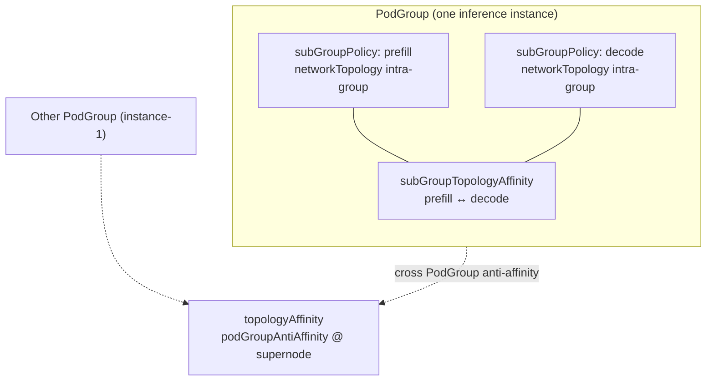

### `topologyAffinity` (Cross PodGroup)

| Item | Description |
|------|-------------|
| Phase 1 | **Only** `podGroupAntiAffinity` ([Design Decision-1](#ad-1-cross-podgroup-anti-affinity-only), [Design Decision-2](#ad-2-phase-1-no-podgroupaffinity-in-crd)) |
| Purpose | This PodGroup and other PodGroups **different domain** at `topologyTier(*)` (`podGroupSelector`, standard `metav1.LabelSelector`) |
| Scheduling | `TopologyOccupancyIndex` + Job-level `HyperNodeGradientForJobFn`; hard/soft see [Design Decision-5](#ad-5-inter-group-hard-soft) |
| Cross-PodGroup co-domain | **Not supported** → use `networkTopology` / `subGroupAffinity` |

### `subGroupTopologyAffinity` (Same PodGroup, Cross SubGroup)

**Semantics:** Constrain **SubJobs** split by each `subGroupPolicy` in this PodGroup on same/different `Domain_T` (**not** Pod-level affinity, **not** cross PodGroup).

**Prerequisite:** `subGroupPolicy` ≥ 2 entries; terms only write policy **name** (not `prefill-0` suffixes).

#### Capability Overview (In Scope)

| Capability | Description |
|------------|-------------|
| Multiple SubJobs share supernode | `PodGroupSpec.networkTopology` or `subGroupAffinity` (see [Example 4](#example-4-distributed-prefill-decode-inference-recommended)) |
| Same-role multi-shard cabinet mutual exclusion | `subGroupAntiAffinity` @ `cabinet`, selectors both **same** policy name (e.g., both `[prefill]`) | [Example 4](#example-4-distributed-prefill-decode-inference-recommended) |
| Two **different policy** SubJobs different domain | `subGroupAntiAffinity` + `subGroupSelector` / `antiSubGroupSelector` (policy names **disjoint**) | [Example 6](#example-6-optional-prefill-decode-cross-role-cabinet-split) |
| Same policy Pods separate cabinets (not between SubJobs) | **Not this field** | `matchLabelKeys` split SubJobs + intra-policy anti, or Pod spread |
| No requirement between prefill and decode | Do not write cross-role `subGroupAntiAffinity` | Example 4 only prefill↔prefill, decode↔decode |
| Hard / soft | Hard → `HyperNodeGradientForSubJobFn` pruning; Soft → `HyperNodeOrderFn` (see [Example 7](#example-7-subgroup-soft-anti-affinity-optional)) |
| Stack with intra-group Gang | Each SubGroup can independently configure `networkTopology.highestTierAllowed` |
| SubJob scheduling order | With hard `subGroupAntiAffinity`, SubJobs for policies referenced as `subGroupSelector` scheduled **first** (see [#allocate-action-other](#allocate-action-other)) |
| Partial scheduling | After one SubJob allocated `AllocatedHyperNode`, other must satisfy `Domain_T` relationship before selecting HyperNode |

### Non-Goals (Out of Scope)

| Non-Goal | Use Instead |
|----------|-------------|
| Cross PodGroup / cross instance **mutual exclusion** | `topologyAffinity.podGroupAntiAffinity` |
| Cross PodGroup **co-domain** | **Not supported** (use `networkTopology` / `subGroupAffinity`) |
| Same SubGroup Pods do not cross tier | `subGroupPolicy[].networkTopology` |
| Select SubGroup of "any other PodGroup" | **Not supported**; selector only resolves this PodGroup's `subGroupPolicy` |
| Cross-Namespace SubGroup peer matching | **Not supported** |
| Define inter-SubGroup relationships without `subGroupPolicy` | **Invalid**; Webhook rejects |
| Use `podGroupAntiAffinity` for prefill/decode within same PodGroup | **Wrong**; use `subGroupTopologyAffinity` within same PodGroup |

### Prerequisites

1. `spec.subGroupPolicy` **non-empty**, and at least **2** `subGroupPolicy` entries (single SubGroup has no "inter-group" object; configuring `subGroupTopologyAffinity` is meaningless).
2. `matchSubGroupPolicyNames` in terms / selectors must **all appear in this PodGroup's** `subGroupPolicy[].name`.
3. Pods of corresponding SubGroups must be correctly assigned to SubJobs via each policy's `labelSelector` (and optional `matchLabelKeys`).

### Scheduling Semantics and Implementation Anchors

| Item | Behavior |
|------|----------|
| Comparison subject | `JobInfo.SubJobs` (distinguished by `subGroupPolicy.name`), not `JobInfo` vs other Jobs |
| Gradient registration | group-topology-affinity registers `HyperNodeGradientForSubJobFn` only when `ContainsHardCrossSubGroupTopology(job)` is true |
| With Job-level PodGroup constraints | First `HyperNodeGradientForJobFn` (incl. cross-PodGroup hard) → `allocateForJob` selects Job-level HyperNode domain → then apply `subGroupTopologyAffinity` to each SubJob |
| Occupancy index | **Does not** write cross-PodGroup index; peer lookup within Session only on allocated domains of SubJobs in same PodGroup |
| Ignore runtime changes | `*IgnoredDuringExecution`: placed SubJobs not evicted due to PodGroup Spec changes (consistent with PodAffinity) |

### Design Considerations and Limitations

1. **Peer dependency and order:** Hard `subGroupAffinity` requires peer SubJob to already have `AllocatedHyperNode` (or first scheduled in same cycle); therefore `organizeJobWorksheet` must ensure at least one peer enters `allocateForSubJob` first.
2. **Tier consistency:** If hard `subGroupAffinity` @ supernode and hard `subGroupAntiAffinity` @ cabinet configured together, Webhook requires affinity tier **not lower than** antiAffinity tier (larger numeric value or tierName closer to root), avoiding logical contradiction.
3. **Combined with `topologyAffinity`:** Can configure instance-level `topologyAffinity` together; add `subGroupTopologyAffinity` only when **inter-role** requirements exist (Example 6), orthogonal to "intra-role replica spread" (Example 4).
4. **HyperNode domain only:** Constraints expressed on HyperNode tree `Domain_T`; after SubJob selects HyperNode, intra-group Pods still placed by `networkTopology` + Node `predicate`.
5. **Phase 1:** `preempt` / `backfill` do not guarantee recalculation of inter-SubGroup topology; Occupancy based on running Jobs in Session.

### Configuration Counter-Examples

```yaml
# Wrong: using subGroupAntiAffinity(prefill, decode) to express "4 prefill shards each on separate cabinets"
subGroupTopologyAffinity:
  subGroupAntiAffinity:
    requiredDuringSchedulingIgnoredDuringExecution:
      - subGroupSelector:
          matchSubGroupPolicyNames: [prefill]
        antiSubGroupSelector:
          matchSubGroupPolicyNames: [decode]   # ❌ this is inter-role, not intra-replica

# Correct: no requirement between prefill and decode → do not configure above term
# Correct: between prefill replicas → see Example 4 (intra-policy `[prefill]` antiAffinity + matchLabelKeys)
```

---

### `podGroupSelector` Matching Semantics

Consistent with kube-scheduler `labelSelector`: match on **other PodGroups** cached in cluster using `metadata.labels` (supports `matchLabels` / `matchExpressions`); optional `namespaceSelector` limits namespaces.  
**Does not** introduce Volcano-specific `topologyGroup` string field in CRD; peers fully defined by labels users set on PodGroups.

#### Who Sets Labels and How to Assign Values

| Item | Description |
|------|-------------|
| **Who writes** | **User/platform** sets `metadata.labels` when creating or updating PodGroup; Volcano **does not** auto-populate labels based on `podGroupAntiAffinity`. |
| **Relation to selector** | `podGroupSelector.matchLabels` (or `matchExpressions`) must **match** labels on target PodGroups; typically **one key** expresses "same mutual-exclusion group" (example key `topology.volcano.sh/spread-group`, key name customizable). |
| **Assignment principle** | PodGroups that should be **mutually exclusive in different domains** at **same topology comparison layer** (`topologyDomain`) use **same value** for this key; value should represent **fault domain/capacity pool** business meaning (e.g., `llama-70b-prod` = multi-instance pool for same production model), **not** copy of PodGroup name, SubJob name, or Pod template labels. |
| **Division with other labels** | `app` / `model` etc. for ops filtering; **whether anti-affinity peers** determined only by `podGroupSelector` match. Do not put unrelated labels in selector to avoid affecting other PodGroups. |
| **Environment isolation** | Different environments, tenants, traffic pools use **different values** (e.g., `…-staging` vs `…-prod`), avoiding cross-environment mutual exclusion. |

Scheduling implementation: peer set = other PodGroups matching selector (excluding this PodGroup UID); `TopologyOccupancyIndex` records occupied domains by `(topologyTier, Domain_T)`, prunes combined with peers' allocated HyperNodes.

## HyperNode Tiers and topologyTier / topologyTierName

Inter-group affinity/anti-affinity, like intra-group `networkTopology`, based on **HyperNode CR** tree, **not** arbitrary Node labels. Users must specify **exactly one** topology comparison tier in term's `topologyDomain` (`TopologyDomainSpec`): `topologyTierName` (aligned with `spec.tierName`) or `topologyTier` (aligned with `spec.tier` integer), dual relationship same as `highestTierName` / `highestTierAllowed`.

### What Is Defined on HyperNode

Each HyperNode resource (`topology.volcano.sh/v1alpha1`) describes its layer in `spec`:

| HyperNode Field | Meaning | PodGroup Correspondence |
|-----------------|---------|-------------------------|
| `spec.tier` | Layer **index** (non-negative integer, cluster-wide increasing convention, larger = closer to root) | `topologyTier: <int>` |
| `spec.tierName` | Layer **readable name** (cluster convention, e.g., `cabinet`, `supernode`, `rack`) | `topologyTierName: "<string>"` |

Example (cluster side, unrelated to PodGroup):

```yaml
apiVersion: topology.volcano.sh/v1alpha1
kind: HyperNode
metadata:
  name: supernode-sn-1
spec:
  tier: 2
  tierName: supernode          # ← PodGroup topologyTierName must write supernode
  members:
    - type: HyperNode
      selector:
        exactMatch:
          name: cabinet-a
    - type: HyperNode
      selector:
        exactMatch:
          name: cabinet-b
---
apiVersion: topology.volcano.sh/v1alpha1
kind: HyperNode
metadata:
  name: cabinet-a
spec:
  tier: 1
  tierName: cabinet            # ← topologyTierName: cabinet compares Domain at cabinet layer
  members:
    - type: Node
      selector: { ... }
```

Scheduler scans all HyperNodes at Session start, builds:

- **`HyperNodeTierNameMap`**: `tierName → tier` (shared by `network-topology-aware` parsing `highestTierName`, `group-topology-affinity` parsing `topologyTierName`);
- **`HyperNodeTierSet`**: set of `spec.tier` integer values seen in cluster (for validating `highestTierAllowed` / `topologyTier`).

Webhook: unknown `topologyTierName` or `topologyTier` not in `HyperNodeTierSet` **rejected**.

### How Users Fill Topology Comparison Tier

1. **Query cluster first**: `kubectl get hypernodes -o custom-columns=NAME:.metadata.name,TIER:.spec.tier,TIERNAME:.spec.tierName` (maintain "tier ↔ tierName" lookup table, same as intra-group `networkTopology` fill-in).
2. **Choose one (each term's `TopologyDomainSpec`)**:
   - **`topologyTierName`**: **exactly matches** target layer HyperNode's `spec.tierName` (case-sensitive);
   - **`topologyTier`**: **integer equals** target layer HyperNode's `spec.tier`.
3. **Do not mix**: `topologyTier` and `topologyTierName` **mutually exclusive** within same `TopologyDomainSpec` (same rule as `highestTierAllowed` / `highestTierName`).
4. **Recommendation**: manual ops, multi-cluster alignment → **tierName**; templates/controllers driven by tier index → **tier integer**.
5. **Difference from intra-group**: `highestTier*` limits **intra-group** Pods not crossing layer; `topologyTier(*)` defines **inter-group** same/different `Domain_T` at that layer.

| User Write | Scheduler Resolves To | Intra-Group Equivalent |
|------------|----------------------|------------------------|
| `topologyTierName: supernode` | Walk parent chain, first ancestor with `spec.tierName == "supernode"`, its `metadata.name` is `Domain_T` | `highestTierName: supernode` |
| `topologyTier: 2` | Walk parent chain, first ancestor with `spec.tier == 2` is `Domain_T` | `highestTierAllowed: 2` |
| `topologyTierName: cabinet` | Cabinet-layer domain | `highestTierName: cabinet` |
| `topologyTier: 1` | Cabinet-layer domain (when cluster convention cabinet=1) | `highestTierAllowed: 1` |

Invalid configuration examples: `topologyTierName: foo` (no HyperNode uses that tierName); `topologyTier: 99` (not in `HyperNodeTierSet`).

### Correspondence with Example Topology

**tierName / tier per this cluster's HyperNode CR** (either column in table below).

| Business Description | `topologyTierName` | `topologyTier` (example) | API |
|----------------------|--------------------|--------------------------|-----|
| Different inference instances do not share supernode | `supernode` | `2` | `topologyAffinity.podGroupAntiAffinity` |
| 4 prefill (or decode) shards each on separate cabinets | `cabinet` | `1` | Example 4: intra-policy anti |
| prefill and decode **no** topology requirement | — | — | No cross-role term |
| (Optional) prefill and decode separate cabinets and share supernode | `cabinet` + `supernode` | `1` + `2` | Example 6 |

---

## Semantics: Domain_T

For candidate HyperNode `H` and user-configured topology comparison tier (`topologyTier` or `topologyTierName` in `topologyDomain`):

```
Domain_T(H) = From H walk up HyperNode parent chain, metadata.name of first ancestor HyperNode satisfying:
              · spec.tier == topologyTier (integer mode)
              · spec.tierName == topologyTierName (string mode, consistent with HyperNode CR config)
```

| Constraint | Hard Semantics |
|------------|----------------|
| Anti-affinity | `Domain_T(A) ≠ Domain_T(B)` |
| Affinity | `Domain_T(A) == Domain_T(B)` (when one unallocated, later allocator must land in allocated domain) |

Difference from existing `NetworkTopologySpec`:

| Field | Semantics | Tier Source |
|-------|-----------|-------------|
| `highestTierAllowed` / `highestTierName` (existing) | **Intra-group** Gang: whole group Pods do not cross this layer | Same HyperNode `tier` / `tierName` |
| `topologyTier` / `topologyTierName` (this design) | **Inter-group**: compare Domain same or different at this layer | Same, **must match cluster HyperNode definitions** |

## Hard Constraint Priority

1. PodGroup hard antiAffinity (cross instance)
2. SubGroup hard antiAffinity (**between SubJobs**, incl. Example 4 intra-policy shard mutual exclusion)
3. SubGroup hard affinity (**between different policy / SubJobs** co-domain, e.g., Example 6)
4. SubGroup / Job hard `networkTopology` (intra-group Gang, existing)
5. Soft → `HyperNodeOrderFn` weighting

## Configuration Example (Multi Instance + Prefill-Decode Intra-Role Spread)

Inter-group topology see Example 4; here only shows **cross instance mutual exclusion** + two role policies (**no** prefill↔decode inter-group term).

```yaml
apiVersion: scheduling.volcano.sh/v1beta1
kind: PodGroup
metadata:
  name: pd-instance-0
  labels:
    topology.volcano.sh/spread-group: llama-70b-prod
spec:
  minMember: 8
  queue: default

  topologyAffinity:
    podGroupAntiAffinity:
      requiredDuringSchedulingIgnoredDuringExecution:
        - podGroupSelector:
            matchLabels:
              topology.volcano.sh/spread-group: llama-70b-prod
          topologyTierName: supernode

  subGroupPolicy:
    - name: prefill
      labelSelector:
        matchLabels:
          volcano.sh/role: prefill
      # Sharding and inter-group topology: see Example 4 (matchLabelKeys + subGroupTopologyAffinity)
    - name: decode
      labelSelector:
        matchLabels:
          volcano.sh/role: decode
      subGroupSize: 1

  # Intra-role prefill-0..3 / decode-0..3 mutual exclusion @ cabinet: subGroupTopologyAffinity (omitted)
  # For prefill and decode whole-cabinet separation: see Example 6
```

# Design Decisions

<a id="ad-1-cross-podgroup-anti-affinity-only"></a>
### Design Decision-1: Cross PodGroup Anti-Affinity Only

**Conclusion:** Implement `topologyAffinity.podGroupAntiAffinity` (**required** `podGroupSelector` + `topologyTier(*)`), with `TopologyOccupancyIndex` and Job-level gradient.

**Rationale (summary):**

- **Peer expression:** Use **`metav1.LabelSelector`** (`matchLabels` / `matchExpressions`) to match other PodGroups' `metadata.labels`, semantics aligned with kube-scheduler; **do not** add CRD-specific `topologyGroup` field, reuse existing business labels and expressions.
- **Has scenarios:** Multiple inference instances need **mutual exclusion** at supernode (etc.) layer (Examples 2, 5); intra-group `networkTopology` cannot express "relative to other PodGroups".
- **Community gap:** Volcano lacks PodGroup-level **inter-group** hard different-domain API (intra-group `networkTopology` does not express "relative to other PodGroups").
- **Acceptable cost:** Index semantics simple (record occupied `Domain_T`); preempt/backfill consistency deferred to [Phase 2](#delivery-phases).

---

<a id="ad-2-phase-1-no-podgroupaffinity-in-crd"></a>
### Design Decision-2: Phase 1 Does Not Declare `podGroupAffinity`

**Conclusion:** `PodGroupTopologyAffinitySpec` **only** contains `PodGroupAntiAffinity`; **does not** declare `PodGroupAffinity` in Go/CRD. If user submits unknown field `topologyAffinity.podGroupAffinity`, API Server rejects per schema (no Webhook "must be empty" needed).

| Approach | CRD Exposes `podGroupAffinity` | Conclusion |
|----------|-------------------------------|------------|
| Keep field + Webhook reject | Yes | Not adopted |
| **Do not declare field** | **No** | **Adopted** |

**Reasons not to do cross-PodGroup affinity (adopted "do not declare field"):**

1. **No independent scenario** — co-domain already covered by APIs below:

| Requirement | Use |
|-------------|-----|
| Single instance entire machine shares supernode | `PodGroupSpec.networkTopology` |
| prefill + decode co-domain within same instance | `subGroupAffinity` or `networkTopology` (Example 4) |
| Multi Pod replicas share rack | `subGroupPolicy[].networkTopology` |

2. **Confusing** — cross-PodGroup co-domain with `podGroupAffinity` overlaps with `subGroupAffinity`, co-domain class `networkTopology`.
3. **Implementation not worthwhile** — skipping affinity **does not** eliminate anti-affinity OccupancyIndex/Job gradient; adding affinity needs co-domain clique, conflict detection, scheduling order, etc., **no acceptance scenario**.

**Evolution:** If landed requirement exists, Phase 2+ **additively** add `PodGroupAffinity *TopologyAffinitySpec` (type shape see [API Design](#api-design) comment block), **without changing** anti-affinity semantics.

---

<a id="ad-3-subgroup-anti-affinity-dual-selector"></a>
### Design Decision-3: SubGroup Anti-Affinity Dual Selector

**Conclusion:** `subGroupAntiAffinity` uses `subGroupSelector` + `antiSubGroupSelector` (directed subject→peer), **not** single-list `matchSubGroupPolicyNames`.

**Rationale (summary):** Single-list shape cannot express both "intra-policy shard mutual exclusion" (both sides `[prefill]`) and "cross-policy mutual exclusion" (`[prefill]` vs `[decode]`) without ambiguous enums. Details: [API Appendix: dual selector](#appendix-api-design-trade-offs).

---

<a id="ad-4-subgrouptopologyaffinity-at-podgroup-top-level"></a>
### Design Decision-4: `subGroupTopologyAffinity` at PodGroup Top Level

**Conclusion:** Inter-SubJob topology edges within same PodGroup centralized in `PodGroupSpec.subGroupTopologyAffinity`, **not** on each `subGroupPolicy`; **no** per-policy inter-group fields or syntactic sugar.

**Rationale (summary):** Multi-party co-domain (`[prefill, decode]`), unified Webhook, symmetry with `topologyAffinity` require single PodGroup top-level declaration. Details: [API Appendix: top-level placement](#appendix-api-design-trade-offs).

---

<a id="ad-5-inter-group-hard-soft"></a>
### Design Decision-5: Inter-Group hard/soft

**Conclusion:** Inter-group uses `requiredDuringSchedulingIgnoredDuringExecution` / `preferredDuringSchedulingIgnoredDuringExecution` + `weight`; **forbid** writing `mode` in `TopologyDomainSpec`. Intra-group still uses `networkTopology.mode`.

---

<a id="ad-6-tiername-or-tier-int-mutually-exclusive"></a>
### Design Decision-6: tierName and tier Integer Mutually Exclusive

**Conclusion:** Inter-group `topologyTierName` ↔ `HyperNode.spec.tierName`, `topologyTier` ↔ `spec.tier`; shares `HyperNodeTierNameMap`, `HyperNodeTierSet` with intra-group `highestTierName` / `highestTierAllowed`.

**Example cluster convention (also used in example YAML comments):** `supernode` ↔ `2`, `cabinet` ↔ `1` (per `kubectl get hypernodes`).

| Business Description | tierName | tier (example) |
|----------------------|----------|----------------|
| Multi instance mutual exclusion @ supernode | `supernode` | `2` |
| Shard mutual exclusion @ cabinet | `cabinet` | `1` |
| Entire machine shares supernode (intra-group) | `highestTierName: supernode` | `highestTierAllowed: 2` |

Fill-in steps, HyperNode CR example, Domain_T resolution → [#hypernode-tiers-and-topologytier-topologytiername](#hypernode-tiers-and-topologytier-topologytiername). Example YAML mostly uses tierName, with equivalent integer annotated.

---

<a id="ad-7-inter-group-tier-naming-and-kubernetes-topologykey"></a>
### Design Decision-7: Inter-Group Tier Naming and Kubernetes topologyKey

**Background:** In design review, original field name **`separationTierName`** was not intuitive enough, unlike Kubernetes **`topologyKey`** which clearly shows "which topology dimension to compare on".

**Conclusion:**

1. String / integer fields named **`topologyTierName`**, **`topologyTier`** (choose one, mutually exclusive), values still aligned with `HyperNode.spec.tierName` / `spec.tier`.
2. Nested object on term named **`topologyDomain`** (type `TopologyDomainSpec`), carrying above choose-one fields; **no longer** use outer name also `topologyTier` with inner `topologyTierName` duplicate naming.
3. **Do not** reuse field name **`topologyKey`** on inter-group API.

**Why not directly adopt `topologyKey`:**

| Consideration | Description |
|---------------|-------------|
| **Literal mismatch with K8s** | `PodTopologySpread` / `PodAffinity` `topologyKey` is **Node label key** (e.g., `topology.kubernetes.io/zone`); this feature values are **HyperNode tier names** (e.g., `supernode`), completely different fill-in and validation. |
| **Conflict with existing Volcano CR** | Job / PodGroup templates already have standard **`podAffinity` / `podAntiAffinity` `topologyKey`**; inter-group term also called `topologyKey` causes ops incidents of "two topologyKey in same YAML, different meanings". |
| **Readability** | `topologyTierName` clearly expresses: **topology comparison happens at which HyperNode layer**; shares `tierName` vocabulary with intra-group `highestTierName`, and `highest*` = envelope upper bound vs `topologyTier*` = inter-group comparison plane, responsibilities distinguishable. |

**Mental model vs K8s (reply to reviewer):**

- K8s: **select topology dimension** → express with Node label **key** → field name `topologyKey`.
- Volcano: **select topology dimension** → express with HyperNode **tier layer** → field name **`topologyTierName`** (or integer **`topologyTier`**); scheduler computes `Domain_T` at that layer, then compares same/different in affinity/anti-affinity terms.
- Doc [#semantic-comparison-with-kubernetes-topologykey-quick-reference](#semantic-comparison-with-kubernetes-topologykey-quick-reference) and example YAML annotations retain comparison table, lowering learning cost for migration from Pod topology spread.

**Former names (review draft):** `separationTierName` / `separationTier`, nested object also named `separationTier` — only meant "separation boundary", did not highlight "topology dimension", and outer/inner naming duplicated; CRD not yet published, finalized naming per table above.

---


# Scheduling Implementation

## Responsibility Division

| Plugin / Module | Hard (gradient) | Soft (order) | Resource Pre-filter |
|-----------------|-----------------|--------------|---------------------|
| `allocate` action (new responsibility) | — | — | **HyperNode `minResource` vs idle/futureIdle** (same level as Node predicate pre-resource check) |
| `network-topology-aware` (existing) | BFS gradient, `highestTierAllowed` (**no** resource judgment) | HyperNode binpack, LCA tier scoring | Only maintains Session-level HyperNode resource ledger (for allocate to read) |
| `group-topology-affinity` (new) | Job level: cross-PodGroup **anti-affinity** hard; SubJob level: same PodGroup, cross-SubGroup hard | Above soft scoring | — |
| `framework` (aggregation) | **Topology plugins only**: set intersection + unified re-layer by tier | Multi-plugin score accumulation (existing) | **Does not participate** |

Hard / Soft division:

- **Hard topology** (`topologyAffinity` / `subGroupTopologyAffinity` **`required`** lists, or `networkTopology.mode: hard`): each topology plugin independently computes `HyperNodeGradient`, Framework **intersects candidate HyperNode sets** then **unified tier layering**.
- **Hard capacity**: in **`allocate.go`**, **`minResource` pre-filter** on gradient candidates (**not** in `HyperNodeGradientForJobFn` aggregation logic).
- **Soft topology** (above API **`preferred`** lists + `weight`, or `networkTopology.mode: soft`): only `HyperNodeOrderFn` weighting, does not enter gradient intersection.

## Framework Constraint: HyperNode Gradient Multi-Plugin Aggregation

### Current State and Goals

| Item | Current | This Design |
|------|---------|-------------|
| `HyperNodeGradientForJobFn` / `HyperNodeGradientForSubJobFn` | **Only first registered plugin effective** | **All plugins with `enabledHyperNodeGradient` participate** |
| Multi hard constraint combination | Cannot combine | **Set intersection (AND)** |
| `HyperNodeOrderFn` | Multi-plugin score accumulation | Unchanged |

### Aggregation Flow (Topology Plugin Intersection + allocate Resource Pre-filter)

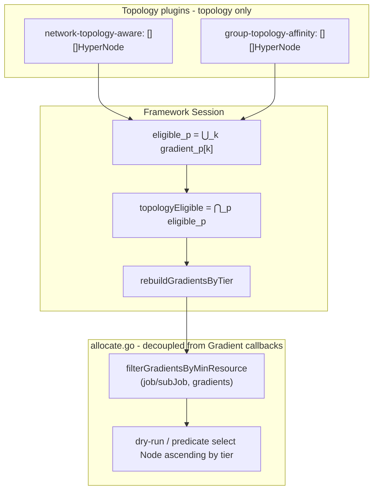

**Framework side (topology only, no resources):**

1. Each topology plugin returns `[][]*HyperNodeInfo` (satisfying "plugin invariants").
2. `topologyEligible = ⋂_p ⋃_k gradient_p[k]`, then `rebuildGradientsByTier`.
3. **Does not** perform `minResource` judgment at this stage.

**allocate side (capacity pre-filter, analogous to Node predicate pre-resource check):**

4. `allocateForJob` / `allocateForSubJob` after obtaining `hyperNodeGradients`, before dry-run loop, calls **`filterGradientsByMinResource`** to remove resource-insufficient HyperNodes.
5. Only filtered HyperNodes undergo SubJob dry-run; after entering `allocateResourcesForTasks`, existing **`alloc.predicate`** still checks Node `FutureIdle` (two layers: HyperNode whole-group capacity → Node single-Pod capacity).

**Comparison with Node path:**

| Layer | Capacity Pre-filter Location | Fine-grained Scheduling |
|-------|------------------------------|-------------------------|
| Node | `allocate.predicate`: `InitResreq` vs `node.FutureIdle()` | `PredicateForAllocateAction` |
| HyperNode | **`allocate.filterGradientsByMinResource`**: `GetMinResources()` vs HyperNode idle/futureIdle | Each Node below still goes through `predicate` |

**Empty results:**

- Topology intersection empty → topology unsatisfiable;
- Empty after resource filter → capacity unsatisfiable (can record separately from `NotEnoughResources`, etc.).

**Why not "intersect layer by layer by gradient index":**

Each plugin BFS/pruning path differs; same HyperNode may land at different index layers. Index-aligned intersection produces false negatives (one round empty but union intersection non-empty). **Set intersection first, then unified layering** semantics stable, consistent with allocate "low tier first, then high tier".

### Plugin Gradient Return Invariants

Each plugin registering `HyperNodeGradientFor*Fn` should guarantee:

1. `len(gradients) >= 1`; if no feasible HyperNode, return empty slice or `nil` (Framework treats as `eligible_p = ∅`).
2. **Inter-layer tier monotonicity**: for any `i < j`, any HyperNode in `gradients[i]` has `tier` ≤ any HyperNode in `gradients[j]` (smaller tier = domain closer, tried first).
3. No duplicate HyperNode names within same gradient layer.

Framework **does not** assume all plugins have identical tier bucketing; final **Session unified re-layering** prevails.

### Plugins Not Registering Gradient

- Plugins not registering `HyperNodeGradientFor*Fn`: **do not participate in intersection** (no hard gradient constraint from that plugin).
- When Job/SubJob has **no** required inter-group topology constraints, only `network-topology-aware` may register; `group-topology-affinity` without required terms may skip gradient registration, only register Order (or skip entire plugin).

### Framework API (`session_plugins.go`)

```go
// Each plugin still registers via AddHyperNodeGradientForJobFn / AddHyperNodeGradientForSubJobFn.

// HyperNodeGradientForJobFn aggregation logic (pseudocode):
func (ssn *Session) HyperNodeGradientForJobFn(job *api.JobInfo, root *api.HyperNodeInfo) [][]*api.HyperNodeInfo {
    var perPlugin [][]*api.HyperNodeInfo
    for _, plugin := range ssn.enabledGradientPlugins() {
        g, err := ssn.hyperNodeGradientForJobFns[plugin](job, root)
        if err != nil { /* log error; this plugin eligible_p = ∅ */ }
        perPlugin = append(perPlugin, g)
    }
    if len(perPlugin) == 0 {
        return [][]*api.HyperNodeInfo{{root}}
    }
    if len(perPlugin) == 1 {
        return perPlugin[0]
    }
    eligible := intersectHyperNodeSets(perPlugin) // ⋂_p ⋃_k gradient_p[k]
    if len(eligible) == 0 {
        return nil
    }
    return rebuildGradientsByTier(ssn.HyperNodes, eligible)
}
```

Helper functions (recommended in `pkg/scheduler/api` or `pkg/scheduler/framework`):

```go
func unionGradientHyperNodeNames(gradients [][]*api.HyperNodeInfo) sets.Set[string]
func intersectHyperNodeSets(perPlugin [][]*api.HyperNodeInfo) sets.Set[string]
func rebuildGradientsByTier(hyperNodes api.HyperNodeInfoMap, eligible sets.Set[string]) [][]*api.HyperNodeInfo
```

`HyperNodeGradientForSubJobFn` uses same aggregation logic; SubJob context must pass `hyperNodeForJob` (parent domain), each plugin computes gradient within subtree.

### Hard / Soft and Order Coordination

```text
Topology Hard:  HyperNodeGradient (multi topology plugins) → Framework intersection → rebuildGradientsByTier
Capacity Hard:  allocate.filterGradientsByMinResource (not via HyperNodeGradientFor*Fn aggregation)
Scheduling:     allocate layer-by-layer dry-run → allocateResourcesForTasks → predicate(Node)
Soft:           HyperNodeOrderFn (multi-plugin score sum) → selectBestHyperNodeForSubJob
```

`group-topology-affinity`: **`required` terms** → `HyperNodeGradientFor*Fn`; **`preferred` terms** → `HyperNodeOrderFn` (terms have **no** `mode` field).

## allocate Action: HyperNode Resource Pre-filter (Decoupled from Gradient Callbacks)

### Design Principles

- **Whether resources suffice for Gang / SubGroup**: belongs to **allocate action** scheduling path decision, orthogonal to "how topology plugins produce gradient".
- **Do not** filter `minResource` in Framework aggregation of `HyperNodeGradientForJobFn` / `HyperNodeGradientForSubJobFn`, avoiding group-topology-affinity, network-topology-aware repeating BFS on resource-insufficient HyperNodes, and avoiding callback lifecycle coupling.
- Move capacity judgment **out of** `network-topology-aware.isEligibleHyperNode` capacity branch to explicit allocate call; network-topology-aware **only keeps tier / `highestTierAllowed`** topology conditions.

### Call Sites

In `allocateForJob` (`allocateForSubJob` similarly, using `subJob.GetMinResources()`):

```go
// 1. Topology: only via Framework plugin callbacks (multi-plugin intersection + re-layering)
hyperNodeGradients := ssn.HyperNodeGradientForJobFn(job, hyperNodeToAllocate)

// 2. Capacity: allocate local filter, unrelated to HyperNodeGradientForJobFn
hyperNodeGradients = alloc.filterGradientsByMinResource(job, nil, hyperNodeGradients)

for gradient, hyperNodes := range hyperNodeGradients {
    for _, hyperNode := range hyperNodes {
        // 3. dry-run subJobs (internally allocateResourcesForTasks → predicate(Node))
    }
}
```

SubJob level in `allocateForSubJob`, after `HyperNodeGradientForSubJobFn`, also runs `filterGradientsByMinResource(job, subJob, gradients)`.

### `filterGradientsByMinResource` Semantics

```go
// pkg/scheduler/actions/allocate/hypernode_resource.go (recommended new file or in allocate.go)

func (alloc *Action) filterGradientsByMinResource(
    job *api.JobInfo,
    subJob *api.SubJobInfo, // nil means Job-level filter
    gradients [][]*api.HyperNodeInfo,
) [][]*api.HyperNodeInfo
```

| Rule | Behavior |
|------|----------|
| `minResource` | `subJob != nil` → `subJob.GetMinResources()`; else `job.GetMinResources()` |
| Comparison | Same as current `isEligibleHyperNode`: keep if `minResource.LessEqual(idle)` **or** `minResource.LessEqual(futureIdle)` |
| Partially scheduled | When `job.AllocatedHyperNode != ""` (Job level) or `subJob.AllocatedHyperNode != ""` (SubJob level), **skip** resource filter, consistent with current "partial no resource pre-filter" |
| Data source | Read **Session-level** HyperNode resource ledger (below); allocate **does not** implement cache updates |

Filter implementation: in-place remove unsatisfied items from each layer's `hyperNodes` in `gradients`; skip layer if empty (same effect as current BFS not producing that layer).

### Session-Level HyperNode Resource Ledger

Promote `hyperNodeResourceCache` from `network-topology-aware` to **Session-readable** (example name `ssn.HyperNodeResourceStatus`), still maintained by network-topology-aware in `OnSessionOpen` + `Allocate`/`Deallocate` EventHandler; allocate read-only.

```go
// api or framework.Session
type HyperNodeResourceStatus struct {
    Allocatable, Used, Idle, FutureIdle *api.Resource
}

func (ssn *Session) HyperNodeSatisfiesMinResource(
    hyperNodeName string,
    minResource *api.Resource,
) bool
```

Facilitates unit tests: inject mock Session ledger for `filterGradientsByMinResource`, no need to start gradient plugins.

### `network-topology-aware` Accompanying Changes

```go
// isEligibleHyperNode: remove minResource / hyperNodeResourceCache branch, only keep:
// - tier <= highestAllowedTier
// - (no idle/futureIdle judgment here)

func (networkTopologyAware *networkTopologyAwarePlugin) isEligibleHyperNode(
    hn *api.HyperNodeInfo,
    highestAllowedTier int,
    allocatedHyperNode string,
) bool {
    if hn.Tier() > highestAllowedTier {
        return false
    }
    if allocatedHyperNode != "" {
        return true
    }
    return true // topology BFS expands by default; resources pre-filtered by allocate
}
```

`hyperNodeGradientFn` signature can drop `minResource` parameter; `HyperNodeGradientForJobFn` / `HyperNodeGradientForSubJobFn` registration no longer passes `job.GetMinResources()`.

### Why allocate Is More Appropriate

| Point | Description |
|-------|-------------|
| Consistent with Node | Capacity filtered first, then predicate, both at **action** layer, not scheduler plugin callback aggregation |
| Decoupling | Framework `HyperNodeGradientFor*Fn` only expresses **topology feasible region**; capacity is Job/SubJob scheduling context |
| Performance | group-topology-affinity / network-topology-aware BFS no longer traverses HyperNodes destined to fail capacity; filter on gradient list **O(n)** once |
| Testability | allocate unit tests cover resource filter, no need to mock multi-plugin gradient |

## Recommended Scheduler Configuration

```yaml
actions: "enqueue, allocate, backfill"
tiers:
- plugins:
  - name: gang
  - name: predicates
  - name: group-topology-affinity
    arguments:
      weight: 10
  - name: network-topology-aware
    arguments:
      weight: 10
      # Intra-group binpack extensions only for network-topology-aware, see that plugin doc
      # hypernode.binpack.cpu: 5
      # hypernode.binpack.memory: 1
```

Both enable `enabledHyperNodeGradient` and `enabledHyperNodeOrder` (consistent with existing e2e config). Plugin order within tier does not affect intersection commutativity, but affects **Order score addition order** (addition commutative, no impact).

### Plugin `arguments` Convention (Consistent with `network-topology-aware`)

`group-topology-affinity` Scheduler plugin config **aligns with** `network-topology-aware`: use short key `weight` under `plugins[].arguments`, **not** plugin-prefixed keys like `group-topology-affinity.weight` (different from `binpack.weight` style, same as `network-topology-aware`).

| Key | Type | Default | Purpose |
|-----|------|---------|---------|
| `weight` | int | `1` | **Scale** scores from this plugin's `HyperNodeOrderFn` (same semantics as `network-topology-aware` `GlobalWeight`); implementation read key recommended consistent with production: `const PluginWeight = "weight"` |
| `hypernode.binpack.*` | — | — | **Not** for `group-topology-affinity`; intra-group HyperNode binpack / tier scoring still by `network-topology-aware` |

**Distinction from PodGroup API `preferred` term `weight`:**

| Config Surface | Field | Meaning |
|----------------|-------|---------|
| Scheduler `arguments.weight` | Plugin level | **Relative weight** among multiple `HyperNodeOrderFn` plugins (Framework multiplier before adding Order scores) |
| `subGroupTopologyAffinity` / `topologyAffinity` `preferred[].weight` | Term level | **Internal** preference strength of single soft inter-group rule (same as kube-scheduler `preferredDuringScheduling`) |

Implementation: `HyperNodeOrderFn` raw score `score ∈ [0,1]` (or plugin-internal normalized score) multiplied by `arguments.weight`, then participates in Framework Order **accumulation** with other topology/priority plugins — same pattern as `network-topology-aware` at end of `hyperNodeOrderFn` `scaledScores[name] = MaxNodeScore * weight * score`.

## group-topology-affinity Extension Points

| Extension Point | Purpose |
|-----------------|---------|
| `OnSessionOpen` | Build `TopologyOccupancyIndex`; parse `weight` from `arguments` (default `1`, same key as `network-topology-aware`) |
| `AddHyperNodeGradientForJobFn` | Job-level gradient under hard cross-PodGroup constraints |
| `AddHyperNodeGradientForSubJobFn` | SubJob-level gradient under hard cross-SubGroup constraints (incl. allocated SubJob domains in same Job) |
| `AddHyperNodeOrderFn` | Soft cross-group topology affinity/anti-affinity preference; score × `arguments.weight` then Framework Order accumulation |
| `AddJobValidFn` (optional P2) | Global domain exhaustion pre-check |

## network-topology-aware Changes (Minimal)

- **Keep** `hyperNodeGradientFn` BFS; `isEligibleHyperNode` **topology only** (tier / partial scenarios), **remove** `minResource` judgment.
- **Keep** `hyperNodeResourceCache` maintenance, upgraded to **Session-readable** for allocate.
- Collaborate with `group-topology-affinity` via Framework **topology gradient intersection**; **no** capacity pre-filter inside plugin.

## allocate Action (Other)

<a id="allocate-action-other"></a>

- `RequiresHyperNodeAllocate()`: `ContainsHardTopology() \|\| ContainsSubJobPolicy() \|\| ContainsHardCrossPodGroupTopology() \|\| ContainsHardCrossSubGroupTopology()`
- `ContainsHardCrossPodGroupTopology(job)`: non-empty `topologyAffinity.podGroupAntiAffinity` **`required`** list exists (**excludes** `podGroupAffinity`)
- `ContainsHardCrossSubGroupTopology(job)`: non-empty `subGroupTopologyAffinity` with hard `subGroupAffinity` / `subGroupAntiAffinity` terms
- `organizeJobWorksheet`: stable sort of SubJobs with hard subGroup antiAffinity (dependents scheduled first)
- Main path: `allocateForJob` → (`HyperNodeGradientForJobFn` → **`filterGradientsByMinResource`**) → `allocateForSubJob` → (`HyperNodeGradientForSubJobFn` → **resource filter**) → `selectBestHyperNodeForSubJob` → `allocateResourcesForTasks` → `predicate(Node)`

## Implementation Files (Phase 1)

| Path | Description |
|------|-------------|
| `staging/.../scheduling/v1beta1/types.go` | API |
| `pkg/scheduler/api/topology_constraint.go` | Parsing structures |
| `pkg/scheduler/api/topology_occupancy.go` | Occupancy index |
| `pkg/scheduler/api/hyper_node_info.go` | `GetAncestorAtTier` |
| `pkg/scheduler/api/hyper_node_gradient.go` | `union` / `intersect` / `rebuildGradientsByTier` |
| `pkg/scheduler/api/hyper_node_resource.go` | HyperNode resource ledger type + `SatisfiesMinResource` |
| `pkg/scheduler/plugins/group-topology-affinity/` | New plugin (topology gradient + order) |
| `pkg/scheduler/plugins/network-topology-aware/` | Remove resource pre-filter from gradient; Session resource cache |
| `pkg/scheduler/framework/session.go` | Expose HyperNode resource ledger |
| `pkg/scheduler/framework/session_plugins.go` | **Topology only** Gradient multi-plugin intersection + re-layering |
| `pkg/scheduler/actions/allocate/allocate.go` | `filterGradientsByMinResource`; Job/SubJob call sites |
| `pkg/scheduler/actions/allocate/hypernode_resource_test.go` | Resource filter unit tests |
| `pkg/webhooks/.../validate_podgroup.go` | Validation |
| `pkg/scheduler/framework/session_plugins_test.go` | Topology intersection/re-layering unit tests |

---

# Architecture and Sequence Diagrams

Two overview diagrams summarize config admission and allocate topology path; module responsibilities, aggregation rules, plugin extension points, and code anchors see [#scheduling-implementation](#scheduling-implementation).

| To understand… | Read |
|----------------|------|
| Framework topology gradient intersection, allocate resource pre-filter | [Framework Constraint · HyperNode Gradient Aggregation](#framework-constraint-hypernode-gradient-multi-plugin-aggregation), [Aggregation Flow](#aggregation-flow-topology-plugin-intersection--allocate-resource-pre-filter) |
| `group-topology-affinity` / occupancy index | [Scheduling Implementation · group-topology-affinity Extension Points](#group-topology-affinity-extension-points) |
| Examples 2 / 4 / 5 on scheduling chain | [User Scenarios](#user-scenarios-and-capability-mapping), [Overview · Goal Illustration](#goal-illustration-volcano-perspective) |

**Notation:** `Domain_T(H)` = ancestor domain of HyperNode H at topology comparison tier T.

---

## Overview Diagram 1: Layering and Scheduling Cycle

Config enters Cache via Webhook; each Session: plugin init → allocate (topology path) → Close writes back Status.

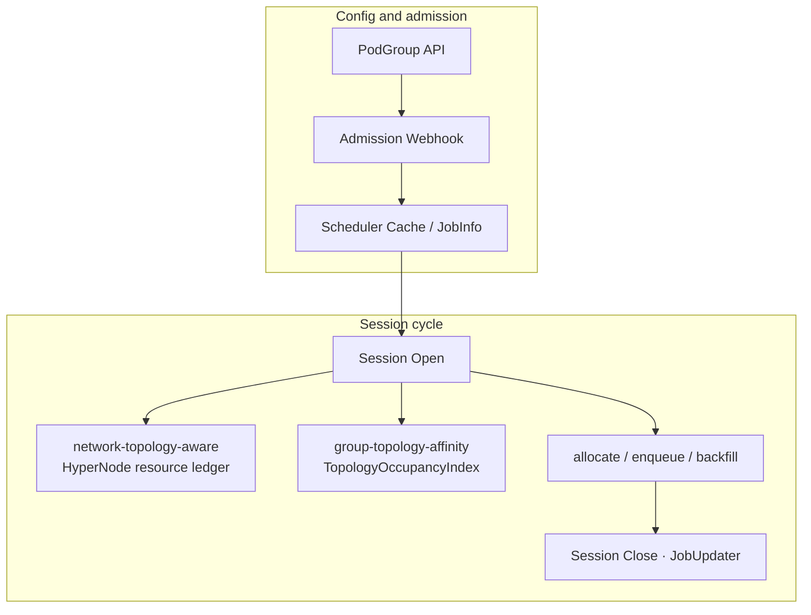

---

## Overview Diagram 2: allocate Topology Path (Intra-Group + Inter-Group)

Hard constraints: each topology plugin produces gradient → Framework **set intersection + re-layer by tier** → allocate **`filterGradientsByMinResource`** → SubJob dry-run → Node predicate. Soft constraints only via `HyperNodeOrderFn`, not in intersection.

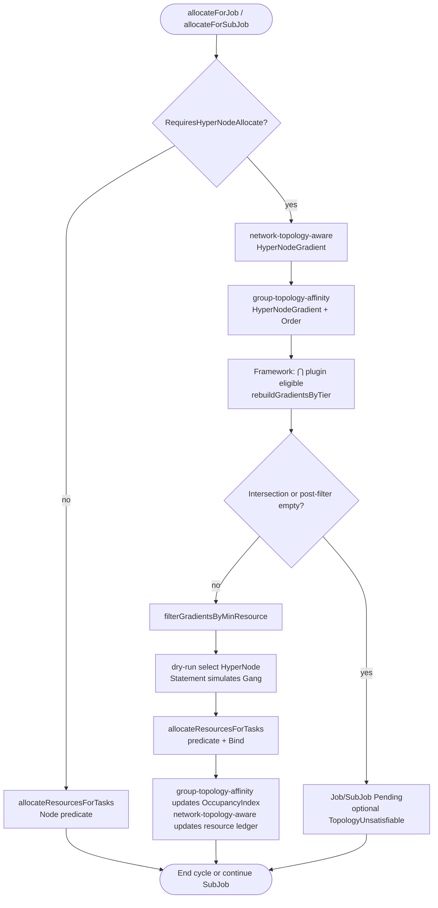

**Scenario correspondence with overview diagrams:**

- **Cross-PodGroup anti-affinity (Examples 2, 5):** Job-level `HyperNodeGradientForJobFn` pruning; `TopologyOccupancyIndex` records occupied `Domain_T`; see scheduling implementation [Design Decision-1](#ad-1-cross-podgroup-anti-affinity-only) and `group-topology-affinity` plugin section.
- **Cross-SubJob affinity/anti-affinity (Examples 4, 6, 7):** SubJob-level `HyperNodeGradientForSubJobFn`; intra-policy mutual exclusion vs cross-policy distinguished by dual selector; see [API Design · subGroupTopologyAffinity](#subgrouptopologyaffinity-same-podgroup-cross-subgroup).
- **Intra-group Gang (Examples 1, 3):** Only `network-topology-aware` participates in gradient (when no inter-group terms, `group-topology-affinity` may skip gradient registration); when inter-group terms exist, **AND** intersection.

---

## Code Anchors (Implementation Reference)

| Step | Path |
|------|------|
| allocate entry / resource pre-filter | `pkg/scheduler/actions/allocate/allocate.go` |
| Gradient multi-plugin intersection | `pkg/scheduler/framework/session_plugins.go` |
| Inter-group plugin | `pkg/scheduler/plugins/group-topology-affinity/` |
| Intra-group topology plugin | `pkg/scheduler/plugins/network-topology-aware/network_topology_aware.go` |
| Occupancy index | `pkg/scheduler/api/topology_occupancy.go` |

---

# Validation Rules (Webhook)

**General**

1. Each inter-group term's `TopologyDomainSpec`: `topologyTier` (int) and `topologyTierName` (string) **mutually exclusive**, and **at least one must be configured** (symmetric with `networkTopology` `highestTierAllowed` / `highestTierName` rules). `topologyTierName` must exist in `HyperNodeTierNameMap`; `topologyTier` must exist in `HyperNodeTierSet` (at least one HyperNode's `spec.tier` equals that value). **Forbid** writing `mode` in `TopologyDomainSpec` (hard/soft determined by `required` / `preferred`, see [#required--preferred-vs-mode-no-duplication](#required--preferred-vs-mode-no-duplication)).

**`topologyAffinity` (Cross PodGroup)**

2. Phase 1 CRD **has no** `topologyAffinity.podGroupAffinity` (see [Design Decision-2](#ad-2-phase-1-no-podgroupaffinity-in-crd)); **no** `topologyGroup` field; unknown fields rejected by API Server.
3. Each `podGroupAntiAffinity` term's `podGroupSelector` **required** (`metav1.LabelSelector`: supports `matchLabels` / `matchExpressions`); optional `namespaceSelector` limits peer PodGroup namespaces (semantics aligned with kube-scheduler).
4. `podGroupSelector` must not match only this PodGroup itself to simulate SubGroup relationship (use `subGroupTopologyAffinity`).

**`subGroupTopologyAffinity` (Same PodGroup, Cross SubGroup)**

5. If `subGroupTopologyAffinity` non-empty, then `subGroupPolicy` non-empty and `len(subGroupPolicy) >= 2`.
6. All `matchSubGroupPolicyNames` must be **this PodGroup's** `subGroupPolicy[].name` (**forbid** SubJobID shard suffixes like `prefill-0`).
7. `subGroupTopologyAffinity` terms **forbid** `podGroupSelector`, `namespaceSelector` (cross-PodGroup fields only belong to `topologyAffinity.podGroupAntiAffinity`).
8. `subGroupAntiAffinity`: when **cross-policy**, policy name sets on `subGroupSelector` and `antiSubGroupSelector` **disjoint**; for **intra-policy pairwise mutual exclusion**, **same** policy name allowed on both sides (e.g., both `[prefill]`, Example 4).
9. Each `subGroupAffinity.required` term's `matchSubGroupPolicyNames` must contain at least **2 different** policy names (e.g., `[prefill, decode]`, covering all SubJobs below).
10. When using intra-policy mutual exclusion, that policy should configure `matchLabelKeys` and runtime SubJob count ≥ 2 (otherwise Webhook warning).
11. hard `subGroupAffinity` tier ≥ hard `subGroupAntiAffinity` tier (numeric comparison, or after tierName mapping).

**Combination**

12. `topologyAffinity` (anti only) and `subGroupTopologyAffinity` can coexist; Webhook validates separately, scheduling **AND**.
13. When `subGroupTopologyAffinity` and `subGroupPolicy[].networkTopology` coexist, document inter-group + intra-group semantics in docs/Condition; Webhook detects obviously contradictory tier combinations (optional warning).
14. If `PodGroupSpec.networkTopology` (`mode: hard`) and `subGroupAffinity` **`required`** term express "co-domain" at **same topology layer** (e.g., `topologyTierName: supernode`), Webhook **warns** redundancy (see [Example 4](#example-4-distributed-prefill-decode-inference-recommended), do not duplicate Approach 1 and 2).

---

# Status (Optional)

```go
const PodGroupTopologyUnsatisfiable PodGroupConditionType = "TopologyUnsatisfiable"
```

| Reason | Scenario |
|--------|----------|
| `PodGroupAntiAffinityUnsatisfiable` | No available supernode domain |
| `SubGroupAntiAffinityUnsatisfiable` | Prefill-Decode cabinet split failed |
| `SubGroupAffinityUnsatisfiable` | Cannot co-locate with peer on supernode |

---

# Delivery Phases

**Delivery scope: P1 + P2.**

| Phase | Content |
|-------|---------|
| **P1** | API, `group-topology-affinity`, Framework gradient intersection, allocate resource pre-filter, Webhook, e2e |
| **P2** | preempt/backfill consistent with occupancy, enqueue pre-check, SubJob annotation, optional `TopologyUnsatisfiable` |

Consistent with implementation path in [#scheduling-implementation](#scheduling-implementation), [#architecture-and-sequence-diagrams](#architecture-and-sequence-diagrams).

---

# References

- User guide: [How to Use Group Topology Affinity](../user-guide/how_to_use_group_topology_affinity.md)
- Volcano: [Network Topology Aware Scheduling](./Network%20Topology%20Aware%20Scheduling.md) (intra-group topology and HyperNode, prerequisite for this proposal)
- Volcano: [Preempt Action Support Topology](./preempt-action-support-topology.md) (Phase 2 preempt and topology consistency reference)
- Kubernetes / **kube-scheduler**: [Pod affinity and anti-affinity](https://kubernetes.io/docs/concepts/scheduling-eviction/assign-pod-node/#affinity-and-anti-affinity) (inter-group `required` / `preferred` naming and dual-end selector semantics alignment reference; this proposal scope is PodGroup/SubJob, **not** kube-scheduler implementation path)
