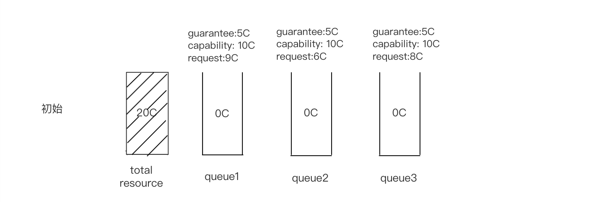
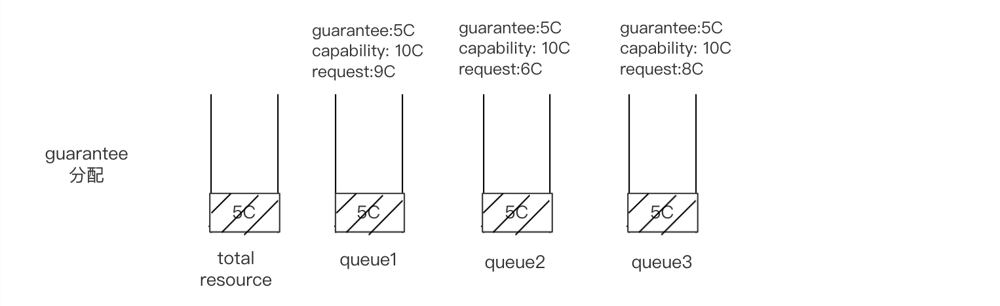
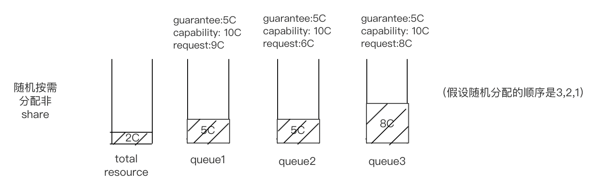
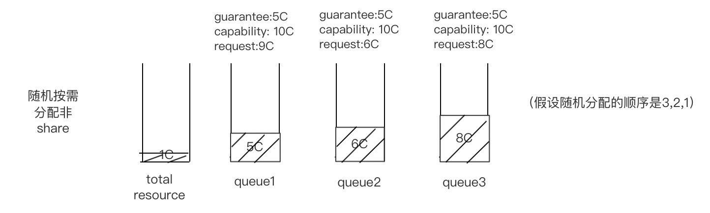

# Guarantee quota Plugin

## Introduction

This plugin is an extension of proportion plugin in special scenarios. We fixed the problem of panic caused by incorrect guarantee and weight Settings and redesigned the distribution scheme of deserved. Users who want to ensure the minimum resources of the queue and limit the maximum resources of the queue may consider using this plugin.

## Solution

1. In guaranteequota plugin, the guarantee represents the minimum resource of the queue(like the pod request resource), the capability represents the maximum resource of the queue(like the pod limit resource).

2. `guaranteequota` plugin return 5 callback functions(same to proportion plugin): `QueueOrderFn`, `ReclaimableFn`, `OverusedFn`, `AllocatableFn` and `JobEnqueueableFn`:

3. the execution flow chart of `sla` plugin is shown as below:
   
   1. nitial state, the total resource of the cluster is 20C, and each queue is 0C.
   
      
   2. Guarantee is preferentially allocated to each queue 5C, and there is 5C of total resources left;
   
   
   3. Assume that queuE3, QueuE2, and queue1 are sorted randomly. The demand of QUEUE3 is the priority. The request of QUEUE3 is 8C, so in addition to guarantee, 3C should be allocated, and the total resource of cluster is 2C.
   
   
   4. Next, Queue E2 is assigned, Request is 6C, and in addition to guarantee, we have to allocate another 1C, leaving only 1C of cluster resources;
   
   
   5. Finally, Queue1 was allocated. Request was 9C, but the total cluster resource was only 1C, so it could only be allocated to 1C, which completed a resource allocation.
   
      
   6. The traversal order of the queue is random, which ensures fair scheduling. If a task in a queue cannot be scheduled because it requires too much resources, resources can be randomly allocated to other queues next time to ensure that the cluster will not be blocked by tasks. Of course, you can also design some priority queues or jobs based on this to meet scheduling requirements in different scenarios.
   
   7. By extension, we can use the same weight assignment strategy when we've assigned the guarantee, so that the weights are assigned to a non-guarantee resource. This allows us to ensure that the final sum of the weights is not more than the total resources, and that we can use the unauthorized resources to preemption. Of course, some tasks will occupy some of the guarantee resources and some of the non-guarantee resources, so there should be some logical compatibility when preempting.

## Note: 
1. when use this plugin, the queue attr weight will be ignored;
2. This plugin cannot be used with Proportion plugin;
