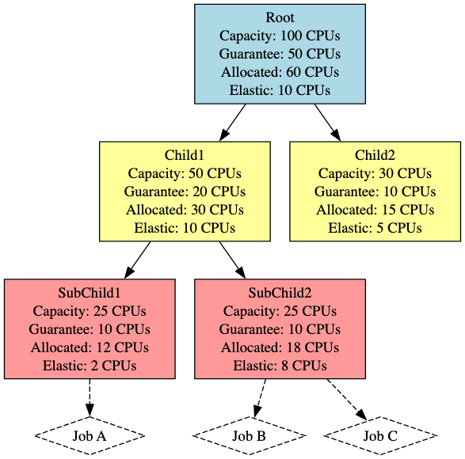
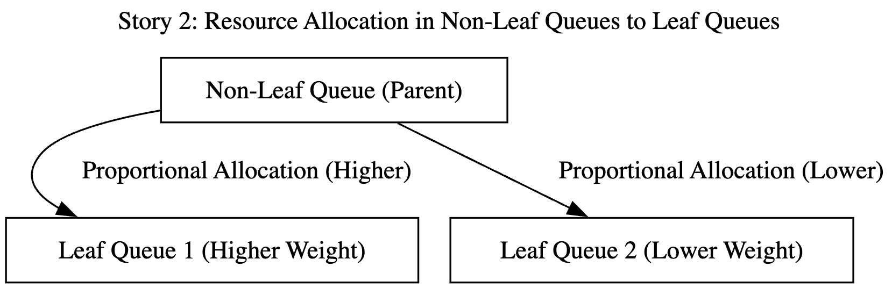
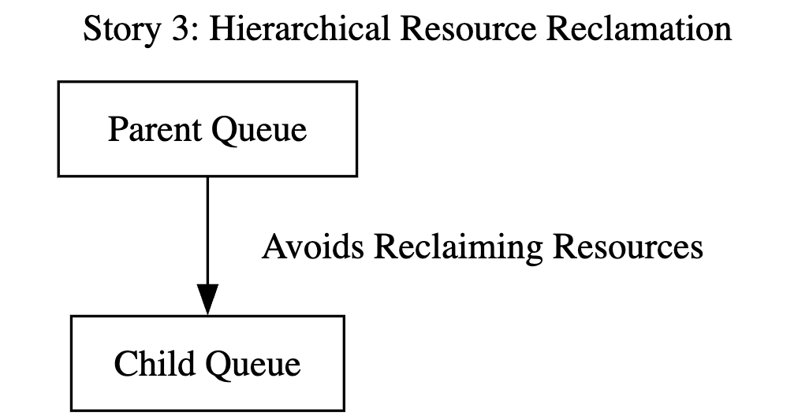
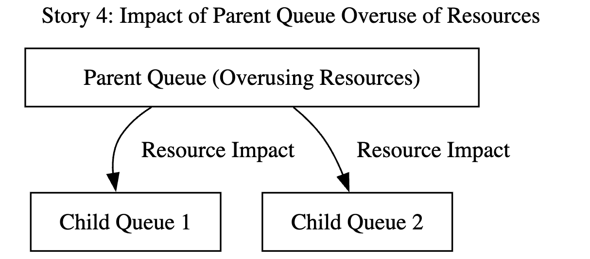
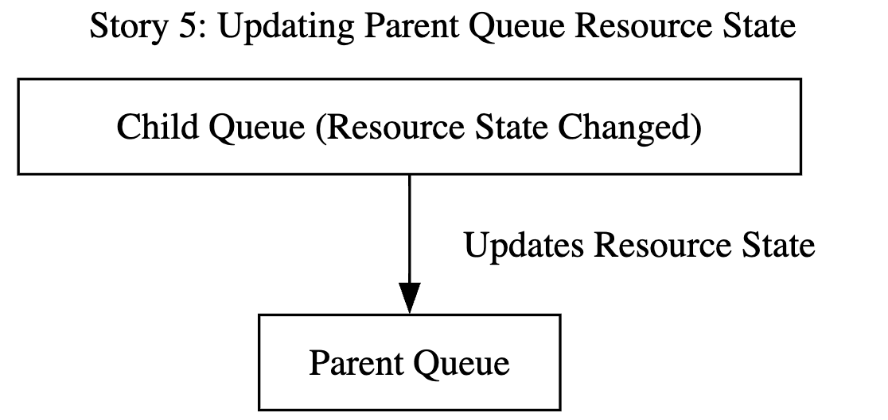

# Hierarchical Tree Queue on Proportion Plugin

## Contributors:

- Author: @hzq5477
- Reviewer: @william-wang @Monokaix

## Motivation

To solve part of [issue 3018](https://github.com/volcano-sh/volcano/issues/3018), the Proportion Plugin with Hierarchical Tree Queue is designed to enable more accurate modeling of queue relationships and finer-grained scheduling in multi-tenant environments. It allows for a hierarchical structure of queues improving control over queue scheduling and resource allocation. For example, in a multi-tenant environment, we can model a parent queue that represents a project or team and child queues that represent different teams or workloads within that project.

### In Scope:

- Implementation of hierarchical tree queue structure. (MVP)
- Fine-grained scheduling and resource allocation of queues.

### Out of Scope:

- Capacity scheduling management.

## Proposal

We propose to enhance the existing queue structure by adding hierarchical capabilities. This will include modifications to the data structures like adding pointers to parent and children in the queue. We also need to modify the function logic and scheduling processes to support the hierarchical model.

## User Stories

### Story 1: Hierarchical Queue System for Resource Management

As an administrator, I can set up a hierarchical queue system to better manage resource allocation among different teams. This includes a bound of resources between parent queue and child queues, ensuring that the sum of sub-queue's capacity/guarantee resources does not exceed the parent's.


### Story 2: Resource Allocation Based on Leaf Nodes

As an administrator, I need a queue hierarchy where only leaf node queues are used for job and Pod group scheduling. This ensures effective management of resource allocation and task distribution across different levels of the queue hierarchy.

### Story 3: Hierarchical Resource Reclamation

As a team user, when I need to reclaim resources, the system will follow the queue hierarchy, avoiding reclaiming resources from child queues. This ensures that higher-level queues do not erroneously reclaim resources from their child queues. Reclaim steps: 1. reclaim with the same parent, if not reclaimable 2. reclaim from another team/org.

### Story 4: Impact of Parent Queue Overuse of Resources

As an administrator, I can see that if a parent queue is overusing resources, it will impact the resource allocation for its child queues. For example, if the parent queue is overusing resources, consideration is given to reclaim resources based on the weight of the child queues with lower weight queues being prioritized for resource reclamation.

### Story 5: Updating Parent Queue Resource State

As an administrator, when there's a change in the resource state of a child queue, the system will automatically update the resource state of the parent queue. This is achieved by traversing up the hierarchy, updating each parent queue's resource state based on the aggregate state of its child queues.

## Design Details

Add queueAttr in Porportion with two new attributes: `children` and `parent`.

```
type queueAttr struct {
   	queueID api.QueueID
	name    string
	weight  int32
	share   float64

        // children map
        children map[api.QueueID]*queueAttr
        // parrent
       parent api.QueueID

	deserved  *api.Resource
	allocated *api.Resource
	request   *api.Resource
	// elastic represents the sum of job's elastic resource, job's elastic = job.allocated - job.minAvailable
	elastic *api.Resource
	// inqueue represents the resource request of the inqueue job
	inqueue    *api.Resource
	capability *api.Resource
	// realCapability represents the resource limit of the queue, LessEqual capability
	realCapability *api.Resource
	guarantee      *api.Resource
}
```

CRD:

```
apiVersion: scheduling.volcano.sh/v1beta1

kind: Queue

metadata:

  creationTimestamp: "2023-11-10T11:54:36Z"

  generation: 1

  name: default

  resourceVersion: "559"

  selfLink: /apis/scheduling.volcano.sh/v1beta1/queues/default

  uid: 14082e4c-bef6-4248-a414-1e06d8352bf0

spec:

  reclaimable: true

  weight: 1

  capability:

    cpu: "4"

    memory: "4096Mi"

  parent: "root"              # New field indicating the parent queue

status:

  state: Open
```

### New Attributes Definition:

- **`children`**: This is a map where the key is the QueueID of a child queue, and the value is the queueAttr of that child. This map is used to keep track of all the child queues of a particular queue, allowing for easy traversal and management of the queue hierarchy.
- **`parent`**: The QueueID of the parent queue. This attribute links a queue to its immediate parent in the hierarchy, enabling upward traversal in the queue tree.

### Hierarchical Queue API:

- `BuildHierarchyFn()`: Constructs the parent-child relationships from the specified hierarchy.
- `CalculateWeightsFn()`: Determines the weight distribution among queues based on the parent's total weight.
- `IsLeafFn()`:  Determines whether a queue is a leaf node within the hierarchy.
- `UpdateParentQueueFn()` : Updates the resource state of parent queues based on the child queues' states.

### Key Functions Needed to Modify:

- `AddQueueOrderFn()` : Sorts queues for resource allocation, prioritizing leaf queues.
  -` AddReclaimableFn()` : Ensures resource reclamation respects queue hierarchy.
- `AddOverusedFn()` : Marks a queue as overused if it exceeds its deserved resources, impacting its children's allocations.
- `AddJobEnqueueableFn()` : Rejects jobs if not in a leaf queue, traversing the hierarchy to find an appropriate queue.

### Limitations:

- **Lack of Dynamic Weight Adjustment**: The current design does not support dynamic adjustment of weights based on real-time resource usage or capacity changes. This could lead to less efficient resource utilization, especially in rapidly changing environments.
- **Dependency on Administrator Expertise**:  The effectiveness of the queue hierarchy relies on the administrator's expertise in configuring and managing the queues. Misconfigurations can lead to inefficient resource allocation and scheduling issues.
- **Unable to Allocate Jobs to non-leaf queues in MVP**:  In MVP, we restrict job allocation to leaf queues, thus the scheduling logic becomes more straightforward. In the next steps, we need to implement mechanisms to dynamically redistribute resources from non-leaf to leaf queues based on real-time workload changes.

### Next Step:

- **Dynamic Resource Indicator**: Develop a dynamic indicator that calculates a new index for each queue based on its guaranteed minimum resources and maximum capacity. This index would dynamically adjust to reflect the current state of resource usage and availability, which would be the foundation for allocating Jobs to non-leaf queues.
