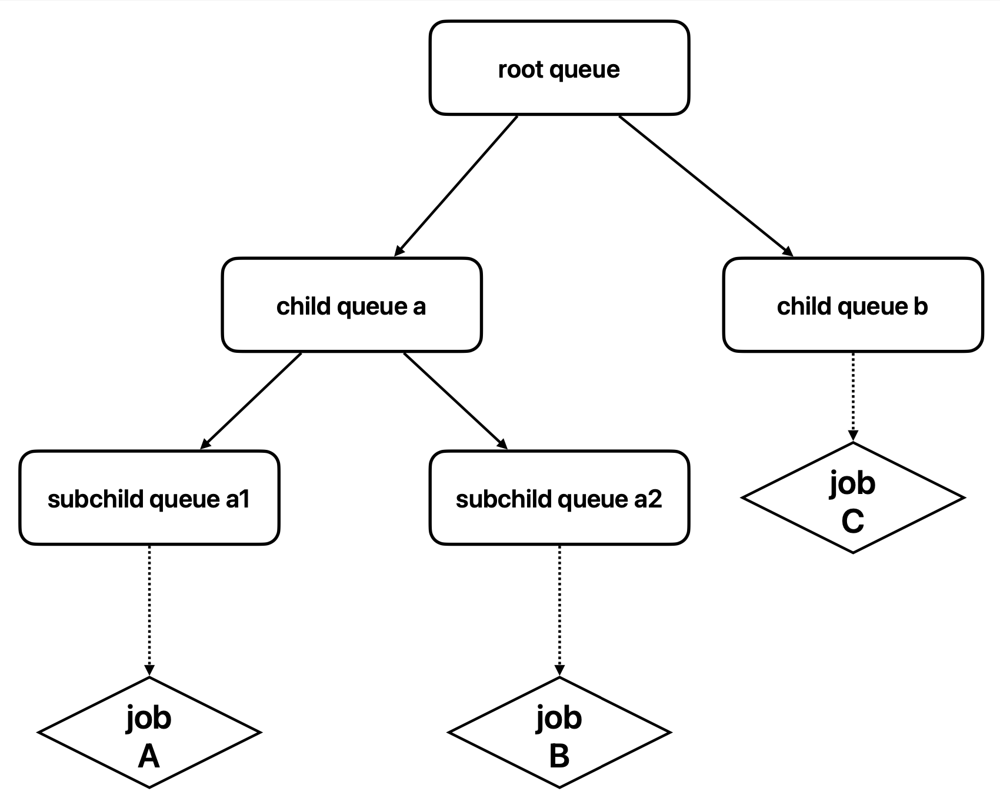

# Hierarchical Queue on Capacity Plugin

## Motivation

In the context of cloud-native AI task scheduling, fair scheduling and resource utilization are two critical concerns for users. The Volcano community has already developed the elastic queue management plugin, known as capacity, to support fine-grained resource borrowing/lending and queue management, thereby improving resource utilization. However, in real-world scenarios, queues are often hierarchical, corresponding to the hierarchical organizational structure of company teams. To better align with practical queue usage scenarios and further enhance resource utilization for AI task scheduling, Volcano needs to build upon the existing capacity plugin and introduce hierarchical queue management capabilities.

## In Scope

- Enhancing the elastic queue management capabilities of the capacity plugin to support hierarchical queues.

## Out of Scope

- Extending the hierarchical queues of any other plugins.

## User Stories

### Story 1

As an administrator, I want to create hierarchical queues to effectively manage resource allocation between different queues. This includes managing resources between parent and child queues, ensuring that the sum of the capacity/guarantee resources of the child queues does not exceed that of the parent queue.

### Story 2

As a user, I expect that only leaf queues can schedule jobs/podgroups. This ensures efficient management of resources and tasks at different levels of the queue hierarchy. 

### Story 3

When the resource status of a child queue changes, the resource status of its parent queues should be updated from the bottom up.

### Story 4

When executing the reclaim and preempt actions, the resource reclamation and preemption should consider the hierarchical queues. The system should prioritize queues belonging to the same parent queue as the preemptor, and then consider other queues from the bottom up in the hierarchy.

For example, consider the following hierarchical queue structure and jobs:

<div align="center"></div>

When job A performs reclaim or preempt actions, the system should first consider job B (belonging to the same parent queue a), and then consider job C (belonging to the same parent queue root).

## Design detail

### Webhook

- When creating a queue, the specified parent queue in the queue needs to be checked:
  - If the parent queue is scheduling jobs/podgroups, the creation of the queue is not allowed.
  - If the sum of the deserved/guaranteed resources of the child queues (including the queue to be created) in the parent queue exceeds the deserved/guaranteed resources of the parent queue, the creation is not allowed.
- When deleting a queue, if a queue is to be deleted, its child queues will be deleted first, and then the queue itself will be deleted.
- When closing a queue, the child queues of the queue will be closed first, and then the queue itself will be closed.

### Root queue

- The root queue is the parent queue of all queues.
- If the scheduler configuration enables the capacity plugin and the `EnabledHierarchy` option is turned on, a root queue with queueID `root` will be automatically created. In the `OpenSession` function, the `Deserved` and `Capability` fields of the root queue are updated each time based on `ssn.TotalResource`.
- Extend the capacityPlugin struct in capacity plugin to include one new field:
  - `rootQueue`: Represents the root queue. Its default value is `root`.
  
  ```go
  type capacityPlugin struct {
    totalResource  *api.Resource
    totalGuarantee *api.Resource
    rootQueue api.QueueID
    
    queueOpts map[api.QueueID]*queueAttr
    // Arguments given for the plugin
    pluginArguments framework.Arguments
  }
  ```

### Data structure modifications

- Extend the queueAttr struct in capacity plugin to include two new fields:
  - `parents`: Store all the parent queues of the current queue, including the root queue.
  - `children`: Store all the child queues of the current queue.

  ```go
  type queueAttr struct {
  	queueID api.QueueID
  	name    string
  	share   float64
  	// parents represents the parents of the queue, including the root queue
  	parents []api.QueueID

  	deserved  *api.Resource
  	allocated *api.Resource
  	request   *api.Resource
  	// elastic represents the sum of job's elastic resource, job's elastic = job.allocated - job.minAvailable
  	elastic *api.Resource
  	// inqueue represents the resource request of the inqueue job
  	inqueue    *api.Resource
  	capability *api.Resource
  	// realCapability represents the resource limit of the queue, LessEqual capability
  	realCapability *api.Resource
  	guarantee      *api.Resource
  	// children represents the child queues of the queue
  	children map[api.QueueID]*queueAttr
  }
  ```

### Key function modifications

- `OnSessionOpen`: Check that the sum of the deserved/guarantee values of each queue's child queues does not exceed the deserved/guarantee of the parent queue, and that the capability of any child queue does not exceed that of the parent queue. 
  - If the check reveals non-compliance with the aforementioned conditions, an error message should be printed, and the relevant functions for the session should return a disallowed status. 
  - For example, in the case of `AddJobEnqueueableFn`, it should directly return `util.Reject`, preventing the job from being enqueued. No scheduling should be performed in situations that do not align with the previously described conditions. Users need to adjust the queues based on the printed error information until normal scheduling can be resumed.
- `AddQueueOrderFn`: Prioritize leaf queues (queues without child queues) when considering queue ordering. For two leaf queues, the ordering will be determined by considering their parent queues layer by layer, starting from the root queue.
- `AddAllocatableFn`: Ensure that only leaf queues can schedule jobs/podgroups.
- `BuildVictimsPriorityQueue`: The current implementation of this function relies on `TaskOrderFn` and `JobOrderFn` for sorting victims. Two new functions, `VictimTaskOrderFn` and `VictimJobOrderFn`, will be introduced specifically for sorting victims in the context of hierarchical queues. 
  
  ```go
  func (ssn *Session) BuildVictimsPriorityQueue(victims []*api.TaskInfo, preemptor *api.TaskInfo) *util.PriorityQueue {
      victimsQueue := util.NewPriorityQueue(func(l, r interface{}) bool {
          lv := l.(*api.TaskInfo)
          rv := r.(*api.TaskInfo)
          if lv.Job == rv.Job {
              return ssn.VictimTaskOrderFn(l, r, preemptor)
          }

          return ssn.VictimJobOrderFn(ssn.Jobs[lv.Job], ssn.Jobs[rv.Job], preemptor)
      })
      for _, victim := range victims {
          victimsQueue.Push(victim)
      }
      return victimsQueue
  }
  ```

  - `VictimTaskOrderFn`: Prioritize tasks that belong to the same parent queue as the preemptor. If necessary, it will consider other tasks from the bottom up in the queue hierarchy.
  - `VictimJobOrderFn`: Similar to `VictimTaskOrderFn`, prioritize jobs that belong to the same parent queue as the preemptor. If necessary, it will consider other jobs from the bottom up in the queue hierarchy.

- `updateParentQueue`: Update the resource status of parent queues whenever the `updateShare` function is executed. It will traverse the queue hierarchy from the bottom up and update the resource information of parent queues accordingly.

**Note:** The above modifications are primarily applicable when `EnabledHierarchy` is set to true. If the capacity plugin does not require hierarchical queue management, the existing implementations of these functions will be retained.

### Vcctl

- Design relevant vcctl commands, such as commands to obtain the child queues of a specific queue or commands to retrieve the entire hierarchical queue structure.

### Limitations:

- The current design does not support scheduling jobs/podgroups to non-leaf queues. Only leaf queues can directly schedule and allocate resources to jobs/podgroups.
- The current design does not consider the queue migration issues related to hierarchical queue management in order to avoid manual operation and maintenance.
- When introducing a paused scheduling state for queues, optimize the management of the hierarchical queue structure under this state. For example, if a parent queue is paused for scheduling, it will cause its child queues to be paused as well. When resuming the parent queue, provide the capability to automatically resume the child queues in conjunction.