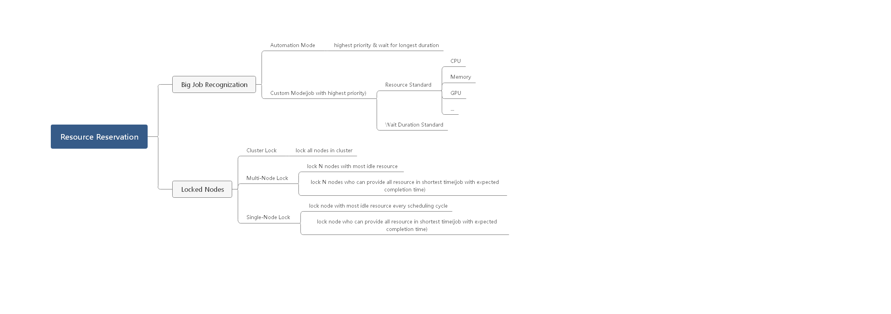

# Volcano Resource Reservation For Target Jobs

@[Thor-wl](https://github.com/Thor-wl); Aug 19th, 2020

## Motivation
As [issue 13](https://github.com/volcano-sh/volcano/issues/13) / [issue 748](https://github.com/volcano-sh/volcano/issues/748) 
/ [issue 947](https://github.com/volcano-sh/volcano/issues/947) mentioned, current scheduler strategy may result in 
jobs starvation. Consider two classical scenes:
* Suppose there is insufficient resource in cluster and both Job A and Job B are to be scheduled. Job A and Job B are in 
equal priority while Job A request more resources. Under current schedule strategy, there is high probability that Job B
can be scheduled first while Job A will be pending for a long time. If more jobs requesting less resource comes later, 
Job A will get a smaller chance to be scheduled.
* Suppose cluster resource is insufficient, Job A has higher priority and requests more resource while Job B has lower
priority but request less resource. As current schedule strategy works, volcano will schedule Job B first. What's worst,
Job A will keep waiting until enough resources are released by some low priority jobs. 

## Consideration
### How to recognise target jobs?
There are two ways to pick out target jobs:
#### Request resources
Set standard lines on some conditions such as request resources. Jobs requesting more resources than standard line will 
be regarded as target jobs. It may be a good way for specific scenarios such as ML training/big data/scientific computing, 
etc. However, users need to be experienced with his/her job requirements.
#### Waiting time
Consider waiting time as target job judgement is another solution. Jobs waiting for longer time are more likely to be
target jobs, especially on condition that jobs are blocked because of starvation. Different from setting standard lines, 
order jobs by waiting time is a good idea because it recognises target job automatically.
### How to reserve resources for target jobs?
Following are the factors taking into consideration for resources reservation.
#### Resource amount
Absolutely, jobs requiring resources more than cluster total amount cannot be satisfied. When choose nodes which need to
reserve resources for target jobs, the total amount idle resources of the selected nodes should as closer as the requirement
because only in this way can we need the least amount resources for jobs to be finished in most scenes. 
#### Selected nodes lock
Nodes which are chosen to reserve resources should be locked. That means these nodes cannot accept any other jobs until 
target jobs are scheduled.
#### Selected nodes numbers
Another problem is how many nodes can be selected as Reservation Nodes. In essence, it's a problem to balance scheduling
performance and reservation requirement.
#### The biggest challenge: unpredictable completion time of running jobs in selected nodes
Uncertainty of completion time of running jobs in selected nodes makes it difficult to find the optimal solution for 
meeting the requirement of target jobs. Though idle resources in selected nodes satisfied target jobs most, there's no 
guarantee that the waiting time for extra resource taken in running jobs is the shortest. In some cases, it may be a 
suboptimal solution.
### How to balance priority and waiting time?
Priority is more important than waiting time.
* No matter how many resources high-priority jobs requests and how much time they have already waited for, they should be
scheduled first.
* When jobs are at same priority but waiting time differs, job which waits for the longest time should be scheduled first.

## Design
### Target Job Recognition
As volcano is a general platform, we tend to support both custom mode and automation mode to recognize target jobs.
#### Custom Mode
Users can set **request resource** or **waiting duration** as standard. Jobs which request resources more than settings or 
wait longer than standard line will be treated as potential target job. Volcano will choose the target job which has the 
highest priority and above the standard line most as the target job. Another strategy is to allow users specify target job
by set some specified annotations.
#### Automation Mode
If not config standard line, volcano will order jobs to be scheduled in session by priority and waiting time. The job 
with the highest priority and waiting for the longest time will be selected as the target job. Volcano scheduler will 
check if there is a target job selected in each session. Otherwise, volcano will select a target job according to the 
strategy above.
### Locked Nodes
As job consists of some tasks and each task corresponds to a pod, scheduler will select a series of nodes which can satisfy
these pods. These nodes will be locked and no pod can be scheduled to them until the target job is scheduled.There are 
three schemes as follows:
#### Cluster Lock
In order to schedule target job as soon as possible, lock all nodes in cluster to reserve resource for it. This scheme is 
suitable for task type with fast throughput. As to long-running task, scheduler performance will be severely degraded.
#### Multi-Node Lock
In order to balance scheduler performance and resource reservation, we can lock part of nodes as locked nodes. Sort all
nodes by idle resource amount and select N nodes whose idle resource are the most. The N can be a fixed number or percentage.
Make sure the potential available resource can satisfy the request of target job. Then check if the available resource meets
the target job's demand after exist tasks finishing in locked nodes releases resource every scheduling cycle. This scheme is
suitable for users who are very experienced with his/her usage scenarios and the job type is almost the same(the run-time
gap of tasks is not too large).
#### Single-Node Lock
Another way to lock N nodes is lock one node every scheduling cycle. The selected node has the most idle resource at that
cycle. The dynamic selection process can alleviate the stereotype caused by one-time selection, especially in scene that
task type is unpredictable and complex.



## Implementation(v1.1.0)
Volcano v1.1.0 has implemented that recognise target job and reserve resource automatically.
### Action
Add two new action: elect and reserve. Elect action aims to find the target job. Reserve action is responsible for select
locked nodes.
#### Elect
If no target job is elected, select one from jobs whose podgroup is `pending` and satisfy conditions  in `TargetJob`
function registered in session object.
#### Reserve
If target job exists and is not ready, reserve nodes for it according algorithm implemented in `ReservedNodes` function
registered in session object.
### Plugin 
Add new Plugin reservation to implement algorithm detail about selecting target job and reserving nodes. `targetJobFn`
selects job whose priority is the highest and waits for the longest time. `reservedNodesFn` reserve node whose idle resource
is the max in every session.

### Recommend practice
An example how to make use of this feature is to configure scheduler's configuration as follows:
```yaml
actions: "enqueue, elect, allocate, backfill, reserve"
configurations:
  - name: enqueue
    arguments:
      "overcommit-factor": 1.0
tiers:
  - plugins:
  - name: priority
  - name: gang
  - name: conformance
  - name: reservation
  - plugins:
  - name: drf
  - name: predicates
  - name: proportion
  - name: nodeorder
  - name: binpack
args:
```
Note:
* `elect` must be configured between `enqueue` and `allocate` 
* `reserve` must be behind `allocate`
* You'd better config `overcommit-factor` to `1.0` which is `1.2` by default for it may not select the most suitable 
  target job if not configure like this.

### TODO
* support custom define percentage of cluster nodes as the upper limit of locked nodes number, which should be in the 
form of pure decimal. Default value is 1.0.
* support custom define wait duration, whose default value is 0.

## Implementation(v1.2.1)
Optimized from feature implementation in v1.1.0, volcano v1.2.1 will update as follows:
* New recommend action order: elect, enqueue, reserve, allocate. This order will lead to reserve nodes efficiently.
* Support new nodes lock algorithm: cluster lock. Namely, lock all nodes for target job at once. It may result in shorter 
  scheduling time for target job. Custom configuration is supported for users to choose which lock algorithm via scheduler
  configuration file or plugin.
* create plugin to cover the logic about `inqueue` status judgement in `enqueue` action. It will be more flexible to set
  `inqueue` condition.
* Support users specify target job by set specified annotation on job. If not specified, volcano will select one and set
  annotation automatically.
* Lock nodes will be labelled instead of stored in cache. Label will be removed after target job is running.
* Select part nodes as lock nodes by default. Support users set `timeout` for max lock duration. If target job is not
  allocated resource out of `timeout`, cluster lock will work.
* Put `nodes` as an argument for `Predicate` function
* Select target job from jobs whose podgroup is `pending` and `inqueue`.
