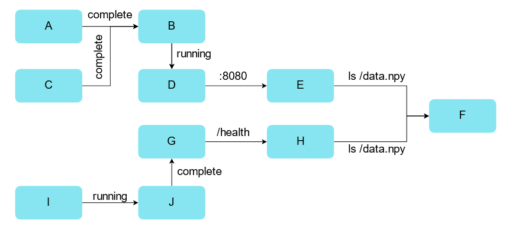
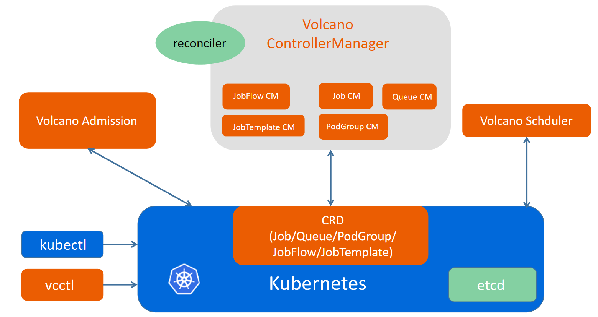
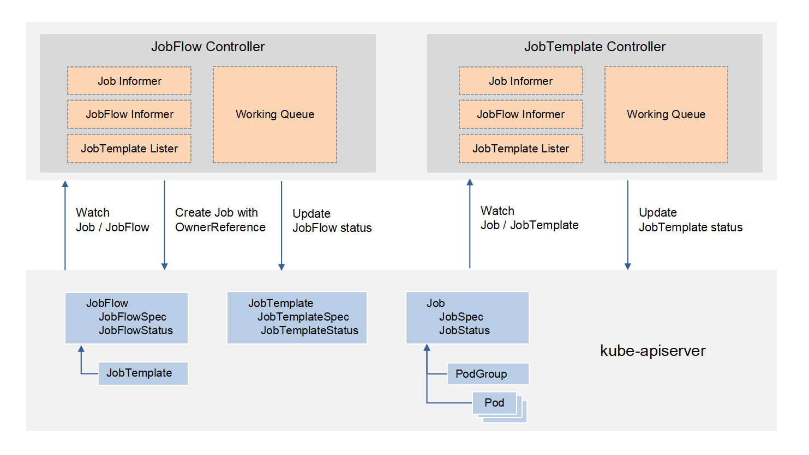
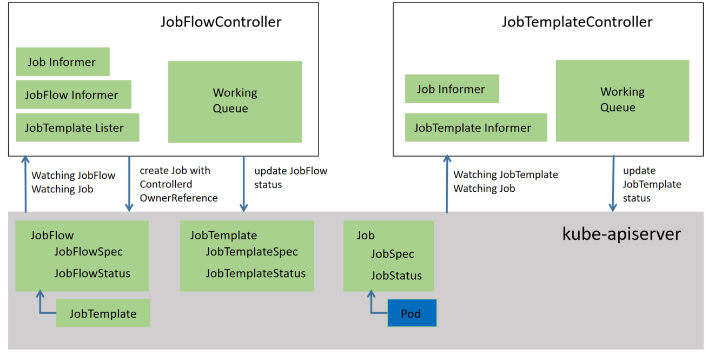
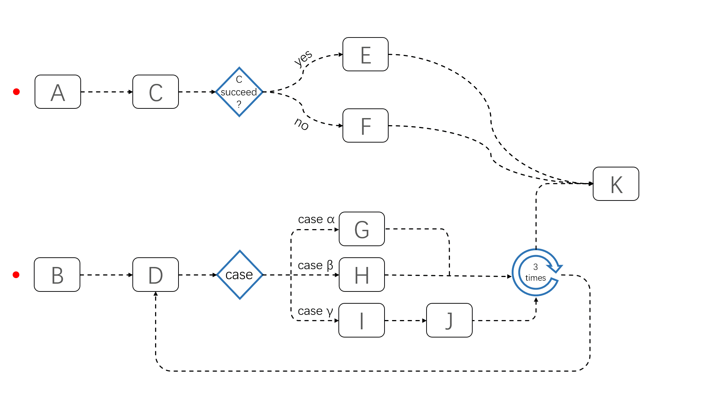

# JobFlow

## Introduction

In order to solve the problem of inter-job dependencies. We need many VCJobs to cooperate each other and orchestrate them manually or by another Job Orchestration Platform to get the job done finally.We present an new way of orchestrating VCJobs called JobFlow. We proposed two concepts to running multiple batch jobs automatically named JobTemplate and JobFlow so end users can easily declare their jobs and run them using complex controlling primitives, for example, sequential or parallel executing, if-then-else statement, switch-case statement, loop executing and so on.

JobFlow helps migrating AI, BigData, HPC workloads to the cloud-native world. Though there are already some workload flow engines, they are not designed for batch job workloads. Those jobs typically have a complex running dependencies and take long time to run, for example days or weeks. JobFlow helps the end users to declare their jobs as an jobTemplate and then reuse them accordingly. Also, JobFlow orchestrating those jobs using complex controlling primitives and launch those jobs automatically. This can significantly reduce the time consumption of an complex job and improve resource utilization. Finally, JobFlow is not an generally purposed workflow engine, it knows the details of VCJobs. End user can have a better understanding of their jobs, for example, job's running state, beginning and ending timestamps, the next jobs to run, pod-failure-ratio and so on.

## Scope

### In Scope
- Define the API of JobFlow
- Define the behaviour of JobFlow
- Start sequence between multiple jobs
- Dependency completion state of the job start sequence
- DAG-based job dependency startup

### Out of Scope
- Supports other job
- Achieve vcjobs level gang

## Scenarios

- Some jobs need to depend on the completion of the previous job or other status when running, etc. Otherwise, the correct result cannot be calculated.
- Sometimes inter-job dependencies also require diverse dependency types, such as conditional dependencies, circular dependencies, probes, and so on.



## Design





The blue part is the component of k8s itself, the green and brown are the components of volcano, and the yellow is the crd resource of volcano.

jobflow job submission complete process：

1. After passing the Admission. kubectl will create JobTemplate and JobFlow (Volcano CRD) objects in kube-apiserver.

2.  The JobFlowController uses the JobTemplate as a template according to the configuration of the JobFlow, and creates the corresponding VcJob according to the flow dependency rules.

3.  After VcJob is created, VcJobController creates corresponding Pods and podgroups according to the configuration of VcJob.

4.  After Pod and PodGroup are created, vc-scheduler will go to kube-apiserver to get Pod/PodGroup and node information.

5. After obtaining the information, vc-scheduler will select the appropriate node for each Pod according to its configured scheduling policy.

6. After assigning nodes to Pods, kubelet will get the Pod's configuration from kube-apiserver and start the corresponding containers.


### Controller



### Webhook

```
Create a JobFlow check
1、There cannot be a template with the same name in a JobFlow dependency
  Such as: A->B->A->C A appears twice
2、Closed loops cannot occur in JobFlow
  E.g：A -> B  ->  C
          ^     /
          |    /
          < - D

Create a JobTemplte check (following the vcjob parameter specification)
E.g: job minAvailable must be greater than or equal to zero
   job maxRetry must be greater than or equal to zero
   tasks cannot be empty, and cannot have tasks with the same name
   The number of task replicas cannot be less than zero
   task minAvailable cannot be greater than task replicas...
```

### JobFlow

#### Introduction

JobFlow defines the running flow of a set of jobs. Fields in JobFlow define how jobs are orchestrated.

JobFlow is abbreviated as jf, and the resource can be viewed through kubectl get jf

JobFlow aims to realize job-dependent operation between vcjobs in volcano. According to the dependency between vcjob, vcjob is issued.

#### Key Fields

##### Top-Level Attributes

The top-level attributes of a jobflow define its apiVersion, kind, metadata and spec.

| Attribute    | Type                    | Required | Default Value              | Description                                                  |
| ------------ | ----------------------- | -------- | -------------------------- | ------------------------------------------------------------ |
| `apiVersion` | `string`                | Y        | `flow.volcano.sh/v1alpha1` | A string that identifies the version of the schema the object should have. The core types uses `flow.volcano.sh/v1alpha1` in this version of documentation. |
| `kind`       | `string`                | Y        | `JobFlow`                  | Must be `JobFlow`                                            |
| `metadata`   | [`Metadata`](#Metadata) | Y        |                            | Information about the JobFlow resource.                          |
| `spec`       | [`Spec`](#spec)         | Y        |                            | A specification for the JobFlow resource attributes.             |
| `status`       | [`Status`](#Status)         | Y        |                            | A specification for the JobFlow status attributes.             |

<a id="Metadata"></a>

##### Metadata

Metadata provides basic information about the JobFlow.

| Attribute     | Type                | Required | Default Value | Description                                                  |
| ------------- | ------------------- | -------- | ------------- | ------------------------------------------------------------ |
| `name`        | `string`            | Y        |               | A name for the schematic. `name` is subject to the restrictions listed beneath this table. |
| `namespace`        | `string`            | Y        |               | A namespace for the schematic. `namespace` is subject to the restrictions listed beneath this table. |
| `labels`      | `map[string]string` | N        |               | A set of string key/value pairs used as arbitrary labels on this component. Labels follow the [Kubernetes specification](https://kubernetes.io/docs/concepts/overview/working-with-objects/labels/). |
| `annotations` | `map[string]string` | N        |               | A set of string key/value pairs used as arbitrary descriptive text associated with this object.  Annotations follows the [Kubernetes specification](https://kubernetes.io/docs/concepts/overview/working-with-objects/annotations/#syntax-and-character-set). |

<a id="Spec"></a>

##### Spec

The specification of cloud-native services defines service metadata, version list, service capabilities and plugins.

| Attribute         | Type                                 | Required | Default Value | Description                                                  |
| ----------------- | ------------------------------------ | -------- | ------------- | ------------------------------------------------------------ |
| `flows`           | [`Flow array`](#Flow) | Y        |               | Describes the dependencies between vcjobs. |
| `jobRetainPolicy` | `string`                             | Y        | retain | After JobFlow succeed, keep the generated job. Otherwise, delete it. |

<a id="Flow"></a>

##### Flow

| Attribute         | Type                                 | Required | Default Value | Description                                                  |
| ----------------- | ------------------------------------ | -------- | ------------- | ------------------------------------------------------------ |
| `name`       | `string` | Y        |               | JobTemplate name |
| `dependsOn` | [`DependsOn`](#DependsOn)                             | Y        |               | JobTemplate dependencies |
| `patch` | [`Patch`](#Patch)                             | N        |               | Patch JobTemplate |

<a id="DependsOn"></a>

##### DependsOn

| Attribute         | Type                                 | Required | Default Value | Description                                                  |
| ----------------- | ------------------------------------ | -------- | ------------- | ------------------------------------------------------------ |
| `targets` | `string array` | Y        |               | All jobtemplate names that JobTemplate depends on |
| `probe` | [`Probe`](#Probe)                   | N       |               | Probe Type Dependency |
| `strategy` | `string` | Y        | all | Whether the dependencies need to be all satisfied |

<a id="Patch"></a>

##### Patch

| Attribute         | Type                                 | Required | Default Value | Description                                                  |
| ----------------- | ------------------------------------ | -------- | ------------- | ------------------------------------------------------------ |
| `spec` | `spec` | Y        |               | Patch the contents of the jobtemplate's spec |

<a id="Probe"></a>

##### Probe

| Attribute         | Type                                 | Required | Default Value | Description                                                  |
| ----------------- | ------------------------------------ | -------- | ------------- | ------------------------------------------------------------ |
| `httpGetList` | [`HttpGet array`](#HttpGet) | N       |               | HttpGet type dependencies |
| `tcpSocketList` | [`TcpSocket array`](#TcpSocket) | N       |               | TcpSocket type dependencies |
| `taskStatusList` | [`TaskStatus array`](#TaskStatus) | N       |  | TaskStatus type dependencies |

<a id="HttpGet"></a>

##### HttpGet

| Attribute         | Type                                 | Required | Default Value | Description                                                  |
| ----------------- | ------------------------------------ | -------- | ------------- | ------------------------------------------------------------ |
| `TaskName` | `string` | Y        |               | The name of the task under vcjob |
| `Path` | [`Probe`](#Probe)                   | Y      |               | The path of httpget |
| `Port` | `int` | Y        |  | The port of httpget              |
| `httpHeader` | `HTTPHeader` | N      |  | The httpHeader of httpget |

<a id="TcpSocket"></a>

##### TcpSocket

| Attribute         | Type                                 | Required | Default Value | Description                                                  |
| ----------------- | ------------------------------------ | -------- | ------------- | ------------------------------------------------------------ |
| `TaskName` | `string` | Y        |               | The name of the task under vcjob |
| `Port` | `int` | Y        |  | The port of TcpSocket     |

<a id="TaskStatus"></a>

##### TaskStatus

| Attribute         | Type                                 | Required | Default Value | Description                                                  |
| ----------------- | ------------------------------------ | -------- | ------------- | ------------------------------------------------------------ |
| `TaskName` | `string` | Y        |               | The name of the task under vcjob |
| `Phase` | `string`              | Y      |               | The phase of task |

<a id="Status"></a>

##### Status

| Attribute         | Type                                 | Required | Default Value | Description                                                  |
| ----------------- | ------------------------------------ | -------- | ------------- | ------------------------------------------------------------ |
| `pendingJobs` | `string array` | N       |               | Vcjobs in pending state |
| `runningJobs` | `string array` | N       |               | Vcjobs in running state |
| `failedJobs` | `string array` | N       |               | Vcjobs in failed state |
| `completedJobs` | `string array` | N       |               | Vcjobs in completed and completing state |
| `terminatedJobs` | `string array` | N       |               | Vcjobs in terminated and terminating state |
| `unKnowJobs` | `string array` | N       |               | Vcjobs in pending state |
| `jobStatusList` | [`JobStatus array`](#JobStatus) | N       |               | Status information of all split vcjobs |
| `conditions` | [`map[string]Condition`](#Condition) | N       |               | It is used to describe the current state, creation time, completion time and information of all vcjobs. The vcjob state here additionally adds the waiting state to describe the vcjob whose dependencies do not meet the requirements. |
| `state` | [`State`](#State) | N       |               | State of JobFlow |

<a id="JobStatus"></a>

##### JobStatus

| Attribute         | Type                                 | Required | Default Value | Description                                                  |
| ----------------- | ------------------------------------ | -------- | ------------- | ------------------------------------------------------------ |
| `name` | `string` | N       |               | Name of vcjob |
| `state` | `string` | N       |               | State of vcJob |
| `startTimestamp` | `Time` | N       |               | StartTimestamp of vcjob |
| `endTimestamp` | `Time` | N       |               | EndTimestamp of vcjob |
| `restartCount` | `int32` | N       |               | RestartCount of vcjob |
| `runningHistories` | [`JobRunningHistory array`](#JobRunningHistory) | N       |               | Historical information of various states of vcjob |

<a id="Condition"></a>

##### Condition

| Attribute         | Type                                 | Required | Default Value | Description                                                  |
| ----------------- | ------------------------------------ | -------- | ------------- | ------------------------------------------------------------ |
| `phase` | `string` | N       |               | phase of vcjob |
| `createTime` | `Time` | N       |               | CreateTime of vcjob |
| `runningDuration` | `Duration` | N       |               | RunningDuration of vcjob |
| `taskStatusCount` | `map[string]TaskState` | N       |               | The number of tasks in different states |

<a id="State"></a>

##### State

| Attribute         | Type                                 | Required | Default Value | Description                                                  |
| ----------------- | ------------------------------------ | -------- | ------------- | ------------------------------------------------------------ |
| `phase` | `string` | N     |               | Succeed： All vcjobs have reached completed state。<br/>Terminating： Jobflow is deleting。<br/>Failed： A vcjob in the flow is in the failed state, so the vcjob in the flow cannot continue to be delivered。<br/>Running： Flow contains vcjob in Running state。<br/>Pending: The flow contains no vcjob in the Running state。 |

<a id="JobRunningHistory"></a>

##### JobRunningHistory

| Attribute         | Type                                 | Required | Default Value | Description                                                  |
| ----------------- | ------------------------------------ | -------- | ------------- | ------------------------------------------------------------ |
| `startTimestamp` | `Time` | N     |               | The start time of a certain state of the vcjob |
| `endTimestamp` | `Time` | N     |               | The end time of a certain state of the vcjob |
| `state` | `string` | N     |               | Vcjob status |

JobFlow supports the functionality of the JobTemplate patch. The example in JobFlow is as follows:

```
apiVersion: flow.volcano.sh/v1alpha1
kind: JobFlow
metadata:
  name: test
  namespace: default
spec:
  jobRetainPolicy: delete  
  flows:
  - name: a
    patch: 
      spec:
        tasks:
        - name: "default-nginx"
          template:
            spec:
              containers:
              - name: nginx
                command:
                  - sh
                  - -c
                  - sleep 10s
```

Here is an example of jobflow:

[the sample file of JobFlow](../../../example/jobflow/JobFlow.yaml)

### JobTemplate

#### Introduction

* JobTemplate is the template of vcjob, after JobTemplate is created, it will not be processed by vc-controller like vcjob, it will wait to be referenced by JobFlow.
* JobFlow can reference multiple jobtemplates
* A jobtemplate can be referenced by multiple jobflows
* JobTemplate can be converted to and from vcjob.
* Jobtemplate is abbreviated as jt, and the resource can be viewed through kubectl get jt
* The difference between jobtemplate and vcjob is that jobtemplate will not be issued by the job controller, and jobflow can directly reference the name of the JobTemplate to implement the issuance of vcjob.
* JobFlow supports making changes to jobtemplate when referencing jobtemplate

#### Definition

#### Key Fields

##### Top-Level Attributes

The top-level attributes of a jobtemplate define its apiVersion, kind, metadata and spec.

| Attribute    | Type                    | Required | Default Value              | Description                                                  |
| ------------ | ----------------------- | -------- | -------------------------- | ------------------------------------------------------------ |
| `apiVersion` | `string`                | Y        | `flow.volcano.sh/v1alpha1` | A string that identifies the version of the schema the object should have. The core types uses `flow.volcano.sh/v1alpha1` in this version of documentation. |
| `kind`       | `string`                | Y        | `JobTemplate`           | Must be `JobTemplate`                                     |
| `metadata`   | [`Metadata`](#JobTemplateMetadata) | Y        |                            | Information about the JobTemplate resource.              |
| `spec`       | [`Spec`](#JobTemplateSpec) | Y        |                            | A specification for the JobTemplate resource attributes. |
| `status`       | [`Status`](# JobTemplateStatus) | Y        |                            | A specification for the JobTemplate status attributes. |

<a id="JobTemplateMetadata"></a>

##### Metadata

Metadata provides basic information about the JobTemplate.

| Attribute     | Type                | Required | Default Value | Description                                                  |
| ------------- | ------------------- | -------- | ------------- | ------------------------------------------------------------ |
| `name`        | `string`            | Y        |               | A name for the schematic. `name` is subject to the restrictions listed beneath this table. |
| `namespace`        | `string`            | Y        |               | A namespace for the schematic. `namespace` is subject to the restrictions listed beneath this table. |
| `labels`      | `map[string]string` | N        |               | A set of string key/value pairs used as arbitrary labels on this component. Labels follow the [Kubernetes specification](https://kubernetes.io/docs/concepts/overview/working-with-objects/labels/). |
| `annotations` | `map[string]string` | N        |               | A set of string key/value pairs used as arbitrary descriptive text associated with this object.  Annotations follows the [Kubernetes specification](https://kubernetes.io/docs/concepts/overview/working-with-objects/annotations/#syntax-and-character-set). |

<a id="JobTemplateSpec"></a>

##### JobTemplateSpec

The spec of jobtemplate directly follows the spec of vcjob.

<a id="JobTemplateStatus"></a>

##### JobTemplateStatus
| Attribute         | Type                                 | Required | Default Value | Description                                                  |
| ----------------- | ------------------------------------ | -------- | ------------- | ------------------------------------------------------------ |
| `jobDependsOnList` | `string array` | Y        |               | Vcjobs created by this jobtemplate as a template. |

You can view [the sample file of JobTemplate](../../../example/jobflow/JobTemplate.yaml)

## JobFlow task scheduling



## Demo video

https://www.bilibili.com/video/BV1c44y1Y7FX

## Usage

- Create the jobTemplate that needs to be used
- Create a jobflow. The flow field of the jobflow is filled with the corresponding jobtemplate used to create a vcjob.
- The field jobRetainPolicy indicates whether to delete the vcjob created by the jobflow after the jobflow succeeds. (delete/retain) default is retain.

## JobFlow Features

### Features that have been implemented

* Create JobFlow and JobTemplate CRD
* Support sequential start of vcjob
* Support vcjob to depend on other vcjobs to start
* Support the conversion of vcjob and JobTemplate to each other
* Supports viewing of the running status of JobFlow

### Features not yet implemented

* JobFlow supports making changes to jobtemplate when referencing jobtemplate
* `if` statements
* `switch` statements
* `for` statements
* Support job failure retry in JobFlow
* Integration with volcano-scheduler
* Support for scheduling plugins at JobFlow level