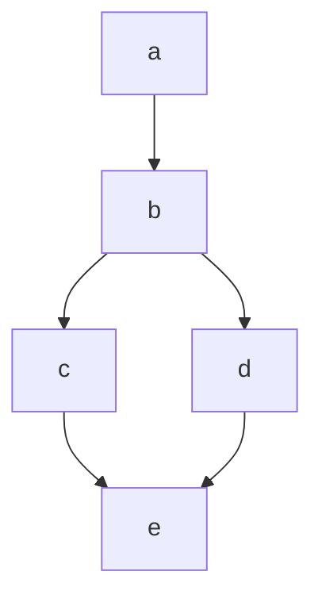
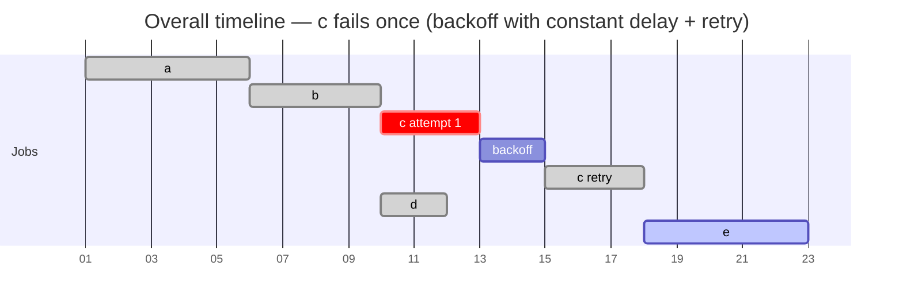
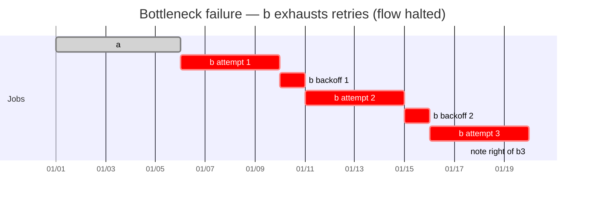
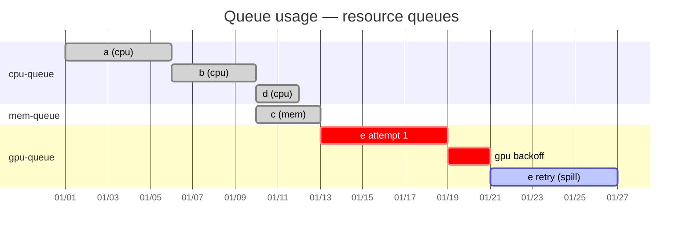

# JobFlow Retry Mechanism And Policies

[@mahdikhashan](https://github.com/mahdikhashan); 20 August, 2025

## Summary

This is an enhancement on top of the original design for JobFlow, 
it will introduce a new field to the FlowSpec that users can override 
the JobSpec retry mechanism and enhance their JobFlow pipeline fault-tolerance.

## Table of Contents

- [JobFlow Retry Mechanism](#job-flow-retry-mechanism)
    * [Motivation](#motivation)
    * [User Stories](#user-stories)
        + [Story 1](#story-1)
    * [Design Details](#design-details)
        + [JobFlow API Changes](#jobflow-api-changes)
            - [JobFlowSpec Type](#jobflowspec-type)
            - [Flow Type](#flow-type)
            - [RetryPolicy Types](#retrypolicy-types)
            - [Retry Strategy](#retry-strategy)
            - [Backoff Policy](#backoff-policy)
            - [Backoff Type](#backoff-type)
        + [Example](#example)
            - [Flow Diagram](#flow-diagram)
            - [JobTemplates](#jobtemplates)
            - [JobFlow](#jobflow)
            - [Overall Job (c fails, backoff, then retry)](#overall-job-c-fails-backoff-then-retry)
            - [Bottleneck failure (b exhausts retries and halts the flow)](#bottleneck-failure-b-exhausts-retries-and-halts-the-flow)
            - [Queue usage (cpu-queue, mem-queue, gpu-queue)](#queue-usage-cpu-queue-mem-queue-gpu-queue)
    * [Test Plan](#test-plan)
        + [TODO](#todo)

## Motivation

Currently, when a job triggered by a JobFlow fails, the entire flow might halt, and requires manual intervention.
There is no automatic retrial mechanism for retrying failed jobs. This leads to:

- Longer execution time and requirement to do manual restarts.
- Wastes compute resources when downstream jobs are blocked.
- Reduced reliability for production pipelines.

## User Stories

### Story 1

> As an AI Infrastructure Engineer / Platform Engineer, I want to decrease the JobFlow failure rate by defining retry policy
> so that the controller can retry failed jobs automatically based on policies like backoff, this feature will increase robustness and reliability.

## Design Details

To implement this feature, We introduce `RetryPolicy` field to the `JobFlowSpec` and `Flow` types. with the first one, users can define
a default retry policy for all jobs in the flow, and the second one is to override or set the retry policy only for specific jobs.

### JobFlow API Changes

`JobFlowSpec` and `Flow` gains a new field named `RetryPolicy`:


#### JobFlowSpec Type
```yaml
type JobFlowSpec struct {
  ...
  
  // +optional
  RetryPolicy *RetryPolicy `json:"retryPolicy,omitempty"`
}
```

#### Flow Type
```yaml
type Flow struct {
  ...

  // +optional
  RetryPolicy *RetryPolicy `json:"retryPolicy,omitempty"`
}
```

#### RetryPolicy Types
```yaml
type RetryPolicy struct {
  // +optional
  // +kubebuilder:validation:Minimum=0
  MaxRetries int32 `json:"maxRetries,omitempty"`

  // +optional
  // +kubebuilder:validation:Enum=Always;OnFailure;Never
  Policy RetryStrategy `json:"policy,omitempty"`

  // +optional
  Backoff *BackoffPolicy `json:"backoff,omitempty"`
}
```

##### Values

| Field | Type                                  |                                            Default | Description                                                                                                                  |
| ----- | ------------------------------------- |---------------------------------------------------:| ---------------------------------------------------------------------------------------------------------------------------- |
| `maxRetries` | `int`                                 |                                                `0` | Maximum retry attempts **after** the first run (so total attempts = `maxRetries + 1`). `0` means "no automatic retries".     |
| `policy` | `RetryStrategy` |                                        `OnFailure` | When to attempt retries: `OnFailure` = retry only if the job failed; `Always` = always re-run (rare); `Never` = never retry. |
| `backoff` | `BackoffPolicy`                       |                                              `nil` | Optional backoff strategy describing delays between retries (constant vs exponential, base delay, optional cap).             |

#### Retry Strategy

```yaml
type RetryStrategy string

const (
  RetryAlways    RetryStrategy = "Always"
  RetryOnFailure RetryStrategy = "OnFailure"
  RetryNever     RetryStrategy = "Never"
)
```

##### Values

| Value       | When to use                                                                               |
| ----------- |-------------------------------------------------------------------------------------------|
| `OnFailure` | Default. Retry only when the job exits with failure. Avoids pointless re-runs on success. |
| `Always`    | Retry even when the job succeeded, rare, used for idempotent verification tasks.          |
| `Never`     | Disable retries. Useful for cost-sensitive or side-effectful jobs.                        |

#### Backoff Policy

```yaml
type BackoffPolicy struct {
  // +kubebuilder:validation:Enum=Constant;Exponential
  Type BackoffType `json:"type,omitempty"`

  // +optional
  BaseDelay metav1.Duration `json:"baseDelay,omitempty"`

  // +optional
  MaxDelay *metav1.Duration `json:"maxDelay,omitempty"`
}
```

##### Values

| Field | Type                                       |       Default | Description                                                                                                                                            |
| ----- | ------------------------------------------ |--------------:| ------------------------------------------------------------------------------------------------------------------------------------------------------ |
| `type` | `BackoffType` | `Exponential` | Strategy for computing delay before each retry. `Constant` = same delay every time; `Exponential` = delay doubles each retry (respecting `baseDelay`). |
| `baseDelay` | `metav1.Duration`                          |         `30s` | The initial delay before the first retry (Kubernetes duration format).                                                                                 |
| `maxDelay` | `*metav1.Duration`                         |        `5m`   | Optional upper limit for exponential growth to avoid excessively long waits.                                                                           |

#### Backoff Type

```yaml
type BackoffType string

const (
  BackoffConstant    BackoffType = "Constant"
  BackoffExponential BackoffType = "Exponential"
)
```

##### Values

| Value         | Meaning                                                                                | Example                                               |
| ------------- | -------------------------------------------------------------------------------------- | ----------------------------------------------------- |
| `Constant`    | Fixed wait time between retries (useful when retries should be quick and predictable). | `type: Constant`, `baseDelay: 30s`                    |
| `Exponential` | Delay grows exponentially (base × 2ⁿ), used to reduce contention and thundering herd.  | `type: Exponential`, `baseDelay: 30s`, `maxDelay: 5m` |

### Example

Below is a complete example JobFlow manifest (YAML) that implements the `RetryPolicy` additions and shows a realistic usage:

#### Flow Diagram



#### JobTemplates

```yaml
apiVersion: flow.volcano.sh/v1alpha1
kind: JobTemplate
metadata:
  name: a
spec:
  minAvailable: 1
  schedulerName: volcano
  queue: default
  tasks:
    - replicas: 1
      name: "default-nginx"
      template:
        metadata:
          name: web
        spec:
          containers:
            - image: nginx:1.14.2
              command:
                - sh
                - -c
                - sleep 10s
              imagePullPolicy: IfNotPresent
              name: nginx
              resources:
                requests:
                  cpu: "1"
          restartPolicy: OnFailure
---
apiVersion: flow.volcano.sh/v1alpha1
kind: JobTemplate
metadata:
  name: b
spec:
  minAvailable: 1
  schedulerName: volcano
  queue: default
  tasks:
    - replicas: 1
      name: "default-nginx"
      template:
        metadata:
          name: web
        spec:
          containers:
            - image: nginx:1.14.2
              command:
                - sh
                - -c
                - sleep 10s
              imagePullPolicy: IfNotPresent
              name: nginx
              resources:
                requests:
                  cpu: "1"
          restartPolicy: OnFailure
---
apiVersion: flow.volcano.sh/v1alpha1
kind: JobTemplate
metadata:
  name: c
spec:
  minAvailable: 1
  schedulerName: volcano
  queue: default
  tasks:
    - replicas: 1
      name: "default-nginx"
      template:
        metadata:
          name: web
        spec:
          containers:
            - image: nginx:1.14.2
              command:
                - sh
                - -c
                - sleep 10s
              imagePullPolicy: IfNotPresent
              name: nginx
              resources:
                requests:
                  cpu: "1"
          restartPolicy: OnFailure
---
apiVersion: flow.volcano.sh/v1alpha1
kind: JobTemplate
metadata:
  name: d
spec:
  minAvailable: 1
  schedulerName: volcano
  queue: default
  tasks:
    - replicas: 1
      name: "default-nginx"
      template:
        metadata:
          name: web
        spec:
          containers:
            - image: nginx:1.14.2
              command:
                - sh
                - -c
                - sleep 10s
              imagePullPolicy: IfNotPresent
              name: nginx
              resources:
                requests:
                  cpu: "1"
          restartPolicy: OnFailure
---
apiVersion: flow.volcano.sh/v1alpha1
kind: JobTemplate
metadata:
  name: e
spec:
  minAvailable: 1
  schedulerName: volcano
  queue: default
  tasks:
    - replicas: 1
      name: "default-nginx"
      template:
        metadata:
          name: web
        spec:
          containers:
            - image: nginx:1.14.2
              command:
                - sh
                - -c
                - sleep 10s
              imagePullPolicy: IfNotPresent
              name: nginx
              resources:
                requests:
                  cpu: "1"
          restartPolicy: OnFailure
```

#### JobFlow

```yaml
apiVersion: flow.volcano.sh/v1alpha1
kind: JobFlow
metadata:
  name: example-flow
spec:
  jobRetainPolicy: retain
  retryPolicy:
    maxRetries: 1
    policy: OnFailure
    backoff:
      type: Exponential
      baseDelay: 1d
      maxDelay: 5d
  flows:
    - name: a
      patch:
        - queue: cpu
    - name: b
      patch:
        - queue: cpu
      dependsOn:
        targets: ["a"]
      retryPolicy:
        maxRetries: 3
        policy: OnFailure
        backoff:
          type: Exponential
          baseDelay: 5min
          maxDelay: 60min
    - name: c
      dependsOn:
        targets: ["b"]
      patch:
        queue: memory-heavy
      retryPolicy:
        maxRetries: 1
        policy: OnFailure
        backoff:
          type: Constant
          baseDelay: 360min
    - name: d
      dependsOn:
        targets: ["b"]
      pathc:
        queue: cpu
    - name: e
      queueName: gpu
      retryPolicy:
        maxRetries: 2
        policy: OnFailure
        backoff:
          type: Exponential
          baseDelay: 1min
          maxDelay: 15min
      dependsOn:
        targets: ["c", "d"]
```

#### Overall Job (c fails, backoff, then retry)

This timeline shows the job sequence where task c fails once, enters a backoff period, then successfully retries before the workflow continues.




#### Bottleneck failure (b exhausts retries and halts the flow)

This chart illustrates how repeated failures of job **b** deplete all retries, ultimately stopping the entire workflow.




#### Queue usage (cpu-queue, mem-queue, gpu-queue)

This chart shows how tasks are scheduled across CPU, memory, and GPU queues, including retries and backoff periods.



### Test Plan

TODO

