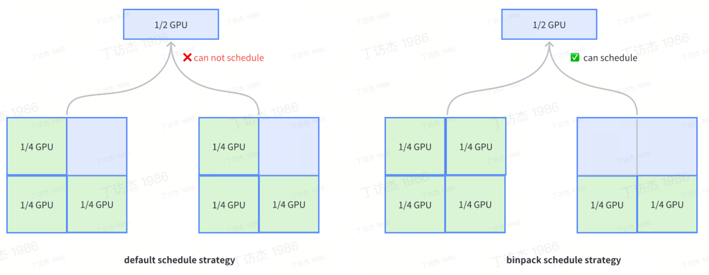
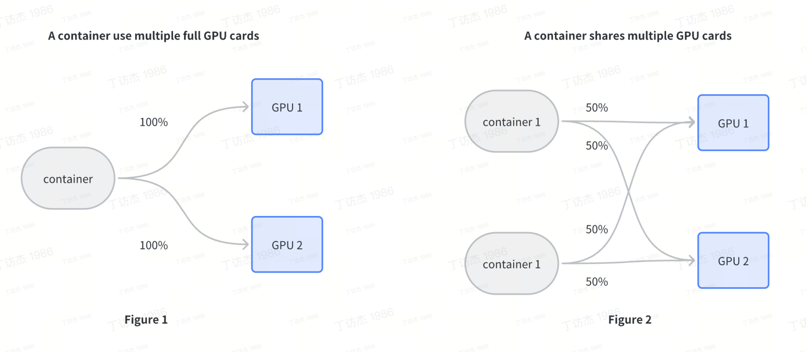
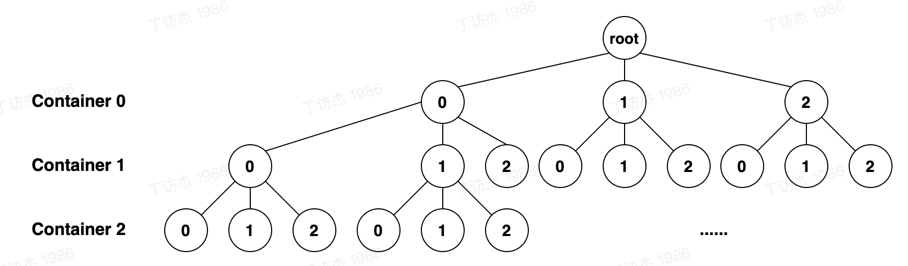

# Based on Device API support for mGPU scheduling.

## Motivation
Volcano is the first batch computing platform based on Kubernetes under CNCF. Many cloud users utilize Volcano as their batch scheduling. Although Volcano currently supports GPU share scheduling, likes vGPU, the GPU sharing scheme used in the ByteDance Volcano Engine is mGPU. Therefore, if users deploy Volcano on the Volcano Engine, they can not use the GPU share scheme (mGPU) of the Volcano Engine. This proposal proposes a GPU share scheduling plugin based on Volcano DeviceAPI to support the mGPU function.

## Goals
1. Develop a scheduling plugin that supports mGPU based on the Volcano Device API.
2. The mGPU plugin supports the following features:
- A GPU card can be shared by multiple containers. For example, one container can utilize 30% of the computing power and memory of a single GPU card.
- A container shares multiple GPU cards.  For example, one container can share two GPU cards with 50% computing power and memory each.
- mGPU card-level binpack and spread scheduling strategy.
## NoGoals
Support for GPU card-level topology-aware scheduling

## Proposal
### A GPU card can be shared by multiple containers
The native Kubernetes NVIDIA GPU scheduler only supports whole-card scheduling. Even if a pod can not fully utilize the computing power of a GPU card, it will still be allocated a complete GPU card, resulting in significant waste of GPU computing power. This plugin supports multiple containers using a single GPU card on the scheduling side.
### mGPU card-level binpack scheduling strategy
The use of the Binpack strategy can prioritize scheduling containers of  Pods on the same GPU card, and if this GPU can not meet the container requirements,  then schedule to other GPU cards. The Binpack scheduling algorithm  scores to the schedulable GPU cards, with higher scores indicating higher resource utilization rates, and selects the GPU card with the highest score for container scheduling. The Binpack algorithm can fill the GPU card as much as possible,  significantly improving the utilization rate of GPU cards. At the same time, it can also combine the node-level Binpack strategy to support  node-level and GPU card-level Binpack strategies.


### mGPU card-level spread scheduling strategy.
By using the GPU-card Spread scheduling strategy, pods  or containers can be distributed as much as possible to different GPU cards, which ensures high availability of the business.


### A container shares multiple GPU cards
In native scheduling of kubernetes, a container can request  multiple full GPUs (as  Figure 1). The mGPU plugin provides a scheduling method where a container can use multiple GPU cards at a certain percentage (as Figure 2).

The minimum unit that utilizes the multi-card capability is the Container. Users can add annotations to the Container that needs to enable a container multi-card at the Pod.
```yaml
apiVersion: v1
kind: Pod
metadata:
  annotations:
    # the order of the numbers in the list corresponds to the order of the containers
    vke.volcengine.com/container-multiple-gpu: "2,1,3"
...
```
A pod contains three containers, namely container 0, container 1, and container 2. Container 0 will use two GPU cards, with each card being allocated 50% usage. Container 1 will use one GPU card, using one full GPU card. Container 2 will use three GPU cards, with each card using 33.33% usage.  
The scheduling result based on the container request should also be written in the annotation.
```yaml
apiVersion: v1
kind: Pod
metadata:
  annotations:
    ...
    # Container 0 uses GPU cards with serial numbers 0 and 1.
    vke.volcengine.com/gpu-index-container-0: "1,0" 
    # Container 1 uses GPU cards with serial numbers 2.
    vke.volcengine.com/gpu-index-container-1: "2" 
    # Container 2 uses GPU cards with serial numbers 1,0,3
    vke.volcengine.com/gpu-index-container-2: "1,0,3" 
    ...
```

## Plugin implementation details
### Filter
If the MGPUEnable switch is turned on during the Filter phase, the node's MGPU resources and the the Pod's MGPU resources will be verified to ensure compliance with the following requirements:
1. For normal MGPU Pods, their compute allocation policy must match that of the node, like fixed-share, guaranteed-burst-share and native-burst-share.
2. For multiple MGPU Pods, they must be based on the native-burst-sharepolicy and the node label must have enabled this feature.
3. If any container in the Pod requests more cards than the node can allocate, Filter will return false.

### Allocate
The purpose of the Allocation phase is to allocate an optimal list of MGPUs for multiple Containers in a Pod based on the Binpack/Spread strategy of card level, and then allocate the node resources accordingly. To solve this problem, we use DFS and pruning optimization.

Taking the above picture as an example, suppose there are 3 Containers in the Pod to be scheduled, and there are 3 GPUs on this node. We are judging whether this node is eligible for allocation.
- Each layer of the tree represents a Container
- The number in each node represents the MGPU card number
- The root node represents the initial unallocated state
  Traverse in DFS mode and try to allocate a MGPU for each Container, that is, perform resource admission. The admission of the next layer needs to consider the allocation results of all previous layers on the path.
#### End Contidion
1. If the resource admission of a node fails, pruning is carried out to stop subsequent searches for the path and trace back
2. If the lowest layer is searched, it means that all containers can allocate MGPU resources, which is a possible allocation combination.
3. When traversing to the lowest level, score the allocation combination corresponding to the path, and maintain the highest score and the corresponding allocation combination When the whole tree search is complete, you can know whether there are feasible allocation combinations on the node; If so, the optimal allocation combination and its score on that node can be known.

#### Schedule Result
Finally, call KubeClient  to patch the following annotations  as schedule results to the scheduled Pod based on the allocation result mentioned above. The agent in the node will execute actual MGPU allocation in the node by these annotations.
```yaml
apiVersion: v1
kind: Pod
metadata:
  annotations:
    ...
    # Schedule results
    vke.volcengine.com/assumed: "true" # schedule MGPU resource successfully
    vke.volcengine.com/gpu-index-container-c1: "1" # Container 1 uses GPU card with index 1.
    vke.volcengine.com/gpu-index-container-c2: "2,3" # Container 2 uses GPU card with index 2,3.
    vke.volcengine.com/gpu-index-container-c3: "1,2,3" # Container 3 uses GPU card with index 1,2,3.
...
```
### Release
When removing from Pod, clean up and recycle device memory of nodes based on the GPU List displayed according to the allocation result.

### Webhook Addmission
In the Webhook Admission, a validation check is implemented for MGPU pods by reusing the logic in admit_pod.go which has no impact on other pods.
When a Pod requests vke.volcengine.com/mgpu-coreor vke.volcengine.com/mgpu-memory, the mgpu-share webhook will classify it as a normal MGPU or a multiple MGPU Pod based on the length of the requested GPU list, and implement different validation logic accordingly.
#### Normal MGPU Pod
When the Pod is a normal MGPU Pod, the validation fails in the following cases:
1. Requested mgpu-core <= 0 or mgpu-memory <= 0

```yaml
apiVersion: v1
kind: Pod
metadata:
  name: normal-mgpu-pod
spec:
  containers:
  ...
    resources:
      requests:
        vke.volcengine.com/mgpu-core: "-20" 
        vke.volcengine.com/mgpu-memory: 6k
```
2. Requested mgpu-core ∈ (0, 100) and mgpu-memory < MinGPUMemory (256MiB) which is too few for containerd running.
```yaml
apiVersion: v1
kind: Pod
metadata:
  name: normal-mgpu-pod
spec:
  containers:
  ...
    resources:
      requests:
        vke.volcengine.com/mgpu-core: "120" 
        vke.volcengine.com/mgpu-memory: 128
```
3. Requested mgpu-core > 100 and not a full card core
- full cards required mgpu-core must be integer multiple of 100
```yaml
apiVersion: v1
kind: Pod
metadata:
name: normal-mgpu-pod
spec:
containers:
...
resources:
requests:
vke.volcengine.com/mgpu-core: "120"
```
4. Requested mgpu-core's integer multiple of 100 and set a redundant mgpu-memory
- request for the full cards with the requirement that mgpu-memory is not set
```yaml
apiVersion: v1
kind: Pod
metadata:
  name: normal-mgpu-pod
spec:
  containers:
  ...
    resources:
      requests:
        vke.volcengine.com/mgpu-core: "200" 
        vke.volcengine.com/mgpu-memory: 6k 
```
#### Multiple MGPU Pod
When the Pod is a multiple MGPU Pod, the validation fails in the following cases:
1. The number of requested GPUs and containers is not equal.
   In the following case, the gpu count list in vke.volcengine.com/container-multiple-gpu contains 2 but only 1 container in the pod.
```yaml
apiVersion: v1
kind: Pod
metadata:
  annotations:
    vke.volcengine.com/container-multiple-gpu: "3,2"
  name: multiple-mgpu-pod
spec:
  containers:
  ...
    resources:
      limits:
        vke.volcengine.com/mgpu-core: "200"   
        vke.volcengine.com/mgpu-memory: 6k           
      requests:
        vke.volcengine.com/mgpu-core: "200"
        vke.volcengine.com/mgpu-memory: 6k 
```
2. The requested number of GPU cards is invalid, such as negative number -1 in the following case.
```yaml
apiVersion: v1
kind: Pod
metadata:
  annotations:
    vke.volcengine.com/container-multiple-gpu: "-1,2"
  name: multiple-mgpu-pod
spec:
  containers:
  ...
    resources:
      limits:
        vke.volcengine.com/mgpu-core: "200"   
        vke.volcengine.com/mgpu-memory: 6k           
      requests:
        vke.volcengine.com/mgpu-core: "200"
        vke.volcengine.com/mgpu-memory: 6k 
```
3. The mgpu-core/container-multiple-gpu is integer multiple of 100, which means request full cards, but set a redundant mgpu-memory. In the following case, mgpu-core/container-multiple-gpu = 200/2 = 100, but set redundant mgpu-memory.
```yaml
apiVersion: v1
kind: Pod
metadata:
  annotations:
    vke.volcengine.com/container-multiple-gpu: "2"
  name: multiple-mgpu-pod
spec:
  containers:
  ...
    resources:
      limits:
        vke.volcengine.com/mgpu-core: "200"   
        vke.volcengine.com/mgpu-memory: 6k           
      requests:
        vke.volcengine.com/mgpu-core: "200"
        vke.volcengine.com/mgpu-memory: 6k 
```
4. Requested gpu count of an MGPU instance invalid:
1. mgpu-mem/gpu-count less than  MinGPUMemory (256MiB)
2. mgpu-core and mgpu-memory can't be divisible by multiple gpu-count
3. mgpu-core/gpu-count can't be greater than 100
   In the following case, mgpu-core/container-multiple-gpu = 130/3, which 130 divided by 3 does not yield an integer quotient.
```yaml
apiVersion: v1
kind: Pod
metadata:
  annotations:
    vke.volcengine.com/container-multiple-gpu: "3"
  name: multiple-mgpu-pod
spec:
  containers:
  ...
    resources:
      limits:
        vke.volcengine.com/mgpu-core: "130"   
        vke.volcengine.com/mgpu-memory: 6k           
      requests:
        vke.volcengine.com/mgpu-core: "130"
        vke.volcengine.com/mgpu-memory: 6k 
```
## Volcano Plugin Config
```yaml
...
      actions: "reclaim, allocate, backfill, preempt"
      tiers:
      - plugins:
        - name: priority
        - name: gang
        - name: conformance
      - plugins:
        - name: drf
        - name: predicates
          arguments:
            predicate.MGPUEnable: true
            predicate.MGPUPolicy: binpack
            predicate.MGPUWeightOfCore: 20
            predicate.MGPUScheduleMode: index
            predicate.MGPUMaxContainersPerCard: 16
        - name: proportion
        - name: nodeorder
...
```
- predicate.MGPUEnable：true means enable MGPU Plugin
- predicate.MGPUPolicy：MGPU card-level binpack and spread scheduling strategy
    - The optional enumeration values are Binpack and Spread.
- predicate.MGPUWeightOfCore：weight of mgpu-core when calculating resource score
    - Score = weightOfCore * scoreOfMGPUCore + ( 1 - weightOfCore ) * scoreOfMGPUMemory
- predicate.MGPUScheduleMode：the schedule mode for MGPU plugin, which can be set index or id
- predicate.MGPUMaxContainersPerCard：the max MGPU instance number per card can be run
    - The default value is 16, which depends on the definition of the mGPU-driver.


