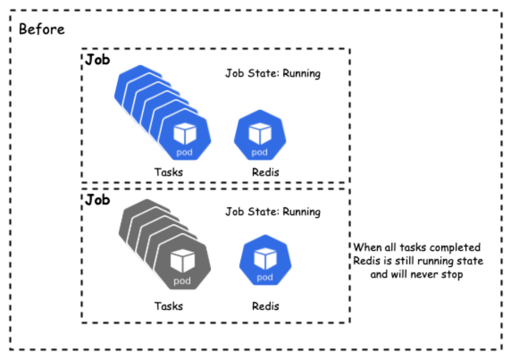
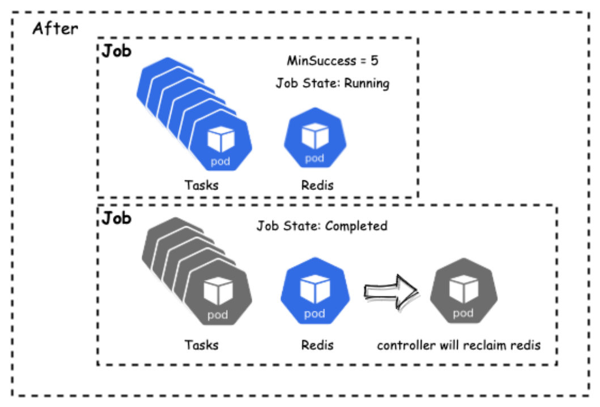

# MinSuccess

## Motivation

Sometimes we want to deploy our job with some service tasks (nginx, redis and so on) which will always be in `Running`
state. So how to determine such kind job is completed? Only with `minAvailable` is not enough, because
`minAvailable` only work at **Job pending** and **all tasks Completed/Failed**. It lacks the ability to change the Job
state during the **Job is Running** state, and reclaim these service tasks.



## Design
In order to solve this problem, we provide `minSuccess` field which will help the job to determine how many succeed
tasks does it need to change its state to `Completed`, and reclaim the other Running pods.

```yaml
apiVersion: batch.volcano.sh/v1alpha1
kind: Job
metadata:
  name: test-job
spec:
  minAvailable: 6
  minSuccess: 5
  schedulerName: volcano
  queue: default
  plugins:
    svc: []
  tasks:
    - replicas: 5
      name: "task"
      template:
        metadata:
          name: task
        spec:
          containers:
            - image: ubuntu
              imagePullPolicy: IfNotPresent
              name: task
              resources:
                requests:
                  cpu: "1"
          restartPolicy: OnFailure
    - replicas: 1
      name: "redis"
      template:
        metadata:
          name: redis
        spec:
          containers:
            - image: redis
              imagePullPolicy: IfNotPresent
              name: redis
          restartPolicy: OnFailure
```



From the above picture, we can find that when there are 5 tasks completed, the controller will know it's the time to mark the job `Completed`, and reclaim the redis pod.