# Mixed-Depth HyperNode Topology Design

Author: siqiaawa · 2026-08-03

Related Issue: [volcano-sh/volcano#5732](https://github.com/volcano-sh/volcano/issues/5732)

---

<!-- toc -->
- [1. Summary](#1-summary)
- [2. Motivation](#2-motivation)
- [3. Scope](#3-scope)
- [4. Goals](#4-goals)
- [5. Non-Goals](#5-non-goals)
- [6. Proposal](#6-proposal)
  - [6.1 Design delta](#61-design-delta)
  - [6.2 Architecture overview](#62-architecture-overview)
  - [6.3 Discovery configuration and workload API](#63-discovery-configuration-and-workload-api)
  - [6.4 Scheduling behavior](#64-scheduling-behavior)
- [7. Design Details](#7-design-details)
  - [7.1 Core invariants and identities](#71-core-invariants-and-identities)
  - [7.2 Representing mixed-depth A3/A5 trees](#72-representing-mixed-depth-a3a5-trees)
  - [7.3 Controller extensions](#73-controller-extensions)
  - [7.4 Scheduler constraint and candidate extensions](#74-scheduler-constraint-and-candidate-extensions)
  - [7.5 Tree-local lookup and scoring](#75-tree-local-lookup-and-scoring)
  - [7.6 Recovery adaptation](#76-recovery-adaptation)
  - [7.7 End-to-end integration sequence](#77-end-to-end-integration-sequence)
- [8. Compatibility](#8-compatibility)
- [9. Failure Semantics](#9-failure-semantics)
- [10. Risks and Mitigations](#10-risks-and-mitigations)
- [11. Alternatives Considered](#11-alternatives-considered)
- [12. Code Map](#12-code-map)
- [13. Validation Plan](#13-validation-plan)
- [14. Open Questions](#14-open-questions)
- [15. Future Considerations](#15-future-considerations)
- [References](#references)
<!-- /toc -->

## 1. Summary

Volcano represents network performance domains with HyperNode trees and
schedules Jobs and SubGroups through the existing `networkTopology` API.
Several discovery and scheduling paths currently rely on cluster-global tier
indexes or tier-name mappings. Those assumptions are invalid when topology
models with different depths coexist in one cluster.

A representative mixed cluster contains:

```text
A3: node -> hypernode -> hypercluster
A5: node -> superpod -> hypernode -> hypercluster
```

In this example, `hypernode` is local tier 1 in A3 and local tier 2 in A5,
while numeric tier 1 refers to different physical domains. This proposal
therefore treats every connected real HyperNode tree as an independent local
tier coordinate system.

The Core change adds:

- selector-based topology profiles and profile-local domain identity;
- deterministic, Profile-aware HyperNode generation;
- one Session-local `TopologyTree` view per connected real root;
- BFS-based, tree-local resolution of `highestTierName`;
- tree-separated hard gradients and tree-local lookup and scoring inputs;
- mixed-depth adaptations for Job/SubGroup ranges and allocation recovery.

The existing HyperNode CRD, virtual root, `hard`/`soft` workload API, gang
dry-run, Node placement pipeline, and converted `soft` numeric path are reused.
No Job, PodGroup, SubGroup, or HyperNode CRD field is added.

## 2. Motivation

[Network Topology Aware Scheduling](https://github.com/volcano-sh/volcano/blob/master/docs/design/Network%20Topology%20Aware%20Scheduling.md)
places Jobs and SubGroups inside eligible HyperNode subtrees. A single global
hierarchy is adequate when every tree has the same depth and semantic levels,
but heterogeneous accelerator clusters violate that condition:

| Topology | Local tier 1 | Local tier 2 | Local tier 3 |
| --- | --- | --- | --- |
| A3 | `hypernode` | `hypercluster` | — |
| A5 | `superpod` | `hypernode` | `hypercluster` |

A workload should still be able to request:

```yaml
spec:
  networkTopology:
    mode: hard
    highestTierName: volcano.sh/hypercluster
```

without knowing that `hypercluster` maps to tier 2 in A3 and tier 3 in A5.

### 2.1 Problems with cluster-global topology semantics

| Existing assumption | Failure in an A3/A5 cluster |
| --- | --- |
| One global `tierName -> tier` map | The same semantic name cannot map to both A3 tier 1 and A5 tier 2. |
| One global `tier -> HyperNode set` index | Equal numeric tiers group unrelated domains, such as A3 `hypernode` and A5 `superpod`. |
| One cluster-wide minimum/maximum tier range | A5's additional level changes A3 locality normalization and normal-Pod fading. |
| Domain identity based mainly on label key/value | Reused A3/A5 labels can converge onto the same discovered HyperNode. |
| Hard capacity evaluated across global candidates | Partial capacity from unrelated trees can appear to satisfy one hard gang. |
| Allocation state without real-tree identity | Later Pods or a restarted Scheduler can move a hard workload to a sibling tree. |

The design separates three concepts that were previously easy to conflate:

- a **topology profile**, which describes how Nodes of one model are interpreted;
- a **connected real HyperNode tree**, which is the Scheduler's physical tree
  identity; and
- a **local tier**, whose numeric meaning is valid only inside that tree.

## 3. Scope

This proposal covers the Core changes required to discover, represent, and
schedule mixed-depth HyperNode trees:

- Profile-based label discovery and profile-local domain isolation;
- connected-root `TopologyTree` views in each Scheduler Session;
- per-tree hard semantic-boundary resolution and candidate generation;
- compatibility with the existing converted `soft` virtual-root path;
- mixed-depth Job/SubGroup range composition;
- tree-local Node lookup and scoring inputs;
- allocation-time state updates and restart recovery; and
- backward compatibility directly affected by these changes.

Complete mixed-tree GangPreempt/GangReclaim policy, eviction fairness, Profile
lifecycle ownership, broad object-migration policy, and explicit accelerator
preference remain outside this delivery.

## 4. Goals

1. Construct independent A3, A5, or other mixed-depth HyperNode trees in one
   cluster without hardware-specific scheduler branches.
2. Select each Node through one explicit topology profile and isolate domains
   by profile, physical label key, and label value.
3. Interpret `hard` real-tree numeric boundaries, semantic tier names,
   gradients, lookup, and scores inside one connected real tree, while keeping
   the converted `soft` virtual-root numeric compatibility path explicit.
4. Require a hard Job or SubGroup to fit within one legal real-tree domain.
5. Preserve the existing Soft behavior: try real HyperNode candidates first
   and use `ClusterTopHyperNode` only as the final cross-tree candidate.
6. Allow SubGroup constraints to narrow, but never widen, an outer hard Job
   boundary.
7. Preserve the selected tree and domain during later allocation, Pod
   replacement, and Scheduler restart.
8. Maintain legacy discovery, single-tree scheduling, numeric constraints, and
   existing CRD schemas.

## 5. Non-Goals

| Item | Decision |
| --- | --- |
| Persist a shared root HyperNode CR | Not included. `ClusterTopHyperNode` remains Scheduler-only state. |
| Add `SelectedTreeID` or another workload field | Not included. Recovery uses existing allocation state and bound Pods. |
| Add dummy tiers to shallow trees | Rejected because they represent network domains that do not exist. |
| Renumber every tree into one global hierarchy | Rejected because one tree must not change another tree's numeric semantics. |
| Require hardware-specific tier names | Rejected. A3 and A5 may share semantic names such as `hypernode` and `hypercluster`. |
| Treat a profile as a physical tree ID | Rejected. One profile may produce several disconnected real roots. |
| Add a separate soft tree planner or combination API | Not included. `soft` mode reuses the virtual-root path. |
| Define complete preempt/reclaim mixed-tree behavior | Deferred to a follow-up. |
| Define Profile lifecycle and discovery ownership | Deferred until the ownership semantics are agreed. |
| Define explicit device/tree preference | Deferred. The core implementation uses deterministic candidate ordering. |

## 6. Proposal

### 6.1 Design delta

This proposal extends the existing HyperNode discovery and
network-topology-aware scheduling paths. It does not replace the established
HyperNode CR model, virtual root, gang dry-run, Node predicates, or binding
pipeline.

| Area | Existing Volcano behavior | Change in this proposal | Change type |
| --- | --- | --- | --- |
| Label discovery | A topology type is interpreted through an ordered list of Node labels and reconciled into HyperNode objects. | Add selector-based profiles, profile-specific levels, and profile-local domain identity. | New extension |
| HyperNode naming and ownership | Discovered objects are identified mainly by the physical topology domain. | Add deterministic Profile-aware naming, a Profile label, limited legacy reuse, and collision rejection. | New extension |
| Scheduler topology state | The Session retains `ClusterTopHyperNode` and cluster-global tier indexes. | Add one `TopologyTree` and reverse index per connected real root. | New structure |
| `hard` semantic constraint | The existing API supplies `highestTierName` or `highestTierAllowed`, and the plugin generates HyperNode candidates. | Preserve the complete spec, traverse each candidate tree with BFS, and propagate a branch-local “boundary matched” state from each parent traversal item to its children. | Modified path |
| Soft constraint | Soft is converted to the existing numeric virtual-root path. | Preserve this path; ensure real HyperNodes remain separate candidates and only `ClusterTopHyperNode` exposes cross-tree capacity. | Reused with compatibility fixes |
| Job/SubGroup ranges | Existing Job, SubGroup, and `AllocatedHyperNode` ranges constrain placement. | Intersect ranges without widening sibling or cross-tree hard boundaries. | Modified path |
| Network-aware locality | Existing scoring uses the candidate domain, allocated domain, and their LCA. | Normalize with the allocated domain's local tree depth; a cross-tree LCA is the virtual root and therefore scores zero in that local range. | Modified inputs |
| Normal-Pod fading | Existing binpack scoring combines topology-level contributions and the virtual-root term. | Iterate only the candidate Node's real-tree tiers, then retain the existing virtual-root term. | Modified inputs |
| Node lookup | Existing scheduling paths need the lowest HyperNode containing a Node. | Resolve real-tree ownership before selecting the lowest local-tier HyperNode. | Modified lookup |
| Restart recovery | Existing recovery intersects HyperNode membership for bound Pods to rebuild `AllocatedHyperNode`. | Reuse that mechanism and resolve later semantic constraints inside the recovered real tree. | Reused with mixed-depth adaptation |
| Allocate pipeline | Aggregate capacity, whole-group dry-run, Node predicates, Node scoring, and statement commit already exist. | Reuse the pipeline, but route `getNewAllocatedHyperNode` through the Session tree-local Node lookup. | Reused with modified state hook |

The implementation contribution is therefore concentrated in profile-local
discovery, connected-root tree views, BFS-based semantic-boundary resolution
with inherited branch state, tree-local hard gradients, and the tier-dependent
lookup and scoring inputs.

### 6.2 Architecture overview

The Controller and Scheduler use related but different identities:

- the Controller uses a **Profile** to select the interpretation model for a
  Node and persists real HyperNode objects;
- the Scheduler uses each **connected real root** to build one
  `TopologyTree`;
- the existing `ClusterTopHyperNode` remains an in-memory virtual root for
  traversal, compatibility, and `soft` cross-tree fallback.

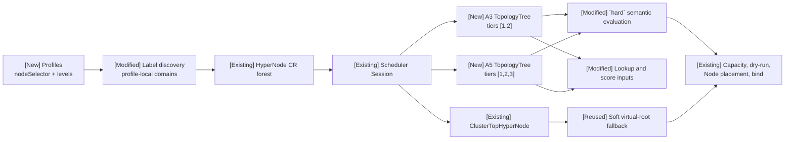

### 6.3 Discovery configuration and workload API

The existing `networkTopologyTypes` field accepts either the legacy list or
the new Profile form. A Profile adds a Node selector and explicit semantic tier
names:

```yaml
networkTopologyDiscovery:
- source: label
  enabled: true
  config:
    networkTopologyTypes:
      topologyA3:
        nodeSelector:
          matchLabels:
            accelerator.example.com/model: a3
        levels:
        - nodeLabel: topology.example.com/hypercluster
          tierName: volcano.sh/hypercluster
        - nodeLabel: topology.example.com/hypernode
          tierName: volcano.sh/hypernode
        - nodeLabel: kubernetes.io/hostname

      topologyA5:
        nodeSelector:
          matchLabels:
            accelerator.example.com/model: a5
        levels:
        - nodeLabel: topology.example.com/hypercluster
          tierName: volcano.sh/hypercluster
        - nodeLabel: topology.example.com/hypernode
          tierName: volcano.sh/hypernode
        - nodeLabel: topology.example.com/superpod
          tierName: volcano.sh/superpod
        - nodeLabel: kubernetes.io/hostname
```

`levels` are declared from the coarsest domain to the hostname leaf. The
hostname level identifies Kubernetes Nodes and does not create a HyperNode
tier. Numeric tiers are assigned from the Node side upward.

The legacy list remains valid:

```yaml
networkTopologyTypes:
  topologyA:
  - nodeLabel: volcano.sh/hypercluster
  - nodeLabel: volcano.sh/hypernode
  - nodeLabel: kubernetes.io/hostname
```

No workload API is added. Existing constraints continue to be used:

```yaml
spec:
  networkTopology:
    mode: hard
    highestTierName: volcano.sh/hypercluster
```

The implementation change is when this semantic name is resolved: A3 maps it
to local tier 2 and A5 maps it to local tier 3 only after the candidate tree is
known.

### 6.4 Scheduling behavior

| Path | Existing mechanism reused | Core mixed-depth change |
| --- | --- | --- |
| `hard` semantic boundary | Existing `networkTopology` API, HyperNode gradients, gang readiness, and Allocate pipeline | Preserve the complete spec; use BFS in each real tree to resolve `highestTierName`; propagate branch-local boundary state to descendants; emit only legal tree-separated candidates. |
| `hard` numeric boundary below the virtual root | Existing numeric constraint support | Interpret the number within each candidate real tree. |
| Converted `soft` boundary | Existing numeric conversion and `ClusterTopHyperNode` fallback | Keep real HyperNodes as independent candidates; only the virtual root aggregates cross-tree Nodes. |
| Job/SubGroup composition | Existing Job, SubGroup, and allocation ranges | Use ancestor containment and return no intersection for sibling or cross-tree hard ranges. |
| Placement | Existing aggregate capacity filter, dry-run, predicates, scores, and statement commit | No new placement pipeline; it consumes the corrected HyperNode candidates. |
| Network-aware score | Existing LCA-based locality formula | Use the allocated HyperNode's `TopologyTree` for ownership and depth normalization. |
| Normal-Pod score | Existing HyperNode binpack and fading formula | Use local real tiers and retain the common virtual-root term. |
| Recovery | Existing bound-Pod membership intersection | Preserve the recovered domain and resolve later semantic constraints in the same real tree. |

## 7. Design Details

This section focuses on the new structures and the existing paths modified
for mixed-depth correctness. Unchanged Volcano stages appear only where needed
to show the integration boundary.

### 7.1 Core invariants and identities

The following terms are introduced or made explicit by this proposal:

| Term | Meaning |
| --- | --- |
| Profile | Controller configuration that selects Nodes and defines ordered topology levels. |
| Domain | One profile-local physical label value at one topology level. |
| Real root | Highest persisted HyperNode of one connected physical tree. |
| `TopologyTree` | Session-local view derived from one connected real root. |
| Local tier | Numeric level meaningful only inside one `TopologyTree`. |
| `ClusterTopHyperNode` | Existing Scheduler-only virtual root; not a physical performance domain. |

The mixed-depth implementation is governed by these invariants:

1. A Node selected by an explicit Profile is interpreted only with that
   Profile's `levels`.
2. Equal label keys and values in different Profiles do not identify the same
   domain.
3. One connected persisted real root defines one Scheduler `TopologyTree`.
4. A Profile describes a topology model and may produce multiple disconnected
   `TopologyTree` instances.
5. `hard` real-tree boundaries interpret numeric tiers only inside one
   `TopologyTree`. The existing converted `soft` virtual-root path intentionally
   retains cluster-wide numeric tier grouping for compatibility.
6. `ClusterTopHyperNode` is outside every real `TopologyTree`.
7. A hard real-tree boundary never combines capacity from different real
   trees.
8. `highestTierName` matching state is branch-local. A match on one branch
   is inherited only by descendants of that branch and never legalizes a
   sibling branch.
9. Tree-dependent lookup, semantic resolution, and scoring use the same
   real-tree identity.

The identities used across the existing Controller and Scheduler layers are:

| Layer | Identity | Purpose | Example |
| --- | --- | --- | --- |
| Controller configuration | Profile key | Select a topology model and its levels. | `topologyA3`, `topologyA5` |
| Controller discovery | profile-local domain key | Prevent domains from different models from merging. | `topologyA5 + hypernode-label + hn-0` |
| Persisted topology | HyperNode name and parent relation | Store real performance domains in Kubernetes. | `a5-hypernode-hn-0` |
| Scheduler topology | Connected real-root name | Identify one local tier coordinate system. | `a5-hypercluster-hc-0` |
| Workload constraint | `highestTierName` or `highestTierAllowed` | Express the maximum legal aggregation boundary. | `volcano.sh/hypernode` |
| Runtime allocation | Existing `AllocatedHyperNode` | Preserve the selected domain across later allocation and restart. | `a5-superpod-sp-0` |

### 7.2 Representing mixed-depth A3/A5 trees

#### 7.2.1 Unequal heights and local tiers

The mixed-depth problem is not only that A5 has one more level. The same
numeric tier has different semantics, and the same semantic name has different
numeric tiers:

| Topology | Local tier 1 | Local tier 2 | Local tier 3 |
| --- | --- | --- | --- |
| A3 | `hypernode` | `hypercluster` | — |
| A5 | `superpod` | `hypernode` | `hypercluster` |

This proposal does not pad A3 with a dummy `superpod` and does not renumber
both models into one global hierarchy. It adds independent local coordinate
spaces:

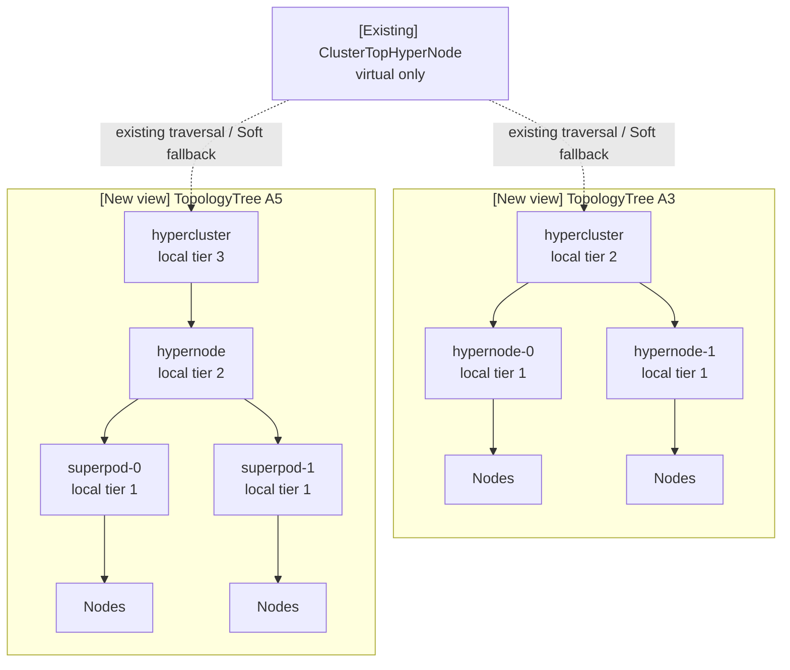

Consequently:

- A3 uses `Tiers = [1, 2]`;
- A5 uses `Tiers = [1, 2, 3]`;
- `hypernode` resolves independently as A3 tier 1 and A5 tier 2;
- A5's additional `superpod` level cannot alter A3 tier-dependent behavior.

#### 7.2.2 New Session structures and their A3/A5 mapping

At Session open, the existing virtual-root and compatibility indexes remain.
The proposal adds one local view per connected real root:

```go
type TopologyTree struct {
    Root       string
    HyperNodes sets.Set[string]
    ByTier     map[int]sets.Set[string]
    Tiers      []int
    RealNodes  sets.Set[string]
}
```

The Session also adds indexes conceptually equivalent to:

```go
TopologyTrees           map[string]*TopologyTree // real root -> local tree
HyperNodeToTopologyTree map[string]string        // HyperNode -> real root
```

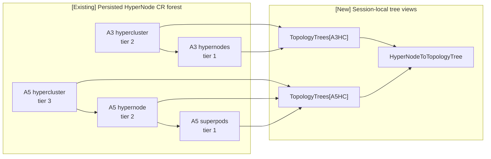

| Field | A3 example | A5 example | New consumer |
| --- | --- | --- | --- |
| `Root` | A3 hypercluster | A5 hypercluster | Deterministic candidate-tree enumeration |
| `HyperNodes` | A3 hypernodes and hypercluster | A5 superpods, hypernodes, and hypercluster | Tree-restricted traversal and ownership checks |
| `ByTier[1]` | A3 hypernodes | A5 superpods | Normal-Pod tree-local fading and tree-view queries |
| `ByTier[2]` | A3 hypercluster | A5 hypernodes | Normal-Pod tree-local fading and tree-view queries |
| `ByTier[3]` | absent | A5 hypercluster | A5 Normal-Pod fading and tree-view queries |
| `Tiers` | `[1, 2]` | `[1, 2, 3]` | Normal-Pod fading order and locality-score normalization |
| `RealNodes` | Nodes below the A3 root | Nodes below the A5 root | Candidate membership and dry-run input |
| reverse index | every A3 HyperNode maps to the A3 root | every A5 HyperNode maps to the A5 root | Tree ownership lookup |

Construction is limited to the new Session view:

```text
1. Reuse the existing ClusterTopHyperNode and its real-root children.
2. For each connected real root:
   a. Traverse that root's descendants.
   b. Collect HyperNodes, local tiers, and real Nodes.
   c. Sort the local tier list.
   d. Store TopologyTrees[root].
   e. Populate HyperNodeToTopologyTree.
3. Keep ClusterTopHyperNode outside every TopologyTree.
```

Production Sessions build these views during Session initialization.
`EnsureTopologyTrees` provides an idempotent lazy-build entry for tests and
other directly constructed Sessions. Existing global tier indexes remain for
compatibility and diagnostics, but hard semantic decisions no longer use the
global tier-name map.

### 7.3 Controller extensions

The existing label discoverer still scans Nodes and produces HyperNode
objects. This proposal changes how a Node selects a topology model, how domains
are identified and named, and how a replacement result is safely published.

#### 7.3.1 Profile parsing and Node assignment

The Profile form adds two inputs to the existing discovery path:

```text
nodeSelector -> which Nodes use this topology model
levels       -> how the selected Nodes form the hierarchy
```

`nodeSelector` uses Kubernetes `LabelSelector` semantics, including
`matchLabels` and the standard `In`, `NotIn`, `Exists`, and `DoesNotExist`
expressions.

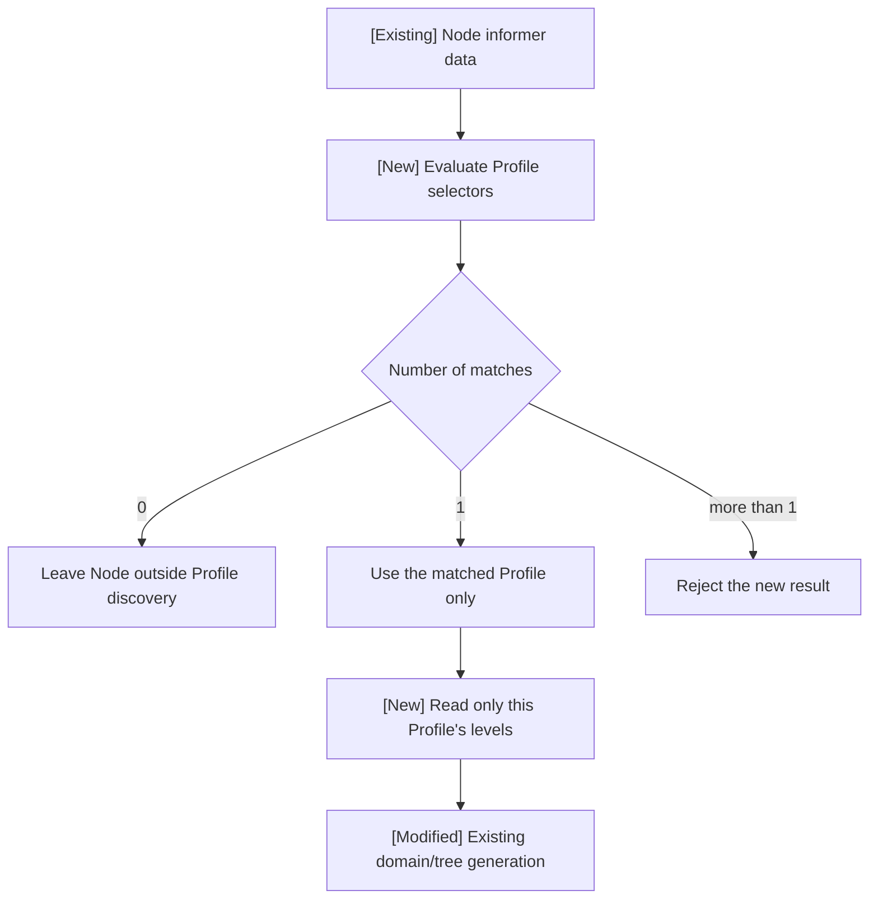

| Match result | New Profile behavior | Compatibility behavior |
| --- | --- | --- |
| No explicit Profile matches | Skip the Node for Profile-based discovery and continue with other Nodes. | Legacy lists retain their existing behavior. |
| Exactly one Profile matches | Interpret the Node only through that Profile's levels. | — |
| Multiple explicit Profiles match | Reject the new result and retain the last valid topology. | Prevents ambiguous cross-model ownership. |

`nodeLabel` remains the physical Kubernetes label read by discovery.
`tierName` is the semantic value written to the HyperNode and later referenced
by the existing workload API.

The discoverer records every label key used by a Profile selector or topology
level in `watchedNodeLabelKeys`. `AddNode`, `UpdateNode`, and `DeleteNode`
enqueue a full discovery when those relevant labels appear, disappear, or
change. Changes to unrelated Node labels do not rebuild the HyperNode graph.

#### 7.3.2 Profile-local domain identity, naming, and validation

For each non-hostname level, the new logical identity is:

```text
domainKey = profile + nodeLabel + labelValue
```

Thus two Profiles may reuse the same physical key/value without merging:

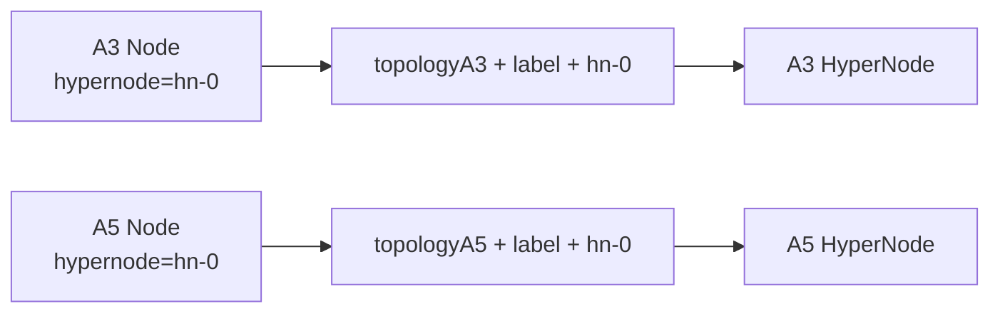

New objects use a deterministic Profile-aware name:

```text
hypernode-<normalized-profile>-tier<tier>-<domain-hash>
```

`domain-hash` is derived from:

```text
profile-name + NUL + nodeLabel + NUL + labelValue
```

The implementation uses the first six SHA-256 bytes, rendered as twelve
hexadecimal characters. The name component uses `cleanString(profile.name)`;
the Profile label value additionally trims leading and trailing `.` and `-`
and is validated as a Kubernetes label value. New objects carry
`volcano.sh/network-topology-profile=<profile-label-value>`.

The existing-object path is retained for compatibility. An existing
label-discovery object with the same physical domain and expected
Profile/tier prefix may be reused, including a matching legacy object without
the Profile label. A deterministic-name collision with a different domain is
rejected.

Node input is sorted before domain construction, and reconciliation later sorts
objects by tier and name before API operations. Object identity does not depend
on discovery iteration order. The current `removeDuplicates` helper does not
sort the resulting member slice, so Core does not claim member-order stability
or an object-level no-op update optimization.

The new Profile parser and domain builder validate:

| Validation | Required result |
| --- | --- |
| Unknown Profile field | Reject configuration before replacement. |
| Fewer than two levels | Require at least one topology level and one hostname leaf. |
| Last level is not `kubernetes.io/hostname` | Reject the Profile. |
| Hostname level has `tierName` | Reject the Profile. |
| Duplicate `nodeLabel` or `tierName` | Reject the Profile. |
| Invalid or colliding normalized Profile name | Reject configuration. |
| Node selected by a Profile with an explicit `nodeSelector` misses a required level | Reject the new result and retain the last valid topology. Selector-less and legacy profiles retain their partial-level compatibility behavior. |
| One child domain has multiple parents | Reject the non-tree graph. |

#### 7.3.3 Safe replacement and publication

The Controller's discovery/reconciliation lifecycle already exists. The Core
change adds the minimum safeguards needed so a failed or stale Profile result
cannot replace a valid mixed topology.

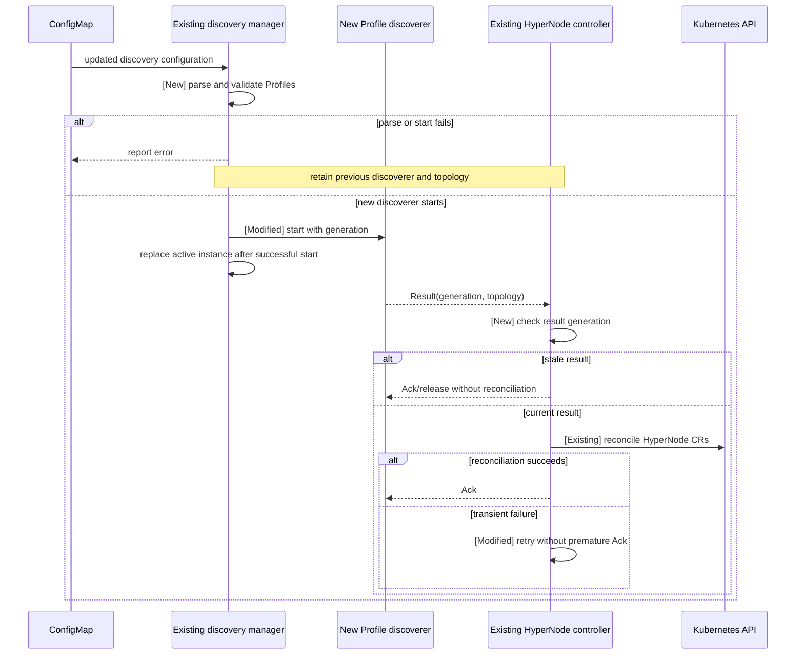

Discoverer replacement is transactional: the manager parses the new
configuration, starts every new discoverer, and swaps the active set only
after all instances start successfully. If any instance fails, the complete
previous set remains active.

Reconciliation remains scoped to the complete result of one discovery
source, not to one Profile at a time. Deterministic profile-local identity
prevents an unchanged sibling tree from being deleted and recreated.
Reconciliation may still issue Update calls; Core does not guarantee member
serialization order or object-level no-op updates.

To reduce incomplete-tree windows for a multi-level A5 topology, object
operations follow dependency order:

```text
Create/Update: lower tier -> higher tier  (children before parents)
Delete:        higher tier -> lower tier  (parents before children)
```

Any API operation failure leaves the result unacknowledged and eligible for
retry.

`UpdateHyperNode` reads the current object directly from the API and uses
`RetryOnConflict`. It updates `Spec`, labels, and annotations through the main
resource endpoint, then writes `Status` through `UpdateStatus`. This avoids
using a stale informer object as the update base and preserves fields not owned
by discovery.

### 7.4 Scheduler constraint and candidate extensions

The existing scheduling pipeline remains:

```text
HyperNode candidates
  -> aggregate capacity filter
  -> whole-group dry-run
  -> Node predicates and scores
  -> statement commit or discard
```

This proposal changes the constraint state and candidate construction supplied
to that pipeline.

#### 7.4.1 Preserving the complete topology constraint

A semantic name cannot be converted to one cluster-global number before the
candidate tree is known:

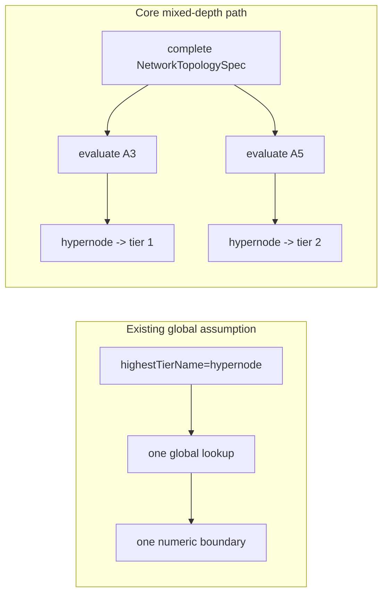

The propagation path is explicit:

| Component | Core change |
| --- | --- |
| `Session.adjustNetworkTopologySpec` | Continues converting Soft constraints to numeric `hard` constraints, but leaves a Hard `highestTierName` intact for tree-local resolution. |
| `JobInfo.HardTopologyConstraint` | Returns the complete hard topology specification rather than only one numeric tier. |
| `SubJobInfo.HardTopologyConstraint` | Applies the same behavior to SubGroups/Partitions. |
| `HyperNodeInfo.TierName()` | Exposes the semantic name required by branch traversal. |
| `validateTopologyConstraint` | Rejects invalid name/number combinations before candidate generation. |
| `hasUniqueTierNameOnAncestorChain` | Rejects a repeated target name on one ancestor chain while allowing the same name in independent trees or branches. |

`JobInfo` and `SubJobInfo` preserve and pass the complete
`NetworkTopologySpec` until real-tree evaluation.

| Hard configuration | Core behavior |
| --- | --- |
| Only `highestTierName` is set | Resolve the name independently in each candidate tree. |
| Only `highestTierAllowed` is set | Interpret the number inside each candidate real tree. |
| Both are set | Treat the constraint as invalid rather than choosing precedence. |
| Neither boundary is set for a `hard` constraint | Treat the constraint as invalid. |
| Requested name is absent from one tree | Exclude only that tree. |
| Requested name is absent from all trees | Keep the workload unschedulable. |
| The requested name occurs twice on one ancestor chain | Reject the ambiguous boundary and keep the workload unschedulable. |
| The same name occurs in independent trees or sibling branches | Resolve each branch independently; this is valid mixed-topology input. |
| Numeric boundary reaches `ClusterTopHyperNode` | Retain the existing cluster-wide path used by converted Soft topology. |

#### 7.4.2 BFS resolution of `highestTierName`

The previous global lookup could convert one semantic name into only one
numeric tier. The mixed-depth implementation instead resolves
`highestTierName` independently inside every candidate `TopologyTree`.

`hyperNodeGradientFn` first calls `getSearchRoot` to intersect the incoming
`hyperNodeAvailable` subtree with the boundary implied by an existing
`AllocatedHyperNode`. The returned HyperNode is the **effective search root**.
When it is `ClusterTopHyperNode`, the hard tree-aware path enumerates connected
real roots in sorted name order and invokes the subtree traversal separately
for each root. Otherwise, traversal starts directly from the effective root,
which may be a real root or a narrower domain inside one tree.

`hyperNodeGradientsForSubtree` introduces the following internal BFS queue
item:

```go
type searchItem struct {
    hyperNode         *api.HyperNodeInfo
    nameBoundaryFound bool
}
```

The initial item's flag is computed by
`hasUniqueTierNameOnAncestorChain(searchRoot, highestTierName)`, so a boundary
already reached above a narrowed search root is preserved. A child then copies
the flag from its parent. If the child has the requested `tierName`, the flag
becomes true; encountering the target again while the inherited flag is
already true is rejected as a duplicate on one ancestor chain:

```text
child.nameBoundaryFound =
    parent.nameBoundaryFound
    OR child.TierName() == requestedHighestTierName
```

This is an internal plugin traversal field, not a workload or HyperNode CRD
field.

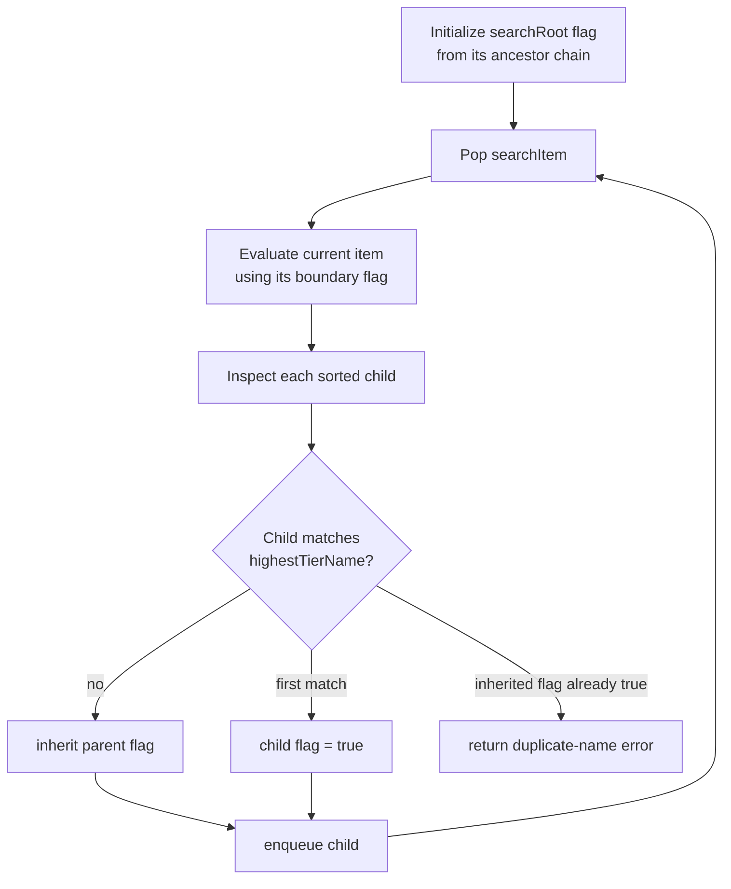

The inherited state means:

- `false`: the branch has not reached the requested semantic boundary;
- `true`: the branch has reached that boundary, so the current HyperNode and
  its descendants may proceed to the remaining candidate checks.

Inheritance does not make descendants unconditionally eligible. Tree and
allocation-range restrictions are encoded by the selected search subtree;
each visited HyperNode is still checked against the numeric/name boundary and
the existing allocation/eviction resource pre-filter.

The state is copied per `searchItem` rather than stored as one
traversal-global boolean. Therefore, matching `highestTierName` on one branch
cannot legalize a sibling branch. If the same `tierName` is encountered again
on the same root-to-leaf path, the boundary is ambiguous and the traversal
fails closed. Reusing the name in different independent branches or trees
remains valid.

For `highestTierName: hypernode`:

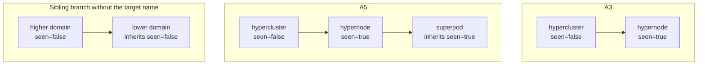

This produces the intended mixed-depth behavior:

| Tree or branch | BFS result |
| --- | --- |
| A3 | The A3 `hypernode` matches the name at local tier 1. |
| A5 | The A5 `hypernode` matches at local tier 2; its `superpod` descendants inherit the matched state. |
| Branch without `hypernode` | The branch never enters the allowed semantic boundary and contributes no semantic hard candidates. |
| Tree with no matching branch | Exclude that tree for this `highestTierName` request. |

#### 7.4.3 Building tree-local hard gradients from BFS results

Gradient generation itself already exists. The Core change is that
`hyperNodeGradientFn` invokes `hyperNodeGradientsForSubtree` separately for
each selected real subtree. The helper stores each eligible object in
`eligibleHyperNodes[current.Tier()]`, sorts the collected numeric tier keys,
sorts HyperNodes by name within each tier, and appends those groups to the
result. Separation comes from invoking the helper once per real subtree, not
from reading `TopologyTree.ByTier` during gradient construction.

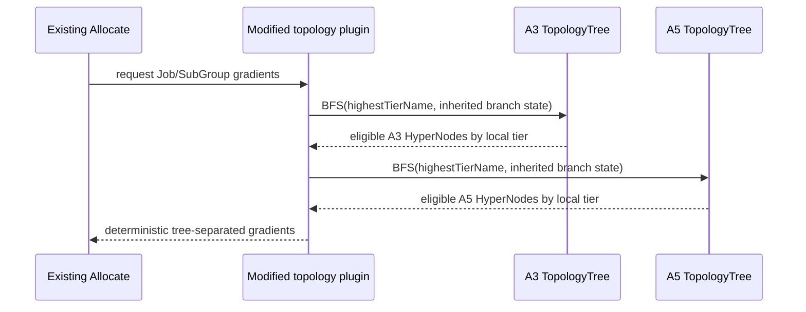

For `highestTierName: hypernode`:

| Tree | Local name match | Emitted candidates | Excluded domain |
| --- | --- | --- | --- |
| A3 | `hypernode -> tier 1` | A3 hypernodes | A3 hypercluster |
| A5 | `hypernode -> tier 2` | A5 superpods, then A5 hypernodes | A5 hypercluster |

The plugin never creates a semantic tier-1 layer containing both A3
hypernodes and A5 superpods. `TopologyTrees` supplies deterministic real-root
enumeration; subtree BFS and the sorted keys of `eligibleHyperNodes` supply
the actual Hard gradient ordering. `TopologyTree.Tiers` and `ByTier` are used
directly by other tree-local consumers such as Normal-Pod fading.

#### 7.4.4 Existing `soft` path and virtual-root compatibility

`soft` mode is not replaced with a new tree planner. It continues to use the
existing numeric conversion and virtual-root path.

At Session initialization, `adjustNetworkTopologySpec` applies these concrete
rules:

```text
clusterMaxTier = ClusterTopHyperNode.Tier()

if Job topology is Soft:
    Job mode = Hard
    Job highestTierAllowed = clusterMaxTier
    Job highestTierName = ""

subJobMaxTier = Job highestTierAllowed when it exists,
                otherwise clusterMaxTier

for each Soft SubGroup:
    SubGroup mode = Hard
    SubGroup highestTierAllowed = subJobMaxTier
    SubGroup highestTierName = ""
```

A user-supplied Hard `highestTierName` is not converted or cleared. A Soft
SubGroup under a semantic Hard Job receives the cluster numeric maximum during
conversion, while the outer Job candidate subtree still caps its effective
search range.

When the resulting effective root is `ClusterTopHyperNode` and the numeric
boundary reaches its tier, `hyperNodeGradientFn` deliberately calls
`hyperNodeGradientsForSubtree` once on the virtual-root subtree. This is the
existing cluster-wide numeric grouping path, retained specifically for Soft
compatibility.

The mixed-depth compatibility requirements are:

- equal numeric tiers in different trees still contain separate HyperNode
  candidates;
- candidates retain the existing numeric ordering;
- `ClusterTopHyperNode` remains the final candidate; and
- only the virtual root exposes cross-tree `RealNodes`.

| Capacity result | Existing Soft outcome preserved |
| --- | --- |
| One real HyperNode can satisfy the gang | Select that real domain. |
| No real domain can satisfy it, but cluster-wide capacity can | Use `ClusterTopHyperNode`. |
| Cluster-wide capacity is insufficient | Keep the gang unbound. |

This section specifies compatibility with mixed-depth trees; it does not
introduce a new Soft scheduling algorithm.

#### 7.4.5 Job/SubGroup boundary intersection

Job/SubGroup range composition already exists. For each gradient invocation,
the incoming `hyperNodeAvailable` already represents the outer range selected
by the caller. `getSearchRoot` compares that incoming subtree with the highest
allowed ancestor derived from a non-empty `AllocatedHyperNode`. Job and
SubGroup invocations therefore narrow the effective range progressively rather
than one helper call independently rebuilding every level of the hierarchy.

| Relationship | Effective range |
| --- | --- |
| A contains B | B |
| B contains A | A |
| A equals B | A |
| A and B are siblings | Empty |
| A and B belong to different real trees | Empty for hard placement |
| Outer hard range and inner Soft range | Soft expansion is capped by the outer hard range |

Conflicting sibling ranges must not be replaced by their lowest common
ancestor, because that would widen both constraints. If neither root contains
the other, `getSearchRoot` returns an error and the candidate path is
discarded.

### 7.5 Tree-local lookup and scoring

The scoring formulas and plugin hooks already exist. This proposal replaces
their cluster-global tier inputs with tree-local ownership and depth where
mixed-depth semantics require it. Existing HyperNode binpack ordering is not
redesigned.

#### 7.5.1 Tree-local Node-to-leaf lookup

The modified lookup is:

```text
Node
  -> resolve the unique TopologyTree containing it
  -> iterate that tree's local tiers from lowest to highest
  -> return the lowest containing HyperNode
```

| Node | Resolved tree | Result |
| --- | --- | --- |
| A3 Node | A3 `TopologyTree` | A3 `hypernode` at local tier 1 |
| A5 Node | A5 `TopologyTree` | A5 `superpod` at local tier 1 |
| Node outside all real trees | none | Preserve existing non-topology behavior |
| Node present in multiple real trees | ambiguous | Return no tree-local association |

For the malformed ambiguous case, the normal-Pod path retains its legacy
global fallback. Explicit Profile discovery prevents this state for generated
topologies.

The older package-level Node lookup remains only for compatibility. Production
allocation paths use the Session tree-local entry so lookup and the current
Session snapshot cannot disagree.

#### 7.5.2 Updating `AllocatedHyperNode` after allocation

The tree-local lookup is connected to the existing Allocate action through
`getNewAllocatedHyperNode`. After a Task obtains a concrete Node, Allocate
calls `Session.FindHyperNodeForNode`. If no allocation domain exists yet, the
tree-local leaf becomes the initial value; otherwise the helper returns the
LCA of the existing allocation domain and the new leaf:

```text
selected Node
  -> Session.FindHyperNodeForNode
  -> tree-local leaf HyperNode
  -> existing AllocatedHyperNode is empty ? leaf : LCA(existing, leaf)
  -> updated SubGroup/Job allocation range
  -> boundary for later Tasks
```

Without this hook, initial candidate generation could be tree-local while later
Tasks still recovered state through the old global minimum-tier lookup.

#### 7.5.3 Network-aware locality

The existing locality score compares a candidate leaf with the
`AllocatedHyperNode`. The implementation does not contain a separate
same-tree branch. It computes their LCA first, then uses the real tree that
owns the allocated domain to define the local score range:

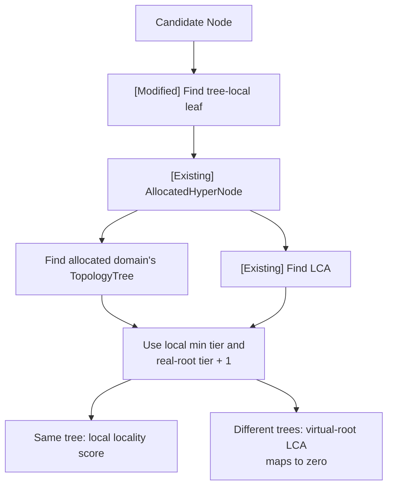

Conceptually:

```text
locality =
    (localTopTier - lcaTier)
    / (localTopTier - localMinTier)
```

For same-tree candidates this produces the local locality fractions below. For
cross-tree candidates, the LCA is `ClusterTopHyperNode`; its tier is at or
outside the allocated tree's local upper boundary, so
`scoreHyperNodeWithTierRange` returns zero. Cross-tree rejection is therefore a
result of the LCA and local range calculation, not an explicit ownership
comparison in `networkTopologyAwareScore`.

| Tree | Candidate relation | Result |
| --- | --- | --- |
| A3 | Different hypernodes under one hypercluster | `(3-2)/(3-1) = 0.5` |
| A5 | Different superpods under one hypernode | `(4-2)/(4-1) = 2/3` |
| A5 | Different hypernodes under one hypercluster | `(4-3)/(4-1) = 1/3` |
| Candidate and allocation in different real trees | No physical real-tree LCA | `0` |

The A3 and A5 values are local rankings, not a cross-hardware preference.

#### 7.5.4 Normal-Pod HyperNode fading

The existing fading formula remains. The changed input set is:

```text
candidate Node's local real tiers
+ existing ClusterTopHyperNode term
```

Conceptually:

```text
normalPodScore(node) =
    (
        sum(localTierWeight(t) * binpackScore(domain(node, t)))
        + rootWeight * binpackScore(ClusterTopHyperNode)
    )
    / (sum(localTierWeight(t)) + rootWeight)
```

For A3, the real contribution contains `hypernode` and `hypercluster`. For A5,
it contains `superpod`, `hypernode`, and `hypercluster`. The A5-only
`superpod` level is never inserted into A3's contribution or denominator.

### 7.6 Recovery adaptation

Volcano reconstructs allocation state from bound Pods by intersecting the
HyperNodes whose `RealNodesSet` contains each bound Node. Core retains that
mechanism; recovery itself does not resolve a semantic `tierName`.

The concrete sequence is:

1. collect each SubGroup Task in an allocated status;
2. for every bound Node, retain only HyperNodes whose `RealNodesSet` contains
   that Node, producing the membership intersection across Tasks;
3. `getLowestTierHyperNode` chooses the lowest numeric-tier HyperNode from the
   common set as the recovered SubGroup `AllocatedHyperNode`;
4. recover the Job `AllocatedHyperNode` as the LCA of all recovered SubGroup
   domains;
5. on a later scheduling request, `getHighestAllowedHyperNode` walks the
   recovered domain's ancestor chain and resolves the unique
   `highestTierName`, or the numeric `highestTierAllowed`;
6. `getSearchRoot` intersects that recovered boundary with the incoming
   available subtree;
7. a Soft allocation already spanning real trees may recover to the existing
   `ClusterTopHyperNode`.

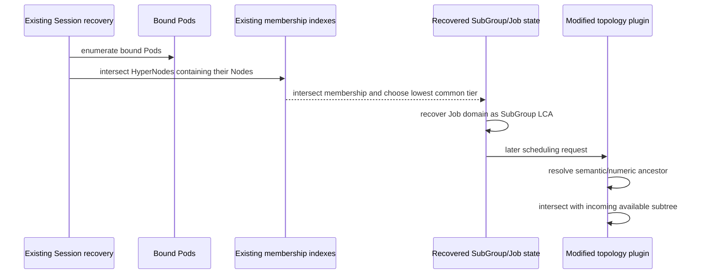

Recovery itself does not introduce a new ambiguity detector for malformed
manually created graphs. Explicit Profile discovery prevents overlapping
real-tree ownership in generated topologies, while tree-local lookup fails
closed when such ambiguity is encountered. The lowest-tier selection is valid
for discovery-generated trees because the common membership set lies on one
real ancestor chain, apart from the virtual-root result of a cross-tree Soft
allocation.

### 7.7 End-to-end integration sequence

The sequence below distinguishes the Core additions from the unchanged
Volcano scheduling path:

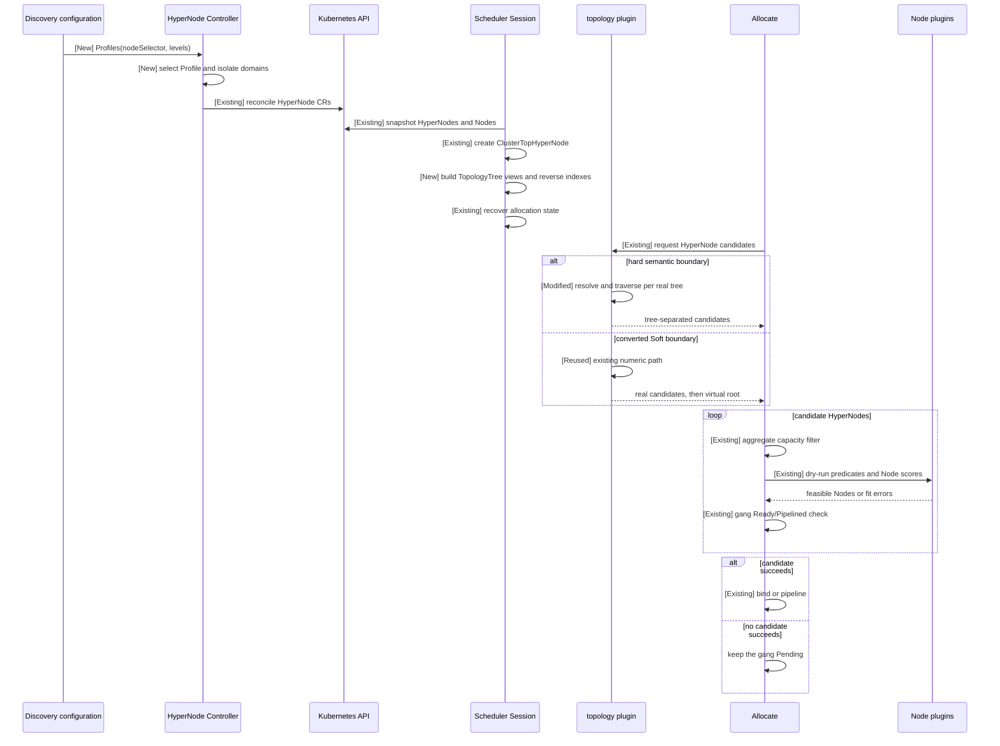

## 8. Compatibility

### 8.1 Discovery configuration

- Existing legacy topology lists remain accepted.
- The profile form is optional.
- A single profile may produce one or more connected real-tree views.
- A connected single-topology cluster preserves the existing single-tree behavior.
- Legacy implicit tier-name behavior remains available.

### 8.2 Workload and CRD compatibility

- No new Job, PodGroup, SubGroup, or HyperNode field is introduced.
- `highestTierAllowed` remains accepted.
- Mixed clusters should prefer `highestTierName` because numeric tiers are tree-local.

### 8.3 Scheduler compatibility state

Existing global tier indexes remain for legacy code, membership-based recovery,
and virtual-root compatibility. `hard` semantic resolution, Node lookup, and score
normalization use `TopologyTree` accessors instead of comparing unrelated global
tier collections. Restart recovery intersects HyperNode membership from the same
Session snapshot and does not compare tiers across unrelated trees.

`ClusterTopHyperNode` remains available for:

- existing Session traversal;
- soft cross-tree fallback;
- single-topology compatibility; and
- recovery of cross-tree soft placement.

### 8.4 Upgrade and rollback

Because the CRDs are unchanged, the recommended rollout is:

1. upgrade the Scheduler first so it can consume both legacy single-tree
   objects and later mixed Profile objects;
2. upgrade the Controller while retaining the legacy discovery configuration;
3. add A3/A5 Profile labels and enable the Profile form;
4. wait for the HyperNode forest to converge before submitting Jobs that rely
   on mixed `highestTierName` semantics.

An old Scheduler must not operate on an enabled mixed-Profile forest when
Jobs depend on semantic tier names, because it may reintroduce global
`tierName -> tier` conversion. Before rollback, stop such Jobs and restore a
single-tree or legacy discovery configuration.

## 9. Failure Semantics

| Condition | Required behavior |
| --- | --- |
| One branch does not reach `highestTierName` | Exclude only that branch; a match on another branch must not leak through shared traversal state. |
| One ancestor chain contains the requested `tierName` more than once | Reject the ambiguous boundary and fail closed. |
| Independent branches or trees reuse the same `tierName` | Allow it; each branch is resolved independently. |
| One candidate tree has no matching branch for `highestTierName` | Exclude that tree and continue. |
| Every candidate tree lacks `highestTierName` | Keep the workload unschedulable. |
| Both `highestTierName` and `highestTierAllowed` are set | Reject the invalid hard constraint. |
| Hard workload under a real-tree boundary cannot fit one complete tree/domain | Keep the whole gang Pending; do not combine tree capacity. |
| Soft workload cannot fit one tree but fits cluster-wide | Use virtual-root fallback. |
| Soft workload cannot fit cluster-wide | Keep all Pods unbound. |
| Job and SubGroup ranges are sibling subtrees | Return no intersection; do not widen to the LCA. |
| One Node matches multiple explicit profiles | Reject the ambiguous profile result. |
| Profile configuration is invalid | Do not replace the last valid topology with partial output. |
| A stale discovery result arrives | Ignore it; do not overwrite current topology. |
| Reconciliation fails transiently | Retry and do not acknowledge success prematurely. |
| A Node has ambiguous real-tree ownership | Tree-local lookup returns no association; Normal-Pod fading uses its legacy global fallback for this malformed case. Explicit Profile discovery rejects overlapping assignments before publication. |

## 10. Risks and Mitigations

| Risk | Mitigation |
| --- | --- |
| Global and tree-local indexes diverge | Use `TopologyTree` and reverse-index helpers for hard semantic resolution, lookup, and scoring; use the same Session snapshot for membership-based recovery and cover the invariants with Session and plugin tests. |
| Overlapping profile selectors assign one Node to multiple models | Reject ambiguous explicit-profile matches and retain the last valid topology. |
| Equal labels from different profiles merge objects | Include profile context in domain identity, generated names, and metadata. |
| One malformed profile corrupts unrelated trees | Reject the complete replacement before publication and retain the last valid all-Profile topology. |
| A semantic tier exists in only some trees | Exclude only trees that cannot resolve the requested name; fail the workload only when no candidate tree remains. |
| A `highestTierName` match leaks from one branch to a sibling branch | Store the matched-boundary flag in each BFS queue item and copy it only from parent to child. |
| Virtual root is selected before an adequate real tree | Make real-domain-before-virtual-root ordering part of the soft scheduling behavior and validation plan. |
| A5's extra tier changes A3 scores | Normalize locality with the owning `TopologyTree.Tiers`; for Normal Pods, use those local real tiers plus the common virtual-root term. |
| Cross-tree candidates receive false locality through the virtual root | Return no physical locality score when candidate and allocated domains belong to different real trees. |
| Scheduler restart loses the selected hard boundary | Reconstruct `AllocatedHyperNode` from bound-Pod membership, then resolve the semantic ancestor during later gradient generation. |
| Tree construction adds scheduling overhead | Build the views and reverse indexes once per Session snapshot, then use indexed ownership lookups in candidate and scoring paths. |
| Deterministic root ordering becomes an unintended hardware preference | Keep it as a stable default only; do not compare local tier numbers across trees, and leave explicit preference to a future API or policy. |

## 11. Alternatives Considered

| Alternative | Decision |
| --- | --- |
| Use different semantic names for each hardware model | Rejected. It exposes accelerator generations to workloads and does not fix numeric grouping, scoring, or recovery. |
| Add dummy levels to shallower trees | Rejected. Dummy tiers would represent performance domains that do not exist. |
| Renumber every tree into one global hierarchy | Rejected. Adding or changing one tree could change another tree's numeric semantics. |
| Use the Profile name as the Scheduler tree ID | Rejected. One Profile may produce multiple disconnected real roots. |
| Persist a shared-root HyperNode | Rejected. The existing in-memory `ClusterTopHyperNode` already provides traversal and Soft fallback. |
| Add `SelectedTreeID` or a separate Soft planner | Not adopted. Existing allocation state recovers hard placement, and the virtual root represents cross-tree Soft placement. |
| Flatten all tree gradients into one numeric sequence | Rejected. Local tier numbers from unrelated trees are not semantically comparable. |

## 12. Code Map

| Layer | Main path / symbol | Core change | Change type |
| --- | --- | --- | --- |
| Discovery configuration | `pkg/controllers/hypernode/api/types.go` | Add the Profile form while retaining the legacy list. | New extension |
| Profile parsing and Node assignment | `pkg/controllers/hypernode/discovery/label/label.go` | Compile selectors, watch relevant Node label changes, validate Profile levels, and select one Profile per Node. | New |
| Domain generation | `pkg/controllers/hypernode/discovery/label/` | Use profile-local identity, deterministic naming, Profile labels, limited legacy reuse, and collision checks. | New/modified |
| Discovery replacement | `pkg/controllers/hypernode/discovery/manager.go` | Replace the active discoverer only after successful startup and reject stale generations. | Modified |
| HyperNode reconciliation | `pkg/controllers/hypernode/hypernode_controller.go`, `pkg/controllers/hypernode/utils/utils.go` | Reconcile a complete source result in child-before-parent create/update and parent-before-child delete order; use conflict-safe API updates and acknowledge only successful current results. | Modified integration |
| Session topology | `pkg/scheduler/framework/session.go` | Add `TopologyTree`, `buildTopologyTrees`, `EnsureTopologyTrees`, `TopologyTrees`, and `HyperNodeToTopologyTree`. | New |
| HyperNode access | `pkg/scheduler/api/hyper_node_info.go` | Reuse existing HyperNode data through tree-local accessors. | Modified access |
| Constraint state | `pkg/scheduler/framework/session.go`, `pkg/scheduler/api/job_info.go`, `pkg/scheduler/api/sub_job_info.go`, `pkg/scheduler/api/hyper_node_info.go` | `adjustNetworkTopologySpec` retains hard names; `HardTopologyConstraint` propagates the complete spec; `TierName()` exposes branch semantics. | Modified |
| Semantic-name BFS | `pkg/scheduler/plugins/network-topology-aware/network_topology_aware.go` | `searchItem.nameBoundaryFound` carries parent-to-child path state; `validateTopologyConstraint` and `hasUniqueTierNameOnAncestorChain` reject invalid or ambiguous constraints. The effective search root may be a narrowed real subtree. | New/modified |
| Hard gradients | same plugin | Invoke the subtree helper once per selected real root, group eligible objects by `HyperNodeInfo.Tier()`, sort tier keys and names, and append tree-separated gradients. | Modified |
| Soft gradients | same plugin | Retain the existing numeric virtual-root path and ensure real domains remain independent candidates. | Reused with compatibility fixes |
| Boundary composition and continuation | topology plugin `getHighestAllowedHyperNode` and `getSearchRoot` | Resolve the recovered semantic or numeric ancestor, then intersect it with the current incoming subtree without widening siblings. Job/SubGroup callers progressively narrow the incoming root. | Modified |
| Network-aware locality | topology plugin Node scoring path | Find the LCA, use the allocated domain's tree-local score range, and obtain zero for a cross-tree virtual-root LCA. | Modified inputs |
| Normal-Pod fading | topology plugin normal-Pod path | Iterate local real tiers and retain the existing virtual-root term. | Modified inputs |
| Node-to-leaf lookup | `Session.FindHyperNodeForNode` | Resolve a Node's real tree before selecting its lowest local-tier HyperNode. | Modified |
| Allocate pipeline | `pkg/scheduler/actions/allocate/allocate.go` | Reuse capacity filtering, gang dry-run, predicates, scoring, and commit; `getNewAllocatedHyperNode` now uses the Session tree-local Node lookup and computes LCA with an existing allocation domain. | Reused with modified state hook |
| Recovery | Session/allocate recovery path | Reuse membership intersection and resolve later semantic boundaries in the recovered real tree. | Reused with adaptation |
| Core validation | `test/e2e/hypernode/` and related unit tests | Cover Profile isolation, unequal depths, hard semantics, `soft` compatibility, scoring, lookup, and recovery. | New coverage |
| User guide | `docs/user-guide/how_to_use_hypernode_auto_discovery.md` | Document Profile configuration and compatibility. | Updated documentation |

## 13. Validation Plan

The validation plan defines required behavior rather than results from a
particular branch, commit, or test run.

### 13.1 Discovery

| Scenario | Required behavior |
| --- | --- |
| A3 and A5 have different depths | Generate independent complete trees. |
| Profiles reuse the same label key/value | Generate separate domains and HyperNodes. |
| A Node matches multiple explicit profiles | Reject the ambiguous profile result. |
| A Node matches no explicit profile | Leave the Node outside profile-based auto-discovered topology and continue discovery. |
| A watched selector or topology label changes | Enqueue a full discovery result; unrelated Node label changes do not trigger discovery. |
| Profile fields or levels are invalid | Preserve the last valid topology. |
| A replacement discoverer cannot start | Keep the previous valid discovery state. |
| A stale result arrives | Do not reconcile it into the current topology. |
| One new discoverer fails during a multi-discoverer replacement | Keep the entire previous active set; do not partially swap configurations. |
| A three-level A5 tree is created or deleted | Create/update children before parents and delete parents before children. |
| One profile changes | Do not delete and recreate the unrelated tree; preserve its object names, UIDs, logical tier data, and member sets without requiring serialized member-order stability. |
| All Nodes leave one profile and later return | Delete and recreate only that profile's tree; preserve the unrelated tree's names, UIDs, logical tier data, and member sets. |
| Legacy list configuration | Preserve existing behavior. |

### 13.2 Hard scheduling

| Scenario | Required behavior |
| --- | --- |
| Only A3 is feasible | Place the complete Job/SubGroup in A3. |
| Only A5 is feasible | Place the complete Job/SubGroup in A5. |
| Both are feasible | Select one real tree using deterministic candidate order. |
| Neither is feasible | Keep the whole gang Pending. |
| A tier name exists in only one tree | Exclude only trees that lack the name. |
| A tier name exists on only one branch of a tree | Emit candidates only from the matched branch. |
| A child is below a matched semantic boundary | Inherit the parent's `nameBoundaryFound` state and remain eligible for later checks. |
| A sibling branch never matches the name | Keep its inherited state false and exclude it. |
| The same name appears twice on one ancestor chain | Reject the ambiguity through `hasUniqueTierNameOnAncestorChain`. |
| The same name appears in separate trees or sibling branches | Allow independent matches. |
| A3 and A5 match the same name at different depths | Resolve A3 and A5 independently through BFS and build local gradients without padding either tree. |
| Name and numeric hard boundaries are both configured | Reject through topology-constraint validation. |
| Job/SubGroup hard ranges are nested | Permit narrowing, not widening. |
| The workload is partially running | Continue inside the recovered tree and boundary. |
| Scheduler restarts | Recover the same hard domain from bound Pods. |
| Numeric boundary reaches `ClusterTopHyperNode` | Retain the existing cluster-wide compatibility behavior used by converted Soft topology. |

### 13.3 Soft scheduling

| Scenario | Required behavior |
| --- | --- |
| Job-level Soft conversion | Convert to Hard with `highestTierAllowed = ClusterTopHyperNode.Tier()` and clear `highestTierName`. |
| Soft SubGroup under a numeric Hard Job | Convert the SubGroup to the Job's numeric boundary. |
| Soft SubGroup under a semantic Hard Job | Convert using the cluster numeric maximum, then keep the SubGroup inside the Job-selected subtree during candidate composition. |
| One real tree can satisfy the workload | Keep placement in one tree. |
| No tree can satisfy it alone, but the cluster can | Use `ClusterTopHyperNode` fallback. |
| Cluster-wide capacity is insufficient | Keep the whole gang unbound. |
| Job is hard and SubGroup is soft | Keep the SubGroup inside the Job hard range. |
| Job is soft and SubGroup is hard | Permit Job-level tree choice, but require each hard SubGroup to fit entirely inside one legal real-tree domain. |
| Job and SubGroup are both soft | Use virtual-root fallback only when the effective outer range permits it. |
| One soft SubGroup exceeds every tree | Use virtual-root fallback only when the outer range permits it. |

### 13.4 Scoring, lookup, and recovery

| Scenario | Required behavior |
| --- | --- |
| A3 locality score | Normalize with A3 depth only. |
| A5 locality score | Normalize with A5 depth only. |
| Candidate belongs to another tree | Do not assign false locality. |
| Normal Pod fading | Use the candidate Node's tree-local real levels plus the common virtual-root term. |
| Node-to-leaf lookup | Return the lowest local-tier HyperNode in that Node's tree. |
| Allocation-time state update | Verify `getNewAllocatedHyperNode` returns the tree-local leaf for the first Node and the LCA of that leaf with an existing allocation domain for later Nodes. |
| Directly constructed test Session | `EnsureTopologyTrees` builds the same tree views lazily and idempotently. |
| Pod replacement after restart | Preserve the hard SubGroup domain. |
| Recovered ancestor chain has no or duplicate semantic match | Fail closed rather than widening or changing trees. |

### 13.5 Compatibility

| Scenario | Required behavior |
| --- | --- |
| Legacy discovery list | Continue to parse and schedule as before. |
| Numeric `highestTierAllowed` | Continue to accept it; evaluate real-tier values per candidate tree and retain the virtual-root compatibility boundary. |
| Single real tree | Preserve existing single-topology behavior. |
| Node outside every real tree | Preserve existing non-topology behavior. |
| Existing CRD objects | Remain valid without schema migration. |

## 14. Open Questions

### 14.1 Hard candidate ordering

For this delivery, feasible real roots are evaluated in deterministic name
order. Maintainers should confirm whether this stable default is sufficient
or whether a future preference policy is required.

This proposal does not compare local tier numbers across trees and does not introduce device preference.

## 15. Future Considerations

| Topic | Notes |
| --- | --- |
| Mixed GangPreempt/GangReclaim | Extend the Core tree-local `PurposeEvict` gradients with complete cross-tree victim continuation and dedicated GangPreempt/GangReclaim E2E coverage. |
| Eviction candidate fairness | Define global cap, per-tree budget, or round-robin policy. |
| Controller reliability framework | Broader lifecycle, queue, retry, and fault-injection improvements beyond the minimal publication boundary. |
| Profile lifecycle | Define Profile key identity, rename, disable, and deletion behavior. |
| Fallback profile | Optionally define an explicit fallback for Nodes that match no configured profile selector. |
| Legacy object migration | Define broader migration and ownership rules beyond Core's limited reuse of matching existing label-discovery objects. |
| Discovery ownership | Define manual-object and multi-source ownership rules. |
| Explicit tree preference | Optional user or scheduler policy for accelerator/fabric preference. |
| Observability | Events, metrics, or status for selected real tree and topology-unsatisfiable conditions. |
| Scale validation | Large numbers of profiles, roots, and HyperNodes. |
| Additional discovery sources | Apply the same connected-root identity model beyond label discovery. |

## References

- [Issue #5732 — Support heterogeneous HyperNode topology hierarchies for different accelerator models in one cluster](https://github.com/volcano-sh/volcano/issues/5732)
- [Network Topology Aware Scheduling](https://github.com/volcano-sh/volcano/blob/master/docs/design/Network%20Topology%20Aware%20Scheduling.md)
- [HyperNode Auto Discovery user guide](https://github.com/volcano-sh/volcano/blob/master/docs/user-guide/how_to_use_hypernode_auto_discovery.md)
- [Preempt Action Support Topology](https://github.com/volcano-sh/volcano/blob/master/docs/design/preempt-action-support-topology.md)
