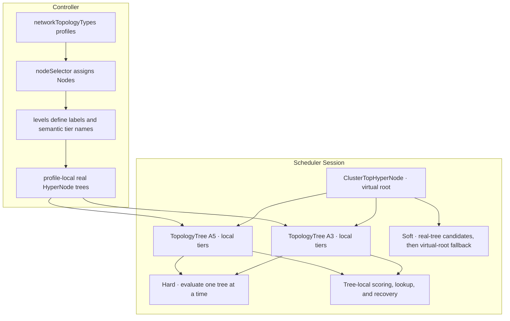
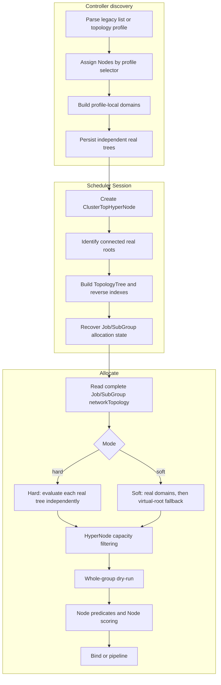

# Mixed-Depth HyperNode Topology Design

Author: siqiaawa · 2026-07-27

Related Issue: [volcano-sh/volcano#5732](https://github.com/volcano-sh/volcano/issues/5732)

---

## 1. Summary

Volcano represents network performance domains with HyperNode trees and schedules a Job or SubGroup through existing **`networkTopology`** constraints. The current implementation largely assumes that all HyperNode trees in one Kubernetes cluster share one global hierarchy of numeric tiers and tier names. That assumption is invalid when different accelerator models expose different network depths in the same cluster.

A representative mixed cluster may contain:

```text
A3: node -> hypernode -> hypercluster
A5: node -> superpod -> hypernode -> hypercluster
```

The semantic level `hypernode` is local tier 1 in A3 and local tier 2 in A5. A cluster-global `tierName -> tier` map or `tier -> HyperNode set` cannot represent both trees correctly.

This design adds core support for **multiple independent HyperNode trees with different depths and tree-local tier semantics in one cluster**. The design:

- extends label discovery with topology profiles based on `nodeSelector` and `levels`;
- isolates discovered domains by profile, physical label key, and label value;
- creates one Scheduler `TopologyTree` view for each connected real HyperNode root;
- resolves `highestTierName` and numeric tiers inside each candidate tree;
- evaluates hard placement independently per tree and never combines unrelated tree capacity;
- keeps soft placement inside one real tree when possible and uses the existing virtual `ClusterTopHyperNode` only as the final cross-tree fallback;
- applies the same tree-local model to Job/SubGroup boundaries, scoring, Node lookup, and allocation recovery.

The design does **not** add Job, PodGroup, SubGroup, or HyperNode CRD fields. Existing single-topology configurations, legacy label discovery, numeric `highestTierAllowed`, and the existing soft virtual-root mechanism remain compatible.

## 2. Motivation

[Network Topology Aware Scheduling](https://github.com/volcano-sh/volcano/blob/master/docs/design/Network%20Topology%20Aware%20Scheduling.md) schedules Jobs and SubGroups inside eligible HyperNode subtrees. This works when a cluster has one globally consistent hierarchy. Heterogeneous accelerator clusters can contain several device generations or network fabrics whose hierarchy depths differ while exposing the same workload-facing semantic levels.

For example:

```text
A3 tree

node
  -> hypernode        local tier 1
  -> hypercluster     local tier 2

A5 tree

node
  -> superpod         local tier 1
  -> hypernode        local tier 2
  -> hypercluster     local tier 3
```

A workload should still be able to declare:

```yaml
spec:
  networkTopology:
    mode: hard
    highestTierName: volcano.sh/hypercluster
```

without knowing whether the selected accelerator model maps `hypercluster` to tier 2 or tier 3.

### 2.1 Existing global assumptions

The previous discovery and scheduling paths contain several cluster-global assumptions:

```text
global tierName -> tier
global tier -> HyperNode set
one cluster-wide numeric tier coordinate system
domain identity derived mainly from label key/value
```

These assumptions cause several correctness problems.

#### Global tier-name resolution cannot represent mixed depths

The same `tierName` may map to different numeric tiers in different trees. Converting a semantic constraint to one cluster-global number can widen or narrow the legal boundary incorrectly.

#### Equal numeric tiers do not imply equal semantics

A3 tier 1 may mean `hypernode`, while A5 tier 1 means `superpod`. Grouping both into one gradient combines unrelated network domains.

#### A deeper tree can bias another tree

Cluster-global minimum and maximum tiers can cause the additional A5 level to change A3 locality scores, normal-Pod fading weights, or Node-to-HyperNode lookup.

#### Label discovery can merge unrelated domains

Different topology models may reuse the same label keys and values. A domain key based only on `nodeLabel + value` can merge A3 and A5 domains into the same HyperNode.

#### Hard placement can combine unrelated capacity

A hard Job or SubGroup must fit in one legal domain of one real tree. Combining partial capacity from A3 and A5 creates a false hard solution.

#### Partial allocation must preserve the selected tree

Initial placement is insufficient if later scheduling, Pod replacement, or Scheduler restart can move a hard workload into a sibling tree.

The design therefore distinguishes:

- a **topology profile**, which describes a topology model;
- a **connected real HyperNode tree**, which is the Scheduler tree identity; and
- a **local tier**, whose numeric meaning is restricted to that tree.

## 3. Scope

This delivery changes:

- label-based HyperNode discovery for mixed topology profiles;
- Scheduler construction of connected-root, tree-local topology views;
- hard and soft Job/SubGroup placement in mixed-depth trees;
- tree-local scoring, Node-to-HyperNode lookup, and allocation recovery;
- compatibility behavior directly required by mixed-depth scheduling.

The explicitly deferred behavior is listed in the following Non-Goals section.

## 4. Goals

1. **Mixed-depth discovery:** construct multiple independent HyperNode trees with different depths in one cluster.
2. **Profile-local isolation:** assign Nodes through Kubernetes `LabelSelector` profiles and prevent overlapping label values from merging different topology models.
3. **Tree-local tier semantics:** interpret tier numbers, tier names, parent-child relationships, and candidate groups inside one connected real tree.
4. **Semantic tier-name resolution:** allow the same `highestTierName` to resolve to different numeric tiers in different trees.
5. **Hard single-tree placement:** require a hard Job or SubGroup to fit entirely inside one legal real-tree domain.
6. **Soft virtual-root fallback:** prefer one real tree and allow cross-tree placement only through the existing virtual root when no real tree is individually sufficient.
7. **Job/SubGroup consistency:** allow inner constraints to narrow but not widen an outer hard boundary.
8. **Recovery consistency:** preserve the selected tree and semantic boundary for partially running workloads, Pod replacement, and Scheduler restart.
9. **Tree-local scoring and lookup:** prevent unrelated tree depth from affecting locality scores, normal-Pod fading, or Node-to-leaf resolution.
10. **Backward compatibility:** preserve legacy discovery, single-tree behavior, numeric constraints, and existing CRD schemas.

## 5. Non-Goals

| Item | Decision |
| --- | --- |
| Persist a shared root HyperNode CR | Not included. `ClusterTopHyperNode` remains Scheduler-only state. |
| Add `SelectedTreeID` or another workload field | Not included. Recovery uses existing allocation state and bound Pods. |
| Add dummy tiers to shallow trees | Rejected because they represent network domains that do not exist. |
| Renumber every tree into one global hierarchy | Rejected because one tree must not change another tree's numeric semantics. |
| Require hardware-specific tier names | Rejected. A3 and A5 may share semantic names such as `hypernode` and `hypercluster`. |
| Treat a profile as a physical tree ID | Rejected. One profile may produce several disconnected real roots. |
| Add a separate soft tree planner or combination API | Not included. Soft mode reuses the virtual-root path. |
| Define complete preempt/reclaim mixed-tree behavior | Deferred to a follow-up. |
| Define Profile lifecycle and discovery ownership | Deferred until the ownership semantics are agreed. |
| Define explicit device/tree preference | Deferred. The core implementation uses deterministic candidate ordering. |

## 6. Proposal

### 6.1 Capability model

The Controller and Scheduler use different identities.

**Controller model**

- A topology **profile** contains a Node selector and ordered topology levels.
- A Node is interpreted only with the levels of its selected profile.
- Domain identity includes profile context, so equal physical labels in different profiles remain independent.
- The Controller persists only real HyperNode objects and parent-child relationships.

**Scheduler model**

- `ClusterTopHyperNode` remains the virtual common root.
- Each connected real root below the virtual root defines one `TopologyTree`.
- A `TopologyTree` owns its local HyperNodes, tiers, and real Nodes.
- Hard constraints are evaluated independently inside each candidate tree.
- Soft placement evaluates real domains before the virtual root.
- Scoring, lookup, boundary intersection, and recovery use the same tree identity.



### 6.2 Discovery configuration

The label discoverer continues to use `networkTopologyTypes`. Each value may use the existing legacy list or the profile form.

#### Profile form

```yaml
networkTopologyDiscovery:
- source: label
  enabled: true
  config:
    networkTopologyTypes:
      topologyA3:
        nodeSelector:
          matchLabels:
            accelerator.example.com/model: a3
        levels:
        - nodeLabel: topology.example.com/hypercluster
          tierName: volcano.sh/hypercluster
        - nodeLabel: topology.example.com/hypernode
          tierName: volcano.sh/hypernode
        - nodeLabel: kubernetes.io/hostname

      topologyA5:
        nodeSelector:
          matchLabels:
            accelerator.example.com/model: a5
        levels:
        - nodeLabel: topology.example.com/hypercluster
          tierName: volcano.sh/hypercluster
        - nodeLabel: topology.example.com/hypernode
          tierName: volcano.sh/hypernode
        - nodeLabel: topology.example.com/superpod
          tierName: volcano.sh/superpod
        - nodeLabel: kubernetes.io/hostname
```

`levels` are declared from the coarsest network domain to the hostname leaf. The hostname entry identifies Kubernetes Nodes and does not create a HyperNode tier. Tiers are assigned from the Node side upward:

```text
A3
node -> hypernode(tier 1) -> hypercluster(tier 2)

A5
node -> superpod(tier 1) -> hypernode(tier 2) -> hypercluster(tier 3)
```

`nodeLabel` and `tierName` are intentionally separate:

| Field | Meaning |
| --- | --- |
| `nodeLabel` | Physical Node label used to read the topology-domain value. |
| `tierName` | Semantic level stored in `HyperNode.spec.tierName` and referenced by workloads. |

#### Legacy form

The existing configuration remains valid:

```yaml
networkTopologyTypes:
  topologyA:
  - nodeLabel: volcano.sh/hypercluster
  - nodeLabel: volcano.sh/hypernode
  - nodeLabel: kubernetes.io/hostname
```

The profile form is an extension and does not require existing users to migrate.

### 6.3 Workload API

No workload API is added. Existing hard and soft constraints remain the user interface.

#### Hard example

```yaml
spec:
  networkTopology:
    mode: hard
    highestTierName: volcano.sh/hypercluster
```

The same name resolves independently:

```text
A3 hypercluster -> local tier 2
A5 hypercluster -> local tier 3
```

#### Soft example

```yaml
spec:
  networkTopology:
    mode: soft
```

Soft mode progressively considers real topology domains and keeps `ClusterTopHyperNode` as the final fallback.

### 6.4 Hard scheduling semantics

When the effective search root is `ClusterTopHyperNode`:

1. identify connected real-root trees;
2. enumerate candidate trees in deterministic order;
3. resolve `highestTierName` or `highestTierAllowed` inside the current tree;
4. exclude only the current tree when its semantic boundary is missing;
5. generate candidate gradients from the current tree's local tiers;
6. apply aggregate HyperNode capacity checks and whole-group dry-run;
7. accept a solution only when the complete Job or SubGroup is Ready or Pipelined under existing gang rules;
8. keep the workload Pending when no single tree contains a complete solution.

Hard placement never combines capacity from separate real trees.

### 6.5 Soft scheduling semantics

Soft mode reuses the existing conversion to a numeric hard boundary at the virtual root. Candidate progression is:

```text
narrow real domain
  -> wider real domain
    -> real root
      -> ClusterTopHyperNode
```

The ordering is part of the behavior:

- all eligible real-tree domains are evaluated before the virtual root;
- when one real tree can satisfy the whole workload, placement remains in that tree;
- when no real tree is individually sufficient but the cluster is sufficient, the virtual root allows cross-tree placement;
- when cluster-wide capacity is insufficient, gang dry-run prevents partial binding.

No new tree-selection API or persisted shared-root object is required.

### 6.6 Job and SubGroup composition

Job and SubGroup constraints form nested subtree ranges.

- A SubGroup may narrow the Job range.
- A SubGroup may not widen an outer hard Job range.
- `Job hard + SubGroup soft` keeps the soft SubGroup inside the Job-selected tree/domain.
- `Job soft + SubGroup hard` permits Job-level tree choice, but each hard SubGroup must fit one legal real-tree domain.
- `Job soft + SubGroup soft` may use the virtual root only when the effective outer range permits it.

Range intersection follows ancestor containment:

- when one subtree contains the other, choose the narrower subtree;
- sibling subtrees have no intersection;
- conflicting sibling ranges must not be widened to their lowest common ancestor.

### 6.7 Partial allocation and restart recovery

For a partially running hard workload, the Scheduler recovers the selected real tree and semantic boundary from existing state.

```text
bound Pod
  -> Kubernetes Node
  -> tree-local leaf HyperNode
  -> SubGroup AllocatedHyperNode
  -> Job effective domain
```

For a semantic hard boundary, the Scheduler walks the allocated HyperNode's ancestor chain and finds the matching `tierName` inside the same real tree. Later Pods remain inside the recovered range.

A cross-tree soft workload may recover to `ClusterTopHyperNode`, which is sufficient for the virtual-root fallback semantics.

### 6.8 Tree-local scoring and Node lookup

Network-aware locality scoring uses the depth of the real tree that contains the allocated HyperNode.

- A3 scores use A3 local tiers.
- A5 scores use A5 local tiers.
- A deeper A5 tree does not change the A3 score scale.
- A candidate in another real tree receives no false LCA-locality score.

Normal-Pod HyperNode fading also uses only the candidate Node's tree-local tiers. A level that exists only in A5 must not add weight to A3 Nodes.

`Session.FindHyperNodeForNode` first resolves the Node's real tree and then selects the lowest local-tier HyperNode inside that tree. It does not use a cluster-global minimum tier.

### 6.9 Representative scenarios

| Scenario | Conditions | Expected behavior |
| --- | --- | --- |
| A3-only feasible hard Job | A3 is sufficient, A5 is insufficient, and `highestTierName` is `hypercluster`. | Place the complete Job in A3. |
| A5-only semantic level | Only A5 contains the requested `fabric` tier name. | Exclude A3 and keep A5 eligible. |
| Hard workload infeasible in every tree | A3 and A5 each fit 2 Pods, while `minAvailable` is 4. | Keep the Job Pending; do not combine A3 and A5 capacity. |
| Soft workload feasible in one tree | A3 and A5 each fit all 4 required Pods. | Keep the Job in one real tree. |
| Soft virtual-root fallback | A3 and A5 each fit 4 Pods, while `minAvailable` is 8. | Use the virtual root because neither tree is sufficient alone. |
| Soft total capacity insufficient | Cluster capacity is 8 Pods, while `minAvailable` is 9. | Keep all Pods unbound. |
| Restart and replacement | A hard SubGroup already has running Pods in one A5 domain. | Recover and preserve the same real-tree boundary after Scheduler restart or Pod replacement. |

## 7. Design Details

### 7.1 Terminology

| Term | Definition |
| --- | --- |
| **Topology profile** | A Controller configuration containing `nodeSelector` and `levels`; it describes a topology model. |
| **Domain** | One physical topology value at one profile level. |
| **Real root** | The root HyperNode of one connected persisted HyperNode tree. |
| **TopologyTree** | Scheduler tree-local view for one connected real root. |
| **Local tier** | Numeric tier meaningful only within one `TopologyTree`. |
| **Tier name** | Semantic identifier stored in `HyperNode.spec.tierName`. |
| **ClusterTopHyperNode** | In-memory virtual root connecting real trees and providing soft fallback. |

A topology profile is not a physical tree identity. One profile may produce multiple disconnected real roots.

### 7.2 Profile parsing and Node assignment

For each explicit profile, the Controller:

1. decodes the profile configuration;
2. compiles its Kubernetes `LabelSelector`;
3. selects Nodes matching that profile;
4. rejects ambiguous explicit-profile matches;
5. reads only the levels belonging to the selected profile.

A Node that matches no explicit profile remains outside profile-based auto-discovered topology. It does not cause discovery for other Nodes to fail and is not assigned to an arbitrary tree. Legacy configuration keeps its existing behavior.

### 7.3 Profile-local domain identity

A logical domain identity includes:

```text
profile + nodeLabel + labelValue
```

Therefore:

```text
topologyA3 + topology.example.com/hypernode + hn-0
topologyA5 + topology.example.com/hypernode + hn-0
```

are distinct domains.

Generated names and metadata include profile context so separate profiles cannot converge on the same object. Inside one profile, a child domain must have only one parent; ambiguous multi-parent graphs fail closed.

### 7.4 Minimal safe discovery publication

Mixed-profile discovery requires a minimal safe publication boundary:

- a new configuration replaces the active configuration only after successful parsing and startup;
- invalid configuration does not publish an empty or partial topology;
- a result from an obsolete discovery generation cannot overwrite the current topology;
- reconciliation failure is not treated as successful publication;
- transient reconciliation errors are retried;
- updating one profile must not rewrite an unrelated profile's tree.

This section defines behavior required by mixed-topology correctness. General Controller lifecycle refactoring and broader fault-injection work are outside this delivery.

### 7.5 Building connected-root `TopologyTree` views

The Session retains the virtual root and compatibility indexes, and additionally constructs one tree-local view per connected real root:

```go
type TopologyTree struct {
    Root       string
    HyperNodes sets.Set[string]
    ByTier     map[int]sets.Set[string]
    Tiers      []int
    RealNodes  sets.Set[string]
}
```

A reverse index maps a real HyperNode to its tree.

The central invariant is:

> Numeric tiers may be compared only inside the same `TopologyTree`.

`ClusterTopHyperNode` is not part of any real `TopologyTree`; it is a virtual traversal and soft-fallback boundary.

### 7.6 Preserving complete topology constraints

Job and SubGroup state preserve the complete `NetworkTopologySpec`. A semantic `highestTierName` is not converted into one cluster-global number before candidate-tree evaluation.

A hard constraint must set exactly one of:

- `highestTierName`; or
- `highestTierAllowed`.

Numeric `highestTierAllowed` remains accepted, but in mixed topology it is interpreted within each candidate tree.

### 7.7 Per-tree hard gradient generation

For each candidate tree:

1. determine the effective tree-local search root;
2. resolve the hard boundary inside the tree;
3. traverse only that tree's HyperNodes;
4. group candidates using that tree's local tiers;
5. track semantic-name boundary state independently on each branch;
6. keep candidate ordering deterministic.

Finding a semantic boundary on one branch does not make sibling branches legal. If one tree lacks the requested tier name, only that tree is excluded.

### 7.8 Capacity and two-level placement

Topology selection and Node selection remain separate phases:

1. **HyperNode phase:** choose a legal topology subtree and verify aggregate capacity.
2. **Node phase:** run existing predicates and Node scoring inside the chosen subtree.

For hard mode, successful placement belongs to one candidate tree/domain. Failed dry-runs are discarded and do not contribute capacity to another tree.

### 7.9 End-to-end scheduling path



## 8. Compatibility

### 8.1 Discovery configuration

- Existing legacy topology lists remain accepted.
- The profile form is optional.
- A single profile may produce one or more connected real-tree views.
- A connected single-topology cluster preserves the existing single-tree behavior.
- Legacy implicit tier-name behavior remains available.

### 8.2 Workload and CRD compatibility

- No new Job, PodGroup, SubGroup, or HyperNode field is introduced.
- `highestTierAllowed` remains accepted.
- Mixed clusters should prefer `highestTierName` because numeric tiers are tree-local.

### 8.3 Scheduler compatibility state

Existing global tier indexes may remain for legacy code and virtual-root compatibility. Any decision whose correctness depends on local-tier meaning must use `TopologyTree` accessors rather than comparing global tier collections.

`ClusterTopHyperNode` remains available for:

- existing Session traversal;
- soft cross-tree fallback;
- single-topology compatibility; and
- recovery of cross-tree soft placement.

## 9. Failure Semantics

| Condition | Required behavior |
| --- | --- |
| One candidate tree lacks `highestTierName` | Exclude that tree and continue. |
| Every candidate tree lacks `highestTierName` | Keep the workload unschedulable. |
| Hard workload cannot fit one complete tree/domain | Keep the whole gang Pending; do not combine tree capacity. |
| Soft workload cannot fit one tree but fits cluster-wide | Use virtual-root fallback. |
| Soft workload cannot fit cluster-wide | Keep all Pods unbound. |
| Job and SubGroup ranges are sibling subtrees | Return no intersection; do not widen to the LCA. |
| One Node matches multiple explicit profiles | Reject the ambiguous profile result. |
| Profile configuration is invalid | Do not replace the last valid topology with partial output. |
| A stale discovery result arrives | Ignore it; do not overwrite current topology. |
| Reconciliation fails transiently | Retry and do not acknowledge success prematurely. |
| A Node has ambiguous real-tree ownership | Do not treat it as a valid tree-local association. |

## 10. Alternatives Considered

### 10.1 Different semantic names per hardware model

Rejected because this exposes accelerator generation details to workloads and does not solve numeric tier grouping, scoring, capacity selection, or recovery.

### 10.2 Dummy levels in shallow trees

Rejected because dummy tiers describe network domains that do not physically exist.

### 10.3 Global tier renumbering

Rejected because adding or changing one tree could change another tree's numeric semantics.

### 10.4 Profile name as Scheduler tree ID

Rejected because one profile may produce several disconnected physical roots.

### 10.5 Persist a shared-root HyperNode

Rejected because the Scheduler already has an in-memory virtual root and does not need additional cross-profile ownership semantics.

### 10.6 Add `SelectedTreeID` or a separate soft planner

Not adopted because hard state can be recovered from existing allocation state and soft cross-tree placement is represented by the virtual root.

### 10.7 Flatten all tree gradients into one numeric sequence

Rejected because local tier numbers from unrelated trees are not comparable.

## 11. Code Map

| Area | Main path |
| --- | --- |
| Discovery configuration types | `pkg/controllers/hypernode/api/types.go` |
| Profile parsing, Node selection, and tree construction | `pkg/controllers/hypernode/discovery/label/` |
| Minimal safe discovery publication | `pkg/controllers/hypernode/discovery/manager.go`, `pkg/controllers/hypernode/hypernode_controller.go` |
| Session virtual root and `TopologyTree` indexes | `pkg/scheduler/framework/session.go` |
| HyperNode accessors | `pkg/scheduler/api/hyper_node_info.go` |
| Job and SubGroup topology state | `pkg/scheduler/api/job_info.go`, `pkg/scheduler/api/sub_job_info.go` |
| Tree-local gradients, scoring, and recovery | `pkg/scheduler/plugins/network-topology-aware/` |
| Bound-Node allocation recovery | `pkg/scheduler/actions/allocate/allocate.go` |
| Core mixed-topology E2E | `test/e2e/hypernode/` |
| Discovery user guide | `docs/user-guide/how_to_use_hypernode_auto_discovery.md` |

## 12. Validation Plan

The validation plan defines required behavior rather than results from a particular branch, commit, or test run.

### 12.1 Discovery

| Scenario | Required behavior |
| --- | --- |
| A3 and A5 have different depths | Generate independent complete trees. |
| Profiles reuse the same label key/value | Generate separate domains and HyperNodes. |
| A Node matches multiple explicit profiles | Reject the ambiguous profile result. |
| A Node matches no explicit profile | Leave the Node outside profile-based auto-discovered topology and continue discovery. |
| Profile fields or levels are invalid | Preserve the last valid topology. |
| A replacement discoverer cannot start | Keep the previous valid discovery state. |
| A stale result arrives | Do not reconcile it into the current topology. |
| One profile changes | Do not modify another profile's objects or membership. |
| All Nodes leave one profile and later return | Delete and recreate only that profile's tree; preserve the unrelated tree's names, UIDs, Specs, and members. |
| Legacy list configuration | Preserve existing behavior. |

### 12.2 Hard scheduling

| Scenario | Required behavior |
| --- | --- |
| Only A3 is feasible | Place the complete Job/SubGroup in A3. |
| Only A5 is feasible | Place the complete Job/SubGroup in A5. |
| Both are feasible | Select one real tree using deterministic candidate order. |
| Neither is feasible | Keep the whole gang Pending. |
| A tier name exists in only one tree | Exclude only trees that lack the name. |
| Job/SubGroup hard ranges are nested | Permit narrowing, not widening. |
| The workload is partially running | Continue inside the recovered tree and boundary. |
| Scheduler restarts | Recover the same hard domain from bound Pods. |

### 12.3 Soft scheduling

| Scenario | Required behavior |
| --- | --- |
| One real tree can satisfy the workload | Keep placement in one tree. |
| No tree can satisfy it alone, but the cluster can | Use `ClusterTopHyperNode` fallback. |
| Cluster-wide capacity is insufficient | Keep the whole gang unbound. |
| Job is hard and SubGroup is soft | Keep the SubGroup inside the Job hard range. |
| Job is soft and SubGroup is hard | Permit Job-level tree choice, but require each hard SubGroup to fit entirely inside one legal real-tree domain. |
| Job and SubGroup are both soft | Use virtual-root fallback only when the effective outer range permits it. |
| One soft SubGroup exceeds every tree | Use virtual-root fallback only when the outer range permits it. |

### 12.4 Scoring, lookup, and recovery

| Scenario | Required behavior |
| --- | --- |
| A3 locality score | Normalize with A3 depth only. |
| A5 locality score | Normalize with A5 depth only. |
| Candidate belongs to another tree | Do not assign false locality. |
| Normal Pod fading | Use the candidate Node's tree-local levels. |
| Node-to-leaf lookup | Return the lowest local-tier HyperNode in that Node's tree. |
| Pod replacement after restart | Preserve the hard SubGroup domain. |

### 12.5 Compatibility

| Scenario | Required behavior |
| --- | --- |
| Legacy discovery list | Continue to parse and schedule as before. |
| Numeric `highestTierAllowed` | Continue to accept and evaluate it per candidate tree. |
| Single real tree | Preserve existing single-topology behavior. |
| Node outside every real tree | Preserve existing non-topology behavior. |
| Existing CRD objects | Remain valid without schema migration. |

## 13. Open Questions

### 13.1 Hard candidate ordering

When several real trees are feasible, the core implementation uses deterministic real-root ordering. Maintainers should confirm whether deterministic ordering is sufficient for this delivery.

This proposal does not compare local tier numbers across trees and does not introduce device preference.

## 14. Future Considerations

| Topic | Notes |
| --- | --- |
| Mixed GangPreempt/GangReclaim | Extend the Core tree-local `PurposeEvict` gradients with complete cross-tree victim continuation and dedicated GangPreempt/GangReclaim E2E coverage. |
| Eviction candidate fairness | Define global cap, per-tree budget, or round-robin policy. |
| Controller reliability framework | Broader lifecycle, queue, retry, and fault-injection improvements beyond the minimal publication boundary. |
| Profile lifecycle | Define Profile key identity, rename, disable, and deletion behavior. |
| Fallback profile | Optionally define an explicit fallback for Nodes that match no configured profile selector. |
| Legacy object migration | Define whether deterministic profile discovery adopts older random-name objects. |
| Discovery ownership | Define manual-object and multi-source ownership rules. |
| Explicit tree preference | Optional user or scheduler policy for accelerator/fabric preference. |
| Observability | Events, metrics, or status for selected real tree and topology-unsatisfiable conditions. |
| Scale validation | Large numbers of profiles, roots, and HyperNodes. |
| Additional discovery sources | Apply the same connected-root identity model beyond label discovery. |

## References

- [Issue #5732 — Support heterogeneous HyperNode topology hierarchies for different accelerator models in one cluster](https://github.com/volcano-sh/volcano/issues/5732)
- [Network Topology Aware Scheduling](https://github.com/volcano-sh/volcano/blob/master/docs/design/Network%20Topology%20Aware%20Scheduling.md)
- [HyperNode Auto Discovery user guide](https://github.com/volcano-sh/volcano/blob/master/docs/user-guide/how_to_use_hypernode_auto_discovery.md)
- [Preempt Action Support Topology](https://github.com/volcano-sh/volcano/blob/master/docs/design/preempt-action-support-topology.md)
