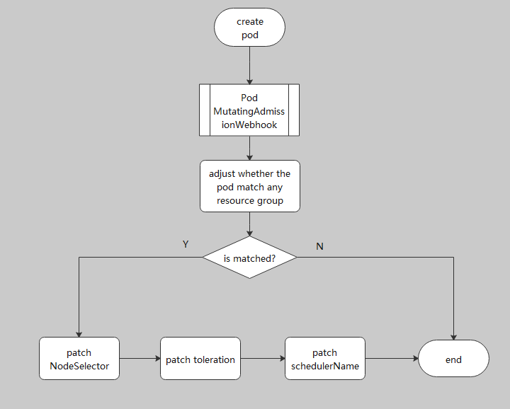

# multi-scheduling

## Backgrounds
In a cluster, there are Multiple Schedulers for different workload, e.g. default scheduler for system daemon, and volcano scheduler for biz workload.
when the schedulers work in parallel, it is easy to occur the resource conflicts.

## Motivation

- Classify Pods to different resource group and each resource group specifies its own scheduler.
- There are no resource conflicts when Multiple schedulers work in parallel.
## Design Action

To devide the cluster resource, user need to set the taints and labels on cluster nodes and set the corresponding tolerations and nodeSelector on the pods. It will need a lot of manpower to modify the yaml files. 
For less user operation, volcano supports the action about the pod parts automatically and adds a new MutatingAdmissionWebhook in volcano admission deployment to do it.

### New configmap (volcano-admission-configmap)

The configmap defines some resource groups, each resource group contains
- The identification information of the pod object, volcano support two fields:
  - Namespace field
  - Annotation field
- The pod's data volcano needs to patch, volcano support to patch the fields and the fields are optional and not mandatory. User can set them according the application scenario.
  - Tolerations 
  - NodeSelector 
  - SchedulerName

If the object field is not setted, it is filled with a default as the following:
````
- resourceGroup: XXX                   
  object:
    key: annotation                             # set the field and the value to be matched
    value:
    - "volcano.sh/resource-group: XXX"          # XXX is the value in resourceGroup field
````

For example
````
apiVersion: v1
kind: ConfigMap
metadata:
  name: volcano-admission-configmap
  namespace: volcano-system
data:
  volcano-admission.conf: |
    resourceGroups:
    - resourceGroup: management                    # set the resource group name
      object:
        key: namespace                             # set the field and the value to be matched
        value:
        - mng-ns-1
      schedulerName: default-scheduler             # set the scheduler for patching
      tolerations:                                 # set the tolerations for patching
      - effect: NoSchedule
        key: taint
        operator: Exists
      labels:
        volcano.sh/nodetype: management           # set the nodeSelector for patching
    - resourceGroup: cpu
      object:
        key: annotation
        value:
        - "volcano.sh/resource-group: cpu"
      schedulerName: volcano
      labels:
        volcano.sh/nodetype: cpu
    - resourceGroup: gpu                          # if the object is unsetted, default is:  the key is annotation,
      schedulerName: volcano                      # the annotation key is fixed and is "volcano.sh/resource-group", The corresponding value is the resourceGroup field
      labels:
        volcano.sh/nodetype: gpu
````

### The pod mutate process 


If the pod matches serval resource groups, volcano will match the resource group by sort.


## Usage
### case 1 
Default scheduler for system daemon, and volcano scheduler for biz workload
Here is a cluster as the following:

|node| label | taint|
|----|-----|-----|
|node1| volcano.sh/nodetype: management| management-taint:NoSchedule|
|node2| none| none|

|pod | kind | namespace|
|----|----|----|
|deployment-A|deployment| mng-ns-1| 
|volcano-job-B|volcano job | default|

1. Edit volcano-admission-configmap 
````
apiVersion: v1
kind: ConfigMap
metadata:
  name: volcano-admission-configmap
  namespace: volcano-system
data:
  volcano-admission.conf: |
    resourceGroups:
    - resourceGroup: management                    # set the resource group name
      object:
        key: namespace                             # set the field and the value to be matched
        value:
        - mng-ns-1
      schedulerName: default-scheduler             # set the scheduler for patching
      tolerations:                                 # set the tolerations for patching
      - effect: NoSchedule
        key: management-taint
        operator: Exists
      labels:
        volcano.sh/nodetype: management           # set the nodeSelector for patching
````

2. Submit deployment-A and volcano-job-B

3. Check the deployment Pod 
 
````
deployment-A:
....
nodeSelector:
  volcano.sh/nodetype: management
...
schedulerName: default-scheduler
...
tolerations:
  - effect: NoSchedule
    key: management-taint
    operator: Exists
    
volcano-job-B:
....
  <none>
....
````
4. Check the result of the pod's scheduling 
````
The pod in deployment-A is scheduled to node1.
the pod in volcano-job-B is scheduled to node2.
````

### case 2 

Here is a cluster as the following:

|node|label|
|----|-----|
|node1| volcano.sh/nodetype: cpu|
|node2| volcano.sh/nodetype: gpu|

|volcano job | annotation|
|----|----|
|job-A|volcano.sh/resource-group: cpu| 
|job-B|volcano.sh/resource-group: gpu|

1. Edit volcano-admission-configmap
````
apiVersion: v1
kind: ConfigMap
metadata:
  name: volcano-admission-configmap
  namespace: volcano-system
data:
  volcano-admission.conf: |
    resourceGroups:
    - resourceGroup: cpu
      object:
        key: annotation
        value:
        - "volcano.sh/resource-group: cpu"
      schedulerName: volcano
      labels:
        volcano.sh/nodetype: cpu
    - resourceGroup: gpu                          
      schedulerName: volcano                 
      labels:
        volcano.sh/nodetype: gpu
````
2. Submit job-A and job-B

3. Check the Pod information 

````
job-A:
....
nodeSelector:
   volcano.sh/nodetype: cpu
...
schedulerName: volcano
....

job-B:
....
nodeSelector:
   volcano.sh/nodetype: gpu
...
schedulerName: volcano
....
 ````
4. Check the result of the pod's scheduling
````
The pod in job-A is scheduled to node1.
The pod in job-B job is scheduled to node2.
````
## NOTE

Enable this feature may modify pod information and affect resource utilization.
- The feature will divide the cluster resource and may decrease the resource usage.
- The feature will add some additional information to the pods, such as tolerations and nodeSelector data.

