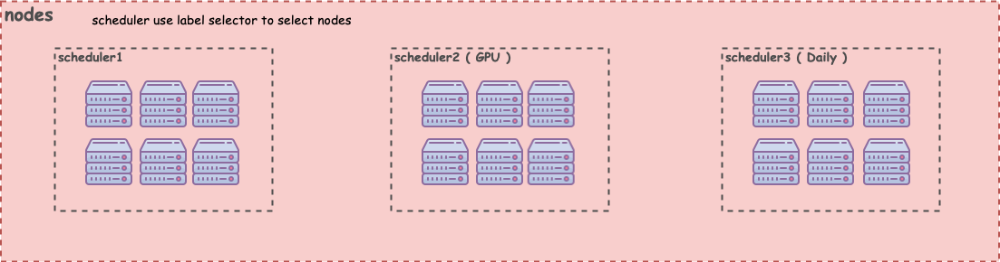

# Multi volcano schedulers

## Introduction

Sometimes we may want to the cluster be divided into multi sections for different usage.



### Advantage
- Each section can keep isolated.
- Each section include full scheduling capability.
- Support user monopolizing some nodes.
- System services can be scheduled in specific nodes.

### Usage

#### Specify scheduler
You should name each scheduler, and add `selector` to filter nodes.

`selector`(label query) supports ':'.(e.g. --node-selector key1:value1,key2:value2)

```diff
# Scheduler deployment
...
     spec:
       containers:
         - args:
             - --logtostderr
             - --scheduler-conf=/volcano.scheduler/volcano-scheduler.conf
+            - --scheduler-name=gpu
+            - --node-selector=zone:gpu
             - -v=3
             - 2>&1
```

#### Specify controller

Controller need to specify multi `scheduler-name`s

```diff
# Controller deployment
...
     spec:
       containers:
         - args:
             - --logtostderr
+            - --scheduler-name=volcano
+            - --scheduler-name=gpu
             - -v=4
             - 2>&1
```

#### Specify Job

```diff
 apiVersion: batch.volcano.sh/v1alpha1
 kind: Job
 metadata:
   name: run-gpu
 spec:
   minAvailable: 3
+  schedulerName: gpu   # need to specify scheduler name
 tasks:
 - replicas: 3
   name: worker
   template:
     metadata:
       name: worker
     spec:
       containers:
       - image: tensorflow/tensorflow:latest-gpu
         name: tensorflow
         resources:
           requests:
             cpu: 1
             memory: 10Gi
             nvidia.com/gpu: 2
```

#### Specify Deployments

User also can use vc-scheduler to deploy system services by changing `schedulerName` from Deployment.

```yaml
apiVersion: apps/v1
kind: Deployment
metadata:
  name: nginx
  labels:
    app: nginx
spec:
  replicas: 3
  selector:
    matchLabels:
      app: nginx
  template:
    metadata:
      labels:
        app: nginx
    spec:
      schedulerName: volcano
      containers:
        - name: nginx
          image: nginx
```