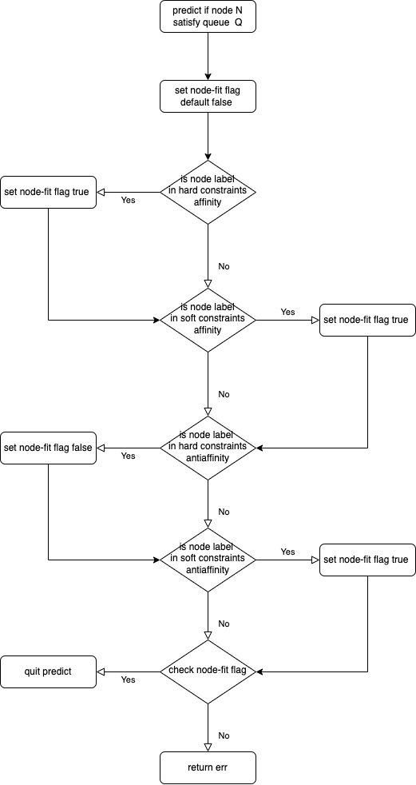
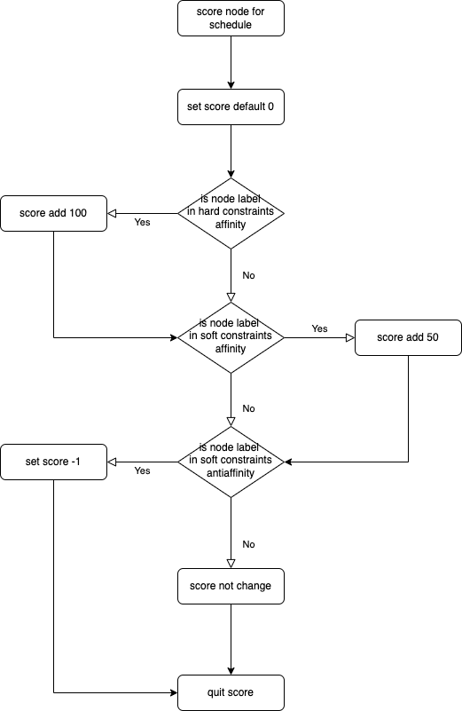

## Introduction

nodegroup is the nodes with the same specified label, on the basis of nodegroup, different queues and nodegroups have some relationship about affinity and anti-affinity.

case1: different departments (like nlp and recommend) use different nodes (nodegroup1 and nodegroup2), nlp queue uses nodegroup1 first, and nodegroup2 can also be used when resources are insufficient, but recommend queue can only use nodegroup2.


case2: recommend queue can use private cloud nodes or public cloud nodes, but tts queue can only use private cloud nodes because its task takes a long time, which is not easy to the release of nodes in public cloud (for saving money)


case3: An organization has a hierarchical structure (like engineering -> backend-team and engineering -> frontend-team). The parent queue (engineering) is associated with production nodegroup, and the jobs submitted by child queues (backend-team, frontend-team) are automatically associated with the nodegroup associated with the parent queue, unless the child queue specifies its own nodegroup affinity.

## Solution

1. First, we need mark out some nodes(add `volcano.sh/nodegroup-name` labels) which are the same group.
2. Second, we need to express the relationship between queue and nodegroup, such as affinity and anti-affinity, so I add the `queue.spec.affinity` field in Queue.
   ```yaml
   apiVersion: scheduling.volcano.sh/v1beta1
   kind: Queue
   metadata:
     name: default
     spec:
       reclaimable: true
       weight: 1
       affinity:            # added field
         nodeGroupAffinity:
           requiredDuringSchedulingIgnoredDuringExecution:
           - groupname1
           - gropuname2
           preferredDuringSchedulingIgnoredDuringExecution:
           - groupname1
         nodeGroupAntiAffinity:
           requiredDuringSchedulingIgnoredDuringExecution:
           - groupname3
           - gropuname4
           preferredDuringSchedulingIgnoredDuringExecution:
           - groupname3
   ```

### Hierarchical Queue Support

The nodegroup plugin supports hierarchical queue with affinity inheritance. This feature allows child queues to inherit nodegroup affinity configurations from their parent queues when they don't have explicit affinity settings.

#### Inheritance Rules

1. **Direct Inheritance**: A child queue without affinity configuration inherits from its immediate parent queue.
2. **Ancestor Inheritance**: If the parent queue also lacks affinity configuration, the child queue inherits from the nearest ancestor that has affinity configured.
3. **Root Queue Inheritance**: Queues without explicit parent configuration are considered children of the root queue and can inherit its affinity settings.
4. **Override Capability**: Child queues can override inherited affinity by specifying their own affinity configuration.

#### Hierarchy Examples

**Example 1: Direct Parent Inheritance**
```yaml
# Root queue with nodegroup affinity
apiVersion: scheduling.volcano.sh/v1beta1
kind: Queue
metadata:
  name: root
spec:
  weight: 1
  affinity:
    nodeGroupAffinity:
      requiredDuringSchedulingIgnoredDuringExecution:
      - production

---
# Parent queue without affinity (inherits from root)
apiVersion: scheduling.volcano.sh/v1beta1
kind: Queue
metadata:
  name: engineering
spec:
  weight: 1
  parent: root

---
# Child queue without affinity (inherits from root through engineering)
apiVersion: scheduling.volcano.sh/v1beta1
kind: Queue
metadata:
  name: backend-team
spec:
  weight: 1
  parent: engineering
```

**Example 2: Affinity Override**
```yaml
# Child queue with its own affinity (overrides inheritance)
apiVersion: scheduling.volcano.sh/v1beta1
kind: Queue
metadata:
  name: frontend-team
spec:
  weight: 1
  parent: engineering
  affinity:
    nodeGroupAffinity:
      requiredDuringSchedulingIgnoredDuringExecution:
      - frontend
```

affinity configure:
1. affinity.nodeGroupAffinity.requiredDuringSchedulingIgnoredDuringExecution, hard constraints, such as `nlp = nodegroup1,nodegroup2`, it means that task in queue=nlp can ony run on the nodes in nodegroup1 or nodegroup2.
2. affinity.nodeGroupAffinity.preferredDuringSchedulingIgnoredDuringExecution, soft constraints, such as `nlp = nodegroup1`, it means that task in queue=nlp runs on nodegroup1 first, but if the resources of nodegroup1 is insufficient, it can also run on other nodegroups. Combine rule1 and rule2, task in queue=nlp runs on nodegroup1 first,  but if the resources of nodegroup1 is insufficient, it can also run on nodegroup2.
3. affinity.nodeGroupAntiAffinity.requiredDuringSchedulingIgnoredDuringExecution, hard constraints, such as `nlp = nodegroup1`, it means that task in queue=nlp can run on any nodegroups but nodegroup1.
4. affinity.nodeGroupAntiAffinity.preferredDuringSchedulingIgnoredDuringExecution, soft constraints, such as `nlp = nodegroup1`, it means that task in queue=nlp runs on any other nodegroups, but if the resources of other nodegroup is insufficient, it can also run on nodegroup1.

we also need to enable nodegroup plugin.

```yaml
actions: "allocate, backfill, preempt, reclaim"
tiers:
- plugins:
  - name: priority
  - name: gang
  - name: conformance
- plugins:
  - name: drf
  - name: predicates
  - name: proportion
  - name: nodegroup
    enableHierarchy: true  # Enable hierarchical support
```

risk: The resources of the queue can not be too different from the resources of the nodegroup(such as queue.capability.memory = 1024G,but all the memory of binding nodegroup is 512G), otherwise it may cause that task can be scheduled to run from the queue's point of view, but cannot find a suitable node.

## Implement

Hard constraints are implemented by using PredicateFn, and soft constraints are implemented by using NodeOrderFn.

predict flow chart:



score flow chart:

