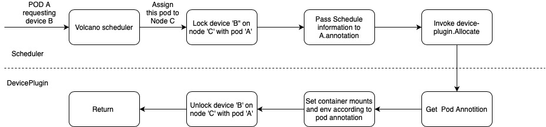

# Node Lock

## Introduction

`Node Lock` is a mechanism to ensure only one pod is requesting certain third-party resource on each node. In order to do this, we lock certain third-party resources on target node during `schedule.allocate` phase, and unlock them after all related resources have been successfully allocated during `devicePlugin.Allocate`

## Backguards

We intended to provide volcano the ability to share third-party resources link GPU,NPU,etc in the near future. These resources are usually registered and allocated in a daemonset called `device plugin`. When a pod requests any third-party resource, the api-server send an `AllocateRequest` to device plugin, containing the target device uuid it requests. However, it does not contain any information about the pod or container requesting the device, so it is impossible for deviceplugin to access the annotation of pod, because is does not know which pod sends this request.
Using `Node Lock` will resolve this problem because only one pod is requesting this resource on this node. So, device-plugin can access additional information in pod.annotations written by scheduler and will be able to do more fine-grained work As the figure shown below:

## Implementation

Node Lock is implemented in the form of modifying node annotition. Each device will use its own node-lock. It contains the pod owning this lock, and timestamp. Releasing the lock means delete this annotation. Examples are shown below:

### PODA locks resource "GPU" and "NPU" on node_A

node_A.annotations["gpu"]="2022-10-28T03:10:22Z_PODA"
node_A.annotations["npu"]="2022-10-28T03:10:22Z_PODA"

### PODA unlocks resource "NPU" on node_A

node_A.annotations["gpu"]="2022-10-28T03:10:22Z_PODA"

### PODA unlocks resource "GPU" on node_A

both annotation "gpushare" and "npushare" are deleted